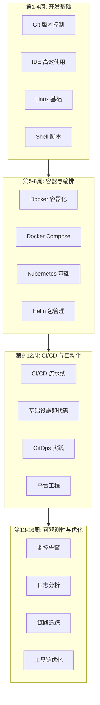
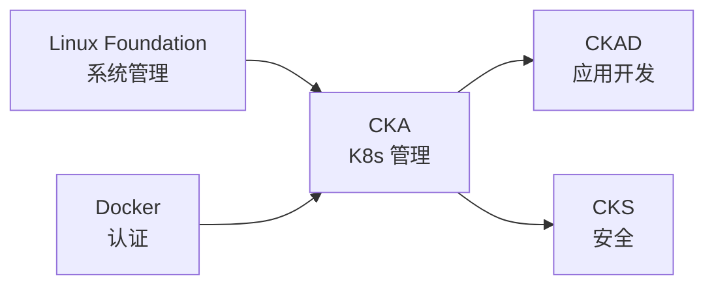

# 开发工具 16周学习路线图

> 从零基础到 DevOps 专家的完整学习路径

---

## 🗺️ 学习路线图概览

---

## 📅 详细学习计划

### 第1周: Git 基础

**学习目标**: 掌握版本控制核心概念

| 天数 | 主题 | 实践任务 |
|------|------|----------|
| 第1天 | Git 安装与配置 | 配置 Git 环境 |
| 第2天 | 基础操作 (add, commit, push) | 创建第一个仓库 |
| 第3天 | 分支管理 | 分支练习 |
| 第4天 | 合并与冲突解决 | 模拟团队协作 |
| 第5天 | 撤销与回退 | 各种恢复场景 |
| 第6天 | GitHub 工作流 | Fork + PR |
| 第7天 | 周复习 | 完成 Git 测验 |

---

### 第2周: IDE 高效使用

**学习目标**: 提升编码效率

| 天数 | 主题 | 实践任务 |
|------|------|----------|
| 第1天 | VS Code 基础 | 安装与配置 |
| 第2天 | 快捷键与技巧 | 效率练习 |
| 第3天 | 扩展生态 | 安装必备扩展 |
| 第4天 | 调试功能 | 断点调试练习 |
| 第5天 | 集成终端 | 终端工作流 |
| 第6天 | AI 辅助编程 | Copilot 使用 |
| 第7天 | 周复习 | 配置优化 |

---

### 第3周: Linux 基础

**学习目标**: 掌握 Linux 命令行

| 天数 | 主题 | 实践任务 |
|------|------|----------|
| 第1天 | 文件系统操作 | 文件管理 |
| 第2天 | 文本处理工具 | grep, awk, sed |
| 第3天 | 进程管理 | ps, top, kill |
| 第4天 | 网络工具 | curl, netstat |
| 第5天 | 权限管理 | chmod, chown |
| 第6天 | 包管理 | apt/yum 使用 |
| 第7天 | 周复习 | 综合练习 |

---

### 第4周: Shell 脚本编程

**学习目标**: 自动化日常任务

| 天数 | 主题 | 实践任务 |
|------|------|----------|
| 第1天 | Shell 基础语法 | 变量、条件 |
| 第2天 | 循环与控制 | for, while |
| 第3天 | 函数与参数 | 函数封装 |
| 第4天 | 文本处理 | 日志分析脚本 |
| 第5天 | 错误处理 | 健壮性处理 |
| 第6天 | 实用工具脚本 | 开发辅助脚本 |
| 第7天 | 周复习 | 项目1准备 |

---

### 第5周: Docker 基础

**学习目标**: 容器化应用

| 天数 | 主题 | 实践任务 |
|------|------|----------|
| 第1天 | Docker 概念 | 安装与配置 |
| 第2天 | 镜像管理 | pull, build, push |
| 第3天 | 容器生命周期 | run, stop, rm |
| 第4天 | Dockerfile 编写 | 构建应用镜像 |
| 第5天 | 数据持久化 | volumes |
| 第6天 | 网络配置 | 容器通信 |
| 第7天 | 周复习 | 多容器应用 |

---

### 第6周: Docker 高级

**学习目标**: 优化容器实践

| 天数 | 主题 | 实践任务 |
|------|------|----------|
| 第1天 | 多阶段构建 | 优化镜像大小 |
| 第2天 | 安全最佳实践 | 非 root 用户 |
| 第3天 | Docker Compose | 多服务编排 |
| 第4天 | 开发环境 | Dev Containers |
| 第5天 | 镜像扫描 | Trivy 集成 |
| 第6天 | 私有仓库 | Harbor 部署 |
| 第7天 | 周复习 | 项目优化 |

---

### 第7周: Kubernetes 基础

**学习目标**: K8s 核心概念

| 天数 | 主题 | 实践任务 |
|------|------|----------|
| 第1天 | K8s 架构 | 安装 minikube |
| 第2天 | Pod 管理 | 创建 Pod |
| 第3天 | Deployment | 应用部署 |
| 第4天 | Service | 服务暴露 |
| 第5天 | ConfigMap/Secret | 配置管理 |
| 第6天 | 存储 | PV/PVC |
| 第7天 | 周复习 | 应用部署 |

---

### 第8周: Kubernetes 高级

**学习目标**: 生产级 K8s

| 天数 | 主题 | 实践任务 |
|------|------|----------|
| 第1天 | Ingress | 路由配置 |
| 第2天 | HPA | 自动扩缩容 |
| 第3天 | RBAC | 权限控制 |
| 第4天 | Helm | 包管理 |
| 第5天 | 监控基础 | Metrics Server |
| 第6天 | 故障排查 | 调试技巧 |
| 第7天 | 周复习 | 项目2准备 |

---

### 第9周: CI/CD 基础

**学习目标**: 自动化流水线

| 天数 | 主题 | 实践任务 |
|------|------|----------|
| 第1天 | CI/CD 概念 | 理解流程 |
| 第2天 | GitHub Actions | 基础工作流 |
| 第3天 | 构建阶段 | 自动化构建 |
| 第4天 | 测试阶段 | 测试集成 |
| 第5天 | 部署阶段 | 自动部署 |
| 第6天 | 制品管理 | Artifact 存储 |
| 第7天 | 周复习 | 完整流水线 |

---

### 第10周: CI/CD 高级

**学习目标**: 复杂流水线

| 天数 | 主题 | 实践任务 |
|------|------|----------|
| 第1天 | 工作流优化 | 缓存策略 |
| 第2天 | 矩阵构建 | 多环境测试 |
| 第3天 | 安全扫描 | SAST/SCA |
| 第4天 | 多环境部署 | dev/staging/prod |
| 第5天 | 审批流程 | 人工审批 |
| 第6天 | 回滚策略 | 快速回滚 |
| 第7天 | 周复习 | 生产流水线 |

---

### 第11周: 基础设施即代码

**学习目标**: IaC 实践

| 天数 | 主题 | 实践任务 |
|------|------|----------|
| 第1天 | Terraform 基础 | HCL 语法 |
| 第2天 | Provider 配置 | AWS  provider |
| 第3天 | Resource 管理 | 资源定义 |
| 第4天 | State 管理 | 远程状态 |
| 第5天 | Module 开发 | 模块化 |
| 第6天 | 工作区 | 多环境管理 |
| 第7天 | 周复习 | 基础设施部署 |

---

### 第12周: GitOps

**学习目标**: GitOps 工作流

| 天数 | 主题 | 实践任务 |
|------|------|----------|
| 第1天 | GitOps 概念 | 理解原理 |
| 第2天 | ArgoCD 安装 | 部署 ArgoCD |
| 第3天 | 应用配置 | Git 同步 |
| 第4天 | 自动同步 | 自动部署 |
| 第5天 | 多集群管理 | 跨集群部署 |
| 第6天 | 密钥管理 | Sealed Secrets |
| 第7天 | 周复习 | 项目3准备 |

---

### 第13周: 监控基础

**学习目标**: 可观测性入门

| 天数 | 主题 | 实践任务 |
|------|------|----------|
| 第1天 | 监控概念 | 黄金指标 |
| 第2天 | Prometheus | 部署配置 |
| 第3天 | 指标收集 | Exporters |
| 第4天 | Grafana | 仪表盘 |
| 第5天 | 告警配置 | Alertmanager |
| 第6天 | 自定义指标 | 应用埋点 |
| 第7天 | 周复习 | 监控体系 |

---

### 第14周: 日志与追踪

**学习目标**: 全面可观测性

| 天数 | 主题 | 实践任务 |
|------|------|----------|
| 第1天 | 日志聚合 | Loki/EFK |
| 第2天 | 日志查询 | LogQL |
| 第3天 | 链路追踪 | Jaeger |
| 第4天 | 应用埋点 | OpenTelemetry |
| 第5天 | 关联分析 | 日志-指标-追踪 |
| 第6天 | 告警优化 | 降噪策略 |
| 第7天 | 周复习 | 可观测平台 |

---

### 第15周: 平台工程

**学习目标**: 内部开发者平台

| 天数 | 主题 | 实践任务 |
|------|------|----------|
| 第1天 | 平台工程概念 | IDP 设计 |
| 第2天 | Backstage | 门户搭建 |
| 第3天 | 自助服务 | 模板开发 |
| 第4天 | 成本优化 | FinOps |
| 第5天 | DORA 指标 | 度量体系 |
| 第6天 | 团队推广 | 平台采用 |
| 第7天 | 周复习 | 平台演示 |

---

### 第16周: 综合实战

**学习目标**: 端到端 DevOps 平台

| 天数 | 主题 | 实践任务 |
|------|------|----------|
| 第1天 | 架构设计 | 平台规划 |
| 第2天 | 基础设施 | Terraform 部署 |
| 第3天 | 应用部署 | K8s + GitOps |
| 第4天 | 流水线 | 完整 CI/CD |
| 第5天 | 可观测性 | 监控体系 |
| 第6天 | 安全集成 | DevSecOps |
| 第7天 | 项目总结 | 成果展示 |

---

## 📚 学习资源

### 官方文档

- [Git 官方文档](https://git-scm.com/doc)
- [Docker 文档](https://docs.docker.com/)
- [Kubernetes 文档](https://kubernetes.io/docs/)
- [Terraform 文档](https://developer.hashicorp.com/terraform/docs)
- [GitHub Actions](https://docs.github.com/en/actions)

### 推荐书籍

- 《Pro Git》
- 《Docker 深度实践》
- 《Kubernetes in Action》
- 《Terraform: Up & Running》
- 《The DevOps Handbook》

### 在线课程

- KodeKloud DevOps Learning Path
- Coursera - DevOps on AWS
- Udemy - Docker & Kubernetes
- Pluralsight - CI/CD Path

---

## ✅ 每周检查清单

### 每日任务
- [ ] 阅读当日主题文档
- [ ] 完成实践练习
- [ ] 记录学习笔记
- [ ] 解决遇到的问题

### 每周任务
- [ ] 完成周复习
- [ ] 通过知识测验
- [ ] 更新学习进度
- [ ] 规划下周学习

### 阶段任务
- [ ] 完成里程碑项目
- [ ] 参加社区讨论
- [ ] 分享学习心得
- [ ] 更新技能清单

---

## 🎯 技能认证路径

**推荐认证**:

| 认证 | 难度 | 准备时间 | 前置要求 |
|------|------|----------|----------|
| Docker Certified Associate | ⭐⭐ | 4-6周 | Docker 基础 |
| CKA | ⭐⭐⭐ | 6-8周 | K8s 基础 |
| CKAD | ⭐⭐⭐ | 4-6周 | CKA 推荐 |
| Terraform Associate | ⭐⭐ | 4周 | Terraform 基础 |
| AWS DevOps Engineer | ⭐⭐⭐ | 8-12周 | AWS 基础 |

---

祝学习顺利！🎉
