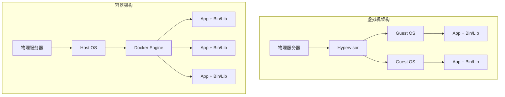

# Docker 完全指南

> 从入门到精通的容器化实践手册

---

## 目录

1. [Docker 核心概念](#核心概念)
2. [Dockerfile 最佳实践](#dockerfile-最佳实践)
3. [Docker Compose 深入](#docker-compose-深入)
4. [容器安全](#容器安全)
5. [性能优化](#性能优化)
6. [生产环境部署](#生产环境部署)

---

## 核心概念

### 容器 vs 虚拟机



### 镜像分层机制

```dockerfile
# 每个指令创建一个新层
FROM node:20-alpine          # Layer 1: 基础镜像
WORKDIR /app                 # Layer 2: 工作目录
COPY package*.json ./        # Layer 3: 依赖文件
RUN npm ci                   # Layer 4: 安装依赖
COPY . .                     # Layer 5: 应用代码
CMD ["node", "index.js"]     # Layer 6: 启动命令
```

**层缓存原理**:
- 层是不可变的
- 如果某层改变，其后的所有层都需要重建
- 将不经常变化的内容放在前面

---

## Dockerfile 最佳实践

### 优化构建缓存

```dockerfile
# ❌ 不好: 每次代码变更都会重新安装依赖
FROM node:20-alpine
COPY . /app
WORKDIR /app
RUN npm ci

# ✅ 好: 分离依赖安装和应用代码
FROM node:20-alpine
WORKDIR /app

# 1. 先复制依赖文件 (利用缓存)
COPY package*.json ./
RUN npm ci --only=production

# 2. 再复制应用代码
COPY . .
```

### 多阶段构建

```dockerfile
# 构建阶段
FROM node:20-alpine AS builder
WORKDIR /app
COPY package*.json ./
RUN npm ci
COPY . .
RUN npm run build

# 生产阶段 (更小的镜像)
FROM node:20-alpine AS production
WORKDIR /app

# 只复制必要的文件
COPY --from=builder /app/dist ./dist
COPY --from=builder /app/node_modules ./node_modules
COPY --from=builder /app/package.json ./

# 非 root 用户
USER node

CMD ["node", "dist/main.js"]
```

**优化效果**:
```
原始镜像: 1.2 GB
多阶段构建后: 180 MB
减少: 85%
```

### 安全最佳实践

```dockerfile
FROM node:20-alpine

# 1. 使用特定版本标签，避免 latest
# FROM node:alpine  ❌ 不好
# FROM node:20.10.0-alpine3.18  ✅ 更好

# 2. 创建非 root 用户
RUN addgroup -g 1001 -S nodejs && \
    adduser -S nodejs -u 1001

# 3. 使用 distroless 镜像 (极致精简)
# FROM gcr.io/distroless/nodejs20-debian11

WORKDIR /app

# 4. 设置正确的文件权限
COPY --chown=nodejs:nodejs . .
RUN npm ci --only=production && npm cache clean --force

# 5. 只读根文件系统
# 在 docker run 中使用: --read-only
# 配合 tmpfs: --tmpfs /tmp:noexec,nosuid,size=100m

# 6. 最小化暴露端口
EXPOSE 3000

# 7. 健康检查
HEALTHCHECK --interval=30s --timeout=3s --start-period=5s --retries=3 \
    CMD node healthcheck.js || exit 1

USER node

CMD ["node", "index.js"]
```

---

## Docker Compose 深入

### 开发环境配置

```yaml
version: '3.8'

services:
  app:
    build:
      context: .
      target: development
    ports:
      - "3000:3000"
    volumes:
      # 绑定挂载源代码
      - .:/app
      # 匿名卷保持 node_modules
      - /app/node_modules
    environment:
      - NODE_ENV=development
      - DATABASE_URL=postgres://postgres:password@db:5432/app
      - REDIS_URL=redis://redis:6379
      - DEBUG=app:*
    command: npm run dev
    depends_on:
      db:
        condition: service_healthy
      redis:
        condition: service_started

  db:
    image: postgres:16-alpine
    environment:
      POSTGRES_USER: postgres
      POSTGRES_PASSWORD: password
      POSTGRES_DB: app
    volumes:
      - postgres_data:/var/lib/postgresql/data
      - ./init.sql:/docker-entrypoint-initdb.d/init.sql
    ports:
      - "5432:5432"
    healthcheck:
      test: ["CMD-SHELL", "pg_isready -U postgres"]
      interval: 5s
      timeout: 5s
      retries: 5

  redis:
    image: redis:7-alpine
    ports:
      - "6379:6379"
    volumes:
      - redis_data:/data
    command: redis-server --appendonly yes

  # 本地邮件服务
  mailhog:
    image: mailhog/mailhog:latest
    ports:
      - "1025:1025"  # SMTP
      - "8025:8025"  # Web UI

  # 本地对象存储
  minio:
    image: minio/minio:latest
    ports:
      - "9000:9000"
      - "9001:9001"
    environment:
      MINIO_ROOT_USER: minioadmin
      MINIO_ROOT_PASSWORD: minioadmin
    volumes:
      - minio_data:/data
    command: server /data --console-address ":9001"

volumes:
  postgres_data:
  redis_data:
  minio_data:
```

### 生产环境配置

```yaml
version: '3.8'

services:
  app:
    build:
      context: .
      target: production
    image: myapp:${VERSION:-latest}
    deploy:
      replicas: 3
      update_config:
        parallelism: 1
        delay: 10s
        failure_action: rollback
        order: start-first
      rollback_config:
        parallelism: 1
        delay: 10s
      restart_policy:
        condition: on-failure
        delay: 5s
        max_attempts: 3
      resources:
        limits:
          cpus: '1.0'
          memory: 512M
        reservations:
          cpus: '0.5'
          memory: 256M
    environment:
      - NODE_ENV=production
    networks:
      - frontend
      - backend
    logging:
      driver: "json-file"
      options:
        max-size: "10m"
        max-file: "3"

  nginx:
    image: nginx:alpine
    ports:
      - "80:80"
      - "443:443"
    volumes:
      - ./nginx.conf:/etc/nginx/nginx.conf:ro
      - ./ssl:/etc/nginx/ssl:ro
    depends_on:
      - app
    networks:
      - frontend

networks:
  frontend:
    driver: overlay
  backend:
    driver: overlay
    internal: true  # 无外部访问
```

---

## 容器安全

### 安全扫描

```bash
#!/bin/bash
# container-security-scan.sh

IMAGE=$1

echo "🔒 开始安全扫描: $IMAGE"

# Trivy 扫描
echo "📋 Trivy 漏洞扫描..."
trivy image \
    --severity HIGH,CRITICAL \
    --format table \
    --exit-code 1 \
    $IMAGE

# Docker Scout
echo "📋 Docker Scout 分析..."
docker scout cves $IMAGE

# Snyk 扫描 (可选)
# snyk container test $IMAGE --severity-threshold=high

# 检查敏感信息
echo "📋 检查敏感文件..."
docker run --rm --entrypoint sh $IMAGE -c "
    find / -type f \( \\
        -name '*.pem' -o \\
        -name '*.key' -o \\
        -name '.env' -o \\
        -name 'id_rsa' \\
    \) 2>/dev/null | head -20
"

# CIS Docker 基准检查
echo "📋 CIS 基准检查..."
docker run --rm -v /var/run/docker.sock:/var/run/docker.sock \
    docker/docker-bench-security
```

### 运行时安全

```bash
# 使用用户命名空间
dockerd --userns-remap=default

# 限制容器能力
docker run \
    --cap-drop=ALL \
    --cap-add=NET_BIND_SERVICE \
    --security-opt=no-new-privileges:true \
    --read-only \
    --tmpfs /tmp:noexec,nosuid,size=100m \
    myapp

# 资源限制
docker run \
    --memory=512m \
    --memory-swap=512m \
    --cpus=1.0 \
    --pids-limit=100 \
    myapp
```

---

## 性能优化

### 镜像优化技巧

```dockerfile
# 1. 选择最小基础镜像
FROM node:20-alpine     # 180 MB
# FROM node:20-slim    # 200 MB
# FROM node:20         # 1.1 GB ❌

# 2. 合并 RUN 指令减少层数
RUN apk add --no-cache \
    python3 \
    make \
    g++ \
    && rm -rf /var/cache/apk/*

# 3. 使用 .dockerignore
cat > .dockerignore << 'EOF'
node_modules
npm-debug.log
.git
.gitignore
README.md
.env
.env.local
.env.production
.nyc_output
coverage
.nyc_output
.DS_Store
*.log
EOF

# 4. 利用构建缓存
# 将变化频率低的放在前面
COPY package*.json ./
RUN npm ci
COPY . .
```

### 运行时优化

```bash
# 使用 host 网络模式 (开发环境)
docker run --network host myapp

# 使用卷缓存
docker run -v $(pwd):/app:cached myapp

# 调整日志驱动
docker run --log-driver json-file \
    --log-opt max-size=10m \
    --log-opt max-file=3 \
    myapp

# CPU 亲和性
docker run --cpuset-cpus="0-3" myapp
```

---

## 生产环境部署

### Swarm 部署

```bash
# 初始化 Swarm
docker swarm init --advertise-addr <IP>

# 部署栈
docker stack deploy -c docker-compose.prod.yml myapp

# 查看服务
docker service ls
docker service ps myapp_app
docker service logs myapp_app

# 扩缩容
docker service scale myapp_app=5

# 滚动更新
docker service update --image myapp:v2.0 myapp_app
```

### 健康检查实践

```dockerfile
# Dockerfile
HEALTHCHECK --interval=30s --timeout=3s --start-period=10s --retries=3 \
    CMD curl -f http://localhost:3000/health || exit 1
```

```javascript
// healthcheck.js - Node.js 健康检查
const http = require('http');

const healthCheck = async () => {
  const checks = await Promise.all([
    checkDatabase(),
    checkRedis(),
    checkExternalAPI()
  ]);
  
  const allHealthy = checks.every(c => c.healthy);
  
  return {
    status: allHealthy ? 'healthy' : 'unhealthy',
    checks: checks,
    timestamp: new Date().toISOString()
  };
};

// Kubernetes 探针
const k8sProbes = {
  liveness: (req, res) => {
    // 进程是否存活
    res.status(200).json({ status: 'alive' });
  },
  
  readiness: async (req, res) => {
    // 是否准备好接收流量
    const ready = await checkDependencies();
    res.status(ready ? 200 : 503).json({ ready });
  },
  
  startup: async (req, res) => {
    // 应用是否已启动
    const started = await checkApplicationStarted();
    res.status(started ? 200 : 503).json({ started });
  }
};
```

---

## 总结

掌握 Docker 的要点:

1. **理解镜像分层**: 优化构建缓存
2. **多阶段构建**: 精简生产镜像
3. **安全第一**: 非 root 用户、最小权限
4. **开发/生产一致**: Docker Compose 分离配置
5. **可观测性**: 健康检查、日志管理
6. **持续优化**: 镜像大小、构建速度、运行时性能

持续实践，成为容器化专家！
