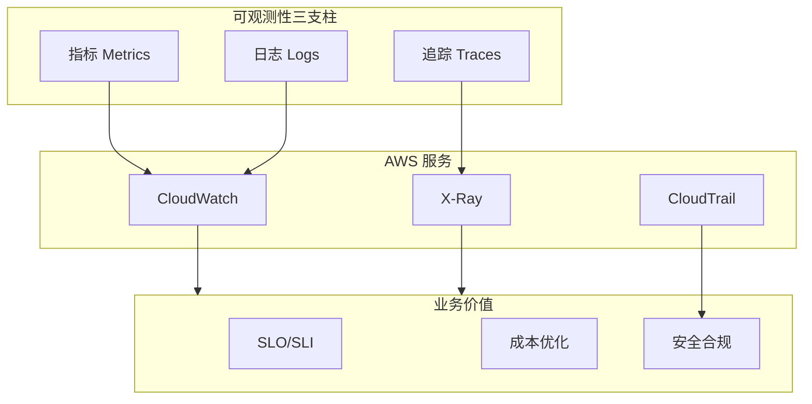

# 监控与可观测性技术资源

> 从基础设施监控到业务价值实现，构建经济高效的可观测体系

---

## 主题介绍

本主题全面讲解 AWS 监控与可观测性服务，特别关注：

- **基础设施监控** - CloudWatch、CloudTrail、X-Ray 深度使用
- **业务指标监控** - 自定义指标、SLO/SLI 管理、业务价值度量
- **成本可观测性** - 监控成本优化、架构经济性分析
- **安全监控** - GuardDuty、Security Hub、合规审计

### 核心服务矩阵



---

## 多语言资源

| 语言 | 目录 | 状态 | 规模 |
|------|------|------|------|
| 🇨🇳 中文 | [./zh/](./zh/) | ✅ 可用 | 完整文档 |
| 🇺🇸 English | [./en/](./en/) | 📝 计划中 | 核心文档 |
| 🇯🇵 日本語 | [./ja/](./ja/) | 📝 计划中 | 核心文档 |

---

## 内容清单

### 电子书 (ebooks/)

| 文档 | 说明 |
|------|------|
| `README.md` | 导航索引 |
| `Monitoring_Whitepaper.md` | 技术白皮书 (13章) |
| `Monitoring_Quick_Reference.md` | 速查手册 |
| `Monitoring_Learning_Roadmap.md` | 16周学习路线图 |

### 技术文档 (materials/)

| 文档 | 内容 |
|------|------|
| `cloudwatch_cost_optimization.md` | CloudWatch 成本优化深度指南 |
| `xray_distributed_tracing.md` | X-Ray 分布式追踪实践 |
| `business_metrics_design.md` | 业务指标设计方法论 |
| `security_monitoring_patterns.md` | 安全监控模式 |

---

## 实践项目

| 项目 | 难度 | 技术栈 | 目录 |
|------|------|--------|------|
| 基础设施监控平台 | ⭐ 入门 | CloudWatch + EC2 + Lambda | [./projects/01-infra-monitoring/](./projects/01-infra-monitoring/) |
| APM 与分布式追踪 | ⭐⭐ 进阶 | X-Ray + API Gateway + Lambda + DynamoDB | [./projects/02-apm-distributed-tracing/](./projects/02-apm-distributed-tracing/) |
| 成本可观测性平台 | ⭐⭐⭐ 高级 | CUR + Athena + Cost Explorer + Timestream | [./projects/03-cost-observability/](./projects/03-cost-observability/) |

---

## 快速开始

### 中文用户

```bash
cd zh/ebooks/
cat README.md
```

### 学习路径

1. **新手**: 白皮书第1-4章 → 项目1
2. **进阶**: 白皮书第5-9章 → 项目2
3. **专家**: 全部白皮书 → 项目3

---

## 核心概念

### 可观测性三支柱

```
指标 (Metrics)    →  What?  系统发生了什么
日志 (Logs)       →  Why?   为什么会发生
追踪 (Traces)     →  Where? 在哪里发生
```

### 监控成熟度模型

| 级别 | 名称 | 特征 |
|------|------|------|
| L1 | 基础监控 | 基础设施指标、基础告警 |
| L2 | 应用监控 | APM、自定义业务指标 |
| L3 | 智能可观测 | 关联分析、异常检测 |
| L4 | 业务驱动 | SLO管理、成本归因 |

### 架构经济性公式

```
监控ROI = (避免的损失 + 效率提升 - 监控成本) / 监控成本

其中：
- 避免的损失 = 停机时间减少 × 每分钟收入损失
- 效率提升 = MTTR减少 × 工程师成本
- 监控成本 = CloudWatch + X-Ray + 人力成本
```

---

## 资源统计

| 指标 | 数量 |
|------|------|
| **电子书** | 4本 |
| **技术文档** | 4篇 |
| **实践项目** | 3个 |
| **架构图** | 25+ |
| **代码示例** | 60+ |

---

## 相关主题

- [Streaming](../streaming/) - 实时数据流监控
- [Serverless](../serverless/) - 无服务器监控
- [DevTools](../devtools/) - CI/CD 监控

---

**开始构建您的可观测性平台！** 🚀
