# AWS Monitoring and Observability Learning Roadmap

> 16 Weeks from Beginner to Expert: Building Cost-Effective Observability Systems

---

## Learning Path Overview

```mermaid
flowchart LR
    subgraph Foundation["Foundation Phase (Week 1-4)"]
        CW[CloudWatch<br/>Basics]
        Logs[Log Management]
        Alarms[Alarm Configuration]
    end
    
    subgraph Application["Application Phase (Week 5-8)"]
        XRay[X-Ray<br/>Distributed Tracing]
        APM[APM Practices]
        Custom[Custom Metrics]
    end
    
    subgraph Advanced["Advanced Phase (Week 9-12)"]
        Business[Business Metrics]
        SLO[SLO/SLI Management]
        Security[Security Monitoring]
    end
    
    subgraph Expert["Expert Phase (Week 13-16)"]
        Cost[Cost Optimization]
        Economic[Architecture Economics]
        Platform[Observability Platform]
    end
    
    Foundation --> Application --> Advanced --> Expert
```



---

## Weeks 1-4: Foundation Monitoring Skills

### Week 1: CloudWatch Basics

**Learning Objectives**
- Understand CloudWatch architecture and data flow
- Master metric namespaces and dimensions
- Learn to use CloudWatch console

**Practice Tasks**
```bash
# 1. Create CloudWatch dashboard
# 2. Configure EC2 basic monitoring
# 3. Set up first alarm
```

**Recommended Reading**
- CloudWatch documentation basics
- Whitepaper Chapters 1-2

---

### Week 2: Log Management

**Learning Objectives**
- Master CloudWatch Logs architecture
- Learn log retention policies
- Understand log groups and log streams

**Practice Tasks**
```bash
# 1. Create log group and configure retention
# 2. Use CloudWatch Logs Agent
# 3. Configure Lambda log output
```

**Code Practice**
```python
# Structured logging
import logging
import json

logger = logging.getLogger()
logger.setLevel(logging.INFO)

def lambda_handler(event, context):
    logger.info(json.dumps({
        'event': 'payment_received',
        'amount': event['amount'],
        'request_id': context.aws_request_id
    }))
```

---

### Week 3: CloudWatch Insights

**Learning Objectives**
- Master Logs Insights query syntax
- Learn to analyze log patterns
- Understand field extraction

**Practice Tasks**
```sql
-- Exercise 1: Error statistics
fields @message
| filter @message like /ERROR/
| stats count() by bin(1h)

-- Exercise 2: Latency analysis
fields @duration
| filter @type = "REPORT"
| stats avg(@duration), max(@duration), percentile(@duration, 99)

-- Exercise 3: Business metrics
fields @message
| parse @message "user: * action: *" as user, action
| stats count() by action
```

---

### Week 4: Alerting Strategy

**Learning Objectives**
- Design alerting strategies
- Understand alarm state machine
- Configure SNS notifications

**Practice Tasks**
1. Create tiered alerts (P1-P4)
2. Configure Slack/Email integration
3. Implement alert suppression

**Project Deliverable**
- Configure complete monitoring and alerting for a sample application

---

## Weeks 5-8: Application Performance Monitoring

### Week 5: X-Ray Basics

**Learning Objectives**
- Understand distributed tracing concepts
- Master X-Ray architecture
- Configure service maps

**Practice Tasks**
```python
# X-Ray instrumentation
from aws_xray_sdk.core import xray_recorder, patch_all

patch_all()

@xray_recorder.capture('process_order')
def process_order(order):
    # Business logic
    pass
```

**Lab**
- Enable X-Ray in Lambda
- View service maps
- Analyze trace details

---

### Week 6: OpenTelemetry Integration

**Learning Objectives**
- Understand OpenTelemetry standards
- Configure ADOT Collector
- Implement custom tracing

**Practice Tasks**
```python
# OpenTelemetry configuration
from opentelemetry import trace
from opentelemetry.sdk.trace import TracerProvider
from opentelemetry.exporter.otlp.proto.grpc.trace_exporter import OTLPSpanExporter

provider = TracerProvider()
trace.set_tracer_provider(provider)

tracer = trace.get_tracer(__name__)

with tracer.start_as_current_span("operation"):
    # Business logic
    pass
```

---

### Week 7: Custom Business Metrics

**Learning Objectives**
- Design business metrics
- Use EMF format
- Build business dashboards

**Practice Tasks**
```python
# Business metrics collection
class BusinessMetrics:
    def record_conversion(self, funnel_step, user_tier):
        # Output metrics using EMF format
        print(json.dumps({
            "_aws": {
                "CloudWatchMetrics": [{
                    "Namespace": "Business/Funnel",
                    "Metrics": [{"Name": "Conversion"}]
                }]
            },
            "FunnelStep": funnel_step,
            "UserTier": user_tier,
            "Conversion": 1
        }))
```

---

### Week 8: APM Comprehensive Project

**Project Goal**: Build a complete APM solution for an e-commerce application

**Deliverables**
1. Distributed tracing configuration
2. Business metrics dashboard
3. Performance baseline report

---

## Weeks 9-12: Advanced Monitoring Skills

### Week 9: SLO/SLI Management

**Learning Objectives**
- Understand SLO concepts
- Design SLIs
- Manage error budgets

**Practice Tasks**
```python
# SLO monitoring
class SLOMonitor:
    def calculate_error_budget(self, slo_target, window_days):
        # Calculate error budget consumption
        total_requests = self.get_total_requests()
        error_budget = total_requests * (100 - slo_target) / 100
        
        # Check burn rate
        burn_rate = self.calculate_burn_rate()
        
        return {
            'error_budget_remaining': error_budget - errors,
            'burn_rate': burn_rate,
            'alert': burn_rate > 14.4  # Budget exhausted within 1 hour
        }
```

---

### Week 10: CloudTrail and Security Monitoring

**Learning Objectives**
- Configure CloudTrail
- Analyze audit logs
- Detect anomalous behavior

**Practice Tasks**
```python
# Security event analysis
class SecurityMonitor:
    def detect_privilege_escalation(self, events):
        suspicious = []
        for event in events:
            if event['eventName'] in ['AttachUserPolicy', 'AttachRolePolicy']:
                if self.is_unusual_time(event):
                    suspicious.append(event)
        return suspicious
```

---

### Week 11: Anomaly Detection

**Learning Objectives**
- Configure CloudWatch anomaly detection
- Understand machine learning models
- Implement intelligent alerting

**Lab**
- Enable anomaly detection for key metrics
- Compare threshold alerts with anomaly detection
- Adjust sensitivity parameters

---

### Week 12: Advanced Monitoring Project

**Project Goal**: Build an intelligent monitoring platform

**Feature Requirements**
1. Automatic anomaly detection
2. Root cause analysis
3. Alert aggregation

---

## Weeks 13-16: Architecture Economics

### Week 13: Monitoring Cost Analysis

**Learning Objectives**
- Understand CloudWatch pricing
- Analyze monitoring costs
- Identify optimization opportunities

**Practice Tasks**
```python
# Cost analysis
class CostAnalyzer:
    def analyze_metric_cost(self, namespaces):
        costs = {}
        for ns in namespaces:
            metric_count = self.count_metrics(ns)
            costs[ns] = {
                'metric_count': metric_count,
                'monthly_cost': metric_count * 0.30
            }
        return costs
    
    def identify_unused_metrics(self):
        # Find metrics with no data for 7 days
        pass
```

---

### Week 14: Cost Optimization Strategies

**Learning Objectives**
- Implement log optimization
- Configure sampling strategies
- Optimize retention periods

**Optimization Checklist**
- [ ] Enable log compression
- [ ] Configure lifecycle policies
- [ ] Adjust X-Ray sampling rate
- [ ] Delete unused dashboards
- [ ] Optimize Insights queries

---

### Week 15: Multi-Environment Monitoring

**Learning Objectives**
- Design cross-environment monitoring
- Configure centralized monitoring
- Implement cost allocation

**Practice Tasks**
1. Set up cross-account CloudWatch
2. Configure unified dashboards
3. Implement team/environment cost reports

---

### Week 16: Observability Platform Design

**Final Project**: Design an enterprise-grade observability platform

**Requirements**
1. Support 1000+ microservices
2. Monthly cost under $10,000
3. MTTR < 15 minutes
4. 99.9% availability monitoring coverage

**Deliverables**
- Architecture design document
- Cost model
- Implementation roadmap

---

## Recommended Learning Resources

### Official Documentation
- [AWS CloudWatch Documentation](https://docs.aws.amazon.com/cloudwatch/)
- [AWS X-Ray Documentation](https://docs.aws.amazon.com/xray/)
- [OpenTelemetry Specifications](https://opentelemetry.io/docs/)

### Books
- "Site Reliability Engineering" - Google
- "Distributed Systems Observability" - Cindy Sridharan
- "Cloud FinOps" - J.R. Storment

### Certifications
- AWS Certified SysOps Administrator
- AWS Certified DevOps Engineer
- AWS Certified Security - Specialty

---

## Weekly Study Time Recommendations

| Activity | Time |
|----------|------|
| Reading Documentation | 2-3 hours |
| Hands-on Practice | 4-5 hours |
| Project Work | 2-3 hours |
| Total | 8-11 hours/week |

---

**Start Your Observability Journey!** 🚀
