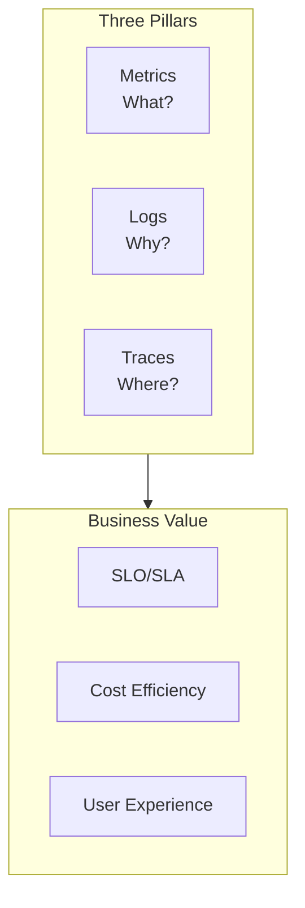

# AWS Monitoring and Observability Technical Whitepaper

> From Infrastructure to Business Value: Building Cost-Effective Observability Systems

---

## Table of Contents

> **Learning Guide**: This whitepaper follows an "Three Pillars → Business Value → Economics" progression. Chapters 1-4 cover core observability technology, chapters 5-8 extend to business and efficiency, and chapters 9-13 focus on enterprise practices and cost optimization.

1. **[Observability Overview and Strategy](#1-observability-overview-and-strategy)**  
   *Establish global perspective: Understand the three pillars of observability (Metrics/Logs/Traces), maturity models, and monitoring ROI calculations—the foundational framework for all subsequent chapters.*

2. **[CloudWatch Deep Dive](#2-cloudwatch-deep-dive)**  
   *Master core monitoring service: Deep dive into metrics, logs, alarms, and dashboards; learn EMF embedded metric format—the cornerstone of AWS monitoring.*

3. **[CloudTrail Audit and Compliance](#3-cloudtrail-audit-and-compliance)**  
   *Track operational behavior: Learn CloudTrail event analysis, anomaly detection, and security alerts for complete API call audit trails.*

4. **[X-Ray Distributed Tracing](#4-x-ray-distributed-tracing)**  
   *Understand request lifecycle: Master service maps, trace analysis, and subsegment tracing; connect technical traces to business context.*

5. **[Business Metrics and Custom Metrics](#5-business-metrics-and-custom-metrics)**  
   *From technical to business value: Learn SLO/SLI design, business metric collection, and user journey tracking to drive business decisions through monitoring.*

6. **[Log Management and Analysis](#6-log-management-and-analysis)**  
   *Structured logging best practices: Master CloudWatch Logs, Insights queries, correlation tracing, and cost optimization to extract value from logs.*

7. **[Alerting Strategy and Incident Response](#7-alerting-strategy-and-incident-response)**  
   *Intelligent alerting and automation: Learn tiered alerting, alert suppression, auto-remediation, and incident response workflows to reduce MTTR.*

8. **[APM Application Performance Monitoring](#8-apm-application-performance-monitoring)**  
   *Full-stack performance management: Integrate OpenTelemetry, X-Ray, and CloudWatch to build application performance monitoring and optimization systems.*

9. **[Architectural Economics Framework](#9-architectural-economics-framework)**  
   *Balance monitoring cost and value: Learn monitoring cost attribution, ROI models, and unit economic metrics to optimize monitoring investment.*

10. **[Cost Monitoring and Optimization](#10-cost-monitoring-and-optimization)**  
    *AWS cost observability: Master CUR analysis, cost anomaly detection, budget management, and forecast alerts to make cloud costs visible and controllable.*

11. **[Multi-Environment Monitoring](#11-multi-environment-monitoring)**  
    *Unified view across environments: Learn monitoring strategies for dev/test/production, deployment impact analysis, and cross-account aggregation.*

12. **[Security Monitoring and Threat Detection](#12-security-monitoring-and-threat-detection)**  
    *Security observability: Integrate GuardDuty, Security Hub, and auto-response to build security event monitoring and response systems.*

13. **[Production Best Practices](#13-production-best-practices)**  
    *Enterprise monitoring platform: Integrate all previous knowledge; learn Monitoring as Code, health checks, and continuous optimization to build production-grade observability platforms.*

---

## 1. Observability Overview and Strategy

### 1.1 Three Pillars of Observability



### 1.2 Monitoring ROI Model

```python
"""
Monitoring ROI Calculation
ROI = (Loss Prevented + Efficiency Gain - Monitoring Cost) / Monitoring Cost
"""

class MonitoringROI:
    def calculate_roi(self, monthly_monitoring_cost, incidents_prevented, mttr_reduction_hours):
        # Cost of downtime (example: $5000/hour)
        downtime_cost_per_hour = 5000
        engineer_cost_per_hour = 150
        
        loss_prevented = incidents_prevented * 0.8 * downtime_cost_per_hour  # 80% prevention rate
        efficiency_gain = mttr_reduction_hours * engineer_cost_per_hour
        
        total_benefit = loss_prevented + efficiency_gain
        roi = (total_benefit - monthly_monitoring_cost) / monthly_monitoring_cost * 100
        
        return {
            'monthly_cost': monthly_monitoring_cost,
            'monthly_benefit': total_benefit,
            'roi_percent': roi,
            'payback_months': monthly_monitoring_cost / (total_benefit / 12)
        }
```

---

*Version: v1.0*  
*Last Updated: 2026-03-02*
