# AWS モニタリングとオブザーバビリティ学習ロードマップ

> 16週間で初心者から上級者へ、コスト効率の高いオブザーバビリティ体系を構築

---

## 学習パス概要

```mermaid
flowchart LR
    subgraph Foundation["基礎段階 (Week 1-4)"]
        CW[CloudWatch<br/>基礎]
        Logs[ログ管理]
        Alarms[アラーム設定]
    end
    
    subgraph Application["応用段階 (Week 5-8)"]
        XRay[X-Ray<br/>分散トレース]
        APM[APM 実践]
        Custom[カスタムメトリクス]
    end
    
    subgraph Advanced["高度段階 (Week 9-12)"]
        Business[ビジネスメトリクス]
        SLO[SLO/SLI 管理]
        Security[セキュリティモニタリング]
    end
    
    subgraph Expert["エキスパート段階 (Week 13-16)"]
        Cost[コスト最適化]
        Economic[アーキテクチャ経済性]
        Platform[オブザーバビリティプラットフォーム]
    end
    
    Foundation --> Application --> Advanced --> Expert
```



---

## 第 1-4 週：基礎モニタリング能力

### Week 1: CloudWatch 基礎

**学習目標**
- CloudWatch アーキテクチャとデータフローを理解する
- メトリクス名前空間と次元を習得する
- CloudWatch コンソールの使用方法を学ぶ

**実践タスク**
```bash
# 1. CloudWatch ダッシュボードを作成
# 2. EC2 基礎モニタリングを設定
# 3. 最初のアラームを設定
```

**推奨読み物**
- CloudWatch ドキュメント基礎部分
- 白書第 1-2 章

---

### Week 2: ログ管理

**学習目標**
- CloudWatch Logs アーキテクチャを習得する
- ログ保持戦略を学ぶ
- ロググループとログストリームを理解する

**実践タスク**
```bash
# 1. ロググループを作成し保持期間を設定
# 2. CloudWatch Logs Agent を使用
# 3. Lambda ログ出力を設定
```

**コード練習**
```python
# 構造化ログ記録
import logging
import json

logger = logging.getLogger()
logger.setLevel(logging.INFO)

def lambda_handler(event, context):
    logger.info(json.dumps({
        'event': 'payment_received',
        'amount': event['amount'],
        'request_id': context.aws_request_id
    }))
```

---

### Week 3: CloudWatch Insights

**学習目標**
- Logs Insights クエリ構文を習得する
- ログパターンの分析方法を学ぶ
- フィールド抽出を理解する

**実践タスク**
```sql
-- 練習 1: エラー統計
fields @message
| filter @message like /ERROR/
| stats count() by bin(1h)

-- 練習 2: レイテンシー分析
fields @duration
| filter @type = "REPORT"
| stats avg(@duration), max(@duration), percentile(@duration, 99)

-- 練習 3: ビジネスメトリクス
fields @message
| parse @message "user: * action: *" as user, action
| stats count() by action
```

---

### Week 4: アラーム戦略

**学習目標**
- アラーム戦略を設計する
- アラームステートマシンを理解する
- SNS 通知を設定する

**実践タスク**
1. 階層アラーム（P1-P4）を作成
2. Slack/Email 統合を設定
3. アラーム抑制を実装

**プロジェクト成果物**
- サンプルアプリケーションに完全なモニタリングアラームを設定

---

## 第 5-8 週：アプリケーションパフォーマンスモニタリング

### Week 5: X-Ray 基礎

**学習目標**
- 分散トレースの概念を理解する
- X-Ray アーキテクチャを習得する
- サービスマップを設定する

**実践タスク**
```python
# X-Ray インストルメンテーション
from aws_xray_sdk.core import xray_recorder, patch_all

patch_all()

@xray_recorder.capture('process_order')
def process_order(order):
    # ビジネスロジック
    pass
```

**実験**
- Lambda で X-Ray を有効化
- サービスマップを閲覧
- トレース詳細を分析

---

### Week 6: OpenTelemetry 統合

**学習目標**
- OpenTelemetry 標準を理解する
- ADOT Collector を設定する
- カスタムトレースを実装する

**実践タスク**
```python
# OpenTelemetry 設定
from opentelemetry import trace
from opentelemetry.sdk.trace import TracerProvider
from opentelemetry.exporter.otlp.proto.grpc.trace_exporter import OTLPSpanExporter

provider = TracerProvider()
trace.set_tracer_provider(provider)

tracer = trace.get_tracer(__name__)

with tracer.start_as_current_span("operation"):
    # ビジネスロジック
    pass
```

---

### Week 7: カスタムビジネスメトリクス

**学習目標**
- ビジネスメトリクスを設計する
- EMF 形式を使用する
- ビジネスダッシュボードを構築する

**実践タスク**
```python
# ビジネスメトリクス収集
class BusinessMetrics:
    def record_conversion(self, funnel_step, user_tier):
        # EMF 形式でメトリクスを出力
        print(json.dumps({
            "_aws": {
                "CloudWatchMetrics": [{
                    "Namespace": "Business/Funnel",
                    "Metrics": [{"Name": "Conversion"}]
                }]
            },
            "FunnelStep": funnel_step,
            "UserTier": user_tier,
            "Conversion": 1
        }))
```

---

### Week 8: APM 統合プロジェクト

**プロジェクト目標**: ECアプリケーションに完全なAPMソリューションを構築

**成果物**
1. 分散トレース設定
2. ビジネスメトリクスダッシュボード
3. パフォーマンスベースラインレポート

---

## 第 9-12 週：高度モニタリング能力

### Week 9: SLO/SLI 管理

**学習目標**
- SLO 概念を理解する
- SLI を設計する
- エラーバジェットを管理する

**実践タスク**
```python
# SLO モニタリング
class SLOMonitor:
    def calculate_error_budget(self, slo_target, window_days):
        # エラーバジェット消費を計算
        total_requests = self.get_total_requests()
        error_budget = total_requests * (100 - slo_target) / 100
        
        # 消費レートをチェック
        burn_rate = self.calculate_burn_rate()
        
        return {
            'error_budget_remaining': error_budget - errors,
            'burn_rate': burn_rate,
            'alert': burn_rate > 14.4  # 1時間以内にバジェットを使い切る
        }
```

---

### Week 10: CloudTrail とセキュリティモニタリング

**学習目標**
- CloudTrail を設定する
- 監査ログを分析する
- 異常な動作を検出する

**実践タスク**
```python
# セキュリティイベント分析
class SecurityMonitor:
    def detect_privilege_escalation(self, events):
        suspicious = []
        for event in events:
            if event['eventName'] in ['AttachUserPolicy', 'AttachRolePolicy']:
                if self.is_unusual_time(event):
                    suspicious.append(event)
        return suspicious
```

---

### Week 11: 異常検出

**学習目標**
- CloudWatch 異常検出を設定する
- 機械学習モデルを理解する
- インテリジェントアラームを実装する

**実験**
- 重要メトリクスの異常検出を有効化
- 閾値アラームと異常検出を比較
- 感度パラメータを調整

---

### Week 12: 高度モニタリングプロジェクト

**プロジェクト目標**: インテリジェントモニタリングプラットフォームを構築

**機能要件**
1. 自動異常検出
2. 根本原因分析
3. アラーム集約

---

## 第 13-16 週：アーキテクチャ経済性

### Week 13: モニタリングコスト分析

**学習目標**
- CloudWatch 価格体系を理解する
- モニタリングコストを分析する
- 最適化の機会を特定する

**実践タスク**
```python
# コスト分析
class CostAnalyzer:
    def analyze_metric_cost(self, namespaces):
        costs = {}
        for ns in namespaces:
            metric_count = self.count_metrics(ns)
            costs[ns] = {
                'metric_count': metric_count,
                'monthly_cost': metric_count * 0.30
            }
        return costs
    
    def identify_unused_metrics(self):
        # 7日間データがないメトリクスを検索
        pass
```

---

### Week 14: コスト最適化戦略

**学習目標**
- ログ最適化を実施する
- サンプリング戦略を設定する
- 保持期間を最適化する

**最適化チェックリスト**
- [ ] ログ圧縮を有効化
- [ ] ライフサイクル戦略を設定
- [ ] X-Ray サンプリングレートを調整
- [ ] 未使用ダッシュボードを削除
- [ ] Insights クエリを最適化

---

### Week 15: マルチ環境モニタリング

**学習目標**
- クロス環境モニタリングを設計する
- 中央モニタリングを設定する
- コスト配分を実装する

**実践タスク**
1. クロスアカウント CloudWatch を設定
2. 統一ダッシュボードを設定
3. チーム/環境別コストレポートを実装

---

### Week 16: オブザーバビリティプラットフォーム設計

**最終プロジェクト**: エンタープライズ級オブザーバビリティプラットフォームを設計

**要件**
1. 1000+ マイクロサービスをサポート
2. 月コストを $10,000 以内に制御
3. MTTR < 15分
4. 99.9% 可用性モニタリングカバレッジ

**成果物**
- アーキテクチャ設計ドキュメント
- コストモデル
- 実施ロードマップ

---

## 推奨学習リソース

### 公式ドキュメント
- [AWS CloudWatch ドキュメント](https://docs.aws.amazon.com/cloudwatch/)
- [AWS X-Ray ドキュメント](https://docs.aws.amazon.com/xray/)
- [OpenTelemetry 仕様](https://opentelemetry.io/docs/)

### 書籍
- 『Site Reliability Engineering』- Google
- 『Distributed Systems Observability』- Cindy Sridharan
- 『Cloud FinOps』- J.R. Storment

### 認定資格
- AWS Certified SysOps Administrator
- AWS Certified DevOps Engineer
- AWS Certified Security - Specialty

---

## 週別学習時間の推奨

| アクティビティ | 時間 |
|------|------|
| ドキュメント読む | 2-3 時間 |
| 実践練習 | 4-5 時間 |
| プロジェクト作業 | 2-3 時間 |
| 合計 | 8-11 時間/週 |

---

**オブザーバビリティの旅を始めましょう！** 🚀
