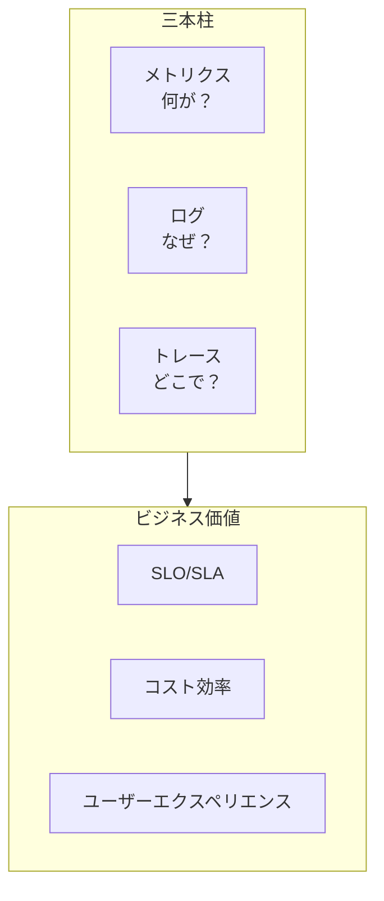

# AWS モニタリングと可観測性技術白書

> インフラストラクチャからビジネス価値へ：コスト効率の良い可観測性システムの構築

---

## 目次

> **学習ガイド**: 本白書は「三本柱→ビジネス価値→経済性」の進化パスに従います。第 1 章〜第 4 章で可観測性のコア技術を習得し、第 5 章〜第 8 章でビジネスと効率に拡張し、第 9 章〜第 13 章でエンタープライズ実践とコスト最適化に焦点を当てます。

1. **[可観測性概要と戦略](#1-可観測性概要と戦略)**  
   *グローバルな視点を確立: 可観測性の三本柱（メトリクス/ログ/トレース）、成熟度モデル、モニタリング ROI 計算を理解し——これは後続のすべての章の基盤となるフレームワークです。*

2. **[CloudWatch 詳細解説](#2-cloudwatch-詳細解説)**  
   *コアモニタリングサービスを習得: メトリクス、ログ、アラーム、ダッシュボードを深く学び、EMF エンベデッドメトリクスフォーマットを学びます——AWS モニタリングの基石です。*

3. **[CloudTrail 監査とコンプライアンス](#3-cloudtrail-監査とコンプライアンス)**  
   *運用行動を追跡: CloudTrail イベント分析、異常検出、セキュリティアラートを学び、API コールの完全な監査証跡を確保します。*

4. **[X-Ray 分散トレーシング](#4-x-ray-分散トレーシング)**  
   *リクエストライフサイクルを理解: サービスマップ、トレース分析、サブセグメントトレーシングを習得し、技術的なトレースをビジネスコンテキストに関連付けます。*

5. **[ビジネスメトリクスとカスタムメトリクス](#5-ビジネスメトリクスとカスタムメトリクス)**  
   *技術的価値からビジネス価値へ: SLO/SLI 設計、ビジネスメトリクス収集、ユーザージャーニートラッキングを学び、モニタリングを通じてビジネス意思決定を推進します。*

6. **[ログ管理と分析](#6-ログ管理と分析)**  
   *構造化ログのベストプラクティス: CloudWatch Logs、Insights クエリ、相関トレーシング、コスト最適化を習得し、ログから価値を抽出します。*

7. **[アラート戦略とインシデント対応](#7-アラート戦略とインシデント対応)**  
   *インテリジェントアラートと自動化: 階層化アラート、アラート抑制、自動修復、インシデント対応ワークフローを学び、MTTR を短縮します。*

8. **[APM アプリケーションパフォーマンスモニタリング](#8-apm-アプリケーションパフォーマンスモニタリング)**  
   *フルスタックパフォーマンス管理: OpenTelemetry、X-Ray、CloudWatch を統合し、アプリケーションパフォーマンスモニタリングと最適化システムを構築します。*

9. **[アーキテクチャ経済性フレームワーク](#9-アーキテクチャ経済性フレームワーク)**  
   *モニタリングコストと価値のバランス: モニタリングコストアトリビューション、ROI モデル、ユニット経済メトリクスを学び、モニタリング投資を最適化します。*

10. **[コストモニタリングと最適化](#10-コストモニタリングと最適化)**  
    *AWS コスト可観測性: CUR 分析、コスト異常検出、予算管理、予測アラートを習得し、クラウドコストを可視化・管理可能にします。*

11. **[マルチ環境モニタリング](#11-マルチ環境モニタリング)**  
    *環境間の統一ビュー: 開発/テスト/本番環境のモニタリング戦略、デプロイメント影響分析、クロスアカウント集計を学びます。*

12. **[セキュリティモニタリングと脅威検出](#12-セキュリティモニタリングと脅威検出)**  
    *セキュリティ可観測性: GuardDuty、Security Hub、自動対応を統合し、セキュリティイベントモニタリングと対応システムを構築します。*

13. **[本番環境ベストプラクティス](#13-本番環境ベストプラクティス)**  
    *エンタープライズモニタリングプラットフォーム: これまでの知識を統合し、Monitoring as Code、ヘルスチェック、継続的最適化を学び、本番グレードの可観測性プラットフォームを構築します。*

---

## 1. 可観測性概要と戦略

### 1.1 可観測性の三本柱



### 1.2 モニタリング ROI モデル

```python
"""
モニタリング ROI 計算
ROI = (回避した損失 + 効率向上 - モニタリングコスト) / モニタリングコスト
"""

class MonitoringROI:
    def calculate_roi(self, monthly_monitoring_cost, incidents_prevented, mttr_reduction_hours):
        # ダウンタイムコスト（例：時間あたり 5000 ドル）
        downtime_cost_per_hour = 5000
        engineer_cost_per_hour = 150
        
        loss_prevented = incidents_prevented * 0.8 * downtime_cost_per_hour  # 80% 予防率
        efficiency_gain = mttr_reduction_hours * engineer_cost_per_hour
        
        total_benefit = loss_prevented + efficiency_gain
        roi = (total_benefit - monthly_monitoring_cost) / monthly_monitoring_cost * 100
        
        return {
            'monthly_cost': monthly_monitoring_cost,
            'monthly_benefit': total_benefit,
            'roi_percent': roi,
            'payback_months': monthly_monitoring_cost / (total_benefit / 12)
        }
```

---

*バージョン: v1.0*  
*最終更新日: 2026-03-02*
