# AWS モニタリングとオブザーバビリティ技術白書

> インフラストラクチャからビジネス価値へ、コスト効率の高いオブザーバビリティ体系の構築

---

## 目次

> **学習ガイド**: 本白書は「三本柱→ビジネス価値→経済性」の進捗パスを採用しています。第1-4章ではオブザーバビリティの中核技術を習得し、中間の4章ではビジネスと効率性に展開し、最後の5章ではエンタープライズ級の実践とコスト最適化に焦点を当てます。

1. **[オブザーバビリティの概要と戦略](#1-オブザーバビリティの概要と戦略)**  
   *全体像の構築：オブザーバビリティの三本柱（メトリクス/ログ/トレース）、成熟度モデル、モニタリングROI計算について理解します——これらは全ての後続章の基礎となるフレームワークです。*

2. **[CloudWatch 詳細解説](#2-cloudwatch-詳細解説)**  
   *コアモニタリングサービスの習得：メトリクス、ログ、アラーム、ダッシュボード機能、およびEMF（組み込みメトリクスフォーマット）について深く学びます——AWSモニタリング体系の基盤です。*

3. **[CloudTrail 監査とコンプライアンス追跡](#3-cloudtrail-監査とコンプライアンス追跡)**  
   *操作動作の追跡：CloudTrailイベント分析、異常検出、セキュリティアラートを学び、API呼び出しの完全な監査追跡を実現します。*

4. **[X-Ray 分散トレーシング](#4-x-ray-分散トレーシング)**  
   *リクエストのフルチェーン理解：サービスマップ、トレース分析、サブセグメント追跡を習得し、技術的な追跡をビジネスコンテキストに関連付けます。*

5. **[ビジネスメトリクスモニタリングとカスタム測定](#5-ビジネスメトリクスモニタリングとカスタム測定)**  
   *技術メトリクスからビジネス価値へ：SLO/SLI設計、ビジネスメトリクス収集、ユーザージャーニー追跡を学び、モニタリングがビジネス意思決定を推進する方法を理解します。*

6. **[ログ管理と分析](#6-ログ管理と分析)**  
   *構造化ログのベストプラクティス：CloudWatch Logs、Insightsクエリ、関連付け追跡、コスト最適化を習得し、ログから価値を掘り出します。*

7. **[アラーム戦略とインシデント対応](#7-アラーム戦略とインシデント対応)**  
   *インテリジェントアラームと自動化：階層アラーム、アラーム抑制、自動修復、インシデント対応フローを学び、MTTRを削減します。*

8. **[APM アプリケーションパフォーマンスモニタリング](#8-apm-アプリケーションパフォーマンスモニタリング)**  
   *フルスタックパフォーマンス管理：OpenTelemetry、X-Ray、CloudWatchを統合し、アプリケーションパフォーマンスモニタリングと最適化体系を構築します。*

9. **[アーキテクチャ経済性分析フレームワーク](#9-アーキテクチャ経済性分析フレームワーク)**  
   *モニタリングコストと価値のバランス：モニタリングコストの属性付け、ROIモデル、単位経済指標を学び、モニタリング投資の最適な構成を実現します。*

10. **[コストモニタリングと最適化実践](#10-コストモニタリングと最適化実践)**  
    *AWSコストのオブザーバビリティ：CUR分析、コスト異常検出、予算管理、予測アラームを習得し、クラウドコストを可視化・制御します。*

11. **[マルチ環境モニタリング戦略](#11-マルチ環境モニタリング戦略)**  
    *環境を横断した統一ビュー：開発/テスト/本番環境のモニタリング戦略、デプロイメント影響分析、クロスアカウント集計を学びます。*

12. **[セキュリティモニタリングと脅威検出](#12-セキュリティモニタリングと脅威検出)**  
    *セキュリティオブザーバビリティ：GuardDuty、Security Hub、自動対応を統合し、セキュリティイベントのモニタリングと対応体系を構築します。*

13. **[本番環境ベストプラクティス](#13-本番環境ベストプラクティス)**  
    *エンタープライズ級モニタリングプラットフォーム：これまでの知識を統合し、Monitoring as Code、ヘルスチェック、継続的最適化を学び、本番レベルのオブザーバビリティプラットフォームを構築します。*

---

## 1. オブザーバビリティの概要と戦略

### 1.1 オブザーバビリティの三本柱

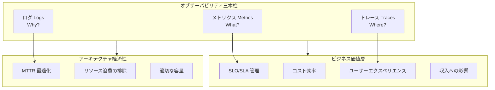

### 1.2 モニタリング成熟度モデル

| レベル | 名称 | 特徴 | コスト効果 |
|------|------|------|----------|
| L1 | 基盤モニタリング | インフラストラクチャメトリクス、基本アラーム | 低投資、基礎的可視性 |
| L2 | アプリケーションモニタリング | APM、カスタムビジネスメトリクス | 中程度の投資、障害特定 |
| L3 | インテリジェントオブザーバビリティ | 関連付け分析、異常検出 | 高投資、予測的洞察 |
| L4 | ビジネス主導 | SLO管理、コスト属性付け | 戦略的投資、価値最大化 |

### 1.3 AWS モニタリングサービスマトリクス

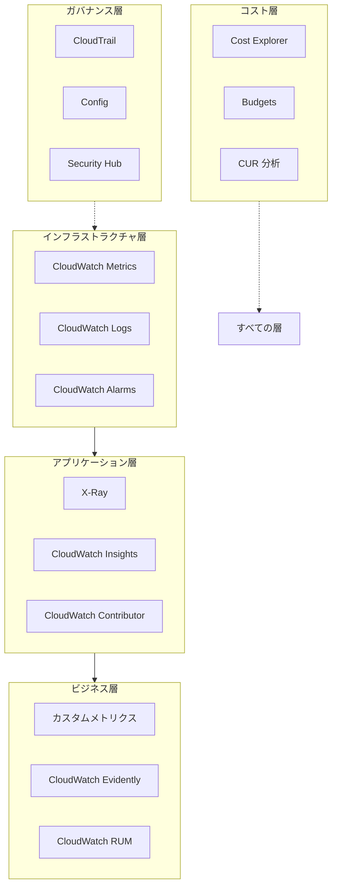

### 1.4 モニタリング投資収益率（ROI）モデル

```python
"""
モニタリング投資収益率計算モデル

モニタリングROI = (回避した損失 + 効率向上) / モニタリング総コスト
"""

class MonitoringROI:
    def __init__(self):
        self.costs = {
            'cloudwatch_metrics': 0,
            'cloudwatch_logs': 0,
            'xray': 0,
            'dashboards': 0,
            'personnel': 0
        }
        self.benefits = {
            'downtime_prevention': 0,  # 回避した停止損失
            'mttr_reduction': 0,       # MTTR削減によるコスト節約
            'resource_optimization': 0, # リソース最適化による節約
            'auto_remediation': 0      # 自動修復による人件費節約
        }
    
    def calculate_monthly_cost(self):
        """月次モニタリングコストを計算します"""
        # CloudWatch Metrics: $0.30 per metric/month
        # カスタムメトリクス: 100個のメトリクス
        metrics_cost = 100 * 0.30
        
        # CloudWatch Logs: $0.50 per GB ingested
        # 1日10GBのログ
        logs_cost = 10 * 30 * 0.50
        
        # X-Ray: $5 per million traces
        # 月間1000万トレース
        xray_cost = 10 * 5
        
        # Dashboards: $3 per dashboard/month
        dashboard_cost = 20 * 3
        
        total = metrics_cost + logs_cost + xray_cost + dashboard_cost
        
        return {
            'metrics': metrics_cost,
            'logs': logs_cost,
            'xray': xray_cost,
            'dashboards': dashboard_cost,
            'total': total
        }
    
    def calculate_benefits(self):
        """モニタリングによる収益を計算します"""
        # 仮定: 月に1回P1障害が発生し、1回あたり$50,000の損失
        # モニタリングが事前に検出・防止する割合 80%
        downtime_prevention = 50000 * 0.8 / 12
        
        # MTTRが2時間から15分に短縮
        # 1.75時間節約、エンジニアコスト$150/時間、月に4回の障害
        mttr_savings = 1.75 * 150 * 4
        
        # リソース最適化: 自動スケーリングで計算コストを20%削減
        # 月間計算コストを$50,000と仮定
        resource_savings = 50000 * 0.20
        
        # 自動修復による人件費節約
        auto_remediation = 2000  # 月に20時間節約
        
        return {
            'downtime_prevention': downtime_prevention,
            'mttr_reduction': mttr_savings,
            'resource_optimization': resource_savings,
            'auto_remediation': auto_remediation,
            'total': downtime_prevention + mttr_savings + resource_savings + auto_remediation
        }
    
    def calculate_roi(self):
        """ROIを計算します"""
        costs = self.calculate_monthly_cost()
        benefits = self.calculate_benefits()
        
        roi = (benefits['total'] - costs['total']) / costs['total'] * 100
        
        return {
            'monthly_cost': costs['total'],
            'monthly_benefit': benefits['total'],
            'net_benefit': benefits['total'] - costs['total'],
            'roi_percentage': roi,
            'payback_months': costs['total'] / (benefits['total'] / 12) if benefits['total'] > 0 else float('inf')
        }

# 使用例
roi_calculator = MonitoringROI()
result = roi_calculator.calculate_roi()
print(f"月次モニタリングコスト: ${result['monthly_cost']:.2f}")
print(f"月次収益: ${result['monthly_benefit']:.2f}")
print(f"純収益: ${result['net_benefit']:.2f}")
print(f"ROI: {result['roi_percentage']:.1f}%")
```

---

## 2. CloudWatch 詳細解説

### 2.1 CloudWatch アーキテクチャとデータフロー

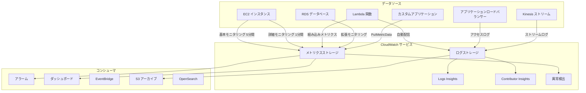

### 2.2 カスタムビジネスメトリクスのベストプラクティス

```python
import boto3
from datetime import datetime, timedelta
import json

cloudwatch = boto3.client('cloudwatch')

class BusinessMetrics:
    """ビジネスメトリクスモニタリング - 技術メトリクスからビジネス価値へ"""
    
    def __init__(self, namespace='MyApplication/Business'):
        self.namespace = namespace
        self.cloudwatch = boto3.client('cloudwatch')
    
    def record_order_completed(self, order_value, customer_tier, region):
        """注文完了メトリクスを記録します"""
        
        # コアビジネスメトリクス
        self.cloudwatch.put_metric_data(
            Namespace=self.namespace,
            MetricData=[
                {
                    'MetricName': 'OrdersCompleted',
                    'Value': 1,
                    'Unit': 'Count',
                    'Dimensions': [
                        {'Name': 'CustomerTier', 'Value': customer_tier},
                        {'Name': 'Region', 'Value': region}
                    ],
                    'Timestamp': datetime.utcnow()
                },
                {
                    'MetricName': 'OrderValue',
                    'Value': order_value,
                    'Unit': 'None',  # カスタム単位
                    'Dimensions': [
                        {'Name': 'CustomerTier', 'Value': customer_tier}
                    ],
                    'Timestamp': datetime.utcnow()
                }
            ]
        )
    
    def record_user_journey(self, step_name, duration_ms, success):
        """ユーザージャーニーファネルを記録します"""
        
        self.cloudwatch.put_metric_data(
            Namespace=self.namespace,
            MetricData=[
                {
                    'MetricName': 'UserJourneyStep',
                    'Value': 1,
                    'Unit': 'Count',
                    'Dimensions': [
                        {'Name': 'StepName', 'Value': step_name},
                        {'Name': 'Outcome', 'Value': 'Success' if success else 'Failure'}
                    ],
                    'Timestamp': datetime.utcnow()
                },
                {
                    'MetricName': 'UserJourneyDuration',
                    'Value': duration_ms,
                    'Unit': 'Milliseconds',
                    'Dimensions': [
                        {'Name': 'StepName', 'Value': step_name}
                    ],
                    'Timestamp': datetime.utcnow()
                }
            ]
        )
    
    def record_feature_usage(self, feature_name, user_id, context=None):
        """機能使用状況を記録 - 機能廃止決定に使用"""
        
        dimensions = [
            {'Name': 'FeatureName', 'Value': feature_name}
        ]
        
        if context:
            for key, value in context.items():
                dimensions.append({'Name': key, 'Value': str(value)})
        
        self.cloudwatch.put_metric_data(
            Namespace=self.namespace,
            MetricData=[{
                'MetricName': 'FeatureUsage',
                'Value': 1,
                'Unit': 'Count',
                'Dimensions': dimensions,
                'Timestamp': datetime.utcnow()
            }]
        )
    
    def record_api_business_impact(self, api_name, latency_ms, revenue_impact):
        """APIレイテンシーがビジネスに与える影響を記録します"""
        
        self.cloudwatch.put_metric_data(
            Namespace=self.namespace,
            MetricData=[
                {
                    'MetricName': 'APIRevenueImpact',
                    'Value': revenue_impact,
                    'Unit': 'None',
                    'Dimensions': [
                        {'Name': 'APIName', 'Value': api_name},
                        {'Name': 'LatencyBucket', 'Value': self._get_latency_bucket(latency_ms)}
                    ]
                }
            ]
        )
    
    def _get_latency_bucket(self, latency_ms):
        """レイテンシーを分析用にグループ化します"""
        if latency_ms < 100:
            return '<100ms'
        elif latency_ms < 500:
            return '100-500ms'
        elif latency_ms < 1000:
            return '500ms-1s'
        else:
            return '>1s'
    
    def get_conversion_funnel(self, start_time, end_time):
        """コンバージョンファネルデータを取得します"""
        
        steps = ['HomePage', 'ProductPage', 'AddToCart', 'Checkout', 'Purchase']
        funnel_data = {}
        
        for step in steps:
            response = self.cloudwatch.get_metric_statistics(
                Namespace=self.namespace,
                MetricName='UserJourneyStep',
                Dimensions=[
                    {'Name': 'StepName', 'Value': step},
                    {'Name': 'Outcome', 'Value': 'Success'}
                ],
                StartTime=start_time,
                EndTime=end_time,
                Period=3600,
                Statistics=['Sum']
            )
            
            total = sum(dp['Sum'] for dp in response['Datapoints'])
            funnel_data[step] = total
        
        # コンバージョン率を計算
        conversion_rates = {}
        for i in range(1, len(steps)):
            current = funnel_data[steps[i]]
            previous = funnel_data[steps[i-1]]
            rate = (current / previous * 100) if previous > 0 else 0
            conversion_rates[f"{steps[i-1]}->{steps[i]}"] = rate
        
        return {
            'funnel': funnel_data,
            'conversion_rates': conversion_rates
        }

# Lambda ハンドラー関数での使用
def lambda_handler(event, context):
    metrics = BusinessMetrics()
    
    # 注文を記録
    metrics.record_order_completed(
        order_value=event['order_value'],
        customer_tier=event['customer_tier'],
        region=context.invoked_function_arn.split(':')[3]
    )
    
    return {'status': 'success'}
```

### 2.3 組み込みメトリクスフォーマット（EMF）- 高性能・低コスト

```python
import json
import time

class EMFLogger:
    """
    CloudWatch 組み込みメトリクスフォーマット（EMF）
    利点：
    - 非同期書き込み、リクエストをブロックしない
    - 自動集計、API呼び出しを削減
    - 高カーディナリティの次元に対応
    - コストを90%以上削減
    """
    
    def __init__(self, service_name='MyService', log_group='/aws/metrics'):
        self.service_name = service_name
        self.log_group = log_group
    
    def log_metric(self, metric_name, value, unit='Count', dimensions=None, metadata=None):
        """EMF形式のログを出力します"""
        
        emf_payload = {
            "_aws": {
                "Timestamp": int(time.time() * 1000),
                "CloudWatchMetrics": [
                    {
                        "Namespace": f"{self.service_name}/Metrics",
                        "Dimensions": [list(dimensions.keys())] if dimensions else [[]],
                        "Metrics": [
                            {
                                "Name": metric_name,
                                "Unit": unit
                            }
                        ]
                    }
                ]
            },
            metric_name: value
        }
        
        # 次元値を追加
        if dimensions:
            emf_payload.update(dimensions)
        
        # メタデータを追加（メトリクスとして抽出されないが、ログクエリに使用可能）
        if metadata:
            emf_payload['metadata'] = metadata
        
        # stdoutに出力、Lambdaは自動的にCloudWatch Logsに送信
        print(json.dumps(emf_payload))
    
    def log_api_request(self, api_name, latency_ms, status_code, user_tier):
        """APIリクエストメトリクスを記録します"""
        
        self.log_metric(
            metric_name='APILatency',
            value=latency_ms,
            unit='Milliseconds',
            dimensions={
                'ServiceName': self.service_name,
                'APIName': api_name,
                'StatusCode': str(status_code),
                'UserTier': user_tier
            },
            metadata={
                'timestamp': time.time(),
                'version': 'v1'
            }
        )
    
    def log_business_event(self, event_type, revenue_value, customer_segment):
        """ビジネスイベントを記録します"""
        
        self.log_metric(
            metric_name='BusinessRevenue',
            value=revenue_value,
            unit='None',
            dimensions={
                'EventType': event_type,
                'CustomerSegment': customer_segment
            }
        )

# Lambda でのEMF使用
emf = EMFLogger(service_name='PaymentService')

def handler(event, context):
    start_time = time.time()
    
    # ビジネスロジックを処理
    result = process_payment(event)
    
    latency = (time.time() - start_time) * 1000
    
    # EMFメトリクスを出力 - ゼロレイテンシーオーバーヘッド
    emf.log_api_request(
        api_name='ProcessPayment',
        latency_ms=latency,
        status_code=200 if result['success'] else 500,
        user_tier=event.get('user_tier', 'standard')
    )
    
    if result['success']:
        emf.log_business_event(
            event_type='PaymentSuccess',
            revenue_value=event['amount'],
            customer_segment=event.get('segment', 'unknown')
        )
    
    return result
```

### 2.4 CloudWatch Insights 高度なクエリ

```sql
-- ビジネスメトリクス分析：コンバージョン率を計算
-- 閲覧から購入までのユーザーコンバージョンファネルを分析

fields @timestamp, @message
| parse @message "UserId: * Action: * ProductId: *" as userId, action, productId
| filter action in ['view', 'add_to_cart', 'purchase']
| stats 
    count(action = 'view') as views,
    count(action = 'add_to_cart') as carts,
    count(action = 'purchase') as purchases
    by bin(1h)
| fields 
    views,
    carts,
    purchases,
    (carts / views * 100) as view_to_cart_rate,
    (purchases / carts * 100) as cart_to_purchase_rate,
    (purchases / views * 100) as overall_conversion_rate
```

```sql
-- コスト属性付け分析：APIとクライアント別に高コスト呼び出しを特定

fields @timestamp, @message
| parse @message '"requestId": "*"' as requestId
| parse @message '"apiName": "*"' as apiName
| parse @message '"clientId": "*"' as clientId
| parse @message '"duration": *,' as duration
| parse @message '"memorySize": *,"' as memorySize
| parse @message '"billedDuration": *,' as billedDuration
| filter @message like /REPORT/
| stats 
    count() as invocation_count,
    avg(billedDuration) as avg_duration,
    max(billedDuration) as max_duration,
    (avg(billedDuration) * memorySize / 1024 / 1024 * 0.0000166667 * count()) as estimated_cost
    by apiName, clientId
| sort estimated_cost desc
| limit 20
```

```sql
-- 異常検出：通常パターンから逸脱するAPI呼び出しを特定

fields @timestamp, @message
| parse @message '"latency": *,' as latency
| parse @message '"apiName": "*"' as apiName
| filter apiName = 'CheckoutAPI'
| stats 
    avg(latency) as avg_latency,
    stdev(latency) as std_latency,
    percentile(latency, 99) as p99_latency,
    count() as request_count
    by bin(5m)
| fields 
    avg_latency,
    std_latency,
    p99_latency,
    request_count,
    (p99_latency > avg_latency + 3 * std_latency) as is_anomaly
| filter is_anomaly = 1
```

---

## 3. CloudTrail 監査とコンプライアンス追跡

### 3.1 CloudTrail アーキテクチャとイベントフロー

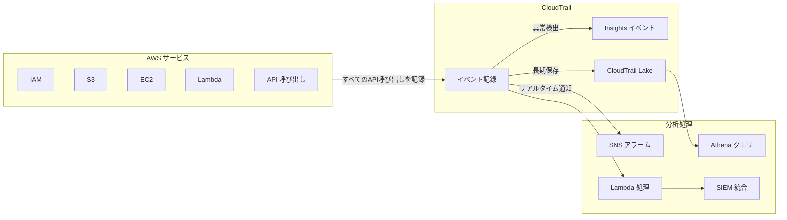

### 3.2 セキュリティイベントモニタリングと対応

```python
import boto3
import json
from datetime import datetime, timedelta

cloudtrail = boto3.client('cloudtrail')
sns = boto3.client('sns')
securityhub = boto3.client('securityhub')

class SecurityMonitor:
    """セキュリティイベントモニタリング - CloudTrailから自動対応へ"""
    
    def __init__(self):
        self.cloudtrail = boto3.client('cloudtrail')
        self.sns = boto3.client('sns')
        self.high_risk_actions = [
            'PutBucketPolicy', 'PutBucketAcl',              # S3 権限変更
            'CreateAccessKey', 'DeleteAccessKey',            # IAM キー変更
            'AttachUserPolicy', 'AttachRolePolicy',          # 権限昇格
            'PutRolePolicy', 'PutUserPolicy',                # インラインポリシー
            'CreateUser', 'CreateRole',                      #  identity 作成
            'AuthorizeSecurityGroupIngress',                 # セキュリティグループ開放
            'PutBucketPublicAccessBlock',                    # パブリックアクセス
            'DeleteTrail', 'StopLogging'                     # 監査回避
        ]
    
    def analyze_events(self, start_time, end_time):
        """CloudTrail イベントを分析します"""
        
        events = []
        paginator = self.cloudtrail.get_paginator('lookup_events')
        
        for page in paginator.paginate(
            StartTime=start_time,
            EndTime=end_time
        ):
            for event in page['Events']:
                event_data = json.loads(event['CloudTrailEvent'])
                
                # 高リスク操作をチェック
                if event_data['eventName'] in self.high_risk_actions:
                    events.append({
                        'event_time': event['EventTime'],
                        'event_name': event['eventName'],
                        'user': event_data['userIdentity']['arn'],
                        'source_ip': event_data.get('sourceIPAddress', 'unknown'),
                        'risk_level': 'HIGH',
                        'details': event_data
                    })
        
        return events
    
    def detect_privilege_escalation(self, username, hours=24):
        """権限昇格の試みを検出します"""
        
        end_time = datetime.utcnow()
        start_time = end_time - timedelta(hours=hours)
        
        events = self.analyze_events(start_time, end_time)
        
        # 同一ユーザーの大量の権限変更をチェック
        user_events = [e for e in events if username in e['user']]
        
        if len(user_events) > 5:
            return {
                'alert': True,
                'type': 'PRIVILEGE_ESCALATION',
                'reason': f'{username} が{hours}時間以内に{len(user_events)}回の高リスク操作を実行しました',
                'events': user_events
            }
        
        return {'alert': False}
    
    def detect_after_hours_access(self, allowed_hours=(8, 18)):
        """勤務時間外のアクセスを検出します"""
        
        end_time = datetime.utcnow()
        start_time = end_time - timedelta(hours=1)
        
        events = self.analyze_events(start_time, end_time)
        suspicious = []
        
        for event in events:
            event_hour = event['event_time'].hour
            if event_hour < allowed_hours[0] or event_hour > allowed_hours[1]:
                suspicious.append(event)
        
        return suspicious
    
    def send_security_alert(self, finding):
        """セキュリティアラームを送信します"""
        
        message = {
            'default': json.dumps(finding),
            'email': f"""
            Security Alert: {finding.get('type', 'UNKNOWN')}
            
            Time: {datetime.utcnow().isoformat()}
            Details: {json.dumps(finding, indent=2)}
            
            Please investigate immediately.
            """
        }
        
        self.sns.publish(
            TopicArn='arn:aws:sns:us-east-1:123456789:security-alerts',
            Message=json.dumps(message),
            MessageStructure='json',
            Subject=f"Security Alert: {finding.get('type', 'Unknown')}"
        )
    
    def export_to_security_hub(self, finding):
        """Security Hubにエクスポートします"""
        
        security_finding = {
            'SchemaVersion': '2018-10-08',
            'Id': finding['id'],
            'ProductArn': 'arn:aws:securityhub:us-east-1::product/aws/securityhub',
            'GeneratorId': 'custom-security-monitor',
            'AwsAccountId': '123456789',
            'Types': ['Software and Configuration Checks/Policy Compliance'],
            'CreatedAt': datetime.utcnow().isoformat(),
            'UpdatedAt': datetime.utcnow().isoformat(),
            'Severity': {'Label': finding.get('severity', 'MEDIUM')},
            'Title': finding.get('title', 'Security Finding'),
            'Description': finding.get('description', ''),
            'Resources': [{
                'Type': 'AwsIamUser',
                'Id': finding.get('user', 'unknown')
            }],
            'RecordState': 'ACTIVE'
        }
        
        self.securityhub.batch_import_findings(
            Findings=[security_finding]
        )

# Lambda ハンドラー関数
def lambda_handler(event, context):
    monitor = SecurityMonitor()
    
    # 過去1時間のイベントをチェック
    end_time = datetime.utcnow()
    start_time = end_time - timedelta(hours=1)
    
    # イベントを分析
    events = monitor.analyze_events(start_time, end_time)
    
    alerts = []
    for event in events:
        # 権限昇格を検出
        if event['event_name'] in ['AttachUserPolicy', 'AttachRolePolicy']:
            escalation = monitor.detect_privilege_escalation(
                event['user'].split('/')[-1]
            )
            if escalation['alert']:
                alerts.append(escalation)
                monitor.send_security_alert(escalation)
    
    return {
        'processed_events': len(events),
        'alerts_generated': len(alerts)
    }
```

---

## 4. X-Ray 分散トレーシング

### 4.1 X-Ray アーキテクチャとトレースフロー

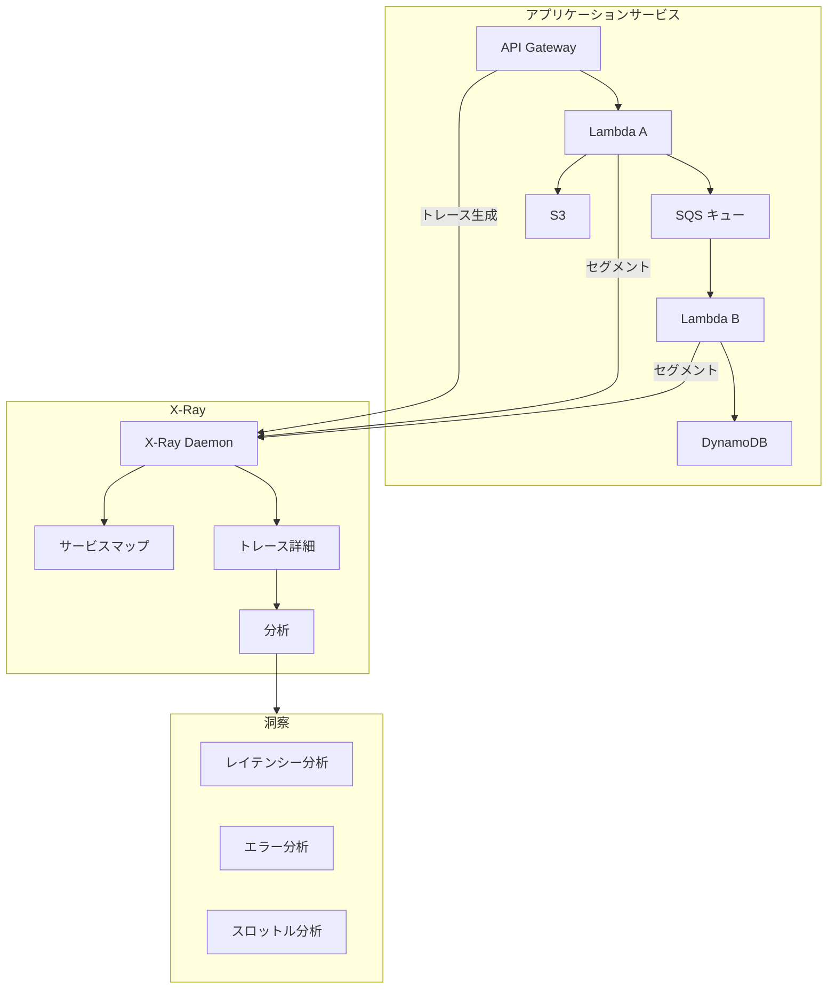

### 4.2 X-Ray 高度なトレース実装

```python
from aws_xray_sdk.core import xray_recorder, patch_all
from aws_xray_sdk.core.models import subsegment
import boto3
import time

# AWS SDKの自動パッチ
patch_all()

class TracedService:
    """
    X-Ray トレースサービス - ビジネス次元のトレーシング
    技術的なトレースをビジネスコンテキストに関連付け
    """
    
    def __init__(self, service_name='PaymentService'):
        xray_recorder.configure(
            service=service_name,
            context_missing='LOG_ERROR',
            plugins=['EC2Plugin', 'ECSPlugin', 'ElasticBeanstalkPlugin']
        )
        self.dynamodb = boto3.resource('dynamodb')
    
    @xray_recorder.capture('process_order')
    def process_order(self, order_data):
        """注文を処理 - 完全なビジネストレース"""
        
        # ビジネス注釈を追加
        xray_recorder.put_annotation('order_id', order_data['order_id'])
        xray_recorder.put_annotation('customer_tier', order_data.get('tier', 'standard'))
        xray_recorder.put_annotation('order_value', order_data['amount'])
        
        # メタデータを追加（インデックスされないが、クエリ可能）
        xray_recorder.put_metadata('order_details', {
            'items': order_data.get('items', []),
            'promo_code': order_data.get('promo_code'),
            'user_agent': order_data.get('user_agent')
        })
        
        try:
            # 在庫を検証
            with xray_recorder.capture_subsegment('check_inventory') as subsegment:
                subsegment.put_annotation('product_id', order_data['product_id'])
                inventory_result = self.check_inventory(
                    order_data['product_id'],
                    order_data['quantity']
                )
                subsegment.put_metadata('inventory_result', inventory_result)
            
            # 支払いを処理
            with xray_recorder.capture_subsegment('process_payment') as subsegment:
                subsegment.put_annotation('payment_method', order_data['payment_method'])
                payment_result = self.process_payment(order_data)
                subsegment.put_annotation('payment_status', payment_result['status'])
            
            # 注文ステータスを更新
            with xray_recorder.capture_subsegment('update_order') as subsegment:
                self.update_order_status(order_data['order_id'], 'completed')
            
            return {'success': True, 'order_id': order_data['order_id']}
            
        except Exception as e:
            # エラートレースを記録
            xray_recorder.put_annotation('error_type', type(e).__name__)
            xray_recorder.put_annotation('error_message', str(e))
            raise
    
    @xray_recorder.capture('check_inventory')
    def check_inventory(self, product_id, quantity):
        """在庫をチェック - サブセグメントトレース"""
        table = self.dynamodb.Table('inventory')
        
        response = table.get_item(Key={'product_id': product_id})
        item = response.get('Item', {})
        
        available = item.get('quantity', 0)
        
        # トレース情報を追加
        xray_recorder.put_annotation('available_stock', available)
        xray_recorder.put_annotation('requested_quantity', quantity)
        
        if available < quantity:
            raise Exception(f'Insufficient inventory: {available} < {quantity}')
        
        return {'available': available, 'sufficient': True}
    
    @xray_recorder.capture('process_payment')
    def process_payment(self, order_data):
        """支払いを処理 - 外部サービストレース"""
        
        # 支払いゲートウェイ呼び出しをシミュレート
        start_time = time.time()
        
        # 実際の支払いゲートウェイ呼び出し
        # response = requests.post(payment_gateway_url, ...)
        
        latency = (time.time() - start_time) * 1000
        
        # 支払いゲートウェイのパフォーマンスを記録
        xray_recorder.put_metadata('payment_latency_ms', latency)
        
        return {'status': 'success', 'transaction_id': 'txn_12345'}
    
    def get_service_map_insights(self):
        """X-Ray からサービスマップの洞察を取得します"""
        xray = boto3.client('xray')
        
        # サービス統計を取得
        response = xray.get_service_graph(
            StartTime=datetime.utcnow() - timedelta(hours=1),
            EndTime=datetime.utcnow()
        )
        
        insights = []
        for service in response['Services']:
            if service['SummaryStatistics']['ErrorStatistics']['TotalCount'] > 0:
                insights.append({
                    'service_name': service['Name'],
                    'error_count': service['SummaryStatistics']['ErrorStatistics']['TotalCount'],
                    'fault_count': service['SummaryStatistics']['FaultStatistics']['TotalCount'],
                    'avg_latency': service['SummaryStatistics']['TotalResponseTime'] / 
                                  service['SummaryStatistics']['TotalCount']
                })
        
        return insights

# Lambda ハンドラー
@xray_recorder.capture('lambda_handler')
def lambda_handler(event, context):
    service = TracedService()
    
    # Lambda コンテキスト注釈を追加
    xray_recorder.put_annotation('lambda_request_id', context.aws_request_id)
    xray_recorder.put_annotation('lambda_memory', context.memory_limit_in_mb)
    
    result = service.process_order(event)
    
    return result
```

### 4.3 ビジネス次元のトレース分析

```python
# X-Ray クエリ分析 - ビジネス次元で集計
import boto3
from datetime import datetime, timedelta

xray = boto3.client('xray')

def analyze_traces_by_business_dimension():
    """
    ビジネス次元でトレースデータを分析
    - カスタマーティア別にレイテンシーを分析
    - 注文価値別にエラー率を分析
    """
    
    # トレースを取得
    response = xray.get_trace_summaries(
        StartTime=datetime.utcnow() - timedelta(hours=24),
        EndTime=datetime.utcnow(),
        FilterExpression='annotation.customer_tier = "premium"'
    )
    
    traces = response['TraceSummaries']
    
    analysis = {
        'premium_customers': {
            'count': len(traces),
            'avg_latency': sum(t['Duration'] for t in traces) / len(traces) if traces else 0,
            'error_rate': sum(1 for t in traces if t['ErrorRootCauses']) / len(traces) * 100 if traces else 0
        }
    }
    
    return analysis

def identify_latency_bottlenecks():
    """レイテンシーのボトルネックを特定します"""
    
    # 高レイテンシーのトレースをクエリ
    response = xray.get_trace_summaries(
        StartTime=datetime.utcnow() - timedelta(hours=1),
        EndTime=datetime.utcnow(),
        FilterExpression='duration > 2'
    )
    
    bottlenecks = {}
    for trace in response['TraceSummaries']:
        for cause in trace.get('ResponseTimeRootCauses', []):
            service = cause['Services'][0]['Name']
            bottlenecks[service] = bottlenecks.get(service, 0) + 1
    
    return sorted(bottlenecks.items(), key=lambda x: x[1], reverse=True)
```

---

## 5. ビジネスメトリクスモニタリングとカスタム測定

### 5.1 ビジネスメトリクス設計フレームワーク

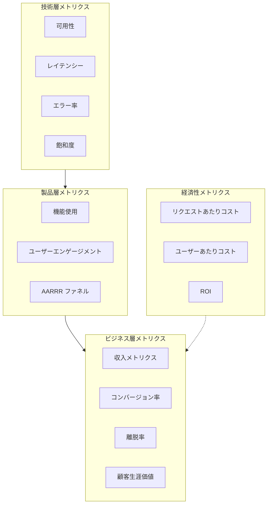

### 5.2 多次元ビジネスメトリクス実装

```python
import boto3
from enum import Enum
from typing import Dict, List, Optional
from dataclasses import dataclass
from datetime import datetime

class CustomerTier(Enum):
    FREE = "free"
    BASIC = "basic"
    PREMIUM = "premium"
    ENTERPRISE = "enterprise"

class BusinessEvent(Enum):
    SIGNUP = "user_signup"
    UPGRADE = "subscription_upgrade"
    PURCHASE = "purchase_completed"
    REFUND = "refund_processed"
    FEATURE_USED = "feature_used"
    SUPPORT_TICKET = "support_ticket_created"

@dataclass
class BusinessContext:
    """ビジネスコンテキストデータ"""
    customer_tier: CustomerTier
    region: str
    acquisition_channel: str
    feature_name: Optional[str] = None
    revenue_value: Optional[float] = None

class BusinessMetricsCollector:
    """
    ビジネスメトリクスコレクター
    多次元のビジネスメトリクストレースを実現
    """
    
    def __init__(self, namespace='Business/Application'):
        self.cloudwatch = boto3.client('cloudwatch')
        self.namespace = namespace
        
    def record_business_event(
        self,
        event: BusinessEvent,
        context: BusinessContext,
        metadata: Optional[Dict] = None
    ):
        """ビジネスイベントを記録します"""
        
        dimensions = [
            {'Name': 'EventType', 'Value': event.value},
            {'Name': 'CustomerTier', 'Value': context.customer_tier.value},
            {'Name': 'Region', 'Value': context.region},
            {'Name': 'Channel', 'Value': context.acquisition_channel}
        ]
        
        metric_data = [{
            'MetricName': 'BusinessEventCount',
            'Value': 1,
            'Unit': 'Count',
            'Dimensions': dimensions,
            'Timestamp': datetime.utcnow()
        }]
        
        # 収入が含まれる場合、収入メトリクスを記録
        if context.revenue_value:
            metric_data.append({
                'MetricName': 'Revenue',
                'Value': context.revenue_value,
                'Unit': 'None',
                'Dimensions': [
                    {'Name': 'EventType', 'Value': event.value},
                    {'Name': 'CustomerTier', 'Value': context.customer_tier.value}
                ],
                'Timestamp': datetime.utcnow()
            })
        
        self.cloudwatch.put_metric_data(
            Namespace=self.namespace,
            MetricData=metric_data
        )
    
    def record_feature_usage(
        self,
        feature_name: str,
        user_id: str,
        context: BusinessContext,
        usage_duration_ms: Optional[int] = None
    ):
        """機能使用状況を記録します"""
        
        dimensions = [
            {'Name': 'FeatureName', 'Value': feature_name},
            {'Name': 'CustomerTier', 'Value': context.customer_tier.value}
        ]
        
        metric_data = [{
            'MetricName': 'FeatureUsage',
            'Value': 1,
            'Unit': 'Count',
            'Dimensions': dimensions
        }]
        
        if usage_duration_ms:
            metric_data.append({
                'MetricName': 'FeatureUsageDuration',
                'Value': usage_duration_ms,
                'Unit': 'Milliseconds',
                'Dimensions': dimensions
            })
        
        self.cloudwatch.put_metric_data(
            Namespace=self.namespace,
            MetricData=metric_data
        )
    
    def calculate_unit_economics(
        self,
        start_time: datetime,
        end_time: datetime
    ) -> Dict:
        """
        単位経済性メトリクスを計算
        - CAC（顧客獲得コスト）
        - ARPU（ユーザーあたり平均収入）
        - LTV/CAC 比率
        """
        
        # アクティブユーザーを取得
        active_users = self.cloudwatch.get_metric_statistics(
            Namespace=self.namespace,
            MetricName='ActiveUsers',
            StartTime=start_time,
            EndTime=end_time,
            Period=86400,
            Statistics=['Sum']
        )
        
        # 総収入を取得
        revenue = self.cloudwatch.get_metric_statistics(
            Namespace=self.namespace,
            MetricName='Revenue',
            StartTime=start_time,
            EndTime=end_time,
            Period=86400,
            Statistics=['Sum']
        )
        
        total_users = sum(dp['Sum'] for dp in active_users['Datapoints'])
        total_revenue = sum(dp['Sum'] for dp in revenue['Datapoints'])
        
        arpu = total_revenue / total_users if total_users > 0 else 0
        
        # インフラストラクチャコストを取得（Cost Explorer APIから）
        # ここでは簡略化しています
        infrastructure_cost = self._get_infrastructure_cost(start_time, end_time)
        cost_per_user = infrastructure_cost / total_users if total_users > 0 else 0
        
        return {
            'arpu': arpu,
            'cost_per_user': cost_per_user,
            'unit_margin': arpu - cost_per_user,
            'total_users': total_users,
            'total_revenue': total_revenue,
            'infrastructure_cost': infrastructure_cost
        }
    
    def _get_infrastructure_cost(self, start_time: datetime, end_time: datetime) -> float:
        """インフラストラクチャコストを取得（簡略化実装）"""
        # 実際の実装ではCost Explorer APIを呼び出す必要があります
        return 10000.0  # サンプル値

# 使用例
def process_payment_event(payment_data: dict):
    """支払いイベントを処理し、ビジネスメトリクスを記録します"""
    
    collector = BusinessMetricsCollector()
    
    context = BusinessContext(
        customer_tier=CustomerTier(payment_data.get('tier', 'basic')),
        region=payment_data['region'],
        acquisition_channel=payment_data.get('channel', 'organic'),
        revenue_value=payment_data['amount']
    )
    
    collector.record_business_event(
        event=BusinessEvent.PURCHASE,
        context=context,
        metadata={
            'payment_method': payment_data['payment_method'],
            'promo_code': payment_data.get('promo_code'),
            'device_type': payment_data.get('device_type')
        }
    )
```

### 5.3 SLO/SLI モニタリング実装

```python
from dataclasses import dataclass
from typing import List, Tuple
import boto3

@dataclass
class SLODefinition:
    """SLO 定義"""
    name: str
    target: float  # 目標パーセンテージ、例: 99.9
    window_days: int  # 評価ウィンドウ（日）
    burn_rate_alerts: List[Tuple[float, float]]  # [(倍数, ウィンドウ時間)]

class SLOMonitor:
    """
    SLO モニタリングとエラーバジェット管理
    """
    
    def __init__(self):
        self.cloudwatch = boto3.client('cloudwatch')
    
    def calculate_error_budget(
        self,
        slo: SLODefinition,
        start_time: datetime,
        end_time: datetime
    ) -> Dict:
        """エラーバジェット状態を計算します"""
        
        # 総リクエスト数を取得
        total_requests = self.cloudwatch.get_metric_statistics(
            Namespace='Application/SLI',
            MetricName='TotalRequests',
            Dimensions=[{'Name': 'SLO', 'Value': slo.name}],
            StartTime=start_time,
            EndTime=end_time,
            Period=3600,
            Statistics=['Sum']
        )
        
        # エラーリクエスト数を取得
        error_requests = self.cloudwatch.get_metric_statistics(
            Namespace='Application/SLI',
            MetricName='ErrorRequests',
            Dimensions=[{'Name': 'SLO', 'Value': slo.name}],
            StartTime=start_time,
            EndTime=end_time,
            Period=3600,
            Statistics=['Sum']
        )
        
        total = sum(dp['Sum'] for dp in total_requests['Datapoints'])
        errors = sum(dp['Sum'] for dp in error_requests['Datapoints'])
        
        # エラーバジェットを計算
        error_budget_total = total * (100 - slo.target) / 100
        error_budget_remaining = error_budget_total - errors
        error_budget_percentage = (error_budget_remaining / error_budget_total * 100) if error_budget_total > 0 else 0
        
        return {
            'slo_name': slo.name,
            'target': slo.target,
            'total_requests': total,
            'error_requests': errors,
            'current_availability': ((total - errors) / total * 100) if total > 0 else 100,
            'error_budget_total': error_budget_total,
            'error_budget_remaining': error_budget_remaining,
            'error_budget_percentage': error_budget_percentage,
            'status': 'HEALTHY' if error_budget_percentage > 25 else 'WARNING' if error_budget_percentage > 0 else 'EXHAUSTED'
        }
    
    def check_burn_rate(self, slo: SLODefinition, error_budget_status: Dict) -> List[Dict]:
        """エラーバジェット消費レートをチェックします"""
        
        alerts = []
        
        for multiplier, window_hours in slo.burn_rate_alerts:
            # ウィンドウ内の消費を計算
            window_start = datetime.utcnow() - timedelta(hours=window_hours)
            
            window_status = self.calculate_error_budget(
                slo,
                window_start,
                datetime.utcnow()
            )
            
            # 消費レートを計算
            expected_consumption = (window_hours / (slo.window_days * 24)) * 100
            actual_consumption = 100 - window_status['error_budget_percentage']
            
            burn_rate = actual_consumption / expected_consumption if expected_consumption > 0 else 0
            
            if burn_rate > multiplier:
                alerts.append({
                    'severity': 'CRITICAL' if multiplier >= 14.4 else 'WARNING',
                    'burn_rate': burn_rate,
                    'multiplier': multiplier,
                    'window_hours': window_hours,
                    'message': f'エラーバジェット消費レート {burn_rate:.1f}x、閾値 {multiplier}x を超過'
                })
        
        return alerts

# SLO 定義例
api_availability_slo = SLODefinition(
    name='api_availability',
    target=99.9,  # 99.9% 可用性
    window_days=30,
    burn_rate_alerts=[
        (14.4, 1),   # 1時間以内に14.4倍以上の消費 - 緊急
        (6, 6),      # 6時間以内に6倍以上の消費 - 警告
        (2, 72)      # 3日以内に2倍以上の消費 - 注意
    ]
)
```

---

## 6. ログ管理と分析

### 6.1 ログアーキテクチャ設計

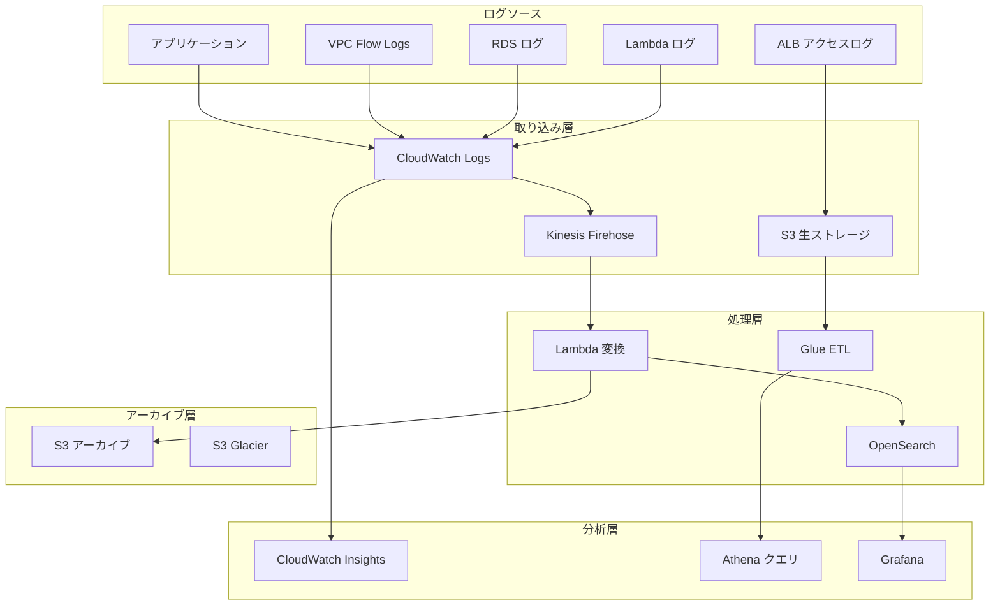

### 6.2 構造化ログと関連付けトレース

```python
import json
import logging
import uuid
from datetime import datetime
from typing import Dict, Any, Optional
from contextvars import ContextVar

# リクエストコンテキスト
request_context: ContextVar[Dict[str, Any]] = ContextVar('request_context', default={})

class StructuredLogger:
    """
    構造化ロガー
    - トレースコンテキストを自動注入
    - ログレベルの動的調整をサポート
    - ビジネスメトリクスに関連付け
    """
    
    def __init__(self, service_name: str, log_level: int = logging.INFO):
        self.service_name = service_name
        self.logger = logging.getLogger(service_name)
        self.logger.setLevel(log_level)
        
        # JSON形式ハンドラーを構成
        handler = logging.StreamHandler()
        handler.setFormatter(JsonFormatter())
        self.logger.addHandler(handler)
    
    def _build_log_record(
        self,
        level: str,
        message: str,
        extra: Optional[Dict] = None
    ) -> Dict:
        """構造化ログレコードを構築します"""
        
        context = request_context.get()
        
        record = {
            'timestamp': datetime.utcnow().isoformat(),
            'level': level,
            'service': self.service_name,
            'message': message,
            'trace_id': context.get('trace_id', str(uuid.uuid4())),
            'span_id': context.get('span_id'),
            'user_id': context.get('user_id'),
            'request_path': context.get('request_path'),
            'environment': context.get('environment', 'production')
        }
        
        if extra:
            record['extra'] = extra
        
        return record
    
    def info(self, message: str, extra: Optional[Dict] = None):
        self.logger.info(self._build_log_record('INFO', message, extra))
    
    def warning(self, message: str, extra: Optional[Dict] = None):
        self.logger.warning(self._build_log_record('WARNING', message, extra))
    
    def error(self, message: str, extra: Optional[Dict] = None):
        self.logger.error(self._build_log_record('ERROR', message, extra))
    
    def debug(self, message: str, extra: Optional[Dict] = None):
        self.logger.debug(self._build_log_record('DEBUG', message, extra))
    
    def metric(self, metric_name: str, value: float, unit: str = 'Count', dimensions: Optional[Dict] = None):
        """メトリクスログを記録（EMF形式）"""
        
        emf_record = {
            '_aws': {
                'Timestamp': int(datetime.utcnow().timestamp() * 1000),
                'CloudWatchMetrics': [
                    {
                        'Namespace': f'{self.service_name}/Metrics',
                        'Dimensions': [list(dimensions.keys())] if dimensions else [[]],
                        'Metrics': [{'Name': metric_name, 'Unit': unit}]
                    }
                ]
            },
            metric_name: value
        }
        
        if dimensions:
            emf_record.update(dimensions)
        
        self.logger.info(emf_record)

class JsonFormatter(logging.Formatter):
    """JSON ログフォーマッター"""
    
    def format(self, record):
        if isinstance(record.msg, dict):
            return json.dumps(record.msg, ensure_ascii=False)
        return super().format(record)

# コンテキストマネージャー
class RequestContext:
    """リクエストコンテキストマネージャー"""
    
    def __init__(self, trace_id: Optional[str] = None, user_id: Optional[str] = None):
        self.context = {
            'trace_id': trace_id or str(uuid.uuid4()),
            'span_id': str(uuid.uuid4())[:8],
            'user_id': user_id,
            'start_time': datetime.utcnow()
        }
        self.token = None
    
    def __enter__(self):
        self.token = request_context.set(self.context)
        return self.context
    
    def __exit__(self, exc_type, exc_val, exc_tb):
        request_context.reset(self.token)

# 使用例
logger = StructuredLogger('PaymentService')

def process_payment(request_data: dict):
    with RequestContext(user_id=request_data.get('user_id')):
        logger.info('Payment processing started', extra={
            'order_id': request_data['order_id'],
            'amount': request_data['amount']
        })
        
        try:
            # 支払いロジックを処理
            result = charge_customer(request_data)
            
            logger.metric(
                metric_name='PaymentSuccess',
                value=1,
                dimensions={
                    'payment_method': request_data['payment_method'],
                    'customer_tier': request_data.get('tier', 'standard')
                }
            )
            
            return result
            
        except Exception as e:
            logger.error('Payment failed', extra={
                'order_id': request_data['order_id'],
                'error': str(e),
                'error_type': type(e).__name__
            })
            raise
```

---

## 7. アラーム戦略とインシデント対応

### 7.1 インテリジェントアラームアーキテクチャ

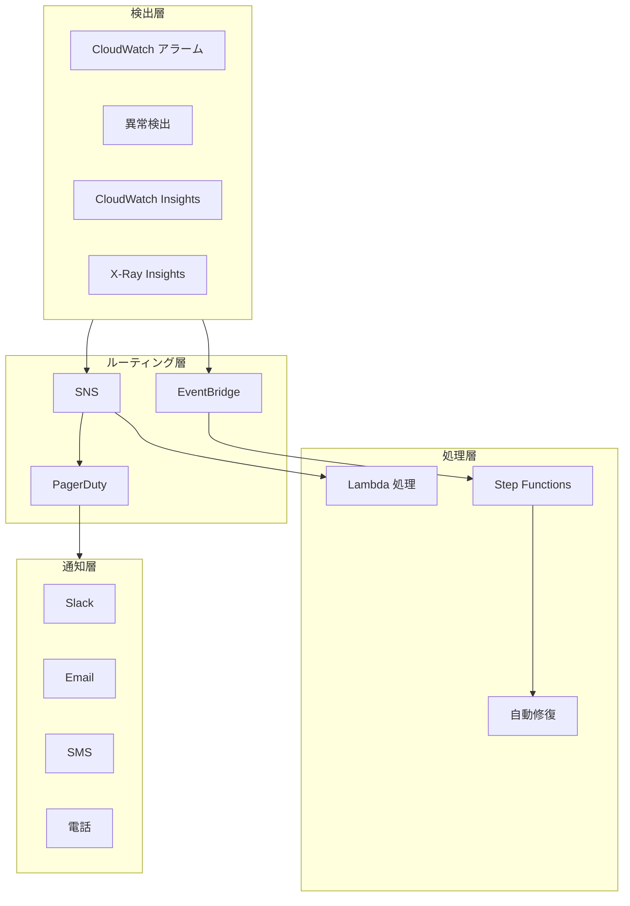

### 7.2 アラーム戦略設計

```python
import boto3
from dataclasses import dataclass
from typing import List, Dict, Optional
from enum import Enum

class AlertSeverity(Enum):
    P1 = "critical"      # 即時対応 (< 5分)
    P2 = "high"          # 迅速対応 (< 30分)
    P3 = "medium"        # 勤務時間内対応 (< 4時間)
    P4 = "low"           # 翌営業日対応

class AlertChannel(Enum):
    PAGERDUTY = "pagerduty"
    SLACK = "slack"
    EMAIL = "email"
    SMS = "sms"

@dataclass
class AlertRule:
    """アラームルール定義"""
    name: str
    metric_name: str
    namespace: str
    threshold: float
    comparison_operator: str  # GreaterThanThreshold, LessThanThreshold, etc.
    evaluation_periods: int
    period: int  # seconds
    severity: AlertSeverity
    channels: List[AlertChannel]
    auto_remediate: bool = False
    runbook_url: Optional[str] = None

class AlertManager:
    """
    アラームマネージャー
    - 重要度に基づくルーティング
    - アラーム抑制と集約
    - 自動修復統合
    """
    
    def __init__(self):
        self.cloudwatch = boto3.client('cloudwatch')
        self.sns = boto3.client('sns')
    
    def create_alarm(self, rule: AlertRule, dimensions: List[Dict]):
        """CloudWatch アラームを作成します"""
        
        alarm_name = f"{rule.severity.value}-{rule.name}"
        
        # 重要度に応じてSNSトピックを選択
        topic_arn = self._get_topic_for_severity(rule.severity)
        
        alarm_actions = [topic_arn]
        
        # 自動修復
        if rule.auto_remediate:
            remediation_lambda = self._get_remediation_lambda(rule.name)
            alarm_actions.append(remediation_lambda)
        
        self.cloudwatch.put_metric_alarm(
            AlarmName=alarm_name,
            AlarmDescription=self._build_description(rule),
            MetricName=rule.metric_name,
            Namespace=rule.namespace,
            Dimensions=dimensions,
            Statistic='Average',
            Period=rule.period,
            EvaluationPeriods=rule.evaluation_periods,
            Threshold=rule.threshold,
            ComparisonOperator=rule.comparison_operator,
            AlarmActions=alarm_actions,
            OKActions=[topic_arn],
            Tags=[
                {'Key': 'Severity', 'Value': rule.severity.value},
                {'Key': 'Runbook', 'Value': rule.runbook_url or ''},
                {'Key': 'AutoRemediate', 'Value': str(rule.auto_remediate)}
            ]
        )
        
        return alarm_name
    
    def _get_topic_for_severity(self, severity: AlertSeverity) -> str:
        """重要度に対応するSNSトピックを取得します"""
        topics = {
            AlertSeverity.P1: 'arn:aws:sns:us-east-1:123456789:alerts-p1',
            AlertSeverity.P2: 'arn:aws:sns:us-east-1:123456789:alerts-p2',
            AlertSeverity.P3: 'arn:aws:sns:us-east-1:123456789:alerts-p3',
            AlertSeverity.P4: 'arn:aws:sns:us-east-1:123456789:alerts-p4'
        }
        return topics[severity]
    
    def _build_description(self, rule: AlertRule) -> str:
        """アラーム説明を構築します"""
        return json.dumps({
            'rule_name': rule.name,
            'severity': rule.severity.value,
            'runbook': rule.runbook_url,
            'channels': [c.value for c in rule.channels],
            'auto_remediate': rule.auto_remediate
        })
    
    def create_composite_alarm(self, name: str, rules: List[AlertRule]):
        """複合アラーム（複数条件トリガー）を作成します"""
        
        # 例: 高CPU + 高メモリ = 容量アラーム
        expression = 'ALARM(cpu-high) AND ALARM(memory-high)'
        
        self.cloudwatch.put_composite_alarm(
            AlarmName=name,
            AlarmRule=expression,
            AlarmActions=[self._get_topic_for_severity(AlertSeverity.P2)],
            AlarmDescription='複合アラーム：容量不足'
        )
    
    def create_anomaly_detection_alarm(
        self,
        metric_name: str,
        namespace: str,
        dimensions: List[Dict],
        threshold: float = 2.0  # 標準偏差の倍数
    ):
        """異常検出アラームを作成します"""
        
        # 異常検出モデルを作成
        anomaly_detector = self.cloudwatch.put_anomaly_detector(
            Namespace=namespace,
            MetricName=metric_name,
            Dimensions=dimensions,
            Stat='Average'
        )
        
        # 異常検出に基づくアラーム
        self.cloudwatch.put_metric_alarm(
            AlarmName=f'anomaly-{metric_name}',
            MetricName=metric_name,
            Namespace=namespace,
            Dimensions=dimensions,
            Statistic='Average',
            Period=300,
            EvaluationPeriods=2,
            Threshold=threshold,
            ComparisonOperator='GreaterThanUpperThreshold',
            TreatMissingData='notBreaching'
        )

# アラームルール定義例
ALERT_RULES = [
    AlertRule(
        name='api-error-rate',
        metric_name='ErrorRate',
        namespace='Application/API',
        threshold=1.0,  # 1% エラー率
        comparison_operator='GreaterThanThreshold',
        evaluation_periods=2,
        period=60,
        severity=AlertSeverity.P1,
        channels=[AlertChannel.PAGERDUTY, AlertChannel.SLACK],
        auto_remediate=True,
        runbook_url='https://wiki.internal/runbooks/api-error-rate'
    ),
    AlertRule(
        name='api-latency-p99',
        metric_name='Latency',
        namespace='Application/API',
        threshold=1000,  # 1000ms
        comparison_operator='GreaterThanThreshold',
        evaluation_periods=3,
        period=60,
        severity=AlertSeverity.P2,
        channels=[AlertChannel.SLACK],
        auto_remediate=False
    ),
    AlertRule(
        name='cost-anomaly',
        metric_name='EstimatedCharges',
        namespace='AWS/Billing',
        threshold=2.0,  # 2倍標準偏差
        comparison_operator='GreaterThanThreshold',
        evaluation_periods=1,
        period=86400,
        severity=AlertSeverity.P3,
        channels=[AlertChannel.EMAIL],
        auto_remediate=False
    )
]
```

### 7.3 自動修復実装

```python
import boto3
import json
from typing import Dict, List

class AutoRemediation:
    """
    自動修復システム
    - 一般的な問題の自動処理
    - 修復操作の監査
    - 手動エスカレーション機構
    """
    
    def __init__(self):
        self.ec2 = boto3.client('ec2')
        self.rds = boto3.client('rds')
        self.lambda_client = boto3.client('lambda')
        self.sns = boto3.client('sns')
    
    def handle_high_cpu(self, instance_id: str, context: Dict) -> Dict:
        """高CPUアラームを処理します"""
        
        actions_taken = []
        
        # 1. 予期される負荷かどうかをチェック
        if self._is_expected_load(instance_id):
            return {
                'status': 'skipped',
                'reason': 'Expected load pattern',
                'actions': actions_taken
            }
        
        # 2. 該当する場合、アプリケーションサービスを再起動
        try:
            self._restart_application(instance_id)
            actions_taken.append('restart_application')
        except Exception as e:
            actions_taken.append(f'restart_failed: {str(e)}')
        
        # 3. それでもCPUが高い場合、スケールアップを試行
        if self._check_cpu_still_high(instance_id):
            try:
                self._scale_up_instance(instance_id)
                actions_taken.append('scale_up_instance')
            except Exception as e:
                actions_taken.append(f'scale_up_failed: {str(e)}')
                # 人間に通知
                self._escalate_to_human(instance_id, context)
        
        return {
            'status': 'completed',
            'actions': actions_taken,
            'instance_id': instance_id
        }
    
    def handle_disk_full(self, instance_id: str, context: Dict) -> Dict:
        """ディスク満杯アラームを処理します"""
        
        actions_taken = []
        
        # 1. ログファイルをクリーンアップ
        try:
            self._clean_log_files(instance_id)
            actions_taken.append('clean_logs')
        except Exception as e:
            actions_taken.append(f'clean_logs_failed: {str(e)}')
        
        # 2. 一時ファイルをクリーンアップ
        try:
            self._clean_temp_files(instance_id)
            actions_taken.append('clean_temp')
        except Exception as e:
            actions_taken.append(f'clean_temp_failed: {str(e)}')
        
        # 3. それでも満杯の場合、ディスクを拡張
        if self._check_disk_still_full(instance_id):
            try:
                self._extend_volume(instance_id)
                actions_taken.append('extend_volume')
            except Exception as e:
                actions_taken.append(f'extend_failed: {str(e)}')
                self._escalate_to_human(instance_id, context)
        
        return {
            'status': 'completed',
            'actions': actions_taken
        }
    
    def handle_lambda_errors(self, function_name: str, context: Dict) -> Dict:
        """Lambda エラーを処理します"""
        
        actions_taken = []
        
        # 1. コードエラーかどうかをチェック（人間による修復が必要）
        error_pattern = self._analyze_error_pattern(function_name)
        
        if error_pattern['type'] == 'code_error':
            self._escalate_to_human(function_name, context, priority='HIGH')
            return {
                'status': 'escalated',
                'reason': 'Code error detected',
                'error_pattern': error_pattern
            }
        
        # 2. リソース制限の場合、メモリ/タイムアウトを増加
        if error_pattern['type'] == 'timeout':
            self._increase_lambda_timeout(function_name)
            actions_taken.append('increased_timeout')
        
        if error_pattern['type'] == 'memory_exceeded':
            self._increase_lambda_memory(function_name)
            actions_taken.append('increased_memory')
        
        # 3. 下流サービスの問題の場合、該当チームに通知
        if error_pattern['type'] == 'dependency_error':
            self._notify_dependency_team(error_pattern['dependency'])
            actions_taken.append('notified_dependency_team')
        
        return {
            'status': 'completed',
            'actions': actions_taken
        }
    
    def _is_expected_load(self, instance_id: str) -> bool:
        """予期される負荷かどうかをチェックします"""
        # 実装：現在時刻が予期されるピークウィンドウ内かをチェック
        return False
    
    def _escalate_to_human(self, resource_id: str, context: Dict, priority: str = 'MEDIUM'):
        """人間にエスカレーションします"""
        message = {
            'default': json.dumps({
                'resource_id': resource_id,
                'alarm_context': context,
                'auto_remediation_status': 'escalated',
                'priority': priority
            }),
            'email': f"""
            自動修復エスカレーション通知
            
            リソース: {resource_id}
            アラーム: {context.get('AlarmName', 'Unknown')}
            自動修復でこの問題を処理できません。人間の介入が必要です。
            
            詳細は CloudWatch コンソールをご覧ください。
            """
        }
        
        self.sns.publish(
            TopicArn='arn:aws:sns:us-east-1:123456789:escalation',
            Message=json.dumps(message),
            MessageStructure='json'
        )
    
    # その他の補助メソッド...
    def _restart_application(self, instance_id: str):
        pass
    
    def _scale_up_instance(self, instance_id: str):
        pass
    
    def _check_cpu_still_high(self, instance_id: str) -> bool:
        return False
    
    def _clean_log_files(self, instance_id: str):
        pass
    
    def _clean_temp_files(self, instance_id: str):
        pass
    
    def _check_disk_still_full(self, instance_id: str) -> bool:
        return False
    
    def _extend_volume(self, instance_id: str):
        pass
    
    def _analyze_error_pattern(self, function_name: str) -> Dict:
        return {'type': 'unknown'}
    
    def _increase_lambda_timeout(self, function_name: str):
        pass
    
    def _increase_lambda_memory(self, function_name: str):
        pass
    
    def _notify_dependency_team(self, dependency: str):
        pass

# Lambda ハンドラー関数
def lambda_handler(event, context):
    """アラームイベントを処理します"""
    
    remediation = AutoRemediation()
    
    alarm_name = event['alarmName']
    alarm_description = json.loads(event['alarmDescription'])
    resource_id = event['trigger']['dimensions'][0]['value']
    
    # アラームタイプに応じてルーティング
    if 'high-cpu' in alarm_name:
        result = remediation.handle_high_cpu(resource_id, event)
    elif 'disk-full' in alarm_name:
        result = remediation.handle_disk_full(resource_id, event)
    elif 'lambda-error' in alarm_name:
        result = remediation.handle_lambda_errors(resource_id, event)
    else:
        result = {'status': 'unknown_alarm_type'}
    
    return result
```

---

## 8. APM アプリケーションパフォーマンスモニタリング

### 8.1 APM アーキテクチャ設計

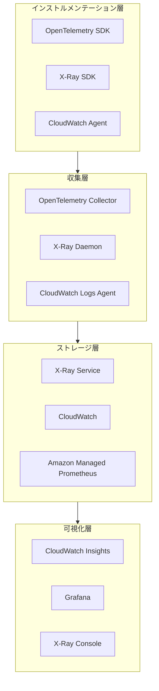

### 8.2 OpenTelemetry 統合

```python
from opentelemetry import trace, metrics
from opentelemetry.exporter.otlp.proto.grpc.trace_exporter import OTLPSpanExporter
from opentelemetry.sdk.trace import TracerProvider
from opentelemetry.sdk.trace.export import BatchSpanProcessor
from opentelemetry.sdk.resources import Resource, SERVICE_NAME, SERVICE_VERSION
from opentelemetry.instrumentation.flask import FlaskInstrumentor
from opentelemetry.instrumentation.boto3 import Boto3Instrumentor
from opentelemetry.instrumentation.requests import RequestsInstrumentor
import time

# リソース設定
resource = Resource.create({
    SERVICE_NAME: "payment-service",
    SERVICE_VERSION: "1.0.0",
    "deployment.environment": "production",
    "host.name": "payment-pod-123",
    "service.namespace": "ecommerce"
})

# Tracer Provider の設定
trace.set_tracer_provider(TracerProvider(resource=resource))

tracer = trace.get_tracer(__name__)

# OTLP Exporter の設定（ADOT Collectorに送信）
otlp_exporter = OTLPSpanExporter(
    endpoint="otel-collector.monitoring.svc.cluster.local:4317",
    insecure=True
)

span_processor = BatchSpanProcessor(
    otlp_exporter,
    max_queue_size=2048,
    max_export_batch_size=512,
    schedule_delay_millis=5000
)

trace.get_tracer_provider().add_span_processor(span_processor)

class PaymentService:
    """
    OpenTelemetry インストルメンテーションを使用した支払いサービス
    """
    
    def __init__(self):
        self.tracer = trace.get_tracer(__name__)
    
    @tracer.start_as_current_span("process_payment")
    def process_payment(self, payment_request: dict) -> dict:
        """支払いリクエストを処理します"""
        
        span = trace.get_current_span()
        
        # ビジネス属性を追加
        span.set_attribute("payment.order_id", payment_request["order_id"])
        span.set_attribute("payment.amount", payment_request["amount"])
        span.set_attribute("payment.currency", payment_request["currency"])
        span.set_attribute("payment.method", payment_request["method"])
        span.set_attribute("customer.tier", payment_request.get("customer_tier", "standard"))
        
        try:
            # 支払いを検証
            with self.tracer.start_as_current_span("validate_payment") as validation_span:
                validation_span.set_attribute("validation.type", "fraud_check")
                is_valid = self._validate_payment(payment_request)
                validation_span.set_attribute("validation.result", is_valid)
            
            if not is_valid:
                span.set_attribute("payment.status", "rejected")
                span.set_status(trace.Status(trace.StatusCode.ERROR, "Payment validation failed"))
                return {"status": "rejected", "reason": "validation_failed"}
            
            # 支払いゲートウェイを呼び出し
            with self.tracer.start_as_current_span("call_payment_gateway") as gateway_span:
                gateway_span.set_attribute("gateway.provider", "stripe")
                start_time = time.time()
                
                result = self._call_payment_gateway(payment_request)
                
                latency = (time.time() - start_time) * 1000
                gateway_span.set_attribute("gateway.latency_ms", latency)
                gateway_span.set_attribute("gateway.success", result["success"])
            
            # 注文を記録
            with self.tracer.start_as_current_span("record_order"):
                self._save_order(payment_request, result)
            
            span.set_attribute("payment.status", "completed")
            span.set_attribute("payment.transaction_id", result["transaction_id"])
            
            return {"status": "success", "transaction_id": result["transaction_id"]}
            
        except Exception as e:
            span.set_attribute("payment.status", "failed")
            span.set_attribute("error.type", type(e).__name__)
            span.set_attribute("error.message", str(e))
            span.set_status(trace.Status(trace.StatusCode.ERROR, str(e)))
            raise
    
    def _validate_payment(self, request: dict) -> bool:
        """支払いを検証します"""
        time.sleep(0.01)  # 処理をシミュレート
        return True
    
    def _call_payment_gateway(self, request: dict) -> dict:
        """支払いゲートウェイを呼び出します"""
        time.sleep(0.1)  # 外部呼び出しをシミュレート
        return {"success": True, "transaction_id": "txn_12345"}
    
    def _save_order(self, request: dict, result: dict):
        """注文を保存します"""
        time.sleep(0.005)

# Flask アプリケーション統合
from flask import Flask, request

app = Flask(__name__)

# 自動インストルメンテーション
FlaskInstrumentor().instrument_app(app)
Boto3Instrumentor().instrument()
RequestsInstrumentor().instrument()

payment_service = PaymentService()

@app.route('/api/payment', methods=['POST'])
def handle_payment():
    data = request.json
    
    # 現在の span に自動的に HTTP 属性が含まれる
    current_span = trace.get_current_span()
    current_span.set_attribute("http.request.body_size", len(request.data))
    
    result = payment_service.process_payment(data)
    
    return result
```

---

## 9. アーキテクチャ経済性分析フレームワーク

### 9.1 モニタリングコスト属性付けモデル

```python
from dataclasses import dataclass
from typing import Dict, List
from datetime import datetime, timedelta
import boto3

@dataclass
class CostAttribution:
    """コスト属性付けデータ"""
    service_name: str
    component: str
    environment: str
    team: str
    metric_cost: float
    log_cost: float
    trace_cost: float
    dashboard_cost: float
    total_cost: float

class MonitoringCostAnalyzer:
    """
    モニタリングコストアナライザー
    - サービス/チーム/環境別にコストを属性付け
    - コスト最適化の機会を特定
    - コストレポートを生成
    """
    
    def __init__(self):
        self.cloudwatch = boto3.client('cloudwatch')
        self.logs = boto3.client('logs')
        self.xray = boto3.client('xray')
        self.cost_explorer = boto3.client('ce')
    
    def analyze_cloudwatch_costs(self, start_date: datetime, end_date: datetime) -> Dict:
        """CloudWatch コストを分析します"""
        
        # CUR (Cost and Usage Report) データを取得
        response = self.cost_explorer.get_cost_and_usage(
            TimePeriod={
                'Start': start_date.strftime('%Y-%m-%d'),
                'End': end_date.strftime('%Y-%m-%d')
            },
            Granularity='MONTHLY',
            Metrics=['UnblendedCost'],
            GroupBy=[
                {'Type': 'DIMENSION', 'Key': 'SERVICE'},
                {'Type': 'TAG', 'Key': 'Environment'}
            ],
            Filter={
                'Dimensions': {
                    'Key': 'SERVICE',
                    'Values': ['AmazonCloudWatch']
                }
            }
        )
        
        results = []
        for result in response['ResultsByTime']:
            for group in result['Groups']:
                keys = group['Keys']
                cost = float(group['Metrics']['UnblendedCost']['Amount'])
                
                results.append({
                    'service': keys[0],
                    'environment': keys[1] if len(keys) > 1 else 'untagged',
                    'cost': cost
                })
        
        return results
    
    def calculate_metric_cost(self, namespace: str, days: int = 30) -> Dict:
        """
        メトリクスコストを計算
        CloudWatch Metrics: $0.30 per metric per month
        カスタムメトリクス: $0.30 per metric per month
        API 呼び出し: $0.01 per 1,000 requests
        """
        
        # 名前空間内のメトリクス数を取得
        paginator = self.cloudwatch.get_paginator('list_metrics')
        metric_count = 0
        
        for page in paginator.paginate(Namespace=namespace):
            metric_count += len(page['Metrics'])
        
        # 月次コストを推定
        monthly_cost = metric_count * 0.30
        
        # PutMetricData API コストを推定
        # 各メトリクスが1分ごとにプッシュされると仮定
        api_calls_per_month = metric_count * 60 * 24 * 30  # 月の分数
        api_cost = (api_calls_per_month / 1000) * 0.01
        
        return {
            'namespace': namespace,
            'metric_count': metric_count,
            'metric_cost': monthly_cost,
            'api_cost': api_cost,
            'total_cost': monthly_cost + api_cost
        }
    
    def calculate_log_cost(self, log_group: str, days: int = 30) -> Dict:
        """
        ログコストを計算
        取り込み: $0.50 per GB
        ストレージ: $0.03 per GB
        Insights 分析: $0.005 per GB scanned
        """
        
        # ロググループ統計を取得
        response = self.logs.describe_log_groups(
            logGroupNamePrefix=log_group
        )
        
        total_stored_bytes = 0
        for group in response['logGroups']:
            total_stored_bytes += group.get('storedBytes', 0)
        
        # 最近の取り込みデータを取得
        start_time = datetime.utcnow() - timedelta(days=days)
        
        # Insights クエリで取り込みを推定
        query = f"""
        fields @ingestionTime
        | stats count() as events
        | limit 1
        """
        
        # 簡易推定：ログ1件あたり平均1KBと仮定
        estimated_daily_logs = 1000000  # 実際のクエリが必要
        daily_ingestion_gb = (estimated_daily_logs * 1024) / (1024**3)
        
        monthly_ingestion_cost = daily_ingestion_gb * 30 * 0.50
        monthly_storage_cost = (total_stored_bytes / (1024**3)) * 0.03
        
        return {
            'log_group': log_group,
            'stored_gb': total_stored_bytes / (1024**3),
            'estimated_daily_ingestion_gb': daily_ingestion_gb,
            'ingestion_cost': monthly_ingestion_cost,
            'storage_cost': monthly_storage_cost,
            'total_cost': monthly_ingestion_cost + monthly_storage_cost
        }
    
    def identify_cost_optimization_opportunities(self) -> List[Dict]:
        """コスト最適化の機会を特定します"""
        
        opportunities = []
        
        # 1. 未使用のメトリクスをチェック
        unused_metrics = self._find_unused_metrics()
        if unused_metrics:
            savings = len(unused_metrics) * 0.30
            opportunities.append({
                'type': 'unused_metrics',
                'description': f'{len(unused_metrics)} 個の未使用カスタムメトリクスが検出されました',
                'potential_savings': savings,
                'action': '未使用メトリクスの削除またはプッシュ停止'
            })
        
        # 2. 高頻度ログをチェック
        high_volume_logs = self._find_high_volume_log_groups()
        for log_group in high_volume_logs:
            if log_group['daily_gb'] > 100:  # 1日100GB超
                opportunities.append({
                    'type': 'high_volume_logs',
                    'log_group': log_group['name'],
                    'description': f'ロググループ {log_group["name"]} が1日に {log_group["daily_gb"]:.1f} GB のログを生成',
                    'potential_savings': log_group['daily_gb'] * 30 * 0.50 * 0.5,  # 50%削減と仮定
                    'action': 'ログレベルの調整、フィルタルールの追加、または保持期間の短縮'
                })
        
        # 3. 詳細な X-Ray サンプリングをチェック
        xray_cost = self._analyze_xray_cost()
        if xray_cost['monthly_cost'] > 1000:
            opportunities.append({
                'type': 'xray_sampling',
                'description': f'X-Ray 月次コスト ${xray_cost["monthly_cost"]:.2f}',
                'potential_savings': xray_cost['monthly_cost'] * 0.5,
                'action': 'サンプリングレートの調整、または重要なパスのみトレースを有効化'
            })
        
        return opportunities
    
    def generate_cost_report(self, start_date: datetime, end_date: datetime) -> Dict:
        """モニタリングコストレポートを生成します"""
        
        # コストを分析
        cloudwatch_costs = self.analyze_cloudwatch_costs(start_date, end_date)
        optimization_opportunities = self.identify_cost_optimization_opportunities()
        
        total_cost = sum(item['cost'] for item in cloudwatch_costs)
        potential_savings = sum(opp['potential_savings'] for opp in optimization_opportunities)
        
        return {
            'period': {
                'start': start_date.isoformat(),
                'end': end_date.isoformat()
            },
            'total_monitoring_cost': total_cost,
            'cost_breakdown': cloudwatch_costs,
            'optimization_opportunities': optimization_opportunities,
            'potential_savings': potential_savings,
            'optimization_percentage': (potential_savings / total_cost * 100) if total_cost > 0 else 0
        }
    
    def _find_unused_metrics(self) -> List[str]:
        """未使用のメトリクスを検索します"""
        # 実装：過去7日間データポイントがないメトリクスをクエリ
        return []
    
    def _find_high_volume_log_groups(self) -> List[Dict]:
        """高容量ロググループを検索します"""
        return []
    
    def _analyze_xray_cost(self) -> Dict:
        """X-Ray コストを分析します"""
        return {'monthly_cost': 0}

# コスト効率メトリクス計算器
class CostEfficiencyMetrics:
    """
    モニタリングコスト効率メトリクス
    """
    
    def calculate_cost_per_request(
        self,
        total_monitoring_cost: float,
        total_requests: int
    ) -> float:
        """リクエストあたりのモニタリングコストを計算します"""
        return total_monitoring_cost / total_requests if total_requests > 0 else 0
    
    def calculate_cost_per_user(
        self,
        total_monitoring_cost: float,
        active_users: int
    ) -> float:
        """ユーザーあたりのモニタリングコストを計算します"""
        return total_monitoring_cost / active_users if active_users > 0 else 0
    
    def calculate_mttr_cost_savings(
        self,
        mttr_before: float,  # 分
        mttr_after: float,
        incident_cost_per_minute: float,
        incidents_per_month: int
    ) -> float:
        """
        MTTR 改善によるコスト節約を計算します
        """
        mttr_improvement = mttr_before - mttr_after
        monthly_savings = mttr_improvement * incident_cost_per_minute * incidents_per_month
        return monthly_savings
    
    def calculate_downtime_prevention_value(
        self,
        availability_before: float,  # パーセンテージ、例: 99.9
        availability_after: float,
        revenue_per_minute: float
    ) -> float:
        """
        可用性向上による価値を計算します
        """
        downtime_before = (100 - availability_before) / 100 * 43200  # 月間分数
        downtime_after = (100 - availability_after) / 100 * 43200
        
        downtime_prevented = downtime_before - downtime_after
        value = downtime_prevented * revenue_per_minute
        
        return value
```

### 9.2 経済的に効率的なオブザーバビリティ戦略

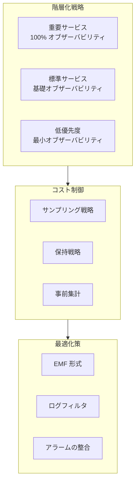

---

## 10. コストモニタリングと最適化実践

### 10.1 AWS Cost Anomaly Detection 統合

```python
import boto3
from datetime import datetime, timedelta

class CostMonitoring:
    """
    AWS コストモニタリングと異常検出
    """
    
    def __init__(self):
        self.ce = boto3.client('ce')
        self.budgets = boto3.client('budgets')
        self.anomaly = boto3.client('ce', region_name='us-east-1')
    
    def create_anomaly_detector(self, monitor_type='DIMENSIONAL'):
        """コスト異常検出器を作成します"""
        
        response = self.ce.create_anomaly_monitor(
            AnomalyMonitor={
                'MonitorType': monitor_type,
                'MonitorName': 'DailyCostMonitor',
                'MonitorSpecification': {
                    'MatchOptions': ['EQUALS'],
                    'Values': ['USAGE']
                }
            }
        )
        
        monitor_arn = response['MonitorArn']
        
        # 異常サブスクリプションを作成
        self.ce.create_anomaly_subscription(
            AnomalySubscription={
                'SubscriptionName': 'CostAlertSubscription',
                'Threshold': 100,  # $100
                'Frequency': 'IMMEDIATE',
                'MonitorArnList': [monitor_arn],
                'Subscribers': [
                    {
                        'Type': 'SNS',
                        'Address': 'arn:aws:sns:us-east-1:123456789:cost-alerts'
                    }
                ]
            }
        )
        
        return monitor_arn
    
    def create_budget_with_alert(self, budget_amount: float, email: str):
        """予算アラームを作成します"""
        
        budget = {
            'BudgetName': 'MonthlyBudget',
            'BudgetLimit': {
                'Amount': str(budget_amount),
                'Unit': 'USD'
            },
            'TimeUnit': 'MONTHLY',
            'BudgetType': 'COST',
            'CostFilters': {}
        }
        
        notifications = [
            {
                'Notification': {
                    'NotificationType': 'ACTUAL',
                    'ComparisonOperator': 'GREATER_THAN',
                    'Threshold': 80  # 80% 実際
                },
                'Subscribers': [{'SubscriptionType': 'EMAIL', 'Address': email}]
            },
            {
                'Notification': {
                    'NotificationType': 'FORECASTED',
                    'ComparisonOperator': 'GREATER_THAN',
                    'Threshold': 100  # 100% 予測
                },
                'Subscribers': [{'SubscriptionType': 'EMAIL', 'Address': email}]
            }
        ]
        
        self.budgets.create_budget(
            AccountId='123456789',
            Budget=budget,
            NotificationsWithSubscribers=notifications
        )
    
    def analyze_cost_by_tag(self, tag_key: str, days: int = 30):
        """タグ別にコストを分析します"""
        
        end_date = datetime.utcnow()
        start_date = end_date - timedelta(days=days)
        
        response = self.ce.get_cost_and_usage(
            TimePeriod={
                'Start': start_date.strftime('%Y-%m-%d'),
                'End': end_date.strftime('%Y-%m-%d')
            },
            Granularity='DAILY',
            Metrics=['UnblendedCost', 'UsageQuantity'],
            GroupBy=[
                {'Type': 'TAG', 'Key': tag_key}
            ]
        )
        
        results = {}
        for result in response['ResultsByTime']:
            date = result['TimePeriod']['Start']
            for group in result['Groups']:
                tag_value = group['Keys'][0].split('$')[1] if '$' in group['Keys'][0] else 'untagged'
                cost = float(group['Metrics']['UnblendedCost']['Amount'])
                
                if tag_value not in results:
                    results[tag_value] = {'total_cost': 0, 'daily_costs': []}
                
                results[tag_value]['total_cost'] += cost
                results[tag_value]['daily_costs'].append({'date': date, 'cost': cost})
        
        return results
    
    def identify_cost_spikes(self, threshold_percentage: float = 20.0):
        """コストの急増を特定します"""
        
        end_date = datetime.utcnow()
        start_date = end_date - timedelta(days=7)
        
        response = self.ce.get_cost_and_usage(
            TimePeriod={
                'Start': start_date.strftime('%Y-%m-%d'),
                'End': end_date.strftime('%Y-%m-%d')
            },
            Granularity='DAILY',
            Metrics=['UnblendedCost'],
            GroupBy=[{'Type': 'DIMENSION', 'Key': 'SERVICE'}]
        )
        
        spikes = []
        
        # サービス別に日次コストを分析
        service_costs = {}
        for result in response['ResultsByTime']:
            date = result['TimePeriod']['Start']
            for group in result['Groups']:
                service = group['Keys'][0]
                cost = float(group['Metrics']['UnblendedCost']['Amount'])
                
                if service not in service_costs:
                    service_costs[service] = []
                service_costs[service].append(cost)
        
        # 急増を検出
        for service, costs in service_costs.items():
            if len(costs) >= 2:
                avg_cost = sum(costs[:-1]) / len(costs[:-1])
                latest_cost = costs[-1]
                
                if avg_cost > 0:
                    increase_percentage = ((latest_cost - avg_cost) / avg_cost) * 100
                    if increase_percentage > threshold_percentage:
                        spikes.append({
                            'service': service,
                            'previous_avg': avg_cost,
                            'current': latest_cost,
                            'increase_percentage': increase_percentage,
                            'additional_cost': latest_cost - avg_cost
                        })
        
        return sorted(spikes, key=lambda x: x['increase_percentage'], reverse=True)

# Lambda コストモニタリング関数
def lambda_handler(event, context):
    """Lambda 関数のコスト効率をモニタリングします"""
    
    monitoring = CostMonitoring()
    
    # 関数名別にコストを分析
    cost_by_function = monitoring.analyze_cost_by_tag('lambda:FunctionName', days=7)
    
    # 異常に高いコストを特定
    alerts = []
    for function_name, data in cost_by_function.items():
        daily_avg = data['total_cost'] / 7
        if daily_avg > 100:  # 1日 $100 超
            alerts.append({
                'function': function_name,
                'daily_avg_cost': daily_avg,
                'weekly_total': data['total_cost'],
                'recommendation': 'Review function configuration and invocation patterns'
            })
    
    return {
        'functions_analyzed': len(cost_by_function),
        'alerts': alerts
    }
```

---

## 11. マルチ環境モニタリング戦略

### 11.1 環境分離と統一ビュー

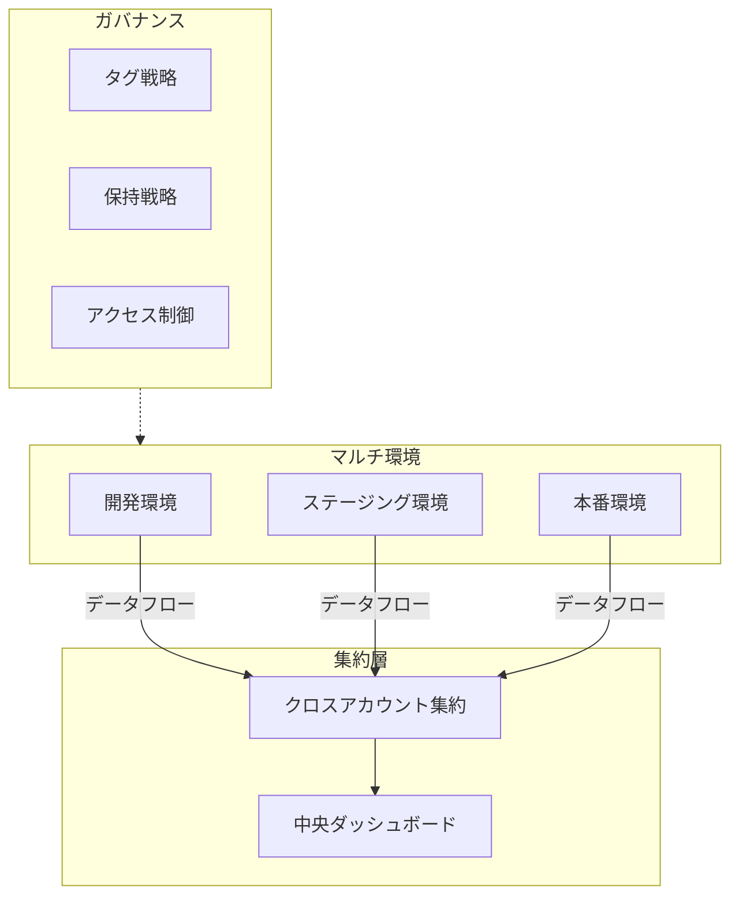

### 11.2 クロス環境メトリクス比較

```python
import boto3
from dataclasses import dataclass
from typing import Dict, List
from datetime import datetime

@dataclass
class EnvironmentMetrics:
    """環境メトリクスデータ"""
    environment: str
    availability: float
    latency_p99: float
    error_rate: float
    cost_per_request: float

class MultiEnvironmentMonitor:
    """
    マルチ環境モニター
    - クロス環境メトリクス比較
    - 異常検出
    - デプロイメント影響分析
    """
    
    def __init__(self):
        self.cloudwatch = boto3.client('cloudwatch')
        self.environments = {
            'dev': {'account': '123456789', 'region': 'us-east-1'},
            'staging': {'account': '987654321', 'region': 'us-east-1'},
            'prod': {'account': '555555555', 'region': 'us-east-1'}
        }
    
    def compare_latency_across_environments(
        self,
        service_name: str,
        start_time: datetime,
        end_time: datetime
    ) -> Dict:
        """クロス環境レイテンシーを比較します"""
        
        comparison = {}
        
        for env, config in self.environments.items():
            # クロスアカウントロールを使用してアクセスすると仮定
            session = boto3.Session(
                profile_name=f"monitoring-{env}"
            )
            cw = session.client('cloudwatch', region_name=config['region'])
            
            response = cw.get_metric_statistics(
                Namespace='Application/API',
                MetricName='Latency',
                Dimensions=[
                    {'Name': 'Service', 'Value': service_name},
                    {'Name': 'Environment', 'Value': env}
                ],
                StartTime=start_time,
                EndTime=end_time,
                Period=3600,
                Statistics=['p99', 'Average']
            )
            
            if response['Datapoints']:
                p99_latencies = [dp['ExtendedStatistics']['p99'] for dp in response['Datapoints']]
                comparison[env] = {
                    'p99_avg': sum(p99_latencies) / len(p99_latencies),
                    'datapoints': len(response['Datapoints'])
                }
        
        # 本番環境とステージング環境の差異を検出
        if 'prod' in comparison and 'staging' in comparison:
            prod_p99 = comparison['prod']['p99_avg']
            staging_p99 = comparison['staging']['p99_avg']
            
            if staging_p99 > 0:
                deviation = ((prod_p99 - staging_p99) / staging_p99) * 100
                comparison['deviation_analysis'] = {
                    'staging_to_prod_p99_diff_percent': deviation,
                    'alert': abs(deviation) > 20  # 20%差異アラーム
                }
        
        return comparison
    
    def analyze_deployment_impact(
        self,
        service_name: str,
        deployment_time: datetime,
        window_minutes: int = 30
    ) -> Dict:
        """
        デプロイメントがメトリクスに与える影響を分析
        """
        
        before_start = deployment_time - timedelta(minutes=window_minutes)
        after_end = deployment_time + timedelta(minutes=window_minutes)
        
        # デプロイメント前のメトリクス
        before_metrics = self._get_metrics_for_window(
            service_name, before_start, deployment_time
        )
        
        # デプロイメント後のメトリクス
        after_metrics = self._get_metrics_for_window(
            service_name, deployment_time, after_end
        )
        
        # 変化を計算
        impact = {
            'error_rate_change': self._calculate_change(
                before_metrics.get('error_rate', 0),
                after_metrics.get('error_rate', 0)
            ),
            'latency_change': self._calculate_change(
                before_metrics.get('latency_p99', 0),
                after_metrics.get('latency_p99', 0)
            ),
            'deployment_time': deployment_time.isoformat()
        }
        
        # 悪影響があるかどうかを判断
        impact['negative_impact'] = (
            impact['error_rate_change'] > 50 or  # エラー率50%増加
            impact['latency_change'] > 20         # レイテンシー20%増加
        )
        
        return impact
    
    def _get_metrics_for_window(
        self,
        service_name: str,
        start: datetime,
        end: datetime
    ) -> Dict:
        """時間枠内のメトリクスを取得します"""
        
        response = self.cloudwatch.get_metric_statistics(
            Namespace='Application/API',
            MetricName='ErrorRate',
            Dimensions=[{'Name': 'Service', 'Value': service_name}],
            StartTime=start,
            EndTime=end,
            Period=60,
            Statistics=['Average']
        )
        
        if response['Datapoints']:
            avg_error_rate = sum(dp['Average'] for dp in response['Datapoints']) / len(response['Datapoints'])
        else:
            avg_error_rate = 0
        
        return {'error_rate': avg_error_rate}
    
    def _calculate_change(self, before: float, after: float) -> float:
        """変化パーセンテージを計算します"""
        if before == 0:
            return float('inf') if after > 0 else 0
        return ((after - before) / before) * 100
    
    def generate_environment_health_report(self) -> Dict:
        """環境ヘルスレポートを生成します"""
        
        report = {
            'generated_at': datetime.utcnow().isoformat(),
            'environments': {}
        }
        
        for env in self.environments.keys():
            report['environments'][env] = {
                'status': self._get_environment_status(env),
                'key_metrics': self._get_key_metrics(env),
                'alerts': self._get_active_alerts(env)
            }
        
        return report
    
    def _get_environment_status(self, env: str) -> str:
        return 'healthy'
    
    def _get_key_metrics(self, env: str) -> Dict:
        return {}
    
    def _get_active_alerts(self, env: str) -> List:
        return []
```

---

## 12. セキュリティモニタリングと脅威検出

### 12.1 GuardDuty 統合

```python
import boto3
import json

class SecurityMonitoring:
    """
    セキュリティモニタリングと脅威検出
    - GuardDuty 検出処理
    - Security Hub 統合
    - 自動対応
    """
    
    def __init__(self):
        self.guardduty = boto3.client('guardduty')
        self.securityhub = boto3.client('securityhub')
        self.sns = boto3.client('sns')
    
    def process_guardduty_finding(self, finding: dict) -> dict:
        """GuardDuty 検出を処理します"""
        
        finding_id = finding['id']
        severity = finding['severity']
        finding_type = finding['type']
        
        response_actions = []
        
        # 重要度に応じて処理
        if severity >= 7.0:  # 高リスク
            response_actions.extend(self._handle_high_severity(finding))
        elif severity >= 4.0:  # 中リスク
            response_actions.extend(self._handle_medium_severity(finding))
        else:  # 低リスク
            response_actions.extend(self._handle_low_severity(finding))
        
        # Security Hub にエクスポート
        self._export_to_security_hub(finding)
        
        return {
            'finding_id': finding_id,
            'actions_taken': response_actions,
            'severity': severity
        }
    
    def _handle_high_severity(self, finding: dict) -> list:
        """高リスク検出を処理します"""
        actions = []
        
        finding_type = finding['type']
        
        if 'UnauthorizedAccess' in finding_type:
            # 疑わしい IP をブロック
            actions.append(self._block_ip(finding['resource']['instanceDetails']['networkInterfaces'][0]['publicIp']))
        
        if 'CryptoCurrency' in finding_type:
            # インスタンスを隔離
            actions.append(self._isolate_instance(finding['resource']['instanceDetails']['instanceId']))
        
        # 即座にセキュリティチームに通知
        self._send_immediate_alert(finding)
        
        return actions
    
    def _handle_medium_severity(self, finding: dict) -> list:
        """中リスク検出を処理します"""
        actions = []
        
        # 記録してレビューをスケジュール
        actions.append('scheduled_for_review')
        
        # Slack 通知を送信
        self._send_slack_notification(finding)
        
        return actions
    
    def _handle_low_severity(self, finding: dict) -> list:
        """低リスク検出を処理します"""
        # 記録のみ、バッチ処理
        return ['logged_for_batch_review']
    
    def _block_ip(self, ip_address: str) -> str:
        """疑わしい IP をブロックします"""
        # NACL またはセキュリティグループを更新
        return f'blocked_ip:{ip_address}'
    
    def _isolate_instance(self, instance_id: str) -> str:
        """インスタンスを隔離します"""
        ec2 = boto3.client('ec2')
        
        # 隔離セキュリティグループを作成
        try:
            response = ec2.create_security_group(
                GroupName=f'isolate-{instance_id}',
                Description='Isolation security group'
            )
            sg_id = response['GroupId']
            
            # このセキュリティグループからすべてのインバウンドルールを削除
            ec2.revoke_security_group_ingress(
                GroupId=sg_id,
                IpPermissions=[]
            )
            
            # インスタンスを隔離セキュリティグループにアタッチ
            ec2.modify_instance_attribute(
                InstanceId=instance_id,
                Groups=[sg_id]
            )
            
            return f'isolated_instance:{instance_id}'
        except Exception as e:
            return f'isolation_failed:{str(e)}'
    
    def _send_immediate_alert(self, finding: dict):
        """緊急アラームを送信します"""
        message = {
            'default': json.dumps({
                'alert_type': 'security_incident',
                'severity': 'CRITICAL',
                'finding': finding
            }),
            'email': f"""
            SECURITY ALERT - CRITICAL
            
            Finding Type: {finding['type']}
            Severity: {finding['severity']}
            Account: {finding['accountId']}
            Region: {finding['region']}
            
            Description: {finding['description']}
            
            Immediate action required!
            """
        }
        
        self.sns.publish(
            TopicArn='arn:aws:sns:us-east-1:123456789:security-critical',
            Message=json.dumps(message),
            MessageStructure='json'
        )
    
    def _send_slack_notification(self, finding: dict):
        """Slack 通知を送信します"""
        pass
    
    def _export_to_security_hub(self, finding: dict):
        """Security Hub にエクスポートします"""
        
        security_finding = {
            'SchemaVersion': '2018-10-08',
            'Id': finding['id'],
            'ProductArn': f"arn:aws:securityhub:{finding['region']}::product/aws/guardduty",
            'GeneratorId': finding['type'],
            'AwsAccountId': finding['accountId'],
            'Types': ['TTPs/UnauthorizedAccess'],
            'CreatedAt': finding['createdAt'],
            'UpdatedAt': finding['updatedAt'],
            'Severity': {
                'Product': finding['severity'],
                'Normalized': int(finding['severity'] * 10)
            },
            'Title': finding['title'],
            'Description': finding['description'],
            'Resources': [{
                'Type': 'AwsEc2Instance',
                'Id': finding['resource']['instanceDetails']['instanceId']
            }],
            'RecordState': 'ACTIVE'
        }
        
        self.securityhub.batch_import_findings(Findings=[security_finding])
```

---

## 13. 本番環境ベストプラクティス

### 13.1 モニタリング as Code (Monitoring as Code)

```yaml
# monitoring-stack.yaml
# CloudFormation/SAM テンプレートでモニタリングリソースを定義

AWSTemplateFormatVersion: '2010-09-09'
Description: 'Monitoring as Code - アプリケーションモニタリングスタック'

Parameters:
  ApplicationName:
    Type: String
    Default: MyApplication
  Environment:
    Type: String
    AllowedValues: [dev, staging, prod]
  AlarmSNSTopic:
    Type: String

Resources:
  # CloudWatch ロググループ
  ApplicationLogGroup:
    Type: AWS::Logs::LogGroup
    Properties:
      LogGroupName: !Sub '/aws/applications/${ApplicationName}'
      RetentionInDays: !If [IsProduction, 90, 7]
      Tags:
        - Key: Application
          Value: !Ref ApplicationName
        - Key: Environment
          Value: !Ref Environment

  # エラー率アラーム
  HighErrorRateAlarm:
    Type: AWS::CloudWatch::Alarm
    Properties:
      AlarmName: !Sub '${ApplicationName}-HighErrorRate'
      AlarmDescription: 'API エラー率が1%を超過'
      MetricName: ErrorRate
      Namespace: !Sub '${ApplicationName}/API'
      Statistic: Average
      Period: 60
      EvaluationPeriods: 2
      Threshold: 1.0
      ComparisonOperator: GreaterThanThreshold
      TreatMissingData: notBreaching
      AlarmActions:
        - !Ref AlarmSNSTopic
      OKActions:
        - !Ref AlarmSNSTopic
      Tags:
        - Key: Severity
          Value: P1

  # レイテンシーアラーム
  HighLatencyAlarm:
    Type: AWS::CloudWatch::Alarm
    Properties:
      AlarmName: !Sub '${ApplicationName}-HighLatency'
      AlarmDescription: 'P99 レイテンシーが1秒を超過'
      ExtendedStatistic: p99
      MetricName: Latency
      Namespace: !Sub '${ApplicationName}/API'
      Period: 60
      EvaluationPeriods: 3
      Threshold: 1000
      ComparisonOperator: GreaterThanThreshold
      AlarmActions:
        - !Ref AlarmSNSTopic

  # カスタムメトリクスダッシュボード
  ApplicationDashboard:
    Type: AWS::CloudWatch::Dashboard
    Properties:
      DashboardName: !Sub '${ApplicationName}-${Environment}'
      DashboardBody: !Sub |
        {
          "widgets": [
            {
              "type": "metric",
              "properties": {
                "title": "Request Count",
                "metrics": [
                  ["${ApplicationName}/API", "RequestCount", "Environment", "${Environment}"]
                ],
                "period": 60,
                "stat": "Sum"
              }
            },
            {
              "type": "metric",
              "properties": {
                "title": "Error Rate",
                "metrics": [
                  ["${ApplicationName}/API", "ErrorRate", "Environment", "${Environment}", { "color": "#d62728" }]
                ],
                "annotations": {
                  "horizontal": [
                    { "value": 1, "label": "Threshold", "color": "#ff0000" }
                  ]
                }
              }
            },
            {
              "type": "log",
              "properties": {
                "title": "Error Logs",
                "query": "SOURCE '${ApplicationLogGroup}' | fields @timestamp, @message | filter @message like /ERROR/ | sort @timestamp desc | limit 20",
                "region": "${AWS::Region}"
              }
            }
          ]
        }

Conditions:
  IsProduction: !Equals [!Ref Environment, 'prod']

Outputs:
  LogGroupName:
    Description: Application Log Group
    Value: !Ref ApplicationLogGroup
  DashboardURL:
    Description: CloudWatch Dashboard URL
    Value: !Sub 'https://${AWS::Region}.console.aws.amazon.com/cloudwatch/home?region=${AWS::Region}#dashboards:name=${ApplicationName}-${Environment}'
```

### 13.2 モニタリングヘルスチェック

```python
class MonitoringHealthCheck:
    """
    モニタリングシステムのヘルスチェック
    - アラーム設定を検証
    - ログ取り込みをチェック
    - ダッシュボードを検証
    """
    
    def __init__(self):
        self.cloudwatch = boto3.client('cloudwatch')
        self.logs = boto3.client('logs')
        self.sns = boto3.client('sns')
    
    def validate_alarm_configuration(self, alarm_name: str) -> dict:
        """アラーム設定を検証します"""
        
        try:
            response = self.cloudwatch.describe_alarms(
                AlarmNames=[alarm_name]
            )
            
            if not response['MetricAlarms']:
                return {'status': 'ERROR', 'message': 'Alarm not found'}
            
            alarm = response['MetricAlarms'][0]
            issues = []
            
            # アクション設定があるかチェック
            if not alarm.get('AlarmActions'):
                issues.append('No alarm actions configured')
            
            # 評価期間をチェック
            if alarm['EvaluationPeriods'] < 2:
                issues.append('Evaluation periods too low (risk of flapping)')
            
            # 欠損データの処理をチェック
            if alarm.get('TreatMissingData') == 'breaching':
                issues.append('Missing data treated as breaching (may cause false alarms)')
            
            return {
                'status': 'WARNING' if issues else 'OK',
                'alarm_name': alarm_name,
                'issues': issues,
                'configuration': {
                    'threshold': alarm['Threshold'],
                    'evaluation_periods': alarm['EvaluationPeriods'],
                    'period': alarm['Period']
                }
            }
            
        except Exception as e:
            return {'status': 'ERROR', 'message': str(e)}
    
    def check_log_group_health(self, log_group: str) -> dict:
        """ロググループのヘルス状態をチェックします"""
        
        try:
            # 最近のログ取り込みをチェック
            response = self.logs.describe_log_streams(
                logGroupName=log_group,
                orderBy='LastEventTime',
                descending=True,
                limit=1
            )
            
            if not response['logStreams']:
                return {
                    'status': 'WARNING',
                    'log_group': log_group,
                    'message': 'No log streams found'
                }
            
            last_event = response['logStreams'][0].get('lastEventTimestamp', 0)
            last_event_time = datetime.fromtimestamp(last_event / 1000)
            time_since_last_event = datetime.utcnow() - last_event_time
            
            if time_since_last_event > timedelta(hours=1):
                return {
                    'status': 'WARNING',
                    'log_group': log_group,
                    'message': f'No logs in last {time_since_last_event.total_seconds() / 60:.0f} minutes',
                    'last_event': last_event_time.isoformat()
                }
            
            return {
                'status': 'OK',
                'log_group': log_group,
                'last_event': last_event_time.isoformat(),
                'time_since_last_event_minutes': time_since_last_event.total_seconds() / 60
            }
            
        except Exception as e:
            return {'status': 'ERROR', 'message': str(e)}
    
    def run_full_health_check(self) -> dict:
        """完全なヘルスチェックを実行します"""
        
        checks = {
            'alarms': [],
            'log_groups': [],
            'dashboards': []
        }
        
        # すべてのアラームをチェック
        paginator = self.cloudwatch.get_paginator('describe_alarms')
        for page in paginator.paginate(StateValue='ENABLED'):
            for alarm in page['MetricAlarms']:
                result = self.validate_alarm_configuration(alarm['AlarmName'])
                checks['alarms'].append(result)
        
        return {
            'timestamp': datetime.utcnow().isoformat(),
            'summary': {
                'total_alarms': len(checks['alarms']),
                'ok': sum(1 for a in checks['alarms'] if a['status'] == 'OK'),
                'warnings': sum(1 for a in checks['alarms'] if a['status'] == 'WARNING'),
                'errors': sum(1 for a in checks['alarms'] if a['status'] == 'ERROR')
            },
            'details': checks
        }

---

*バージョン: v1.0*  
*更新日: 2026-03-02*
