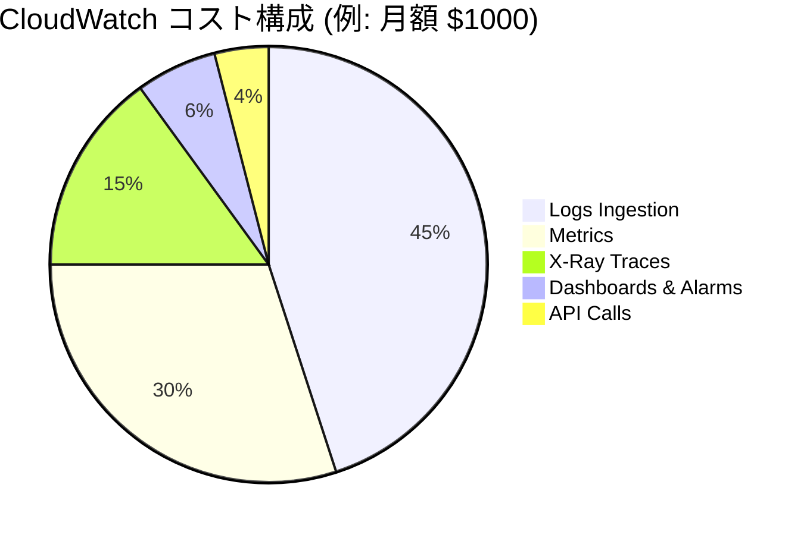

# CloudWatch コスト最適化詳細ガイド

> モニタリングコストを 50% 以上削減する実践戦略

---

## コスト構成分析

### CloudWatch 課金モデル



### 主要コスト要因

| コンポーネント | 課金方式 | 単価 | 最適化ポテンシャル |
|------|----------|------|----------|
| ログ取り込み | GB 単位 | $0.50/GB | 高 |
| ログストレージ | GB/月 単位 | $0.03/GB | 中 |
| カスタムメトリクス | メトリクス/月 単位 | $0.30/メトリクス | 高 |
| API 呼び出し | 千回単位 | $0.01/千回 | 中 |
| X-Ray トレース | 百万回単位 | $5/百万 | 高 |
| Insights スキャン | GB 単位 | $0.005/GB | 中 |

---

## ログコスト最適化

### 1. ログフィルタリング戦略

```python
# Lambda ログプロセッサ - 取り込み前フィルタリング
import json
import gzip
import boto3

class LogFilter:
    """ログフィルター - 無駄なログ取り込み削減"""
    
    # ログレベルフィルター定義
    LEVEL_PRIORITY = {
        'DEBUG': 0,
        'INFO': 1,
        'WARNING': 2,
        'ERROR': 3,
        'CRITICAL': 4
    }
    
    def __init__(self, min_level='INFO'):
        self.min_level = min_level
        self.filtered_count = 0
        self.total_count = 0
    
    def should_keep(self, log_record):
        """ログを保持すべきか判定"""
        self.total_count += 1
        
        # レベルフィルタリング
        level = log_record.get('level', 'INFO')
        if self.LEVEL_PRIORITY.get(level, 0) < self.LEVEL_PRIORITY[self.min_level]:
            self.filtered_count += 1
            return False
        
        # ヘルスチェックログフィルタリング
        if log_record.get('message', '').startswith('Health check'):
            # ヘルスチェックログをサンプリング（1% のみ保持）
            import random
            if random.random() > 0.01:
                self.filtered_count += 1
                return False
        
        # 重複エラー集約
        if self._is_duplicate_error(log_record):
            return False
        
        return True
    
    def _is_duplicate_error(self, log_record, window_seconds=60):
        """重複エラー検出（Redis/DynamoDB 実装が必要）"""
        # 簡易例
        return False
    
    def get_stats(self):
        """フィルタリング統計取得"""
        if self.total_count == 0:
            return {'filter_rate': 0}
        
        return {
            'total': self.total_count,
            'filtered': self.filtered_count,
            'kept': self.total_count - self.filtered_count,
            'filter_rate': self.filtered_count / self.total_count * 100
        }

# Kinesis Firehose 変換 Lambda
def transform_log_event(event):
    """Firehose ログ変換 - リアルタイムフィルタリング"""
    
    filter_processor = LogFilter(min_level='INFO')
    
    output_records = []
    for record in event['records']:
        payload = json.loads(base64.b64decode(record['data']))
        
        if filter_processor.should_keep(payload):
            output_records.append({
                'recordId': record['recordId'],
                'result': 'Ok',
                'data': record['data']
            })
        else:
            # レコード破棄
            output_records.append({
                'recordId': record['recordId'],
                'result': 'Dropped',
                'data': ''
            })
    
    return {'records': output_records}
```

### 2. ログ圧縮とフォーマット

```python
# 構造化ログ - 冗長情報削減
import json

class OptimizedLogger:
    """ボリューム削減のためのログフォーマット最適化"""
    
    # フィールド名略語マッピング
    FIELD_ABBREVIATIONS = {
        'timestamp': 'ts',
        'level': 'lvl',
        'message': 'msg',
        'request_id': 'rid',
        'user_id': 'uid',
        'duration_ms': 'dur',
        'status_code': 'code'
    }
    
    def __init__(self, use_abbreviations=True):
        self.use_abbreviations = use_abbreviations
    
    def log(self, level, message, **kwargs):
        """圧縮フォーマットでログ出力"""
        
        record = {
            'ts': datetime.utcnow().isoformat(),
            'lvl': level,
            'msg': message
        }
        
        # 非空値のみ記録
        for key, value in kwargs.items():
            if value is not None and value != '':
                short_key = self.FIELD_ABBREVIATIONS.get(key, key)
                record[short_key] = value
        
        # コンパクト JSON フォーマット使用
        return json.dumps(record, separators=(',', ':'))

# 比較：従来ログ vs 最適化ログ
# 従来: 450 bytes
{
    "timestamp": "2026-03-02T10:30:00Z",
    "level": "INFO",
    "message": "Request processed",
    "request_id": "req-123",
    "user_id": "user-456",
    "duration_ms": 150,
    "status_code": 200
}

# 最適化: 180 bytes (60% 削減)
{"ts":"2026-03-02T10:30:00Z","lvl":"INFO","msg":"Request processed","rid":"req-123","uid":"user-456","dur":150,"code":200}
```

### 3. ログライフサイクル管理

```yaml
# CloudFormation: ログライフサイクルポリシー
Resources:
  ApplicationLogGroup:
    Type: AWS::Logs::LogGroup
    Properties:
      LogGroupName: /myapp/production
      RetentionInDays: 14  # 短期保持
      
  LogArchiveBucket:
    Type: AWS::S3::Bucket
    Properties:
      BucketName: myapp-log-archive
      LifecycleConfiguration:
        Rules:
          - Id: ArchiveToGlacier
            Status: Enabled
            Transitions:
              - StorageClass: GLACIER
                TransitionInDays: 30
            ExpirationInDays: 365

  # ログエクスポートタスク（毎日実行）
  LogExportFunction:
    Type: AWS::Lambda::Function
    Properties:
      Code:
        ZipFile: |
          import boto3
          import os
          from datetime import datetime, timedelta
          
          def handler(event, context):
              logs = boto3.client('logs')
              
              # 昨日を S3 にエクスポート
              yesterday = datetime.utcnow() - timedelta(days=1)
              start_time = int(yesterday.replace(hour=0, minute=0, second=0).timestamp() * 1000)
              end_time = int(yesterday.replace(hour=23, minute=59, second=59).timestamp() * 1000)
              
              logs.create_export_task(
                  logGroupName='/myapp/production',
                  fromTime=start_time,
                  to=end_time,
                  destination='myapp-log-archive',
                  destinationPrefix=f'logs/{yesterday.strftime("%Y/%m/%d")}/'
              )
      Handler: index.handler
      Runtime: python3.11
      Timeout: 60
      Events:
        DailyTrigger:
          Type: Schedule
          Properties:
            Schedule: rate(1 day)
```

---

## メトリクスコスト最適化

### 1. ディメンション最適化戦略

```python
# 高カーディナリティディメンション問題例
class BadMetricsExample:
    """避けるべき：高カーディナリティディメンションによるコスト爆発"""
    
    def record_api_latency(self, user_id, request_id, endpoint):
        # 問題：各 user_id と request_id は一意のディメンション値
        # 結果：数百万の一意メトリクス組み合わせが生成される
        cloudwatch.put_metric_data(
            Namespace='BadMetrics',
            MetricData=[{
                'MetricName': 'APILatency',
                'Dimensions': [
                    {'Name': 'UserId', 'Value': user_id},        # 高カーディナリティ！
                    {'Name': 'RequestId', 'Value': request_id},  # 高カーディナリティ！
                    {'Name': 'Endpoint', 'Value': endpoint}
                ],
                'Value': latency,
                'Unit': 'Milliseconds'
            }]
        )

class GoodMetricsExample:
    """正しい：低カーディナリティ、高情報価値"""
    
    def record_api_latency(self, user_tier, endpoint, status_code):
        # 正しい：ディメンション値が有限で意味がある
        cloudwatch.put_metric_data(
            Namespace='GoodMetrics',
            MetricData=[{
                'MetricName': 'APILatency',
                'Dimensions': [
                    {'Name': 'UserTier', 'Value': user_tier},      # 低カーディナリティ: free/premium/enterprise
                    {'Name': 'Endpoint', 'Value': endpoint},        # 中カーディナリティ: APIパス
                    {'Name': 'StatusCode', 'Value': status_code}    # 低カーディナリティ: HTTPステータスコード
                ],
                'Value': latency,
                'Unit': 'Milliseconds'
            }]
        )
```

### 2. EMF コスト効率

```python
# EMF を使用して PutMetricData API 呼び出しを代替
import json

class EMFCostCalculator:
    """EMF コスト計算機"""
    
    @staticmethod
    def calculate_savings(records_per_month):
        """EMF 使用による削減額を計算"""
        
        # 従来の PutMetricData
        # $0.01 per 1000 リクエスト
        traditional_cost = (records_per_month / 1000) * 0.01
        
        # EMF via CloudWatch Logs
        # EMF ログ 1 件あたり 200 bytes と仮定
        emf_gb = (records_per_month * 200) / (1024**3)
        emf_cost = emf_gb * 0.50  # Logs ingestion
        
        savings = traditional_cost - emf_cost
        savings_percent = (savings / traditional_cost * 100) if traditional_cost > 0 else 0
        
        return {
            'traditional_cost': traditional_cost,
            'emf_cost': emf_cost,
            'savings': savings,
            'savings_percent': savings_percent
        }

# 例: 月 1000 万レコード
calc = EMFCostCalculator()
result = calc.calculate_savings(10_000_000)
# 結果: 95% 以上コスト削減
```

### 3. 事前集約戦略

```python
# アプリケーション内事前集約 - CloudWatch API 呼び出し削減
import time
from collections import defaultdict
import threading

class MetricAggregator:
    """メトリクス事前集約器"""
    
    def __init__(self, flush_interval_seconds=60):
        self.buffers = defaultdict(list)
        self.lock = threading.Lock()
        self.flush_interval = flush_interval_seconds
        
        # バックグラウンドフラッシュスレッド起動
        self._start_flusher()
    
    def record(self, metric_name, value, dimensions):
        """メトリクス値記録"""
        key = (metric_name, tuple(sorted(dimensions.items())))
        
        with self.lock:
            self.buffers[key].append({
                'value': value,
                'timestamp': time.time()
            })
    
    def _flush(self):
        """集約済みメトリクスを CloudWatch にフラッシュ"""
        
        with self.lock:
            buffers_to_flush = self.buffers
            self.buffers = defaultdict(list)
        
        metric_data = []
        
        for (metric_name, dims_tuple), values in buffers_to_flush.items():
            if not values:
                continue
            
            dims_list = [{'Name': k, 'Value': v} for k, v in dims_tuple]
            
            # 統計値計算
            vals = [v['value'] for v in values]
            
            # 生値ではなく統計値のみ送信
            metric_data.extend([
                {
                    'MetricName': f'{metric_name}-avg',
                    'Dimensions': dims_list,
                    'Value': sum(vals) / len(vals),
                    'Unit': 'None'
                },
                {
                    'MetricName': f'{metric_name}-max',
                    'Dimensions': dims_list,
                    'Value': max(vals),
                    'Unit': 'None'
                },
                {
                    'MetricName': f'{metric_name}-count',
                    'Dimensions': dims_list,
                    'Value': len(vals),
                    'Unit': 'Count'
                }
            ])
        
        # バッチ送信
        if metric_data:
            cloudwatch.put_metric_data(
                Namespace='MyApp/Aggregated',
                MetricData=metric_data
            )
    
    def _start_flusher(self):
        """定期フラッシュ開始"""
        def flusher():
            while True:
                time.sleep(self.flush_interval)
                self._flush()
        
        thread = threading.Thread(target=flusher, daemon=True)
        thread.start()
```

---

## X-Ray コスト最適化

### 1. インテリジェントサンプリング戦略

```python
# X-Ray サンプリングルール設定
{
  "version": 2,
  "default": {
    "fixed_target": 1,
    "rate": 0.1
  },
  "rules": [
    {
      "description": "クリティカル API - 高サンプリング率",
      "service_name": "*",
      "http_method": "POST",
      "url_path": "/api/v1/payments/*",
      "fixed_target": 10,
      "rate": 1.0
    },
    {
      "description": "ヘルスチェック - 低サンプリング率",
      "service_name": "*",
      "http_method": "GET",
      "url_path": "/health",
      "fixed_target": 0,
      "rate": 0.01
    },
    {
      "description": "静的リソース - サンプリングなし",
      "service_name": "*",
      "url_path": "/static/*",
      "fixed_target": 0,
      "rate": 0
    }
  ]
}
```

### 2. サンプリング判定ロジック

```python
from aws_xray_sdk.core import xray_recorder

class SmartSampler:
    """インテリジェントサンプリング判定器"""
    
    def __init__(self):
        self.error_sampling_rate = 1.0  # エラーは 100% サンプリング
        self.slow_request_threshold_ms = 1000
        self.slow_request_sampling_rate = 0.5
    
    def should_sample(self, request_path, is_error=False, latency_ms=None):
        """サンプリング要否判定"""
        
        # エラーリクエストは常にサンプリング
        if is_error:
            return True
        
        # 遅いリクエストはサンプリング率を上げる
        if latency_ms and latency_ms > self.slow_request_threshold_ms:
            import random
            return random.random() < self.slow_request_sampling_rate
        
        # その他リクエストはデフォルトサンプリング率
        return None  # X-Ray SDK に委任
    
    def before_request(self, request):
        """リクエスト前処理"""
        # サンプリング判定設定
        xray_recorder.configure(
            sampling=True,
            sampling_rules=self._get_rules_for_path(request.path)
        )
    
    def after_request(self, request, response, latency_ms):
        """リクエスト後処理 - 結果ベースのサンプリング判定"""
        
        is_error = response.status_code >= 500
        
        # サンプリングすべきだがされていない場合、手動で強制サンプリング
        if self.should_sample(request.path, is_error, latency_ms):
            segment = xray_recorder.current_segment()
            if segment:
                segment.sampled = True

# コスト影響計算
class XRayCostEstimator:
    """X-Ray コスト見積もり"""
    
    def estimate_monthly_cost(
        self,
        requests_per_month,
        current_sampling_rate,
        target_sampling_rate
    ):
        current_traces = requests_per_month * current_sampling_rate
        target_traces = requests_per_month * target_sampling_rate
        
        # 最初の 100,000 トレースは無料
        current_billable = max(0, current_traces - 100000)
        target_billable = max(0, target_traces - 100000)
        
        # $5 per million traces
        current_cost = (current_billable / 1_000_000) * 5
        target_cost = (target_billable / 1_000_000) * 5
        
        return {
            'current_cost': current_cost,
            'target_cost': target_cost,
            'savings': current_cost - target_cost,
            'savings_percent': ((current_cost - target_cost) / current_cost * 100) 
                               if current_cost > 0 else 0
        }

# 例：月 1 億リクエスト、サンプリング率を 10% から 5% に削減  
estimator = XRayCostEstimator()
result = estimator.estimate_monthly_cost(
    requests_per_month=100_000_000,
    current_sampling_rate=0.10,
    target_sampling_rate=0.05
)
# 結果: 月 $25 削減
```

---

## 統合コスト最適化フレームワーク

```python
# コスト最適化チェックリスト
class CostOptimizationChecklist:
    """コスト最適化チェックリスト"""
    
    CHECKS = {
        'logs': [
            {'name': 'ログフィルタリング有効化', 'potential_savings': '20-40%'},
            {'name': '保持期間短縮', 'potential_savings': '10-30%'},
            {'name': '圧縮有効化', 'potential_savings': '30-50%'},
            {'name': 'S3 アーカイブ使用', 'potential_savings': '60-80%'},
            {'name': 'ログフォーマット最適化', 'potential_savings': '10-20%'}
        ],
        'metrics': [
            {'name': 'EMF フォーマット使用', 'potential_savings': '80-95%'},
            {'name': '高カーディナリティディメンション削減', 'potential_savings': '50-90%'},
            {'name': 'アプリケーション内事前集約', 'potential_savings': '70-90%'},
            {'name': '未使用メトリクス削除', 'potential_savings': '10-30%'},
            {'name': '詳細モニタリングの選択的有効化', 'potential_savings': '20-40%'}
        ],
        'xray': [
            {'name': 'サンプリングルール設定', 'potential_savings': '40-80%'},
            {'name': 'ヘルスチェック除外', 'potential_savings': '10-20%'},
            {'name': 'エラーベースインテリジェントサンプリング', 'potential_savings': '20-40%'}
        ],
        'dashboards': [
            {'name': '未使用ダッシュボード削除', 'potential_savings': '5-15%'},
            {'name': '更新頻度削減', 'potential_savings': '5-10%'},
            {'name': 'Logs Insights 代替使用', 'potential_savings': '30-50%'}
        ]
    }
    
    @classmethod
    def generate_report(cls, current_monthly_cost):
        """最適化レポート生成"""
        
        total_potential_savings = 0
        recommendations = []
        
        for category, checks in cls.CHECKS.items():
            for check in checks:
                # 削減パーセント範囲を解析
                savings_range = check['potential_savings'].strip('%').split('-')
                avg_savings = (int(savings_range[0]) + int(savings_range[1])) / 200
                
                potential_amount = current_monthly_cost * avg_savings
                total_potential_savings += potential_amount * 0.2  # 保守見積 20% 実現可能
                
                recommendations.append({
                    'category': category,
                    'action': check['name'],
                    'potential_savings': check['potential_savings'],
                    'estimated_monthly_saving': potential_amount * 0.2
                })
        
        return {
            'current_monthly_cost': current_monthly_cost,
            'total_potential_savings': total_potential_savings,
            'savings_percentage': (total_potential_savings / current_monthly_cost * 100),
            'recommendations': sorted(recommendations, 
                                    key=lambda x: x['estimated_monthly_saving'], 
                                    reverse=True)
        }

# 使用例
checklist = CostOptimizationChecklist()
report = checklist.generate_report(current_monthly_cost=1000)
print(f"潜在的月次削減額: ${report['total_potential_savings']:.2f} ({report['savings_percentage']:.1f}%)")
```

---

## モニタリング最適化ロードマップ

| フェーズ | 期間 | 重点 | 期待削減 |
|------|------|------|----------|
| クイックウィン | 第1週 | ログフィルタリング、EMF 移行 | 30-50% |
| 短期最適化 | 第2-4週 | サンプリング最適化、保持期間調整 | 20-30% |
| 中期再構築 | 第1-3月 | アーキテクチャ調整、事前集約 | 20-40% |
| 長期最適化 | 第3-6月 | インテリジェントサンプリング、自動化 | 10-20% |

---

*継続的な最適化、継続的な削減*
