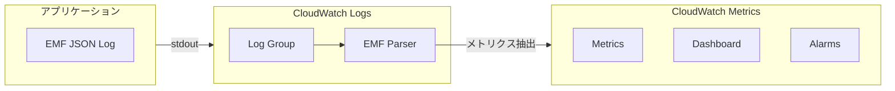

# CloudWatch Embedded Metric Format (EMF) 開発ガイド

> 開発者向けの高性能かつ低コストな CloudWatch メトリクス収集ソリューション

---

## 目次

1. [EMF 概要](#1-emf-概要)
2. [EMF フォーマット仕様](#2-emf-フォーマット仕様)
3. [各言語実装](#3-各言語実装)
4. [Lambda との統合](#4-lambda-との統合)
5. [コンテナとの統合](#5-コンテナとの統合)
6. [高度な使用パターン](#6-高度な使用パターン)
7. [コスト最適化戦略](#7-コスト最適化戦略)

---

## 1. EMF 概要

### 1.1 EMF とは

Embedded Metric Format (EMF) は JSON 仕様であり、CloudWatch メトリクスを構造化ログイベント内にログ形式で埋め込むことを可能にします。CloudWatch Logs はこれらのメトリクスを自動的に抽出するため、PutMetric API を使用する必要がありません。

```
従来方式: アプリケーション → CloudWatch API (PutMetric) → CloudWatch Metrics
EMF 方式:  アプリケーション → CloudWatch Logs → 自動抽出 → CloudWatch Metrics

メリット:
- 高スループット: API 呼び出し制限なし
- 低コスト: ログ容量で課金され、通常は API 呼び出しより安価
- 低遅延: 非同期処理でアプリケーションをブロックしない
- 豊富なコンテキスト: メトリクスとログが関連付けられる
```

### 1.2 EMF と従来方式の比較

| 特性 | PutMetric API | EMF |
|------|--------------|-----|
| 遅延 | 同期 | 非同期 |
| コスト | $0.01/1000メトリクス | ログストレージ料金 |
| 制限 | 150 TPS/リージョン | 制限なし |
| ディメンション | 10個 | 9個 |
| コンテキスト | なし | 完全なログ |
| 実装複雑度 | SDK が必要 | JSON のみで可 |

### 1.3 アーキテクチャ図



---

## 2. EMF フォーマット仕様

### 2.1 基本フォーマット

```json
{
  "_aws": {
    "Timestamp": 1574109732004,
    "CloudWatchMetrics": [
      {
        "Namespace": "MyApplication",
        "Dimensions": [["ServiceName", "Operation"]],
        "Metrics": [
          {
            "Name": "ProcessingLatency",
            "Unit": "Milliseconds"
          },
          {
            "Name": "RequestCount",
            "Unit": "Count"
          }
        ]
      }
    ]
  },
  "ServiceName": "UserService",
  "Operation": "CreateUser",
  "ProcessingLatency": 100,
  "RequestCount": 1,
  "requestId": "abc-123",
  "userId": "user-456"
}
```

### 2.2 フィールド説明

| フィールド | 必須 | 説明 |
|------|------|------|
| `_aws` | はい | EMF メタデータルートノード |
| `_aws.Timestamp` | はい | Unix タイムスタンプ（ミリ秒） |
| `_aws.CloudWatchMetrics` | はい | メトリクス定義配列 |
| `Namespace` | はい | メトリクスネームスペース |
| `Dimensions` | いいえ | ディメンション組み合わせ配列 |
| `Metrics` | はい | メトリクス定義配列 |
| `Name` | はい | メトリクス名 |
| `Unit` | いいえ | 単位（デフォルト：None） |
| `StorageResolution` | いいえ | 60 または 1（高解像度） |

### 2.3 マルチディメンション例

```json
{
  "_aws": {
    "Timestamp": 1574109732004,
    "CloudWatchMetrics": [
      {
        "Namespace": "ECommerce",
        "Dimensions": [
          ["Service", "Environment"],
          ["Service"],
          ["Environment"]
        ],
        "Metrics": [
          {"Name": "OrdersProcessed", "Unit": "Count"},
          {"Name": "OrderValue", "Unit": "Count", "StorageResolution": 1}
        ]
      }
    ]
  },
  "Service": "OrderService",
  "Environment": "Production",
  "OrdersProcessed": 10,
  "OrderValue": 1500.50
}
```

---

## 3. 各言語実装

### 3.1 Python (AWS Lambda Powertools)

```python
# インストール: pip install aws-lambda-powertools
from aws_lambda_powertools import Logger, Metrics
from aws_lambda_powertools.metrics import MetricUnit
from aws_lambda_powertools.logging import correlation_paths

# 初期化
metrics = Metrics(namespace="MyApplication")
logger = Logger()

@logger.inject_lambda_context
@metrics.log_metrics(capture_cold_start_metric=True)
def lambda_handler(event, context):
    # ディメンション追加
    metrics.add_dimension(name="ServiceName", value="UserService")
    metrics.add_dimension(name="Environment", value="Production")
    
    # メトリクス記録
    metrics.add_metric(name="SuccessfulRequests", unit=MetricUnit.Count, value=1)
    metrics.add_metric(name="ProcessingLatency", unit=MetricUnit.Milliseconds, value=100)
    
    # ログ記録（自動関連付け）
    logger.info("Processing request", extra={"request_id": "abc-123"})
    
    return {"statusCode": 200}

# カスタム EMF 出力
from aws_lambda_powertools.metrics import Metrics, MetricUnit

metrics = Metrics()

@metrics.log_metrics
def handler(event, context):
    # 高解像度メトリクス
    metrics.add_metric(
        name="APICallLatency",
        unit=MetricUnit.Milliseconds,
        value=45,
        resolution=1  # 高解像度（1秒）
    )
    
    # マルチディメンション
    metrics.add_dimension(name="Region", value="ap-northeast-1")
    metrics.add_dimension(name="AZ", value="ap-northeast-1a")
    
    return {"status": "ok"}
```

### 3.2 Node.js

```javascript
// aws-embedded-metrics ライブラリを使用
// npm install aws-embedded-metrics

const { metricScope, Unit } = require('aws-embedded-metrics');

exports.handler = metricScope(metrics => async (event, context) => {
    // ディメンション設定
    metrics.setNamespace('MyApplication');
    metrics.setProperty('RequestId', context.awsRequestId);
    metrics.setProperty('Version', '1.0.0');
    
    // デフォルトディメンション設定
    metrics.putDimensions({ ServiceName: 'OrderService' });
    
    // メトリクス記録
    metrics.putMetric('ProcessingTime', 100, Unit.Milliseconds);
    metrics.putMetric('SuccessCount', 1, Unit.Count);
    
    // カスタム属性
    metrics.setProperty('UserId', event.userId);
    
    return { statusCode: 200 };
});

// ネイティブ実装（依存関係なし）
const EMF_OUTPUT = process.env.AWS_EXECUTION_ENV && process.env.AWS_EXECUTION_ENV.includes('AWS_Lambda');

function logEMF(metrics) {
    const emf = {
        _aws: {
            Timestamp: Date.now(),
            CloudWatchMetrics: [{
                Namespace: metrics.namespace,
                Dimensions: [Object.keys(metrics.dimensions)],
                Metrics: Object.keys(metrics.values).map(name => ({
                    Name: name,
                    Unit: metrics.units[name] || 'None'
                }))
            }]
        },
        ...metrics.dimensions,
        ...metrics.values
    };
    
    console.log(JSON.stringify(emf));
}
```

### 3.3 Java

```java
// aws-embedded-metrics-java を使用
// <dependency>
//     <groupId>software.amazon.cloudwatchlogs</groupId>
//     <artifactId>aws-embedded-metrics</artifactId>
//     <version>1.0.0</version>
// </dependency>

import software.amazon.cloudwatchlogs.emf.logger.MetricsLogger;
import software.amazon.cloudwatchlogs.emf.model.Unit;
import software.amazon.cloudwatchlogs.emf.model.DimensionSet;

public class Handler implements RequestHandler<Map<String, Object>, String> {
    
    @Override
    public String handleRequest(Map<String, Object> event, Context context) {
        MetricsLogger metrics = new MetricsLogger();
        
        // ネームスペース設定
        metrics.setNamespace("MyApplication");
        
        // ディメンション設定
        metrics.putDimensions(DimensionSet.of(
            "ServiceName", "OrderService",
            "Environment", "Production"
        ));
        
        // メトリクス記録
        metrics.putMetric("ProcessingLatency", 100, Unit.MILLISECONDS);
        metrics.putMetric("RequestCount", 1, Unit.COUNT);
        
        // カスタム属性
        metrics.putProperty("RequestId", context.getAwsRequestId());
        
        // フラッシュ（Lambda ではオプション）
        metrics.flush();
        
        return "Success";
    }
}
```

### 3.4 Go

```go
package main

import (
    "context"
    "encoding/json"
    "fmt"
    "time"

    "github.com/aws/aws-lambda-go/lambda"
)

// EMF 構造体
type EMF struct {
    AWS      AWSMetadata     `json:"_aws"`
    Metadata map[string]interface{}
}

type AWSMetadata struct {
    Timestamp         int64              `json:"Timestamp"`
    CloudWatchMetrics []CloudWatchMetric `json:"CloudWatchMetrics"`
}

type CloudWatchMetric struct {
    Namespace  string      `json:"Namespace"`
    Dimensions [][]string  `json:"Dimensions"`
    Metrics    []MetricDef `json:"Metrics"`
}

type MetricDef struct {
    Name       string `json:"Name"`
    Unit       string `json:"Unit"`
    Resolution int    `json:"StorageResolution,omitempty"`
}

func logEMF(namespace string, dimensions map[string]string, metrics map[string]interface{}) {
    dimensionKeys := make([]string, 0, len(dimensions))
    for k := range dimensions {
        dimensionKeys = append(dimensionKeys, k)
    }
    
    metricDefs := make([]MetricDef, 0, len(metrics))
    for name := range metrics {
        metricDefs = append(metricDefs, MetricDef{
            Name: name,
            Unit: "Count",
        })
    }
    
    emf := EMF{
        AWS: AWSMetadata{
            Timestamp: time.Now().UnixMilli(),
            CloudWatchMetrics: []CloudWatchMetric{{
                Namespace:  namespace,
                Dimensions: [][]string{dimensionKeys},
                Metrics:    metricDefs,
            }},
        },
        Metadata: make(map[string]interface{}),
    }
    
    // ディメンションとメトリクスをマージ
    for k, v := range dimensions {
        emf.Metadata[k] = v
    }
    for k, v := range metrics {
        emf.Metadata[k] = v
    }
    
    jsonData, _ := json.Marshal(emf)
    fmt.Println(string(jsonData))
}

func handler(ctx context.Context, event map[string]interface{}) (string, error) {
    logEMF(
        "MyApplication",
        map[string]string{
            "ServiceName": "OrderService",
            "Environment": "Production",
        },
        map[string]interface{}{
            "RequestCount": 1,
            "ProcessingLatency": 100,
        },
    )
    
    return "Success", nil
}

func main() {
    lambda.Start(handler)
}
```

---

## 4. Lambda との統合

### 4.1 Lambda Powertools ベストプラクティス

```python
from aws_lambda_powertools import Logger, Metrics, Tracer
from aws_lambda_powertools.metrics import MetricUnit
from aws_lambda_powertools.logging import correlation_paths
from aws_lambda_powertools.utilities.typing import LambdaContext

# ツール初期化
tracer = Tracer()
logger = Logger()
metrics = Metrics()

@tracer.capture_lambda_handler
@logger.inject_lambda_context(log_event=True)
@metrics.log_metrics(
    capture_cold_start_metric=True,
    default_dimensions={"Service": "UserService"}
)
def handler(event: dict, context: LambdaContext):
    """
    完全な Lambda ハンドラーの例
    """
    try:
        # リクエスト固有のディメンション追加
        metrics.add_dimension(name="Operation", value=event.get('operation', 'unknown'))
        
        # ビジネスロジック
        with tracer.provider.in_subsegment('## business_logic'):
            result = process_request(event)
        
        # 成功メトリクス
        metrics.add_metric(name="SuccessCount", unit=MetricUnit.Count, value=1)
        metrics.add_metric(name="ProcessingTime", unit=MetricUnit.Milliseconds, 
                          value=result['duration_ms'])
        
        return {
            'statusCode': 200,
            'body': json.dumps(result)
        }
        
    except Exception as e:
        # エラーメトリクス
        metrics.add_metric(name="ErrorCount", unit=MetricUnit.Count, value=1)
        logger.exception("Request failed")
        
        return {
            'statusCode': 500,
            'body': json.dumps({'error': str(e)})
        }

def process_request(event):
    # 処理のシミュレーション
    import time
    start = time.time()
    
    # 処理...
    time.sleep(0.1)
    
    return {
        'duration_ms': (time.time() - start) * 1000,
        'data': event.get('data')
    }
```

### 4.2 Lambda レイヤー設定

```yaml
# template.yaml
AWSTemplateFormatVersion: '2010-09-09'
Transform: AWS::Serverless-2016-10-31

Globals:
  Function:
    Layers:
      # Lambda Powertools レイヤー (Python)
      - !Sub 'arn:aws:lambda:${AWS::Region}:017000801446:layer:AWSLambdaPowertoolsPythonV2:40'
    Environment:
      Variables:
        POWERTOOLS_SERVICE_NAME: my-service
        POWERTOOLS_LOG_FORMAT: JSON
        POWERTOOLS_LOG_LEVEL: INFO
        POWERTOOLS_LOGGER_LOG_EVENT: true
        POWERTOOLS_METRICS_NAMESPACE: MyApplication

Resources:
  MyFunction:
    Type: AWS::Serverless::Function
    Properties:
      CodeUri: src/
      Handler: app.handler
      Runtime: python3.11
      Architectures:
        - arm64
```

### 4.3 Lambda Insights 統合

```python
# Lambda Insights はシステムレベルのメトリクスを自動収集
# Lambda Insights レイヤーを有効化するだけ

# template.yaml
Resources:
  MyFunction:
    Type: AWS::Serverless::Function
    Properties:
      Layers:
        # Lambda Powertools
        - !Sub 'arn:aws:lambda:${AWS::Region}:017000801446:layer:AWSLambdaPowertoolsPythonV2:40'
        # Lambda Insights（自動追加）
        - !Sub 'arn:aws:lambda:${AWS::Region}:580247275435:layer:LambdaInsightsExtension:14'
      Policies:
        - CloudWatchLambdaInsightsExecutionRolePolicy
```

---

## 5. コンテナとの統合

### 5.1 ECS/Fargate EMF Agent

```dockerfile
# Dockerfile - CloudWatch Agent 含む
FROM python:3.11-slim

# CloudWatch Agent インストール
RUN apt-get update && apt-get install -y wget && \
    wget https://s3.amazonaws.com/amazoncloudwatch-agent/ubuntu/amd64/latest/amazon-cloudwatch-agent.deb && \
    dpkg -i amazon-cloudwatch-agent.deb

# アプリケーションコピー
COPY app.py /app/
WORKDIR /app

# CloudWatch Agent 設定
COPY cwagent-config.json /opt/aws/amazon-cloudwatch-agent/etc/

# 起動スクリプト
COPY entrypoint.sh /entrypoint.sh
RUN chmod +x /entrypoint.sh

ENTRYPOINT ["/entrypoint.sh"]
```

```json
// cwagent-config.json
{
  "agent": {
    "run_as_user": "root"
  },
  "logs": {
    "metrics_collected": {
      "emf": {}
    },
    "force_flush_interval": 5
  }
}
```

```bash
#!/bin/bash
# entrypoint.sh

# CloudWatch Agent 起動
/opt/aws/amazon-cloudwatch-agent/bin/amazon-cloudwatch-agent-ctl -a fetch-config -m ecs -c file:/opt/aws/amazon-cloudwatch-agent/etc/cwagent-config.json -s &

# アプリケーション起動
exec python app.py
```

### 5.2 EKS と Fluent Bit

```yaml
# fluent-bit-config.yaml
apiVersion: v1
kind: ConfigMap
metadata:
  name: fluent-bit-config
data:
  parsers.conf: |
    [PARSER]
        Name        emf
        Format      json
        Time_Key    _aws.Timestamp
        Time_Format %s%L
  
  filters.conf: |
    [FILTER]
        Name                parser
        Match               kube.*
        Key_Name            log
        Parser              emf
        Reserve_Data        On
        Preserve_Key        Off
  
  output.conf: |
    [OUTPUT]
        Name                cloudwatch_logs
        Match               kube.*
        Region              ap-northeast-1
        Log_Group_Name      /eks/my-cluster/application
        Log_Stream_Prefix   pod-
        Auto_Create_Group   On
```

---

## 6. 高度な使用パターン

### 6.1 カスタムメトリクス集計

```python
# バッチメトリクス収集と集計
from collections import defaultdict
import time

class EMFBatchCollector:
    def __init__(self, namespace, flush_interval=60):
        self.namespace = namespace
        self.flush_interval = flush_interval
        self.metrics_buffer = defaultdict(lambda: {'values': [], 'unit': 'Count'})
        self.dimensions = {}
        self.last_flush = time.time()
    
    def set_dimensions(self, **kwargs):
        self.dimensions = kwargs
    
    def add_metric(self, name, value, unit='Count'):
        self.metrics_buffer[name]['values'].append(value)
        self.metrics_buffer[name]['unit'] = unit
        
        # フラッシュ要否チェック
        if time.time() - self.last_flush > self.flush_interval:
            self.flush()
    
    def flush(self):
        if not self.metrics_buffer:
            return
        
        # 統計値計算
        emf_metrics = []
        emf_values = {}
        
        for name, data in self.metrics_buffer.items():
            values = data['values']
            
            # 基本統計
            emf_values[f"{name}_count"] = len(values)
            emf_values[f"{name}_sum"] = sum(values)
            emf_values[f"{name}_min"] = min(values)
            emf_values[f"{name}_max"] = max(values)
            
            emf_metrics.extend([
                {"Name": f"{name}_count", "Unit": "Count"},
                {"Name": f"{name}_sum", "Unit": data['unit']},
                {"Name": f"{name}_min", "Unit": data['unit']},
                {"Name": f"{name}_max", "Unit": data['unit']},
            ])
        
        # EMF 出力
        emf = {
            "_aws": {
                "Timestamp": int(time.time() * 1000),
                "CloudWatchMetrics": [{
                    "Namespace": self.namespace,
                    "Dimensions": [list(self.dimensions.keys())],
                    "Metrics": emf_metrics
                }]
            },
            **self.dimensions,
            **emf_values
        }
        
        print(json.dumps(emf))
        
        # バッファクリア
        self.metrics_buffer.clear()
        self.last_flush = time.time()
```

### 6.2 分散トレーシング統合

```python
from aws_lambda_powertools import Logger, Metrics, Tracer
from aws_lambda_powertools.metrics import MetricUnit

logger = Logger()
metrics = Metrics()
tracer = Tracer()

@metrics.log_metrics
@tracer.capture_lambda_handler
def handler(event, context):
    # トレース情報取得
    trace_id = tracer.get_trace_id()
    segment = tracer.get_segment()
    
    # トレースディメンション追加
    metrics.add_dimension(name="TraceId", value=trace_id)
    
    # ビジネスロジック
    with tracer.provider.in_subsegment('## process'):
        process_data(event)
    
    # メトリクス記録
    metrics.add_metric(name="RequestLatency", unit=MetricUnit.Milliseconds, value=100)
    
    return {"statusCode": 200}
```

---

## 7. コスト最適化戦略

### 7.1 サンプリング戦略

```python
import random

class SampledMetrics:
    def __init__(self, sample_rate=0.1):
        self.sample_rate = sample_rate
    
    def add_metric(self, name, value, unit='Count'):
        if random.random() < self.sample_rate:
            # メトリクス記録
            log_emf(name, value * (1/self.sample_rate), unit)  # 値調整

# 使用
metrics = SampledMetrics(sample_rate=0.1)  # 10% サンプリング
for request in requests:
    metrics.add_metric("RequestCount", 1)
```

### 7.2 バッチ出力

```python
import json
from typing import List, Dict

class EMFBatchOutput:
    def __init__(self, max_batch_size=100):
        self.batch: List[Dict] = []
        self.max_batch_size = max_batch_size
    
    def add(self, emf_record: Dict):
        self.batch.append(emf_record)
        
        if len(self.batch) >= self.max_batch_size:
            self.flush()
    
    def flush(self):
        if not self.batch:
            return
        
        # バッチ出力（ログ呼び出し削減）
        for record in self.batch:
            print(json.dumps(record))
        
        self.batch.clear()
```

### 7.3 コスト比較計算機

```python
"""
CloudWatch メトリクスコスト見積もり

PutMetric API コスト: $0.01 / 1,000 メトリクス
EMF コスト: $0.50 / GB 取り込み + $0.03 / GB ストレージ（月）
"""

def calculate_cost_comparison(
    metrics_per_day: int,
    avg_metric_size_bytes: int = 200,
    emf_compression_ratio: float = 0.7
):
    """
    PutMetric vs EMF のコスト比較を計算します
    """
    # PutMetric API コスト
    putmetric_monthly = (metrics_per_day * 30 / 1000) * 0.01
    
    # EMF コスト（概算）
    daily_data_gb = (metrics_per_day * avg_metric_size_bytes) / (1024**3)
    monthly_data_gb = daily_data_gb * 30 * emf_compression_ratio
    emf_ingestion_monthly = monthly_data_gb * 0.50
    emf_storage_monthly = monthly_data_gb * 0.03
    emf_total = emf_ingestion_monthly + emf_storage_monthly
    
    print(f"日次メトリクス数: {metrics_per_day:,}")
    print(f"PutMetric API 月次コスト: ${putmetric_monthly:.2f}")
    print(f"EMF 月次コスト: ${emf_total:.2f}")
    print(f"削減額: ${putmetric_monthly - emf_total:.2f} ({(1 - emf_total/putmetric_monthly)*100:.1f}%)")
    
    return {
        'putmetric': putmetric_monthly,
        'emf': emf_total,
        'savings': putmetric_monthly - emf_total
    }

# 例
if __name__ == "__main__":
    # 高スループットシナリオ: 100万メトリクス/日
    calculate_cost_comparison(1_000_000)
```

---

*Part of AWS DevTools Hero Learning Path*
*Part of Monitoring Topic Integration*
