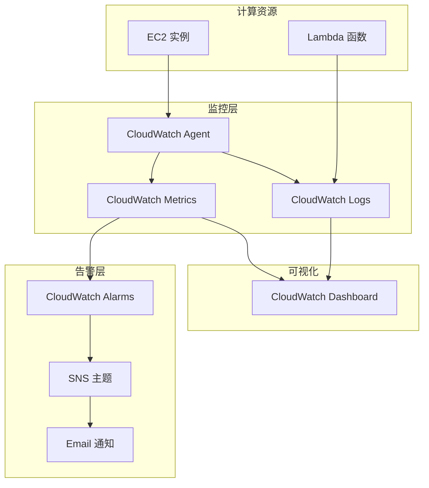

# 项目 1: 基础设施监控平台

> 难度: ⭐ 入门  
> 预计时间: 2-3 小时

---

## 项目目标

构建一个完整的基础设施监控解决方案，涵盖：
- EC2 实例监控
- 自定义指标收集
- 告警配置
- 可视化仪表盘

## 架构图



---

## 前置要求

- AWS 账户
- AWS CLI 配置
- Terraform 安装 (可选)

---

## 任务 1: 配置 CloudWatch Agent

### 手动安装

```bash
# 在 EC2 实例上执行
wget https://s3.amazonaws.com/amazoncloudwatch-agent/amazon_linux/amd64/latest/amazon-cloudwatch-agent.rpm
sudo rpm -U ./amazon-cloudwatch-agent.rpm

# 配置 Agent
sudo /opt/aws/amazon-cloudwatch-agent/bin/amazon-cloudwatch-agent-config-wizard

# 启动 Agent
sudo /opt/aws/amazon-cloudwatch-agent/bin/amazon-cloudwatch-agent-ctl \
    -a fetch-config \
    -m ec2 \
    -s \
    -c file:/opt/aws/amazon-cloudwatch-agent/etc/amazon-cloudwatch-agent.json
```

### 配置文件

```json
{
  "metrics": {
    "namespace": "MyApplication/EC2",
    "metrics_collected": {
      "cpu": {
        "measurement": [
          "cpu_usage_idle",
          "cpu_usage_iowait",
          "cpu_usage_user",
          "cpu_usage_system"
        ],
        "metrics_collection_interval": 60,
        "totalcpu": true
      },
      "disk": {
        "measurement": [
          "used_percent",
          "inodes_free"
        ],
        "metrics_collection_interval": 60,
        "resources": ["*"]
      },
      "diskio": {
        "measurement": [
          "io_time",
          "write_bytes",
          "read_bytes",
          "writes",
          "reads"
        ],
        "metrics_collection_interval": 60
      },
      "swap": {
        "measurement": [
          "swap_used_percent"
        ],
        "metrics_collection_interval": 60
      },
      "mem": {
        "measurement": [
          "mem_used_percent"
        ],
        "metrics_collection_interval": 60
      },
      "net": {
        "measurement": [
          "bytes_sent",
          "bytes_recv",
          "packets_sent",
          "packets_recv"
        ],
        "metrics_collection_interval": 60
      },
      "processes": {
        "measurement": [
          "running",
          "sleeping",
          "dead",
          "zombies"
        ],
        "metrics_collection_interval": 60
      }
    }
  },
  "logs": {
    "logs_collected": {
      "files": {
        "collect_list": [
          {
            "file_path": "/var/log/messages",
            "log_group_name": "MyApplication/System",
            "log_stream_name": "{instance_id}/messages",
            "timezone": "UTC"
          },
          {
            "file_path": "/var/log/application.log",
            "log_group_name": "MyApplication/App",
            "log_stream_name": "{instance_id}/application",
            "timezone": "UTC"
          }
        ]
      }
    }
  }
}
```

---

## 任务 2: 创建 CloudWatch 告警

### Terraform 配置

```hcl
# main.tf
provider "aws" {
  region = "us-east-1"
}

# 数据源: 获取 EC2 实例
variable "instance_id" {
  description = "EC2 Instance ID to monitor"
}

# SNS 主题用于告警
resource "aws_sns_topic" "alarms" {
  name = "infrastructure-alarms"
}

resource "aws_sns_topic_subscription" "email" {
  topic_arn = aws_sns_topic.alarms.arn
  protocol  = "email"
  endpoint  = "your-email@example.com"
}

# CPU 使用率告警
resource "aws_cloudwatch_metric_alarm" "high_cpu" {
  alarm_name          = "ec2-high-cpu-utilization"
  comparison_operator = "GreaterThanThreshold"
  evaluation_periods  = 2
  metric_name         = "CPUUtilization"
  namespace           = "AWS/EC2"
  period              = 300
  statistic           = "Average"
  threshold           = 80
  alarm_description   = "CPU utilization is above 80%"
  alarm_actions       = [aws_sns_topic.alarms.arn]
  ok_actions          = [aws_sns_topic.alarms.arn]
  
  dimensions = {
    InstanceId = var.instance_id
  }
}

# 内存使用率告警 (CloudWatch Agent)
resource "aws_cloudwatch_metric_alarm" "high_memory" {
  alarm_name          = "ec2-high-memory-utilization"
  comparison_operator = "GreaterThanThreshold"
  evaluation_periods  = 2
  metric_name         = "mem_used_percent"
  namespace           = "MyApplication/EC2"
  period              = 300
  statistic           = "Average"
  threshold           = 85
  alarm_description   = "Memory utilization is above 85%"
  alarm_actions       = [aws_sns_topic.alarms.arn]
  
  dimensions = {
    InstanceId = var.instance_id
  }
}

# 磁盘使用率告警
resource "aws_cloudwatch_metric_alarm" "high_disk" {
  alarm_name          = "ec2-high-disk-utilization"
  comparison_operator = "GreaterThanThreshold"
  evaluation_periods  = 1
  metric_name         = "used_percent"
  namespace           = "MyApplication/EC2"
  period              = 300
  statistic           = "Average"
  threshold           = 80
  alarm_description   = "Disk utilization is above 80%"
  alarm_actions       = [aws_sns_topic.alarms.arn]
  
  dimensions = {
    InstanceId = var.instance_id
    device     = "nvme0n1p1"
    fstype     = "xfs"
    path       = "/"
  }
}

# 状态检查告警
resource "aws_cloudwatch_metric_alarm" "status_check" {
  alarm_name          = "ec2-status-check-failed"
  comparison_operator = "GreaterThanThreshold"
  evaluation_periods  = 2
  metric_name         = "StatusCheckFailed"
  namespace           = "AWS/EC2"
  period              = 60
  statistic           = "Maximum"
  threshold           = 0
  alarm_description   = "EC2 status check has failed"
  alarm_actions       = [aws_sns_topic.alarms.arn]
  
  dimensions = {
    InstanceId = var.instance_id
  }
}
```

---

## 任务 3: 创建监控仪表盘

```hcl
# dashboard.tf
resource "aws_cloudwatch_dashboard" "infrastructure" {
  dashboard_name = "Infrastructure-Monitoring"
  
  dashboard_body = jsonencode({
    widgets = [
      {
        type   = "metric"
        x      = 0
        y      = 0
        width  = 12
        height = 6
        properties = {
          title  = "CPU Utilization"
          region = "us-east-1"
          metrics = [
            ["AWS/EC2", "CPUUtilization", "InstanceId", var.instance_id, { color = "#2ca02c" }]
          ]
          period = 300
          stat   = "Average"
          yAxis = {
            left = {
              min = 0
              max = 100
            }
          }
          annotations = {
            horizontal = [
              { value = 80, label = "Alarm", color = "#ff0000" }
            ]
          }
        }
      },
      {
        type   = "metric"
        x      = 12
        y      = 0
        width  = 12
        height = 6
        properties = {
          title  = "Memory Utilization"
          region = "us-east-1"
          metrics = [
            ["MyApplication/EC2", "mem_used_percent", "InstanceId", var.instance_id]
          ]
          period = 300
          stat   = "Average"
        }
      },
      {
        type   = "metric"
        x      = 0
        y      = 6
        width  = 12
        height = 6
        properties = {
          title  = "Disk Usage"
          region = "us-east-1"
          metrics = [
            ["MyApplication/EC2", "used_percent", "InstanceId", var.instance_id, "device", "nvme0n1p1", "fstype", "xfs", "path", "/"]
          ]
          period = 300
          stat   = "Average"
        }
      },
      {
        type   = "log"
        x      = 12
        y      = 6
        width  = 12
        height = 6
        properties = {
          title  = "Application Errors"
          region = "us-east-1"
          query  = <<-EOT
            SOURCE 'MyApplication/App' 
            | fields @timestamp, @message 
            | filter @message like /ERROR/ 
            | sort @timestamp desc 
            | limit 20
          EOT
        }
      },
      {
        type   = "metric"
        x      = 0
        y      = 12
        width  = 24
        height = 6
        properties = {
          title  = "Network Traffic"
          region = "us-east-1"
          metrics = [
            ["MyApplication/EC2", "bytes_sent", "InstanceId", var.instance_id, { stat = "Sum", color = "#1f77b4" }],
            [".", "bytes_recv", ".", ".", { stat = "Sum", color = "#ff7f0e" }]
          ]
          period = 300
        }
      }
    ]
  })
}
```

---

## 任务 4: Python 自定义指标

```python
# metrics_publisher.py
import boto3
import psutil
import time
from datetime import datetime

class SystemMetricsPublisher:
    """系统指标发布器"""
    
    def __init__(self, namespace='Custom/System'):
        self.cloudwatch = boto3.client('cloudwatch')
        self.namespace = namespace
    
    def collect_and_publish(self):
        """收集并发布系统指标"""
        
        # CPU 指标
        cpu_percent = psutil.cpu_percent(interval=1)
        
        # 内存指标
        memory = psutil.virtual_memory()
        
        # 磁盘指标
        disk = psutil.disk_usage('/')
        
        # 网络指标
        net_io = psutil.net_io_counters()
        
        # 进程数
        process_count = len(psutil.pids())
        
        # 构建指标数据
        metric_data = [
            {
                'MetricName': 'CPUUtilization',
                'Value': cpu_percent,
                'Unit': 'Percent',
                'Timestamp': datetime.utcnow()
            },
            {
                'MetricName': 'MemoryUtilization',
                'Value': memory.percent,
                'Unit': 'Percent',
                'Timestamp': datetime.utcnow()
            },
            {
                'MetricName': 'DiskUtilization',
                'Value': (disk.used / disk.total) * 100,
                'Unit': 'Percent',
                'Timestamp': datetime.utcnow()
            },
            {
                'MetricName': 'ProcessCount',
                'Value': process_count,
                'Unit': 'Count',
                'Timestamp': datetime.utcnow()
            }
        ]
        
        # 批量发送
        self.cloudwatch.put_metric_data(
            Namespace=self.namespace,
            MetricData=metric_data
        )
        
        print(f"Published {len(metric_data)} metrics at {datetime.utcnow()}")

def main():
    publisher = SystemMetricsPublisher()
    
    while True:
        try:
            publisher.collect_and_publish()
            time.sleep(60)  # 每分钟收集一次
        except Exception as e:
            print(f"Error: {e}")
            time.sleep(10)

if __name__ == '__main__':
    main()
```

---

## 部署步骤

```bash
# 1. 初始化 Terraform
cd terraform/
terraform init

# 2. 规划
terraform plan -var="instance_id=i-123456789"

# 3. 部署
terraform apply -var="instance_id=i-123456789"

# 4. 验证仪表盘
# 访问 CloudWatch Console > Dashboards > Infrastructure-Monitoring
```

---

## 验证清单

- [ ] CloudWatch Agent 正常运行
- [ ] 指标数据正常上报
- [ ] 告警邮件正常接收
- [ ] 仪表盘显示正常
- [ ] 日志数据可查询

---

## 扩展挑战

1. **添加 Lambda 监控**：配置 Lambda 函数的并发、错误率、延迟监控
2. **实现自动修复**：当 CPU 过高时自动重启服务
3. **成本告警**：设置 CloudWatch 账单告警
4. **多实例支持**：修改代码支持监控多个 EC2 实例

---

## 清理资源

```bash
terraform destroy -var="instance_id=i-123456789"
```
