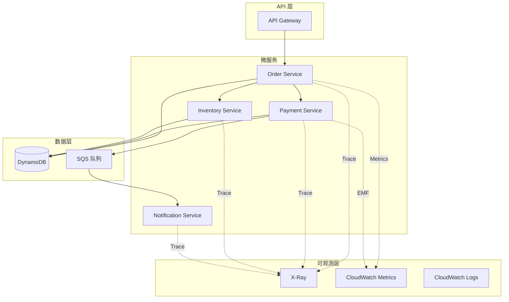

# 项目 2: APM 与分布式追踪平台

> 难度: ⭐⭐ 进阶  
> 预计时间: 4-6 小时

---

## 项目目标

构建完整的应用性能监控 (APM) 平台：
- 分布式追踪实现
- 业务指标收集
- 性能分析与优化
- 多服务关联监控

## 架构图



---

## 项目结构

```
02-apm-distributed-tracing/
├── services/
│   ├── order_service/
│   │   ├── app.py
│   │   ├── requirements.txt
│   │   └── template.yaml
│   ├── payment_service/
│   │   └── ...
│   └── inventory_service/
│       └── ...
├── shared/
│   └── tracing_utils.py
├── infrastructure/
│   └── main.tf
└── README.md
```

---

## 任务 1: 订单服务实现

```python
# services/order_service/app.py
import boto3
import json
import os
from datetime import datetime
from aws_xray_sdk.core import xray_recorder, patch_all
from aws_xray_sdk.core.models import subsegment

# 启用 X-Ray 自动埋点
patch_all()

dynamodb = boto3.resource('dynamodb')
payment_client = boto3.client('lambda')
inventory_client = boto3.client('lambda')

ORDERS_TABLE = os.environ['ORDERS_TABLE']

@xray_recorder.capture('lambda_handler')
def lambda_handler(event, context):
    """订单处理 Lambda"""
    
    # 添加追踪注解
    segment = xray_recorder.current_segment()
    segment.put_annotation('order_service_version', '1.0.0')
    segment.put_metadata('request_context', {
        'request_id': context.aws_request_id,
        'function_name': context.function_name,
        'memory_limit': context.memory_limit_in_mb
    })
    
    try:
        body = json.loads(event['body'])
        
        # 业务上下文
        customer_tier = body.get('customer_tier', 'standard')
        order_value = body['items_total']
        
        segment.put_annotation('customer_tier', customer_tier)
        segment.put_annotation('order_value', order_value)
        
        # 1. 验证库存
        with xray_recorder.capture_subsegment('check_inventory') as sub:
            sub.put_annotation('product_count', len(body['items']))
            inventory_result = check_inventory(body['items'])
            sub.put_metadata('inventory_check', inventory_result)
        
        if not inventory_result['available']:
            return error_response(400, 'Inventory not available')
        
        # 2. 创建订单
        with xray_recorder.capture_subsegment('create_order') as sub:
            order_id = create_order(body)
            sub.put_annotation('order_id', order_id)
        
        # 3. 处理支付
        with xray_recorder.capture_subsegment('process_payment') as sub:
            sub.put_annotation('payment_method', body['payment_method'])
            payment_result = process_payment(order_id, body)
            sub.put_annotation('payment_status', payment_result['status'])
        
        if payment_result['status'] != 'success':
            # 回滚库存
            rollback_inventory(body['items'])
            return error_response(400, 'Payment failed')
        
        # 4. 发送通知
        with xray_recorder.capture_subsegment('send_notification'):
            send_order_confirmation(order_id, body)
        
        # 记录业务指标
        record_business_metrics(order_id, customer_tier, order_value)
        
        return success_response({
            'order_id': order_id,
            'status': 'confirmed',
            'total': order_value
        })
        
    except Exception as e:
        segment.put_annotation('error', str(e))
        segment.add_error_flag()
        raise

def check_inventory(items):
    """检查库存"""
    response = inventory_client.invoke(
        FunctionName=os.environ['INVENTORY_FUNCTION'],
        Payload=json.dumps({'action': 'check', 'items': items})
    )
    return json.loads(response['Payload'].read())

def create_order(order_data):
    """创建订单记录"""
    table = dynamodb.Table(ORDERS_TABLE)
    order_id = f"ORD-{datetime.utcnow().strftime('%Y%m%d%H%M%S')}"
    
    item = {
        'order_id': order_id,
        'customer_id': order_data['customer_id'],
        'items': order_data['items'],
        'total': order_data['items_total'],
        'status': 'pending',
        'created_at': datetime.utcnow().isoformat()
    }
    
    table.put_item(Item=item)
    return order_id

def process_payment(order_id, order_data):
    """处理支付"""
    response = payment_client.invoke(
        FunctionName=os.environ['PAYMENT_FUNCTION'],
        Payload=json.dumps({
            'order_id': order_id,
            'amount': order_data['items_total'],
            'method': order_data['payment_method']
        })
    )
    return json.loads(response['Payload'].read())

def record_business_metrics(order_id, customer_tier, order_value):
    """记录业务指标 (EMF 格式)"""
    
    metric_payload = {
        "_aws": {
            "Timestamp": int(datetime.utcnow().timestamp() * 1000),
            "CloudWatchMetrics": [
                {
                    "Namespace": "ECommerce/Business",
                    "Dimensions": [["CustomerTier"]],
                    "Metrics": [
                        {"Name": "OrdersCreated", "Unit": "Count"},
                        {"Name": "OrderValue", "Unit": "None"}
                    ]
                }
            ]
        },
        "CustomerTier": customer_tier,
        "OrdersCreated": 1,
        "OrderValue": order_value,
        "OrderId": order_id
    }
    
    print(json.dumps(metric_payload))

def success_response(body):
    return {
        'statusCode': 200,
        'headers': {'Content-Type': 'application/json'},
        'body': json.dumps(body)
    }

def error_response(code, message):
    return {
        'statusCode': code,
        'headers': {'Content-Type': 'application/json'},
        'body': json.dumps({'error': message})
    }
```

---

## 任务 2: 支付服务实现

```python
# services/payment_service/app.py
import boto3
import json
import os
import time
from datetime import datetime
from aws_xray_sdk.core import xray_recorder, patch_all

patch_all()

dynamodb = boto3.resource('dynamodb')
sqs = boto3.client('sqs')

PAYMENTS_TABLE = os.environ['PAYMENTS_TABLE']
NOTIFICATION_QUEUE = os.environ['NOTIFICATION_QUEUE']

@xray_recorder.capture('process_payment')
def lambda_handler(event, context):
    """支付处理 Lambda"""
    
    segment = xray_recorder.current_segment()
    start_time = time.time()
    
    order_id = event['order_id']
    amount = event['amount']
    method = event['method']
    
    segment.put_annotation('order_id', order_id)
    segment.put_annotation('payment_method', method)
    
    try:
        # 模拟支付网关调用
        with xray_recorder.capture_subsegment('call_payment_gateway') as sub:
            gateway_result = call_payment_gateway(amount, method)
            sub.put_annotation('gateway_status', gateway_result['status'])
            sub.put_metadata('gateway_response', gateway_result)
        
        # 记录支付
        with xray_recorder.capture_subsegment('save_payment_record'):
            transaction_id = save_payment(order_id, amount, method, gateway_result)
        
        # 发送通知队列消息
        with xray_recorder.capture_subsegment('queue_notification'):
            send_notification(order_id, gateway_result['status'])
        
        # 记录延迟指标
        latency = (time.time() - start_time) * 1000
        record_payment_metrics(method, latency, gateway_result['status'])
        
        return {
            'status': 'success',
            'transaction_id': transaction_id
        }
        
    except Exception as e:
        segment.put_annotation('payment_error', str(e))
        record_payment_metrics(method, (time.time() - start_time) * 1000, 'error')
        raise

def call_payment_gateway(amount, method):
    """调用支付网关 (模拟)"""
    # 模拟外部 API 调用延迟
    time.sleep(0.1)
    
    # 模拟随机失败
    import random
    if random.random() < 0.05:  # 5% 失败率
        raise Exception('Payment gateway timeout')
    
    return {
        'status': 'approved',
        'transaction_ref': f'TXN-{int(time.time())}'
    }

def save_payment(order_id, amount, method, gateway_result):
    """保存支付记录"""
    table = dynamodb.Table(PAYMENTS_TABLE)
    
    transaction_id = f"PAY-{datetime.utcnow().strftime('%Y%m%d%H%M%S')}"
    
    table.put_item(Item={
        'transaction_id': transaction_id,
        'order_id': order_id,
        'amount': amount,
        'method': method,
        'status': gateway_result['status'],
        'gateway_ref': gateway_result['transaction_ref'],
        'timestamp': datetime.utcnow().isoformat()
    })
    
    return transaction_id

def send_notification(order_id, status):
    """发送通知到队列"""
    sqs.send_message(
        QueueUrl=NOTIFICATION_QUEUE,
        MessageBody=json.dumps({
            'order_id': order_id,
            'event': 'payment_processed',
            'status': status
        })
    )

def record_payment_metrics(method, latency_ms, status):
    """记录支付指标"""
    
    metric_payload = {
        "_aws": {
            "Timestamp": int(datetime.utcnow().timestamp() * 1000),
            "CloudWatchMetrics": [
                {
                    "Namespace": "ECommerce/Payment",
                    "Dimensions": [["PaymentMethod", "Status"]],
                    "Metrics": [
                        {"Name": "PaymentLatency", "Unit": "Milliseconds"},
                        {"Name": "PaymentCount", "Unit": "Count"}
                    ]
                }
            ]
        },
        "PaymentMethod": method,
        "Status": status,
        "PaymentLatency": latency_ms,
        "PaymentCount": 1
    }
    
    print(json.dumps(metric_payload))
```

---

## 任务 3: X-Ray 采样配置

```json
{
  "version": 2,
  "default": {
    "fixed_target": 1,
    "rate": 0.1
  },
  "rules": [
    {
      "description": "Order API - 高采样率",
      "service_name": "OrderService",
      "http_method": "*",
      "url_path": "/orders",
      "fixed_target": 5,
      "rate": 0.5
    },
    {
      "description": "支付错误 - 100% 采样",
      "service_name": "PaymentService",
      "http_method": "*",
      "url_path": "*",
      "fixed_target": 100,
      "rate": 1.0
    },
    {
      "description": "库存检查 - 低采样率",
      "service_name": "InventoryService",
      "http_method": "*",
      "url_path": "/inventory/check",
      "fixed_target": 1,
      "rate": 0.05
    }
  ]
}
```

---

## 任务 4: CloudWatch 仪表板

```yaml
# dashboard.yaml
Resources:
  ServiceDashboard:
    Type: AWS::CloudWatch::Dashboard
    Properties:
      DashboardName: ECommerce-ServiceMap
      DashboardBody: !Sub |
        {
          "widgets": [
            {
              "type": "trace",
              "x": 0,
              "y": 0,
              "width": 24,
              "height": 12,
              "properties": {
                "service": "OrderService"
              }
            },
            {
              "type": "metric",
              "x": 0,
              "y": 12,
              "width": 12,
              "height": 6,
              "properties": {
                "title": "Orders by Customer Tier",
                "region": "us-east-1",
                "metrics": [
                  ["ECommerce/Business", "OrdersCreated", "CustomerTier", "premium"],
                  ["...", "standard"],
                  ["...", "free"]
                ],
                "period": 60,
                "stat": "Sum"
              }
            },
            {
              "type": "metric",
              "x": 12,
              "y": 12,
              "width": 12,
              "height": 6,
              "properties": {
                "title": "Payment Latency",
                "region": "us-east-1",
                "metrics": [
                  ["ECommerce/Payment", "PaymentLatency", "PaymentMethod", "credit_card", "Status", "approved", { "stat": "p99" }],
                  ["...", { "stat": "p95" }],
                  ["...", { "stat": "Average" }]
                ]
              }
            }
          ]
        }
```

---

## 部署步骤

```bash
# 1. 部署基础设施
cd infrastructure
terraform init
terraform apply

# 2. 构建 Lambda 函数
cd ../services/order_service
sam build
sam deploy --guided

# 3. 配置 X-Ray 采样规则
aws xray update-sampling-rule --cli-input-json file://sampling-rules.json

# 4. 查看 X-Ray 服务地图
# 访问 CloudWatch Console > X-Ray > Service Map
```

---

## 验证清单

- [ ] X-Ray 服务地图显示完整调用链
- [ ] 自定义业务指标正常上报
- [ ] CloudWatch 仪表盘显示正确
- [ ] 分布式追踪包含所有服务

---

## 扩展挑战

1. **添加数据库追踪**：追踪 DynamoDB 查询性能
2. **实现金丝雀部署**：使用 X-Ray 对比新版本性能
3. **添加 RUM**：监控前端用户体验
4. **实现智能采样**：基于错误率动态调整采样
