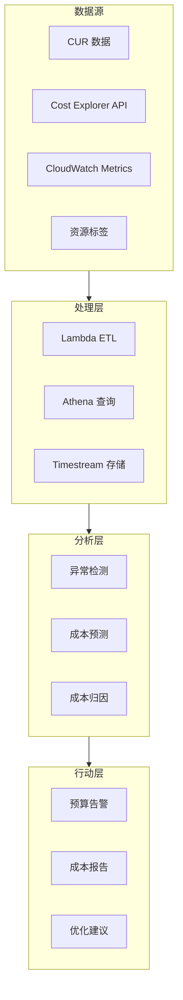

# 项目 3: 成本可观测性平台

> 难度: ⭐⭐⭐ 高级  
> 预计时间: 6-8 小时

---

## 项目目标

构建企业级成本可观测性平台：
- 实时成本监控
- 成本归因分析
- 预算告警与预测
- 自动化成本优化

## 架构图



---

## 项目结构

```
03-cost-observability/
├── data-pipeline/
│   ├── cur_processor.py
│   ├── athena_queries/
│   └── template.yaml
├── analytics/
│   ├── cost_anomaly_detection.py
│   ├── forecasting.py
│   └── attribution.py
├── dashboard/
│   └── cost_dashboard.json
├── automation/
│   ├── budget_enforcer.py
│   └── resource_scheduler.py
└── README.md
```

---

## 任务 1: CUR 数据处理

```python
# data-pipeline/cur_processor.py
import boto3
import gzip
import json
import csv
import io
from datetime import datetime, timedelta
from typing import List, Dict

class CURProcessor:
    """
    Cost and Usage Report 处理器
    将 CUR 数据转换为可分析的格式
    """
    
    def __init__(self, cur_bucket: str, athena_bucket: str):
        self.s3 = boto3.client('s3')
        self.glue = boto3.client('glue')
        self.athena = boto3.client('athena')
        self.cur_bucket = cur_bucket
        self.athena_bucket = athena_bucket
        self.athena_database = 'cost_analysis'
    
    def process_daily_cur(self, date: datetime):
        """处理每日 CUR 数据"""
        
        # 构建 CUR 文件路径
        prefix = f"cur/{date.strftime('%Y/%m/%d')}/"
        
        # 列出文件
        response = self.s3.list_objects_v2(
            Bucket=self.cur_bucket,
            Prefix=prefix
        )
        
        for obj in response.get('Contents', []):
            if obj['Key'].endswith('.csv.gz'):
                self._process_cur_file(obj['Key'])
    
    def _process_cur_file(self, s3_key: str):
        """处理单个 CUR 文件"""
        
        # 下载并解压
        response = self.s3.get_object(Bucket=self.cur_bucket, Key=s3_key)
        compressed_data = response['Body'].read()
        
        csv_data = gzip.decompress(compressed_data).decode('utf-8')
        
        # 解析 CSV
        reader = csv.DictReader(io.StringIO(csv_data))
        
        # 按服务聚合
        aggregated = self._aggregate_by_dimensions(reader)
        
        # 保存到处理桶
        output_key = f"processed/{s3_key.replace('.csv.gz', '.json')}"
        self.s3.put_object(
            Bucket=self.athena_bucket,
            Key=output_key,
            Body=json.dumps(aggregated, default=str)
        )
    
    def _aggregate_by_dimensions(self, reader) -> List[Dict]:
        """按多维度聚合成本数据"""
        
        aggregation = {}
        
        for row in reader:
            # 提取关键维度
            dimensions = {
                'service': row.get('lineItem_ProductCode', 'Unknown'),
                'region': row.get('product_region', 'global'),
                'account': row.get('lineItem_UsageAccountId', 'Unknown'),
                'environment': row.get('resourceTags_environment', 'untagged'),
                'team': row.get('resourceTags_team', 'untagged'),
                'application': row.get('resourceTags_application', 'untagged')
            }
            
            # 提取成本数据
            cost = float(row.get('lineItem_BlendedCost', 0))
            usage = float(row.get('lineItem_UsageAmount', 0))
            
            key = tuple(sorted(dimensions.items()))
            
            if key not in aggregation:
                aggregation[key] = {
                    'dimensions': dimensions,
                    'total_cost': 0,
                    'total_usage': 0,
                    'record_count': 0
                }
            
            aggregation[key]['total_cost'] += cost
            aggregation[key]['total_usage'] += usage
            aggregation[key]['record_count'] += 1
        
        # 转换为列表
        result = []
        for data in aggregation.values():
            result.append({
                'service': data['dimensions']['service'],
                'region': data['dimensions']['region'],
                'account': data['dimensions']['account'],
                'environment': data['dimensions']['environment'],
                'team': data['dimensions']['team'],
                'application': data['dimensions']['application'],
                'total_cost': round(data['total_cost'], 4),
                'total_usage': round(data['total_usage'], 4),
                'record_count': data['record_count'],
                'processing_date': datetime.utcnow().isoformat()
            })
        
        return result
    
    def query_athena(self, query: str) -> List[Dict]:
        """执行 Athena 查询"""
        
        response = self.athena.start_query_execution(
            QueryString=query,
            QueryExecutionContext={'Database': self.athena_database},
            ResultConfiguration={
                'OutputLocation': f's3://{self.athena_bucket}/athena-results/'
            }
        )
        
        execution_id = response['QueryExecutionId']
        
        # 等待完成
        while True:
            status = self.athena.get_query_execution(
                QueryExecutionId=execution_id
            )
            state = status['QueryExecution']['Status']['State']
            
            if state in ['SUCCEEDED', 'FAILED', 'CANCELLED']:
                break
            
            import time
            time.sleep(1)
        
        if state == 'SUCCEEDED':
            results = self.athena.get_query_results(
                QueryExecutionId=execution_id
            )
            return self._parse_athena_results(results)
        
        return []
    
    def _parse_athena_results(self, results) -> List[Dict]:
        """解析 Athena 结果"""
        columns = [col['Label'] for col in results['ResultSet']['ResultSetMetadata']['ColumnInfo']]
        
        data = []
        for row in results['ResultSet']['Rows'][1:]:  # 跳过标题行
            values = [item.get('VarCharValue', '') for item in row['Data']]
            data.append(dict(zip(columns, values)))
        
        return data

# Lambda 处理函数
def lambda_handler(event, context):
    """每日 CUR 处理"""
    
    processor = CURProcessor(
        cur_bucket='my-cur-bucket',
        athena_bucket='my-athena-bucket'
    )
    
    # 处理昨天的数据
    yesterday = datetime.utcnow() - timedelta(days=1)
    processor.process_daily_cur(yesterday)
    
    return {
        'status': 'success',
        'processed_date': yesterday.strftime('%Y-%m-%d')
    }
```

---

## 任务 2: 成本异常检测

```python
# analytics/cost_anomaly_detection.py
import boto3
import numpy as np
from datetime import datetime, timedelta
from typing import List, Dict
from dataclasses import dataclass
import json

@dataclass
class AnomalyResult:
    service: str
    current_cost: float
    expected_cost: float
    deviation_percent: float
    severity: str
    contributing_factors: List[str]

class CostAnomalyDetector:
    """
    成本异常检测器
    使用统计方法和机器学习检测成本异常
    """
    
    def __init__(self):
        self.ce = boto3.client('ce')
        self.sns = boto3.client('sns')
        
        # 异常阈值配置
        self.thresholds = {
            'critical': 2.0,    # 2倍标准差
            'warning': 1.5,     # 1.5倍标准差
            'info': 1.0         # 1倍标准差
        }
    
    def detect_anomalies(self, lookback_days: int = 30) -> List[AnomalyResult]:
        """检测成本异常"""
        
        end_date = datetime.utcnow()
        start_date = end_date - timedelta(days=lookback_days + 7)
        
        # 获取历史成本数据
        historical = self._get_historical_costs(start_date, end_date)
        
        anomalies = []
        
        for service, daily_costs in historical.items():
            if len(daily_costs) < 14:  # 需要至少14天数据
                continue
            
            # 计算统计指标
            mean = np.mean(daily_costs[:-7])  # 使用历史均值
            std = np.std(daily_costs[:-7])
            
            # 检查最近7天
            for i, cost in enumerate(daily_costs[-7:]):
                if std == 0:
                    continue
                
                z_score = (cost - mean) / std
                deviation = ((cost - mean) / mean) * 100 if mean > 0 else 0
                
                # 判断异常级别
                if abs(z_score) >= self.thresholds['critical']:
                    severity = 'CRITICAL'
                elif abs(z_score) >= self.thresholds['warning']:
                    severity = 'WARNING'
                elif abs(z_score) >= self.thresholds['info']:
                    severity = 'INFO'
                else:
                    continue
                
                # 分析贡献因素
                factors = self._analyze_contributing_factors(service, cost, mean)
                
                anomalies.append(AnomalyResult(
                    service=service,
                    current_cost=cost,
                    expected_cost=mean,
                    deviation_percent=deviation,
                    severity=severity,
                    contributing_factors=factors
                ))
        
        return sorted(anomalies, key=lambda x: abs(x.deviation_percent), reverse=True)
    
    def _get_historical_costs(self, start: datetime, end: datetime) -> Dict[str, List[float]]:
        """获取历史成本数据"""
        
        response = self.ce.get_cost_and_usage(
            TimePeriod={
                'Start': start.strftime('%Y-%m-%d'),
                'End': end.strftime('%Y-%m-%d')
            },
            Granularity='DAILY',
            Metrics=['BlendedCost'],
            GroupBy=[
                {'Type': 'DIMENSION', 'Key': 'SERVICE'}
            ]
        )
        
        # 按服务组织数据
        costs_by_service = {}
        
        for result in response['ResultsByTime']:
            for group in result['Groups']:
                service = group['Keys'][0]
                cost = float(group['Metrics']['BlendedCost']['Amount'])
                
                if service not in costs_by_service:
                    costs_by_service[service] = []
                costs_by_service[service].append(cost)
        
        return costs_by_service
    
    def _analyze_contributing_factors(self, service: str, current: float, expected: float) -> List[str]:
        """分析成本异常的原因"""
        
        factors = []
        
        # 获取详细使用数据
        usage = self._get_service_usage(service)
        
        # 检查使用量增长
        for dimension, data in usage.items():
            if data['current'] > data['expected'] * 1.5:
                factors.append(
                    f"{dimension}: {data['current']:.0f} vs expected {data['expected']:.0f}"
                )
        
        # 检查价格变化
        if current > expected * 1.3 and not factors:
            factors.append("Potential price change or new resource type")
        
        return factors
    
    def _get_service_usage(self, service: str) -> Dict:
        """获取服务使用详情"""
        # 简化实现
        return {}
    
    def send_anomaly_alerts(self, anomalies: List[AnomalyResult]):
        """发送异常告警"""
        
        if not anomalies:
            return
        
        # 只发送高优先级异常
        critical_anomalies = [a for a in anomalies if a.severity in ['CRITICAL', 'WARNING']]
        
        if not critical_anomalies:
            return
        
        # 构建告警消息
        message = {
            'default': json.dumps({
                'alert_type': 'cost_anomaly',
                'anomaly_count': len(critical_anomalies),
                'anomalies': [
                    {
                        'service': a.service,
                        'deviation': f"{a.deviation_percent:+.1f}%",
                        'severity': a.severity,
                        'current_cost': f"${a.current_cost:.2f}",
                        'expected_cost': f"${a.expected_cost:.2f}"
                    }
                    for a in critical_anomalies[:10]
                ]
            }),
            'email': self._format_email_alert(critical_anomalies)
        }
        
        self.sns.publish(
            TopicArn='arn:aws:sns:us-east-1:123456789:cost-anomalies',
            Message=json.dumps(message),
            MessageStructure='json',
            Subject=f'Cost Anomaly Alert: {len(critical_anomalies)} services affected'
        )
    
    def _format_email_alert(self, anomalies: List[AnomalyResult]) -> str:
        """格式化邮件告警"""
        
        lines = [
            "Cost Anomaly Detected",
            "",
            "The following services have unusual cost patterns:",
            ""
        ]
        
        for a in anomalies:
            lines.append(f"Service: {a.service}")
            lines.append(f"  Severity: {a.severity}")
            lines.append(f"  Deviation: {a.deviation_percent:+.1f}%")
            lines.append(f"  Current: ${a.current_cost:.2f} (Expected: ${a.expected_cost:.2f})")
            if a.contributing_factors:
                lines.append(f"  Factors: {', '.join(a.contributing_factors)}")
            lines.append("")
        
        return '\n'.join(lines)

# Lambda 处理函数
def lambda_handler(event, context):
    """每日异常检测"""
    
    detector = CostAnomalyDetector()
    
    # 检测异常
    anomalies = detector.detect_anomalies(lookback_days=30)
    
    # 发送告警
    detector.send_anomaly_alerts(anomalies)
    
    return {
        'anomalies_detected': len(anomalies),
        'critical': len([a for a in anomalies if a.severity == 'CRITICAL']),
        'warning': len([a for a in anomalies if a.severity == 'WARNING'])
    }
```

---

## 任务 3: 成本预测与预算管理

```python
# analytics/forecasting.py
import boto3
import json
from datetime import datetime, timedelta
from typing import Dict, List

class CostForecaster:
    """
    成本预测器
    - 基于历史数据预测未来成本
    - 预算进度跟踪
    - 超支预警
    """
    
    def __init__(self):
        self.ce = boto3.client('ce')
        self.budgets = boto3.client('budgets')
    
    def forecast_monthly_cost(self, months_ahead: int = 1) -> Dict:
        """预测月度成本"""
        
        # 获取预测
        response = self.ce.get_cost_forecast(
            TimePeriod={
                'Start': datetime.utcnow().strftime('%Y-%m-%d'),
                'End': (datetime.utcnow() + timedelta(days=30*months_ahead)).strftime('%Y-%m-%d')
            },
            Metric='BLENDED_COST',
            Granularity='MONTHLY'
        )
        
        return {
            'forecast_amount': float(response['Total']['Amount']),
            'currency': response['Total']['Unit'],
            'confidence_interval': {
                'lower_bound': float(response['ForecastResultsByTime'][0]['MeanValue']) * 0.9,
                'upper_bound': float(response['ForecastResultsByTime'][0]['MeanValue']) * 1.1
            }
        }
    
    def get_budget_status(self, budget_name: str) -> Dict:
        """获取预算状态"""
        
        try:
            response = self.budgets.describe_budget(
                AccountId='123456789',
                BudgetName=budget_name
            )
            
            budget = response['Budget']
            
            # 计算预算使用率
            limit = float(budget['BudgetLimit']['Amount'])
            
            # 获取实际支出
            actual_spend = self._get_actual_spend_current_month()
            
            utilization = (actual_spend / limit) * 100 if limit > 0 else 0
            
            # 获取预测
            forecast = self.forecast_monthly_cost()
            forecast_utilization = (forecast['forecast_amount'] / limit) * 100
            
            return {
                'budget_name': budget_name,
                'budget_limit': limit,
                'actual_spend': actual_spend,
                'utilization_percent': utilization,
                'forecast_amount': forecast['forecast_amount'],
                'forecast_utilization_percent': forecast_utilization,
                'status': self._determine_budget_status(utilization, forecast_utilization),
                'projected_overspend': max(0, forecast['forecast_amount'] - limit)
            }
            
        except Exception as e:
            return {'error': str(e)}
    
    def _get_actual_spend_current_month(self) -> float:
        """获取当月实际支出"""
        
        now = datetime.utcnow()
        start = now.replace(day=1)
        
        response = self.ce.get_cost_and_usage(
            TimePeriod={
                'Start': start.strftime('%Y-%m-%d'),
                'End': now.strftime('%Y-%m-%d')
            },
            Granularity='MONTHLY',
            Metrics=['BlendedCost']
        )
        
        if response['ResultsByTime']:
            return float(response['ResultsByTime'][0]['Total']['BlendedCost']['Amount'])
        return 0
    
    def _determine_budget_status(self, actual_util: float, forecast_util: float) -> str:
        """确定预算状态"""
        
        if actual_util >= 100 or forecast_util >= 100:
            return 'OVERRUN'
        elif forecast_util >= 90:
            return 'AT_RISK'
        elif forecast_util >= 75:
            return 'WARNING'
        else:
            return 'HEALTHY'
    
    def generate_cost_report(self) -> Dict:
        """生成成本报告"""
        
        # 按服务分析
        services = self._analyze_by_service()
        
        # 按团队分析
        teams = self._analyze_by_team()
        
        # 趋势分析
        trends = self._analyze_trends()
        
        return {
            'generated_at': datetime.utcnow().isoformat(),
            'summary': {
                'current_month_spend': self._get_actual_spend_current_month(),
                'forecasted_spend': self.forecast_monthly_cost()['forecast_amount'],
                'top_services': services[:5],
                'team_breakdown': teams
            },
            'trends': trends,
            'recommendations': self._generate_recommendations(services, trends)
        }
    
    def _analyze_by_service(self) -> List[Dict]:
        """按服务分析成本"""
        
        now = datetime.utcnow()
        start = now - timedelta(days=30)
        
        response = self.ce.get_cost_and_usage(
            TimePeriod={
                'Start': start.strftime('%Y-%m-%d'),
                'End': now.strftime('%Y-%m-%d')
            },
            Granularity='MONTHLY',
            Metrics=['BlendedCost'],
            GroupBy=[{'Type': 'DIMENSION', 'Key': 'SERVICE'}]
        )
        
        services = []
        for group in response['ResultsByTime'][0]['Groups']:
            services.append({
                'service': group['Keys'][0],
                'cost': float(group['Metrics']['BlendedCost']['Amount'])
            })
        
        return sorted(services, key=lambda x: x['cost'], reverse=True)
    
    def _analyze_by_team(self) -> List[Dict]:
        """按团队分析成本"""
        # 需要标签支持
        return []
    
    def _analyze_trends(self) -> Dict:
        """分析成本趋势"""
        # 获取过去6个月数据
        return {}
    
    def _generate_recommendations(self, services: List[Dict], trends: Dict) -> List[str]:
        """生成优化建议"""
        recommendations = []
        
        # 识别高成本服务
        for svc in services[:3]:
            recommendations.append(
                f"Review {svc['service']} costs: ${svc['cost']:.2f}/month"
            )
        
        return recommendations

# Lambda 处理函数
def lambda_handler(event, context):
    """生成并发送成本报告"""
    
    forecaster = CostForecaster()
    
    # 获取预算状态
    budget_status = forecaster.get_budget_status('MonthlyBudget')
    
    # 生成报告
    report = forecaster.generate_cost_report()
    report['budget_status'] = budget_status
    
    return report
```

---

## 部署步骤

```bash
# 1. 部署数据管道
cd data-pipeline
sam build
sam deploy --guided

# 2. 部署分析 Lambda
cd ../analytics
sam build
sam deploy --guided

# 3. 配置 EventBridge 定时触发器
aws events put-rule \
    --name daily-cost-analysis \
    --schedule-expression "cron(0 9 * * ? *)"

# 4. 查看仪表板
# 访问 CloudWatch Console > Dashboards > CostObservability
```

---

## 验证清单

- [ ] CUR 数据正常处理
- [ ] Athena 查询正常执行
- [ ] 异常检测正确识别成本波动
- [ ] 成本预测准确
- [ ] 预算告警正常触发
- [ ] 仪表板显示完整成本视图

---

## 扩展挑战

1. **Spot 实例优化器**：分析 Spot 实例使用情况并推荐优化
2. **Reserved Instance 规划器**：分析 RI 覆盖率并推荐购买
3. **无资源检测**：识别未使用的资源并建议删除
4. **多账户聚合**：支持 AWS Organizations 多账户成本分析
