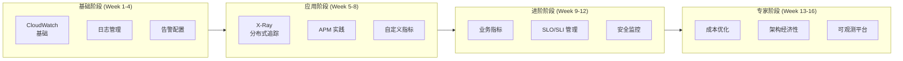

# AWS 监控与可观测性学习路线图

> 16周从入门到精通，构建经济高效的可观测体系

---

## 学习路径概览



---

## 第 1-4 周：基础监控能力

### Week 1: CloudWatch 基础

**学习目标**
- 理解 CloudWatch 架构和数据流
- 掌握指标命名空间和维度
- 学会使用 CloudWatch 控制台

**实践任务**
```bash
# 1. 创建 CloudWatch 仪表板
# 2. 配置 EC2 基础监控
# 3. 设置第一个告警
```

**推荐阅读**
- CloudWatch 文档基础部分
- 白皮书第 1-2 章

---

### Week 2: 日志管理

**学习目标**
- 掌握 CloudWatch Logs 架构
- 学习日志保留策略
- 理解日志组和日志流

**实践任务**
```bash
# 1. 创建日志组并配置保留期
# 2. 使用 CloudWatch Logs Agent
# 3. 配置 Lambda 日志输出
```

**代码练习**
```python
# 结构化日志记录
import logging
import json

logger = logging.getLogger()
logger.setLevel(logging.INFO)

def lambda_handler(event, context):
    logger.info(json.dumps({
        'event': 'payment_received',
        'amount': event['amount'],
        'request_id': context.aws_request_id
    }))
```

---

### Week 3: CloudWatch Insights

**学习目标**
- 掌握 Logs Insights 查询语法
- 学会分析日志模式
- 理解字段提取

**实践任务**
```sql
-- 练习 1: 错误统计
fields @message
| filter @message like /ERROR/
| stats count() by bin(1h)

-- 练习 2: 延迟分析
fields @duration
| filter @type = "REPORT"
| stats avg(@duration), max(@duration), percentile(@duration, 99)

-- 练习 3: 业务指标
fields @message
| parse @message "user: * action: *" as user, action
| stats count() by action
```

---

### Week 4: 告警策略

**学习目标**
- 设计告警策略
- 理解告警状态机
- 配置 SNS 通知

**实践任务**
1. 创建分层告警（P1-P4）
2. 配置 Slack/Email 集成
3. 实现告警抑制

**项目交付**
- 为一个示例应用配置完整的监控告警

---

## 第 5-8 周：应用性能监控

### Week 5: X-Ray 基础

**学习目标**
- 理解分布式追踪概念
- 掌握 X-Ray 架构
- 配置服务地图

**实践任务**
```python
# X-Ray 埋点
from aws_xray_sdk.core import xray_recorder, patch_all

patch_all()

@xray_recorder.capture('process_order')
def process_order(order):
    # 业务逻辑
    pass
```

**实验**
- 在 Lambda 中启用 X-Ray
- 查看服务地图
- 分析追踪详情

---

### Week 6: OpenTelemetry 集成

**学习目标**
- 理解 OpenTelemetry 标准
- 配置 ADOT Collector
- 实现自定义追踪

**实践任务**
```python
# OpenTelemetry 配置
from opentelemetry import trace
from opentelemetry.sdk.trace import TracerProvider
from opentelemetry.exporter.otlp.proto.grpc.trace_exporter import OTLPSpanExporter

provider = TracerProvider()
trace.set_tracer_provider(provider)

tracer = trace.get_tracer(__name__)

with tracer.start_as_current_span("operation"):
    # 业务逻辑
    pass
```

---

### Week 7: 自定义业务指标

**学习目标**
- 设计业务指标
- 使用 EMF 格式
- 构建业务仪表盘

**实践任务**
```python
# 业务指标收集
class BusinessMetrics:
    def record_conversion(self, funnel_step, user_tier):
        # 使用 EMF 格式输出指标
        print(json.dumps({
            "_aws": {
                "CloudWatchMetrics": [{
                    "Namespace": "Business/Funnel",
                    "Metrics": [{"Name": "Conversion"}]
                }]
            },
            "FunnelStep": funnel_step,
            "UserTier": user_tier,
            "Conversion": 1
        }))
```

---

### Week 8: APM 综合项目

**项目目标**: 为电商应用构建完整 APM 方案

**交付物**
1. 分布式追踪配置
2. 业务指标仪表盘
3. 性能基线报告

---

## 第 9-12 周：高级监控能力

### Week 9: SLO/SLI 管理

**学习目标**
- 理解 SLO 概念
- 设计 SLI
- 管理错误预算

**实践任务**
```python
# SLO 监控
class SLOMonitor:
    def calculate_error_budget(self, slo_target, window_days):
        # 计算错误预算消耗
        total_requests = self.get_total_requests()
        error_budget = total_requests * (100 - slo_target) / 100
        
        # 检查消耗速率
        burn_rate = self.calculate_burn_rate()
        
        return {
            'error_budget_remaining': error_budget - errors,
            'burn_rate': burn_rate,
            'alert': burn_rate > 14.4  # 1小时内耗尽预算
        }
```

---

### Week 10: CloudTrail 与安全监控

**学习目标**
- 配置 CloudTrail
- 分析审计日志
- 检测异常行为

**实践任务**
```python
# 安全事件分析
class SecurityMonitor:
    def detect_privilege_escalation(self, events):
        suspicious = []
        for event in events:
            if event['eventName'] in ['AttachUserPolicy', 'AttachRolePolicy']:
                if self.is_unusual_time(event):
                    suspicious.append(event)
        return suspicious
```

---

### Week 11: 异常检测

**学习目标**
- 配置 CloudWatch 异常检测
- 理解机器学习模型
- 实现智能告警

**实验**
- 为关键指标启用异常检测
- 对比阈值告警与异常检测
- 调整敏感度参数

---

### Week 12: 高级监控项目

**项目目标**: 构建智能监控平台

**功能要求**
1. 自动异常检测
2. 根因分析
3. 告警聚合

---

## 第 13-16 周：架构经济性

### Week 13: 监控成本分析

**学习目标**
- 理解 CloudWatch 定价
- 分析监控成本
- 识别优化机会

**实践任务**
```python
# 成本分析
class CostAnalyzer:
    def analyze_metric_cost(self, namespaces):
        costs = {}
        for ns in namespaces:
            metric_count = self.count_metrics(ns)
            costs[ns] = {
                'metric_count': metric_count,
                'monthly_cost': metric_count * 0.30
            }
        return costs
    
    def identify_unused_metrics(self):
        # 查找7天无数据的指标
        pass
```

---

### Week 14: 成本优化策略

**学习目标**
- 实施日志优化
- 配置采样策略
- 优化保留期

**优化清单**
- [ ] 启用日志压缩
- [ ] 配置生命周期策略
- [ ] 调整 X-Ray 采样率
- [ ] 删除未使用的仪表板
- [ ] 优化 Insights 查询

---

### Week 15: 多环境监控

**学习目标**
- 设计跨环境监控
- 配置中央监控
- 实现成本分摊

**实践任务**
1. 设置跨账户 CloudWatch
2. 配置统一仪表盘
3. 实现按团队/环境成本报告

---

### Week 16: 可观测平台设计

**最终项目**: 设计企业级可观测平台

**要求**
1. 支持1000+ 微服务
2. 月成本控制在 $10,000 以内
3. MTTR < 15分钟
4. 99.9% 可用性监控覆盖

**交付物**
- 架构设计文档
- 成本模型
- 实施路线图

---

## 推荐学习资源

### 官方文档
- [AWS CloudWatch 文档](https://docs.aws.amazon.com/cloudwatch/)
- [AWS X-Ray 文档](https://docs.aws.amazon.com/xray/)
- [OpenTelemetry 规范](https://opentelemetry.io/docs/)

### 书籍
- 《Site Reliability Engineering》- Google
- 《Distributed Systems Observability》- Cindy Sridharan
- 《Cloud FinOps》- J.R. Storment

### 认证
- AWS Certified SysOps Administrator
- AWS Certified DevOps Engineer
- AWS Certified Security - Specialty

---

## 每周学习时间建议

| 活动 | 时间 |
|------|------|
| 阅读文档 | 2-3 小时 |
| 实践练习 | 4-5 小时 |
| 项目工作 | 2-3 小时 |
| 总计 | 8-11 小时/周 |

---

**开始您的可观测性之旅！** 🚀
