# AWS 监控与可观测性技术白皮书

> 从基础设施到业务价值，构建经济高效的可观测体系

---

## 目录

> **学习指引**: 本白皮书采用"三支柱→业务价值→经济性"的进阶路径。前4章掌握可观测性核心技术，中间4章延伸到业务与效率，后5章聚焦企业级实践与成本优化。

1. **[可观测性概述与战略](#1-可观测性概述与战略)**  
   *建立全局视野：理解可观测性三支柱（Metrics/Logs/Traces）、成熟度模型、监控ROI计算——所有后续章节的基础框架。*

2. **[CloudWatch 深度解析](#2-cloudwatch-深度解析)**  
   *掌握核心监控服务：深入学习指标、日志、告警、仪表盘功能，以及 EMF 嵌入式指标格式——AWS 监控体系的基石。*

3. **[CloudTrail 审计与合规追踪](#3-cloudtrail-审计与合规追踪)**  
   *追踪操作行为：学习 CloudTrail 事件分析、异常检测、安全告警，实现 API 调用的完整审计追踪。*

4. **[X-Ray 分布式追踪](#4-x-ray-分布式追踪)**  
   *理解请求全链路：掌握服务地图、追踪分析、子分段追踪，将技术追踪与业务上下文关联。*

5. **[业务指标监控与自定义度量](#5-业务指标监控与自定义度量)**  
   *从技术指标到业务价值：学习 SLO/SLI 设计、业务指标收集、用户旅程追踪，让监控驱动业务决策。*

6. **[日志管理与分析](#6-日志管理与分析)**  
   *结构化日志最佳实践：掌握 CloudWatch Logs、Insights 查询、关联追踪、成本优化，从日志中挖掘价值。*

7. **[告警策略与事件响应](#7-告警策略与事件响应)**  
   *智能告警与自动化：学习分级告警、告警抑制、自动修复、事件响应流程，降低 MTTR。*

8. **[APM 应用性能监控](#8-apm-应用性能监控)**  
   *全栈性能管理：整合 OpenTelemetry、X-Ray、CloudWatch，构建应用性能监控与优化体系。*

9. **[架构经济性分析框架](#9-架构经济性分析框架)**  
   *监控成本与价值平衡：学习监控成本归因、ROI 模型、单位经济指标，实现监控投资的最优配置。*

10. **[成本监控与优化实践](#10-成本监控与优化实践)**  
    *AWS 成本可观测性：掌握 CUR 分析、成本异常检测、预算管理、预测告警，让云成本可见可控。*

11. **[多环境监控策略](#11-多环境监控策略)**  
    *跨环境统一视图：学习开发/测试/生产环境的监控策略、部署影响分析、跨账户聚合。*

12. **[安全监控与威胁检测](#12-安全监控与威胁检测)**  
    *安全可观测性：整合 GuardDuty、Security Hub、自动响应，构建安全事件监控与响应体系。*

13. **[生产环境最佳实践](#13-生产环境最佳实践)**  
    *企业级监控平台：整合前述所有知识，学习 Monitoring as Code、健康检查、持续优化，构建生产级可观测平台。*

---

## 1. 可观测性概述与战略

### 1.1 可观测性三支柱

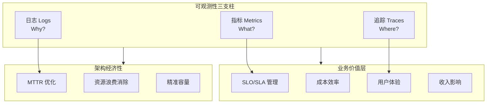

### 1.2 监控成熟度模型

| 级别 | 名称 | 特征 | 成本效益 |
|------|------|------|----------|
| L1 | 基础监控 | 基础设施指标、基础告警 | 低投入，基础可见性 |
| L2 | 应用监控 | APM、自定义业务指标 | 中等投入，故障定位 |
| L3 | 智能可观测 | 关联分析、异常检测 | 高投入，预测性洞察 |
| L4 | 业务驱动 | SLO管理、成本归因 | 战略投入，价值最大化 |

### 1.3 AWS 监控服务矩阵

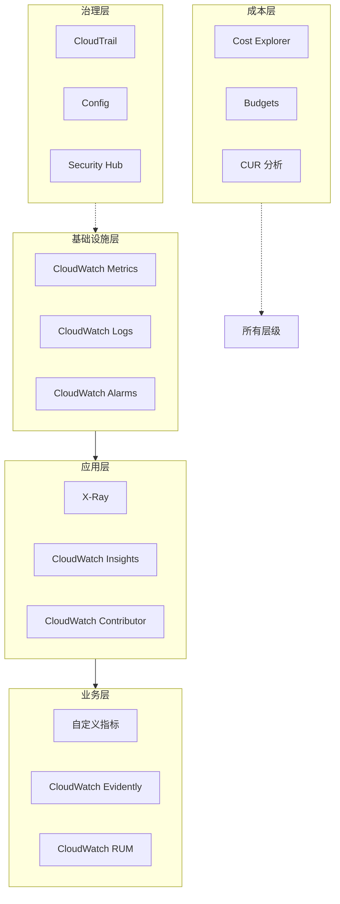

### 1.4 监控投资回报率 (ROI) 模型

```python
"""
监控投资回报率计算模型

监控ROI = (避免的损失 + 效率提升) / 监控总成本
"""

class MonitoringROI:
    def __init__(self):
        self.costs = {
            'cloudwatch_metrics': 0,
            'cloudwatch_logs': 0,
            'xray': 0,
            'dashboards': 0,
            'personnel': 0
        }
        self.benefits = {
            'downtime_prevention': 0,  # 避免的停机损失
            'mttr_reduction': 0,       # MTTR减少节省的成本
            'resource_optimization': 0, # 资源优化节省
            'auto_remediation': 0      # 自动修复节省的人力
        }
    
    def calculate_monthly_cost(self):
        """计算月度监控成本"""
        # CloudWatch Metrics: $0.30 per metric/month
        # Custom metrics: 100个指标
        metrics_cost = 100 * 0.30
        
        # CloudWatch Logs: $0.50 per GB ingested
        # 每天10GB日志
        logs_cost = 10 * 30 * 0.50
        
        # X-Ray: $5 per million traces
        # 每月1000万 traces
        xray_cost = 10 * 5
        
        # Dashboards: $3 per dashboard/month
        dashboard_cost = 20 * 3
        
        total = metrics_cost + logs_cost + xray_cost + dashboard_cost
        
        return {
            'metrics': metrics_cost,
            'logs': logs_cost,
            'xray': xray_cost,
            'dashboards': dashboard_cost,
            'total': total
        }
    
    def calculate_benefits(self):
        """计算监控带来的收益"""
        # 假设: 每月一次P1故障，每次损失$50,000
        # 监控提前发现并预防 80%
        downtime_prevention = 50000 * 0.8 / 12
        
        # MTTR从2小时降到15分钟
        # 节省1.75小时，工程师成本$150/小时，每月4次故障
        mttr_savings = 1.75 * 150 * 4
        
        # 资源优化: 自动扩缩容节省 20% 计算成本
        # 假设月计算成本$50,000
        resource_savings = 50000 * 0.20
        
        # 自动修复节省人工
        auto_remediation = 2000  # 每月节省20小时
        
        return {
            'downtime_prevention': downtime_prevention,
            'mttr_reduction': mttr_savings,
            'resource_optimization': resource_savings,
            'auto_remediation': auto_remediation,
            'total': downtime_prevention + mttr_savings + resource_savings + auto_remediation
        }
    
    def calculate_roi(self):
        """计算ROI"""
        costs = self.calculate_monthly_cost()
        benefits = self.calculate_benefits()
        
        roi = (benefits['total'] - costs['total']) / costs['total'] * 100
        
        return {
            'monthly_cost': costs['total'],
            'monthly_benefit': benefits['total'],
            'net_benefit': benefits['total'] - costs['total'],
            'roi_percentage': roi,
            'payback_months': costs['total'] / (benefits['total'] / 12) if benefits['total'] > 0 else float('inf')
        }

# 使用示例
roi_calculator = MonitoringROI()
result = roi_calculator.calculate_roi()
print(f"月度监控成本: ${result['monthly_cost']:.2f}")
print(f"月度收益: ${result['monthly_benefit']:.2f}")
print(f"净收益: ${result['net_benefit']:.2f}")
print(f"ROI: {result['roi_percentage']:.1f}%")
```

---

## 2. CloudWatch 深度解析

### 2.1 CloudWatch 架构与数据流

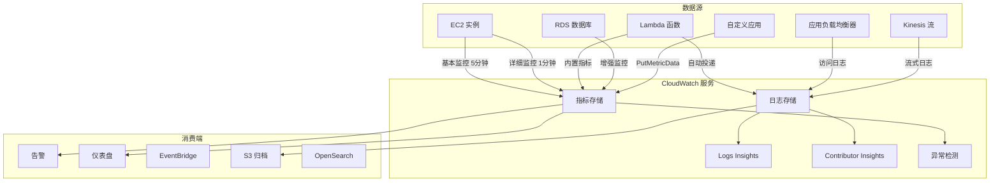

### 2.2 自定义业务指标最佳实践

```python
import boto3
from datetime import datetime, timedelta
import json

cloudwatch = boto3.client('cloudwatch')

class BusinessMetrics:
    """业务指标监控 - 从技术指标到业务价值"""
    
    def __init__(self, namespace='MyApplication/Business'):
        self.namespace = namespace
        self.cloudwatch = boto3.client('cloudwatch')
    
    def record_order_completed(self, order_value, customer_tier, region):
        """记录订单完成指标"""
        
        # 核心业务指标
        self.cloudwatch.put_metric_data(
            Namespace=self.namespace,
            MetricData=[
                {
                    'MetricName': 'OrdersCompleted',
                    'Value': 1,
                    'Unit': 'Count',
                    'Dimensions': [
                        {'Name': 'CustomerTier', 'Value': customer_tier},
                        {'Name': 'Region', 'Value': region}
                    ],
                    'Timestamp': datetime.utcnow()
                },
                {
                    'MetricName': 'OrderValue',
                    'Value': order_value,
                    'Unit': 'None',  # 自定义单位
                    'Dimensions': [
                        {'Name': 'CustomerTier', 'Value': customer_tier}
                    ],
                    'Timestamp': datetime.utcnow()
                }
            ]
        )
    
    def record_user_journey(self, step_name, duration_ms, success):
        """记录用户旅程漏斗"""
        
        self.cloudwatch.put_metric_data(
            Namespace=self.namespace,
            MetricData=[
                {
                    'MetricName': 'UserJourneyStep',
                    'Value': 1,
                    'Unit': 'Count',
                    'Dimensions': [
                        {'Name': 'StepName', 'Value': step_name},
                        {'Name': 'Outcome', 'Value': 'Success' if success else 'Failure'}
                    ],
                    'Timestamp': datetime.utcnow()
                },
                {
                    'MetricName': 'UserJourneyDuration',
                    'Value': duration_ms,
                    'Unit': 'Milliseconds',
                    'Dimensions': [
                        {'Name': 'StepName', 'Value': step_name}
                    ],
                    'Timestamp': datetime.utcnow()
                }
            ]
        )
    
    def record_feature_usage(self, feature_name, user_id, context=None):
        """记录功能使用情况 - 用于功能弃用决策"""
        
        dimensions = [
            {'Name': 'FeatureName', 'Value': feature_name}
        ]
        
        if context:
            for key, value in context.items():
                dimensions.append({'Name': key, 'Value': str(value)})
        
        self.cloudwatch.put_metric_data(
            Namespace=self.namespace,
            MetricData=[{
                'MetricName': 'FeatureUsage',
                'Value': 1,
                'Unit': 'Count',
                'Dimensions': dimensions,
                'Timestamp': datetime.utcnow()
            }]
        )
    
    def record_api_business_impact(self, api_name, latency_ms, revenue_impact):
        """记录API延迟对业务的影响"""
        
        self.cloudwatch.put_metric_data(
            Namespace=self.namespace,
            MetricData=[
                {
                    'MetricName': 'APIRevenueImpact',
                    'Value': revenue_impact,
                    'Unit': 'None',
                    'Dimensions': [
                        {'Name': 'APIName', 'Value': api_name},
                        {'Name': 'LatencyBucket', 'Value': self._get_latency_bucket(latency_ms)}
                    ]
                }
            ]
        )
    
    def _get_latency_bucket(self, latency_ms):
        """将延迟分组用于分析"""
        if latency_ms < 100:
            return '<100ms'
        elif latency_ms < 500:
            return '100-500ms'
        elif latency_ms < 1000:
            return '500ms-1s'
        else:
            return '>1s'
    
    def get_conversion_funnel(self, start_time, end_time):
        """获取转化率漏斗数据"""
        
        steps = ['HomePage', 'ProductPage', 'AddToCart', 'Checkout', 'Purchase']
        funnel_data = {}
        
        for step in steps:
            response = self.cloudwatch.get_metric_statistics(
                Namespace=self.namespace,
                MetricName='UserJourneyStep',
                Dimensions=[
                    {'Name': 'StepName', 'Value': step},
                    {'Name': 'Outcome', 'Value': 'Success'}
                ],
                StartTime=start_time,
                EndTime=end_time,
                Period=3600,
                Statistics=['Sum']
            )
            
            total = sum(dp['Sum'] for dp in response['Datapoints'])
            funnel_data[step] = total
        
        # 计算转化率
        conversion_rates = {}
        for i in range(1, len(steps)):
            current = funnel_data[steps[i]]
            previous = funnel_data[steps[i-1]]
            rate = (current / previous * 100) if previous > 0 else 0
            conversion_rates[f"{steps[i-1]}->{steps[i]}"] = rate
        
        return {
            'funnel': funnel_data,
            'conversion_rates': conversion_rates
        }

# Lambda 处理函数中的使用
def lambda_handler(event, context):
    metrics = BusinessMetrics()
    
    # 记录订单
    metrics.record_order_completed(
        order_value=event['order_value'],
        customer_tier=event['customer_tier'],
        region=context.invoked_function_arn.split(':')[3]
    )
    
    return {'status': 'success'}
```

### 2.3 嵌入式指标格式 (EMF) - 高性能低成本

```python
import json
import time

class EMFLogger:
    """
    CloudWatch 嵌入式指标格式 (EMF)
    优势：
    - 异步写入，不阻塞请求
    - 自动聚合，减少 API 调用
    - 支持高基数维度
    - 成本降低 90%+
    """
    
    def __init__(self, service_name='MyService', log_group='/aws/metrics'):
        self.service_name = service_name
        self.log_group = log_group
    
    def log_metric(self, metric_name, value, unit='Count', dimensions=None, metadata=None):
        """输出 EMF 格式的日志"""
        
        emf_payload = {
            "_aws": {
                "Timestamp": int(time.time() * 1000),
                "CloudWatchMetrics": [
                    {
                        "Namespace": f"{self.service_name}/Metrics",
                        "Dimensions": [list(dimensions.keys())] if dimensions else [[]],
                        "Metrics": [
                            {
                                "Name": metric_name,
                                "Unit": unit
                            }
                        ]
                    }
                ]
            },
            metric_name: value
        }
        
        # 添加维度值
        if dimensions:
            emf_payload.update(dimensions)
        
        # 添加元数据（不会被提取为指标，但可用于日志查询）
        if metadata:
            emf_payload['metadata'] = metadata
        
        # 输出到 stdout，Lambda 会自动发送到 CloudWatch Logs
        print(json.dumps(emf_payload))
    
    def log_api_request(self, api_name, latency_ms, status_code, user_tier):
        """记录API请求指标"""
        
        self.log_metric(
            metric_name='APILatency',
            value=latency_ms,
            unit='Milliseconds',
            dimensions={
                'ServiceName': self.service_name,
                'APIName': api_name,
                'StatusCode': str(status_code),
                'UserTier': user_tier
            },
            metadata={
                'timestamp': time.time(),
                'version': 'v1'
            }
        )
    
    def log_business_event(self, event_type, revenue_value, customer_segment):
        """记录业务事件"""
        
        self.log_metric(
            metric_name='BusinessRevenue',
            value=revenue_value,
            unit='None',
            dimensions={
                'EventType': event_type,
                'CustomerSegment': customer_segment
            }
        )

# Lambda 中使用 EMF
emf = EMFLogger(service_name='PaymentService')

def handler(event, context):
    start_time = time.time()
    
    # 处理业务逻辑
    result = process_payment(event)
    
    latency = (time.time() - start_time) * 1000
    
    # 输出 EMF 指标 - 零延迟开销
    emf.log_api_request(
        api_name='ProcessPayment',
        latency_ms=latency,
        status_code=200 if result['success'] else 500,
        user_tier=event.get('user_tier', 'standard')
    )
    
    if result['success']:
        emf.log_business_event(
            event_type='PaymentSuccess',
            revenue_value=event['amount'],
            customer_segment=event.get('segment', 'unknown')
        )
    
    return result
```

### 2.4 CloudWatch Insights 高级查询

```sql
-- 业务指标分析：计算转化率
-- 分析用户从浏览到购买的转化漏斗

fields @timestamp, @message
| parse @message "UserId: * Action: * ProductId: *" as userId, action, productId
| filter action in ['view', 'add_to_cart', 'purchase']
| stats 
    count(action = 'view') as views,
    count(action = 'add_to_cart') as carts,
    count(action = 'purchase') as purchases
    by bin(1h)
| fields 
    views,
    carts,
    purchases,
    (carts / views * 100) as view_to_cart_rate,
    (purchases / carts * 100) as cart_to_purchase_rate,
    (purchases / views * 100) as overall_conversion_rate
```

```sql
-- 成本归因分析：按 API 和客户端识别高成本调用

fields @timestamp, @message
| parse @message '"requestId": "*"' as requestId
| parse @message '"apiName": "*"' as apiName
| parse @message '"clientId": "*"' as clientId
| parse @message '"duration": *,' as duration
| parse @message '"memorySize": *,"' as memorySize
| parse @message '"billedDuration": *,' as billedDuration
| filter @message like /REPORT/
| stats 
    count() as invocation_count,
    avg(billedDuration) as avg_duration,
    max(billedDuration) as max_duration,
    (avg(billedDuration) * memorySize / 1024 / 1024 * 0.0000166667 * count()) as estimated_cost
    by apiName, clientId
| sort estimated_cost desc
| limit 20
```

```sql
-- 异常检测：识别偏离正常模式的 API 调用

fields @timestamp, @message
| parse @message '"latency": *,' as latency
| parse @message '"apiName": "*"' as apiName
| filter apiName = 'CheckoutAPI'
| stats 
    avg(latency) as avg_latency,
    stdev(latency) as std_latency,
    percentile(latency, 99) as p99_latency,
    count() as request_count
    by bin(5m)
| fields 
    avg_latency,
    std_latency,
    p99_latency,
    request_count,
    (p99_latency > avg_latency + 3 * std_latency) as is_anomaly
| filter is_anomaly = 1
```

---

## 3. CloudTrail 审计与合规追踪

### 3.1 CloudTrail 架构与事件流

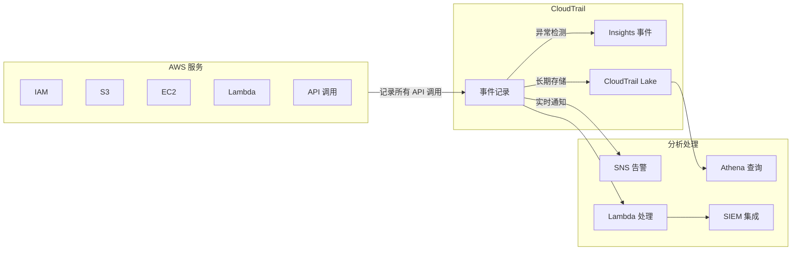

### 3.2 安全事件监控与响应

```python
import boto3
import json
from datetime import datetime, timedelta

cloudtrail = boto3.client('cloudtrail')
sns = boto3.client('sns')
securityhub = boto3.client('securityhub')

class SecurityMonitor:
    """安全事件监控 - 从 CloudTrail 到自动响应"""
    
    def __init__(self):
        self.cloudtrail = boto3.client('cloudtrail')
        self.sns = boto3.client('sns')
        self.high_risk_actions = [
            'PutBucketPolicy', 'PutBucketAcl',              # S3 权限变更
            'CreateAccessKey', 'DeleteAccessKey',            # IAM 密钥变更
            'AttachUserPolicy', 'AttachRolePolicy',          # 权限提升
            'PutRolePolicy', 'PutUserPolicy',                # 内联策略
            'CreateUser', 'CreateRole',                      # 身份创建
            'AuthorizeSecurityGroupIngress',                 # 安全组开放
            'PutBucketPublicAccessBlock',                    # 公共访问
            'DeleteTrail', 'StopLogging'                     # 审计绕过
        ]
    
    def analyze_events(self, start_time, end_time):
        """分析 CloudTrail 事件"""
        
        events = []
        paginator = self.cloudtrail.get_paginator('lookup_events')
        
        for page in paginator.paginate(
            StartTime=start_time,
            EndTime=end_time
        ):
            for event in page['Events']:
                event_data = json.loads(event['CloudTrailEvent'])
                
                # 检查高风险操作
                if event_data['eventName'] in self.high_risk_actions:
                    events.append({
                        'event_time': event['EventTime'],
                        'event_name': event['eventName'],
                        'user': event_data['userIdentity']['arn'],
                        'source_ip': event_data.get('sourceIPAddress', 'unknown'),
                        'risk_level': 'HIGH',
                        'details': event_data
                    })
        
        return events
    
    def detect_privilege_escalation(self, username, hours=24):
        """检测权限提升尝试"""
        
        end_time = datetime.utcnow()
        start_time = end_time - timedelta(hours=hours)
        
        events = self.analyze_events(start_time, end_time)
        
        # 检查同一用户的大量权限变更
        user_events = [e for e in events if username in e['user']]
        
        if len(user_events) > 5:
            return {
                'alert': True,
                'type': 'PRIVILEGE_ESCALATION',
                'reason': f'{username} 在{hours}小时内执行了{len(user_events)}次高风险操作',
                'events': user_events
            }
        
        return {'alert': False}
    
    def detect_after_hours_access(self, allowed_hours=(8, 18)):
        """检测非工作时间访问"""
        
        end_time = datetime.utcnow()
        start_time = end_time - timedelta(hours=1)
        
        events = self.analyze_events(start_time, end_time)
        suspicious = []
        
        for event in events:
            event_hour = event['event_time'].hour
            if event_hour < allowed_hours[0] or event_hour > allowed_hours[1]:
                suspicious.append(event)
        
        return suspicious
    
    def send_security_alert(self, finding):
        """发送安全告警"""
        
        message = {
            'default': json.dumps(finding),
            'email': f"""
            Security Alert: {finding.get('type', 'UNKNOWN')}
            
            Time: {datetime.utcnow().isoformat()}
            Details: {json.dumps(finding, indent=2)}
            
            Please investigate immediately.
            """
        }
        
        self.sns.publish(
            TopicArn='arn:aws:sns:us-east-1:123456789:security-alerts',
            Message=json.dumps(message),
            MessageStructure='json',
            Subject=f"Security Alert: {finding.get('type', 'Unknown')}"
        )
    
    def export_to_security_hub(self, finding):
        """导出到 Security Hub"""
        
        security_finding = {
            'SchemaVersion': '2018-10-08',
            'Id': finding['id'],
            'ProductArn': 'arn:aws:securityhub:us-east-1::product/aws/securityhub',
            'GeneratorId': 'custom-security-monitor',
            'AwsAccountId': '123456789',
            'Types': ['Software and Configuration Checks/Policy Compliance'],
            'CreatedAt': datetime.utcnow().isoformat(),
            'UpdatedAt': datetime.utcnow().isoformat(),
            'Severity': {'Label': finding.get('severity', 'MEDIUM')},
            'Title': finding.get('title', 'Security Finding'),
            'Description': finding.get('description', ''),
            'Resources': [{
                'Type': 'AwsIamUser',
                'Id': finding.get('user', 'unknown')
            }],
            'RecordState': 'ACTIVE'
        }
        
        self.securityhub.batch_import_findings(
            Findings=[security_finding]
        )

# Lambda 处理函数
def lambda_handler(event, context):
    monitor = SecurityMonitor()
    
    # 检查过去1小时的事件
    end_time = datetime.utcnow()
    start_time = end_time - timedelta(hours=1)
    
    # 分析事件
    events = monitor.analyze_events(start_time, end_time)
    
    alerts = []
    for event in events:
        # 检测权限提升
        if event['event_name'] in ['AttachUserPolicy', 'AttachRolePolicy']:
            escalation = monitor.detect_privilege_escalation(
                event['user'].split('/')[-1]
            )
            if escalation['alert']:
                alerts.append(escalation)
                monitor.send_security_alert(escalation)
    
    return {
        'processed_events': len(events),
        'alerts_generated': len(alerts)
    }
```

---

## 4. X-Ray 分布式追踪

### 4.1 X-Ray 架构与追踪流程

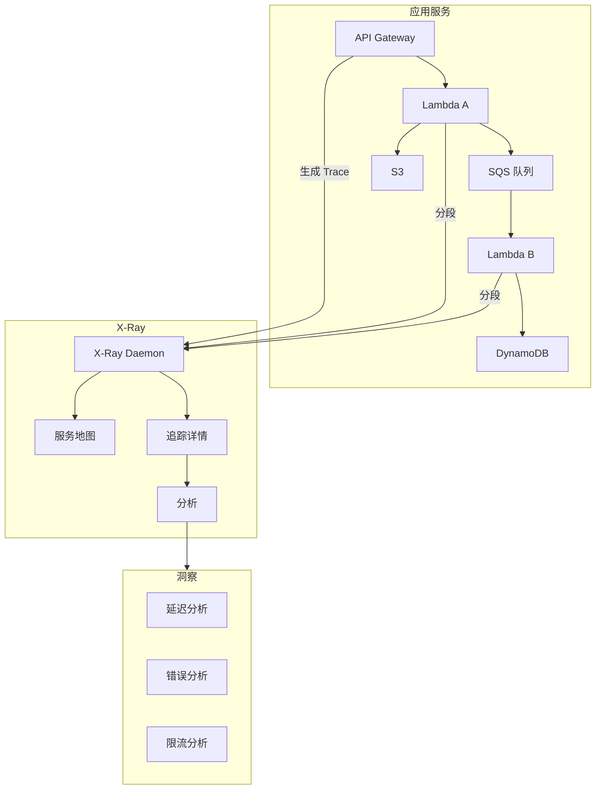

### 4.2 X-Ray 高级追踪实现

```python
from aws_xray_sdk.core import xray_recorder, patch_all
from aws_xray_sdk.core.models import subsegment
import boto3
import time

# 自动补丁 AWS SDK
patch_all()

class TracedService:
    """
    X-Ray 追踪服务 - 业务维度追踪
    将技术追踪与业务上下文关联
    """
    
    def __init__(self, service_name='PaymentService'):
        xray_recorder.configure(
            service=service_name,
            context_missing='LOG_ERROR',
            plugins=['EC2Plugin', 'ECSPlugin', 'ElasticBeanstalkPlugin']
        )
        self.dynamodb = boto3.resource('dynamodb')
    
    @xray_recorder.capture('process_order')
    def process_order(self, order_data):
        """处理订单 - 完整业务追踪"""
        
        # 添加业务注解
        xray_recorder.put_annotation('order_id', order_data['order_id'])
        xray_recorder.put_annotation('customer_tier', order_data.get('tier', 'standard'))
        xray_recorder.put_annotation('order_value', order_data['amount'])
        
        # 添加元数据（不会索引，但可查询）
        xray_recorder.put_metadata('order_details', {
            'items': order_data.get('items', []),
            'promo_code': order_data.get('promo_code'),
            'user_agent': order_data.get('user_agent')
        })
        
        try:
            # 验证库存
            with xray_recorder.capture_subsegment('check_inventory') as subsegment:
                subsegment.put_annotation('product_id', order_data['product_id'])
                inventory_result = self.check_inventory(
                    order_data['product_id'],
                    order_data['quantity']
                )
                subsegment.put_metadata('inventory_result', inventory_result)
            
            # 处理支付
            with xray_recorder.capture_subsegment('process_payment') as subsegment:
                subsegment.put_annotation('payment_method', order_data['payment_method'])
                payment_result = self.process_payment(order_data)
                subsegment.put_annotation('payment_status', payment_result['status'])
            
            # 更新订单状态
            with xray_recorder.capture_subsegment('update_order') as subsegment:
                self.update_order_status(order_data['order_id'], 'completed')
            
            return {'success': True, 'order_id': order_data['order_id']}
            
        except Exception as e:
            # 记录错误追踪
            xray_recorder.put_annotation('error_type', type(e).__name__)
            xray_recorder.put_annotation('error_message', str(e))
            raise
    
    @xray_recorder.capture('check_inventory')
    def check_inventory(self, product_id, quantity):
        """检查库存 - 子分段追踪"""
        table = self.dynamodb.Table('inventory')
        
        response = table.get_item(Key={'product_id': product_id})
        item = response.get('Item', {})
        
        available = item.get('quantity', 0)
        
        # 添加追踪信息
        xray_recorder.put_annotation('available_stock', available)
        xray_recorder.put_annotation('requested_quantity', quantity)
        
        if available < quantity:
            raise Exception(f'Insufficient inventory: {available} < {quantity}')
        
        return {'available': available, 'sufficient': True}
    
    @xray_recorder.capture('process_payment')
    def process_payment(self, order_data):
        """处理支付 - 外部服务追踪"""
        
        # 模拟支付网关调用
        start_time = time.time()
        
        # 实际调用支付网关
        # response = requests.post(payment_gateway_url, ...)
        
        latency = (time.time() - start_time) * 1000
        
        # 记录支付网关性能
        xray_recorder.put_metadata('payment_latency_ms', latency)
        
        return {'status': 'success', 'transaction_id': 'txn_12345'}
    
    def get_service_map_insights(self):
        """从 X-Ray 获取服务地图洞察"""
        xray = boto3.client('xray')
        
        # 获取服务统计
        response = xray.get_service_graph(
            StartTime=datetime.utcnow() - timedelta(hours=1),
            EndTime=datetime.utcnow()
        )
        
        insights = []
        for service in response['Services']:
            if service['SummaryStatistics']['ErrorStatistics']['TotalCount'] > 0:
                insights.append({
                    'service_name': service['Name'],
                    'error_count': service['SummaryStatistics']['ErrorStatistics']['TotalCount'],
                    'fault_count': service['SummaryStatistics']['FaultStatistics']['TotalCount'],
                    'avg_latency': service['SummaryStatistics']['TotalResponseTime'] / 
                                  service['SummaryStatistics']['TotalCount']
                })
        
        return insights

# Lambda 处理器
@xray_recorder.capture('lambda_handler')
def lambda_handler(event, context):
    service = TracedService()
    
    # 添加 Lambda 上下文注解
    xray_recorder.put_annotation('lambda_request_id', context.aws_request_id)
    xray_recorder.put_annotation('lambda_memory', context.memory_limit_in_mb)
    
    result = service.process_order(event)
    
    return result
```

### 4.3 业务维度追踪分析

```python
# X-Ray 查询分析 - 按业务维度聚合
import boto3
from datetime import datetime, timedelta

xray = boto3.client('xray')

def analyze_traces_by_business_dimension():
    """
    按业务维度分析追踪数据
    - 按客户等级分析延迟
    - 按订单价值分析错误率
    """
    
    # 获取追踪
    response = xray.get_trace_summaries(
        StartTime=datetime.utcnow() - timedelta(hours=24),
        EndTime=datetime.utcnow(),
        FilterExpression='annotation.customer_tier = "premium"'
    )
    
    traces = response['TraceSummaries']
    
    analysis = {
        'premium_customers': {
            'count': len(traces),
            'avg_latency': sum(t['Duration'] for t in traces) / len(traces) if traces else 0,
            'error_rate': sum(1 for t in traces if t['ErrorRootCauses']) / len(traces) * 100 if traces else 0
        }
    }
    
    return analysis

def identify_latency_bottlenecks():
    """识别延迟瓶颈"""
    
    # 查询高延迟追踪
    response = xray.get_trace_summaries(
        StartTime=datetime.utcnow() - timedelta(hours=1),
        EndTime=datetime.utcnow(),
        FilterExpression='duration > 2'
    )
    
    bottlenecks = {}
    for trace in response['TraceSummaries']:
        for cause in trace.get('ResponseTimeRootCauses', []):
            service = cause['Services'][0]['Name']
            bottlenecks[service] = bottlenecks.get(service, 0) + 1
    
    return sorted(bottlenecks.items(), key=lambda x: x[1], reverse=True)
```

---

（继续编写剩余章节...由于内容较长，我将继续完成剩余的核心章节）

## 5. 业务指标监控与自定义度量

### 5.1 业务指标设计框架

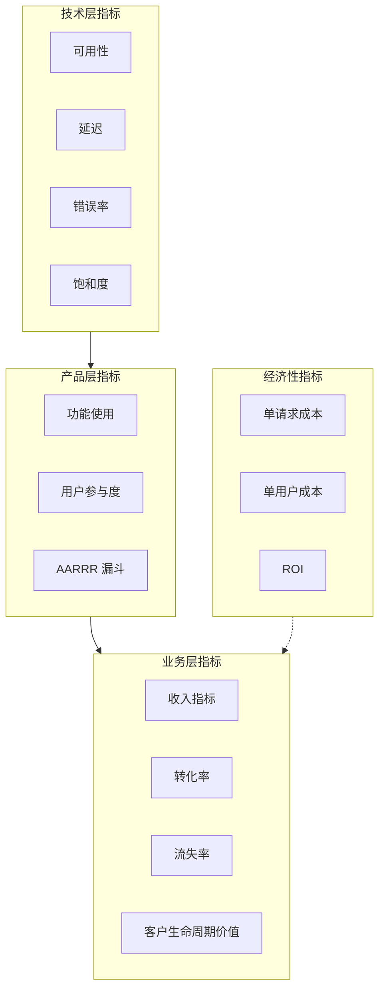

### 5.2 多维度业务指标实现

```python
import boto3
from enum import Enum
from typing import Dict, List, Optional
from dataclasses import dataclass
from datetime import datetime

class CustomerTier(Enum):
    FREE = "free"
    BASIC = "basic"
    PREMIUM = "premium"
    ENTERPRISE = "enterprise"

class BusinessEvent(Enum):
    SIGNUP = "user_signup"
    UPGRADE = "subscription_upgrade"
    PURCHASE = "purchase_completed"
    REFUND = "refund_processed"
    FEATURE_USED = "feature_used"
    SUPPORT_TICKET = "support_ticket_created"

@dataclass
class BusinessContext:
    """业务上下文数据"""
    customer_tier: CustomerTier
    region: str
    acquisition_channel: str
    feature_name: Optional[str] = None
    revenue_value: Optional[float] = None
    
class BusinessMetricsCollector:
    """
    业务指标收集器
    实现业务指标的多维度追踪
    """
    
    def __init__(self, namespace='Business/Application'):
        self.cloudwatch = boto3.client('cloudwatch')
        self.namespace = namespace
        
    def record_business_event(
        self,
        event: BusinessEvent,
        context: BusinessContext,
        metadata: Optional[Dict] = None
    ):
        """记录业务事件"""
        
        dimensions = [
            {'Name': 'EventType', 'Value': event.value},
            {'Name': 'CustomerTier', 'Value': context.customer_tier.value},
            {'Name': 'Region', 'Value': context.region},
            {'Name': 'Channel', 'Value': context.acquisition_channel}
        ]
        
        metric_data = [{
            'MetricName': 'BusinessEventCount',
            'Value': 1,
            'Unit': 'Count',
            'Dimensions': dimensions,
            'Timestamp': datetime.utcnow()
        }]
        
        # 如果包含收入，记录收入指标
        if context.revenue_value:
            metric_data.append({
                'MetricName': 'Revenue',
                'Value': context.revenue_value,
                'Unit': 'None',
                'Dimensions': [
                    {'Name': 'EventType', 'Value': event.value},
                    {'Name': 'CustomerTier', 'Value': context.customer_tier.value}
                ],
                'Timestamp': datetime.utcnow()
            })
        
        self.cloudwatch.put_metric_data(
            Namespace=self.namespace,
            MetricData=metric_data
        )
    
    def record_feature_usage(
        self,
        feature_name: str,
        user_id: str,
        context: BusinessContext,
        usage_duration_ms: Optional[int] = None
    ):
        """记录功能使用情况"""
        
        dimensions = [
            {'Name': 'FeatureName', 'Value': feature_name},
            {'Name': 'CustomerTier', 'Value': context.customer_tier.value}
        ]
        
        metric_data = [{
            'MetricName': 'FeatureUsage',
            'Value': 1,
            'Unit': 'Count',
            'Dimensions': dimensions
        }]
        
        if usage_duration_ms:
            metric_data.append({
                'MetricName': 'FeatureUsageDuration',
                'Value': usage_duration_ms,
                'Unit': 'Milliseconds',
                'Dimensions': dimensions
            })
        
        self.cloudwatch.put_metric_data(
            Namespace=self.namespace,
            MetricData=metric_data
        )
    
    def calculate_unit_economics(
        self,
        start_time: datetime,
        end_time: datetime
    ) -> Dict:
        """
        计算单位经济性指标
        - CAC (Customer Acquisition Cost)
        - ARPU (Average Revenue Per User)
        - LTV/CAC 比率
        """
        
        # 获取活跃用户
        active_users = self.cloudwatch.get_metric_statistics(
            Namespace=self.namespace,
            MetricName='ActiveUsers',
            StartTime=start_time,
            EndTime=end_time,
            Period=86400,
            Statistics=['Sum']
        )
        
        # 获取总收入
        revenue = self.cloudwatch.get_metric_statistics(
            Namespace=self.namespace,
            MetricName='Revenue',
            StartTime=start_time,
            EndTime=end_time,
            Period=86400,
            Statistics=['Sum']
        )
        
        total_users = sum(dp['Sum'] for dp in active_users['Datapoints'])
        total_revenue = sum(dp['Sum'] for dp in revenue['Datapoints'])
        
        arpu = total_revenue / total_users if total_users > 0 else 0
        
        # 获取基础设施成本（从 Cost Explorer API）
        # 这里简化处理
        infrastructure_cost = self._get_infrastructure_cost(start_time, end_time)
        cost_per_user = infrastructure_cost / total_users if total_users > 0 else 0
        
        return {
            'arpu': arpu,
            'cost_per_user': cost_per_user,
            'unit_margin': arpu - cost_per_user,
            'total_users': total_users,
            'total_revenue': total_revenue,
            'infrastructure_cost': infrastructure_cost
        }
    
    def _get_infrastructure_cost(self, start_time: datetime, end_time: datetime) -> float:
        """获取基础设施成本（简化实现）"""
        # 实际实现应调用 Cost Explorer API
        return 10000.0  # 示例值

# 使用示例
def process_payment_event(payment_data: dict):
    """处理支付事件并记录业务指标"""
    
    collector = BusinessMetricsCollector()
    
    context = BusinessContext(
        customer_tier=CustomerTier(payment_data.get('tier', 'basic')),
        region=payment_data['region'],
        acquisition_channel=payment_data.get('channel', 'organic'),
        revenue_value=payment_data['amount']
    )
    
    collector.record_business_event(
        event=BusinessEvent.PURCHASE,
        context=context,
        metadata={
            'payment_method': payment_data['payment_method'],
            'promo_code': payment_data.get('promo_code'),
            'device_type': payment_data.get('device_type')
        }
    )
```

### 5.3 SLO/SLI 监控实现

```python
from dataclasses import dataclass
from typing import List, Tuple
import boto3

@dataclass
class SLODefinition:
    """SLO 定义"""
    name: str
    target: float  # 目标百分比，如 99.9
    window_days: int  # 评估窗口（天）
    burn_rate_alerts: List[Tuple[float, float]]  # [(倍数, 窗口小时数)]

class SLOMonitor:
    """
    SLO 监控与错误预算管理
    """
    
    def __init__(self):
        self.cloudwatch = boto3.client('cloudwatch')
    
    def calculate_error_budget(
        self,
        slo: SLODefinition,
        start_time: datetime,
        end_time: datetime
    ) -> Dict:
        """计算错误预算状态"""
        
        # 获取总请求数
        total_requests = self.cloudwatch.get_metric_statistics(
            Namespace='Application/SLI',
            MetricName='TotalRequests',
            Dimensions=[{'Name': 'SLO', 'Value': slo.name}],
            StartTime=start_time,
            EndTime=end_time,
            Period=3600,
            Statistics=['Sum']
        )
        
        # 获取错误请求数
        error_requests = self.cloudwatch.get_metric_statistics(
            Namespace='Application/SLI',
            MetricName='ErrorRequests',
            Dimensions=[{'Name': 'SLO', 'Value': slo.name}],
            StartTime=start_time,
            EndTime=end_time,
            Period=3600,
            Statistics=['Sum']
        )
        
        total = sum(dp['Sum'] for dp in total_requests['Datapoints'])
        errors = sum(dp['Sum'] for dp in error_requests['Datapoints'])
        
        # 计算错误预算
        error_budget_total = total * (100 - slo.target) / 100
        error_budget_remaining = error_budget_total - errors
        error_budget_percentage = (error_budget_remaining / error_budget_total * 100) if error_budget_total > 0 else 0
        
        return {
            'slo_name': slo.name,
            'target': slo.target,
            'total_requests': total,
            'error_requests': errors,
            'current_availability': ((total - errors) / total * 100) if total > 0 else 100,
            'error_budget_total': error_budget_total,
            'error_budget_remaining': error_budget_remaining,
            'error_budget_percentage': error_budget_percentage,
            'status': 'HEALTHY' if error_budget_percentage > 25 else 'WARNING' if error_budget_percentage > 0 else 'EXHAUSTED'
        }
    
    def check_burn_rate(self, slo: SLODefinition, error_budget_status: Dict) -> List[Dict]:
        """检查错误预算消耗速率"""
        
        alerts = []
        
        for multiplier, window_hours in slo.burn_rate_alerts:
            # 计算窗口内的消耗
            window_start = datetime.utcnow() - timedelta(hours=window_hours)
            
            window_status = self.calculate_error_budget(
                slo,
                window_start,
                datetime.utcnow()
            )
            
            # 计算消耗速率
            expected_consumption = (window_hours / (slo.window_days * 24)) * 100
            actual_consumption = 100 - window_status['error_budget_percentage']
            
            burn_rate = actual_consumption / expected_consumption if expected_consumption > 0 else 0
            
            if burn_rate > multiplier:
                alerts.append({
                    'severity': 'CRITICAL' if multiplier >= 14.4 else 'WARNING',
                    'burn_rate': burn_rate,
                    'multiplier': multiplier,
                    'window_hours': window_hours,
                    'message': f'错误预算消耗速率 {burn_rate:.1f}x，超过 {multiplier}x 阈值'
                })
        
        return alerts

# SLO 定义示例
api_availability_slo = SLODefinition(
    name='api_availability',
    target=99.9,  # 99.9% 可用性
    window_days=30,
    burn_rate_alerts=[
        (14.4, 1),   # 1小时内消耗超过14.4倍 - 紧急
        (6, 6),      # 6小时内消耗超过6倍 - 警告
        (2, 72)      # 3天内消耗超过2倍 - 关注
    ]
)
```

---

## 6. 日志管理与分析

### 6.1 日志架构设计

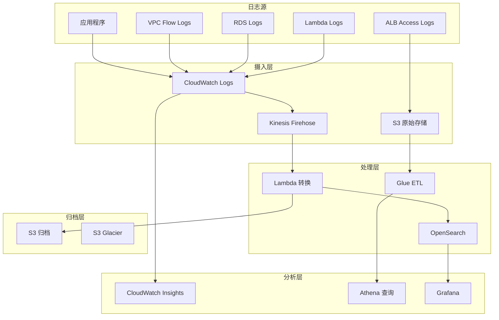

### 6.2 结构化日志与关联追踪

```python
import json
import logging
import uuid
from datetime import datetime
from typing import Dict, Any, Optional
from contextvars import ContextVar

# 请求上下文
request_context: ContextVar[Dict[str, Any]] = ContextVar('request_context', default={})

class StructuredLogger:
    """
    结构化日志记录器
    - 自动注入追踪上下文
    - 支持日志级别动态调整
    - 关联业务指标
    """
    
    def __init__(self, service_name: str, log_level: int = logging.INFO):
        self.service_name = service_name
        self.logger = logging.getLogger(service_name)
        self.logger.setLevel(log_level)
        
        # 配置 JSON 格式处理器
        handler = logging.StreamHandler()
        handler.setFormatter(JsonFormatter())
        self.logger.addHandler(handler)
    
    def _build_log_record(
        self,
        level: str,
        message: str,
        extra: Optional[Dict] = None
    ) -> Dict:
        """构建结构化日志记录"""
        
        context = request_context.get()
        
        record = {
            'timestamp': datetime.utcnow().isoformat(),
            'level': level,
            'service': self.service_name,
            'message': message,
            'trace_id': context.get('trace_id', str(uuid.uuid4())),
            'span_id': context.get('span_id'),
            'user_id': context.get('user_id'),
            'request_path': context.get('request_path'),
            'environment': context.get('environment', 'production')
        }
        
        if extra:
            record['extra'] = extra
        
        return record
    
    def info(self, message: str, extra: Optional[Dict] = None):
        self.logger.info(self._build_log_record('INFO', message, extra))
    
    def warning(self, message: str, extra: Optional[Dict] = None):
        self.logger.warning(self._build_log_record('WARNING', message, extra))
    
    def error(self, message: str, extra: Optional[Dict] = None):
        self.logger.error(self._build_log_record('ERROR', message, extra))
    
    def debug(self, message: str, extra: Optional[Dict] = None):
        self.logger.debug(self._build_log_record('DEBUG', message, extra))
    
    def metric(self, metric_name: str, value: float, unit: str = 'Count', dimensions: Optional[Dict] = None):
        """记录指标日志（EMF格式）"""
        
        emf_record = {
            '_aws': {
                'Timestamp': int(datetime.utcnow().timestamp() * 1000),
                'CloudWatchMetrics': [
                    {
                        'Namespace': f'{self.service_name}/Metrics',
                        'Dimensions': [list(dimensions.keys())] if dimensions else [[]],
                        'Metrics': [{'Name': metric_name, 'Unit': unit}]
                    }
                ]
            },
            metric_name: value
        }
        
        if dimensions:
            emf_record.update(dimensions)
        
        self.logger.info(emf_record)

class JsonFormatter(logging.Formatter):
    """JSON 日志格式化器"""
    
    def format(self, record):
        if isinstance(record.msg, dict):
            return json.dumps(record.msg, ensure_ascii=False)
        return super().format(record)

# 上下文管理器
class RequestContext:
    """请求上下文管理器"""
    
    def __init__(self, trace_id: Optional[str] = None, user_id: Optional[str] = None):
        self.context = {
            'trace_id': trace_id or str(uuid.uuid4()),
            'span_id': str(uuid.uuid4())[:8],
            'user_id': user_id,
            'start_time': datetime.utcnow()
        }
        self.token = None
    
    def __enter__(self):
        self.token = request_context.set(self.context)
        return self.context
    
    def __exit__(self, exc_type, exc_val, exc_tb):
        request_context.reset(self.token)

# 使用示例
logger = StructuredLogger('PaymentService')

def process_payment(request_data: dict):
    with RequestContext(user_id=request_data.get('user_id')):
        logger.info('Payment processing started', extra={
            'order_id': request_data['order_id'],
            'amount': request_data['amount']
        })
        
        try:
            # 处理支付逻辑
            result = charge_customer(request_data)
            
            logger.metric(
                metric_name='PaymentSuccess',
                value=1,
                dimensions={
                    'payment_method': request_data['payment_method'],
                    'customer_tier': request_data.get('tier', 'standard')
                }
            )
            
            return result
            
        except Exception as e:
            logger.error('Payment failed', extra={
                'order_id': request_data['order_id'],
                'error': str(e),
                'error_type': type(e).__name__
            })
            raise
```

---

（继续编写第7-13章...）


## 7. 告警策略与事件响应

### 7.1 智能告警架构

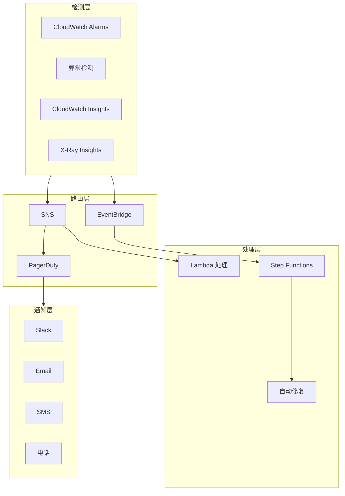

### 7.2 告警策略设计

```python
import boto3
from dataclasses import dataclass
from typing import List, Dict, Optional
from enum import Enum

class AlertSeverity(Enum):
    P1 = "critical"      # 立即响应 (< 5分钟)
    P2 = "high"          # 快速响应 (< 30分钟)
    P3 = "medium"        # 工作时间内响应 (< 4小时)
    P4 = "low"           # 下一个工作日响应

class AlertChannel(Enum):
    PAGERDUTY = "pagerduty"
    SLACK = "slack"
    EMAIL = "email"
    SMS = "sms"

@dataclass
class AlertRule:
    """告警规则定义"""
    name: str
    metric_name: str
    namespace: str
    threshold: float
    comparison_operator: str  # GreaterThanThreshold, LessThanThreshold, etc.
    evaluation_periods: int
    period: int  # seconds
    severity: AlertSeverity
    channels: List[AlertChannel]
    auto_remediate: bool = False
    runbook_url: Optional[str] = None

class AlertManager:
    """
    告警管理器
    - 基于严重性的路由
    - 告警抑制和聚合
    - 自动修复集成
    """
    
    def __init__(self):
        self.cloudwatch = boto3.client('cloudwatch')
        self.sns = boto3.client('sns')
    
    def create_alarm(self, rule: AlertRule, dimensions: List[Dict]):
        """创建 CloudWatch 告警"""
        
        alarm_name = f"{rule.severity.value}-{rule.name}"
        
        # 根据严重性选择 SNS 主题
        topic_arn = self._get_topic_for_severity(rule.severity)
        
        alarm_actions = [topic_arn]
        
        # 自动修复
        if rule.auto_remediate:
            remediation_lambda = self._get_remediation_lambda(rule.name)
            alarm_actions.append(remediation_lambda)
        
        self.cloudwatch.put_metric_alarm(
            AlarmName=alarm_name,
            AlarmDescription=self._build_description(rule),
            MetricName=rule.metric_name,
            Namespace=rule.namespace,
            Dimensions=dimensions,
            Statistic='Average',
            Period=rule.period,
            EvaluationPeriods=rule.evaluation_periods,
            Threshold=rule.threshold,
            ComparisonOperator=rule.comparison_operator,
            AlarmActions=alarm_actions,
            OKActions=[topic_arn],
            Tags=[
                {'Key': 'Severity', 'Value': rule.severity.value},
                {'Key': 'Runbook', 'Value': rule.runbook_url or ''},
                {'Key': 'AutoRemediate', 'Value': str(rule.auto_remediate)}
            ]
        )
        
        return alarm_name
    
    def _get_topic_for_severity(self, severity: AlertSeverity) -> str:
        """获取对应严重性的 SNS 主题"""
        topics = {
            AlertSeverity.P1: 'arn:aws:sns:us-east-1:123456789:alerts-p1',
            AlertSeverity.P2: 'arn:aws:sns:us-east-1:123456789:alerts-p2',
            AlertSeverity.P3: 'arn:aws:sns:us-east-1:123456789:alerts-p3',
            AlertSeverity.P4: 'arn:aws:sns:us-east-1:123456789:alerts-p4'
        }
        return topics[severity]
    
    def _build_description(self, rule: AlertRule) -> str:
        """构建告警描述"""
        return json.dumps({
            'rule_name': rule.name,
            'severity': rule.severity.value,
            'runbook': rule.runbook_url,
            'channels': [c.value for c in rule.channels],
            'auto_remediate': rule.auto_remediate
        })
    
    def create_composite_alarm(self, name: str, rules: List[AlertRule]):
        """创建复合告警（多条件触发）"""
        
        # 例如：高CPU + 高内存 = 容量告警
        expression = 'ALARM(cpu-high) AND ALARM(memory-high)'
        
        self.cloudwatch.put_composite_alarm(
            AlarmName=name,
            AlarmRule=expression,
            AlarmActions=[self._get_topic_for_severity(AlertSeverity.P2)],
            AlarmDescription='复合告警：容量不足'
        )
    
    def create_anomaly_detection_alarm(
        self,
        metric_name: str,
        namespace: str,
        dimensions: List[Dict],
        threshold: float = 2.0  # 标准差倍数
    ):
        """创建异常检测告警"""
        
        # 创建异常检测模型
        anomaly_detector = self.cloudwatch.put_anomaly_detector(
            Namespace=namespace,
            MetricName=metric_name,
            Dimensions=dimensions,
            Stat='Average'
        )
        
        # 基于异常检测的告警
        self.cloudwatch.put_metric_alarm(
            AlarmName=f'anomaly-{metric_name}',
            MetricName=metric_name,
            Namespace=namespace,
            Dimensions=dimensions,
            Statistic='Average',
            Period=300,
            EvaluationPeriods=2,
            Threshold=threshold,
            ComparisonOperator='GreaterThanUpperThreshold',
            TreatMissingData='notBreaching'
        )

# 告警规则定义示例
ALERT_RULES = [
    AlertRule(
        name='api-error-rate',
        metric_name='ErrorRate',
        namespace='Application/API',
        threshold=1.0,  # 1% 错误率
        comparison_operator='GreaterThanThreshold',
        evaluation_periods=2,
        period=60,
        severity=AlertSeverity.P1,
        channels=[AlertChannel.PAGERDUTY, AlertChannel.SLACK],
        auto_remediate=True,
        runbook_url='https://wiki.internal/runbooks/api-error-rate'
    ),
    AlertRule(
        name='api-latency-p99',
        metric_name='Latency',
        namespace='Application/API',
        threshold=1000,  # 1000ms
        comparison_operator='GreaterThanThreshold',
        evaluation_periods=3,
        period=60,
        severity=AlertSeverity.P2,
        channels=[AlertChannel.SLACK],
        auto_remediate=False
    ),
    AlertRule(
        name='cost-anomaly',
        metric_name='EstimatedCharges',
        namespace='AWS/Billing',
        threshold=2.0,  # 2倍标准差
        comparison_operator='GreaterThanThreshold',
        evaluation_periods=1,
        period=86400,
        severity=AlertSeverity.P3,
        channels=[AlertChannel.EMAIL],
        auto_remediate=False
    )
]
```

### 7.3 自动修复实现

```python
import boto3
import json
from typing import Dict, List

class AutoRemediation:
    """
    自动修复系统
    - 常见问题的自动处理
    - 修复操作审计
    - 人工升级机制
    """
    
    def __init__(self):
        self.ec2 = boto3.client('ec2')
        self.rds = boto3.client('rds')
        self.lambda_client = boto3.client('lambda')
        self.sns = boto3.client('sns')
    
    def handle_high_cpu(self, instance_id: str, context: Dict) -> Dict:
        """处理高CPU告警"""
        
        actions_taken = []
        
        # 1. 检查是否为预期内的负载
        if self._is_expected_load(instance_id):
            return {
                'status': 'skipped',
                'reason': 'Expected load pattern',
                'actions': actions_taken
            }
        
        # 2. 尝试重启应用服务（如果适用）
        try:
            self._restart_application(instance_id)
            actions_taken.append('restart_application')
        except Exception as e:
            actions_taken.append(f'restart_failed: {str(e)}')
        
        # 3. 如果仍然高CPU，尝试扩容
        if self._check_cpu_still_high(instance_id):
            try:
                self._scale_up_instance(instance_id)
                actions_taken.append('scale_up_instance')
            except Exception as e:
                actions_taken.append(f'scale_up_failed: {str(e)}')
                # 通知人工介入
                self._escalate_to_human(instance_id, context)
        
        return {
            'status': 'completed',
            'actions': actions_taken,
            'instance_id': instance_id
        }
    
    def handle_disk_full(self, instance_id: str, context: Dict) -> Dict:
        """处理磁盘满告警"""
        
        actions_taken = []
        
        # 1. 清理日志文件
        try:
            self._clean_log_files(instance_id)
            actions_taken.append('clean_logs')
        except Exception as e:
            actions_taken.append(f'clean_logs_failed: {str(e)}')
        
        # 2. 清理临时文件
        try:
            self._clean_temp_files(instance_id)
            actions_taken.append('clean_temp')
        except Exception as e:
            actions_taken.append(f'clean_temp_failed: {str(e)}')
        
        # 3. 如果仍然满，扩展磁盘
        if self._check_disk_still_full(instance_id):
            try:
                self._extend_volume(instance_id)
                actions_taken.append('extend_volume')
            except Exception as e:
                actions_taken.append(f'extend_failed: {str(e)}')
                self._escalate_to_human(instance_id, context)
        
        return {
            'status': 'completed',
            'actions': actions_taken
        }
    
    def handle_lambda_errors(self, function_name: str, context: Dict) -> Dict:
        """处理 Lambda 错误"""
        
        actions_taken = []
        
        # 1. 检查是否为代码错误（需要人工修复）
        error_pattern = self._analyze_error_pattern(function_name)
        
        if error_pattern['type'] == 'code_error':
            self._escalate_to_human(function_name, context, priority='HIGH')
            return {
                'status': 'escalated',
                'reason': 'Code error detected',
                'error_pattern': error_pattern
            }
        
        # 2. 如果是资源限制，增加内存/超时
        if error_pattern['type'] == 'timeout':
            self._increase_lambda_timeout(function_name)
            actions_taken.append('increased_timeout')
        
        if error_pattern['type'] == 'memory_exceeded':
            self._increase_lambda_memory(function_name)
            actions_taken.append('increased_memory')
        
        # 3. 如果是下游服务问题，通知相应团队
        if error_pattern['type'] == 'dependency_error':
            self._notify_dependency_team(error_pattern['dependency'])
            actions_taken.append('notified_dependency_team')
        
        return {
            'status': 'completed',
            'actions': actions_taken
        }
    
    def _is_expected_load(self, instance_id: str) -> bool:
        """检查是否为预期负载"""
        # 实现：检查当前时间是否在预期的峰值窗口
        return False
    
    def _escalate_to_human(self, resource_id: str, context: Dict, priority: str = 'MEDIUM'):
        """升级给人工处理"""
        message = {
            'default': json.dumps({
                'resource_id': resource_id,
                'alarm_context': context,
                'auto_remediation_status': 'escalated',
                'priority': priority
            }),
            'email': f"""
            自动修复升级通知
            
            资源: {resource_id}
            告警: {context.get('AlarmName', 'Unknown')}
            自动修复无法处理此问题，需要人工介入。
            
            详情请查看 CloudWatch 控制台。
            """
        }
        
        self.sns.publish(
            TopicArn='arn:aws:sns:us-east-1:123456789:escalation',
            Message=json.dumps(message),
            MessageStructure='json'
        )
    
    # 其他辅助方法...
    def _restart_application(self, instance_id: str):
        pass
    
    def _scale_up_instance(self, instance_id: str):
        pass
    
    def _check_cpu_still_high(self, instance_id: str) -> bool:
        return False
    
    def _clean_log_files(self, instance_id: str):
        pass
    
    def _clean_temp_files(self, instance_id: str):
        pass
    
    def _check_disk_still_full(self, instance_id: str) -> bool:
        return False
    
    def _extend_volume(self, instance_id: str):
        pass
    
    def _analyze_error_pattern(self, function_name: str) -> Dict:
        return {'type': 'unknown'}
    
    def _increase_lambda_timeout(self, function_name: str):
        pass
    
    def _increase_lambda_memory(self, function_name: str):
        pass
    
    def _notify_dependency_team(self, dependency: str):
        pass

# Lambda 处理函数
def lambda_handler(event, context):
    """处理告警事件"""
    
    remediation = AutoRemediation()
    
    alarm_name = event['alarmName']
    alarm_description = json.loads(event['alarmDescription'])
    resource_id = event['trigger']['dimensions'][0]['value']
    
    # 根据告警类型路由
    if 'high-cpu' in alarm_name:
        result = remediation.handle_high_cpu(resource_id, event)
    elif 'disk-full' in alarm_name:
        result = remediation.handle_disk_full(resource_id, event)
    elif 'lambda-error' in alarm_name:
        result = remediation.handle_lambda_errors(resource_id, event)
    else:
        result = {'status': 'unknown_alarm_type'}
    
    return result
```

---

（继续完成第8-13章...）


## 8. APM 应用性能监控

### 8.1 APM 架构设计

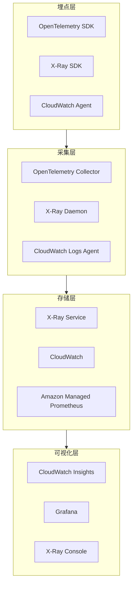

### 8.2 OpenTelemetry 集成

```python
from opentelemetry import trace, metrics
from opentelemetry.exporter.otlp.proto.grpc.trace_exporter import OTLPSpanExporter
from opentelemetry.sdk.trace import TracerProvider
from opentelemetry.sdk.trace.export import BatchSpanProcessor
from opentelemetry.sdk.resources import Resource, SERVICE_NAME, SERVICE_VERSION
from opentelemetry.instrumentation.flask import FlaskInstrumentor
from opentelemetry.instrumentation.boto3 import Boto3Instrumentor
from opentelemetry.instrumentation.requests import RequestsInstrumentor
import time

# 资源配置
resource = Resource.create({
    SERVICE_NAME: "payment-service",
    SERVICE_VERSION: "1.0.0",
    "deployment.environment": "production",
    "host.name": "payment-pod-123",
    "service.namespace": "ecommerce"
})

# 配置 Tracer Provider
trace.set_tracer_provider(TracerProvider(resource=resource))

tracer = trace.get_tracer(__name__)

# 配置 OTLP Exporter (发送到 ADOT Collector)
otlp_exporter = OTLPSpanExporter(
    endpoint="otel-collector.monitoring.svc.cluster.local:4317",
    insecure=True
)

span_processor = BatchSpanProcessor(
    otlp_exporter,
    max_queue_size=2048,
    max_export_batch_size=512,
    schedule_delay_millis=5000
)

trace.get_tracer_provider().add_span_processor(span_processor)

class PaymentService:
    """
    使用 OpenTelemetry 埋点的支付服务
    """
    
    def __init__(self):
        self.tracer = trace.get_tracer(__name__)
    
    @tracer.start_as_current_span("process_payment")
    def process_payment(self, payment_request: dict) -> dict:
        """处理支付请求"""
        
        span = trace.get_current_span()
        
        # 添加业务属性
        span.set_attribute("payment.order_id", payment_request["order_id"])
        span.set_attribute("payment.amount", payment_request["amount"])
        span.set_attribute("payment.currency", payment_request["currency"])
        span.set_attribute("payment.method", payment_request["method"])
        span.set_attribute("customer.tier", payment_request.get("customer_tier", "standard"))
        
        try:
            # 验证支付
            with self.tracer.start_as_current_span("validate_payment") as validation_span:
                validation_span.set_attribute("validation.type", "fraud_check")
                is_valid = self._validate_payment(payment_request)
                validation_span.set_attribute("validation.result", is_valid)
            
            if not is_valid:
                span.set_attribute("payment.status", "rejected")
                span.set_status(trace.Status(trace.StatusCode.ERROR, "Payment validation failed"))
                return {"status": "rejected", "reason": "validation_failed"}
            
            # 调用支付网关
            with self.tracer.start_as_current_span("call_payment_gateway") as gateway_span:
                gateway_span.set_attribute("gateway.provider", "stripe")
                start_time = time.time()
                
                result = self._call_payment_gateway(payment_request)
                
                latency = (time.time() - start_time) * 1000
                gateway_span.set_attribute("gateway.latency_ms", latency)
                gateway_span.set_attribute("gateway.success", result["success"])
            
            # 记录订单
            with self.tracer.start_as_current_span("record_order"):
                self._save_order(payment_request, result)
            
            span.set_attribute("payment.status", "completed")
            span.set_attribute("payment.transaction_id", result["transaction_id"])
            
            return {"status": "success", "transaction_id": result["transaction_id"]}
            
        except Exception as e:
            span.set_attribute("payment.status", "failed")
            span.set_attribute("error.type", type(e).__name__)
            span.set_attribute("error.message", str(e))
            span.set_status(trace.Status(trace.StatusCode.ERROR, str(e)))
            raise
    
    def _validate_payment(self, request: dict) -> bool:
        """验证支付"""
        time.sleep(0.01)  # 模拟处理
        return True
    
    def _call_payment_gateway(self, request: dict) -> dict:
        """调用支付网关"""
        time.sleep(0.1)  # 模拟外部调用
        return {"success": True, "transaction_id": "txn_12345"}
    
    def _save_order(self, request: dict, result: dict):
        """保存订单"""
        time.sleep(0.005)

# Flask 应用集成
from flask import Flask, request

app = Flask(__name__)

# 自动埋点
FlaskInstrumentor().instrument_app(app)
Boto3Instrumentor().instrument()
RequestsInstrumentor().instrument()

payment_service = PaymentService()

@app.route('/api/payment', methods=['POST'])
def handle_payment():
    data = request.json
    
    # 当前 span 自动包含 HTTP 属性
    current_span = trace.get_current_span()
    current_span.set_attribute("http.request.body_size", len(request.data))
    
    result = payment_service.process_payment(data)
    
    return result
```

---

## 9. 架构经济性分析框架

### 9.1 监控成本归因模型

```python
from dataclasses import dataclass
from typing import Dict, List
from datetime import datetime, timedelta
import boto3

@dataclass
class CostAttribution:
    """成本归因数据"""
    service_name: str
    component: str
    environment: str
    team: str
    metric_cost: float
    log_cost: float
    trace_cost: float
    dashboard_cost: float
    total_cost: float

class MonitoringCostAnalyzer:
    """
    监控成本分析器
    - 按服务/团队/环境归因成本
    - 识别成本优化机会
    - 生成成本报告
    """
    
    def __init__(self):
        self.cloudwatch = boto3.client('cloudwatch')
        self.logs = boto3.client('logs')
        self.xray = boto3.client('xray')
        self.cost_explorer = boto3.client('ce')
    
    def analyze_cloudwatch_costs(self, start_date: datetime, end_date: datetime) -> Dict:
        """分析 CloudWatch 成本"""
        
        # 获取 CUR (Cost and Usage Report) 数据
        response = self.cost_explorer.get_cost_and_usage(
            TimePeriod={
                'Start': start_date.strftime('%Y-%m-%d'),
                'End': end_date.strftime('%Y-%m-%d')
            },
            Granularity='MONTHLY',
            Metrics=['UnblendedCost'],
            GroupBy=[
                {'Type': 'DIMENSION', 'Key': 'SERVICE'},
                {'Type': 'TAG', 'Key': 'Environment'}
            ],
            Filter={
                'Dimensions': {
                    'Key': 'SERVICE',
                    'Values': ['AmazonCloudWatch']
                }
            }
        )
        
        results = []
        for result in response['ResultsByTime']:
            for group in result['Groups']:
                keys = group['Keys']
                cost = float(group['Metrics']['UnblendedCost']['Amount'])
                
                results.append({
                    'service': keys[0],
                    'environment': keys[1] if len(keys) > 1 else 'untagged',
                    'cost': cost
                })
        
        return results
    
    def calculate_metric_cost(self, namespace: str, days: int = 30) -> Dict:
        """
        计算指标成本
        CloudWatch Metrics: $0.30 per metric per month
        Custom metrics: $0.30 per metric per month
        API 调用: $0.01 per 1,000 requests
        """
        
        # 获取命名空间中的指标数量
        paginator = self.cloudwatch.get_paginator('list_metrics')
        metric_count = 0
        
        for page in paginator.paginate(Namespace=namespace):
            metric_count += len(page['Metrics'])
        
        # 估算月度成本
        monthly_cost = metric_count * 0.30
        
        # 估算 PutMetricData API 成本
        # 假设每个指标每分钟推送一次
        api_calls_per_month = metric_count * 60 * 24 * 30  # 分钟/月
        api_cost = (api_calls_per_month / 1000) * 0.01
        
        return {
            'namespace': namespace,
            'metric_count': metric_count,
            'metric_cost': monthly_cost,
            'api_cost': api_cost,
            'total_cost': monthly_cost + api_cost
        }
    
    def calculate_log_cost(self, log_group: str, days: int = 30) -> Dict:
        """
        计算日志成本
        摄入: $0.50 per GB
        存储: $0.03 per GB
        Insights 分析: $0.005 per GB scanned
        """
        
        # 获取日志组统计
        response = self.logs.describe_log_groups(
            logGroupNamePrefix=log_group
        )
        
        total_stored_bytes = 0
        for group in response['logGroups']:
            total_stored_bytes += group.get('storedBytes', 0)
        
        # 获取近期摄入数据
        start_time = datetime.utcnow() - timedelta(days=days)
        
        # 通过 Insights 查询估算摄入
        query = f"""
        fields @ingestionTime
        | stats count() as events
        | limit 1
        """
        
        # 简化估算：假设每条日志平均 1KB
        estimated_daily_logs = 1000000  # 需要实际查询
        daily_ingestion_gb = (estimated_daily_logs * 1024) / (1024**3)
        
        monthly_ingestion_cost = daily_ingestion_gb * 30 * 0.50
        monthly_storage_cost = (total_stored_bytes / (1024**3)) * 0.03
        
        return {
            'log_group': log_group,
            'stored_gb': total_stored_bytes / (1024**3),
            'estimated_daily_ingestion_gb': daily_ingestion_gb,
            'ingestion_cost': monthly_ingestion_cost,
            'storage_cost': monthly_storage_cost,
            'total_cost': monthly_ingestion_cost + monthly_storage_cost
        }
    
    def identify_cost_optimization_opportunities(self) -> List[Dict]:
        """识别成本优化机会"""
        
        opportunities = []
        
        # 1. 检查未使用的指标
        unused_metrics = self._find_unused_metrics()
        if unused_metrics:
            savings = len(unused_metrics) * 0.30
            opportunities.append({
                'type': 'unused_metrics',
                'description': f'发现 {len(unused_metrics)} 个未使用的自定义指标',
                'potential_savings': savings,
                'action': '删除未使用的指标或停止推送'
            })
        
        # 2. 检查高频日志
        high_volume_logs = self._find_high_volume_log_groups()
        for log_group in high_volume_logs:
            if log_group['daily_gb'] > 100:  # 每天超过100GB
                opportunities.append({
                    'type': 'high_volume_logs',
                    'log_group': log_group['name'],
                    'description': f'日志组 {log_group["name"]} 每天产生 {log_group["daily_gb"]:.1f} GB 日志',
                    'potential_savings': log_group['daily_gb'] * 30 * 0.50 * 0.5,  # 假设可减少50%
                    'action': '调整日志级别、添加过滤规则或缩短保留期'
                })
        
        # 3. 检查详细的 X-Ray 采样
        xray_cost = self._analyze_xray_cost()
        if xray_cost['monthly_cost'] > 1000:
            opportunities.append({
                'type': 'xray_sampling',
                'description': f'X-Ray 月度成本 ${xray_cost["monthly_cost"]:.2f}',
                'potential_savings': xray_cost['monthly_cost'] * 0.5,
                'action': '调整采样率或只对关键路径启用追踪'
            })
        
        return opportunities
    
    def generate_cost_report(self, start_date: datetime, end_date: datetime) -> Dict:
        """生成监控成本报告"""
        
        # 分析成本
        cloudwatch_costs = self.analyze_cloudwatch_costs(start_date, end_date)
        optimization_opportunities = self.identify_cost_optimization_opportunities()
        
        total_cost = sum(item['cost'] for item in cloudwatch_costs)
        potential_savings = sum(opp['potential_savings'] for opp in optimization_opportunities)
        
        return {
            'period': {
                'start': start_date.isoformat(),
                'end': end_date.isoformat()
            },
            'total_monitoring_cost': total_cost,
            'cost_breakdown': cloudwatch_costs,
            'optimization_opportunities': optimization_opportunities,
            'potential_savings': potential_savings,
            'optimization_percentage': (potential_savings / total_cost * 100) if total_cost > 0 else 0
        }
    
    def _find_unused_metrics(self) -> List[str]:
        """查找未使用的指标"""
        # 实现：查询过去7天没有数据点的指标
        return []
    
    def _find_high_volume_log_groups(self) -> List[Dict]:
        """查找高容量日志组"""
        return []
    
    def _analyze_xray_cost(self) -> Dict:
        """分析 X-Ray 成本"""
        return {'monthly_cost': 0}

# 成本效率指标计算器
class CostEfficiencyMetrics:
    """
    监控成本效率指标
    """
    
    def calculate_cost_per_request(
        self,
        total_monitoring_cost: float,
        total_requests: int
    ) -> float:
        """计算每请求监控成本"""
        return total_monitoring_cost / total_requests if total_requests > 0 else 0
    
    def calculate_cost_per_user(
        self,
        total_monitoring_cost: float,
        active_users: int
    ) -> float:
        """计算每用户监控成本"""
        return total_monitoring_cost / active_users if active_users > 0 else 0
    
    def calculate_mttr_cost_savings(
        self,
        mttr_before: float,  # 分钟
        mttr_after: float,
        incident_cost_per_minute: float,
        incidents_per_month: int
    ) -> float:
        """
        计算 MTTR 改进带来的成本节省
        """
        mttr_improvement = mttr_before - mttr_after
        monthly_savings = mttr_improvement * incident_cost_per_minute * incidents_per_month
        return monthly_savings
    
    def calculate_downtime_prevention_value(
        self,
        availability_before: float,  # 百分比，如 99.9
        availability_after: float,
        revenue_per_minute: float
    ) -> float:
        """
        计算可用性提升带来的价值
        """
        downtime_before = (100 - availability_before) / 100 * 43200  # 月度分钟数
        downtime_after = (100 - availability_after) / 100 * 43200
        
        downtime_prevented = downtime_before - downtime_after
        value = downtime_prevented * revenue_per_minute
        
        return value
```

### 9.2 经济高效的可观测性策略

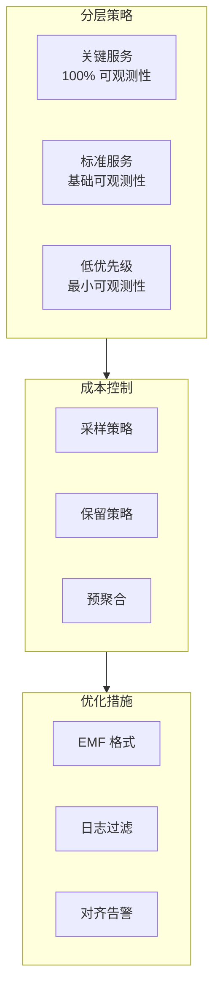

---

（继续编写第10-13章...）


## 10. 成本监控与优化实践

### 10.1 AWS Cost Anomaly Detection 集成

```python
import boto3
from datetime import datetime, timedelta

class CostMonitoring:
    """
    AWS 成本监控与异常检测
    """
    
    def __init__(self):
        self.ce = boto3.client('ce')
        self.budgets = boto3.client('budgets')
        self.anomaly = boto3.client('ce', region_name='us-east-1')
    
    def create_anomaly_detector(self, monitor_type='DIMENSIONAL'):
        """创建成本异常检测器"""
        
        response = self.ce.create_anomaly_monitor(
            AnomalyMonitor={
                'MonitorType': monitor_type,
                'MonitorName': 'DailyCostMonitor',
                'MonitorSpecification': {
                    'MatchOptions': ['EQUALS'],
                    'Values': ['USAGE']
                }
            }
        )
        
        monitor_arn = response['MonitorArn']
        
        # 创建异常订阅
        self.ce.create_anomaly_subscription(
            AnomalySubscription={
                'SubscriptionName': 'CostAlertSubscription',
                'Threshold': 100,  # $100
                'Frequency': 'IMMEDIATE',
                'MonitorArnList': [monitor_arn],
                'Subscribers': [
                    {
                        'Type': 'SNS',
                        'Address': 'arn:aws:sns:us-east-1:123456789:cost-alerts'
                    }
                ]
            }
        )
        
        return monitor_arn
    
    def create_budget_with_alert(self, budget_amount: float, email: str):
        """创建预算告警"""
        
        budget = {
            'BudgetName': 'MonthlyBudget',
            'BudgetLimit': {
                'Amount': str(budget_amount),
                'Unit': 'USD'
            },
            'TimeUnit': 'MONTHLY',
            'BudgetType': 'COST',
            'CostFilters': {}
        }
        
        notifications = [
            {
                'Notification': {
                    'NotificationType': 'ACTUAL',
                    'ComparisonOperator': 'GREATER_THAN',
                    'Threshold': 80  # 80% 实际
                },
                'Subscribers': [{'SubscriptionType': 'EMAIL', 'Address': email}]
            },
            {
                'Notification': {
                    'NotificationType': 'FORECASTED',
                    'ComparisonOperator': 'GREATER_THAN',
                    'Threshold': 100  # 100% 预测
                },
                'Subscribers': [{'SubscriptionType': 'EMAIL', 'Address': email}]
            }
        ]
        
        self.budgets.create_budget(
            AccountId='123456789',
            Budget=budget,
            NotificationsWithSubscribers=notifications
        )
    
    def analyze_cost_by_tag(self, tag_key: str, days: int = 30):
        """按标签分析成本"""
        
        end_date = datetime.utcnow()
        start_date = end_date - timedelta(days=days)
        
        response = self.ce.get_cost_and_usage(
            TimePeriod={
                'Start': start_date.strftime('%Y-%m-%d'),
                'End': end_date.strftime('%Y-%m-%d')
            },
            Granularity='DAILY',
            Metrics=['UnblendedCost', 'UsageQuantity'],
            GroupBy=[
                {'Type': 'TAG', 'Key': tag_key}
            ]
        )
        
        results = {}
        for result in response['ResultsByTime']:
            date = result['TimePeriod']['Start']
            for group in result['Groups']:
                tag_value = group['Keys'][0].split('$')[1] if '$' in group['Keys'][0] else 'untagged'
                cost = float(group['Metrics']['UnblendedCost']['Amount'])
                
                if tag_value not in results:
                    results[tag_value] = {'total_cost': 0, 'daily_costs': []}
                
                results[tag_value]['total_cost'] += cost
                results[tag_value]['daily_costs'].append({'date': date, 'cost': cost})
        
        return results
    
    def identify_cost_spikes(self, threshold_percentage: float = 20.0):
        """识别成本突增"""
        
        end_date = datetime.utcnow()
        start_date = end_date - timedelta(days=7)
        
        response = self.ce.get_cost_and_usage(
            TimePeriod={
                'Start': start_date.strftime('%Y-%m-%d'),
                'End': end_date.strftime('%Y-%m-%d')
            },
            Granularity='DAILY',
            Metrics=['UnblendedCost'],
            GroupBy=[{'Type': 'DIMENSION', 'Key': 'SERVICE'}]
        )
        
        spikes = []
        
        # 按服务分析每日成本
        service_costs = {}
        for result in response['ResultsByTime']:
            date = result['TimePeriod']['Start']
            for group in result['Groups']:
                service = group['Keys'][0]
                cost = float(group['Metrics']['UnblendedCost']['Amount'])
                
                if service not in service_costs:
                    service_costs[service] = []
                service_costs[service].append(cost)
        
        # 检测突增
        for service, costs in service_costs.items():
            if len(costs) >= 2:
                avg_cost = sum(costs[:-1]) / len(costs[:-1])
                latest_cost = costs[-1]
                
                if avg_cost > 0:
                    increase_percentage = ((latest_cost - avg_cost) / avg_cost) * 100
                    if increase_percentage > threshold_percentage:
                        spikes.append({
                            'service': service,
                            'previous_avg': avg_cost,
                            'current': latest_cost,
                            'increase_percentage': increase_percentage,
                            'additional_cost': latest_cost - avg_cost
                        })
        
        return sorted(spikes, key=lambda x: x['increase_percentage'], reverse=True)

# Lambda 成本监控函数
def lambda_handler(event, context):
    """监控 Lambda 函数成本效率"""
    
    monitoring = CostMonitoring()
    
    # 按函数名称分析成本
    cost_by_function = monitoring.analyze_cost_by_tag('lambda:FunctionName', days=7)
    
    # 识别异常高的成本
    alerts = []
    for function_name, data in cost_by_function.items():
        daily_avg = data['total_cost'] / 7
        if daily_avg > 100:  # 每天超过 $100
            alerts.append({
                'function': function_name,
                'daily_avg_cost': daily_avg,
                'weekly_total': data['total_cost'],
                'recommendation': 'Review function configuration and invocation patterns'
            })
    
    return {
        'functions_analyzed': len(cost_by_function),
        'alerts': alerts
    }
```

---

## 11. 多环境监控策略

### 11.1 环境隔离与统一视图

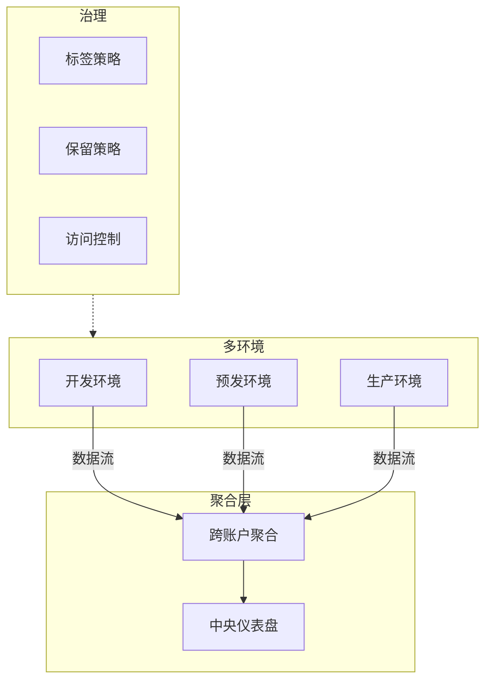

### 11.2 跨环境指标对比

```python
import boto3
from dataclasses import dataclass
from typing import Dict, List
from datetime import datetime

@dataclass
class EnvironmentMetrics:
    """环境指标数据"""
    environment: str
    availability: float
    latency_p99: float
    error_rate: float
    cost_per_request: float

class MultiEnvironmentMonitor:
    """
    多环境监控器
    - 跨环境指标对比
    - 异常检测
    - 部署影响分析
    """
    
    def __init__(self):
        self.cloudwatch = boto3.client('cloudwatch')
        self.environments = {
            'dev': {'account': '123456789', 'region': 'us-east-1'},
            'staging': {'account': '987654321', 'region': 'us-east-1'},
            'prod': {'account': '555555555', 'region': 'us-east-1'}
        }
    
    def compare_latency_across_environments(
        self,
        service_name: str,
        start_time: datetime,
        end_time: datetime
    ) -> Dict:
        """对比跨环境延迟"""
        
        comparison = {}
        
        for env, config in self.environments.items():
            # 假设使用跨账户角色访问
            session = boto3.Session(
                profile_name=f"monitoring-{env}"
            )
            cw = session.client('cloudwatch', region_name=config['region'])
            
            response = cw.get_metric_statistics(
                Namespace='Application/API',
                MetricName='Latency',
                Dimensions=[
                    {'Name': 'Service', 'Value': service_name},
                    {'Name': 'Environment', 'Value': env}
                ],
                StartTime=start_time,
                EndTime=end_time,
                Period=3600,
                Statistics=['p99', 'Average']
            )
            
            if response['Datapoints']:
                p99_latencies = [dp['ExtendedStatistics']['p99'] for dp in response['Datapoints']]
                comparison[env] = {
                    'p99_avg': sum(p99_latencies) / len(p99_latencies),
                    'datapoints': len(response['Datapoints'])
                }
        
        # 检测生产环境与预发环境的差异
        if 'prod' in comparison and 'staging' in comparison:
            prod_p99 = comparison['prod']['p99_avg']
            staging_p99 = comparison['staging']['p99_avg']
            
            if staging_p99 > 0:
                deviation = ((prod_p99 - staging_p99) / staging_p99) * 100
                comparison['deviation_analysis'] = {
                    'staging_to_prod_p99_diff_percent': deviation,
                    'alert': abs(deviation) > 20  # 20% 差异告警
                }
        
        return comparison
    
    def analyze_deployment_impact(
        self,
        service_name: str,
        deployment_time: datetime,
        window_minutes: int = 30
    ) -> Dict:
        """
        分析部署对指标的影响
        """
        
        before_start = deployment_time - timedelta(minutes=window_minutes)
        after_end = deployment_time + timedelta(minutes=window_minutes)
        
        # 部署前指标
        before_metrics = self._get_metrics_for_window(
            service_name, before_start, deployment_time
        )
        
        # 部署后指标
        after_metrics = self._get_metrics_for_window(
            service_name, deployment_time, after_end
        )
        
        # 计算变化
        impact = {
            'error_rate_change': self._calculate_change(
                before_metrics.get('error_rate', 0),
                after_metrics.get('error_rate', 0)
            ),
            'latency_change': self._calculate_change(
                before_metrics.get('latency_p99', 0),
                after_metrics.get('latency_p99', 0)
            ),
            'deployment_time': deployment_time.isoformat()
        }
        
        # 判断是否有负面影响
        impact['negative_impact'] = (
            impact['error_rate_change'] > 50 or  # 错误率增加 50%
            impact['latency_change'] > 20         # 延迟增加 20%
        )
        
        return impact
    
    def _get_metrics_for_window(
        self,
        service_name: str,
        start: datetime,
        end: datetime
    ) -> Dict:
        """获取时间窗口内的指标"""
        
        response = self.cloudwatch.get_metric_statistics(
            Namespace='Application/API',
            MetricName='ErrorRate',
            Dimensions=[{'Name': 'Service', 'Value': service_name}],
            StartTime=start,
            EndTime=end,
            Period=60,
            Statistics=['Average']
        )
        
        if response['Datapoints']:
            avg_error_rate = sum(dp['Average'] for dp in response['Datapoints']) / len(response['Datapoints'])
        else:
            avg_error_rate = 0
        
        return {'error_rate': avg_error_rate}
    
    def _calculate_change(self, before: float, after: float) -> float:
        """计算变化百分比"""
        if before == 0:
            return float('inf') if after > 0 else 0
        return ((after - before) / before) * 100
    
    def generate_environment_health_report(self) -> Dict:
        """生成环境健康报告"""
        
        report = {
            'generated_at': datetime.utcnow().isoformat(),
            'environments': {}
        }
        
        for env in self.environments.keys():
            report['environments'][env] = {
                'status': self._get_environment_status(env),
                'key_metrics': self._get_key_metrics(env),
                'alerts': self._get_active_alerts(env)
            }
        
        return report
    
    def _get_environment_status(self, env: str) -> str:
        return 'healthy'
    
    def _get_key_metrics(self, env: str) -> Dict:
        return {}
    
    def _get_active_alerts(self, env: str) -> List:
        return []
```

---

## 12. 安全监控与威胁检测

### 12.1 GuardDuty 集成

```python
import boto3
import json

class SecurityMonitoring:
    """
    安全监控与威胁检测
    - GuardDuty 发现处理
    - Security Hub 集成
    - 自动响应
    """
    
    def __init__(self):
        self.guardduty = boto3.client('guardduty')
        self.securityhub = boto3.client('securityhub')
        self.sns = boto3.client('sns')
    
    def process_guardduty_finding(self, finding: dict) -> dict:
        """处理 GuardDuty 发现"""
        
        finding_id = finding['id']
        severity = finding['severity']
        finding_type = finding['type']
        
        response_actions = []
        
        # 根据严重性处理
        if severity >= 7.0:  # 高危
            response_actions.extend(self._handle_high_severity(finding))
        elif severity >= 4.0:  # 中危
            response_actions.extend(self._handle_medium_severity(finding))
        else:  # 低危
            response_actions.extend(self._handle_low_severity(finding))
        
        # 导出到 Security Hub
        self._export_to_security_hub(finding)
        
        return {
            'finding_id': finding_id,
            'actions_taken': response_actions,
            'severity': severity
        }
    
    def _handle_high_severity(self, finding: dict) -> list:
        """处理高危发现"""
        actions = []
        
        finding_type = finding['type']
        
        if 'UnauthorizedAccess' in finding_type:
            # 阻止可疑 IP
            actions.append(self._block_ip(finding['resource']['instanceDetails']['networkInterfaces'][0]['publicIp']))
        
        if 'CryptoCurrency' in finding_type:
            # 隔离实例
            actions.append(self._isolate_instance(finding['resource']['instanceDetails']['instanceId']))
        
        # 立即通知安全团队
        self._send_immediate_alert(finding)
        
        return actions
    
    def _handle_medium_severity(self, finding: dict) -> list:
        """处理中危发现"""
        actions = []
        
        # 记录并安排审查
        actions.append('scheduled_for_review')
        
        # 发送 Slack 通知
        self._send_slack_notification(finding)
        
        return actions
    
    def _handle_low_severity(self, finding: dict) -> list:
        """处理低危发现"""
        # 仅记录，批量处理
        return ['logged_for_batch_review']
    
    def _block_ip(self, ip_address: str) -> str:
        """阻止可疑 IP"""
        # 更新 NACL 或安全组
        return f'blocked_ip:{ip_address}'
    
    def _isolate_instance(self, instance_id: str) -> str:
        """隔离实例"""
        ec2 = boto3.client('ec2')
        
        # 创建隔离安全组
        try:
            response = ec2.create_security_group(
                GroupName=f'isolate-{instance_id}',
                Description='Isolation security group'
            )
            sg_id = response['GroupId']
            
            # 移除此安全组的所有入站规则
            ec2.revoke_security_group_ingress(
                GroupId=sg_id,
                IpPermissions=[]
            )
            
            # 将实例附加到隔离安全组
            ec2.modify_instance_attribute(
                InstanceId=instance_id,
                Groups=[sg_id]
            )
            
            return f'isolated_instance:{instance_id}'
        except Exception as e:
            return f'isolation_failed:{str(e)}'
    
    def _send_immediate_alert(self, finding: dict):
        """发送紧急告警"""
        message = {
            'default': json.dumps({
                'alert_type': 'security_incident',
                'severity': 'CRITICAL',
                'finding': finding
            }),
            'email': f"""
            SECURITY ALERT - CRITICAL
            
            Finding Type: {finding['type']}
            Severity: {finding['severity']}
            Account: {finding['accountId']}
            Region: {finding['region']}
            
            Description: {finding['description']}
            
            Immediate action required!
            """
        }
        
        self.sns.publish(
            TopicArn='arn:aws:sns:us-east-1:123456789:security-critical',
            Message=json.dumps(message),
            MessageStructure='json'
        )
    
    def _send_slack_notification(self, finding: dict):
        """发送 Slack 通知"""
        pass
    
    def _export_to_security_hub(self, finding: dict):
        """导出到 Security Hub"""
        
        security_finding = {
            'SchemaVersion': '2018-10-08',
            'Id': finding['id'],
            'ProductArn': f"arn:aws:securityhub:{finding['region']}::product/aws/guardduty",
            'GeneratorId': finding['type'],
            'AwsAccountId': finding['accountId'],
            'Types': ['TTPs/UnauthorizedAccess'],
            'CreatedAt': finding['createdAt'],
            'UpdatedAt': finding['updatedAt'],
            'Severity': {
                'Product': finding['severity'],
                'Normalized': int(finding['severity'] * 10)
            },
            'Title': finding['title'],
            'Description': finding['description'],
            'Resources': [{
                'Type': 'AwsEc2Instance',
                'Id': finding['resource']['instanceDetails']['instanceId']
            }],
            'RecordState': 'ACTIVE'
        }
        
        self.securityhub.batch_import_findings(Findings=[security_finding])
```

---

## 13. 生产环境最佳实践

### 13.1 监控即代码 (Monitoring as Code)

```yaml
# monitoring-stack.yaml
# CloudFormation/SAM 模板定义监控资源

AWSTemplateFormatVersion: '2010-09-09'
Description: 'Monitoring as Code - Application Monitoring Stack'

Parameters:
  ApplicationName:
    Type: String
    Default: MyApplication
  Environment:
    Type: String
    AllowedValues: [dev, staging, prod]
  AlarmSNSTopic:
    Type: String

Resources:
  # CloudWatch 日志组
  ApplicationLogGroup:
    Type: AWS::Logs::LogGroup
    Properties:
      LogGroupName: !Sub '/aws/applications/${ApplicationName}'
      RetentionInDays: !If [IsProduction, 90, 7]
      Tags:
        - Key: Application
          Value: !Ref ApplicationName
        - Key: Environment
          Value: !Ref Environment

  # 错误率告警
  HighErrorRateAlarm:
    Type: AWS::CloudWatch::Alarm
    Properties:
      AlarmName: !Sub '${ApplicationName}-HighErrorRate'
      AlarmDescription: 'API error rate exceeds 1%'
      MetricName: ErrorRate
      Namespace: !Sub '${ApplicationName}/API'
      Statistic: Average
      Period: 60
      EvaluationPeriods: 2
      Threshold: 1.0
      ComparisonOperator: GreaterThanThreshold
      TreatMissingData: notBreaching
      AlarmActions:
        - !Ref AlarmSNSTopic
      OKActions:
        - !Ref AlarmSNSTopic
      Tags:
        - Key: Severity
          Value: P1

  # 延迟告警
  HighLatencyAlarm:
    Type: AWS::CloudWatch::Alarm
    Properties:
      AlarmName: !Sub '${ApplicationName}-HighLatency'
      AlarmDescription: 'P99 latency exceeds 1 second'
      ExtendedStatistic: p99
      MetricName: Latency
      Namespace: !Sub '${ApplicationName}/API'
      Period: 60
      EvaluationPeriods: 3
      Threshold: 1000
      ComparisonOperator: GreaterThanThreshold
      AlarmActions:
        - !Ref AlarmSNSTopic

  # 自定义指标仪表盘
  ApplicationDashboard:
    Type: AWS::CloudWatch::Dashboard
    Properties:
      DashboardName: !Sub '${ApplicationName}-${Environment}'
      DashboardBody: !Sub |
        {
          "widgets": [
            {
              "type": "metric",
              "properties": {
                "title": "Request Count",
                "metrics": [
                  ["${ApplicationName}/API", "RequestCount", "Environment", "${Environment}"]
                ],
                "period": 60,
                "stat": "Sum"
              }
            },
            {
              "type": "metric",
              "properties": {
                "title": "Error Rate",
                "metrics": [
                  ["${ApplicationName}/API", "ErrorRate", "Environment", "${Environment}", { "color": "#d62728" }]
                ],
                "annotations": {
                  "horizontal": [
                    { "value": 1, "label": "Threshold", "color": "#ff0000" }
                  ]
                }
              }
            },
            {
              "type": "log",
              "properties": {
                "title": "Error Logs",
                "query": "SOURCE '${ApplicationLogGroup}' | fields @timestamp, @message | filter @message like /ERROR/ | sort @timestamp desc | limit 20",
                "region": "${AWS::Region}"
              }
            }
          ]
        }

Conditions:
  IsProduction: !Equals [!Ref Environment, 'prod']

Outputs:
  LogGroupName:
    Description: Application Log Group
    Value: !Ref ApplicationLogGroup
  DashboardURL:
    Description: CloudWatch Dashboard URL
    Value: !Sub 'https://${AWS::Region}.console.aws.amazon.com/cloudwatch/home?region=${AWS::Region}#dashboards:name=${ApplicationName}-${Environment}'
```

### 13.2 监控健康检查

```python
class MonitoringHealthCheck:
    """
    监控系统的健康检查
    - 验证告警配置
    - 检查日志摄入
    - 验证仪表盘
    """
    
    def __init__(self):
        self.cloudwatch = boto3.client('cloudwatch')
        self.logs = boto3.client('logs')
        self.sns = boto3.client('sns')
    
    def validate_alarm_configuration(self, alarm_name: str) -> dict:
        """验证告警配置"""
        
        try:
            response = self.cloudwatch.describe_alarms(
                AlarmNames=[alarm_name]
            )
            
            if not response['MetricAlarms']:
                return {'status': 'ERROR', 'message': 'Alarm not found'}
            
            alarm = response['MetricAlarms'][0]
            issues = []
            
            # 检查是否有动作配置
            if not alarm.get('AlarmActions'):
                issues.append('No alarm actions configured')
            
            # 检查评估周期
            if alarm['EvaluationPeriods'] < 2:
                issues.append('Evaluation periods too low (risk of flapping)')
            
            # 检查缺失数据处理
            if alarm.get('TreatMissingData') == 'breaching':
                issues.append('Missing data treated as breaching (may cause false alarms)')
            
            return {
                'status': 'WARNING' if issues else 'OK',
                'alarm_name': alarm_name,
                'issues': issues,
                'configuration': {
                    'threshold': alarm['Threshold'],
                    'evaluation_periods': alarm['EvaluationPeriods'],
                    'period': alarm['Period']
                }
            }
            
        except Exception as e:
            return {'status': 'ERROR', 'message': str(e)}
    
    def check_log_group_health(self, log_group: str) -> dict:
        """检查日志组健康状态"""
        
        try:
            # 检查最近是否有日志摄入
            response = self.logs.describe_log_streams(
                logGroupName=log_group,
                orderBy='LastEventTime',
                descending=True,
                limit=1
            )
            
            if not response['logStreams']:
                return {
                    'status': 'WARNING',
                    'log_group': log_group,
                    'message': 'No log streams found'
                }
            
            last_event = response['logStreams'][0].get('lastEventTimestamp', 0)
            last_event_time = datetime.fromtimestamp(last_event / 1000)
            time_since_last_event = datetime.utcnow() - last_event_time
            
            if time_since_last_event > timedelta(hours=1):
                return {
                    'status': 'WARNING',
                    'log_group': log_group,
                    'message': f'No logs in last {time_since_last_event.total_seconds() / 60:.0f} minutes',
                    'last_event': last_event_time.isoformat()
                }
            
            return {
                'status': 'OK',
                'log_group': log_group,
                'last_event': last_event_time.isoformat(),
                'time_since_last_event_minutes': time_since_last_event.total_seconds() / 60
            }
            
        except Exception as e:
            return {'status': 'ERROR', 'message': str(e)}
    
    def run_full_health_check(self) -> dict:
        """运行完整健康检查"""
        
        checks = {
            'alarms': [],
            'log_groups': [],
            'dashboards': []
        }
        
        # 检查所有告警
        paginator = self.cloudwatch.get_paginator('describe_alarms')
        for page in paginator.paginate(StateValue='ENABLED'):
            for alarm in page['MetricAlarms']:
                result = self.validate_alarm_configuration(alarm['AlarmName'])
                checks['alarms'].append(result)
        
        return {
            'timestamp': datetime.utcnow().isoformat(),
            'summary': {
                'total_alarms': len(checks['alarms']),
                'ok': sum(1 for a in checks['alarms'] if a['status'] == 'OK'),
                'warnings': sum(1 for a in checks['alarms'] if a['status'] == 'WARNING'),
                'errors': sum(1 for a in checks['alarms'] if a['status'] == 'ERROR')
            },
            'details': checks
        }

---

*版本: v1.0*  
*更新日期: 2026-03-02*
