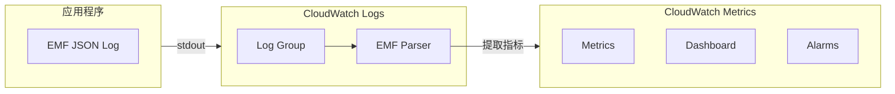

# CloudWatch 嵌入式指标格式 (EMF) 开发指南

> 为开发者提供高性能、低成本的 CloudWatch 指标收集方案

---

## 目录

1. [EMF 概述](#1-emf-概述)
2. [EMF 格式规范](#2-emf-格式规范)
3. [各语言实现](#3-各语言实现)
4. [与 Lambda 集成](#4-与-lambda-集成)
5. [与容器集成](#5-与-容器集成)
6. [高级使用模式](#6-高级使用模式)
7. [成本优化策略](#7-成本优化策略)

---

## 1. EMF 概述

### 1.1 什么是 EMF

嵌入式指标格式 (Embedded Metric Format, EMF) 是一种 JSON 规范，允许将 CloudWatch 指标以日志形式嵌入到结构化日志事件中。CloudWatch Logs 会自动提取这些指标，无需使用 PutMetric API。

```
传统方式: 应用 → CloudWatch API (PutMetric) → CloudWatch Metrics
EMF 方式:  应用 → CloudWatch Logs → 自动提取 → CloudWatch Metrics

优势:
- 高吞吐量: 无需 API 调用限制
- 低成本: 按日志量计费，通常比 API 调用便宜
- 低延迟: 异步处理，不阻塞应用
- 上下文丰富: 指标与日志关联
```

### 1.2 EMF 与传统方式对比

| 特性 | PutMetric API | EMF |
|------|--------------|-----|
| 延迟 | 同步 | 异步 |
| 成本 | $0.01/1000指标 | 日志存储费用 |
| 限制 | 150 TPS/区域 | 无限制 |
| 维度 | 10个 | 9个 |
| 上下文 | 无 | 完整日志 |
| 实现复杂度 | 需要 SDK | 只需 JSON |

### 1.3 架构图



---

## 2. EMF 格式规范

### 2.1 基本格式

```json
{
  "_aws": {
    "Timestamp": 1574109732004,
    "CloudWatchMetrics": [
      {
        "Namespace": "MyApplication",
        "Dimensions": [["ServiceName", "Operation"]],
        "Metrics": [
          {
            "Name": "ProcessingLatency",
            "Unit": "Milliseconds"
          },
          {
            "Name": "RequestCount",
            "Unit": "Count"
          }
        ]
      }
    ]
  },
  "ServiceName": "UserService",
  "Operation": "CreateUser",
  "ProcessingLatency": 100,
  "RequestCount": 1,
  "requestId": "abc-123",
  "userId": "user-456"
}
```

### 2.2 字段说明

| 字段 | 必需 | 说明 |
|------|------|------|
| `_aws` | 是 | EMF 元数据根节点 |
| `_aws.Timestamp` | 是 | Unix 时间戳（毫秒） |
| `_aws.CloudWatchMetrics` | 是 | 指标定义数组 |
| `Namespace` | 是 | 指标命名空间 |
| `Dimensions` | 否 | 维度组合数组 |
| `Metrics` | 是 | 指标定义数组 |
| `Name` | 是 | 指标名称 |
| `Unit` | 否 | 单位（默认：None） |
| `StorageResolution` | 否 | 60 或 1（高分辨率） |

### 2.3 多维度示例

```json
{
  "_aws": {
    "Timestamp": 1574109732004,
    "CloudWatchMetrics": [
      {
        "Namespace": "ECommerce",
        "Dimensions": [
          ["Service", "Environment"],
          ["Service"],
          ["Environment"]
        ],
        "Metrics": [
          {"Name": "OrdersProcessed", "Unit": "Count"},
          {"Name": "OrderValue", "Unit": "Count", "StorageResolution": 1}
        ]
      }
    ]
  },
  "Service": "OrderService",
  "Environment": "Production",
  "OrdersProcessed": 10,
  "OrderValue": 1500.50
}
```

---

## 3. 各语言实现

### 3.1 Python (AWS Lambda Powertools)

```python
# 安装: pip install aws-lambda-powertools
from aws_lambda_powertools import Logger, Metrics
from aws_lambda_powertools.metrics import MetricUnit
from aws_lambda_powertools.logging import correlation_paths

# 初始化
metrics = Metrics(namespace="MyApplication")
logger = Logger()

@logger.inject_lambda_context
@metrics.log_metrics(capture_cold_start_metric=True)
def lambda_handler(event, context):
    # 添加维度
    metrics.add_dimension(name="ServiceName", value="UserService")
    metrics.add_dimension(name="Environment", value="Production")
    
    # 记录指标
    metrics.add_metric(name="SuccessfulRequests", unit=MetricUnit.Count, value=1)
    metrics.add_metric(name="ProcessingLatency", unit=MetricUnit.Milliseconds, value=100)
    
    # 记录日志（自动关联）
    logger.info("Processing request", extra={"request_id": "abc-123"})
    
    return {"statusCode": 200}

# 自定义 EMF 输出
from aws_lambda_powertools.metrics import Metrics, MetricUnit

metrics = Metrics()

@metrics.log_metrics
def handler(event, context):
    # 高分辨率指标
    metrics.add_metric(
        name="APICallLatency",
        unit=MetricUnit.Milliseconds,
        value=45,
        resolution=1  # 高分辨率（1秒）
    )
    
    # 多维度
    metrics.add_dimension(name="Region", value="ap-northeast-1")
    metrics.add_dimension(name="AZ", value="ap-northeast-1a")
    
    return {"status": "ok"}
```

### 3.2 Node.js

```javascript
// 使用 aws-embedded-metrics 库
// npm install aws-embedded-metrics

const { metricScope, Unit } = require('aws-embedded-metrics');

exports.handler = metricScope(metrics => async (event, context) => {
    // 设置维度
    metrics.setNamespace('MyApplication');
    metrics.setProperty('RequestId', context.awsRequestId);
    metrics.setProperty('Version', '1.0.0');
    
    // 设置默认维度
    metrics.putDimensions({ ServiceName: 'OrderService' });
    
    // 记录指标
    metrics.putMetric('ProcessingTime', 100, Unit.Milliseconds);
    metrics.putMetric('SuccessCount', 1, Unit.Count);
    
    // 自定义属性
    metrics.setProperty('UserId', event.userId);
    
    return { statusCode: 200 };
});

// 原生实现（无依赖）
const EMF_OUTPUT = process.env.AWS_EXECUTION_ENV && process.env.AWS_EXECUTION_ENV.includes('AWS_Lambda');

function logEMF(metrics) {
    const emf = {
        _aws: {
            Timestamp: Date.now(),
            CloudWatchMetrics: [{
                Namespace: metrics.namespace,
                Dimensions: [Object.keys(metrics.dimensions)],
                Metrics: Object.keys(metrics.values).map(name => ({
                    Name: name,
                    Unit: metrics.units[name] || 'None'
                }))
            }]
        },
        ...metrics.dimensions,
        ...metrics.values
    };
    
    console.log(JSON.stringify(emf));
}
```

### 3.3 Java

```java
// 使用 aws-embedded-metrics-java
// <dependency>
//     <groupId>software.amazon.cloudwatchlogs</groupId>
//     <artifactId>aws-embedded-metrics</artifactId>
//     <version>1.0.0</version>
// </dependency>

import software.amazon.cloudwatchlogs.emf.logger.MetricsLogger;
import software.amazon.cloudwatchlogs.emf.model.Unit;
import software.amazon.cloudwatchlogs.emf.model.DimensionSet;

public class Handler implements RequestHandler<Map<String, Object>, String> {
    
    @Override
    public String handleRequest(Map<String, Object> event, Context context) {
        MetricsLogger metrics = new MetricsLogger();
        
        // 设置命名空间
        metrics.setNamespace("MyApplication");
        
        // 设置维度
        metrics.putDimensions(DimensionSet.of(
            "ServiceName", "OrderService",
            "Environment", "Production"
        ));
        
        // 记录指标
        metrics.putMetric("ProcessingLatency", 100, Unit.MILLISECONDS);
        metrics.putMetric("RequestCount", 1, Unit.COUNT);
        
        // 自定义属性
        metrics.putProperty("RequestId", context.getAwsRequestId());
        
        // 刷新（Lambda 中可选）
        metrics.flush();
        
        return "Success";
    }
}
```

### 3.4 Go

```go
package main

import (
    "context"
    "encoding/json"
    "fmt"
    "time"

    "github.com/aws/aws-lambda-go/lambda"
)

// EMF 结构体
type EMF struct {
    AWS      AWSMetadata     `json:"_aws"`
    Metadata map[string]interface{}
}

type AWSMetadata struct {
    Timestamp         int64              `json:"Timestamp"`
    CloudWatchMetrics []CloudWatchMetric `json:"CloudWatchMetrics"`
}

type CloudWatchMetric struct {
    Namespace  string      `json:"Namespace"`
    Dimensions [][]string  `json:"Dimensions"`
    Metrics    []MetricDef `json:"Metrics"`
}

type MetricDef struct {
    Name       string `json:"Name"`
    Unit       string `json:"Unit"`
    Resolution int    `json:"StorageResolution,omitempty"`
}

func logEMF(namespace string, dimensions map[string]string, metrics map[string]interface{}) {
    dimensionKeys := make([]string, 0, len(dimensions))
    for k := range dimensions {
        dimensionKeys = append(dimensionKeys, k)
    }
    
    metricDefs := make([]MetricDef, 0, len(metrics))
    for name := range metrics {
        metricDefs = append(metricDefs, MetricDef{
            Name: name,
            Unit: "Count",
        })
    }
    
    emf := EMF{
        AWS: AWSMetadata{
            Timestamp: time.Now().UnixMilli(),
            CloudWatchMetrics: []CloudWatchMetric{{
                Namespace:  namespace,
                Dimensions: [][]string{dimensionKeys},
                Metrics:    metricDefs,
            }},
        },
        Metadata: make(map[string]interface{}),
    }
    
    // 合并维度和指标
    for k, v := range dimensions {
        emf.Metadata[k] = v
    }
    for k, v := range metrics {
        emf.Metadata[k] = v
    }
    
    jsonData, _ := json.Marshal(emf)
    fmt.Println(string(jsonData))
}

func handler(ctx context.Context, event map[string]interface{}) (string, error) {
    logEMF(
        "MyApplication",
        map[string]string{
            "ServiceName": "OrderService",
            "Environment": "Production",
        },
        map[string]interface{}{
            "RequestCount": 1,
            "ProcessingLatency": 100,
        },
    )
    
    return "Success", nil
}

func main() {
    lambda.Start(handler)
}
```

---

## 4. 与 Lambda 集成

### 4.1 Lambda Powertools 最佳实践

```python
from aws_lambda_powertools import Logger, Metrics, Tracer
from aws_lambda_powertools.metrics import MetricUnit
from aws_lambda_powertools.logging import correlation_paths
from aws_lambda_powertools.utilities.typing import LambdaContext

# 初始化工具
tracer = Tracer()
logger = Logger()
metrics = Metrics()

@tracer.capture_lambda_handler
@logger.inject_lambda_context(log_event=True)
@metrics.log_metrics(
    capture_cold_start_metric=True,
    default_dimensions={"Service": "UserService"}
)
def handler(event: dict, context: LambdaContext):
    """
    完整的 Lambda 处理程序示例
    """
    try:
        # 添加请求特定维度
        metrics.add_dimension(name="Operation", value=event.get('operation', 'unknown'))
        
        # 业务逻辑
        with tracer.provider.in_subsegment('## business_logic'):
            result = process_request(event)
        
        # 成功指标
        metrics.add_metric(name="SuccessCount", unit=MetricUnit.Count, value=1)
        metrics.add_metric(name="ProcessingTime", unit=MetricUnit.Milliseconds, 
                          value=result['duration_ms'])
        
        return {
            'statusCode': 200,
            'body': json.dumps(result)
        }
        
    except Exception as e:
        # 错误指标
        metrics.add_metric(name="ErrorCount", unit=MetricUnit.Count, value=1)
        logger.exception("Request failed")
        
        return {
            'statusCode': 500,
            'body': json.dumps({'error': str(e)})
        }

def process_request(event):
    # 模拟处理
    import time
    start = time.time()
    
    # 处理...
    time.sleep(0.1)
    
    return {
        'duration_ms': (time.time() - start) * 1000,
        'data': event.get('data')
    }
```

### 4.2 Lambda 层配置

```yaml
# template.yaml
AWSTemplateFormatVersion: '2010-09-09'
Transform: AWS::Serverless-2016-10-31

Globals:
  Function:
    Layers:
      # Lambda Powertools 层 (Python)
      - !Sub 'arn:aws:lambda:${AWS::Region}:017000801446:layer:AWSLambdaPowertoolsPythonV2:40'
    Environment:
      Variables:
        POWERTOOLS_SERVICE_NAME: my-service
        POWERTOOLS_LOG_FORMAT: JSON
        POWERTOOLS_LOG_LEVEL: INFO
        POWERTOOLS_LOGGER_LOG_EVENT: true
        POWERTOOLS_METRICS_NAMESPACE: MyApplication

Resources:
  MyFunction:
    Type: AWS::Serverless::Function
    Properties:
      CodeUri: src/
      Handler: app.handler
      Runtime: python3.11
      Architectures:
        - arm64
```

### 4.3 Lambda Insights 集成

```python
# Lambda Insights 自动收集系统级指标
# 只需启用 Lambda Insights 层

# template.yaml
Resources:
  MyFunction:
    Type: AWS::Serverless::Function
    Properties:
      Layers:
        # Lambda Powertools
        - !Sub 'arn:aws:lambda:${AWS::Region}:017000801446:layer:AWSLambdaPowertoolsPythonV2:40'
        # Lambda Insights (自动添加)
        - !Sub 'arn:aws:lambda:${AWS::Region}:580247275435:layer:LambdaInsightsExtension:14'
      Policies:
        - CloudWatchLambdaInsightsExecutionRolePolicy
```

---

## 5. 与容器集成

### 5.1 ECS/Fargate EMF Agent

```dockerfile
# Dockerfile - 包含 CloudWatch Agent
FROM python:3.11-slim

# 安装 CloudWatch Agent
RUN apt-get update && apt-get install -y wget && \
    wget https://s3.amazonaws.com/amazoncloudwatch-agent/ubuntu/amd64/latest/amazon-cloudwatch-agent.deb && \
    dpkg -i amazon-cloudwatch-agent.deb

# 复制应用
COPY app.py /app/
WORKDIR /app

# CloudWatch Agent 配置
COPY cwagent-config.json /opt/aws/amazon-cloudwatch-agent/etc/

# 启动脚本
COPY entrypoint.sh /entrypoint.sh
RUN chmod +x /entrypoint.sh

ENTRYPOINT ["/entrypoint.sh"]
```

```json
// cwagent-config.json
{
  "agent": {
    "run_as_user": "root"
  },
  "logs": {
    "metrics_collected": {
      "emf": {}
    },
    "force_flush_interval": 5
  }
}
```

```bash
#!/bin/bash
# entrypoint.sh

# 启动 CloudWatch Agent
/opt/aws/amazon-cloudwatch-agent/bin/amazon-cloudwatch-agent-ctl -a fetch-config -m ecs -c file:/opt/aws/amazon-cloudwatch-agent/etc/cwagent-config.json -s &

# 启动应用
exec python app.py
```

### 5.2 EKS 与 Fluent Bit

```yaml
# fluent-bit-config.yaml
apiVersion: v1
kind: ConfigMap
metadata:
  name: fluent-bit-config
data:
  parsers.conf: |
    [PARSER]
        Name        emf
        Format      json
        Time_Key    _aws.Timestamp
        Time_Format %s%L
  
  filters.conf: |
    [FILTER]
        Name                parser
        Match               kube.*
        Key_Name            log
        Parser              emf
        Reserve_Data        On
        Preserve_Key        Off
  
  output.conf: |
    [OUTPUT]
        Name                cloudwatch_logs
        Match               kube.*
        Region              ap-northeast-1
        Log_Group_Name      /eks/my-cluster/application
        Log_Stream_Prefix   pod-
        Auto_Create_Group   On
```

---

## 6. 高级使用模式

### 6.1 自定义指标聚合

```python
# 批量指标收集和聚合
from collections import defaultdict
import time

class EMFBatchCollector:
    def __init__(self, namespace, flush_interval=60):
        self.namespace = namespace
        self.flush_interval = flush_interval
        self.metrics_buffer = defaultdict(lambda: {'values': [], 'unit': 'Count'})
        self.dimensions = {}
        self.last_flush = time.time()
    
    def set_dimensions(self, **kwargs):
        self.dimensions = kwargs
    
    def add_metric(self, name, value, unit='Count'):
        self.metrics_buffer[name]['values'].append(value)
        self.metrics_buffer[name]['unit'] = unit
        
        # 检查是否需要刷新
        if time.time() - self.last_flush > self.flush_interval:
            self.flush()
    
    def flush(self):
        if not self.metrics_buffer:
            return
        
        # 计算统计值
        emf_metrics = []
        emf_values = {}
        
        for name, data in self.metrics_buffer.items():
            values = data['values']
            
            # 基础统计
            emf_values[f"{name}_count"] = len(values)
            emf_values[f"{name}_sum"] = sum(values)
            emf_values[f"{name}_min"] = min(values)
            emf_values[f"{name}_max"] = max(values)
            
            emf_metrics.extend([
                {"Name": f"{name}_count", "Unit": "Count"},
                {"Name": f"{name}_sum", "Unit": data['unit']},
                {"Name": f"{name}_min", "Unit": data['unit']},
                {"Name": f"{name}_max", "Unit": data['unit']},
            ])
        
        # 输出 EMF
        emf = {
            "_aws": {
                "Timestamp": int(time.time() * 1000),
                "CloudWatchMetrics": [{
                    "Namespace": self.namespace,
                    "Dimensions": [list(self.dimensions.keys())],
                    "Metrics": emf_metrics
                }]
            },
            **self.dimensions,
            **emf_values
        }
        
        print(json.dumps(emf))
        
        # 清空缓冲区
        self.metrics_buffer.clear()
        self.last_flush = time.time()
```

### 6.2 分布式追踪集成

```python
from aws_lambda_powertools import Logger, Metrics, Tracer
from aws_lambda_powertools.metrics import MetricUnit

logger = Logger()
metrics = Metrics()
tracer = Tracer()

@metrics.log_metrics
@tracer.capture_lambda_handler
def handler(event, context):
    # 获取追踪信息
    trace_id = tracer.get_trace_id()
    segment = tracer.get_segment()
    
    # 添加追踪维度
    metrics.add_dimension(name="TraceId", value=trace_id)
    
    # 业务逻辑
    with tracer.provider.in_subsegment('## process'):
        process_data(event)
    
    # 记录指标
    metrics.add_metric(name="RequestLatency", unit=MetricUnit.Milliseconds, value=100)
    
    return {"statusCode": 200}
```

---

## 7. 成本优化策略

### 7.1 采样策略

```python
import random

class SampledMetrics:
    def __init__(self, sample_rate=0.1):
        self.sample_rate = sample_rate
    
    def add_metric(self, name, value, unit='Count'):
        if random.random() < self.sample_rate:
            # 记录指标
            log_emf(name, value * (1/self.sample_rate), unit)  # 调整值

# 使用
metrics = SampledMetrics(sample_rate=0.1)  # 10% 采样
for request in requests:
    metrics.add_metric("RequestCount", 1)
```

### 7.2 批量输出

```python
import json
from typing import List, Dict

class EMFBatchOutput:
    def __init__(self, max_batch_size=100):
        self.batch: List[Dict] = []
        self.max_batch_size = max_batch_size
    
    def add(self, emf_record: Dict):
        self.batch.append(emf_record)
        
        if len(self.batch) >= self.max_batch_size:
            self.flush()
    
    def flush(self):
        if not self.batch:
            return
        
        # 批量输出（减少日志调用）
        for record in self.batch:
            print(json.dumps(record))
        
        self.batch.clear()
```

### 7.3 成本对比计算器

```python
"""
CloudWatch 指标成本估算器

PutMetric API 成本: $0.01 / 1,000 指标
EMF 成本: $0.50 / GB 摄取 + $0.03 / GB 存储(月)
"""

def calculate_cost_comparison(
    metrics_per_day: int,
    avg_metric_size_bytes: int = 200,
    emf_compression_ratio: float = 0.7
):
    """
    计算 PutMetric vs EMF 的成本对比
    """
    # PutMetric API 成本
    putmetric_monthly = (metrics_per_day * 30 / 1000) * 0.01
    
    # EMF 成本 (估算)
    daily_data_gb = (metrics_per_day * avg_metric_size_bytes) / (1024**3)
    monthly_data_gb = daily_data_gb * 30 * emf_compression_ratio
    emf_ingestion_monthly = monthly_data_gb * 0.50
    emf_storage_monthly = monthly_data_gb * 0.03
    emf_total = emf_ingestion_monthly + emf_storage_monthly
    
    print(f"每日指标数: {metrics_per_day:,}")
    print(f"PutMetric API 月成本: ${putmetric_monthly:.2f}")
    print(f"EMF 月成本: ${emf_total:.2f}")
    print(f"节省: ${putmetric_monthly - emf_total:.2f} ({(1 - emf_total/putmetric_monthly)*100:.1f}%)")
    
    return {
        'putmetric': putmetric_monthly,
        'emf': emf_total,
        'savings': putmetric_monthly - emf_total
    }

# 示例
if __name__ == "__main__":
    # 高吞吐量场景: 100万指标/天
    calculate_cost_comparison(1_000_000)
```

---

*Part of AWS DevTools Hero Learning Path*
*Part of Monitoring Topic Integration*
