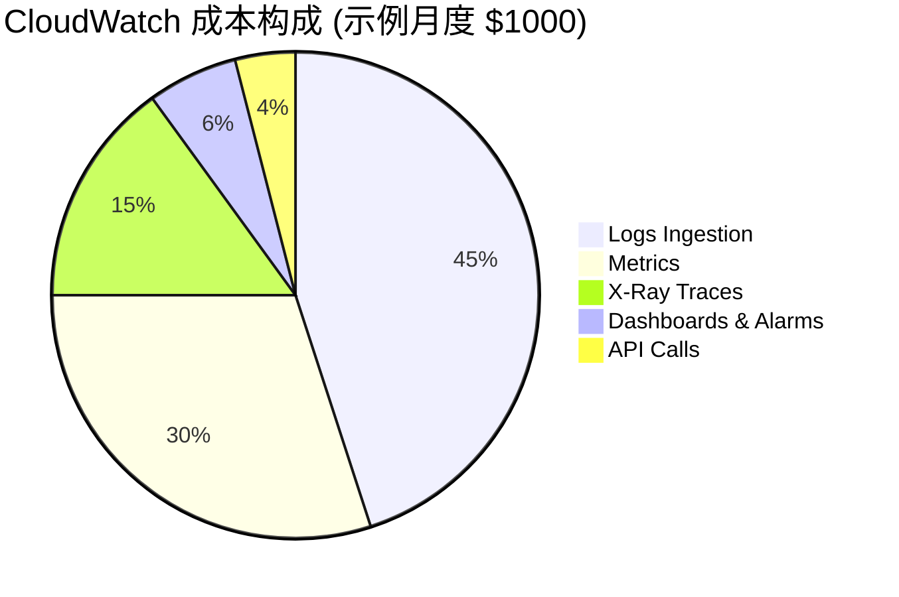

# CloudWatch 成本优化深度指南

> 将监控成本降低 50% 以上的实践策略

---

## 成本构成分析

### CloudWatch 计费模型



### 主要成本驱动因素

| 组件 | 计费方式 | 单价 | 优化潜力 |
|------|----------|------|----------|
| 日志摄入 | 按GB | $0.50/GB | 高 |
| 日志存储 | 按GB/月 | $0.03/GB | 中 |
| 自定义指标 | 按指标/月 | $0.30/指标 | 高 |
| API 调用 | 按千次 | $0.01/千次 | 中 |
| X-Ray 追踪 | 按百万条 | $5/百万 | 高 |
| 洞察扫描 | 按GB | $0.005/GB | 中 |

---

## 日志成本优化

### 1. 日志过滤策略

```python
# Lambda 日志处理器 - 过滤前处理
import json
import gzip
import boto3

class LogFilter:
    """日志过滤器 - 减少无用日志摄入"""
    
    # 定义日志级别过滤器
    LEVEL_PRIORITY = {
        'DEBUG': 0,
        'INFO': 1,
        'WARNING': 2,
        'ERROR': 3,
        'CRITICAL': 4
    }
    
    def __init__(self, min_level='INFO'):
        self.min_level = min_level
        self.filtered_count = 0
        self.total_count = 0
    
    def should_keep(self, log_record):
        """判断日志是否应该保留"""
        self.total_count += 1
        
        # 级别过滤
        level = log_record.get('level', 'INFO')
        if self.LEVEL_PRIORITY.get(level, 0) < self.LEVEL_PRIORITY[self.min_level]:
            self.filtered_count += 1
            return False
        
        # 健康检查日志过滤
        if log_record.get('message', '').startswith('Health check'):
            # 采样健康检查日志 (仅保留 1%)
            import random
            if random.random() > 0.01:
                self.filtered_count += 1
                return False
        
        # 重复错误聚合
        if self._is_duplicate_error(log_record):
            return False
        
        return True
    
    def _is_duplicate_error(self, log_record, window_seconds=60):
        """检测重复错误 (需要 Redis/DynamoDB 实现)"""
        # 简化示例
        return False
    
    def get_stats(self):
        """获取过滤统计"""
        if self.total_count == 0:
            return {'filter_rate': 0}
        
        return {
            'total': self.total_count,
            'filtered': self.filtered_count,
            'kept': self.total_count - self.filtered_count,
            'filter_rate': self.filtered_count / self.total_count * 100
        }

# Kinesis Firehose 转换 Lambda
def transform_log_event(event):
    """Firehose 日志转换 - 实时过滤"""
    
    filter_processor = LogFilter(min_level='INFO')
    
    output_records = []
    for record in event['records']:
        payload = json.loads(base64.b64decode(record['data']))
        
        if filter_processor.should_keep(payload):
            output_records.append({
                'recordId': record['recordId'],
                'result': 'Ok',
                'data': record['data']
            })
        else:
            # 丢弃记录
            output_records.append({
                'recordId': record['recordId'],
                'result': 'Dropped',
                'data': ''
            })
    
    return {'records': output_records}
```

### 2. 日志压缩与格式化

```python
# 结构化日志 - 减少冗余信息
import json

class OptimizedLogger:
    """优化日志格式以减少体积"""
    
    # 字段名缩写映射
    FIELD_ABBREVIATIONS = {
        'timestamp': 'ts',
        'level': 'lvl',
        'message': 'msg',
        'request_id': 'rid',
        'user_id': 'uid',
        'duration_ms': 'dur',
        'status_code': 'code'
    }
    
    def __init__(self, use_abbreviations=True):
        self.use_abbreviations = use_abbreviations
    
    def log(self, level, message, **kwargs):
        """输出压缩格式日志"""
        
        record = {
            'ts': datetime.utcnow().isoformat(),
            'lvl': level,
            'msg': message
        }
        
        # 只记录非空值
        for key, value in kwargs.items():
            if value is not None and value != '':
                short_key = self.FIELD_ABBREVIATIONS.get(key, key)
                record[short_key] = value
        
        # 使用紧凑JSON格式
        return json.dumps(record, separators=(',', ':'))

# 对比：传统日志 vs 优化日志
# 传统: 450 bytes
{
    "timestamp": "2026-03-02T10:30:00Z",
    "level": "INFO",
    "message": "Request processed",
    "request_id": "req-123",
    "user_id": "user-456",
    "duration_ms": 150,
    "status_code": 200
}

# 优化: 180 bytes (节省 60%)
{"ts":"2026-03-02T10:30:00Z","lvl":"INFO","msg":"Request processed","rid":"req-123","uid":"user-456","dur":150,"code":200}
```

### 3. 日志生命周期管理

```yaml
# CloudFormation: 日志生命周期策略
Resources:
  ApplicationLogGroup:
    Type: AWS::Logs::LogGroup
    Properties:
      LogGroupName: /myapp/production
      RetentionInDays: 14  # 短期保留
      
  LogArchiveBucket:
    Type: AWS::S3::Bucket
    Properties:
      BucketName: myapp-log-archive
      LifecycleConfiguration:
        Rules:
          - Id: ArchiveToGlacier
            Status: Enabled
            Transitions:
              - StorageClass: GLACIER
                TransitionInDays: 30
            ExpirationInDays: 365

  # 日志导出任务 (每日执行)
  LogExportFunction:
    Type: AWS::Lambda::Function
    Properties:
      Code:
        ZipFile: |
          import boto3
          import os
          from datetime import datetime, timedelta
          
          def handler(event, context):
              logs = boto3.client('logs')
              
              # 导出昨天到 S3
              yesterday = datetime.utcnow() - timedelta(days=1)
              start_time = int(yesterday.replace(hour=0, minute=0, second=0).timestamp() * 1000)
              end_time = int(yesterday.replace(hour=23, minute=59, second=59).timestamp() * 1000)
              
              logs.create_export_task(
                  logGroupName='/myapp/production',
                  fromTime=start_time,
                  to=end_time,
                  destination='myapp-log-archive',
                  destinationPrefix=f'logs/{yesterday.strftime("%Y/%m/%d")}/'
              )
      Handler: index.handler
      Runtime: python3.11
      Timeout: 60
      Events:
        DailyTrigger:
          Type: Schedule
          Properties:
            Schedule: rate(1 day)
```

---

## 指标成本优化

### 1. 维度优化策略

```python
# 高基数维度问题示例
class BadMetricsExample:
    """避免：高基数维度导致成本爆炸"""
    
    def record_api_latency(self, user_id, request_id, endpoint):
        # 问题：每个 user_id 和 request_id 都是唯一维度值
        # 结果：产生数百万个唯一指标组合
        cloudwatch.put_metric_data(
            Namespace='BadMetrics',
            MetricData=[{
                'MetricName': 'APILatency',
                'Dimensions': [
                    {'Name': 'UserId', 'Value': user_id},        # 高基数！
                    {'Name': 'RequestId', 'Value': request_id},  # 高基数！
                    {'Name': 'Endpoint', 'Value': endpoint}
                ],
                'Value': latency,
                'Unit': 'Milliseconds'
            }]
        )

class GoodMetricsExample:
    """正确：低基数维度，高信息价值"""
    
    def record_api_latency(self, user_tier, endpoint, status_code):
        # 正确：维度值有限且有意义
        cloudwatch.put_metric_data(
            Namespace='GoodMetrics',
            MetricData=[{
                'MetricName': 'APILatency',
                'Dimensions': [
                    {'Name': 'UserTier', 'Value': user_tier},      # 低基数: free/premium/enterprise
                    {'Name': 'Endpoint', 'Value': endpoint},        # 中等基数: API路径
                    {'Name': 'StatusCode', 'Value': status_code}    # 低基数: HTTP状态码
                ],
                'Value': latency,
                'Unit': 'Milliseconds'
            }]
        )
```

### 2. EMF 成本效益

```python
# 使用 EMF 替代 PutMetricData API 调用
import json

class EMFCostCalculator:
    """EMF 成本计算器"""
    
    @staticmethod
    def calculate_savings(records_per_month):
        """计算使用 EMF 的节省"""
        
        # 传统 PutMetricData
        # $0.01 per 1000 requests
        traditional_cost = (records_per_month / 1000) * 0.01
        
        # EMF 通过 CloudWatch Logs
        # 假设每条 EMF 日志 200 bytes
        emf_gb = (records_per_month * 200) / (1024**3)
        emf_cost = emf_gb * 0.50  # Logs ingestion
        
        savings = traditional_cost - emf_cost
        savings_percent = (savings / traditional_cost * 100) if traditional_cost > 0 else 0
        
        return {
            'traditional_cost': traditional_cost,
            'emf_cost': emf_cost,
            'savings': savings,
            'savings_percent': savings_percent
        }

# 示例: 每月 1000 万条记录
calc = EMFCostCalculator()
result = calc.calculate_savings(10_000_000)
# 结果: 节省 95% 以上成本
```

### 3. 预聚合策略

```python
# 应用内预聚合 - 减少 CloudWatch API 调用
import time
from collections import defaultdict
import threading

class MetricAggregator:
    """指标预聚合器"""
    
    def __init__(self, flush_interval_seconds=60):
        self.buffers = defaultdict(list)
        self.lock = threading.Lock()
        self.flush_interval = flush_interval_seconds
        
        # 启动后台刷新线程
        self._start_flusher()
    
    def record(self, metric_name, value, dimensions):
        """记录指标值"""
        key = (metric_name, tuple(sorted(dimensions.items())))
        
        with self.lock:
            self.buffers[key].append({
                'value': value,
                'timestamp': time.time()
            })
    
    def _flush(self):
        """刷新聚合后的指标到 CloudWatch"""
        
        with self.lock:
            buffers_to_flush = self.buffers
            self.buffers = defaultdict(list)
        
        metric_data = []
        
        for (metric_name, dims_tuple), values in buffers_to_flush.items():
            if not values:
                continue
            
            dims_list = [{'Name': k, 'Value': v} for k, v in dims_tuple]
            
            # 计算统计值
            vals = [v['value'] for v in values]
            
            # 只发送统计值，而不是原始值
            metric_data.extend([
                {
                    'MetricName': f'{metric_name}-avg',
                    'Dimensions': dims_list,
                    'Value': sum(vals) / len(vals),
                    'Unit': 'None'
                },
                {
                    'MetricName': f'{metric_name}-max',
                    'Dimensions': dims_list,
                    'Value': max(vals),
                    'Unit': 'None'
                },
                {
                    'MetricName': f'{metric_name}-count',
                    'Dimensions': dims_list,
                    'Value': len(vals),
                    'Unit': 'Count'
                }
            ])
        
        # 批量发送
        if metric_data:
            cloudwatch.put_metric_data(
                Namespace='MyApp/Aggregated',
                MetricData=metric_data
            )
    
    def _start_flusher(self):
        """启动定期刷新"""
        def flusher():
            while True:
                time.sleep(self.flush_interval)
                self._flush()
        
        thread = threading.Thread(target=flusher, daemon=True)
        thread.start()
```

---

## X-Ray 成本优化

### 1. 智能采样策略

```python
# X-Ray 采样规则配置
{
  "version": 2,
  "default": {
    "fixed_target": 1,
    "rate": 0.1
  },
  "rules": [
    {
      "description": "关键 API - 高采样率",
      "service_name": "*",
      "http_method": "POST",
      "url_path": "/api/v1/payments/*",
      "fixed_target": 10,
      "rate": 1.0
    },
    {
      "description": "健康检查 - 低采样率",
      "service_name": "*",
      "http_method": "GET",
      "url_path": "/health",
      "fixed_target": 0,
      "rate": 0.01
    },
    {
      "description": "静态资源 - 不采样",
      "service_name": "*",
      "url_path": "/static/*",
      "fixed_target": 0,
      "rate": 0
    }
  ]
}
```

### 2. 采样决策逻辑

```python
from aws_xray_sdk.core import xray_recorder

class SmartSampler:
    """智能采样决策器"""
    
    def __init__(self):
        self.error_sampling_rate = 1.0  # 错误 100% 采样
        self.slow_request_threshold_ms = 1000
        self.slow_request_sampling_rate = 0.5
    
    def should_sample(self, request_path, is_error=False, latency_ms=None):
        """决定是否采样"""
        
        # 错误请求总是采样
        if is_error:
            return True
        
        # 慢请求提高采样率
        if latency_ms and latency_ms > self.slow_request_threshold_ms:
            import random
            return random.random() < self.slow_request_sampling_rate
        
        # 其他请求使用默认采样率
        return None  # 让 X-Ray SDK 决定
    
    def before_request(self, request):
        """请求前处理"""
        # 设置采样决策
        xray_recorder.configure(
            sampling=True,
            sampling_rules=self._get_rules_for_path(request.path)
        )
    
    def after_request(self, request, response, latency_ms):
        """请求后处理 - 基于结果的采样决策"""
        
        is_error = response.status_code >= 500
        
        # 如果应该采样但未采样，手动强制采样
        if self.should_sample(request.path, is_error, latency_ms):
            segment = xray_recorder.current_segment()
            if segment:
                segment.sampled = True

# 成本影响计算
class XRayCostEstimator:
    """X-Ray 成本估算"""
    
    def estimate_monthly_cost(
        self,
        requests_per_month,
        current_sampling_rate,
        target_sampling_rate
    ):
        current_traces = requests_per_month * current_sampling_rate
        target_traces = requests_per_month * target_sampling_rate
        
        # 前 100,000 traces 免费
        current_billable = max(0, current_traces - 100000)
        target_billable = max(0, target_traces - 100000)
        
        # $5 per million traces
        current_cost = (current_billable / 1_000_000) * 5
        target_cost = (target_billable / 1_000_000) * 5
        
        return {
            'current_cost': current_cost,
            'target_cost': target_cost,
            'savings': current_cost - target_cost,
            'savings_percent': ((current_cost - target_cost) / current_cost * 100) 
                               if current_cost > 0 else 0
        }

# 示例：每月 1 亿请求，采样率从 10% 降到 5%  
estimator = XRayCostEstimator()
result = estimator.estimate_monthly_cost(
    requests_per_month=100_000_000,
    current_sampling_rate=0.10,
    target_sampling_rate=0.05
)
# 结果: 节省 $25/月
```

---

## 综合成本优化框架

```python
# 成本优化检查清单
class CostOptimizationChecklist:
    """成本优化检查清单"""
    
    CHECKS = {
        'logs': [
            {'name': '启用日志过滤', 'potential_savings': '20-40%'},
            {'name': '缩短保留期', 'potential_savings': '10-30%'},
            {'name': '启用压缩', 'potential_savings': '30-50%'},
            {'name': '使用 S3 归档', 'potential_savings': '60-80%'},
            {'name': '优化日志格式', 'potential_savings': '10-20%'}
        ],
        'metrics': [
            {'name': '使用 EMF 格式', 'potential_savings': '80-95%'},
            {'name': '减少高基数维度', 'potential_savings': '50-90%'},
            {'name': '应用内预聚合', 'potential_savings': '70-90%'},
            {'name': '删除未使用指标', 'potential_savings': '10-30%'},
            {'name': '启用详细监控选择性', 'potential_savings': '20-40%'}
        ],
        'xray': [
            {'name': '配置采样规则', 'potential_savings': '40-80%'},
            {'name': '排除健康检查', 'potential_savings': '10-20%'},
            {'name': '基于错误智能采样', 'potential_savings': '20-40%'}
        ],
        'dashboards': [
            {'name': '删除未使用仪表板', 'potential_savings': '5-15%'},
            {'name': '减少刷新频率', 'potential_savings': '5-10%'},
            {'name': '使用 Logs Insights 替代', 'potential_savings': '30-50%'}
        ]
    }
    
    @classmethod
    def generate_report(cls, current_monthly_cost):
        """生成优化报告"""
        
        total_potential_savings = 0
        recommendations = []
        
        for category, checks in cls.CHECKS.items():
            for check in checks:
                # 解析节省百分比范围
                savings_range = check['potential_savings'].strip('%').split('-')
                avg_savings = (int(savings_range[0]) + int(savings_range[1])) / 200
                
                potential_amount = current_monthly_cost * avg_savings
                total_potential_savings += potential_amount * 0.2  # 保守估计 20% 可实现
                
                recommendations.append({
                    'category': category,
                    'action': check['name'],
                    'potential_savings': check['potential_savings'],
                    'estimated_monthly_saving': potential_amount * 0.2
                })
        
        return {
            'current_monthly_cost': current_monthly_cost,
            'total_potential_savings': total_potential_savings,
            'savings_percentage': (total_potential_savings / current_monthly_cost * 100),
            'recommendations': sorted(recommendations, 
                                    key=lambda x: x['estimated_monthly_saving'], 
                                    reverse=True)
        }

# 使用示例
checklist = CostOptimizationChecklist()
report = checklist.generate_report(current_monthly_cost=1000)
print(f"潜在月度节省: ${report['total_potential_savings']:.2f} ({report['savings_percentage']:.1f}%)")
```

---

## 监控优化路线图

| 阶段 | 时间 | 重点 | 预期节省 |
|------|------|------|----------|
| 快速获胜 | 第1周 | 日志过滤、EMF 迁移 | 30-50% |
| 短期优化 | 第2-4周 | 采样优化、保留期调整 | 20-30% |
| 中期重构 | 第1-3月 | 架构调整、预聚合 | 20-40% |
| 长期优化 | 第3-6月 | 智能采样、自动化 | 10-20% |

---

*持续优化，持续节省*
