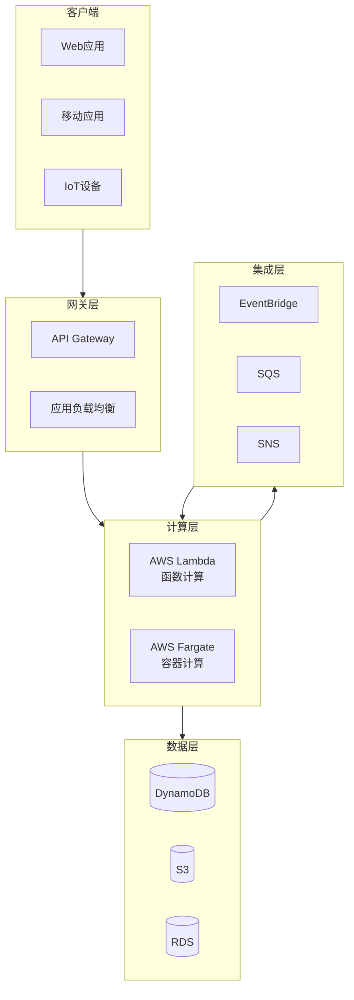
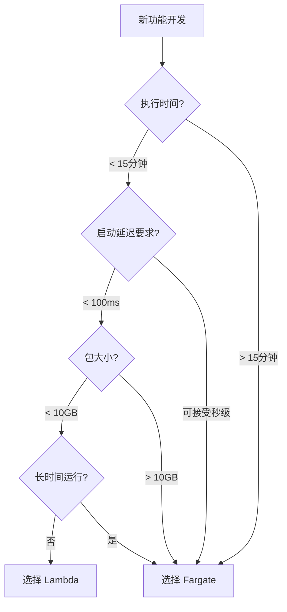

# Serverless 技术资源

> AWS 无服务器计算技术资源  
> Lambda & Fargate Deep Dive

---

## 🎯 主题介绍

本主题深入讲解 AWS 无服务器计算的核心服务：

- **AWS Lambda** - 事件驱动的函数计算服务
- **AWS Fargate** - 无服务器容器计算引擎
- **Docker 与容器化** - Lambda 容器镜像、Fargate 容器部署

学习如何构建现代化、自动扩展、按需付费的云原生应用。

---

## 🏗️ 架构概览

### Serverless 计算架构



### Lambda vs Fargate 选择指南



---

## 📚 多语言资源

| 语言 | 目录 | 状态 | 规模 |
|------|------|------|------|
| 🇨🇳 中文 | [./zh/](./zh/) | ✅ 可用 | 核心文档 |

---

## 📖 内容清单

### 电子书 (ebooks/)

| 文档 | 说明 |
|------|------|
| `README.md` | 导航索引 |
| `Serverless_Whitepaper.md` | 技术白皮书 (10章) |
| `Serverless_Quick_Reference.md` | 速查手册 |
| `Serverless_Learning_Roadmap.md` | 16周学习路线图 |

### 技术文档 (materials/)

| 文档 | 内容 |
|------|------|
| `aws_lambda_deep_dive.md` | Lambda 深度解析 |
| `aws_fargate_deep_dive.md` | Fargate 深度解析 |
| `lambda_fargate_integration.md` | 集成模式与最佳实践 |

---

## 💻 实践项目

| 项目 | 难度 | 技术栈 | 目录 |
|------|------|--------|------|
| Serverless REST API | ⭐ 入门 | Lambda + API Gateway + DynamoDB | [./projects/01-serverless-api/](./projects/01-serverless-api/) |
| 容器化微服务 | ⭐⭐ 进阶 | Fargate + ALB + RDS | [./projects/02-containerized-service/](./projects/02-containerized-service/) |
| 混合架构数据处理 | ⭐⭐⭐ 高级 | Lambda + Fargate + SQS + S3 | [./projects/03-hybrid-data-processing/](./projects/03-hybrid-data-processing/) |

---

## 🚀 快速开始

### 中文用户

```bash
cd zh/ebooks/
cat README.md
```

### 学习路径

1. **新手**: 白皮书第1-3章 → 项目1
2. **进阶**: 全部白皮书 → 项目2
3. **专家**: 集成模式 → 项目3

---

## 📊 资源统计

| 指标 | 数量 |
|------|------|
| **电子书** | 3本 |
| **技术文档** | 3篇 |
| **实践项目** | 3个 |
| **架构图** | 25+ |
| **代码示例** | 30+ |

---

**开始您的 Serverless 之旅！** 🚀
