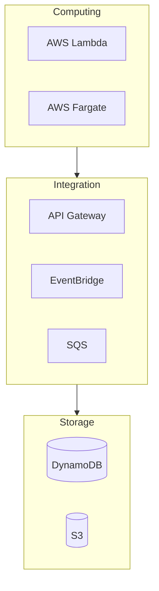

# Serverless Technical Resources Navigation

> Complete learning guide for AWS Serverless Computing

---

## 📚 Resource Overview

This topic deeply covers AWS serverless computing core services.

### Core Services

- **AWS Lambda** - Event-driven function computing
- **AWS Fargate** - Serverless container computing



---

## 📖 Document List

### E-books (ebooks/)

| Document | Description | Use Case |
|----------|-------------|----------|
| `Serverless_Whitepaper.md` | **Technical Whitepaper** | Deep learning, reference |
| `Serverless_Quick_Reference.md` | **Quick Reference** | Daily development |
| `Serverless_Learning_Roadmap.md` | **16-Week Learning Plan** | Structured learning |

### Technical Documents (materials/)

| Document | Content |
|----------|---------|
| `aws_lambda_deep_dive.md` | Lambda deep dive |
| `aws_fargate_deep_dive.md` | Fargate deep dive |
| `lambda_fargate_integration.md` | Integration patterns |

---

## 💻 Practice Projects

| Project | Difficulty | Tech Stack |
|---------|------------|------------|
| Serverless REST API | ⭐ Beginner | Lambda + API Gateway |
| Containerized Microservices | ⭐⭐ Intermediate | Fargate + ALB |
| Hybrid Data Processing | ⭐⭐⭐ Advanced | Lambda + Fargate |

---

## 🚀 Quick Start

```bash
cd en/ebooks/
cat README.md
```

**Start your Serverless journey!** 🚀
