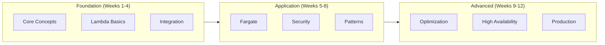

# AWS Serverless Learning Roadmap

> 12-Week Journey from Beginner to Expert

---

## Learning Path Overview

---

## Week 1-4: Foundation

### Week 1: Serverless Concepts
- Understand the Serverless execution model
- Explore AWS Serverless service landscape
- Learn about event-driven architecture
- **Hands-on**: Create your first Lambda function

### Week 2: Lambda Fundamentals
- Deep dive into Lambda execution environment
- Understand cold starts and warm starts
- Learn concurrency and scaling behavior
- **Hands-on**: Build a CRUD API with API Gateway + Lambda

### Week 3: Integration Patterns
- S3, SQS, SNS, EventBridge integrations
- DynamoDB Streams and Kinesis
- Step Functions for orchestration
- **Hands-on**: Build an event-driven processing pipeline

### Week 4: Infrastructure as Code
- AWS SAM fundamentals
- CloudFormation basics
- Local testing with SAM CLI
- **Project**: Deploy a multi-function application with SAM

---

## Week 5-8: Application Development

### Week 5: Fargate and Containers
- Fargate vs Lambda decision matrix
- Container image optimization
- Task definitions and service deployment
- **Hands-on**: Deploy a containerized web app on Fargate

### Week 6: Security Best Practices
- IAM least privilege for Lambda
- VPC networking for Fargate
- Secrets management with Secrets Manager
- **Hands-on**: Secure a Lambda function with VPC and encryption

### Week 7: Advanced Patterns
- Saga pattern with Step Functions
- CQRS and event sourcing
- Fan-out and fan-in patterns
- **Hands-on**: Implement a Saga for order processing

### Week 8: Observability
- CloudWatch Logs and Metrics
- X-Ray distributed tracing
- Structured logging best practices
- **Project**: Add comprehensive monitoring to Week 4 project

---

## Week 9-12: Advanced Topics

### Week 9: Performance Optimization
- Cold start mitigation strategies
- Provisioned Concurrency tuning
- Memory and CPU optimization
- **Hands-on**: Optimize a Lambda function for sub-100ms response

### Week 10: High Availability
- Multi-region deployments
- Disaster recovery strategies
- Health checks and circuit breakers
- **Hands-on**: Build a multi-region Serverless application

### Week 11: Cost Optimization
- Understanding Serverless pricing models
- Reserved capacity and Savings Plans
- Cost monitoring and alerting
- **Hands-on**: Implement cost optimization for a production workload

### Week 12: Production Readiness
- CI/CD pipelines for Serverless
- Blue-green and canary deployments
- Disaster recovery testing
- **Capstone Project**: End-to-end production Serverless platform

---

## Recommended Resources

### Documentation
- [AWS Lambda Developer Guide](https://docs.aws.amazon.com/lambda/latest/dg/)
- [AWS SAM Developer Guide](https://docs.aws.amazon.com/serverless-application-model/)

### Books
- "Serverless Architectures on AWS" by Peter Sbarski
- "AWS Lambda in Action" by Danilo Poccia

### Certifications
- AWS Certified Developer - Associate
- AWS Certified Solutions Architect - Associate
- AWS Certified DevOps Engineer - Professional

---

**Start your Serverless journey today!** 🚀
