# Serverless Learning Roadmap

> Master AWS Serverless Computing in 16 Weeks

---

## 🗺️ Learning Path Overview

```mermaid
flowchart LR
    subgraph Foundation["Foundation Phase<br/>Weeks 1-4"]
        F1[Serverless Concepts]
        F2[Lambda Basics]
        F3[API Gateway]
        F4[Event-Driven]
    end
    
    subgraph Intermediate["Intermediate Phase<br/>Weeks 5-8"]
        I1[Fargate Introduction]
        I2[Containerization]
        I3[Service Orchestration]
        I4[CI/CD]
    end
    
    subgraph Advanced["Advanced Phase<br/>Weeks 9-12"]
        A1[Hybrid Architecture]
        A2[Performance Optimization]
        A3[Security Best Practices]
        A4[Monitoring & Alerting]
    end
    
    subgraph Production["Production Phase<br/>Weeks 13-16"]
        P1[Cost Optimization]
        P2[Troubleshooting]
        P3[Large-Scale Design]
        P4[Project Implementation]
    end
    
    Foundation --> Intermediate --> Advanced --> Production
```



---

## 📅 Detailed Learning Plan

### Phase 1: Serverless Foundation (Weeks 1-4)

#### Week 1: Serverless Concepts & AWS Introduction

**Learning Objectives**: Understand core Serverless concepts

**Learning Content**:
- [ ] What is Serverless computing
- [ ] Serverless vs Traditional Servers
- [ ] Overview of AWS Serverless services
- [ ] Create AWS account and configure CLI

**Hands-on Tasks**:
```bash
# Install AWS CLI
pip install awscli
aws configure

# Verify configuration
aws sts get-caller-identity
```

**Estimated Time**: 5-7 hours

---

#### Week 2: Lambda Fundamentals

**Learning Objectives**: Master Lambda core concepts and basic operations

**Learning Content**:
- [ ] Lambda execution model (cold start/warm start)
- [ ] Function configuration (memory, timeout, runtime)
- [ ] Event sources and triggers
- [ ] Environment variables and permissions

**Hands-on Tasks**:
1. Create your first Lambda function (Python)
2. Configure API Gateway trigger
3. Test and view logs

**Code Example**:
```python
def lambda_handler(event, context):
    return {
        'statusCode': 200,
        'body': 'Hello, Serverless!'
    }
```

**Estimated Time**: 8-10 hours

---

#### Week 3: API Gateway & REST API

**Learning Objectives**: Build complete Serverless APIs

**Learning Content**:
- [ ] API Gateway types (REST vs HTTP vs WebSocket)
- [ ] Resource and method configuration
- [ ] Request/response mapping
- [ ] Authentication and authorization (Cognito, IAM, Lambda Authorizer)

**Hands-on Tasks**:
1. Design RESTful API (User Management)
2. Integrate Lambda and DynamoDB
3. Implement JWT authentication

**Project**: Build User Registration/Login API

**Estimated Time**: 10-12 hours

---

#### Week 4: Event-Driven Architecture

**Learning Objectives**: Understand asynchronous processing and event-driven patterns

**Learning Content**:
- [ ] SQS queues and message processing
- [ ] SNS notification service
- [ ] EventBridge event bus
- [ ] Event pattern design

**Hands-on Tasks**:
1. Implement SQS-triggered Lambda
2. Configure SNS topics and subscriptions
3. Use EventBridge to orchestrate events

**Architecture Exercise**:
```
S3 Upload → EventBridge → Lambda Processing → SNS Notification
```

**Estimated Time**: 8-10 hours

---

### Phase 2: Containerization & Fargate (Weeks 5-8)

#### Week 5: Docker Basics & ECS Introduction

**Learning Objectives**: Master containerization fundamentals

**Learning Content**:
- [ ] Docker core concepts
- [ ] Dockerfile writing
- [ ] ECS basics (clusters, tasks, services)
- [ ] ECR container registry

**Hands-on Tasks**:
1. Write Dockerfile
2. Build and push image to ECR
3. Create ECS cluster

**Estimated Time**: 10-12 hours

---

#### Week 6: Fargate Deep Dive

**Learning Objectives**: Master Fargate serverless containers

**Learning Content**:
- [ ] Fargate vs EC2 launch types
- [ ] Task definitions in detail
- [ ] awsvpc networking mode
- [ ] Service discovery and load balancing

**Hands-on Tasks**:
1. Create Fargate task definition
2. Deploy web application to Fargate
3. Configure ALB load balancing

**Estimated Time**: 10-12 hours

---

#### Week 7: Service Orchestration & Scaling

**Learning Objectives**: Implement production-grade container orchestration

**Learning Content**:
- [ ] ECS service configuration
- [ ] Auto-scaling policies
- [ ] Rolling deployments and blue-green deployments
- [ ] Capacity Providers

**Hands-on Tasks**:
1. Configure CPU/Memory auto-scaling
2. Implement rolling updates
3. Use Fargate Spot for cost savings

**Estimated Time**: 8-10 hours

---

#### Week 8: CI/CD & Infrastructure as Code

**Learning Objectives**: Implement automated deployment

**Learning Content**:
- [ ] AWS SAM framework
- [ ] AWS CDK basics
- [ ] CodePipeline and CodeBuild
- [ ] GitHub Actions integration

**Hands-on Tasks**:
1. Deploy Lambda using SAM
2. Deploy Fargate service using CDK
3. Configure CI/CD pipeline

**Estimated Time**: 10-12 hours

---

### Phase 3: Advanced Topics (Weeks 9-12)

#### Week 9: Lambda + Fargate Hybrid Architecture

**Learning Objectives**: Design hybrid serverless architecture

**Learning Content**:
- [ ] Lambda vs Fargate selection criteria
- [ ] Service-to-service communication patterns
- [ ] Event-driven task distribution
- [ ] Saga pattern implementation

**Hands-on Tasks**:
1. Lambda triggers Fargate task
2. Implement distributed transactions
3. Build complex workflows

**Architecture Design**:
```
API Gateway → Lambda (Validation) → EventBridge → Fargate (Processing)
```

**Estimated Time**: 10-12 hours

---

#### Week 10: Performance Optimization

**Learning Objectives**: Optimize Serverless application performance

**Learning Content**:
- [ ] Lambda cold start optimization
- [ ] Provisioned concurrency configuration
- [ ] Fargate image optimization
- [ ] Caching strategies

**Hands-on Tasks**:
1. Use Lambda Power Tuning tool
2. Configure Provisioned Concurrency
3. Multi-stage Docker builds

**Estimated Time**: 8-10 hours

---

#### Week 11: Security Best Practices

**Learning Objectives**: Build secure Serverless applications

**Learning Content**:
- [ ] IAM least privilege principle
- [ ] VPC and network security
- [ ] Secrets management
- [ ] Compliance and auditing

**Hands-on Tasks**:
1. Configure VPC network isolation
2. Use Secrets Manager
3. Enable CloudTrail auditing

**Estimated Time**: 8-10 hours

---

#### Week 12: Monitoring & Observability

**Learning Objectives**: Implement comprehensive application monitoring

**Learning Content**:
- [ ] CloudWatch metrics and logs
- [ ] X-Ray distributed tracing
- [ ] Container Insights
- [ ] Custom metrics and alerts

**Hands-on Tasks**:
1. Configure structured logging
2. Integrate X-Ray tracing
3. Create CloudWatch Dashboard

**Estimated Time**: 8-10 hours

---

### Phase 4: Production Practices (Weeks 13-16)

#### Week 13: Cost Optimization

**Learning Objectives**: Optimize Serverless costs

**Learning Content**:
- [ ] Lambda pricing model analysis
- [ ] Fargate Spot usage
- [ ] Reserved capacity and Savings Plans
- [ ] Cost monitoring and budgeting

**Hands-on Tasks**:
1. Analyze CloudWatch billing
2. Configure Fargate Spot
3. Set up budget alerts

**Estimated Time**: 6-8 hours

---

#### Week 14: Troubleshooting & Debugging

**Learning Objectives**: Master problem diagnosis skills

**Learning Content**:
- [ ] Common errors and solutions
- [ ] Log analysis techniques
- [ ] Distributed tracing analysis
- [ ] Performance bottleneck identification

**Hands-on Tasks**:
1. Simulate and resolve cold start issues
2. Analyze timeout errors
3. Debug network connection issues

**Estimated Time**: 8-10 hours

---

#### Week 15: Large-Scale Design

**Learning Objectives**: Design highly available, high-concurrency Serverless applications

**Learning Content**:
- [ ] Multi-region deployment
- [ ] Traffic management and routing
- [ ] Disaster recovery strategies
- [ ] Rate limiting and degradation

**Hands-on Tasks**:
1. Design multi-AZ architecture
2. Configure Global Accelerator
3. Implement circuit breaker pattern

**Estimated Time**: 10-12 hours

---

#### Week 16: Comprehensive Project Implementation

**Learning Objectives**: Integrate learned knowledge to complete a project

**Project Options**:

**Option A: Serverless E-commerce Platform**
- User Service (Lambda + API Gateway)
- Order Processing (Lambda + SQS + DynamoDB)
- Inventory Service (Fargate + RDS)
- Reporting & Analytics (Lambda + Athena)

**Option B: Real-time Data Processing Platform**
- Data Ingestion (Kinesis + Lambda)
- Stream Processing (Fargate + Custom Application)
- Data Storage (S3 + DynamoDB)
- Visualization (Lambda + QuickSight)

**Deliverables**:
- [ ] Architecture design document
- [ ] Complete code implementation
- [ ] CI/CD pipeline
- [ ] Deployment documentation

**Estimated Time**: 15-20 hours

---

## 📊 Progress Tracking

Copy the following checklist to track your learning progress:

### Foundation Phase
- [ ] Week 1: Serverless Concepts
- [ ] Week 2: Lambda Fundamentals
- [ ] Week 3: API Gateway
- [ ] Week 4: Event-Driven Architecture

### Intermediate Phase
- [ ] Week 5: Docker & ECS
- [ ] Week 6: Fargate Deep Dive
- [ ] Week 7: Service Orchestration
- [ ] Week 8: CI/CD

### Advanced Phase
- [ ] Week 9: Hybrid Architecture
- [ ] Week 10: Performance Optimization
- [ ] Week 11: Security Best Practices
- [ ] Week 12: Monitoring & Alerting

### Production Phase
- [ ] Week 13: Cost Optimization
- [ ] Week 14: Troubleshooting
- [ ] Week 15: Large-Scale Design
- [ ] Week 16: Comprehensive Project

---

## 📚 Recommended Resources

### Official Documentation
- [AWS Lambda Documentation](https://docs.aws.amazon.com/lambda/)
- [Amazon ECS Documentation](https://docs.aws.amazon.com/AmazonECS/latest/developerguide/)
- [AWS SAM Documentation](https://docs.aws.amazon.com/serverless-application-model/)

### Online Courses
- AWS Serverless Learning Plan
- A Cloud Guru Serverless Courses
- Udemy AWS Serverless Courses

### Community Resources
- Serverless Framework Documentation
- AWS Compute Blog
- AWS Samples GitHub

---

## 🎯 Certification Preparation

After completing this roadmap, you can prepare for the following certifications:

- **AWS Certified Developer - Associate**
- **AWS Certified Solutions Architect - Associate**
- **AWS Certified DevOps Engineer - Professional**

---

*Learning Plan Version: v1.0*  
*Estimated Total Duration: 160-200 hours*  
*Recommended Study Pace: 10-15 hours per week*
