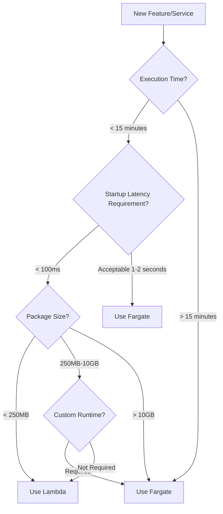

# Serverless Quick Reference

> Lambda & Fargate Quick Reference Guide

---

## 🚀 Lambda Quick Reference

### CLI Commands

```bash
# Create function
aws lambda create-function \
    --function-name my-function \
    --runtime python3.11 \
    --role arn:aws:iam::account:role/lambda-role \
    --handler lambda_function.lambda_handler \
    --zip-file fileb://function.zip

# Update code
aws lambda update-function-code \
    --function-name my-function \
    --zip-file fileb://function.zip

# Invoke for testing
aws lambda invoke \
    --function-name my-function \
    --payload '{"key": "value"}' \
    response.json

# View logs
aws logs tail /aws/lambda/my-function --follow

# Configure provisioned concurrency
aws lambda put-provisioned-concurrency-config \
    --function-name my-function \
    --qualifier PROD \
    --provisioned-concurrent-executions 100
```

### Runtimes and Memory

| Runtime | Memory Range | Timeout Limit |
|---------|--------------|---------------|
| Node.js | 128MB - 10GB | 15 minutes |
| Python | 128MB - 10GB | 15 minutes |
| Java | 128MB - 10GB | 15 minutes |
| Go | 128MB - 10GB | 15 minutes |
| .NET | 128MB - 10GB | 15 minutes |

### Memory vs vCPU

| Memory | Relative CPU | Use Case |
|--------|--------------|----------|
| 128MB | 0.5x | Simple event processing |
| 512MB | 1x | Standard API |
| 1024MB | 2x | Data processing |
| 3008MB | 6x | Compute-intensive |

### Trigger Configuration

```yaml
# SAM Template Example
Events:
  ApiEvent:
    Type: Api
    Properties:
      Path: /users
      Method: post
      
  SQSEvent:
    Type: SQS
    Properties:
      Queue: !GetAtt MyQueue.Arn
      BatchSize: 10
      
  ScheduleEvent:
    Type: Schedule
    Properties:
      Schedule: rate(5 minutes)
      
  S3Event:
    Type: S3
    Properties:
      Bucket: !Ref MyBucket
      Events: s3:ObjectCreated:*
```

### Environment Variables and Encryption

```bash
# Set environment variables
aws lambda update-function-configuration \
    --function-name my-function \
    --environment Variables={KEY1=value1,KEY2=value2}

# Use Secrets Manager
aws lambda update-function-configuration \
    --function-name my-function \
    --environment Variables={DB_SECRET=arn:aws:secretsmanager:...}
```

### Error Handling

```python
def lambda_handler(event, context):
    try:
        result = process(event)
        return {'statusCode': 200, 'body': result}
    except ValueError as e:
        # Client error
        return {'statusCode': 400, 'body': str(e)}
    except Exception as e:
        # Server error - triggers retry
        logger.exception("Error")
        raise
```

---

## 🐳 Fargate Quick Reference

### CLI Commands

```bash
# Register task definition
aws ecs register-task-definition \
    --cli-input-json file://task-definition.json

# Run task
aws ecs run-task \
    --cluster my-cluster \
    --task-definition my-task:1 \
    --launch-type FARGATE \
    --network-configuration "awsvpcConfiguration={subnets=[subnet-xxx],securityGroups=[sg-xxx]}"

# Create service
aws ecs create-service \
    --cluster my-cluster \
    --service-name my-service \
    --task-definition my-task:1 \
    --desired-count 2 \
    --launch-type FARGATE

# Update service
aws ecs update-service \
    --cluster my-cluster \
    --service-name my-service \
    --desired-count 4

# View task logs
aws logs tail /ecs/my-service --follow
```

### Task Definition Template

```json
{
    "family": "web-app",
    "networkMode": "awsvpc",
    "requiresCompatibilities": ["FARGATE"],
    "cpu": "512",
    "memory": "1024",
    "executionRoleArn": "arn:aws:iam::account:role/ecsTaskExecutionRole",
    "containerDefinitions": [
        {
            "name": "app",
            "image": "nginx:latest",
            "essential": true,
            "portMappings": [
                {
                    "containerPort": 80,
                    "protocol": "tcp"
                }
            ],
            "logConfiguration": {
                "logDriver": "awslogs",
                "options": {
                    "awslogs-group": "/ecs/web-app",
                    "awslogs-region": "us-east-1",
                    "awslogs-stream-prefix": "ecs"
                }
            }
        }
    ]
}
```

### Resource Configuration

| CPU | Memory Options | Use Case |
|-----|----------------|----------|
| 256 (.25 vCPU) | 512MB, 1GB, 2GB | Lightweight Web |
| 512 (.5 vCPU) | 1GB - 4GB | Standard Application |
| 1024 (1 vCPU) | 2GB - 8GB | Medium Service |
| 2048 (2 vCPU) | 4GB - 16GB | Compute-intensive |
| 4096 (4 vCPU) | 8GB - 30GB | High Performance |

### Pricing Quick Reference

```
Fargate Pricing (us-east-1):
├── vCPU: $0.04048 / vCPU-hour
├── Memory: $0.004445 / GB-hour
└── Storage: $0.000111 / GB-hour

Fargate Spot Discount: Up to 70%

Example (1 vCPU, 2GB, 24x7):
Monthly Cost = (0.04048 + 2×0.004445) × 730 = $36.04
```

---

## 🏗️ Architecture Decision Tree



---

## 🔧 Common Configurations

### IAM Roles

```json
// Lambda Execution Role
{
    "Version": "2012-10-17",
    "Statement": [
        {
            "Effect": "Allow",
            "Action": [
                "logs:CreateLogGroup",
                "logs:CreateLogStream",
                "logs:PutLogEvents"
            ],
            "Resource": "arn:aws:logs:*:*:*"
        }
    ]
}

// Fargate Task Execution Role
{
    "Version": "2012-10-17",
    "Statement": [
        {
            "Effect": "Allow",
            "Action": [
                "ecr:GetAuthorizationToken",
                "ecr:BatchCheckLayerAvailability",
                "ecr:GetDownloadUrlForLayer",
                "ecr:BatchGetImage",
                "logs:CreateLogStream",
                "logs:PutLogEvents"
            ],
            "Resource": "*"
        }
    ]
}
```

### VPC Configuration

```bash
# Lambda VPC Configuration
aws lambda update-function-configuration \
    --function-name my-function \
    --vpc-config SubnetIds=subnet-xxx,subnet-yyy,SecurityGroupIds=sg-xxx

# Fargate Network Configuration
aws ecs run-task \
    --network-configuration "awsvpcConfiguration={subnets=[subnet-xxx],securityGroups=[sg-xxx],assignPublicIp=DISABLED}"
```

---

## 📊 Monitoring Metrics

### Lambda Key Metrics

| Metric | Alarm Condition | Description |
|--------|-----------------|-------------|
| Duration | p99 > threshold | Execution time |
| Errors | > 0.1% | Error rate |
| Throttles | > 0 | Throttle count |
| IteratorAge | > 60s | Stream processing latency |

### Fargate Key Metrics

| Metric | Alarm Condition | Description |
|--------|-----------------|-------------|
| CPUUtilization | > 70% | CPU utilization |
| MemoryUtilization | > 80% | Memory utilization |
| RunningTaskCount | < desired | Running task count |

---

## 💰 Cost Optimization Checklist

- [ ] Use Graviton2 Architecture (ARM64)
- [ ] Lambda Memory Power Tuning
- [ ] Fargate Spot Capacity Provider
- [ ] Lambda Provisioned Concurrency (for predictable traffic)
- [ ] Reserved Instances/Compute Savings Plans
- [ ] Regular cleanup of unused resources
- [ ] Enable Cost Explorer budget alerts

---

## 🔗 Quick Links

- [Lambda Quotas](https://docs.aws.amazon.com/lambda/latest/dg/gettingstarted-limits.html)
- [Fargate Pricing](https://aws.amazon.com/fargate/pricing/)
- [SAM Documentation](https://docs.aws.amazon.com/serverless-application-model/)
- [CDK Documentation](https://docs.aws.amazon.com/cdk/)

---

*Last Updated: 2026-03-01*
