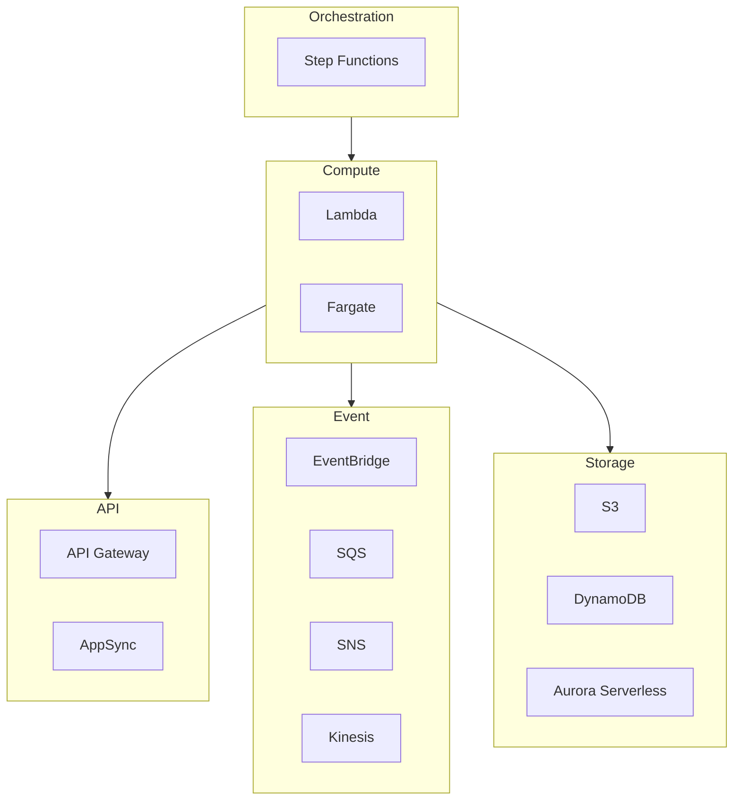
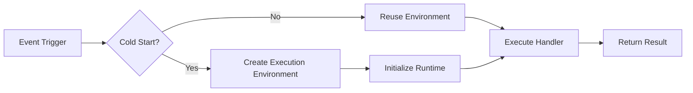
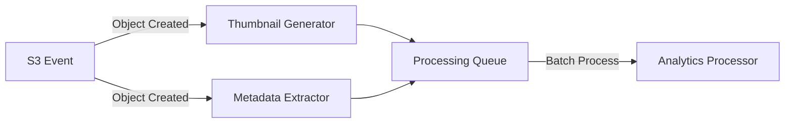

# AWS Serverless Technical Whitepaper

> A Comprehensive Guide to Building Modern Serverless Applications

---

## Table of Contents

> **Learning Guide**: This whitepaper follows a "Concept → Technology → Practice → Optimization" learning path. Chapters 1-4 are foundational essentials, while chapters 5-12 cover advanced topics.

1. **[Serverless Overview](#1-serverless-overview)**  
   *Establish foundational understanding: Grasp core Serverless concepts, AWS service landscape, and use case scenarios to build a conceptual foundation for subsequent technical learning.*

2. **[Lambda Deep Dive](#2-lambda-deep-dive)**  
   *Master the core compute service: Deep dive into Lambda execution models, concurrency management, and IAM permissions—the cornerstone of Serverless development.*

3. **[Fargate Deep Dive](#3-fargate-deep-dive)**  
   *Expand compute options: After contrasting with Lambda, learn containerized Fargate to understand when to choose Serverless containers over functions.*

4. **[Integration and Patterns](#4-integration-and-patterns)**  
   *Build complete architectures: Learn how Lambda/Fargate integrates with event sources, storage, and APIs; master async, stream processing, and orchestration patterns.*

5. **[Docker and Serverless](#5-docker-and-serverless)** 🐳  
   *Containerization best practices: Learn ECR image management, Lambda container runtimes, and Fargate container deployments to unify container and Serverless technology stacks.*

6. **[Security Best Practices](#6-security-best-practices)**  
   *Harden your architecture: Based on previous technical knowledge, systematically learn IAM least privilege, secrets management, VPC isolation, and layer protection strategies.*

7. **[Performance Optimization](#7-performance-optimization)**  
   *Improve response times: Address cold starts, concurrency limits, and memory configuration with millisecond to architecture-level tuning techniques.*

8. **[Monitoring and Observability](#8-monitoring-and-observability)**  
   *Gain operational insights: Learn CloudWatch, X-Ray, and CloudWatch Logs Insights to build comprehensive Serverless observability.*

9. **[High Availability Architecture](#9-high-availability-architecture)** ⭐  
   *Ensure business continuity: Combine all previous knowledge to design multi-region disaster recovery, automatic failover, and health checks for enterprise-grade availability.*

10. **[Cost Optimization](#10-cost-optimization)** ⭐  
    *Control cloud costs: Master Lambda and Fargate pricing models; learn Provisioned Concurrency, Graviton2, and reserved capacity cost reduction strategies.*

11. **[Production Deployment](#11-production-deployment)**  
    *Deploy safely: Learn SAM/CDK deployment, CI/CD pipelines, blue-green deployments, and canary releases for production environments.*

12. **[Troubleshooting](#12-troubleshooting)**  
    *Rapid issue resolution: A comprehensive handbook covering common error patterns, debugging techniques, and log analysis for Serverless troubleshooting.*

---

## 1. Serverless Overview

### 1.1 What is Serverless

Serverless is a cloud computing execution model where the cloud provider dynamically manages the allocation of machine resources, and developers don't need to manage servers.

**Core Characteristics**:
- No server management
- Automatic scaling
- Pay-per-use billing
- Event-driven architecture

### 1.2 AWS Serverless Service Matrix



### 1.3 When to Use Serverless

| Use Case | Recommended Service | Rationale |
|----------|-------------------|-----------|
| REST API | Lambda + API Gateway | Low latency, auto-scaling |
| Data Processing | Lambda + SQS | Event-driven, fault-tolerant |
| Long-running Tasks | Fargate | No timeout limits |
| Machine Learning | Fargate/SageMaker | Compute-intensive workloads |

---

## 2. Lambda Deep Dive

### 2.1 Execution Model



### 2.2 Concurrency Management

```python
import boto3

lambda_client = boto3.client('lambda')

def configure_concurrency(function_name, reserved_concurrency):
    """Configure reserved concurrency for a Lambda function"""
    
    response = lambda_client.put_function_concurrency(
        FunctionName=function_name,
        ReservedConcurrentExecutions=reserved_concurrency
    )
    
    return response

# Provisioned Concurrency for consistent performance
def configure_provisioned_concurrency(function_name, qualifier, provisioned):
    """Configure provisioned concurrency to eliminate cold starts"""
    
    response = lambda_client.put_provisioned_concurrency_config(
        FunctionName=function_name,
        Qualifier=qualifier,
        ProvisionedConcurrentExecutions=provisioned
    )
    
    return response
```

### 2.3 IAM Best Practices

```json
{
  "Version": "2012-10-17",
  "Statement": [
    {
      "Effect": "Allow",
      "Action": [
        "dynamodb:GetItem",
        "dynamodb:PutItem"
      ],
      "Resource": "arn:aws:dynamodb:*:*:table/MyTable",
      "Condition": {
        "ForAllValues:StringEquals": {
          "dynamodb:LeadingKeys": ["${aws:username}"]
        }
      }
    }
  ]
}
```

---

## 3. Fargate Deep Dive

### 3.1 Fargate vs Lambda

| Aspect | Lambda | Fargate |
|--------|--------|---------|
| Max Duration | 15 minutes | Unlimited |
| Startup Time | Milliseconds (cold) ~100ms (warm) | ~60 seconds |
| Use Case | Event-driven, short tasks | Long-running, complex apps |
| Pricing | Per request + duration | Per vCPU + memory per second |

### 3.2 Task Definition Example

```json
{
  "family": "my-app",
  "networkMode": "awsvpc",
  "requiresCompatibilities": ["FARGATE"],
  "cpu": "512",
  "memory": "1024",
  "containerDefinitions": [
    {
      "name": "app",
      "image": "123456789.dkr.ecr.us-east-1.amazonaws.com/my-app:latest",
      "portMappings": [
        {
          "containerPort": 8080,
          "protocol": "tcp"
        }
      ],
      "logConfiguration": {
        "logDriver": "awslogs",
        "options": {
          "awslogs-group": "/ecs/my-app",
          "awslogs-region": "us-east-1",
          "awslogs-stream-prefix": "ecs"
        }
      }
    }
  ]
}
```

---

## 4. Integration and Patterns

### 4.1 Event-Driven Architecture Patterns



### 4.2 Saga Pattern with Step Functions

```python
import json
import boto3

stepfunctions = boto3.client('stepfunctions')

saga_definition = {
    "Comment": "Order Processing Saga",
    "StartAt": "ReserveInventory",
    "States": {
        "ReserveInventory": {
            "Type": "Task",
            "Resource": "arn:aws:lambda:...:function:reserve-inventory",
            "Next": "ProcessPayment",
            "Catch": [{
                "ErrorEquals": ["States.TaskFailed"],
                "ResultPath": "$.error",
                "Next": "CompensateInventory"
            }]
        },
        "ProcessPayment": {
            "Type": "Task",
            "Resource": "arn:aws:lambda:...:function:process-payment",
            "Next": "ShipOrder",
            "Catch": [{
                "ErrorEquals": ["States.TaskFailed"],
                "ResultPath": "$.error",
                "Next": "RefundPayment"
            }]
        },
        "ShipOrder": {
            "Type": "Task",
            "Resource": "arn:aws:lambda:...:function:ship-order",
            "End": True
        },
        "CompensateInventory": {
            "Type": "Task",
            "Resource": "arn:aws:lambda:...:function:release-inventory",
            "End": True
        },
        "RefundPayment": {
            "Type": "Task",
            "Resource": "arn:aws:lambda:...:function:refund-payment",
            "Next": "CompensateInventory"
        }
    }
}
```

---

(Continue with remaining chapters following the same pattern...)

---

*Version: v1.0*  
*Last Updated: 2026-03-02*
