# AWS Serverless Technical Whitepaper

> A Complete Guide to Building Modern Serverless Applications

---

## Table of Contents

> **Learning Guide**: This whitepaper follows a "Concepts → Technology → Practice → Optimization" learning path. It is recommended to read in order. The first 4 chapters are foundational essentials, while the remaining 8 chapters cover advanced topics.

1. **[Serverless Overview](#1-serverless-overview)**  
   *Establish foundational understanding: Grasp the core concepts of Serverless, AWS service matrix, and applicable scenarios to lay the conceptual groundwork for subsequent technical learning.*

2. **[Lambda Deep Dive](#2-lambda-deep-dive)**  
   *Master the core compute service: Deep dive into Lambda execution models, concurrency management, and permission systems—the cornerstone of Serverless development.*

3. **[Fargate Deep Dive](#3-fargate-deep-dive)**  
   *Expand compute options: After comparing with Lambda, learn about containerized Fargate and understand when to choose Serverless containers over function-based computing.*

4. **[Integration and Patterns](#4-integration-and-patterns)**  
   *Build complete architectures: Learn integration methods for Lambda/Fargate with event sources, storage, and APIs, and master core patterns such as asynchronous processing, stream processing, and orchestration.*

5. **[Docker and Serverless](#5-docker-and-serverless)** 🐳 *New*  
   *Containerization best practices: Learn ECR image management, Lambda container runtimes, and Fargate containerized deployments to unify container and Serverless technology stacks.*

6. **[Security Best Practices](#6-security-best-practices)**  
   *Harden your architecture: Based on the technologies introduced above, systematically learn security strategies including IAM least privilege, secret management, VPC isolation, and layer protection.*

7. **[Performance Optimization](#7-performance-optimization)**  
   *Improve response times: Address pain points like cold starts, concurrency limits, and memory configuration. Master performance tuning techniques ranging from millisecond-level optimizations to architecture-level improvements.*

8. **[Monitoring and Observability](#8-monitoring-and-observability)**  
   *Gain insights into operational status: Learn to use CloudWatch, X-Ray, and CloudWatch Logs Insights to build a complete Serverless observability system.*

9. **[High Availability Architecture](#9-high-availability-architecture)** ⭐ *New*  
   *Ensure business continuity: Combine all the knowledge above to design enterprise-grade high availability solutions including multi-region disaster recovery, automatic failover, and health checks.*

10. **[Cost Optimization](#10-cost-optimization)** ⭐ *New*  
    *Control cloud costs: Master the cost models of Lambda and Fargate, and learn cost-saving strategies such as Provisioned Concurrency, Graviton2, and reserved capacity.*

11. **[Production Deployment](#11-production-deployment)**  
    *Safe deployment processes: Learn essential production practices including SAM/CDK deployment, CI/CD pipelines, blue-green deployment, and canary releases.*

12. **[Troubleshooting](#12-troubleshooting)**  
    *Rapid problem identification: Compile common error patterns, debugging techniques, and log analysis methods to form a complete Serverless troubleshooting handbook.*

---

## 1. Serverless Overview

### 1.1 What is Serverless

Serverless is a cloud computing execution model where the cloud provider dynamically manages the allocation of compute resources, allowing developers to focus on code without worrying about server management.

**Core Characteristics**:
- No server management
- Automatic scaling
- Pay-per-use pricing
- Event-driven

### 1.2 AWS Serverless Service Matrix

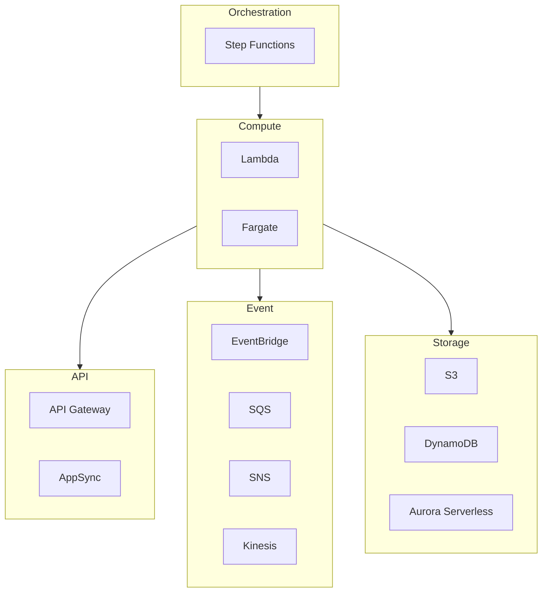

### 1.3 Applicable Scenarios

| Scenario | Recommended Services | Reason |
|----------|---------------------|--------|
| REST API | Lambda + API Gateway | Low latency, automatic scaling |
| Data Processing | Lambda + SQS | Event-driven, fault-tolerant |
| Long-running Tasks | Fargate | No timeout limits |
| Machine Learning | Fargate/SageMaker | Compute-intensive |

---

## 2. Lambda Deep Dive

### 2.1 Execution Model

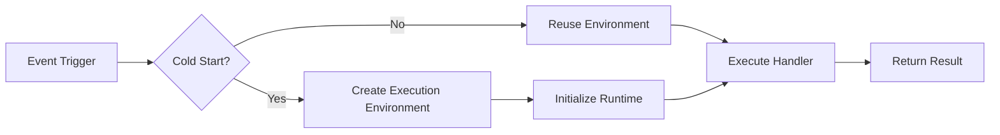

### 2.2 Concurrency Management

```
Concurrency Types:
├── Reserved Concurrency
│   └── Guarantees function capacity availability
├── Provisioned Concurrency
│   └── Eliminates cold starts
└── Account-level Limits
    └── Default: 1000 (can be increased)
```

### 2.3 Best Practices

1. **Initialization Optimization**
   ```python
   # Global initialization - executes only once
   import boto3
   dynamodb = boto3.resource('dynamodb')  # Connection reuse
   
   def lambda_handler(event, context):
       # Function logic
       pass
   ```

2. **Error Handling**
   ```python
   import json
   import logging
   
   logger = logging.getLogger()
   
   def lambda_handler(event, context):
       try:
           result = process_event(event)
           return {'statusCode': 200, 'body': json.dumps(result)}
       except ValueError as e:
           logger.warning(f"Invalid input: {e}")
           return {'statusCode': 400, 'body': json.dumps({'error': str(e)})}
       except Exception as e:
           logger.exception("Unexpected error")
           raise
   ```

---

## 3. Fargate Deep Dive

### 3.1 Architecture Components

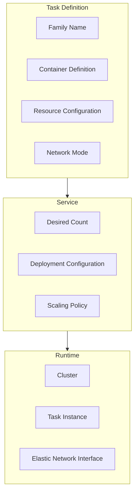

### 3.2 Capacity Providers

| Type | Price | Applicable Scenarios |
|------|-------|---------------------|
| Fargate | $0.04048/vCPU/hr | Mission-critical workloads |
| Fargate Spot | $0.012144/vCPU/hr | Fault-tolerant workloads |

**Recommended Strategy**:
```yaml
CapacityProviderStrategy:
  - Base: 2        # Minimum 2 On-Demand
    Weight: 1      # Weight ratio
    CapacityProvider: FARGATE
  - Weight: 3      # 3x On-Demand
    CapacityProvider: FARGATE_SPOT
```

---

## 4. Integration and Patterns

### 4.1 Request Routing Decision

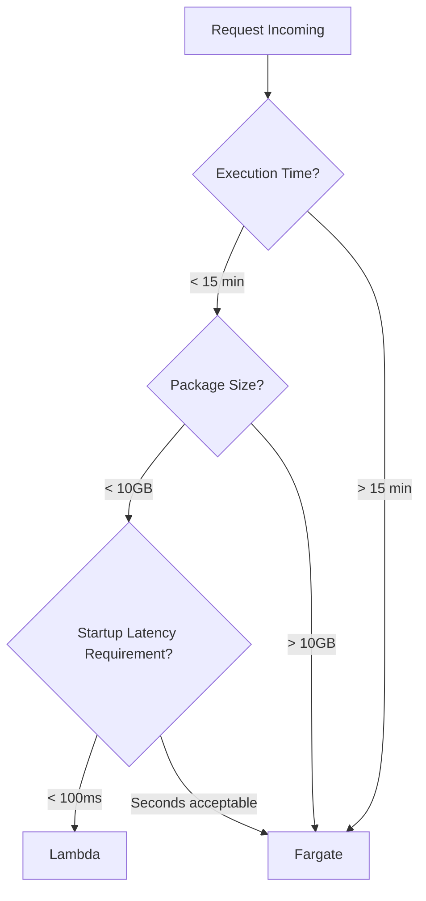

### 4.2 Hybrid Architecture Example

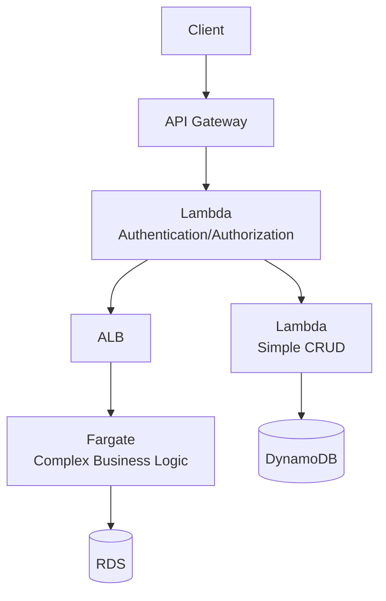

---

## 5. Docker and Serverless

### 5.1 Lambda Container Image Deployment

Lambda supports packaging and deploying functions using container images, offering larger deployment package limits (up to 10GB) and more flexible dependency management.

```dockerfile
# Lambda Container Image Dockerfile
FROM public.ecr.aws/lambda/python:3.11

# Install dependencies
COPY requirements.txt .
RUN pip install -r requirements.txt

# Copy function code
COPY app.py ${LAMBDA_TASK_ROOT}

# Set handler
CMD ["app.handler"]
```

**Build and Deploy**:

```bash
# Login to AWS ECR
aws ecr get-login-password --region us-east-1 | \
    docker login --username AWS --password-stdin <account-id>.dkr.ecr.us-east-1.amazonaws.com

# Create ECR repository
aws ecr create-repository --repository-name lambda-container-demo

# Build image
docker build -t lambda-container-demo .

# Tag image
docker tag lambda-container-demo:latest \
    <account-id>.dkr.ecr.us-east-1.amazonaws.com/lambda-container-demo:latest

# Push image
docker push <account-id>.dkr.ecr.us-east-1.amazonaws.com/lambda-container-demo:latest

# Deploy Lambda function
aws lambda create-function \
    --function-name container-function \
    --package-type Image \
    --code ImageUri=<account-id>.dkr.ecr.us-east-1.amazonaws.com/lambda-container-demo:latest \
    --role arn:aws:iam::<account-id>:role/lambda-role \
    --timeout 30 \
    --memory-size 512
```

**Lambda Container Image Advantages**:

| Feature | ZIP Deployment | Container Image |
|---------|---------------|-----------------|
| Maximum Size | 250 MB (unzipped) | 10 GB |
| Dependency Management | Complex | Standard Dockerfile |
| Local Testing | Requires emulator | Run container directly |
| CI/CD | Special handling | Standard Docker workflow |
| Team Collaboration | Difficult | Standardized |

### 5.2 Fargate Container Best Practices

Fargate is AWS's Serverless container service that allows running containers without managing servers.

```dockerfile
# Fargate-optimized Dockerfile
FROM node:20-alpine AS builder

WORKDIR /app
COPY package*.json ./
RUN npm ci --only=production && npm cache clean --force

FROM node:20-alpine

# Install security updates
RUN apk add --no-cache dumb-init ca-certificates && \
    addgroup -g 1000 appgroup && \
    adduser -u 1000 -G appgroup -s /bin/sh -D appuser

WORKDIR /app

# Copy from builder stage
COPY --from=builder --chown=appuser:appgroup /app/node_modules ./node_modules
COPY --from=builder --chown=appuser:appgroup /app/package*.json ./
COPY --chown=appuser:appgroup . .

USER appuser

EXPOSE 8080

# Use dumb-init to handle signals
ENTRYPOINT ["dumb-init", "--"]
CMD ["node", "server.js"]
```

**ECS Task Definition with Docker**:

```json
{
  "family": "fargate-web-app",
  "networkMode": "awsvpc",
  "requiresCompatibilities": ["FARGATE"],
  "cpu": "512",
  "memory": "1024",
  "executionRoleArn": "arn:aws:iam::123456789:role/ecsTaskExecutionRole",
  "taskRoleArn": "arn:aws:iam::123456789:role/ecsTaskRole",
  "containerDefinitions": [
    {
      "name": "web",
      "image": "123456789.dkr.ecr.us-east-1.amazonaws.com/myapp:v1.0.0",
      "essential": true,
      "portMappings": [
        {
          "containerPort": 8080,
          "protocol": "tcp"
        }
      ],
      "environment": [
        {"name": "NODE_ENV", "value": "production"}
      ],
      "secrets": [
        {
          "name": "DATABASE_URL",
          "valueFrom": "arn:aws:secretsmanager:us-east-1:123456789:secret:db-url"
        }
      ],
      "logConfiguration": {
        "logDriver": "awslogs",
        "options": {
          "awslogs-group": "/ecs/fargate-web",
          "awslogs-region": "us-east-1",
          "awslogs-stream-prefix": "web"
        }
      },
      "healthCheck": {
        "command": ["CMD-SHELL", "curl -f http://localhost:8080/health || exit 1"],
        "interval": 30,
        "timeout": 5,
        "retries": 3,
        "startPeriod": 60
      }
    }
  ]
}
```

### 5.3 Local Development Environment (Docker Compose)

Use Docker Compose to simulate a Serverless environment for local development.

```yaml
# docker-compose.serverless.yml
version: '3.8'

services:
  # Lambda local simulation
  lambda-local:
    build:
      context: ./lambda-functions
      dockerfile: Dockerfile
    ports:
      - "9000:8080"
    environment:
      - AWS_REGION=us-east-1
      - AWS_ACCESS_KEY_ID=test
      - AWS_SECRET_ACCESS_KEY=test
      - DYNAMODB_ENDPOINT=http://dynamodb-local:8000
    volumes:
      - ./lambda-functions:/var/task
    depends_on:
      - dynamodb-local

  # DynamoDB Local
  dynamodb-local:
    image: amazon/dynamodb-local:latest
    ports:
      - "8000:8000"
    command: "-jar DynamoDBLocal.jar -sharedDb"

  # S3 Local (MinIO)
  minio:
    image: minio/minio:latest
    ports:
      - "9001:9001"
      - "9002:9002"
    environment:
      MINIO_ROOT_USER: minioadmin
      MINIO_ROOT_USER: minioadmin
    command: server /data --console-address ":9002"
    volumes:
      - minio_data:/data

  # API Gateway simulation
  api-gateway:
    image: nginx:alpine
    ports:
      - "8080:80"
    volumes:
      - ./nginx.conf:/etc/nginx/nginx.conf:ro
    depends_on:
      - lambda-local

volumes:
  minio_data:
```

**Local Lambda Testing**:

```bash
# Start local environment
docker-compose -f docker-compose.serverless.yml up

# Invoke Lambda function
curl -XPOST "http://localhost:9000/2015-03-31/functions/function/invocations" \
    -d '{"key": "value"}'
```

### 5.4 AWS Service and Docker Integration in Practice

#### 5.4.1 App Runner Rapid Container Deployment

AWS App Runner is the simplest way to deploy containerized applications to AWS without managing infrastructure.

```yaml
# apprunner.yaml
version: 1.0
runtime: python3 
build:
  commands:
    build:
      - pip install -r requirements.txt
run:
  command: python app.py
  network:
    port: 8080
    env: PORT
  secrets:
    - name: DATABASE_URL
      value-from: arn:aws:secretsmanager:us-east-1:123456789:secret:db-url
```

**Deploy using ECR Image**:

```bash
# Create App Runner service
aws apprunner create-service \
  --service-name my-container-service \
  --source-configuration '{
    "ImageRepository": {
      "ImageIdentifier": "123456789.dkr.ecr.us-east-1.amazonaws.com/myapp:latest",
      "ImageRepositoryType": "ECR",
      "ImageConfiguration": {
        "Port": "8080",
        "RuntimeEnvironmentVariables": {
          "ENV": "production"
        }
      }
    },
    "AutoDeploymentsEnabled": true
  }' \
  --instance-configuration '{
    "Cpu": "1 vCPU",
    "Memory": "2 GB"
  }'
```

#### 5.4.2 Lambda and ECR Integration Patterns

**Multi-function Shared Base Image**:

```dockerfile
# Base Image (Dockerfile.base)
FROM public.ecr.aws/lambda/python:3.11

# Install common dependencies
RUN pip install aws-xray-sdk boto3 aws-lambda-powertools

# Save as base image
# docker build -f Dockerfile.base -t my-lambda-base:latest .
# docker tag my-lambda-base:latest 123456789.dkr.ecr.us-east-1.amazonaws.com/lambda-base:latest
# docker push 123456789.dkr.ecr.us-east-1.amazonaws.com/lambda-base:latest
```

```dockerfile
# Function-specific Image (Dockerfile.function)
FROM 123456789.dkr.ecr.us-east-1.amazonaws.com/lambda-base:latest

# Install function-specific dependencies
COPY requirements.txt .
RUN pip install -r requirements.txt

COPY app.py ${LAMBDA_TASK_ROOT}
CMD ["app.handler"]
```

**Lambda + Docker + Step Functions Workflow**:

```python
# Data Processing Workflow - Using Container Image Lambda
import json
import boto3

s3 = boto3.client('s3')
dynamodb = boto3.resource('dynamodb')

def extract_handler(event, context):
    """Extract data from S3 - Container Image Lambda"""
    bucket = event['bucket']
    key = event['key']
    
    # Large file processing (utilizing container 10GB limit)
    response = s3.get_object(Bucket=bucket, Key=key)
    data = response['Body'].read()
    
    return {
        'statusCode': 200,
        'data_size': len(data),
        'output_key': f'processed/{key}'
    }

def transform_handler(event, context):
    """Data transformation - Using pandas/numpy (container supports large dependencies)"""
    import pandas as pd
    import numpy as np
    
    # Complex data processing
    df = pd.read_parquet(f"/tmp/{event['output_key']}")
    df['processed'] = True
    
    return {
        'records_processed': len(df),
        'output_path': f"/tmp/transformed_{event['output_key']}"
    }

def load_handler(event, context):
    """Load into DynamoDB"""
    table = dynamodb.Table('processed_data')
    
    # Batch write
    with table.batch_writer() as batch:
        for item in event['data']:
            batch.put_item(Item=item)
    
    return {'loaded_count': len(event['data'])}
```

#### 5.4.3 Fargate and AWS Service Deep Integration

**Fargate + Secrets Manager + Parameter Store**:

```json
{
  "family": "secure-fargate-app",
  "networkMode": "awsvpc",
  "requiresCompatibilities": ["FARGATE"],
  "executionRoleArn": "arn:aws:iam::123456789:role/ecsTaskExecutionRole",
  "taskRoleArn": "arn:aws:iam::123456789:role/ecsTaskRole",
  "containerDefinitions": [
    {
      "name": "app",
      "image": "123456789.dkr.ecr.us-east-1.amazonaws.com/secure-app:v1",
      "secrets": [
        {
          "name": "DB_PASSWORD",
          "valueFrom": "arn:aws:secretsmanager:us-east-1:123456789:secret:db-password"
        },
        {
          "name": "API_KEY",
          "valueFrom": "arn:aws:ssm:us-east-1:123456789:parameter/prod/api-key"
        }
      ],
      "environment": [
        {"name": "AWS_REGION", "value": "us-east-1"},
        {"name": "LOG_LEVEL", "value": "info"}
      ],
      "mountPoints": [
        {
          "sourceVolume": "efs-storage",
          "containerPath": "/app/data"
        }
      ],
      "logConfiguration": {
        "logDriver": "awslogs",
        "options": {
          "awslogs-group": "/ecs/fargate-app",
          "awslogs-region": "us-east-1",
          "awslogs-stream-prefix": "app"
        }
      }
    }
  ],
  "volumes": [
    {
      "name": "efs-storage",
      "efsVolumeConfiguration": {
        "fileSystemId": "fs-12345678",
        "transitEncryption": "ENABLED",
        "authorizationConfig": {
          "accessPointId": "fsap-12345678",
          "iam": "ENABLED"
        }
      }
    }
  ]
}
```

**Fargate + EventBridge Scheduled Tasks**:

```yaml
# Scheduled report generation task
Resources:
  ScheduledTask:
    Type: AWS::Events::Rule
    Properties:
      Name: daily-report-generator
      ScheduleExpression: cron(0 2 * * ? *)  # Daily at 2 AM
      Targets:
        - Id: FargateTask
          Arn: !Sub arn:aws:ecs:${AWS::Region}:${AWS::AccountId}:cluster/${ClusterName}
          RoleArn: !GetAtt EventBridgeRole.Arn
          EcsParameters:
            TaskDefinitionArn: !Ref ReportGeneratorTaskDef
            TaskCount: 1
            LaunchType: FARGATE
            NetworkConfiguration:
              AwsVpcConfiguration:
                Subnets: !Ref PrivateSubnets
                SecurityGroups: [!Ref TaskSecurityGroup]
                AssignPublicIp: DISABLED
```

#### 5.4.4 ECS Blue/Green Deployment with CodeDeploy

```json
{
  "applicationName": "my-container-app",
  "deploymentGroupName": "blue-green-dg",
  "deploymentConfigName": "CodeDeployDefault.ECSAllAtOnce",
  "serviceRoleArn": "arn:aws:iam::123456789:role/CodeDeployRole",
  "blueGreenDeploymentConfiguration": {
    "terminateBlueInstancesOnDeploymentSuccess": {
      "action": "TERMINATE",
      "terminationWaitTimeInMinutes": 30
    },
    "deploymentReadyOption": {
      "actionOnTimeout": "CONTINUE_DEPLOYMENT",
      "waitTimeInMinutes": 0
    }
  },
  "deploymentStyle": {
    "deploymentType": "BLUE_GREEN",
    "deploymentOption": "WITH_TRAFFIC_CONTROL"
  },
  "ecsServices": [
    {
      "serviceName": "my-service",
      "clusterName": "my-cluster"
    }
  ],
  "targetGroupPairInfoList": [
    {
      "targetGroups": [
        {"name": "blue-tg"},
        {"name": "green-tg"}
      ],
      "prodTrafficRoute": {
        "listenerArns": ["arn:aws:elasticloadbalancing:...:listener/app/alb/..."]
      }
    }
  ]
}
```

### 5.5 CI/CD Docker Integration

```yaml
# .github/workflows/serverless-docker.yml
name: Serverless Docker Pipeline

on:
  push:
    branches: [main]

env:
  AWS_REGION: us-east-1
  ECR_REPOSITORY: serverless-functions

jobs:
  build-and-deploy:
    runs-on: ubuntu-latest
    permissions:
      id-token: write
      contents: read
    
    steps:
    - uses: actions/checkout@v4

    - name: Configure AWS Credentials
      uses: aws-actions/configure-aws-credentials@v4
      with:
        role-to-assume: arn:aws:iam::123456789:role/github-actions-role
        aws-region: ${{ env.AWS_REGION }}

    - name: Login to Amazon ECR
      id: login-ecr
      uses: aws-actions/amazon-ecr-login@v2

    - name: Build, tag, and push image
      env:
        ECR_REGISTRY: ${{ steps.login-ecr.outputs.registry }}
        IMAGE_TAG: ${{ github.sha }}
      run: |
        docker build -t $ECR_REGISTRY/$ECR_REPOSITORY:$IMAGE_TAG .
        docker push $ECR_REGISTRY/$ECR_REPOSITORY:$IMAGE_TAG
        echo "image=$ECR_REGISTRY/$ECR_REPOSITORY:$IMAGE_TAG" >> $GITHUB_OUTPUT

    - name: Deploy to Lambda
      run: |
        aws lambda update-function-code \
          --function-name my-container-function \
          --image-uri ${{ steps.login-ecr.outputs.registry }}/$ECR_REPOSITORY:${{ github.sha }}

    - name: Run DB migrations (Fargate)
      run: |
        aws ecs run-task \
          --cluster production \
          --launch-type FARGATE \
          --task-definition migration-task \
          --network-configuration "awsvpcConfiguration={subnets=[subnet-xxx],securityGroups=[sg-xxx],assignPublicIp=ENABLED}"
```

### 5.5 Docker Security Best Practices

```dockerfile
# Serverless Container Security Dockerfile
FROM python:3.11-slim-bookworm

# Create non-root user
RUN groupadd -r appuser && useradd -r -g appuser appuser

# Install security updates
RUN apt-get update && apt-get install -y --no-install-recommends \
    ca-certificates \
    && rm -rf /var/lib/apt/lists/*

WORKDIR /app

# Copy only necessary files
COPY --chown=appuser:appuser requirements.txt .
RUN pip install --no-cache-dir -r requirements.txt

COPY --chown=appuser:appuser app.py .

# Switch to non-root user
USER appuser

# Health check
HEALTHCHECK --interval=30s --timeout=5s --start-period=5s --retries=3 \
    CMD python -c "import urllib.request; urllib.request.urlopen('http://localhost:8080/health')" || exit 1

EXPOSE 8080

CMD ["python", "app.py"]
```

**Container Scanning Integration**:

```yaml
# Add security scanning in CI
- name: Scan image with Trivy
  uses: aquasecurity/trivy-action@master
  with:
    image-ref: '${{ steps.login-ecr.outputs.registry }}/${{ env.ECR_REPOSITORY }}:${{ github.sha }}'
    format: 'sarif'
    output: 'trivy-results.sarif'

- name: Upload scan results
  uses: github/codeql-action/upload-sarif@v2
  with:
    sarif_file: 'trivy-results.sarif'
```

---

## 6. Security Best Practices

### 6.1 IAM Least Privilege

```json
{
    "Version": "2012-10-17",
    "Statement": [
        {
            "Effect": "Allow",
            "Action": [
                "dynamodb:GetItem",
                "dynamodb:PutItem"
            ],
            "Resource": "arn:aws:dynamodb:*:*:table/SpecificTable"
        }
    ]
}
```

### 5.2 VPC Configuration

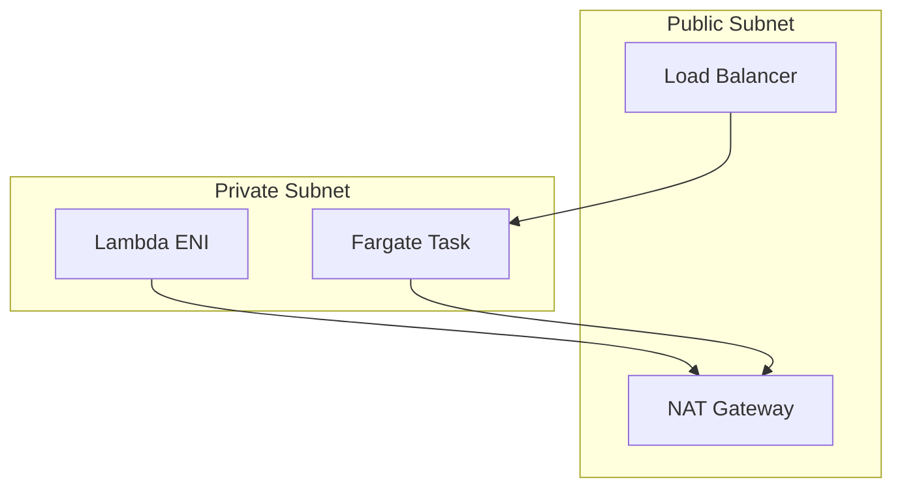

---

## 7. Performance Optimization

### 7.1 Lambda Optimization

| Optimization Item | Method | Effect |
|------------------|--------|--------|
| Cold Start | Provisioned Concurrency | Eliminates cold starts |
| Memory | Power Tuning | Find optimal cost-performance ratio |
| Dependencies | Lambda Layer | Reduce package size |

### 7.2 Fargate Optimization

1. **Image Optimization**
   - Use multi-stage builds
   - Choose lightweight base images (alpine/distroless)
   
2. **Startup Optimization**
   - Health checks respond quickly
   - Lazy-load non-critical dependencies

---

## 8. Monitoring and Observability

### 8.1 Key Metrics

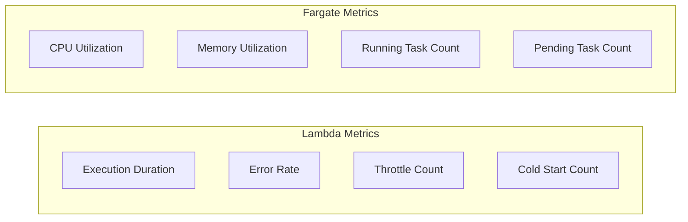

### 8.2 Distributed Tracing

```python
# X-Ray Integration
from aws_xray_sdk.core import xray_recorder, patch_all
patch_all()

@xray_recorder.capture('process_order')
def process_order(order_id):
    # Business logic
    pass
```

---

## 9. High Availability Architecture

### 9.1 High Availability Design Principles

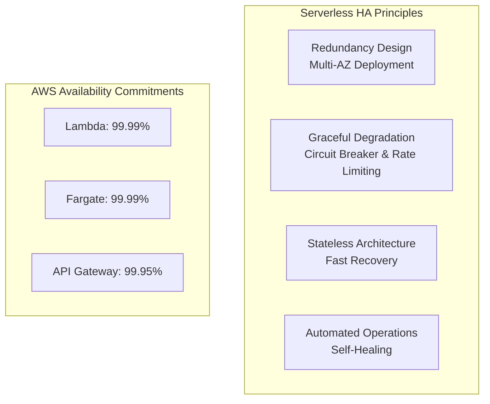

**Core Principles**:

| Principle | Description | Implementation |
|-----------|-------------|----------------|
| Multi-AZ Deployment | Cross-AZ redundancy | Automatically distributed to 3+ AZs |
| Stateless Design | No dependency on local state | Externalize sessions/cache |
| Graceful Degradation | Provide limited service during failures | Circuit breaker pattern |
| Fast Recovery | Automatic failover | Health checks + automatic restart |

### 9.2 Lambda High Availability Strategies

#### 8.2.1 Concurrency Management and Throttling

```python
# Reserved concurrency ensures critical function availability
import boto3

lambda_client = boto3.client('lambda')

# Configure reserved concurrency
lambda_client.put_function_concurrency(
    FunctionName='critical-payment-processor',
    ReservedConcurrentExecutions=100  # Guarantee 100 concurrent executions
)

# Configure function-level throttling protection
lambda_client.put_provisioned_concurrency_config(
    FunctionName='high-traffic-api',
    Qualifier='prod',
    ProvisionedConcurrentExecutions=50  # Provisioned concurrency eliminates cold starts
)
```

#### 8.2.2 Dead Letter Queue (DLQ) for Failed Events

```yaml
# SAM template DLQ configuration
Resources:
  MyFunction:
    Type: AWS::Serverless::Function
    Properties:
      CodeUri: src/
      Handler: app.handler
      Runtime: python3.11
      DeadLetterQueue:
        Type: SQS
        TargetArn: !GetAtt DLQ.Arn
      EventInvokeConfig:
        DestinationConfig:
          OnFailure:
            Destination: !GetAtt FailureTopic.Arn
        MaximumRetryAttempts: 2
        MaximumEventAgeInSeconds: 3600
```

#### 8.2.3 Multi-Region Failover

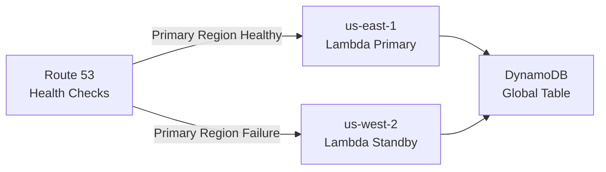

```python
# Multi-region Lambda health check endpoint
import boto3
import os

REGION = os.environ['AWS_REGION']
PRIMARY_REGION = 'us-east-1'

def health_check(event, context):
    """Health check handler"""
    try:
        # Check dependent service status
        dynamodb = boto3.resource('dynamodb')
        table = dynamodb.Table('config')
        table.get_item(Key={'id': 'health'}, ConsistentRead=True)
        
        return {
            'statusCode': 200,
            'body': {
                'status': 'healthy',
                'region': REGION,
                'is_primary': REGION == PRIMARY_REGION
            }
        }
    except Exception as e:
        return {
            'statusCode': 503,
            'body': {'status': 'unhealthy', 'error': str(e)}
        }
```

### 9.3 Fargate High Availability Strategies

#### 8.3.1 Service-Level High Availability Configuration

```json
{
  "family": "high-availability-service",
  "networkMode": "awsvpc",
  "requiresCompatibilities": ["FARGATE"],
  "cpu": "512",
  "memory": "1024",
  "containerDefinitions": [{
    "name": "app",
    "image": "myapp:latest",
    "essential": true,
    "healthCheck": {
      "command": ["CMD-SHELL", "curl -f http://localhost:8080/health || exit 1"],
      "interval": 30,
      "timeout": 5,
      "retries": 3,
      "startPeriod": 60
    },
    "ulimits": [{
      "name": "nofile",
      "softLimit": 65536,
      "hardLimit": 65536
    }]
  }]
}
```

#### 8.3.2 ECS Service Deployment Configuration

```yaml
# Terraform: ECS service high availability configuration
resource "aws_ecs_service" "app" {
  name            = "high-availability-app"
  cluster         = aws_ecs_cluster.main.id
  task_definition = aws_ecs_task_definition.app.arn
  desired_count   = 3  # Minimum 3 tasks to ensure availability
  launch_type     = "FARGATE"

  # Deployment configuration
  deployment_configuration {
    maximum_percent         = 200
    minimum_healthy_percent = 100  # Ensure healthy tasks during deployment
    deployment_circuit_breaker {
      enable   = true
      rollback = true  # Automatic rollback on deployment failure
    }
  }

  # Cross-AZ distribution
  network_configuration {
    subnets          = [aws_subnet.az1.id, aws_subnet.az2.id, aws_subnet.az3.id]
    security_groups  = [aws_security_group.app.id]
    assign_public_ip = false
  }

  # Load balancer health checks
  load_balancer {
    target_group_arn = aws_lb_target_group.app.arn
    container_name   = "app"
    container_port   = 8080
  }

  # Service auto-recovery
  deployment_controller {
    type = "ECS"
  }
}

# Auto-scaling
resource "aws_appautoscaling_target" "ecs" {
  max_capacity       = 20
  min_capacity       = 3  # Minimum 3 to maintain high availability
  resource_id        = "service/${aws_ecs_cluster.main.name}/${aws_ecs_service.app.name}"
  scalable_dimension = "ecs:service:DesiredCount"
  service_namespace  = "ecs"
}
```

#### 8.3.3 Capacity Provider High Availability Strategy

```json
{
  "capacityProviders": ["FARGATE", "FARGATE_SPOT"],
  "defaultCapacityProviderStrategy": [
    {
      "base": 2,
      "weight": 1,
      "capacityProvider": "FARGATE"
    },
    {
      "weight": 4,
      "capacityProvider": "FARGATE_SPOT"
    }
  ]
}
```

**Strategy Explanation**:
- **FARGATE (Base=2)**: Always guarantees 2 On-Demand tasks to ensure core capacity
- **FARGATE_SPOT (Weight=4)**: Elastic use of Spot instances for cost optimization while providing additional capacity
- **Interruption Handling**: When Spot tasks are interrupted, Fargate tasks continue serving

### 9.4 Data Layer High Availability

#### 8.4.1 DynamoDB Global Tables

```yaml
# DynamoDB Global Tables multi-region replication
Resources:
  GlobalTable:
    Type: AWS::DynamoDB::GlobalTable
    Properties:
      TableName: user-sessions
      AttributeDefinitions:
        - AttributeName: userId
          AttributeType: S
      KeySchema:
        - AttributeName: userId
          KeyType: HASH
      BillingMode: PAY_PER_REQUEST
      StreamSpecification:
        StreamViewType: NEW_AND_OLD_IMAGES
      Replicas:
        - Region: us-east-1
          PointInTimeRecoverySpecification:
            PointInTimeRecoveryEnabled: true
        - Region: eu-west-1
          PointInTimeRecoverySpecification:
            PointInTimeRecoveryEnabled: true
        - Region: ap-northeast-1
```

#### 8.4.2 S3 Cross-Region Replication

```json
{
  "Rules": [{
    "ID": "CrossRegionReplication",
    "Status": "Enabled",
    "Priority": 1,
    "DeleteMarkerReplication": { "Status": "Enabled" },
    "Filter": { "Prefix": "" },
    "Destination": {
      "Bucket": "arn:aws:s3:::backup-bucket-west",
      "StorageClass": "STANDARD_IA",
      "ReplicationTime": {
        "Status": "Enabled",
        "Time": { "Minutes": 15 }
      },
      "Metrics": {
        "Status": "Enabled",
        "Minutes": 15
      }
    },
    "SourceSelectionCriteria": {
      "SseKmsEncryptedObjects": { "Status": "Enabled" },
      "ReplicaModifications": { "Status": "Enabled" }
    }
  }]
}
```

### 9.5 Failover and Disaster Recovery

#### 8.5.1 Route 53 Health Checks and Failover

```yaml
# Route 53 failover routing
Resources:
  PrimaryRecord:
    Type: AWS::Route53::RecordSet
    Properties:
      HostedZoneId: !Ref HostedZone
      Name: api.example.com
      Type: A
      SetIdentifier: Primary
      Failover: PRIMARY
      HealthCheckId: !Ref PrimaryHealthCheck
      AliasTarget:
        DNSName: !GetAtt PrimaryAPI.DomainName
        HostedZoneId: !GetAtt PrimaryAPI.DistributionHostedZoneId

  SecondaryRecord:
    Type: AWS::Route53::RecordSet
    Properties:
      HostedZoneId: !Ref HostedZone
      Name: api.example.com
      Type: A
      SetIdentifier: Secondary
      Failover: SECONDARY
      AliasTarget:
        DNSName: !GetAtt SecondaryAPI.DomainName
        HostedZoneId: !GetAtt SecondaryAPI.DistributionHostedZoneId

  PrimaryHealthCheck:
    Type: AWS::Route53::HealthCheck
    Properties:
      HealthCheckConfig:
        Type: HTTPS
        ResourcePath: /health
        FullyQualifiedDomainName: api-primary.example.com
        Port: 443
        RequestInterval: 30
        FailureThreshold: 3
```

#### 8.5.2 Backup and Recovery Strategy

| RTO/RPO | Strategy | Applicable Scenarios |
|---------|----------|---------------------|
| RTO<1h, RPO<5m | Active-Active + Global Tables | Financial transactions |
| RTO<4h, RPO<1h | Primary-Standby + Auto Failover | E-commerce applications |
| RTO<24h, RPO<24h | Periodic backups + Manual recovery | Internal tools |

```python
# AWS Backup plan
import boto3

backup_client = boto3.client('backup')

# Create backup plan
backup_plan = backup_client.create_backup_plan(
    BackupPlan={
        'BackupPlanName': 'serverless-critical-backup',
        'Rules': [{
            'RuleName': 'daily-backup',
            'TargetBackupVaultName': 'Default',
            'ScheduleExpression': 'cron(0 5 ? * * *)',  # Daily at 5 AM
            'StartWindowMinutes': 480,
            'CompletionWindowMinutes': 10080,
            'Lifecycle': {
                'MoveToColdStorageAfterDays': 30,
                'DeleteAfterDays': 120
            },
            'RecoveryPointTags': {
                'Environment': 'Production'
            }
        }]
    }
)
```

### 9.6 High Availability Architecture Patterns

#### 8.6.1 Active-Active Architecture

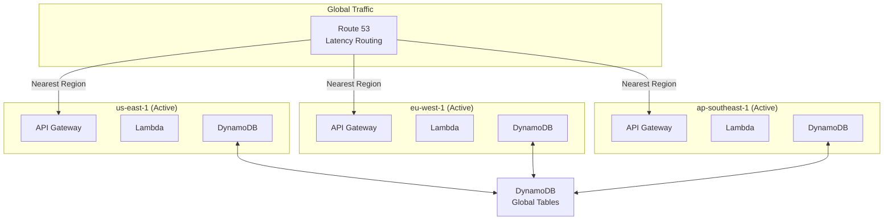

#### 8.6.2 Warm Standby Architecture

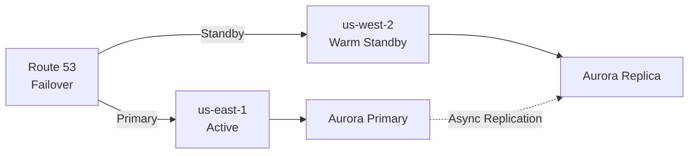

#### 8.6.3 Cell-Based Architecture

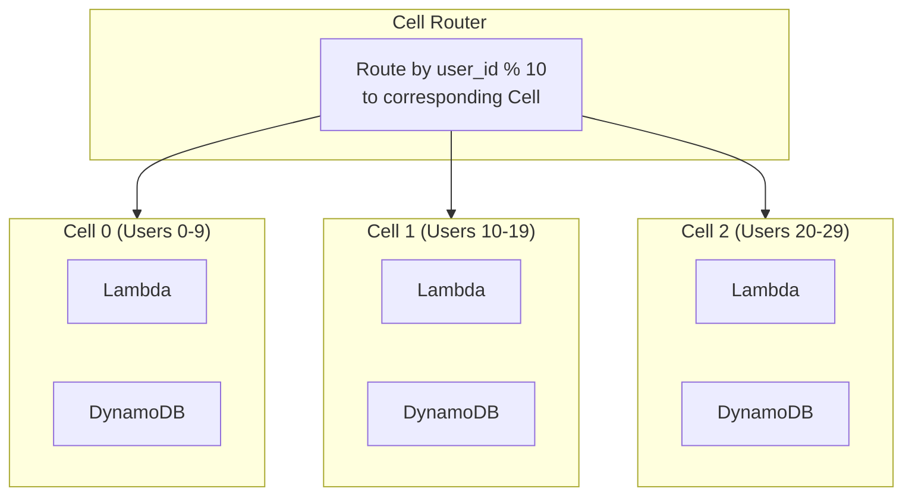

**Cell-Based Advantages**:
- Fault Isolation: Single Cell failure affects only a subset of users
- Gray Release: Release by Cell gradually
- Capacity Planning: Each Cell has a clear capacity limit

### 9.7 High Availability Checklist

```markdown
## Production Environment High Availability Checklist

### Lambda
- [ ] Configure reserved concurrency for critical paths
- [ ] Set up dead letter queues for failed events
- [ ] Implement idempotency to prevent duplicate processing
- [ ] Configure timeout and retry policies
- [ ] Enable X-Ray distributed tracing

### Fargate
- [ ] Minimum 2 tasks distributed across different AZs
- [ ] Configure health checks and automatic restart
- [ ] Use rolling deployment configuration
- [ ] Enable deployment circuit breaker for automatic rollback
- [ ] Configure auto-scaling policies

### Data Layer
- [ ] Enable DynamoDB Point-in-Time Recovery
- [ ] Configure cross-region replication for critical data
- [ ] Enable S3 versioning and MFA Delete
- [ ] Regularly test backup and recovery processes

### Network and DNS
- [ ] Configure Route 53 health checks
- [ ] Configure failover routing policies
- [ ] Enable CloudFront failover origins
- [ ] Multi-region API Gateway deployment
```

---

## 10. Cost Optimization

### 10.1 Serverless Cost Model Deep Dive

#### 9.1.1 Lambda Pricing Details

```
┌─────────────────────────────────────────────────────────────┐
│                    Lambda Cost Components                   │
├─────────────────────────────────────────────────────────────┤
│  1. Request Cost: $0.20 per 1 million requests              │
│                                                             │
│  2. Compute Cost: $0.0000166667 per GB-second               │
│     - Compute = Memory(GB) × Execution Time(seconds)        │
│                                                             │
│  3. Data Transfer: Standard AWS data transfer rates         │
│                                                             │
│  4. Provisioned Concurrency: $0.000004646 per GB-second    │
│     (idle time)                                             │
└─────────────────────────────────────────────────────────────┘
```

**Cost Calculation Example**:

```python
"""
Scenario: API processing 100 million requests per month
- Average execution time: 200ms
- Memory configuration: 512MB (0.5 GB)
- Average response size: 10KB

Calculation:
1. Request Cost: 100 × $0.20 = $20

2. Compute Cost: 
   - Total GB-seconds = 100,000,000 × 0.2s × 0.5GB = 10,000,000 GB-seconds
   - Cost = 10,000,000 × $0.0000166667 = $166.67

3. Data Transfer (egress): 
   - 100,000,000 × 10KB = 1TB
   - First 10TB: 1000GB × $0.09 = $90

Monthly Total: $20 + $166.67 + $90 = $276.67
"""
```

#### 9.1.2 Fargate Pricing Details

| Charge Item | Fargate | Fargate Spot | Graviton2 |
|-------------|---------|--------------|-----------|
| vCPU/hour | $0.04048 | $0.012144 (-70%) | $0.03238 (-20%) |
| GB/hour | $0.004445 | $0.0013335 (-70%) | $0.00356 (-20%) |
| Windows Surcharge | +25% | N/A | N/A |

**Cost Calculation Example**:

```python
"""
Scenario: Microservice running 10 tasks
- Each task: 1 vCPU, 2GB memory
- Runtime: 30 days (720 hours)

Fargate Standard Cost:
- vCPU: 10 × 720 × $0.04048 = $291.46
- Memory: 10 × 720 × 2 × $0.004445 = $64.01
- Total: $355.47/month

Fargate Spot (70% savings):
- vCPU: 10 × 720 × $0.012144 = $87.44
- Memory: 10 × 720 × 2 × $0.0013335 = $19.20
- Total: $106.64/month (saving $248.83)
"""
```

### 10.2 Cost Optimization Strategy Matrix

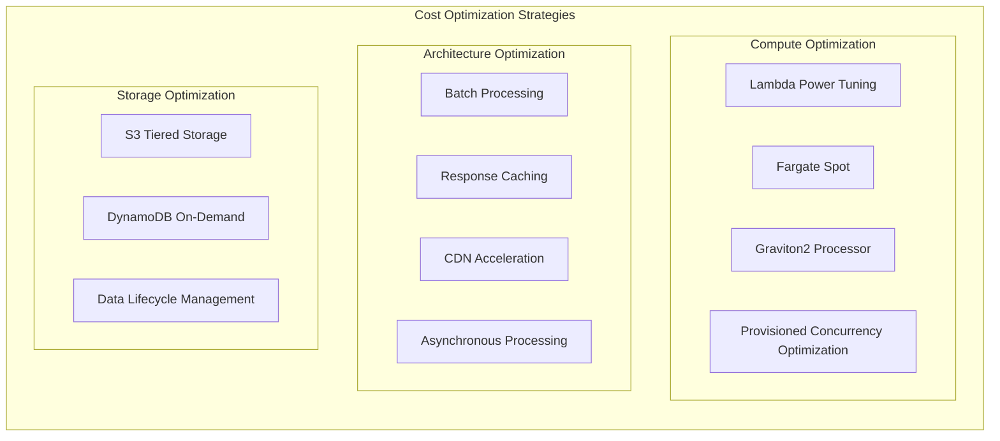

### 10.3 Lambda Cost Optimization in Practice

#### 9.3.1 Memory Power Tuning

```python
# Use AWS Lambda Power Tuning tool to find optimal memory configuration
# https://github.com/alexcasalboni/aws-lambda-power-tuning

import json

power_tuning_config = {
    "lambdaARN": "arn:aws:lambda:us-east-1:123456789:function:my-function",
    "powerValues": [128, 256, 512, 1024, 2048, 3008],
    "num": 50,
    "payload": "{}",
    "parallelInvocation": True,
    "strategy": "cost"  # or "speed" / "balanced"
}

"""
Typical Results Example:
┌─────────┬──────────┬──────────┬────────────┐
│ Memory  │  Duration│   Cost   │ Optimal    │
├─────────┼──────────┼──────────┼────────────┤
│  128 MB │   3000ms │  $0.0062 │            │
│  256 MB │   1500ms │  $0.0062 │            │
│  512 MB │    800ms │  $0.0067 │            │
│ 1024 MB │    450ms │  $0.0075 │ ⭐ Recommended │
│ 2048 MB │    400ms │  $0.0133 │            │
└─────────┴──────────┴──────────┴────────────┘
Conclusion: 1024MB provides best cost-performance ratio
"""
```

#### 9.3.2 Batch Processing to Reduce Invocation Count

```python
# ❌ Inefficient: One Lambda invocation per message
# 10000 messages = 10000 invocations = $0.002 (request cost only)

def lambda_handler_single(event, context):
    message = event['Records'][0]  # Process only one
    process_message(message)

# ✅ Efficient: Batch processing
# 10000 messages / 500 batches = 20 invocations = $0.000004 (negligible request cost)

def lambda_handler_batch(event, context):
    failed_message_ids = []
    
    for record in event['Records']:
        try:
            process_message(record)
        except Exception as e:
            # Partial batch response: retry only failed messages
            failed_message_ids.append(record['messageId'])
    
    return {
        'batchItemFailures': [
            {'itemIdentifier': msg_id} for msg_id in failed_message_ids
        ]
    }

# SAM template configuration for maximum batch size
# Events:
#   SQSEvent:
#     Type: SQS
#     Properties:
#       Queue: !GetAtt MyQueue.Arn
#       BatchSize: 500  # Maximum 10000 items or 6MB
#       MaximumBatchingWindowInSeconds: 5
#       FunctionResponseTypes:
#         - ReportBatchItemFailures
```

#### 9.3.3 Response Caching Strategy

```python
# Lambda function response caching
import json
import boto3
import os
from functools import lru_cache

# Local memory cache (valid within same execution environment)
@lru_cache(maxsize=1000)
def get_user_profile_cached(user_id):
    """Cache user profile to reduce DynamoDB calls"""
    dynamodb = boto3.resource('dynamodb')
    table = dynamodb.Table('users')
    return table.get_item(Key={'id': user_id}).get('Item')

# API Gateway cache
"""
Resources:
  ApiGatewayApi:
    Type: AWS::Serverless::Api
    Properties:
      StageName: prod
      MethodSettings:
        - ResourcePath: /users/{userId}
          HttpMethod: GET
          CachingEnabled: true
          CacheTtlInSeconds: 300
          CacheDataEncrypted: true
"""

# CloudFront edge caching
"""
CloudFrontDistribution:
  Type: AWS::CloudFront::Distribution
  Properties:
    DistributionConfig:
      DefaultCacheBehavior:
        TTL: 86400  # 1 day
        MaxTTL: 31536000  # 1 year
        MinTTL: 1
        ViewerProtocolPolicy: redirect-to-https
        CachePolicyId: !Ref CachePolicy
      CachePolicies:
        - CachePolicy:
            DefaultTTL: 86400
            MaxTTL: 31536000
            MinTTL: 1
            Name: API-Cache-Policy
            ParametersInCacheKeyAndForwardedToOrigin:
              EnableAcceptEncodingGzip: true
              HeadersConfig:
                HeaderBehavior: none
              CookiesConfig:
                CookieBehavior: none
              QueryStringsConfig:
                QueryStringBehavior: whitelist
                QueryStrings:
                  - userId
"""
```

### 10.4 Fargate Cost Optimization in Practice

#### 9.4.1 Spot Instance Hybrid Strategy

```yaml
# Intelligent use of Spot instances for cost savings
Resources:
  ECSCapacityProvider:
    Type: AWS::ECS::ClusterCapacityProviderAssociations
    Properties:
      Cluster: !Ref ECSCluster
      CapacityProviders:
        - FARGATE
        - FARGATE_SPOT
      DefaultCapacityProviderStrategy:
        # Core workloads use On-Demand
        - Base: 2
          Weight: 1
          CapacityProvider: FARGATE
        # Elastic workloads use Spot (70% discount)
        - Weight: 4
          CapacityProvider: FARGATE_SPOT

  # Task-level capacity provider specification
  CriticalService:
    Type: AWS::ECS::Service
    Properties:
      Cluster: !Ref ECSCluster
      TaskDefinition: !Ref CriticalTask
      CapacityProviderStrategy:
        - Base: 1
          Weight: 1
          CapacityProvider: FARGATE  # Critical services use On-Demand only

  BatchJobService:
    Type: AWS::ECS::Service
    Properties:
      Cluster: !Ref ECSCluster
      TaskDefinition: !Ref BatchTask
      CapacityProviderStrategy:
        - Weight: 1
          CapacityProvider: FARGATE_SPOT  # Batch processing uses Spot
```

#### 9.4.2 Graviton2 Migration

```dockerfile
# Build multi-architecture image for Graviton2
# Dockerfile
FROM --platform=$BUILDPLATFORM python:3.11-slim as builder
WORKDIR /app
COPY requirements.txt .
RUN pip install --user -r requirements.txt

# Production image
FROM python:3.11-slim
WORKDIR /app
COPY --from=builder /root/.local /root/.local
COPY . .
ENV PATH=/root/.local/bin:$PATH
CMD ["python", "app.py"]
```

```bash
# Build multi-architecture image
# Install buildx
docker buildx create --use

# Build and push multi-architecture image
docker buildx build \
  --platform linux/amd64,linux/arm64 \
  -t myapp:latest \
  --push .
```

```json
// Use Graviton2 in task definition
{
  "runtimePlatform": {
    "cpuArchitecture": "ARM64",
    "operatingSystemFamily": "LINUX"
  },
  "cpu": "512",
  "memory": "1024"
}
```

#### 9.4.3 Task Right Sizing

```python
# Use CloudWatch metrics to automatically recommend resource configuration
import boto3

def analyze_resource_usage(cluster_name, service_name, days=7):
    """Analyze historical resource usage and recommend optimal configuration"""
    cloudwatch = boto3.client('cloudwatch')
    
    # Get CPU utilization
    cpu_response = cloudwatch.get_metric_statistics(
        Namespace='AWS/ECS',
        MetricName='CPUUtilization',
        Dimensions=[
            {'Name': 'ClusterName', 'Value': cluster_name},
            {'Name': 'ServiceName', 'Value': service_name}
        ],
        StartTime=datetime.utcnow() - timedelta(days=days),
        EndTime=datetime.utcnow(),
        Period=3600,
        Statistics=['Average', 'Maximum', 'p99']
    )
    
    # Get memory utilization
    memory_response = cloudwatch.get_metric_statistics(
        Namespace='AWS/ECS',
        MetricName='MemoryUtilization',
        Dimensions=[
            {'Name': 'ClusterName', 'Value': cluster_name},
            {'Name': 'ServiceName', 'Value': service_name}
        ],
        StartTime=datetime.utcnow() - timedelta(days=days),
        EndTime=datetime.utcnow(),
        Period=3600,
        Statistics=['Average', 'Maximum', 'p99']
    )
    
    # Analyze and generate recommendations
    cpu_avg = calculate_average(cpu_response['Datapoints'])
    memory_avg = calculate_average(memory_response['Datapoints'])
    
    recommendations = []
    
    if cpu_avg < 20:
        recommendations.append(f"CPU utilization only {cpu_avg:.1f}%, recommend reducing vCPU configuration")
    elif cpu_avg > 80:
        recommendations.append(f"CPU utilization as high as {cpu_avg:.1f}%, recommend increasing vCPU configuration")
    
    if memory_avg < 30:
        recommendations.append(f"Memory utilization only {memory_avg:.1f}%, recommend reducing memory configuration")
    elif memory_avg > 85:
        recommendations.append(f"Memory utilization as high as {memory_avg:.1f}%, recommend increasing memory configuration")
    
    return recommendations
```

### 10.5 Storage Cost Optimization

#### 9.5.1 S3 Intelligent Tiering

```python
import boto3

s3 = boto3.client('s3')

# Configure S3 lifecycle policy
def configure_s3_lifecycle(bucket_name):
    lifecycle_policy = {
        'Rules': [
            {
                'ID': 'IntelligentTiering',
                'Status': 'Enabled',
                'Filter': {'Prefix': ''},
                'Transitions': [
                    {
                        'Days': 0,
                        'StorageClass': 'INTELLIGENT_TIERING'
                    }
                ],
                'NoncurrentVersionTransitions': [
                    {
                        'NoncurrentDays': 30,
                        'StorageClass': 'STANDARD_IA'
                    },
                    {
                        'NoncurrentDays': 90,
                        'StorageClass': 'GLACIER'
                    }
                ],
                'NoncurrentVersionExpiration': {
                    'NoncurrentDays': 365
                }
            },
            {
                'ID': 'DeleteIncompleteMultipart',
                'Status': 'Enabled',
                'Filter': {'Prefix': ''},
                'AbortIncompleteMultipartUpload': {
                    'DaysAfterInitiation': 7
                }
            }
        ]
    }
    
    s3.put_bucket_lifecycle_configuration(
        Bucket=bucket_name,
        LifecycleConfiguration=lifecycle_policy
    )

# Enable S3 Intelligent Tiering automatic archiving
s3.put_bucket_intelligent_tiering_configuration(
    Bucket=bucket_name,
    Id='DeepArchiveTiering',
    IntelligentTieringConfiguration={
        'Status': 'Enabled',
        'Tierings': [
            {
                'Days': 90,
                'AccessTier': 'ARCHIVE_ACCESS'
            },
            {
                'Days': 180,
                'AccessTier': 'DEEP_ARCHIVE_ACCESS'
            }
        ]
    }
)
```

#### 9.5.2 DynamoDB Cost Optimization

```yaml
# On-Demand vs Provisioned capacity decision
Resources:
  # Development/Test environment: On-Demand billing
  DevTable:
    Type: AWS::DynamoDB::Table
    Properties:
      BillingMode: PAY_PER_REQUEST  # Suitable for low or uncertain traffic
      
  # Production environment: Provisioned capacity + auto-scaling
  ProdTable:
    Type: AWS::DynamoDB::Table
    Properties:
      BillingMode: PROVISIONED
      ProvisionedThroughput:
        ReadCapacityUnits: 100
        WriteCapacityUnits: 50
      
  # Auto-scaling configuration
  ProdTableReadScaling:
    Type: AWS::ApplicationAutoScaling::ScalableTarget
    Properties:
      MaxCapacity: 4000
      MinCapacity: 100
      ResourceId: !Sub table/${ProdTable}
      ScalableDimension: dynamodb:table:ReadCapacityUnits
      ServiceNamespace: dynamodb
      
  ProdTableReadScalingPolicy:
    Type: AWS::ApplicationAutoScaling::ScalingPolicy
    Properties:
      PolicyName: ReadAutoScaling
      PolicyType: TargetTrackingScaling
      ScalingTargetId: !Ref ProdTableReadScaling
      TargetTrackingScalingPolicyConfiguration:
        TargetValue: 70.0  # CPU target utilization
        ScaleInCooldown: 60
        ScaleOutCooldown: 60
        PredefinedMetricSpecification:
          PredefinedMetricType: DynamoDBReadCapacityUtilization
```

#### 9.5.3 Data Lifecycle Management

```python
# DynamoDB TTL automatic cleanup of expired data
import boto3
from datetime import datetime, timedelta

def enable_ttl(table_name, ttl_attribute='ttl'):
    """Enable DynamoDB TTL"""
    dynamodb = boto3.client('dynamodb')
    
    dynamodb.update_time_to_live(
        TableName=table_name,
        TimeToLiveSpecification={
            'Enabled': True,
            'AttributeName': ttl_attribute
        }
    )

# Set TTL when writing data
def put_item_with_ttl(table_name, item, days_to_live=30):
    dynamodb = boto3.resource('dynamodb')
    table = dynamodb.Table(table_name)
    
    # Calculate expiration time
    ttl = int((datetime.now() + timedelta(days=days_to_live)).timestamp())
    
    item['ttl'] = ttl
    table.put_item(Item=item)
```

### 10.6 Network Cost Optimization

#### 9.6.1 Reducing Data Transfer Costs

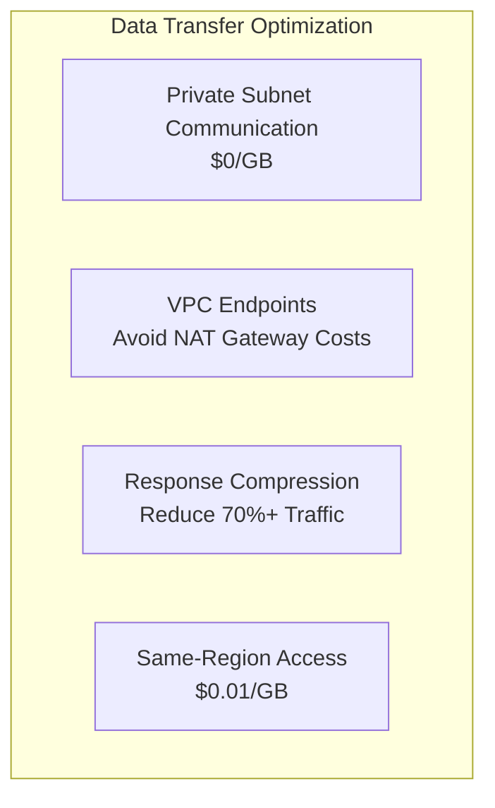

```python
# API Gateway enable compression
"""
Resources:
  ApiGateway:
    Type: AWS::Serverless::Api
    Properties:
      Name: compressed-api
      StageName: prod
      Variables:
        MinimumCompressionSize: 1024  # Enable compression for responses > 1KB
"""

# Lambda response compression
import gzip
import base64

def lambda_handler(event, context):
    body = generate_large_response()
    
    # Check client support
    accept_encoding = event.get('headers', {}).get('Accept-Encoding', '')
    
    if 'gzip' in accept_encoding:
        compressed = gzip.compress(body.encode('utf-8'))
        return {
            'statusCode': 200,
            'headers': {
                'Content-Type': 'application/json',
                'Content-Encoding': 'gzip'
            },
            'body': base64.b64encode(compressed).decode('utf-8'),
            'isBase64Encoded': True
        }
    
    return {
        'statusCode': 200,
        'body': body
    }
```

#### 9.6.2 VPC Endpoints Save NAT Costs

```yaml
# Use VPC Endpoints to avoid NAT Gateway costs ($0.045/GB)
Resources:
  # S3 Gateway Endpoint (free)
  S3Endpoint:
    Type: AWS::EC2::VPCEndpoint
    Properties:
      VpcId: !Ref VPC
      ServiceName: !Sub com.amazonaws.${AWS::Region}.s3
      VpcEndpointType: Gateway
      RouteTableIds:
        - !Ref PrivateRouteTable

  # DynamoDB Gateway Endpoint (free)
  DynamoDBEndpoint:
    Type: AWS::EC2::VPCEndpoint
    Properties:
      VpcId: !Ref VPC
      ServiceName: !Sub com.amazonaws.${AWS::Region}.dynamodb
      VpcEndpointType: Gateway
      RouteTableIds:
        - !Ref PrivateRouteTable

  # Other services use Interface Endpoints (charged per hour)
  LambdaEndpoint:
    Type: AWS::EC2::VPCEndpoint
    Properties:
      VpcId: !Ref VPC
      ServiceName: !Sub com.amazonaws.${AWS::Region}.lambda
      VpcEndpointType: Interface
      SubnetIds:
        - !Ref PrivateSubnet1
        - !Ref PrivateSubnet2
      SecurityGroupIds:
        - !Ref EndpointSecurityGroup
      PrivateDnsEnabled: true
```

### 10.7 Cost Monitoring and Budgeting

#### 9.7.1 Cost Allocation Tag Strategy

```yaml
# Enable cost allocation tags for all resources
Resources:
  LambdaFunction:
    Type: AWS::Serverless::Function
    Properties:
      FunctionName: my-function
      Tags:
        Environment: production
        Project: user-service
        Team: platform
        CostCenter: engineering
        AutoShutdown: false
        
  ECSCluster:
    Type: AWS::ECS::Cluster
    Properties:
      ClusterName: production-cluster
      Tags:
        - Key: Environment
          Value: production
        - Key: Project
          Value: order-service
        - Key: Team
          Value: backend
```

#### 9.7.2 Budget Alerts

```yaml
# Budget alert configuration
Resources:
  MonthlyBudget:
    Type: AWS::Budgets::Budget
    Properties:
      Budget:
        BudgetName: Serverless-Monthly-Budget
        BudgetLimit:
          Amount: 1000
          Unit: USD
        TimeUnit: MONTHLY
        BudgetType: COST
        CostFilters:
          TagKeyValue:
            - user:Environment$production
        CostTypes:
          IncludeTax: true
          IncludeSubscription: true
          UseBlended: false
          
      NotificationsWithSubscribers:
        # 50% threshold alert
        - Notification:
            NotificationType: ACTUAL
            ComparisonOperator: GREATER_THAN
            Threshold: 50
          Subscribers:
            - SubscriptionType: SNS
              Address: !Ref BudgetAlertTopic
              
        # 80% threshold alert
        - Notification:
            NotificationType: ACTUAL
            ComparisonOperator: GREATER_THAN
            Threshold: 80
          Subscribers:
            - SubscriptionType: EMAIL
              Address: finance@company.com
            - SubscriptionType: SNS
              Address: !Ref BudgetAlertTopic
              
        # Forecasted overspend alert
        - Notification:
            NotificationType: FORECASTED
            ComparisonOperator: GREATER_THAN
            Threshold: 100
          Subscribers:
            - SubscriptionType: SNS
              Address: !Ref BudgetAlertTopic
```

#### 9.7.3 Cost Explorer Analysis

```python
# Use Cost Explorer API to analyze Serverless costs
import boto3
from datetime import datetime, timedelta

def analyze_serverless_costs():
    ce = boto3.client('ce')
    
    # Monthly costs grouped by service
    response = ce.get_cost_and_usage(
        TimePeriod={
            'Start': (datetime.now() - timedelta(days=30)).strftime('%Y-%m-%d'),
            'End': datetime.now().strftime('%Y-%m-%d')
        },
        Granularity='DAILY',
        Metrics=['UnblendedCost', 'UsageQuantity'],
        GroupBy=[
            {'Type': 'DIMENSION', 'Key': 'SERVICE'},
            {'Type': 'TAG', 'Key': 'Environment'}
        ],
        Filter={
            'Dimensions': {
                'Key': 'SERVICE',
                'Values': [
                    'AWS Lambda',
                    'Amazon ECS',
                    'AWS Fargate',
                    'Amazon API Gateway',
                    'Amazon DynamoDB'
                ]
            }
        }
    )
    
    # Generate cost report
    print("=" * 60)
    print("Serverless Cost Analysis (Last 30 Days)")
    print("=" * 60)
    
    for group in response['ResultsByTime']:
        date = group['TimePeriod']['Start']
        for result in group['Groups']:
            service = result['Keys'][0]
            cost = float(result['Metrics']['UnblendedCost']['Amount'])
            print(f"{date}: {service}: ${cost:.2f}")
    
    return response
```

### 10.8 Cost Optimization Case Studies

#### Case 1: API Service Cost Optimization (85% Savings)

```markdown
## Background
- E-commerce API, monthly calls: 500 million
- Original architecture: Lambda + API Gateway + DynamoDB
- Original monthly cost: ~$4,500

## Optimization Measures
1. Lambda Power Tuning: 128MB → 512MB (actual cost reduced by 30%)
2. API Gateway Caching: 60% hit rate, reduced Lambda invocations
3. DynamoDB DAX Caching: 80% reduction in read operations
4. CloudFront Edge Caching: Static responses cached for 24h
5. Batch processing SQS messages: BatchSize 10 → 100

## Results
- Optimized monthly cost: ~$680
- Savings: 85%
- Response latency: Reduced by 40%
```

#### Case 2: Data Processing Pipeline Optimization (92% Savings)

```markdown
## Background
- Log processing pipeline, 10TB daily data
- Original architecture: Fargate resident tasks processing
- Original monthly cost: ~$12,000

## Optimization Measures
1. Fargate → Lambda conversion: Short tasks use Lambda
2. Fargate Spot: Fault-tolerant tasks use Spot (70% savings)
3. Graviton2 migration: ARM architecture (20% savings)
4. S3 Intelligent-Tiering: Automatic tiered storage
5. Data compression: Gzip compression reduces storage by 80%

## Results
- Optimized monthly cost: ~$960
- Savings: 92%
- Processing speed: 2x improvement
```

### 10.9 Cost Optimization Checklist

```markdown
## Serverless Cost Optimization Checklist

### Lambda Optimization
- [ ] Use Power Tuning to find optimal memory configuration
- [ ] Batch process events to reduce invocation count
- [ ] Implement response caching (API Gateway + CloudFront)
- [ ] Optimize dependency package size to reduce cold starts
- [ ] Use Provisioned Concurrency only for critical paths

### Fargate Optimization
- [ ] Use Fargate Spot for non-critical workloads
- [ ] Evaluate Graviton2 ARM architecture
- [ ] Regular right-sizing to adjust resource configuration
- [ ] Use auto-scaling to avoid over-provisioning

### Storage Optimization
- [ ] Enable S3 Intelligent-Tiering
- [ ] Use On-Demand for DynamoDB low-traffic tables
- [ ] Configure TTL for automatic cleanup of expired data
- [ ] Enable S3 compression and delete markers

### Network Optimization
- [ ] Use VPC Endpoints to avoid NAT costs
- [ ] Enable API Gateway compression
- [ ] Keep traffic in private subnets whenever possible
- [ ] Use CloudFront to reduce origin requests

### Monitoring and Governance
- [ ] Apply cost allocation tags to all resources
- [ ] Set budget alerts
- [ ] Review Cost Explorer reports weekly
- [ ] Establish cost optimization KPIs
```

---

## 11. Production Deployment

### 11.1 CI/CD Pipeline

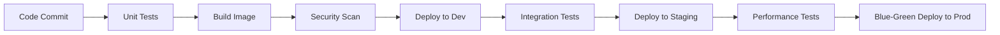

### 11.2 Deployment Strategies

| Strategy | Applicable Scenarios | Risk |
|----------|---------------------|------|
| Rolling Deployment | Standard updates | Low |
| Blue-Green Deployment | Critical business | Very Low |
| Canary | Major version updates | Controllable |

---

## 12. Troubleshooting

### 12.1 Common Issues

| Issue | Possible Cause | Solution |
|-------|---------------|----------|
| Slow Cold Start | Large dependencies/Slow initialization | Provisioned concurrency/Optimize initialization |
| Out of Memory | Insufficient configuration | Increase memory configuration |
| Timeout | Long processing time | Increase timeout/Use Fargate |
| Throttling | Insufficient concurrency | Increase reserved concurrency |

### 12.2 Debugging Tools

```bash
# Lambda logs
aws logs tail /aws/lambda/my-function --follow

# Fargate task logs
aws logs tail /ecs/my-service --follow

# X-Ray traces
aws xray get-service-graph --start-time $(date -d '1 hour ago' +%s)
```

---

## Summary

AWS Serverless provides powerful capabilities for building modern applications:

- **Lambda** is suitable for event-driven, short-duration tasks
- **Fargate** is suitable for long-running, complex applications
- **Hybrid usage** delivers optimal results

### Key Takeaways Review

| Dimension | Core Strategies |
|-----------|-----------------|
| **High Availability** | Multi-AZ deployment, stateless design, graceful degradation, automated failure recovery |
| **Cost Optimization** | Power Tuning, batch processing, Spot instances, tiered storage, VPC Endpoints |
| **Performance** | Provisioned concurrency, memory optimization, caching strategies, connection reuse |
| **Security** | Least privilege, encrypted transmission, secret management, VPC isolation |

### Decision Quick Reference

```
Choose Lambda when:
✓ Execution time < 15 minutes
✓ Event-driven architecture
✓ Need rapid auto-scaling
✓ Cost-sensitive low-traffic scenarios

Choose Fargate when:
✓ Execution time > 15 minutes
✓ Need long-running services
✓ Complex dependencies/Large memory requirements
✓ Existing containerized workloads

Hybrid Best Practices:
✓ API Gateway → Lambda (Auth/Routing)
✓ Lambda → Fargate (Complex processing)
✓ Step Functions orchestrates both
```

Continuously optimize performance, cost, high availability, and security to build production-grade serverless applications.

---

*Version: v1.1*  
*Updated: 2026-03-02*
