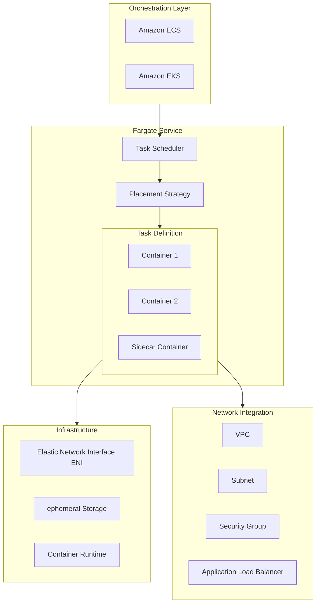
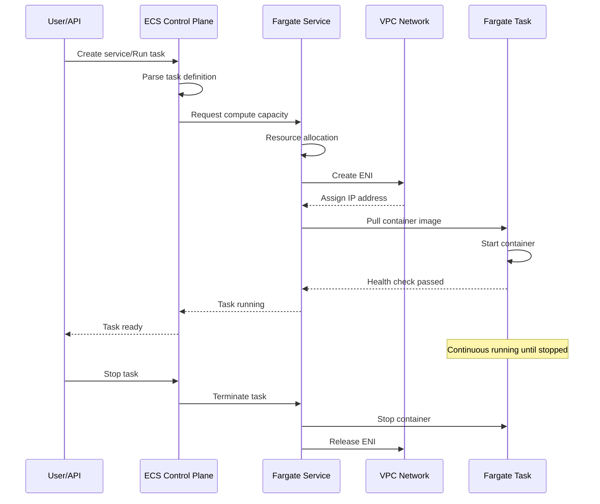
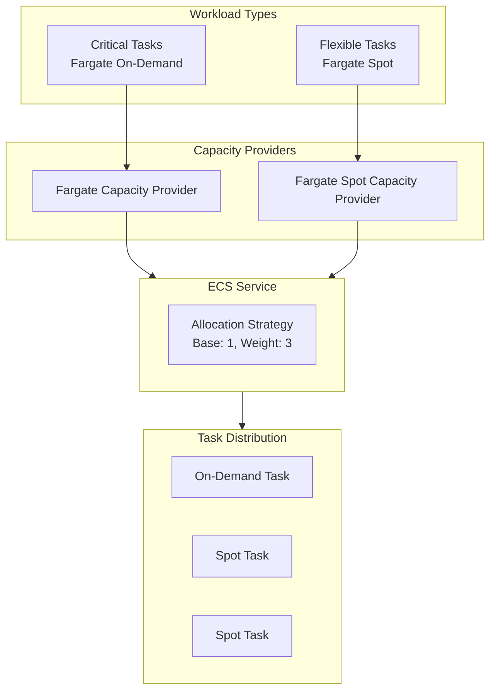
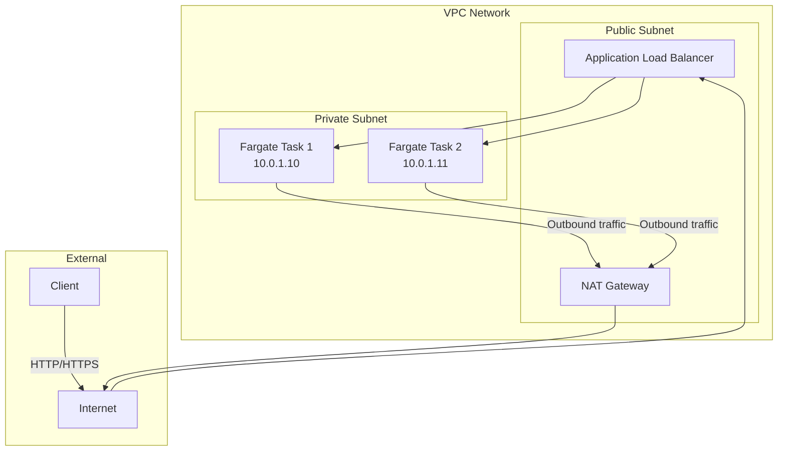
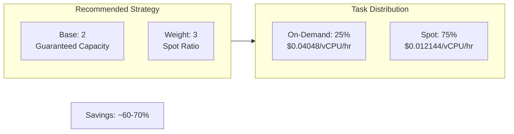

# AWS Fargate Deep Dive

> Complete Guide to Serverless Container Compute Service

---

## 🎯 Service Overview

**AWS Fargate** is a serverless compute engine provided by AWS that works with Amazon ECS and EKS, allowing you to run containers without managing servers or clusters. Simply define your application's resource and networking requirements, and Fargate handles all infrastructure provisioning and management.

**Core Features**:
- **Serverless Containers**: No EC2 instance management required
- **Pay-per-use**: Billed based on actual vCPU and memory usage
- **Secure Isolation**: Independent compute environment for each task
- **Seamless Integration**: Deep integration with ECS, EKS, and VPC

**Lambda vs Fargate Comparison**:

| Feature | Lambda | Fargate |
|---------|--------|---------|
| Runtime Duration | Max 15 minutes | Unlimited |
| Package Size | Max 10GB (container) | Unlimited |
| Startup Time | Milliseconds | Seconds (optimizable) |
| Use Cases | Event-driven, short tasks | Long-running, complex applications |
| Custom Runtime | Limited | Full control |
| Network Configuration | Simple | Flexible |

---

## 🏗️ Architecture Diagrams

### Fargate Overall Architecture



### ECS Fargate Launch Flow



### Fargate Spot Cost Optimization Architecture



---

## 📦 Core Components

### 1. Task Definition

```json
{
    "family": "web-application",
    "networkMode": "awsvpc",
    "requiresCompatibilities": ["FARGATE"],
    "cpu": "512",
    "memory": "1024",
    "executionRoleArn": "arn:aws:iam::account:role/ecsTaskExecutionRole",
    "taskRoleArn": "arn:aws:iam::account:role/ecsTaskRole",
    "containerDefinitions": [
        {
            "name": "web-app",
            "image": "account.dkr.ecr.region.amazonaws.com/web-app:latest",
            "essential": true,
            "portMappings": [
                {
                    "containerPort": 8080,
                    "protocol": "tcp"
                }
            ],
            "environment": [
                {"name": "DB_HOST", "value": "db.cluster-xxx.region.rds.amazonaws.com"}
            ],
            "secrets": [
                {
                    "name": "DB_PASSWORD",
                    "valueFrom": "arn:aws:secretsmanager:region:account:secret:db-password"
                }
            ],
            "logConfiguration": {
                "logDriver": "awslogs",
                "options": {
                    "awslogs-group": "/ecs/web-application",
                    "awslogs-region": "us-east-1",
                    "awslogs-stream-prefix": "ecs"
                }
            },
            "healthCheck": {
                "command": ["CMD-SHELL", "curl -f http://localhost:8080/health || exit 1"],
                "interval": 30,
                "timeout": 5,
                "retries": 3
            }
        }
    ]
}
```

### 2. Service Configuration Options

| Configuration | Description | Recommendation |
|---------------|-------------|----------------|
| **Desired Count** | Desired number of tasks | Set based on load |
| **Launch Type** | Launch type | FARGATE/FARGATE_SPOT |
| **Deployment Controller** | Deployment controller | ECS (rolling)/CODE_DEPLOY (blue-green) |
| **Health Check Grace Period** | Health check grace period | Set based on startup time |
| **Auto Scaling** | Auto scaling | Based on CPU/memory/custom metrics |

### 3. Network Mode (awsvpc)



---

## 💻 Code Examples

### ECS Fargate Service (AWS CDK)

```typescript
import * as cdk from 'aws-cdk-lib';
import * as ecs from 'aws-cdk-lib/aws-ecs';
import * as ec2 from 'aws-cdk-lib/aws-ec2';
import * as elbv2 from 'aws-cdk-lib/aws-elasticloadbalancingv2';

export class FargateServiceStack extends cdk.Stack {
  constructor(scope: cdk.App, id: string, props?: cdk.StackProps) {
    super(scope, id, props);

    // VPC Configuration
    const vpc = new ec2.Vpc(this, 'FargateVPC', {
      maxAzs: 2,
      natGateways: 1
    });

    // ECS Cluster
    const cluster = new ecs.Cluster(this, 'FargateCluster', {
      vpc: vpc,
      clusterName: 'production-cluster'
    });

    // Fargate Task Definition
    const taskDefinition = new ecs.FargateTaskDefinition(this, 'TaskDef', {
      memoryLimitMiB: 1024,
      cpu: 512,
      runtimePlatform: {
        operatingSystemFamily: ecs.OperatingSystemFamily.LINUX,
        cpuArchitecture: ecs.CpuArchitecture.X86_64
      }
    });

    // Add Container
    const container = taskDefinition.addContainer('web', {
      image: ecs.ContainerImage.fromRegistry('nginx:latest'),
      logging: ecs.LogDrivers.awsLogs({ streamPrefix: 'fargate' }),
      healthCheck: {
        command: ['CMD-SHELL', 'curl -f http://localhost/ || exit 1'],
        interval: cdk.Duration.seconds(30),
        timeout: cdk.Duration.seconds(5),
        retries: 3
      }
    });

    container.addPortMappings({
      containerPort: 80,
      protocol: ecs.Protocol.TCP
    });

    // Fargate Service
    const service = new ecs.FargateService(this, 'FargateService', {
      cluster: cluster,
      taskDefinition: taskDefinition,
      serviceName: 'web-service',
      desiredCount: 2,
      assignPublicIp: false,
      vpcSubnets: {
        subnetType: ec2.SubnetType.PRIVATE_WITH_EGRESS
      },
      capacityProviderStrategies: [
        {
          capacityProvider: 'FARGATE',
          weight: 1,
          base: 1
        },
        {
          capacityProvider: 'FARGATE_SPOT',
          weight: 3
        }
      ]
    });

    // Application Load Balancer
    const alb = new elbv2.ApplicationLoadBalancer(this, 'ALB', {
      vpc: vpc,
      internetFacing: true
    });

    const listener = alb.addListener('Listener', {
      port: 80,
      open: true
    });

    listener.addTargets('ECS', {
      port: 80,
      targets: [service],
      healthCheck: {
        path: '/health',
        interval: cdk.Duration.seconds(30)
      }
    });
  }
}
```

### Auto Scaling Configuration

```typescript
// CPU Scaling Policy
const scaling = service.autoScaleTaskCount({
  minCapacity: 2,
  maxCapacity: 20
});

scaling.scaleOnCpuUtilization('CpuScaling', {
  targetUtilizationPercent: 70,
  scaleInCooldown: cdk.Duration.seconds(60),
  scaleOutCooldown: cdk.Duration.seconds(60)
});

// Custom Metric Scaling
scaling.scaleOnMetric('RequestCountScaling', {
  metric: alb.metricRequestCount(),
  targetValue: 1000,
  scaleInCooldown: cdk.Duration.seconds(60),
  scaleOutCooldown: cdk.Duration.seconds(60)
});
```

### Terraform Configuration

```hcl
# Fargate Task Definition
resource "aws_ecs_task_definition" "app" {
  family                   = "web-app"
  requires_compatibilities = ["FARGATE"]
  network_mode             = "awsvpc"
  cpu                      = "512"
  memory                   = "1024"
  execution_role_arn       = aws_iam_role.ecs_execution.arn
  task_role_arn            = aws_iam_role.ecs_task.arn

  container_definitions = jsonencode([
    {
      name  = "web"
      image = "${aws_ecr_repository.app.repository_url}:latest"
      essential = true
      
      portMappings = [
        {
          containerPort = 8080
          protocol      = "tcp"
        }
      ]
      
      environment = [
        { name = "NODE_ENV", value = "production" }
      ]
      
      secrets = [
        {
          name      = "DATABASE_URL"
          valueFrom = aws_secretsmanager_secret.db_url.arn
        }
      ]
      
      logConfiguration = {
        logDriver = "awslogs"
        options = {
          awslogs-group         = aws_cloudwatch_log_group.app.name
          awslogs-region        = data.aws_region.current.name
          awslogs-stream-prefix = "ecs"
        }
      }
      
      healthCheck = {
        command     = ["CMD-SHELL", "curl -f http://localhost:8080/health || exit 1"]
        interval    = 30
        timeout     = 5
        retries     = 3
        startPeriod = 60
      }
    }
  ])
}

# Fargate Service
resource "aws_ecs_service" "app" {
  name            = "web-service"
  cluster         = aws_ecs_cluster.main.id
  task_definition = aws_ecs_task_definition.app.arn
  desired_count   = 2
  launch_type     = "FARGATE"

  network_configuration {
    subnets          = aws_subnet.private[*].id
    security_groups  = [aws_security_group.ecs_tasks.id]
    assign_public_ip = false
  }

  load_balancer {
    target_group_arn = aws_lb_target_group.app.arn
    container_name   = "web"
    container_port   = 8080
  }

  deployment_controller {
    type = "ECS"
  }

  deployment_circuit_breaker {
    enable   = true
    rollback = true
  }

  depends_on = [aws_lb_listener.https]
}
```

---

## 🚀 Performance Optimization

### 1. Image Optimization

```dockerfile
# Multi-stage build to reduce image size
FROM node:18-alpine AS builder
WORKDIR /app
COPY package*.json ./
RUN npm ci --only=production

FROM node:18-alpine
WORKDIR /app
# Copy only production dependencies
COPY --from=builder /app/node_modules ./node_modules
COPY . .
EXPOSE 8080
CMD ["node", "server.js"]
```

### 2. Startup Optimization

```python
# Health check endpoint - Fast response
from flask import Flask, jsonify

app = Flask(__name__)

@app.route('/health')
def health():
    # Simple check, quick return
    return jsonify({'status': 'healthy'}), 200

@app.route('/ready')
def ready():
    # Check dependencies (database, etc.)
    if check_dependencies():
        return jsonify({'status': 'ready'}), 200
    return jsonify({'status': 'not ready'}), 503
```

### 3. Capacity Provider Strategy



---

## 🔒 Security Best Practices

### Task IAM Role

```json
{
    "Version": "2012-10-17",
    "Statement": [
        {
            "Effect": "Allow",
            "Action": [
                "s3:GetObject",
                "s3:PutObject"
            ],
            "Resource": "arn:aws:s3:::app-bucket/*"
        },
        {
            "Effect": "Allow",
            "Action": [
                "dynamodb:GetItem",
                "dynamodb:PutItem",
                "dynamodb:Query"
            ],
            "Resource": "arn:aws:dynamodb:region:account:table/AppTable"
        },
        {
            "Effect": "Allow",
            "Action": [
                "secretsmanager:GetSecretValue"
            ],
            "Resource": "arn:aws:secretsmanager:region:account:secret:app/*"
        }
    ]
}
```

### Security Group Configuration

```hcl
# Only allow inbound traffic from ALB
resource "aws_security_group" "ecs_tasks" {
  name        = "ecs-tasks-sg"
  description = "Security group for ECS tasks"
  vpc_id      = aws_vpc.main.id

  ingress {
    from_port       = 8080
    to_port         = 8080
    protocol        = "tcp"
    security_groups = [aws_security_group.alb.id]
  }

  egress {
    from_port   = 0
    to_port     = 0
    protocol    = "-1"
    cidr_blocks = ["0.0.0.0/0"]
  }
}
```

---

## 💰 Cost Optimization

### Fargate Pricing Calculation

```
Fargate Pricing = vCPU Charges + Memory Charges

vCPU Charges = vCPU count × Runtime (hours) × $0.04048
Memory Charges = GB count × Runtime (hours) × $0.004445

Example:
- Task Configuration: 1 vCPU, 2GB Memory
- Runtime: 24 hours/day × 30 days = 720 hours
- Number of Tasks: 3

vCPU Charges = 1 × 720 × 3 × $0.04048 = $87.44
Memory Charges = 2 × 720 × 3 × $0.004445 = $19.20
Monthly Cost = $106.64

Using Fargate Spot (70% savings):
Monthly Cost ≈ $32.00
```

### Cost Optimization Strategies

1. **Use Graviton2 (ARM64)**: Lower price, better performance
2. **Fargate Spot**: For fault-tolerant workloads
3. **Right-sizing**: Adjust resource configuration based on actual usage
4. **Auto Scaling**: Avoid over-provisioning
5. **Reserved Instances**: Consider Compute Savings Plans for long-term stable workloads

---

## 📊 Monitoring and Observability

### Container Insights

```bash
# Enable Container Insights
aws ecs put-cluster-setting \
    --cluster production \
    --setting name=containerInsights,value=enabled \
    --region us-east-1
```

### Key Metrics

| Metric | Description | Alert Threshold |
|--------|-------------|-----------------|
| **CPUUtilization** | CPU usage | > 70% |
| **MemoryUtilization** | Memory usage | > 80% |
| **RunningTaskCount** | Running task count | < desired count |
| **PendingTaskCount** | Pending task count | > 0 for 5 minutes |
| **DeploymentFailures** | Deployment failure count | > 0 |

---

## 🔗 Related Resources

- [AWS Fargate Official Documentation](https://docs.aws.amazon.com/AmazonECS/latest/userguide/what-is-fargate.html)
- [ECS Best Practices](https://docs.aws.amazon.com/AmazonECS/latest/bestpracticesguide/intro.html)
- [Fargate Pricing](https://aws.amazon.com/fargate/pricing/)
- [ECS Sample Code](https://github.com/aws-samples/aws-ecs-samples)
