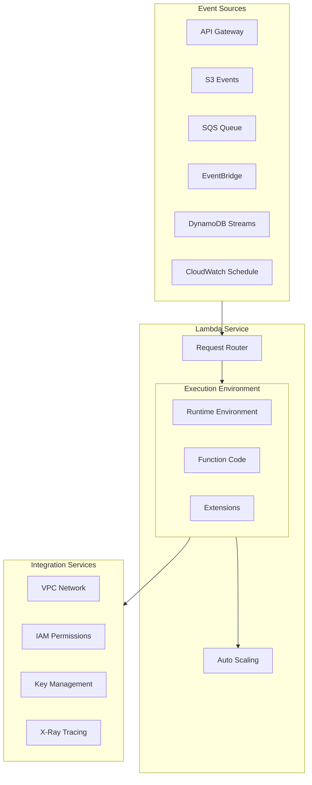
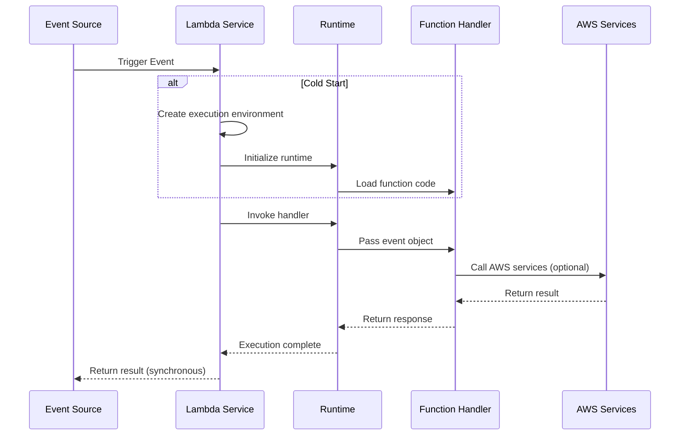
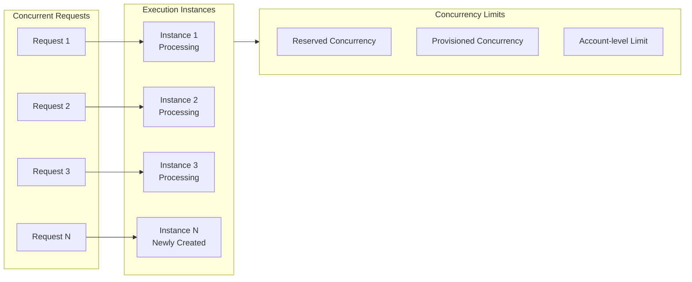

# AWS Lambda Deep Dive

> Comprehensive Guide to Mastering Serverless Computing Core Service

---

## 🎯 Service Overview

**AWS Lambda** is a serverless computing service provided by AWS that lets you run code without provisioning or managing servers. Simply upload your code, and Lambda handles everything needed to run and scale your code with high availability.

**Core Features**:
- **Serverless**: No infrastructure management required
- **Auto Scaling**: From a few requests per day to thousands per second
- **Pay-per-use**: Billed based on code execution time and request count
- **Event-driven**: Responds to various AWS service events

---

## 🏗️ Architecture Diagrams

### Lambda Overall Architecture



### Function Execution Flow



### Concurrency and Scaling Architecture



---

## 📦 Core Components

### 1. Function Configuration

| Configuration | Description | Recommended Value |
|---------------|-------------|-------------------|
| **Memory** | 128MB - 10GB | Adjust based on needs, affects CPU |
| **Timeout** | Max 15 minutes | Set reasonable timeout to prevent hanging |
| **Runtime** | Node.js/Python/Java/Go etc. | Choose familiar language |
| **Environment Variables** | Configuration parameters | Use encryption to protect sensitive data |
| **VPC** | Network configuration | Enable only when needed |

### 2. Trigger Types

```
Trigger Type               Use Cases
─────────────────────────────────────────
API Gateway           REST API/WebSocket
Application Load Balancer  HTTP/HTTPS
S3                    File upload/processing events
SQS                   Asynchronous message processing
EventBridge           Scheduled tasks/Event response
DynamoDB Streams      Database change processing
Kinesis               Stream data processing
CloudWatch Logs       Log processing
Cognito               User authentication triggers
```

### 3. Deployment Methods

| Method | Use Case | Characteristics |
|--------|----------|-----------------|
| **Console Editor** | Quick testing | Suitable for simple functions |
| **ZIP Upload** | Small projects | Code + dependencies packaged |
| **Container Image** | Complex dependencies | Max 10GB |
| **S3 Deployment** | Large projects | With CI/CD |
| **SAM/CloudFormation** | Production | Infrastructure as Code |

---

## 💻 Code Examples

### Basic Lambda Function (Python)

```python
import json
import boto3

def lambda_handler(event, context):
    """
    Lambda handler function entry point
    
    event: Trigger event data
    context: Runtime context
    """
    # Get request parameters
    name = event.get('name', 'World')
    
    # Business logic
    message = f"Hello, {name}!"
    
    # Return response
    return {
        'statusCode': 200,
        'headers': {
            'Content-Type': 'application/json',
            'Access-Control-Allow-Origin': '*'
        },
        'body': json.dumps({
            'message': message,
            'requestId': context.aws_request_id
        })
    }
```

### Lambda with Error Handling

```python
import json
import logging
from botocore.exceptions import ClientError

logger = logging.getLogger()
logger.setLevel(logging.INFO)

def lambda_handler(event, context):
    try:
        # Input validation
        if 'userId' not in event:
            raise ValueError("userId is required")
        
        # Business processing
        result = process_user(event['userId'])
        
        return {
            'statusCode': 200,
            'body': json.dumps(result)
        }
        
    except ValueError as e:
        logger.warning(f"Validation error: {str(e)}")
        return {
            'statusCode': 400,
            'body': json.dumps({'error': str(e)})
        }
        
    except ClientError as e:
        logger.error(f"AWS API error: {str(e)}")
        return {
            'statusCode': 500,
            'body': json.dumps({'error': 'Service temporarily unavailable'})
        }
        
    except Exception as e:
        logger.exception("Unexpected error")
        raise

def process_user(user_id):
    # Business logic
    return {'userId': user_id, 'status': 'processed'}
```

### Lambda Layer Usage

```python
# Using Lambda Layer for shared code
import requests  # Dependencies provided via Layer
from shared_utils import validate_input  # Custom Layer

def lambda_handler(event, context):
    # Use utility functions from Layer
    if not validate_input(event):
        return {'statusCode': 400, 'body': 'Invalid input'}
    
    # Use libraries from Layer
    response = requests.get('https://api.example.com/data')
    
    return {
        'statusCode': 200,
        'body': response.json()
    }
```

---

## 🚀 Performance Optimization

### 1. Reduce Cold Start

```python
# Global initialization (outside function) - executes only once
import boto3

dynamodb = boto3.resource('dynamodb')  # Reuse connection
table = dynamodb.Table('Users')        # Pre-load table

def lambda_handler(event, context):
    # Function logic - executed on each invocation
    response = table.get_item(Key={'id': event['userId']})
    return response
```

### 2. Provisioned Concurrency

```bash
# Configure provisioned concurrency - avoid cold starts
aws lambda put-provisioned-concurrency-config \
    --function-name my-function \
    --qualifier PROD \
    --provisioned-concurrent-executions 100
```

### 3. Memory Optimization

| Memory(MB) | Memory Price/1ms | Relative CPU |
|------------|------------------|--------------|
| 128 | $0.0000000021 | Baseline |
| 512 | $0.0000000083 | ~3x |
| 1024 | $0.0000000167 | ~6x |
| 3008 | $0.0000000490 | ~18x |

**Optimization Strategy**: 
- Find the optimal balance between performance and cost
- Use Power Tuning tool for testing

---

## 🔒 Security Best Practices

### IAM Least Privilege Principle

```json
{
    "Version": "2012-10-17",
    "Statement": [
        {
            "Effect": "Allow",
            "Action": [
                "dynamodb:GetItem",
                "dynamodb:PutItem"
            ],
            "Resource": "arn:aws:dynamodb:region:account:table/SpecificTable"
        },
        {
            "Effect": "Allow",
            "Action": "logs:CreateLogGroup",
            "Resource": "arn:aws:logs:region:account:*"
        },
        {
            "Effect": "Allow",
            "Action": [
                "logs:CreateLogStream",
                "logs:PutLogEvents"
            ],
            "Resource": "arn:aws:logs:region:account:log-group:/aws/lambda/function-name:*"
        }
    ]
}
```

### Environment Variable Encryption

```bash
# Encrypt environment variables using KMS
aws lambda update-function-configuration \
    --function-name my-function \
    --environment Variables={API_KEY=plaintext_value} \
    --kms-key-arn arn:aws:kms:region:account:key/key-id
```

---

## 📊 Monitoring and Debugging

### CloudWatch Metrics

```python
import boto3
from datetime import datetime, timedelta

cloudwatch = boto3.client('cloudwatch')

# Get function metrics
response = cloudwatch.get_metric_statistics(
    Namespace='AWS/Lambda',
    MetricName='Duration',
    Dimensions=[
        {'Name': 'FunctionName', 'Value': 'my-function'}
    ],
    StartTime=datetime.utcnow() - timedelta(hours=1),
    EndTime=datetime.utcnow(),
    Period=300,
    Statistics=['Average', 'Maximum']
)
```

### X-Ray Distributed Tracing

```python
from aws_xray_sdk.core import xray_recorder, patch_all

patch_all()  # Automatically trace all AWS SDK calls

@xray_recorder.capture('process_payment')
def process_payment(order_id):
    # This code will be traced
    pass

def lambda_handler(event, context):
    # Add custom annotation
    xray_recorder.put_annotation('orderId', event['orderId'])
    
    process_payment(event['orderId'])
    
    return {'statusCode': 200}
```

---

## 💰 Cost Optimization

### Pricing Calculation

```
Monthly Cost = Request Charges + Compute Charges

Request Charges = Request count × $0.20/million requests

Compute Charges = Invocation count × Execution time(ms) × Memory(GB) × $0.0000166667/GB-second

Example:
- 100 million requests per month
- Average execution time 200ms
- Memory configuration 512MB (0.5GB)

Request Charges = 100 × $0.20 = $20
Compute Charges = 100,000,000 × 0.2 × 0.5 × $0.0000166667 = $166.67
Total Cost = $186.67/month
```

### Cost Saving Strategies

1. **Use Graviton2 Processor**: 20% cheaper, better performance
2. **Optimize Memory Configuration**: Find the best price-performance point
3. **Reduce Unnecessary Invocations**: Use SQS batch processing
4. **Reserved Concurrency**: For workloads with predictable traffic
5. **Use Compute Savings Plans**: Long-term commitment discounts

---

## 🔗 Related Resources

- [AWS Lambda Official Documentation](https://docs.aws.amazon.com/lambda/)
- [Lambda Best Practices](https://docs.aws.amazon.com/lambda/latest/dg/best-practices.html)
- [Lambda Power Tuning](https://github.com/alexcasalboni/aws-lambda-power-tuning)
- [AWS SAM](https://docs.aws.amazon.com/serverless-application-model/)
