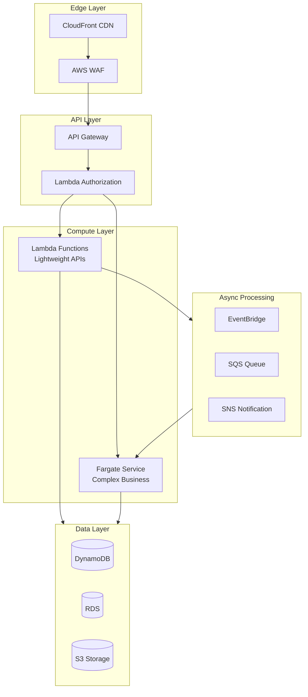
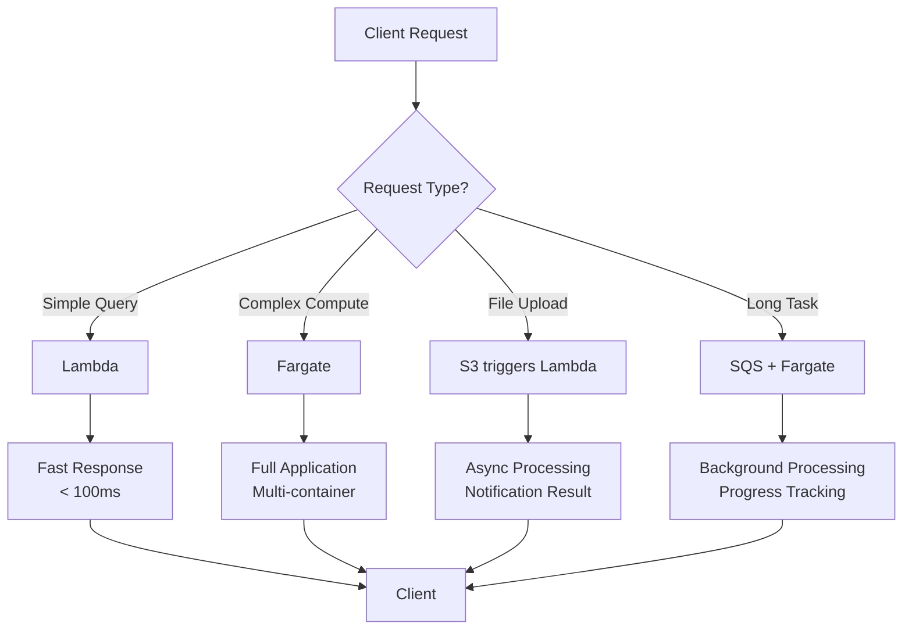
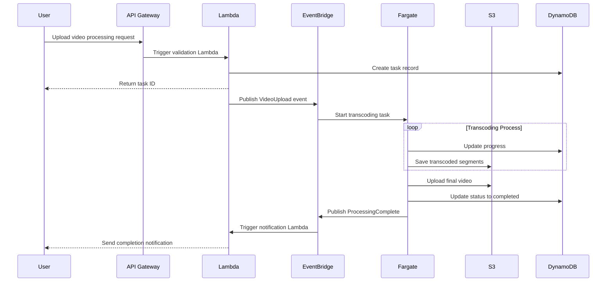
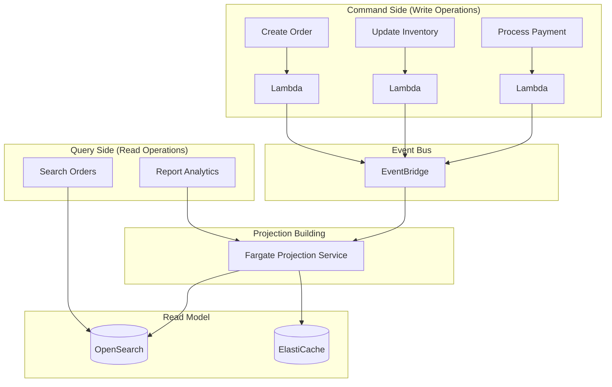

# Lambda and Fargate Integration Patterns

> Best Practices for Building Modern Serverless Applications

---

## 🎯 Overview

Lambda and Fargate are not mutually exclusive, but complementary serverless computing options. Understanding when to use which service and how to combine them is key to building efficient, economical, and scalable architectures.

**Decision Matrix**:

| Scenario | Recommended Service | Reason |
|----------|---------------------|--------|
| API Request Processing (< 15 minutes) | Lambda | Low latency, auto scaling |
| Long-running Data Processing | Fargate | No timeout limits |
| Machine Learning Inference | Both | Choose based on model size |
| Video Transcoding | Fargate | Compute-intensive, long duration |
| Scheduled Tasks | Lambda | Simple, low cost |
| Complex Workflows | Lambda + Fargate | Combined advantages |

---

## 🏗️ Architecture Diagrams

### Lambda + Fargate Hybrid Architecture



### Request Routing Decision Flow



### Event-Driven Workflow



---

## 💻 Integration Patterns

### Pattern 1: Lambda Triggers Fargate Task

Suitable for scenarios requiring quick response and launching long-running processing tasks.

```python
import boto3
import json

ecs = boto3.client('ecs')

def lambda_handler(event, context):
    """
    Triggered by API Gateway, starts Fargate task processing
    """
    # Validate input
    job_id = event.get('jobId')
    if not job_id:
        return {'statusCode': 400, 'body': 'jobId required'}
    
    # Start Fargate task
    response = ecs.run_task(
        cluster='processing-cluster',
        taskDefinition='video-processor:3',
        launchType='FARGATE',
        networkConfiguration={
            'awsvpcConfiguration': {
                'subnets': ['subnet-xxx', 'subnet-yyy'],
                'securityGroups': ['sg-xxx'],
                'assignPublicIp': 'DISABLED'
            }
        },
        overrides={
            'containerOverrides': [
                {
                    'name': 'processor',
                    'environment': [
                        {'name': 'JOB_ID', 'value': job_id},
                        {'name': 'INPUT_BUCKET', 'value': event.get('bucket')},
                        {'name': 'INPUT_KEY', 'value': event.get('key')}
                    ]
                }
            ]
        }
    )
    
    task_arn = response['tasks'][0]['taskArn']
    
    return {
        'statusCode': 202,
        'body': json.dumps({
            'message': 'Processing started',
            'jobId': job_id,
            'taskArn': task_arn
        })
    }
```

### Pattern 2: Fargate Calls Lambda

Suitable for scenarios where specific serverless functions need to be executed within container applications.

```python
# Code in Fargate container
import boto3
import json

lambda_client = boto3.client('lambda')

def process_order(order_data):
    # Business processing...
    
    # Call Lambda for validation
    response = lambda_client.invoke(
        FunctionName='order-validation',
        InvocationType='RequestResponse',
        Payload=json.dumps({
            'orderId': order_data['id'],
            'amount': order_data['amount'],
            'customerId': order_data['customer_id']
        })
    )
    
    result = json.loads(response['Payload'].read())
    
    if result.get('valid'):
        # Continue processing
        return complete_order(order_data)
    else:
        # Reject order
        return {'status': 'rejected', 'reason': result.get('reason')}
```

### Pattern 3: Coordination via Event Bus

Use EventBridge to achieve loosely coupled Lambda-Fargate collaboration.

```yaml
# SAM Template Definition
AWSTemplateFormatVersion: '2010-09-09'
Transform: AWS::Serverless-2016-10-31

Resources:
  # Lambda Function - Event Producer
  OrderProcessor:
    Type: AWS::Serverless::Function
    Properties:
      CodeUri: src/order_processor
      Handler: app.lambda_handler
      Runtime: python3.11
      Events:
        ApiEvent:
          Type: Api
          Properties:
            Path: /orders
            Method: post
      Environment:
        Variables:
          EVENT_BUS_NAME: !Ref OrderEventBus
      Policies:
        - EventBridgePutEventsPolicy:
            EventBusName: !Ref OrderEventBus

  # EventBridge Event Bus
  OrderEventBus:
    Type: AWS::Events::EventBus
    Properties:
      Name: order-events

  # EventBridge Rule - Trigger Lambda
  LightProcessingRule:
    Type: AWS::Events::Rule
    Properties:
      EventBusName: !Ref OrderEventBus
      EventPattern:
        source:
          - order.service
        detail-type:
          - Order Created
        detail:
          priority:
            - low
      Targets:
        - Arn: !GetAtt LightOrderProcessor.Arn
          Id: LightOrderProcessor

  # EventBridge Rule - Trigger Fargate
  HeavyProcessingRule:
    Type: AWS::Events::Rule
    Properties:
      EventBusName: !Ref OrderEventBus
      EventPattern:
        source:
          - order.service
        detail-type:
          - Order Created
        detail:
          priority:
            - high
      Targets:
        - Arn: !Ref OrderProcessingCluster
          Id: FargateTask
          RoleArn: !GetAtt EventBridgeRole.Arn
          EcsParameters:
            TaskDefinitionArn: !Ref HeavyProcessorTask
            TaskCount: 1
            LaunchType: FARGATE
            NetworkConfiguration:
              AwsVpcConfiguration:
                Subnets: [!Ref PrivateSubnet1, !Ref PrivateSubnet2]
                SecurityGroups: [!Ref EcsSecurityGroup]
                AssignPublicIp: DISABLED
```

---

## 📐 Design Patterns

### 1. Strangler Fig Pattern

Gradually migrate monolithic applications to serverless architecture.

```mermaid
flowchart LR
    subgraph Phase1["Phase 1: Edge Lambda"]
        Client1[Client]
        Lambda1[Lambda@Edge]
        Monolith1[Monolith]
        Client1 --> Lambda1 --> Monolith1
    end
    
    subgraph Phase2["Phase 2: API Decomposition"]
        Client2[Client]
        APIGW[API Gateway]
        Lambda2[New Lambda]
        Monolith2[Remaining Monolith]
        Client2 --> APIGW
        APIGW --> Lambda2
        APIGW --> Monolith2
    end
    
    subgraph Phase3["Phase 3: Fully Serverless"]
        Client3[Client]
        APIGW2[API Gateway]
        Lambda3[Lambda]
        Fargate[Fargate Service]
        Client3 --> APIGW2
        APIGW2 --> Lambda3
        APIGW2 --> Fargate
    end
    
    Phase1 --> Phase2 --> Phase3
```

### 2. Saga Pattern (Distributed Transactions)

Use Lambda to orchestrate distributed transactions for Fargate services.

```python
import boto3
import json

ecs = boto3.client('ecs')
sns = boto3.client('sns')

def saga_orchestrator(event, context):
    """
    Saga Pattern Orchestrator - Manages Distributed Transactions
    """
    saga_id = event['sagaId']
    steps = [
        {'service': 'inventory', 'action': 'reserve'},
        {'service': 'payment', 'action': 'charge'},
        {'service': 'shipping', 'action': 'schedule'}
    ]
    
    completed_steps = []
    
    try:
        for step in steps:
            # Execute step
            result = execute_step(step, saga_id)
            
            if result['success']:
                completed_steps.append(step)
            else:
                # Execute compensation
                compensate(completed_steps, saga_id)
                return {'status': 'failed', 'step': step['service']}
        
        return {'status': 'success', 'sagaId': saga_id}
        
    except Exception as e:
        compensate(completed_steps, saga_id)
        raise

def execute_step(step, saga_id):
    """Execute single Saga step"""
    response = ecs.run_task(
        cluster=f"{step['service']}-cluster",
        taskDefinition=f"{step['service']}-{step['action']}",
        launchType='FARGATE',
        overrides={
            'containerOverrides': [{
                'name': step['service'],
                'environment': [
                    {'name': 'SAGA_ID', 'value': saga_id},
                    {'name': 'ACTION', 'value': step['action']}
                ]
            }]
        }
    )
    
    # Wait for task completion (simplified example)
    return {'success': True, 'taskArn': response['tasks'][0]['taskArn']}

def compensate(completed_steps, saga_id):
    """Execute compensation operations"""
    for step in reversed(completed_steps):
        ecs.run_task(
            cluster=f"{step['service']}-cluster",
            taskDefinition=f"{step['service']}-compensate",
            launchType='FARGATE',
            overrides={
                'containerOverrides': [{
                    'name': step['service'],
                    'environment': [
                        {'name': 'SAGA_ID', 'value': saga_id}
                    ]
                }]
            }
        )
```

### 3. CQRS Pattern (Command Query Responsibility Segregation)

Use Lambda for command processing and Fargate for complex queries.



---

## 🚀 Deployment Strategies

### Blue-Green Deployment

```typescript
// CDK Implementation of Blue-Green Deployment
const service = new ecs.FargateService(this, 'Service', {
  cluster,
  taskDefinition,
  deploymentController: {
    type: ecs.DeploymentControllerType.CODE_DEPLOY
  },
  circuitBreaker: { rollback: true }
});

// CodeDeploy Application
new codedeploy.EcsApplication(this, 'CodeDeployApp', {
  applicationName: 'MyApplication'
});

// Deployment Group Configuration
const deploymentGroup = new codedeploy.EcsDeploymentGroup(this, 'DeploymentGroup', {
  application: codedeployApp,
  service,
  deploymentConfig: codedeploy.EcsDeploymentConfig.CANARY_10_PERCENT_5_MINUTES,
  blueGreenDeploymentConfig: {
    blueTargetGroup,
    greenTargetGroup,
    listener
  }
});
```

### Canary Deployment

```bash
# Implement Canary Release using App Mesh
# 1. Create new version service
aws ecs create-service \
    --cluster production \
    --service-name api-v2 \
    --task-definition api:2 \
    --launch-type FARGATE \
    --desired-count 1

# 2. Configure App Mesh route weights
aws appmesh update-route \
    --mesh-name production \
    --virtual-router-name api-router \
    --route-name api-route \
    --spec file://canary-10-percent.json

# 3. Gradually increase traffic weights
# 10% -> 25% -> 50% -> 100%
```

---

## 💰 Cost Optimization Comparison

| Scenario | Pure Lambda | Pure Fargate | Hybrid Solution | Optimal Choice |
|----------|-------------|--------------|-----------------|----------------|
| Low-frequency API (1K/day) | $0.20 | $15 | $0.20 | Lambda |
| High-frequency API (1M/day) | $200 | $150 | $120 | Hybrid |
| Continuous Processing | N/A | $100 | $100 | Fargate |
| Burst Traffic | $50 | $200 | $80 | Hybrid |

---

## 🔗 Related Resources

- [AWS Serverless Application Model (SAM)](https://docs.aws.amazon.com/serverless-application-model/)
- [AWS Copilot](https://aws.github.io/copilot-cli/)
- [Serverless Framework](https://www.serverless.com/)
- [AWS Architecture Center - Serverless](https://aws.amazon.com/architecture/serverless/)
