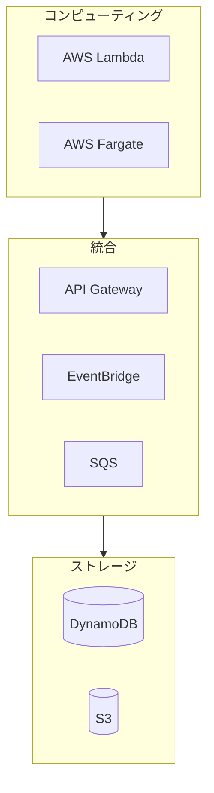

# Serverless 技術リソース ナビゲーション

> AWS サーバーレスコンピューティング完全学習ガイド

---

## 📚 リソース概要

本テーマは AWS サーバーレスコンピューティングの中核サービスを深く解説します。

### コアサービス

- **AWS Lambda** - イベント駆動型関数コンピューティング
- **AWS Fargate** - サーバーレスコンテナコンピューティング



---

## 📖 ドキュメント一覧

### 電子書籍 (ebooks/)

| ドキュメント | 説明 | 用途 |
|-------------|------|------|
| `Serverless_Whitepaper.md` | **技術白書** - 体系的ガイド | 深い学習、参照 |
| `Serverless_Quick_Reference.md` | **クイックリファレンス** | 日常開発、早見表 |
| `Serverless_Learning_Roadmap.md` | **学習ロードマップ** - 16週間計画 | 段階的学習 |

### 技術ドキュメント (materials/)

| ドキュメント | 内容 |
|-------------|------|
| `aws_lambda_deep_dive.md` | Lambda 深度解説 |
| `aws_fargate_deep_dive.md` | Fargate 深度解説 |
| `lambda_fargate_integration.md` | 統合パターン |

---

## 💻 実践プロジェクト

| プロジェクト | 難易度 | 技術スタック |
|------------|--------|-------------|
| Serverless REST API | ⭐ 入門 | Lambda + API Gateway |
| コンテナ化マイクロサービス | ⭐⭐ 中級 | Fargate + ALB |
| ハイブリッドデータ処理 | ⭐⭐⭐ 上級 | Lambda + Fargate |

---

## 🚀 クイックスタート

```bash
cd ja/ebooks/
cat README.md
```

**Serverless の学習を始めましょう！** 🚀
