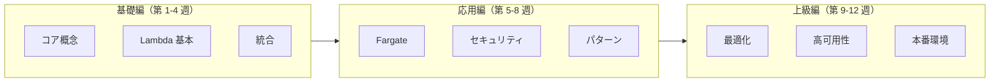

# AWS Serverless 学習ロードマップ

> 初心者からエキスパートへの 12 週間の旅

---

## 学習パス概要

---

## 第 1-4 週: 基礎編

### 第 1 週: Serverless 概念
- Serverless 実行モデルを理解する
- AWS Serverless サービスランドスケープを探索する
- イベント駆動型アーキテクチャについて学ぶ
- **実践**: 最初の Lambda 関数を作成する

### 第 2 週: Lambda 基本
- Lambda 実行環境を深く学ぶ
- コールドスタートとウォームスタートを理解する
- コンカレンシーとスケーリング動作を学ぶ
- **実践**: API Gateway + Lambda で CRUD API を構築する

### 第 3 週: 統合パターン
- S3、SQS、SNS、EventBridge の統合
- DynamoDB Streams と Kinesis
- オーケストレーションのための Step Functions
- **実践**: イベント駆動型処理パイプラインを構築する

### 第 4 週: インフラストラクチャ as Code
- AWS SAM の基礎
- CloudFormation の基本
- SAM CLI を使用したローカルテスト
- **プロジェクト**: SAM でマルチ関数アプリケーションをデプロイする

---

## 第 5-8 週: 応用編

### 第 5 週: Fargate とコンテナ
- Fargate vs Lambda 判断マトリクス
- コンテナイメージ最適化
- タスク定義とサービスデプロイメント
- **実践**: Fargate でコンテナ化 Web アプリをデプロイする

### 第 6 週: セキュリティベストプラクティス
- Lambda の IAM 最小権限
- Fargate の VPC ネットワーキング
- Secrets Manager を使用したシークレット管理
- **実践**: VPC と暗号化で Lambda 関数を保護する

### 第 7 週: 高度なパターン
- Step Functions を使用した Saga パターン
- CQRS とイベントソーシング
- ファンアウトとファンイン パターン
- **実践**: 注文処理の Saga を実装する

### 第 8 週: 可観測性
- CloudWatch Logs と Metrics
- X-Ray 分散トレーシング
- 構造化ログのベストプラクティス
- **プロジェクト**: 第 4 週のプロジェクトに包括的なモニタリングを追加する

---

## 第 9-12 週: 上級編

### 第 9 週: パフォーマンス最適化
- コールドスタート緩和戦略
- Provisioned Concurrency チューニング
- メモリと CPU の最適化
- **実践**: Lambda 関数を 100ms 未満のレスポンスに最適化する

### 第 10 週: 高可用性
- マルチリージョンデプロイメント
- 災害復旧戦略
- ヘルスチェックとサーキットブレーカー
- **実践**: マルチリージョン Serverless アプリケーションを構築する

### 第 11 週: コスト最適化
- Serverless 料金モデルを理解する
- Reserved Capacity と Savings Plans
- コストモニタリングとアラート
- **実践**: 本番ワークロードのコスト最適化を実装する

### 第 12 週: 本番環境対応
- Serverless の CI/CD パイプライン
- ブルーグリーンとカナリアデプロイメント
- 災害復旧テスト
- ** capstone プロジェクト**: エンドツーエンドの本番 Serverless プラットフォーム

---

## 推奨リソース

### ドキュメント
- [AWS Lambda 開発者ガイド](https://docs.aws.amazon.com/lambda/latest/dg/)
- [AWS SAM 開発者ガイド](https://docs.aws.amazon.com/serverless-application-model/)

### 書籍
- "Serverless Architectures on AWS" by Peter Sbarski
- "AWS Lambda in Action" by Danilo Poccia

### 認定資格
- AWS Certified Developer - Associate
- AWS Certified Solutions Architect - Associate
- AWS Certified DevOps Engineer - Professional

---

**今日から Serverless の旅を始めましょう！** 🚀
