# Serverless 学習ロードマップ

> 16週間で AWS サーバーレスコンピューティングをマスターする

---

## 🗺️ 学習パス概要

```mermaid
flowchart LR
    subgraph Foundation["基礎段階<br/>第1-4週"]
        F1[Serverless概念]
        F2[Lambda基礎]
        F3[API Gateway]
        F4[イベント駆動]
    end
    
    subgraph Intermediate["中級段階<br/>第5-8週"]
        I1[Fargate入門]
        I2[コンテナ化アプリケーション]
        I3[サービスオーケストレーション]
        I4[CI/CD]
    end
    
    subgraph Advanced["上級段階<br/>第9-12週"]
        A1[ハイブリッドアーキテクチャ]
        A2[パフォーマンス最適化]
        A3[セキュリティ実践]
        A4[モニタリングアラート]
    end
    
    subgraph Production["本番段階<br/>第13-16週"]
        P1[コスト最適化]
        P2[トラブルシューティング]
        P3[大規模設計]
        P4[プロジェクト実践]
    end
    
    Foundation --> Intermediate --> Advanced --> Production
```



---

## 📅 詳細学習計画

### 第一段階: Serverless 基礎 (第1-4週)

#### 第1週: Serverless 概念と AWS 入門

**学習目標**: Serverless のコア概念を理解する

**学習内容**:
- [ ] Serverless コンピューティングとは何か
- [ ] Serverless vs 従来のサーバー
- [ ] AWS Serverless サービス概要
- [ ] AWS アカウント作成と CLI 設定

**実践タスク**:
```bash
# AWS CLI のインストール
pip install awscli
aws configure

# 設定の確認
aws sts get-caller-identity
```

**所要時間**: 5-7時間

---

#### 第2週: Lambda 基礎

**学習目標**: Lambda のコア概念と基本操作を習得する

**学習内容**:
- [ ] Lambda 実行モデル (コールドスタート/ウォームスタート)
- [ ] 関数設定 (メモリ、タイムアウト、ランタイム)
- [ ] イベントソースとトリガー
- [ ] 環境変数と権限

**実践タスク**:
1. 最初の Lambda 関数を作成する (Python)
2. API Gateway トリガーを設定する
3. テストとログ確認

**コード例**:
```python
def lambda_handler(event, context):
    return {
        'statusCode': 200,
        'body': 'Hello, Serverless!'
    }
```

**所要時間**: 8-10時間

---

#### 第3週: API Gateway と REST API

**学習目標**: 完全な Serverless API を構築する

**学習内容**:
- [ ] API Gateway タイプ (REST vs HTTP vs WebSocket)
- [ ] リソースとメソッド設定
- [ ] リクエスト/レスポンスマッピング
- [ ] 認証と認可 (Cognito, IAM, Lambda Authorizer)

**実践タスク**:
1. RESTful API を設計する (ユーザー管理)
2. Lambda と DynamoDB を統合する
3. JWT 認証を実装する

**プロジェクト**: ユーザー登録/ログイン API を構築する

**所要時間**: 10-12時間

---

#### 第4週: イベント駆動アーキテクチャ

**学習目標**: 非同期処理とイベント駆動パターンを理解する

**学習内容**:
- [ ] SQS キューとメッセージ処理
- [ ] SNS 通知サービス
- [ ] EventBridge イベントバス
- [ ] イベントパターン設計

**実践タスク**:
1. SQS トリガーによる Lambda を実装する
2. SNS トピックとサブスクリプションを設定する
3. EventBridge を使用してイベントをオーケストレーションする

**アーキテクチャ演習**:
```
S3アップロード → EventBridge → Lambda処理 → SNS通知
```

**所要時間**: 8-10時間

---

### 第二段階: コンテナ化と Fargate (第5-8週)

#### 第5週: Docker 基礎と ECS 入門

**学習目標**: コンテナ化の基礎を習得する

**学習内容**:
- [ ] Docker コア概念
- [ ] Dockerfile 作成
- [ ] ECS 基礎概念 (クラスター、タスク、サービス)
- [ ] ECR コンテナレジストリ

**実践タスク**:
1. Dockerfile を作成する
2. イメージをビルドして ECR にプッシュする
3. ECS クラスターを作成する

**所要時間**: 10-12時間

---

#### 第6週: Fargate 詳細

**学習目標**: Fargate サーバーレスコンテナを習得する

**学習内容**:
- [ ] Fargate vs EC2 起動タイプ
- [ ] タスク定義の詳細
- [ ] awsvpc ネットワークモード
- [ ] サービスディスカバリとロードバランシング

**実践タスク**:
1. Fargate タスク定義を作成する
2. Web アプリケーションを Fargate にデプロイする
3. ALB ロードバランシングを設定する

**所要時間**: 10-12時間

---

#### 第7週: サービスオーケストレーションとスケーリング

**学習目標**: 本番レベルのコンテナオーケストレーションを実現する

**学習内容**:
- [ ] ECS サービス設定
- [ ] 自動スケーリングポリシー
- [ ] ローリングデプロイとブルーグリーンデプロイ
- [ ] キャパシティプロバイダ (Capacity Provider)

**実践タスク**:
1. CPU/メモリ自動スケーリングを設定する
2. ローリングアップデートを実装する
3. Fargate Spot を使用してコストを削減する

**所要時間**: 8-10時間

---

#### 第8週: CI/CD とインフラストラクチャ as コード

**学習目標**: 自動化デプロイを実現する

**学習内容**:
- [ ] AWS SAM フレームワーク
- [ ] AWS CDK 基礎
- [ ] CodePipeline と CodeBuild
- [ ] GitHub Actions 統合

**実践タスク**:
1. SAM を使用して Lambda をデプロイする
2. CDK を使用して Fargate サービスをデプロイする
3. CI/CD パイプラインを設定する

**所要時間**: 10-12時間

---

### 第三段階: 高度なトピック (第9-12週)

#### 第9週: Lambda + Fargate ハイブリッドアーキテクチャ

**学習目標**: ハイブリッドサーバーレスアーキテクチャを設計する

**学習内容**:
- [ ] Lambda vs Fargate 選択基準
- [ ] サービス間通信パターン
- [ ] イベント駆動のタスク分散
- [ ] Saga パターン実装

**実践タスク**:
1. Lambda による Fargate タスク起動
2. 分散トランザクションを実装する
3. 複雑なワークフローを構築する

**アーキテクチャ設計**:
```
API Gateway → Lambda (検証) → EventBridge → Fargate (処理)
```

**所要時間**: 10-12時間

---

#### 第10週: パフォーマンス最適化

**学習目標**: Serverless アプリケーションのパフォーマンスを最適化する

**学習内容**:
- [ ] Lambda コールドスタート最適化
- [ ] プロビジョンド並列処理設定
- [ ] Fargate イメージ最適化
- [ ] キャッシュ戦略

**実践タスク**:
1. Lambda Power Tuning ツールを使用する
2. Provisioned Concurrency を設定する
3. マルチステージ Docker ビルド

**所要時間**: 8-10時間

---

#### 第11週: セキュリティのベストプラクティス

**学習目標**: 安全な Serverless アプリケーションを構築する

**学習内容**:
- [ ] IAM 最小権限の原則
- [ ] VPC とネットワークセキュリティ
- [ ] シークレット管理
- [ ] コンプライアンスと監査

**実践タスク**:
1. VPC ネットワーク分離を設定する
2. Secrets Manager を使用する
3. CloudTrail 監査を有効にする

**所要時間**: 8-10時間

---

#### 第12週: モニタリングと可観測性

**学習目標**: 包括的なアプリケーションモニタリングを実現する

**学習内容**:
- [ ] CloudWatch メトリクスとログ
- [ ] X-Ray 分散トレーシング
- [ ] Container Insights
- [ ] カスタムメトリクスとアラート

**実践タスク**:
1. 構造化ログを設定する
2. X-Ray トレーシングを統合する
3. CloudWatch Dashboard を作成する

**所要時間**: 8-10時間

---

### 第四段階: 本番実践 (第13-16週)

#### 第13週: コスト最適化

**学習目標**: Serverless コストを最適化する

**学習内容**:
- [ ] Lambda 料金モデル分析
- [ ] Fargate Spot の使用
- [ ] リザーブド容量と Savings Plans
- [ ] コストモニタリングと予算

**実践タスク**:
1. CloudWatch 請求を分析する
2. Fargate Spot を設定する
3. 予算アラートを設定する

**所要時間**: 6-8時間

---

#### 第14週: トラブルシューティングとデバッグ

**学習目標**: 問題診断スキルを習得する

**学習内容**:
- [ ] 一般的なエラーと解決策
- [ ] ログ分析テクニック
- [ ] 分散トレーシング分析
- [ ] パフォーマンスボトルネック特定

**実践タスク**:
1. コールドスタート問題をシミュレートして解決する
2. タイムアウトエラーを分析する
3. ネットワーク接続問題をデバッグする

**所要時間**: 8-10時間

---

#### 第15週: 大規模設計

**学習目標**: 高可用性・高並列の Serverless アプリケーションを設計する

**学習内容**:
- [ ] マルチリージョン展開
- [ ] トラフィック管理とルーティング
- [ ] 災害復旧戦略
- [ ] レート制限とデグラデーション

**実践タスク**:
1. マルチAZアーキテクチャを設計する
2. Global Accelerator を設定する
3. サーキットブレーカーパターンを実装する

**所要時間**: 10-12時間

---

#### 第16週: 総合プロジェクト実践

**学習目標**: 学んだ知識を統合してプロジェクトを完了する

**プロジェクト選択**:

**オプションA: Serverless 电商平台**
- ユーザーサービス (Lambda + API Gateway)
- 注文処理 (Lambda + SQS + DynamoDB)
- 在庫サービス (Fargate + RDS)
- レポート分析 (Lambda + Athena)

**オプションB: リアルタイムデータ処理平台**
- データ取り込み (Kinesis + Lambda)
- ストリーム処理 (Fargate + カスタムアプリケーション)
- データ保存 (S3 + DynamoDB)
- 可視化 (Lambda + QuickSight)

**成果物**:
- [ ] アーキテクチャ設計ドキュメント
- [ ] 完全なコード実装
- [ ] CI/CD パイプライン
- [ ] デプロイドキュメント

**所要時間**: 15-20時間

---

## 📊 進捗トラッキング

以下のチェックリストをコピーして学習進捗を追跡してください：

### 基礎段階
- [ ] 第1週: Serverless 概念
- [ ] 第2週: Lambda 基礎
- [ ] 第3週: API Gateway
- [ ] 第4週: イベント駆動アーキテクチャ

### 中級段階
- [ ] 第5週: Docker と ECS
- [ ] 第6週: Fargate 詳細
- [ ] 第7週: サービスオーケストレーション
- [ ] 第8週: CI/CD

### 上級段階
- [ ] 第9週: ハイブリッドアーキテクチャ
- [ ] 第10週: パフォーマンス最適化
- [ ] 第11週: セキュリティ実践
- [ ] 第12週: モニタリングアラート

### 本番段階
- [ ] 第13週: コスト最適化
- [ ] 第14週: トラブルシューティング
- [ ] 第15週: 大規模設計
- [ ] 第16週: 総合プロジェクト

---

## 📚 推奨リソース

### 公式ドキュメント
- [AWS Lambda ドキュメント](https://docs.aws.amazon.com/lambda/)
- [Amazon ECS ドキュメント](https://docs.aws.amazon.com/AmazonECS/latest/developerguide/)
- [AWS SAM ドキュメント](https://docs.aws.amazon.com/serverless-application-model/)

### オンラインコース
- AWS Serverless Learning Plan
- A Cloud Guru Serverless Courses
- Udemy AWS Serverless Courses

### コミュニティリソース
- Serverless Framework ドキュメント
- AWS Compute Blog
- AWS Samples GitHub

---

## 🎯 認定取得準備

本ロードマップを完了すると、以下の認定取得準備ができます：

- **AWS Certified Developer - Associate**
- **AWS Certified Solutions Architect - Associate**
- **AWS Certified DevOps Engineer - Professional**

---

*学習計画バージョン: v1.0*  
*予想総所要時間: 160-200時間*  
*推奨学習ペース: 週 10-15時間*
