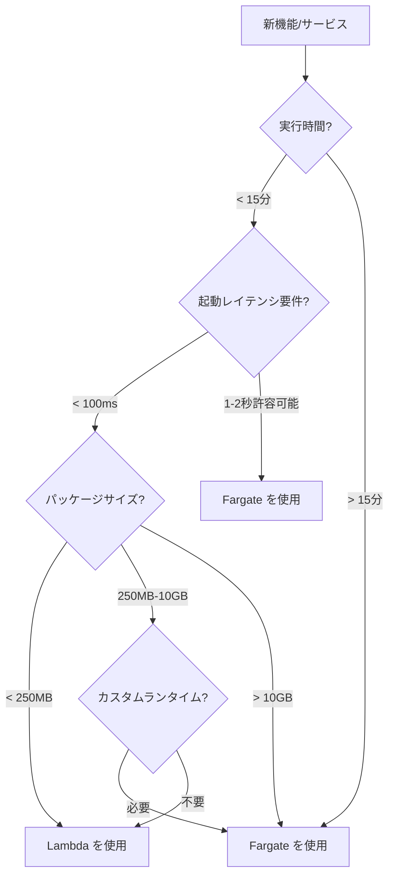

# Serverless クイックリファレンス

> Lambda & Fargate クイックリファレンスガイド

---

## 🚀 Lambda クイックリファレンス

### CLI コマンド

```bash
# 関数の作成
aws lambda create-function \
    --function-name my-function \
    --runtime python3.11 \
    --role arn:aws:iam::account:role/lambda-role \
    --handler lambda_function.lambda_handler \
    --zip-file fileb://function.zip

# コードの更新
aws lambda update-function-code \
    --function-name my-function \
    --zip-file fileb://function.zip

# テスト呼び出し
aws lambda invoke \
    --function-name my-function \
    --payload '{"key": "value"}' \
    response.json

# ログの確認
aws logs tail /aws/lambda/my-function --follow

# プロビジョニング並行処理の設定
aws lambda put-provisioned-concurrency-config \
    --function-name my-function \
    --qualifier PROD \
    --provisioned-concurrent-executions 100
```

### ランタイムとメモリ

| ランタイム | メモリ範囲 | タイムアウト制限 |
|--------|----------|----------|
| Node.js | 128MB - 10GB | 15分 |
| Python | 128MB - 10GB | 15分 |
| Java | 128MB - 10GB | 15分 |
| Go | 128MB - 10GB | 15分 |
| .NET | 128MB - 10GB | 15分 |

### メモリ vs vCPU

| メモリ | 相対CPU | 適用シナリオ |
|------|---------|----------|
| 128MB | 0.5x | シンプルなイベント処理 |
| 512MB | 1x | 標準API |
| 1024MB | 2x | データ処理 |
| 3008MB | 6x | 計算集約型処理 |

### トリガー設定

```yaml
# SAM テンプレート例
Events:
  ApiEvent:
    Type: Api
    Properties:
      Path: /users
      Method: post
      
  SQSEvent:
    Type: SQS
    Properties:
      Queue: !GetAtt MyQueue.Arn
      BatchSize: 10
      
  ScheduleEvent:
    Type: Schedule
    Properties:
      Schedule: rate(5 minutes)
      
  S3Event:
    Type: S3
    Properties:
      Bucket: !Ref MyBucket
      Events: s3:ObjectCreated:*
```

### 環境変数と暗号化

```bash
# 環境変数の設定
aws lambda update-function-configuration \
    --function-name my-function \
    --environment Variables={KEY1=value1,KEY2=value2}

# Secrets Manager の使用
aws lambda update-function-configuration \
    --function-name my-function \
    --environment Variables={DB_SECRET=arn:aws:secretsmanager:...}
```

### エラー処理

```python
def lambda_handler(event, context):
    try:
        result = process(event)
        return {'statusCode': 200, 'body': result}
    except ValueError as e:
        # クライアントエラー
        return {'statusCode': 400, 'body': str(e)}
    except Exception as e:
        # サーバーエラー - リトライがトリガーされます
        logger.exception("Error")
        raise
```

---

## 🐳 Fargate クイックリファレンス

### CLI コマンド

```bash
# タスク定義の登録
aws ecs register-task-definition \
    --cli-input-json file://task-definition.json

# タスクの実行
aws ecs run-task \
    --cluster my-cluster \
    --task-definition my-task:1 \
    --launch-type FARGATE \
    --network-configuration "awsvpcConfiguration={subnets=[subnet-xxx],securityGroups=[sg-xxx]}"

# サービスの作成
aws ecs create-service \
    --cluster my-cluster \
    --service-name my-service \
    --task-definition my-task:1 \
    --desired-count 2 \
    --launch-type FARGATE

# サービスの更新
aws ecs update-service \
    --cluster my-cluster \
    --service-name my-service \
    --desired-count 4

# タスクログの確認
aws logs tail /ecs/my-service --follow
```

### タスク定義テンプレート

```json
{
    "family": "web-app",
    "networkMode": "awsvpc",
    "requiresCompatibilities": ["FARGATE"],
    "cpu": "512",
    "memory": "1024",
    "executionRoleArn": "arn:aws:iam::account:role/ecsTaskExecutionRole",
    "containerDefinitions": [
        {
            "name": "app",
            "image": "nginx:latest",
            "essential": true,
            "portMappings": [
                {
                    "containerPort": 80,
                    "protocol": "tcp"
                }
            ],
            "logConfiguration": {
                "logDriver": "awslogs",
                "options": {
                    "awslogs-group": "/ecs/web-app",
                    "awslogs-region": "us-east-1",
                    "awslogs-stream-prefix": "ecs"
                }
            }
        }
    ]
}
```

### リソース設定

| CPU | メモリオプション | 適用シナリオ |
|-----|----------|----------|
| 256 (.25 vCPU) | 512MB, 1GB, 2GB | 軽量Web |
| 512 (.5 vCPU) | 1GB - 4GB | 標準アプリケーション |
| 1024 (1 vCPU) | 2GB - 8GB | 中規模サービス |
| 2048 (2 vCPU) | 4GB - 16GB | 計算集約型処理 |
| 4096 (4 vCPU) | 8GB - 30GB | 高性能 |

### 料金クイックリファレンス

```
Fargate 価格 (us-east-1):
├── vCPU: $0.04048 / vCPU-hour
├── メモリ: $0.004445 / GB-hour
└── ストレージ: $0.000111 / GB-hour

Fargate Spot 割引: 最大 70%

例 (1 vCPU, 2GB, 24時間365日):
月額費用 = (0.04048 + 2×0.004445) × 730 = $36.04
```

---

## 🏗️ アーキテクチャ意思決定ツリー



---

## 🔧 よく使用する設定

### IAM ロール

```json
// Lambda 実行ロール
{
    "Version": "2012-10-17",
    "Statement": [
        {
            "Effect": "Allow",
            "Action": [
                "logs:CreateLogGroup",
                "logs:CreateLogStream",
                "logs:PutLogEvents"
            ],
            "Resource": "arn:aws:logs:*:*:*"
        }
    ]
}

// Fargate タスク実行ロール
{
    "Version": "2012-10-17",
    "Statement": [
        {
            "Effect": "Allow",
            "Action": [
                "ecr:GetAuthorizationToken",
                "ecr:BatchCheckLayerAvailability",
                "ecr:GetDownloadUrlForLayer",
                "ecr:BatchGetImage",
                "logs:CreateLogStream",
                "logs:PutLogEvents"
            ],
            "Resource": "*"
        }
    ]
}
```

### VPC 設定

```bash
# Lambda VPC 設定
aws lambda update-function-configuration \
    --function-name my-function \
    --vpc-config SubnetIds=subnet-xxx,subnet-yyy,SecurityGroupIds=sg-xxx

# Fargate ネットワーク設定
aws ecs run-task \
    --network-configuration "awsvpcConfiguration={subnets=[subnet-xxx],securityGroups=[sg-xxx],assignPublicIp=DISABLED}"
```

---

## 📊 監視メトリクス

### Lambda 主要メトリクス

| メトリクス | アラーム条件 | 説明 |
|------|----------|------|
| Duration | p99 > 閾値 | 実行時間 |
| Errors | > 0.1% | エラー率 |
| Throttles | > 0 | スロットリング回数 |
| IteratorAge | > 60秒 | ストリーム処理遅延 |

### Fargate 主要メトリクス

| メトリクス | アラーム条件 | 説明 |
|------|----------|------|
| CPUUtilization | > 70% | CPU使用率 |
| MemoryUtilization | > 80% | メモリ使用率 |
| RunningTaskCount | < desired | 実行中タスク数 |

---

## 💰 コスト最適化チェックリスト

- [ ] Graviton2 アーキテクチャ (ARM64) を使用する
- [ ] Lambda メモリ Power Tuning を実施する
- [ ] Fargate Spot キャパシティプロバイダーを使用する
- [ ] Lambda プロビジョニング並行処理を使用する（予測可能なトラフィックの場合）
- [ ] リザーブドインスタンス/Compute Savings Plans を購入する
- [ ] 未使用リソースを定期的にクリーンアップする
- [ ] Cost Explorer 予算アラートを有効化する

---

## 🔗 クイックリンク

- [Lambda クォータ](https://docs.aws.amazon.com/lambda/latest/dg/gettingstarted-limits.html)
- [Fargate 料金](https://aws.amazon.com/fargate/pricing/)
- [SAM ドキュメント](https://docs.aws.amazon.com/serverless-application-model/)
- [CDK ドキュメント](https://docs.aws.amazon.com/cdk/)

---

*最終更新日: 2026-03-01*
