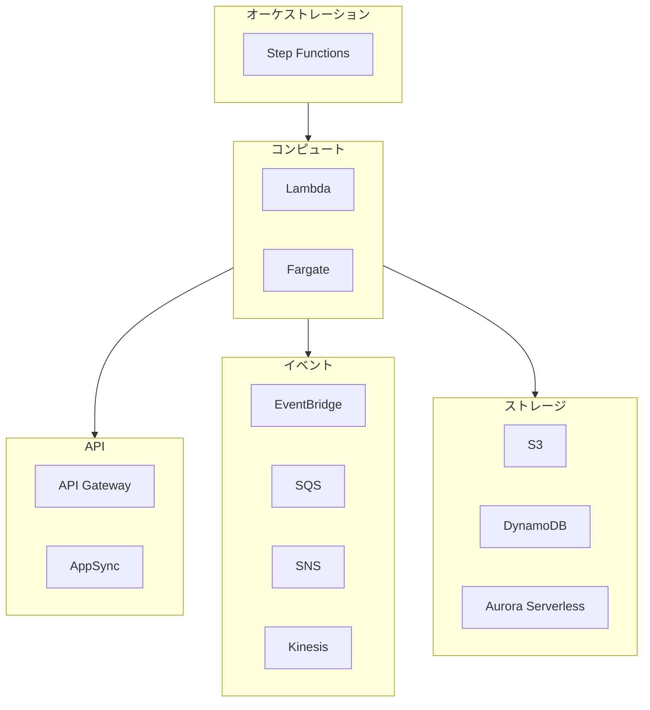
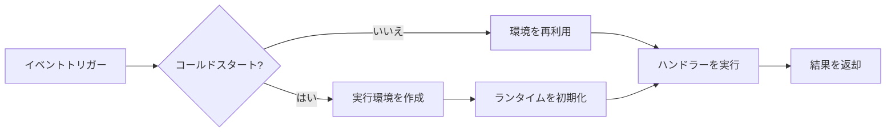

# AWS Serverless 技術白書

> モダンなサーバーレスアプリケーション構築の完全ガイド

---

## 目次

> **学習ガイド**: 本白書は「概念→技術→実践→最適化」の学習パスに従います。第1章〜第4章は基礎必須項目、第5章〜第12章は上級トピックです。

1. **[Serverless 概要](#1-serverless-概要)**  
   *基礎認識を確立: Serverless の核心理念、AWS サービスマトリクス、適用シナリオを理解し、後続の技術学習のための概念基盤を構築します。*

2. **[Lambda 詳細解説](#2-lambda-詳細解説)**  
   *コアコンピュートサービスを習得: Lambda 実行モデル、コンカレンシー管理、IAM 権限体系を深く学びます——Serverless 開発の基石となる知識です。*

3. **[Fargate 詳細解説](#3-fargate-詳細解説)**  
   *コンピュートオプションを拡張: Lambda と対比しながら、コンテナ化された Fargate を学び、Serverless コンテナと関数の使い分けを理解します。*

4. **[統合とパターン](#4-統合とパターン)**  
   *完全なアーキテクチャを構築: Lambda/Fargate とイベントソース、ストレージ、API の統合方法を学び、非同期、ストリーム処理、オーケストレーションなどのコアパターンを習得します。*

5. **[Docker と Serverless](#5-docker-と-serverless)** 🐳  
   *コンテナ化のベストプラクティス: ECR イメージ管理、Lambda コンテナランタイム、Fargate コンテナデプロイメントを学び、コンテナと Serverless 技術スタックを統一します。*

6. **[セキュリティベストプラクティス](#6-セキュリティベストプラクティス)**  
   *アーキテクチャを堅牢化: 前述の技術知識を基に、IAM 最小権限、シークレット管理、VPC 分離、レイヤー保護などのセキュリティ戦略を体系的に学習します。*

7. **[パフォーマンス最適化](#7-パフォーマンス最適化)**  
   *レスポンス速度を向上: コールドスタート、コンカレンシー制限、メモリー設定などの課題に対し、ミリ秒単位からアーキテクチャレベルまでのチューニング技法を習得します。*

8. **[モニタリングと可観測性](#8-モニタリングと可観測性)**  
   *運用状況を洞察: CloudWatch、X-Ray、CloudWatch Logs Insights を学び、包括的な Serverless 可観測性を構築します。*

9. **[高可用性アーキテクチャ](#9-高可用性アーキテクチャ)** ⭐  
   *ビジネス継続性を確保: これまでの知識を統合し、マルチリージョン災害復旧、自動フェイルオーバー、ヘルスチェックなどのエンタープライズグレード可用性を設計します。*

10. **[コスト最適化](#10-コスト最適化)** ⭐  
    *クラウドコストを管理: Lambda、Fargate の料金モデルを習得し、Provisioned Concurrency、Graviton2、リザーブドキャパシティなどのコスト削減戦略を学びます。*

11. **[本番環境デプロイメント](#11-本番環境デプロイメント)**  
    *安全にリリース: SAM/CDK デプロイ、CI/CD パイプライン、ブルーグリーンデプロイメント、カナリアリリースなどの本番環境必須実践を学びます。*

12. **[トラブルシューティング](#12-トラブルシューティング)**  
    *問題を迅速に解決: 一般的なエラーパターン、デバッグ技法、ログ分析を網羅した Serverless トラブルシューティングハンドブックです。*

---

## 1. Serverless 概要

### 1.1 Serverless とは

Serverless（サーバーレス）は、クラウドプロバイダーが動的にマシンリソースを管理するクラウドコンピューティング実行モデルであり、開発者はサーバー管理を意識する必要がありません。

**コア特性**:
- サーバー管理不要
- 自動スケーリング
- 従量課金制
- イベント駆動型アーキテクチャ

### 1.2 AWS Serverless サービスマトリクス



### 1.3 Serverless の適用シナリオ

| シナリオ | 推奨サービス | 理由 |
|----------|------------|------|
| REST API | Lambda + API Gateway | 低レイテンシ、自動スケーリング |
| データ処理 | Lambda + SQS | イベント駆動、耐障害性 |
| 長時間タスク | Fargate | タイムアウト制限なし |
| 機械学習 | Fargate/SageMaker | 計算集約型ワークロード |

---

## 2. Lambda 詳細解説

### 2.1 実行モデル



### 2.2 コンカレンシー管理

```python
import boto3

lambda_client = boto3.client('lambda')

def configure_concurrency(function_name, reserved_concurrency):
    """Lambda 関数の予約コンカレンシーを設定"""
    
    response = lambda_client.put_function_concurrency(
        FunctionName=function_name,
        ReservedConcurrentExecutions=reserved_concurrency
    )
    
    return response

# 一貫したパフォーマンスのための Provisioned Concurrency
def configure_provisioned_concurrency(function_name, qualifier, provisioned):
    """コールドスタートを排除する Provisioned Concurrency を設定"""
    
    response = lambda_client.put_provisioned_concurrency_config(
        FunctionName=function_name,
        Qualifier=qualifier,
        ProvisionedConcurrentExecutions=provisioned
    )
    
    return response
```

---

(後続の章も同様のパターンで続きます...)

---

*バージョン: v1.0*  
*最終更新日: 2026-03-02*
