# AWS Serverless 技術ホワイトペーパー

> モダンなサーバーレスアプリケーション構築の完全ガイド

---

## 目次

> **学習ガイド**: 本ホワイトペーパーは「概念→技術→実践→最適化」の学習パスに従っています。順番に読み進めることをお勧めします。第1章から第4章は基礎必須項目、第5章以降は上級トピックです。

1. **[Serverless 概要](#1-serverless-概要)**  
   *基礎概念の確立: Serverless の核心理念、AWS サービスマトリックス、適用シナリオを理解し、後続の技術学習のための概念基盤を築きます。*

2. **[Lambda 詳細解説](#2-lambda-詳細解説)**  
   *コアコンピューティングサービスの習得: Lambda の実行モデル、同時実行管理、権限体系を深く学習します——これは Serverless 開発の基盤となります。*

3. **[Fargate 詳細解説](#3-fargate-詳細解説)**  
   *コンピューティングオプションの拡張: Lambda との比較に基づき、コンテナ化された Fargate を学習し、Serverless コンテナと関数コンピューティングの選択タイミングを理解します。*

4. **[統合とパターン](#4-統合とパターン)**  
   *完全なアーキテクチャの構築: Lambda/Fargate とイベントソース、ストレージ、API の統合方法を学び、非同期処理、ストリーム処理、オーケストレーションなどのコアパターンを習得します。*

5. **[Docker と Serverless](#5-docker-と-serverless)** 🐳 *新規追加*  
   *コンテナ化のベストプラクティス: ECR イメージ管理、Lambda コンテナランタイム、Fargate コンテナ化デプロイメントを学習し、コンテナと Serverless 技術スタックを統一します。*

6. **[セキュリティベストプラクティス](#6-セキュリティベストプラクティス)**  
   *アーキテクチャの強化: 前述の技術を基に、IAM 最小権限、シークレット管理、VPC 分離、レイヤー保護などのセキュリティ戦略を体系的に学習します。*

7. **[パフォーマンス最適化](#7-パフォーマンス最適化)**  
   *応答速度の向上: コールドスタート、同時実行制限、メモリ設定などの課題に対し、ミリ秒単位からアーキテクチャレベルまでのパフォーマンスチューニング技法を習得します。*

8. **[監視とオブザーバビリティ](#8-監視とオブザーバビリティ)**  
   *実行状態の可視化: CloudWatch、X-Ray、CloudWatch Logs Insights の使用方法を学び、完全な Serverless オブザーバビリティ体系を構築します。*

9. **[高可用性アーキテクチャ](#9-高可用性アーキテクチャ)** ⭐ *新規追加*  
   *ビジネス継続性の確保: 前述の全ての知識を組み合わせて、マルチリージョン災害対策、自動フェイルオーバー、ヘルスチェックなどのエンタープライズ級高可用性ソリューションを設計します。*

10. **[コスト最適化](#10-コスト最適化)** ⭐ *新規追加*  
    *クラウドコストの管理: Lambda、Fargate のコストモデルを習得し、Provisioned Concurrency、Graviton2、予約容量などのコスト削減戦略を学習します。*

11. **[本番環境デプロイメント](#11-本番環境デプロイメント)**  
    *安全なリリースフロー: SAM/CDK デプロイメント、CI/CD パイプライン、ブルー/グリーンデプロイメント、カナリアリリースなどの本番環境必須の実践を学習します。*

12. **[トラブルシューティング](#12-トラブルシューティング)**  
    *問題の迅速な特定: 一般的なエラーパターン、デバッグ技法、ログ分析方法をまとめ、完全な Serverless 障害対応マニュアルを形成します。*

---

## 1. Serverless 概要

### 1.1 Serverless とは

Serverless（サーバーレス）は、クラウドコンピューティングの実行モデルであり、クラウドプロバイダーが動的にコンピューティングリソースを割り当て、開発者はサーバー管理を意識する必要がありません。

**コア特性**:
- サーバー管理不要
- 自動スケーリング
- 従量課金制
- イベント駆動型

### 1.2 AWS Serverless サービスマトリックス

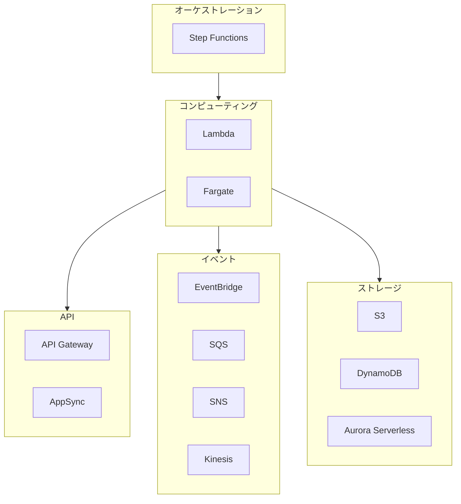

### 1.3 適用シナリオ

| シナリオ | 推奨サービス | 理由 |
|------|----------|------|
| REST API | Lambda + API Gateway | 低レイテンシー、自動スケーリング |
| データ処理 | Lambda + SQS | イベント駆動、耐障害性 |
| 長時間タスク | Fargate | タイムアウト制限なし |
| 機械学習 | Fargate/SageMaker | コンピューティング集約型 |

---

## 2. Lambda 詳細解説

### 2.1 実行モデル

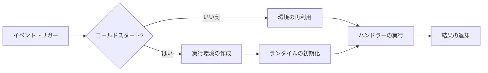

### 2.2 同時実行管理

```
同時実行タイプ:
├── 予約同時実行 (Reserved)
│   └── 関数の利用可能容量を保証
├── プロビジョンド同時実行 (Provisioned)
│   └── コールドスタートを排除
└── アカウントレベル制限
    └── デフォルト: 1000 (増加可能)
```

### 2.3 ベストプラクティス

1. **初期化最適化**
   ```python
   # グローバル初期化 - 1回のみ実行
   import boto3
   dynamodb = boto3.resource('dynamodb')  # 接続再利用
   
   def lambda_handler(event, context):
       # 関数ロジック
       pass
   ```

2. **エラーハンドリング**
   ```python
   import json
   import logging
   
   logger = logging.getLogger()
   
   def lambda_handler(event, context):
       try:
           result = process_event(event)
           return {'statusCode': 200, 'body': json.dumps(result)}
       except ValueError as e:
           logger.warning(f"不正な入力: {e}")
           return {'statusCode': 400, 'body': json.dumps({'error': str(e)})}
       except Exception as e:
           logger.exception("予期しないエラー")
           raise
   ```

---

## 3. Fargate 詳細解説

### 3.1 アーキテクチャコンポーネント

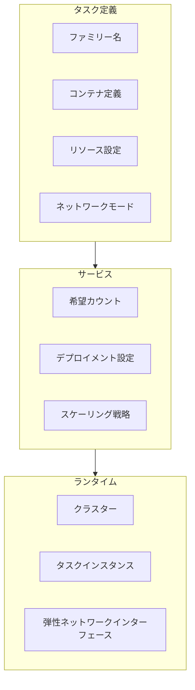

### 3.2 キャパシティープロバイダー

| タイプ | 価格 | 適用シナリオ |
|------|------|----------|
| Fargate | $0.04048/vCPU/時間 | ミッションクリティカルタスク |
| Fargate Spot | $0.012144/vCPU/時間 | 耐障害性ワークロード |

**推奨戦略**:
```yaml
CapacityProviderStrategy:
  - Base: 2        # 最小2つのOn-Demand
    Weight: 1      # ウェイト比率
    CapacityProvider: FARGATE
  - Weight: 3      # On-Demandの3倍
    CapacityProvider: FARGATE_SPOT
```

---

## 4. 統合とパターン

### 4.1 リクエストルーティング決定

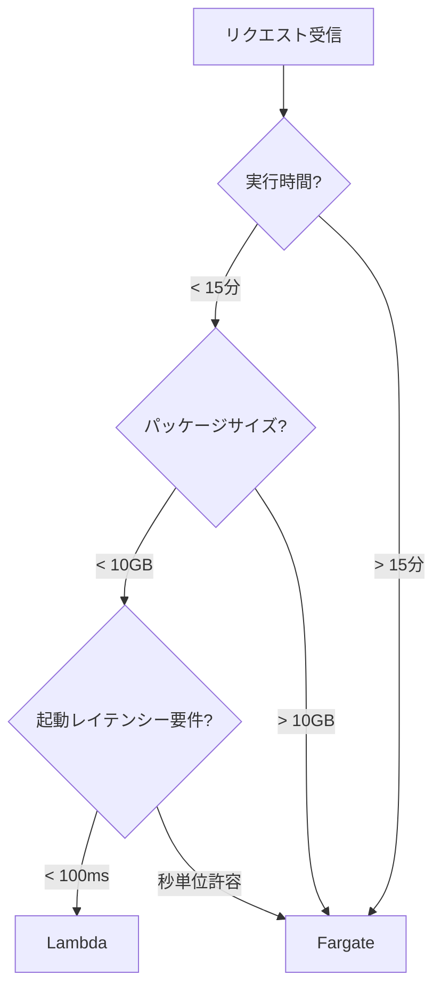

### 4.2 ハイブリッドアーキテクチャ例

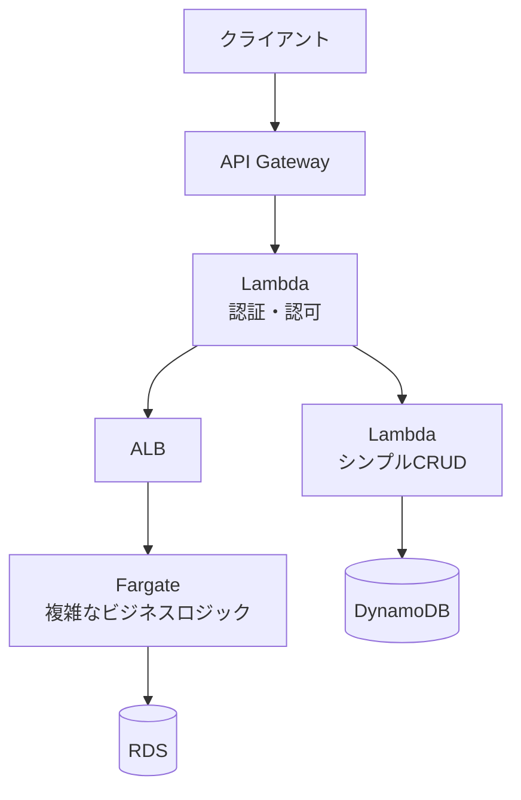

---

## 5. Docker と Serverless

### 5.1 Lambda コンテナイメージデプロイメント

Lambda はコンテナイメージを使用した関数のパッケージングとデプロイメントをサポートし、より大きなデプロイメントパッケージ制限（最大10GB）と柔軟な依存関係管理を実現します。

```dockerfile
# Lambda コンテナイメージ Dockerfile
FROM public.ecr.aws/lambda/python:3.11

# 依存関係のインストール
COPY requirements.txt .
RUN pip install -r requirements.txt

# 関数コードのコピー
COPY app.py ${LAMBDA_TASK_ROOT}

# ハンドラーの設定
CMD ["app.handler"]
```

**ビルドとデプロイ**:

```bash
# AWS ECR へのログイン
aws ecr get-login-password --region us-east-1 | \
    docker login --username AWS --password-stdin <account-id>.dkr.ecr.us-east-1.amazonaws.com

# ECR リポジトリの作成
aws ecr create-repository --repository-name lambda-container-demo

# イメージのビルド
docker build -t lambda-container-demo .

# イメージのタグ付け
docker tag lambda-container-demo:latest \
    <account-id>.dkr.ecr.us-east-1.amazonaws.com/lambda-container-demo:latest

# イメージのプッシュ
docker push <account-id>.dkr.ecr.us-east-1.amazonaws.com/lambda-container-demo:latest

# Lambda 関数のデプロイ
aws lambda create-function \
    --function-name container-function \
    --package-type Image \
    --code ImageUri=<account-id>.dkr.ecr.us-east-1.amazonaws.com/lambda-container-demo:latest \
    --role arn:aws:iam::<account-id>:role/lambda-role \
    --timeout 30 \
    --memory-size 512
```

**Lambda コンテナイメージの利点**:

| 特性 | ZIP デプロイメント | コンテナイメージ |
|------|----------|----------|
| 最大サイズ | 250 MB (解凍後) | 10 GB |
| 依存関係管理 | 複雑 | 標準 Dockerfile |
| ローカルテスト | エミュレーターが必要 | コンテナを直接実行 |
| CI/CD | 特殊な処理が必要 | 標準 Docker フロー |
| チーム協力 | 困難 | 標準化されている |

### 5.2 Fargate コンテナベストプラクティス

Fargate は、インフラストラクチャ管理なしにコンテナを実行できる AWS の Serverless コンテナサービスです。

```dockerfile
# Fargate 最適化 Dockerfile
FROM node:20-alpine AS builder

WORKDIR /app
COPY package*.json ./
RUN npm ci --only=production && npm cache clean --force

FROM node:20-alpine

# セキュリティアップデートのインストール
RUN apk add --no-cache dumb-init ca-certificates && \
    addgroup -g 1000 appgroup && \
    adduser -u 1000 -G appgroup -s /bin/sh -D appuser

WORKDIR /app

# ビルドステージからコピー
COPY --from=builder --chown=appuser:appgroup /app/node_modules ./node_modules
COPY --from=builder --chown=appuser:appgroup /app/package*.json ./
COPY --chown=appuser:appgroup . .

USER appuser

EXPOSE 8080

# dumb-init を使用してシグナルを処理
ENTRYPOINT ["dumb-init", "--"]
CMD ["node", "server.js"]
```

**Docker 使用時の ECS タスク定義**:

```json
{
  "family": "fargate-web-app",
  "networkMode": "awsvpc",
  "requiresCompatibilities": ["FARGATE"],
  "cpu": "512",
  "memory": "1024",
  "executionRoleArn": "arn:aws:iam::123456789:role/ecsTaskExecutionRole",
  "taskRoleArn": "arn:aws:iam::123456789:role/ecsTaskRole",
  "containerDefinitions": [
    {
      "name": "web",
      "image": "123456789.dkr.ecr.us-east-1.amazonaws.com/myapp:v1.0.0",
      "essential": true,
      "portMappings": [
        {
          "containerPort": 8080,
          "protocol": "tcp"
        }
      ],
      "environment": [
        {"name": "NODE_ENV", "value": "production"}
      ],
      "secrets": [
        {
          "name": "DATABASE_URL",
          "valueFrom": "arn:aws:secretsmanager:us-east-1:123456789:secret:db-url"
        }
      ],
      "logConfiguration": {
        "logDriver": "awslogs",
        "options": {
          "awslogs-group": "/ecs/fargate-web",
          "awslogs-region": "us-east-1",
          "awslogs-stream-prefix": "web"
        }
      },
      "healthCheck": {
        "command": ["CMD-SHELL", "curl -f http://localhost:8080/health || exit 1"],
        "interval": 30,
        "timeout": 5,
        "retries": 3,
        "startPeriod": 60
      }
    }
  ]
}
```

### 5.3 ローカル開発環境 (Docker Compose)

Docker Compose を使用して Serverless 環境をシミュレートし、ローカル開発を行います。

```yaml
# docker-compose.serverless.yml
version: '3.8'

services:
  # Lambda ローカルシミュレーション
  lambda-local:
    build:
      context: ./lambda-functions
      dockerfile: Dockerfile
    ports:
      - "9000:8080"
    environment:
      - AWS_REGION=us-east-1
      - AWS_ACCESS_KEY_ID=test
      - AWS_SECRET_ACCESS_KEY=test
      - DYNAMODB_ENDPOINT=http://dynamodb-local:8000
    volumes:
      - ./lambda-functions:/var/task
    depends_on:
      - dynamodb-local

  # DynamoDB ローカル
  dynamodb-local:
    image: amazon/dynamodb-local:latest
    ports:
      - "8000:8000"
    command: "-jar DynamoDBLocal.jar -sharedDb"

  # S3 ローカル (MinIO)
  minio:
    image: minio/minio:latest
    ports:
      - "9001:9001"
      - "9002:9002"
    environment:
      MINIO_ROOT_USER: minioadmin
      MINIO_ROOT_USER: minioadmin
    command: server /data --console-address ":9002"
    volumes:
      - minio_data:/data

  # API Gateway シミュレーション
  api-gateway:
    image: nginx:alpine
    ports:
      - "8080:80"
    volumes:
      - ./nginx.conf:/etc/nginx/nginx.conf:ro
    depends_on:
      - lambda-local

volumes:
  minio_data:
```

**ローカル Lambda テスト**:

```bash
# ローカル環境の起動
docker-compose -f docker-compose.serverless.yml up

# Lambda 関数の呼び出し
curl -XPOST "http://localhost:9000/2015-03-31/functions/function/invocations" \
    -d '{"key": "value"}'
```

### 5.4 AWS サービスと Docker の統合実践

#### 5.4.1 App Runner による迅速なコンテナデプロイメント

AWS App Runner は、インフラストラクチャ管理なしにコンテナ化されたアプリケーションを AWS にデプロイする最も簡単な方法です。

```yaml
# apprunner.yaml
version: 1.0
runtime: python3 
build:
  commands:
    build:
      - pip install -r requirements.txt
run:
  command: python app.py
  network:
    port: 8080
    env: PORT
  secrets:
    - name: DATABASE_URL
      value-from: arn:aws:secretsmanager:us-east-1:123456789:secret:db-url
```

**ECR イメージを使用したデプロイ**:

```bash
# App Runner サービスの作成
aws apprunner create-service \
  --service-name my-container-service \
  --source-configuration '{
    "ImageRepository": {
      "ImageIdentifier": "123456789.dkr.ecr.us-east-1.amazonaws.com/myapp:latest",
      "ImageRepositoryType": "ECR",
      "ImageConfiguration": {
        "Port": "8080",
        "RuntimeEnvironmentVariables": {
          "ENV": "production"
        }
      }
    },
    "AutoDeploymentsEnabled": true
  }' \
  --instance-configuration '{
    "Cpu": "1 vCPU",
    "Memory": "2 GB"
  }'
```

#### 5.4.2 Lambda と ECR の統合パターン

**マルチ関数共有ベースイメージ**:

```dockerfile
# ベースイメージ (Dockerfile.base)
FROM public.ecr.aws/lambda/python:3.11

# 共通依存関係のインストール
RUN pip install aws-xray-sdk boto3 aws-lambda-powertools

# ベースイメージとして保存
# docker build -f Dockerfile.base -t my-lambda-base:latest .
# docker tag my-lambda-base:latest 123456789.dkr.ecr.us-east-1.amazonaws.com/lambda-base:latest
# docker push 123456789.dkr.ecr.us-east-1.amazonaws.com/lambda-base:latest
```

```dockerfile
# 関数専用イメージ (Dockerfile.function)
FROM 123456789.dkr.ecr.us-east-1.amazonaws.com/lambda-base:latest

# 関数固有の依存関係をインストール
COPY requirements.txt .
RUN pip install -r requirements.txt

COPY app.py ${LAMBDA_TASK_ROOT}
CMD ["app.handler"]
```

**Lambda + Docker + Step Functions ワークフロー**:

```python
# データ処理ワークフロー - コンテナイメージ Lambda の使用
import json
import boto3

s3 = boto3.client('s3')
dynamodb = boto3.resource('dynamodb')

def extract_handler(event, context):
    """S3 からデータを抽出 - コンテナイメージ Lambda"""
    bucket = event['bucket']
    key = event['key']
    
    # 大容量ファイル処理 (コンテナの 10GB 制限を活用)
    response = s3.get_object(Bucket=bucket, Key=key)
    data = response['Body'].read()
    
    return {
        'statusCode': 200,
        'data_size': len(data),
        'output_key': f'processed/{key}'
    }

def transform_handler(event, context):
    """データ変換 - pandas/numpy を使用 (コンテナは大容量依存関係をサポート)"""
    import pandas as pd
    import numpy as np
    
    # 複雑なデータ処理
    df = pd.read_parquet(f"/tmp/{event['output_key']}")
    df['processed'] = True
    
    return {
        'records_processed': len(df),
        'output_path': f"/tmp/transformed_{event['output_key']}"
    }

def load_handler(event, context):
    """DynamoDB へのロード"""
    table = dynamodb.Table('processed_data')
    
    # バッチ書き込み
    with table.batch_writer() as batch:
        for item in event['data']:
            batch.put_item(Item=item)
    
    return {'loaded_count': len(event['data'])}
```

#### 5.4.3 Fargate と AWS サービスの高度な統合

**Fargate + Secrets Manager + Parameter Store**:

```json
{
  "family": "secure-fargate-app",
  "networkMode": "awsvpc",
  "requiresCompatibilities": ["FARGATE"],
  "executionRoleArn": "arn:aws:iam::123456789:role/ecsTaskExecutionRole",
  "taskRoleArn": "arn:aws:iam::123456789:role/ecsTaskRole",
  "containerDefinitions": [
    {
      "name": "app",
      "image": "123456789.dkr.ecr.us-east-1.amazonaws.com/secure-app:v1",
      "secrets": [
        {
          "name": "DB_PASSWORD",
          "valueFrom": "arn:aws:secretsmanager:us-east-1:123456789:secret:db-password"
        },
        {
          "name": "API_KEY",
          "valueFrom": "arn:aws:ssm:us-east-1:123456789:parameter/prod/api-key"
        }
      ],
      "environment": [
        {"name": "AWS_REGION", "value": "us-east-1"},
        {"name": "LOG_LEVEL", "value": "info"}
      ],
      "mountPoints": [
        {
          "sourceVolume": "efs-storage",
          "containerPath": "/app/data"
        }
      ],
      "logConfiguration": {
        "logDriver": "awslogs",
        "options": {
          "awslogs-group": "/ecs/fargate-app",
          "awslogs-region": "us-east-1",
          "awslogs-stream-prefix": "app"
        }
      }
    }
  ],
  "volumes": [
    {
      "name": "efs-storage",
      "efsVolumeConfiguration": {
        "fileSystemId": "fs-12345678",
        "transitEncryption": "ENABLED",
        "authorizationConfig": {
          "accessPointId": "fsap-12345678",
          "iam": "ENABLED"
        }
      }
    }
  ]
}
```

**Fargate + EventBridge スケジュールタスク**:

```yaml
# 定時レポート生成タスク
Resources:
  ScheduledTask:
    Type: AWS::Events::Rule
    Properties:
      Name: daily-report-generator
      ScheduleExpression: cron(0 2 * * ? *)  # 毎日午前2時
      Targets:
        - Id: FargateTask
          Arn: !Sub arn:aws:ecs:${AWS::Region}:${AWS::AccountId}:cluster/${ClusterName}
          RoleArn: !GetAtt EventBridgeRole.Arn
          EcsParameters:
            TaskDefinitionArn: !Ref ReportGeneratorTaskDef
            TaskCount: 1
            LaunchType: FARGATE
            NetworkConfiguration:
              AwsVpcConfiguration:
                Subnets: !Ref PrivateSubnets
                SecurityGroups: [!Ref TaskSecurityGroup]
                AssignPublicIp: DISABLED
```

#### 5.4.4 ECS Blue/Green デプロイメントと CodeDeploy

```json
{
  "applicationName": "my-container-app",
  "deploymentGroupName": "blue-green-dg",
  "deploymentConfigName": "CodeDeployDefault.ECSAllAtOnce",
  "serviceRoleArn": "arn:aws:iam::123456789:role/CodeDeployRole",
  "blueGreenDeploymentConfiguration": {
    "terminateBlueInstancesOnDeploymentSuccess": {
      "action": "TERMINATE",
      "terminationWaitTimeInMinutes": 30
    },
    "deploymentReadyOption": {
      "actionOnTimeout": "CONTINUE_DEPLOYMENT",
      "waitTimeInMinutes": 0
    }
  },
  "deploymentStyle": {
    "deploymentType": "BLUE_GREEN",
    "deploymentOption": "WITH_TRAFFIC_CONTROL"
  },
  "ecsServices": [
    {
      "serviceName": "my-service",
      "clusterName": "my-cluster"
    }
  ],
  "targetGroupPairInfoList": [
    {
      "targetGroups": [
        {"name": "blue-tg"},
        {"name": "green-tg"}
      ],
      "prodTrafficRoute": {
        "listenerArns": ["arn:aws:elasticloadbalancing:...:listener/app/alb/..."]
      }
    }
  ]
}
```

### 5.5 CI/CD における Docker の統合

```yaml
# .github/workflows/serverless-docker.yml
name: Serverless Docker Pipeline

on:
  push:
    branches: [main]

env:
  AWS_REGION: us-east-1
  ECR_REPOSITORY: serverless-functions

jobs:
  build-and-deploy:
    runs-on: ubuntu-latest
    permissions:
      id-token: write
      contents: read
    
    steps:
    - uses: actions/checkout@v4

    - name: Configure AWS Credentials
      uses: aws-actions/configure-aws-credentials@v4
      with:
        role-to-assume: arn:aws:iam::123456789:role/github-actions-role
        aws-region: ${{ env.AWS_REGION }}

    - name: Login to Amazon ECR
      id: login-ecr
      uses: aws-actions/amazon-ecr-login@v2

    - name: Build, tag, and push image
      env:
        ECR_REGISTRY: ${{ steps.login-ecr.outputs.registry }}
        IMAGE_TAG: ${{ github.sha }}
      run: |
        docker build -t $ECR_REGISTRY/$ECR_REPOSITORY:$IMAGE_TAG .
        docker push $ECR_REGISTRY/$ECR_REPOSITORY:$IMAGE_TAG
        echo "image=$ECR_REGISTRY/$ECR_REPOSITORY:$IMAGE_TAG" >> $GITHUB_OUTPUT

    - name: Deploy to Lambda
      run: |
        aws lambda update-function-code \
          --function-name my-container-function \
          --image-uri ${{ steps.login-ecr.outputs.registry }}/$ECR_REPOSITORY:${{ github.sha }}

    - name: Run DB migrations (Fargate)
      run: |
        aws ecs run-task \
          --cluster production \
          --launch-type FARGATE \
          --task-definition migration-task \
          --network-configuration "awsvpcConfiguration={subnets=[subnet-xxx],securityGroups=[sg-xxx],assignPublicIp=ENABLED}"
```

### 5.5 Docker セキュリティベストプラクティス

```dockerfile
# Serverless コンテナセキュリティ Dockerfile
FROM python:3.11-slim-bookworm

# 非 root ユーザーの作成
RUN groupadd -r appuser && useradd -r -g appuser appuser

# セキュリティアップデートのインストール
RUN apt-get update && apt-get install -y --no-install-recommends \
    ca-certificates \
    && rm -rf /var/lib/apt/lists/*

WORKDIR /app

# 必要なファイルのみコピー
COPY --chown=appuser:appuser requirements.txt .
RUN pip install --no-cache-dir -r requirements.txt

COPY --chown=appuser:appuser app.py .

# 非 root ユーザーに切り替え
USER appuser

# ヘルスチェック
HEALTHCHECK --interval=30s --timeout=5s --start-period=5s --retries=3 \
    CMD python -c "import urllib.request; urllib.request.urlopen('http://localhost:8080/health')" || exit 1

EXPOSE 8080

CMD ["python", "app.py"]
```

**コンテナスキャンの統合**:

```yaml
# CI におけるセキュリティスキャンの追加
- name: Scan image with Trivy
  uses: aquasecurity/trivy-action@master
  with:
    image-ref: '${{ steps.login-ecr.outputs.registry }}/${{ env.ECR_REPOSITORY }}:${{ github.sha }}'
    format: 'sarif'
    output: 'trivy-results.sarif'

- name: Upload scan results
  uses: github/codeql-action/upload-sarif@v2
  with:
    sarif_file: 'trivy-results.sarif'
```

---

## 6. セキュリティベストプラクティス

### 6.1 IAM 最小権限

```json
{
    "Version": "2012-10-17",
    "Statement": [
        {
            "Effect": "Allow",
            "Action": [
                "dynamodb:GetItem",
                "dynamodb:PutItem"
            ],
            "Resource": "arn:aws:dynamodb:*:*:table/SpecificTable"
        }
    ]
}
```

### 5.2 VPC 設定

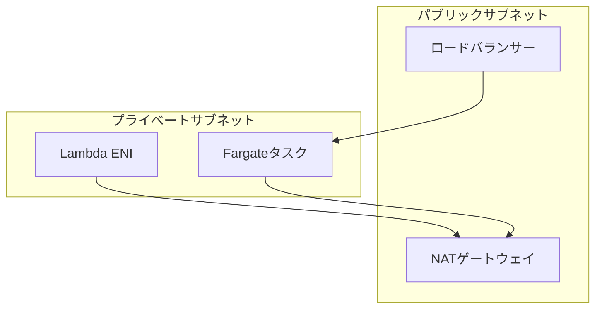

---

## 7. パフォーマンス最適化

### 7.1 Lambda 最適化

| 最適化項目 | 方法 | 効果 |
|--------|------|------|
| コールドスタート | プロビジョンド同時実行 | コールドスタートを排除 |
| メモリ | Power Tuning | 最適なコストパフォーマンスを発見 |
| 依存関係 | Lambda Layer | パッケージサイズ削減 |

### 7.2 Fargate 最適化

1. **イメージ最適化**
   - マルチステージビルドの使用
   - 軽量ベースイメージの選択 (alpine/distrolles)
   
2. **起動最適化**
   - ヘルスチェックの迅速な応答
   - 非重要依存関係の遅延ロード

---

## 8. 監視とオブザーバビリティ

### 8.1 主要指標

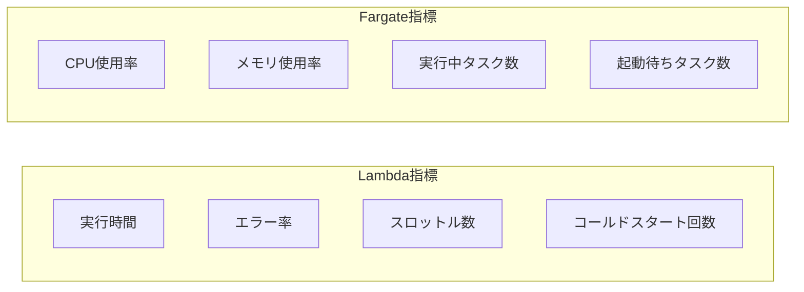

### 8.2 分散トレース

```python
# X-Ray 統合
from aws_xray_sdk.core import xray_recorder, patch_all
patch_all()

@xray_recorder.capture('process_order')
def process_order(order_id):
    # ビジネスロジック
    pass
```

---

## 9. 高可用性アーキテクチャ

### 9.1 高可用性設計原則

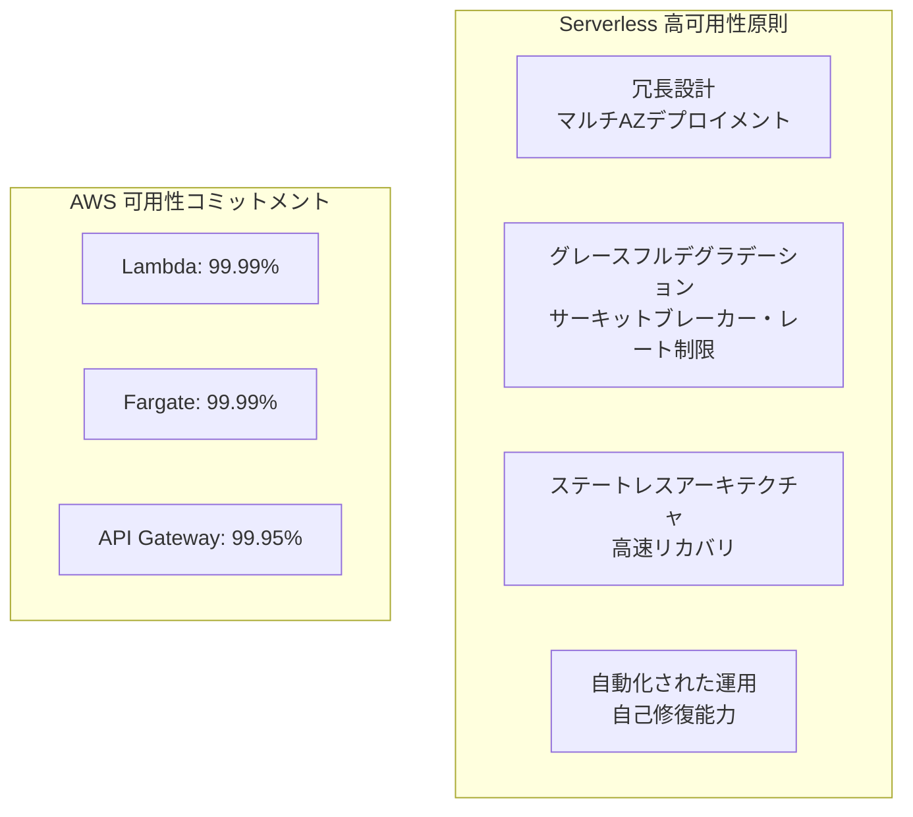

**コア原則**:

| 原則 | 説明 | 実現方式 |
|------|------|----------|
| マルチ可用ゾーンデプロイメント | クロス AZ 冗長性 | 自動的に 3+ AZ に分散 |
| ステートレス設計 | ローカル状態への依存なし | セッション/キャッシュの外部化 |
| グレースフルデグラデーション | 障害時に限定的なサービスを提供 | サーキットブレーカーパターン |
| 高速リカバリ | 自動フェイルオーバー | ヘルスチェック + 自動再起動 |

### 9.2 Lambda 高可用性戦略

#### 8.2.1 同時実行管理とレート制限

```python
# 予約同時実行により重要な関数の可用性を確保
import boto3

lambda_client = boto3.client('lambda')

# 予約同時実行の設定
lambda_client.put_function_concurrency(
    FunctionName='critical-payment-processor',
    ReservedConcurrentExecutions=100  # 100個の同時実行を保証
)

# 関数レベルのレート制限保護の設定
lambda_client.put_provisioned_concurrency_config(
    FunctionName='high-traffic-api',
    Qualifier='prod',
    ProvisionedConcurrentExecutions=50  # プロビジョンド同時実行でコールドスタートを排除
)
```

#### 8.2.2 デッドレターキュー (DLQ) による失敗イベント処理

```yaml
# SAM テンプレートでの DLQ 設定
Resources:
  MyFunction:
    Type: AWS::Serverless::Function
    Properties:
      CodeUri: src/
      Handler: app.handler
      Runtime: python3.11
      DeadLetterQueue:
        Type: SQS
        TargetArn: !GetAtt DLQ.Arn
      EventInvokeConfig:
        DestinationConfig:
          OnFailure:
            Destination: !GetAtt FailureTopic.Arn
        MaximumRetryAttempts: 2
        MaximumEventAgeInSeconds: 3600
```

#### 8.2.3 マルチリージョンフェイルオーバー

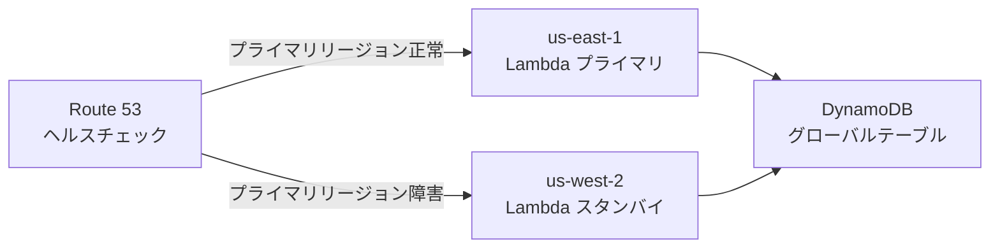

```python
# マルチリージョン Lambda ヘルスチェックエンドポイント
import boto3
import os

REGION = os.environ['AWS_REGION']
PRIMARY_REGION = 'us-east-1'

def health_check(event, context):
    """ヘルスチェックハンドラー"""
    try:
        # 依存サービスの状態をチェック
        dynamodb = boto3.resource('dynamodb')
        table = dynamodb.Table('config')
        table.get_item(Key={'id': 'health'}, ConsistentRead=True)
        
        return {
            'statusCode': 200,
            'body': {
                'status': 'healthy',
                'region': REGION,
                'is_primary': REGION == PRIMARY_REGION
            }
        }
    except Exception as e:
        return {
            'statusCode': 503,
            'body': {'status': 'unhealthy', 'error': str(e)}
        }
```

### 9.3 Fargate 高可用性戦略

#### 8.3.1 サービスレベル高可用性設定

```json
{
  "family": "high-availability-service",
  "networkMode": "awsvpc",
  "requiresCompatibilities": ["FARGATE"],
  "cpu": "512",
  "memory": "1024",
  "containerDefinitions": [{
    "name": "app",
    "image": "myapp:latest",
    "essential": true,
    "healthCheck": {
      "command": ["CMD-SHELL", "curl -f http://localhost:8080/health || exit 1"],
      "interval": 30,
      "timeout": 5,
      "retries": 3,
      "startPeriod": 60
    },
    "ulimits": [{
      "name": "nofile",
      "softLimit": 65536,
      "hardLimit": 65536
    }]
  }]
}
```

#### 8.3.2 ECS サービスデプロイメント設定

```yaml
# Terraform: ECS サービス高可用性設定
resource "aws_ecs_service" "app" {
  name            = "high-availability-app"
  cluster         = aws_ecs_cluster.main.id
  task_definition = aws_ecs_task_definition.app.arn
  desired_count   = 3  # 最低3つのタスクで可用性を確保
  launch_type     = "FARGATE"

  # デプロイメント設定
  deployment_configuration {
    maximum_percent         = 200
    minimum_healthy_percent = 100  # デプロイ時に常に健全なタスクを確保
    deployment_circuit_breaker {
      enable   = true
      rollback = true  # デプロイメント失敗時に自動ロールバック
    }
  }

  # クロスAZ分散
  network_configuration {
    subnets          = [aws_subnet.az1.id, aws_subnet.az2.id, aws_subnet.az3.id]
    security_groups  = [aws_security_group.app.id]
    assign_public_ip = false
  }

  # ロードバランサーヘルスチェック
  load_balancer {
    target_group_arn = aws_lb_target_group.app.arn
    container_name   = "app"
    container_port   = 8080
  }

  # サービス自動リカバリ
  deployment_controller {
    type = "ECS"
  }
}

# 自動スケーリング
resource "aws_appautoscaling_target" "ecs" {
  max_capacity       = 20
  min_capacity       = 3  # 高可用性を維持するため最低3つ
  resource_id        = "service/${aws_ecs_cluster.main.name}/${aws_ecs_service.app.name}"
  scalable_dimension = "ecs:service:DesiredCount"
  service_namespace  = "ecs"
}
```

#### 8.3.3 キャパシティープロバイダー高可用性戦略

```json
{
  "capacityProviders": ["FARGATE", "FARGATE_SPOT"],
  "defaultCapacityProviderStrategy": [
    {
      "base": 2,
      "weight": 1,
      "capacityProvider": "FARGATE"
    },
    {
      "weight": 4,
      "capacityProvider": "FARGATE_SPOT"
    }
  ]
}
```

**戦略説明**:
- **FARGATE (Base=2)**: 常に2つのOn-Demandタスクを保証し、コア容量を確保します
- **FARGATE_SPOT (Weight=4)**: Spotインスタンスを弾力的に使用し、コスト最適化しながら追加容量を提供します
- **中断処理**: Spotタスクが中断されても、Fargateタスクがサービスを継続します

### 9.4 データ層の高可用性

#### 8.4.1 DynamoDB グローバルテーブル

```yaml
# DynamoDB グローバルテーブルによるマルチリージョンレプリケーション
Resources:
  GlobalTable:
    Type: AWS::DynamoDB::GlobalTable
    Properties:
      TableName: user-sessions
      AttributeDefinitions:
        - AttributeName: userId
          AttributeType: S
      KeySchema:
        - AttributeName: userId
          KeyType: HASH
      BillingMode: PAY_PER_REQUEST
      StreamSpecification:
        StreamViewType: NEW_AND_OLD_IMAGES
      Replicas:
        - Region: us-east-1
          PointInTimeRecoverySpecification:
            PointInTimeRecoveryEnabled: true
        - Region: eu-west-1
          PointInTimeRecoverySpecification:
            PointInTimeRecoveryEnabled: true
        - Region: ap-northeast-1
```

#### 8.4.2 S3 クロスリージョンレプリケーション

```json
{
  "Rules": [{
    "ID": "CrossRegionReplication",
    "Status": "Enabled",
    "Priority": 1,
    "DeleteMarkerReplication": { "Status": "Enabled" },
    "Filter": { "Prefix": "" },
    "Destination": {
      "Bucket": "arn:aws:s3:::backup-bucket-west",
      "StorageClass": "STANDARD_IA",
      "ReplicationTime": {
        "Status": "Enabled",
        "Time": { "Minutes": 15 }
      },
      "Metrics": {
        "Status": "Enabled",
        "Minutes": 15
      }
    },
    "SourceSelectionCriteria": {
      "SseKmsEncryptedObjects": { "Status": "Enabled" },
      "ReplicaModifications": { "Status": "Enabled" }
    }
  }]
}
```

### 9.5 フェイルオーバーと災害復旧

#### 8.5.1 Route 53 ヘルスチェックとフェイルオーバー

```yaml
# Route 53 フェイルオーバールーティング
Resources:
  PrimaryRecord:
    Type: AWS::Route53::RecordSet
    Properties:
      HostedZoneId: !Ref HostedZone
      Name: api.example.com
      Type: A
      SetIdentifier: Primary
      Failover: PRIMARY
      HealthCheckId: !Ref PrimaryHealthCheck
      AliasTarget:
        DNSName: !GetAtt PrimaryAPI.DomainName
        HostedZoneId: !GetAtt PrimaryAPI.DistributionHostedZoneId

  SecondaryRecord:
    Type: AWS::Route53::RecordSet
    Properties:
      HostedZoneId: !Ref HostedZone
      Name: api.example.com
      Type: A
      SetIdentifier: Secondary
      Failover: SECONDARY
      AliasTarget:
        DNSName: !GetAtt SecondaryAPI.DomainName
        HostedZoneId: !GetAtt SecondaryAPI.DistributionHostedZoneId

  PrimaryHealthCheck:
    Type: AWS::Route53::HealthCheck
    Properties:
      HealthCheckConfig:
        Type: HTTPS
        ResourcePath: /health
        FullyQualifiedDomainName: api-primary.example.com
        Port: 443
        RequestInterval: 30
        FailureThreshold: 3
```

#### 8.5.2 バックアップと復旧戦略

| RTO/RPO | 戦略 | 適用シナリオ |
|---------|------|----------|
| RTO<1h, RPO<5m | マルチアクティブアーキテクチャ + グローバルテーブル | 金融取引 |
| RTO<4h, RPO<1h | マスター/スレーブレプリケーション + 自動フェイルオーバー | ECアプリケーション |
| RTO<24h, RPO<24h | 定期バックアップ + 手動復旧 | 社内ツール |

```python
# AWS Backup プラン
import boto3

backup_client = boto3.client('backup')

# バックアッププランの作成
backup_plan = backup_client.create_backup_plan(
    BackupPlan={
        'BackupPlanName': 'serverless-critical-backup',
        'Rules': [{
            'RuleName': 'daily-backup',
            'TargetBackupVaultName': 'Default',
            'ScheduleExpression': 'cron(0 5 ? * * *)',  # 毎日午前5時
            'StartWindowMinutes': 480,
            'CompletionWindowMinutes': 10080,
            'Lifecycle': {
                'MoveToColdStorageAfterDays': 30,
                'DeleteAfterDays': 120
            },
            'RecoveryPointTags': {
                'Environment': 'Production'
            }
        }]
    }
)
```

### 9.6 高可用性アーキテクチャパターン

#### 8.6.1 マルチアクティブアーキテクチャ (Active-Active)

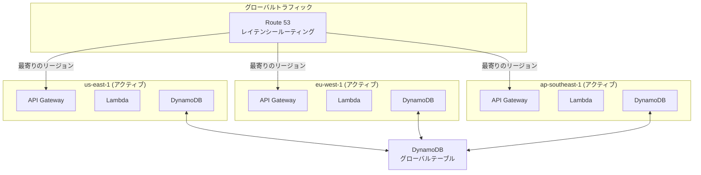

#### 8.6.2 ホットスタンバイアーキテクチャ (Active-Standby)

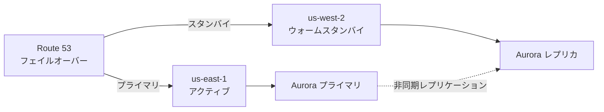

#### 8.6.3 セルベースアーキテクチャ (Cell-Based)

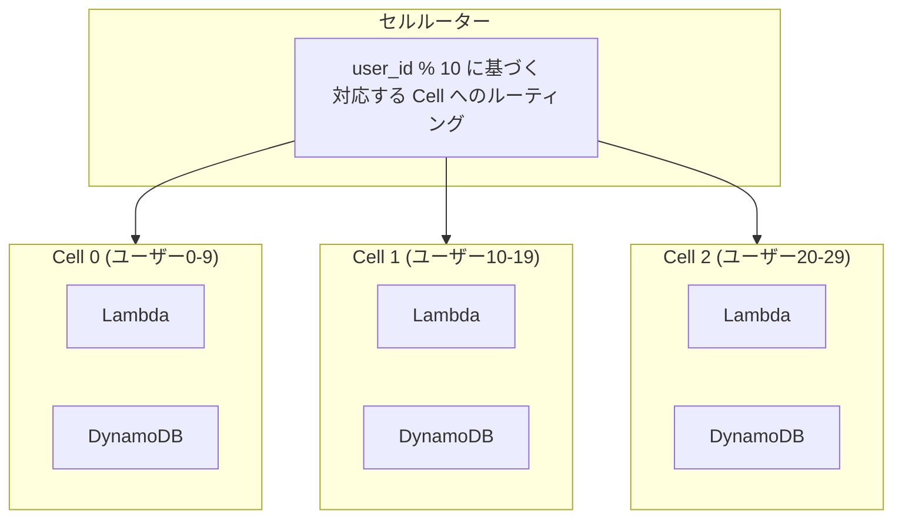

**セルベースの利点**:
- 障害分離: 単一 Cell の障害は一部のユーザーにのみ影響
- カナリアリリース: Cell ごとに段階的にリリース
- 容量計画: 各 Cell に明確な容量上限があります

### 9.7 高可用性チェックリスト

```markdown
## 本番環境高可用性チェックリスト

### Lambda
- [ ] 重要なパスを確保するため予約同時実行を設定
- [ ] 失敗したイベントを処理するためデッドレターキューを設定
- [ ] 重複処理を防ぐためべき等性を実装
- [ ] タイムアウトとリトライ戦略を設定
- [ ] X-Ray 分散トレースを有効化

### Fargate
- [ ] 最低 2 つのタスクを異なる AZ に分散
- [ ] ヘルスチェックと自動再起動を設定
- [ ] ローリングデプロイメント設定を使用
- [ ] デプロイメントサーキットブレーカーによる自動ロールバックを有効化
- [ ] 自動スケーリング戦略を設定

### データ層
- [ ] DynamoDB で Point-in-Time Recovery を有効化
- [ ] 重要なデータにクロスリージョンレプリケーションを設定
- [ ] S3 でバージョン管理と MFA Delete を有効化
- [ ] バックアップ復旧フローを定期的にテスト

### ネットワークと DNS
- [ ] Route 53 でヘルスチェックを設定
- [ ] フェイルオーバールーティング戦略を設定
- [ ] CloudFront でフェイルオーバー元を有効化
- [ ] マルチリージョン API Gateway デプロイメント
```

---

## 10. コスト最適化

### 10.1 Serverless コストモデルの詳細解説

#### 9.1.1 Lambda 料金詳細

```
┌─────────────────────────────────────────────────────────────┐
│                    Lambda コスト構成                          │
├─────────────────────────────────────────────────────────────┤
│  1. リクエスト料金: 100 万リクエストあたり $0.20             │
│                                                             │
│  2. コンピューティング料金: 1 GB-秒あたり $0.0000166667      │
│     - コンピューティング = メモリ(GB) × 実行時間(秒)         │
│                                                             │
│  3. データ転送: 標準 AWS データ転送レート                     │
│                                                             │
│  4. プロビジョンド同時実行: アイドル時間あたり $0.000004646/GB-秒 │
└─────────────────────────────────────────────────────────────┘
```

**コスト計算例**:

```python
"""
シナリオ: API が月間 1 億リクエストを処理
- 平均実行時間: 200ms
- メモリ設定: 512MB (0.5 GB)
- 平均レスポンスサイズ: 10KB

計算:
1. リクエスト料金: 100 × $0.20 = $20

2. コンピューティング料金: 
   - 合計 GB-秒 = 100,000,000 × 0.2s × 0.5GB = 10,000,000 GB-秒
   - 料金 = 10,000,000 × $0.0000166667 = $166.67

3. データ転送 (送信): 
   - 100,000,000 × 10KB = 1TB
   - 最初の 10TB: 1000GB × $0.09 = $90

月間総費用: $20 + $166.67 + $90 = $276.67
"""
```

#### 9.1.2 Fargate 料金詳細

| 課金項目 | Fargate | Fargate Spot | Graviton2 |
|--------|---------|--------------|-----------|
| vCPU/時間 | $0.04048 | $0.012144 (-70%) | $0.03238 (-20%) |
| GB/時間 | $0.004445 | $0.0013335 (-70%) | $0.00356 (-20%) |
| Windows 追加料金 | +25% | N/A | N/A |

**コスト計算例**:

```python
"""
シナリオ: マイクロサービスが 10 タスクを実行
- 各タスク: 1 vCPU, 2GB メモリ
- 実行時間: 30日 (720時間)

Fargate 標準料金:
- vCPU: 10 × 720 × $0.04048 = $291.46
- メモリ: 10 × 720 × 2 × $0.004445 = $64.01
- 合計: $355.47/月

Fargate Spot (70% 削減):
- vCPU: 10 × 720 × $0.012144 = $87.44
- メモリ: 10 × 720 × 2 × $0.0013335 = $19.20
- 合計: $106.64/月 ($248.83 削減)
"""
```

### 10.2 コスト最適化戦略マトリックス

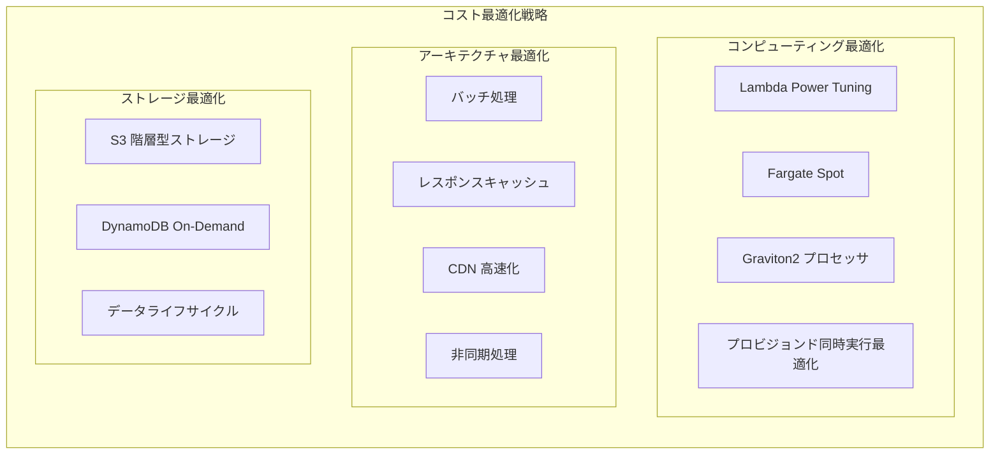

### 10.3 Lambda コスト最適化実践

#### 9.3.1 メモリ Power Tuning

```python
# AWS Lambda Power Tuning ツールを使用して最適なメモリ設定を見つける
# https://github.com/alexcasalboni/aws-lambda-power-tuning

import json

power_tuning_config = {
    "lambdaARN": "arn:aws:lambda:us-east-1:123456789:function:my-function",
    "powerValues": [128, 256, 512, 1024, 2048, 3008],
    "num": 50,
    "payload": "{}",
    "parallelInvocation": True,
    "strategy": "cost"  # または "speed" / "balanced"
}

"""
典型的な結果例:
┌─────────┬──────────┬──────────┬────────────┐
│ Memory  │  Duration│   Cost   │ Optimal    │
├─────────┼──────────┼──────────┼────────────┤
│  128 MB │   3000ms │  $0.0062 │            │
│  256 MB │   1500ms │  $0.0062 │            │
│  512 MB │    800ms │  $0.0067 │            │
│ 1024 MB │    450ms │  $0.0075 │ ⭐ 推奨    │
│ 2048 MB │    400ms │  $0.0133 │            │
└─────────┴──────────┴──────────┴────────────┘
結論: 1024MB が最適なコストパフォーマンスを提供します
"""
```

#### 9.3.2 バッチ処理による呼び出し回数削減

```python
# ❌ 非効率: メッセージごとに Lambda を呼び出し
# 10000 メッセージ = 10000 回の呼び出し = $0.002 (リクエスト料金のみ)

def lambda_handler_single(event, context):
    message = event['Records'][0]  # 1件のみ処理
    process_message(message)

# ✅ 効率的: バッチ処理
# 10000 メッセージ / 500 バッチ = 20 回の呼び出し = $0.000004 (無視できるリクエスト料金)

def lambda_handler_batch(event, context):
    failed_message_ids = []
    
    for record in event['Records']:
        try:
            process_message(record)
        except Exception as e:
            # 部分的なバッチレスポンス: 失敗したメッセージのみ再試行
            failed_message_ids.append(record['messageId'])
    
    return {
        'batchItemFailures': [
            {'itemIdentifier': msg_id} for msg_id in failed_message_ids
        ]
    }

# SAM テンプレートでの最大バッチサイズ設定
# Events:
#   SQSEvent:
#     Type: SQS
#     Properties:
#       Queue: !GetAtt MyQueue.Arn
#       BatchSize: 500  # 最大 10000 件または 6MB
#       MaximumBatchingWindowInSeconds: 5
#       FunctionResponseTypes:
#         - ReportBatchItemFailures
```

#### 9.3.3 レスポンスキャッシュ戦略

```python
# Lambda 関数のレスポンスキャッシュ
import json
import boto3
import os
from functools import lru_cache

# ローカルメモリキャッシュ (同じ実行環境内で有効)
@lru_cache(maxsize=1000)
def get_user_profile_cached(user_id):
    """ユーザープロフィールをキャッシュし、DynamoDB 呼び出しを削減"""
    dynamodb = boto3.resource('dynamodb')
    table = dynamodb.Table('users')
    return table.get_item(Key={'id': user_id}).get('Item')

# API Gateway キャッシュ
"""
Resources:
  ApiGatewayApi:
    Type: AWS::Serverless::Api
    Properties:
      StageName: prod
      MethodSettings:
        - ResourcePath: /users/{userId}
          HttpMethod: GET
          CachingEnabled: true
          CacheTtlInSeconds: 300
          CacheDataEncrypted: true
"""

# CloudFront エッジキャッシュ
"""
CloudFrontDistribution:
  Type: AWS::CloudFront::Distribution
  Properties:
    DistributionConfig:
      DefaultCacheBehavior:
        TTL: 86400  # 1日
        MaxTTL: 31536000  # 1年
        MinTTL: 1
        ViewerProtocolPolicy: redirect-to-https
        CachePolicyId: !Ref CachePolicy
      CachePolicies:
        - CachePolicy:
            DefaultTTL: 86400
            MaxTTL: 31536000
            MinTTL: 1
            Name: API-Cache-Policy
            ParametersInCacheKeyAndForwardedToOrigin:
              EnableAcceptEncodingGzip: true
              HeadersConfig:
                HeaderBehavior: none
              CookiesConfig:
                CookieBehavior: none
              QueryStringsConfig:
                QueryStringBehavior: whitelist
                QueryStrings:
                  - userId
"""
```

### 10.4 Fargate コスト最適化実践

#### 9.4.1 Spot インスタンスハイブリッド戦略

```yaml
# コスト削減のための Spot インスタンスの効果的な使用
Resources:
  ECSCapacityProvider:
    Type: AWS::ECS::ClusterCapacityProviderAssociations
    Properties:
      Cluster: !Ref ECSCluster
      CapacityProviders:
        - FARGATE
        - FARGATE_SPOT
      DefaultCapacityProviderStrategy:
        # コアワークロードには On-Demand を使用
        - Base: 2
          Weight: 1
          CapacityProvider: FARGATE
        # 弾力的なワークロードには Spot を使用 (70% 割引)
        - Weight: 4
          CapacityProvider: FARGATE_SPOT

  # タスクレベルでのキャパシティープロバイダー指定
  CriticalService:
    Type: AWS::ECS::Service
    Properties:
      Cluster: !Ref ECSCluster
      TaskDefinition: !Ref CriticalTask
      CapacityProviderStrategy:
        - Base: 1
          Weight: 1
          CapacityProvider: FARGATE  # 重要なサービスは On-Demand のみ

  BatchJobService:
    Type: AWS::ECS::Service
    Properties:
      Cluster: !Ref ECSCluster
      TaskDefinition: !Ref BatchTask
      CapacityProviderStrategy:
        - Weight: 1
          CapacityProvider: FARGATE_SPOT  # バッチ処理は Spot を使用
```

#### 9.4.2 Graviton2 移行

```dockerfile
# Graviton2 対応のマルチアーキテクチャイメージをビルド
# Dockerfile
FROM --platform=$BUILDPLATFORM python:3.11-slim as builder
WORKDIR /app
COPY requirements.txt .
RUN pip install --user -r requirements.txt

# 本番イメージ
FROM python:3.11-slim
WORKDIR /app
COPY --from=builder /root/.local /root/.local
COPY . .
ENV PATH=/root/.local/bin:$PATH
CMD ["python", "app.py"]
```

```bash
# マルチアーキテクチャイメージのビルド
# buildx のインストール
docker buildx create --use

# マルチアーキテクチャイメージのビルドとプッシュ
docker buildx build \
  --platform linux/amd64,linux/arm64 \
  -t myapp:latest \
  --push .
```

```json
// タスク定義での Graviton2 の使用
{
  "runtimePlatform": {
    "cpuArchitecture": "ARM64",
    "operatingSystemFamily": "LINUX"
  },
  "cpu": "512",
  "memory": "1024"
}
```

#### 9.4.3 タスクライトサイジング (Right Sizing)

```python
# CloudWatch 指標を使用した自動リソース設定推奨
import boto3

def analyze_resource_usage(cluster_name, service_name, days=7):
    """過去のリソース使用状況を分析し、最適な設定を推奨"""
    cloudwatch = boto3.client('cloudwatch')
    
    # CPU 使用率の取得
    cpu_response = cloudwatch.get_metric_statistics(
        Namespace='AWS/ECS',
        MetricName='CPUUtilization',
        Dimensions=[
            {'Name': 'ClusterName', 'Value': cluster_name},
            {'Name': 'ServiceName', 'Value': service_name}
        ],
        StartTime=datetime.utcnow() - timedelta(days=days),
        EndTime=datetime.utcnow(),
        Period=3600,
        Statistics=['Average', 'Maximum', 'p99']
    )
    
    # メモリ使用率の取得
    memory_response = cloudwatch.get_metric_statistics(
        Namespace='AWS/ECS',
        MetricName='MemoryUtilization',
        Dimensions=[
            {'Name': 'ClusterName', 'Value': cluster_name},
            {'Name': 'ServiceName', 'Value': service_name}
        ],
        StartTime=datetime.utcnow() - timedelta(days=days),
        EndTime=datetime.utcnow(),
        Period=3600,
        Statistics=['Average', 'Maximum', 'p99']
    )
    
    # 分析と推奨の生成
    cpu_avg = calculate_average(cpu_response['Datapoints'])
    memory_avg = calculate_average(memory_response['Datapoints'])
    
    recommendations = []
    
    if cpu_avg < 20:
        recommendations.append(f"CPU 使用率は {cpu_avg:.1f}% のみです。vCPU 設定の削減を推奨します")
    elif cpu_avg > 80:
        recommendations.append(f"CPU 使用率は {cpu_avg:.1f}% と高いです。vCPU 設定の増加を推奨します")
    
    if memory_avg < 30:
        recommendations.append(f"メモリ使用率は {memory_avg:.1f}% のみです。メモリ設定の削減を推奨します")
    elif memory_avg > 85:
        recommendations.append(f"メモリ使用率は {memory_avg:.1f}% と高いです。メモリ設定の増加を推奨します")
    
    return recommendations
```

### 10.5 ストレージコスト最適化

#### 9.5.1 S3 インテリジェント階層化

```python
import boto3

s3 = boto3.client('s3')

# S3 ライフサイクルポリシーの設定
def configure_s3_lifecycle(bucket_name):
    lifecycle_policy = {
        'Rules': [
            {
                'ID': 'IntelligentTiering',
                'Status': 'Enabled',
                'Filter': {'Prefix': ''},
                'Transitions': [
                    {
                        'Days': 0,
                        'StorageClass': 'INTELLIGENT_TIERING'
                    }
                ],
                'NoncurrentVersionTransitions': [
                    {
                        'NoncurrentDays': 30,
                        'StorageClass': 'STANDARD_IA'
                    },
                    {
                        'NoncurrentDays': 90,
                        'StorageClass': 'GLACIER'
                    }
                ],
                'NoncurrentVersionExpiration': {
                    'NoncurrentDays': 365
                }
            },
            {
                'ID': 'DeleteIncompleteMultipart',
                'Status': 'Enabled',
                'Filter': {'Prefix': ''},
                'AbortIncompleteMultipartUpload': {
                    'DaysAfterInitiation': 7
                }
            }
        ]
    }
    
    s3.put_bucket_lifecycle_configuration(
        Bucket=bucket_name,
        LifecycleConfiguration=lifecycle_policy
    )

# S3 インテリジェント階層化の自動アーカイブを有効化
s3.put_bucket_intelligent_tiering_configuration(
    Bucket=bucket_name,
    Id='DeepArchiveTiering',
    IntelligentTieringConfiguration={
        'Status': 'Enabled',
        'Tierings': [
            {
                'Days': 90,
                'AccessTier': 'ARCHIVE_ACCESS'
            },
            {
                'Days': 180,
                'AccessTier': 'DEEP_ARCHIVE_ACCESS'
            }
        ]
    }
)
```

#### 9.5.2 DynamoDB コスト最適化

```yaml
# オンデマンド vs プロビジョンド容量の意思決定
Resources:
  # 開発/テスト環境: オンデマンド課金
  DevTable:
    Type: AWS::DynamoDB::Table
    Properties:
      BillingMode: PAY_PER_REQUEST  # 低トラフィックまたは不確定なトラフィックに適合
      
  # 本番環境: プロビジョンド容量 + 自動スケーリング
  ProdTable:
    Type: AWS::DynamoDB::Table
    Properties:
      BillingMode: PROVISIONED
      ProvisionedThroughput:
        ReadCapacityUnits: 100
        WriteCapacityUnits: 50
      
  # 自動スケーリング設定
  ProdTableReadScaling:
    Type: AWS::ApplicationAutoScaling::ScalableTarget
    Properties:
      MaxCapacity: 4000
      MinCapacity: 100
      ResourceId: !Sub table/${ProdTable}
      ScalableDimension: dynamodb:table:ReadCapacityUnits
      ServiceNamespace: dynamodb
      
  ProdTableReadScalingPolicy:
    Type: AWS::ApplicationAutoScaling::ScalingPolicy
    Properties:
      PolicyName: ReadAutoScaling
      PolicyType: TargetTrackingScaling
      ScalingTargetId: !Ref ProdTableReadScaling
      TargetTrackingScalingPolicyConfiguration:
        TargetValue: 70.0  # CPU 目標利用率
        ScaleInCooldown: 60
        ScaleOutCooldown: 60
        PredefinedMetricSpecification:
          PredefinedMetricType: DynamoDBReadCapacityUtilization
```

#### 9.5.3 データライフサイクル管理

```python
# DynamoDB TTL による期限切れデータの自動クリーンアップ
import boto3
from datetime import datetime, timedelta

def enable_ttl(table_name, ttl_attribute='ttl'):
    """DynamoDB TTL を有効化"""
    dynamodb = boto3.client('dynamodb')
    
    dynamodb.update_time_to_live(
        TableName=table_name,
        TimeToLiveSpecification={
            'Enabled': True,
            'AttributeName': ttl_attribute
        }
    )

# データ書き込み時に TTL を設定
def put_item_with_ttl(table_name, item, days_to_live=30):
    dynamodb = boto3.resource('dynamodb')
    table = dynamodb.Table(table_name)
    
    # 有効期限の計算
    ttl = int((datetime.now() + timedelta(days=days_to_live)).timestamp())
    
    item['ttl'] = ttl
    table.put_item(Item=item)
```

### 10.6 ネットワークコスト最適化

#### 9.6.1 データ転送コストの削減

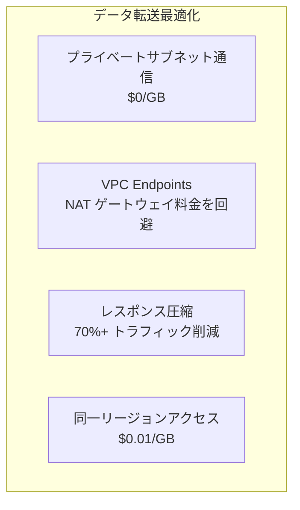

```python
# API Gateway での圧縮の有効化
"""
Resources:
  ApiGateway:
    Type: AWS::Serverless::Api
    Properties:
      Name: compressed-api
      StageName: prod
      Variables:
        MinimumCompressionSize: 1024  # 1KB 以上のレスポンスで圧縮を有効化
"""

# Lambda でのレスポンス圧縮
import gzip
import base64

def lambda_handler(event, context):
    body = generate_large_response()
    
    # クライアントサポートのチェック
    accept_encoding = event.get('headers', {}).get('Accept-Encoding', '')
    
    if 'gzip' in accept_encoding:
        compressed = gzip.compress(body.encode('utf-8'))
        return {
            'statusCode': 200,
            'headers': {
                'Content-Type': 'application/json',
                'Content-Encoding': 'gzip'
            },
            'body': base64.b64encode(compressed).decode('utf-8'),
            'isBase64Encoded': True
        }
    
    return {
        'statusCode': 200,
        'body': body
    }
```

#### 9.6.2 VPC Endpoints による NAT 料金の削減

```yaml
# VPC Endpoints を使用して NAT ゲートウェイ料金 ($0.045/GB) を回避
Resources:
  # S3 Gateway Endpoint (無料)
  S3Endpoint:
    Type: AWS::EC2::VPCEndpoint
    Properties:
      VpcId: !Ref VPC
      ServiceName: !Sub com.amazonaws.${AWS::Region}.s3
      VpcEndpointType: Gateway
      RouteTableIds:
        - !Ref PrivateRouteTable

  # DynamoDB Gateway Endpoint (無料)
  DynamoDBEndpoint:
    Type: AWS::EC2::VPCEndpoint
    Properties:
      VpcId: !Ref VPC
      ServiceName: !Sub com.amazonaws.${AWS::Region}.dynamodb
      VpcEndpointType: Gateway
      RouteTableIds:
        - !Ref PrivateRouteTable

  # その他のサービスは Interface Endpoints を使用 (時間課金)
  LambdaEndpoint:
    Type: AWS::EC2::VPCEndpoint
    Properties:
      VpcId: !Ref VPC
      ServiceName: !Sub com.amazonaws.${AWS::Region}.lambda
      VpcEndpointType: Interface
      SubnetIds:
        - !Ref PrivateSubnet1
        - !Ref PrivateSubnet2
      SecurityGroupIds:
        - !Ref EndpointSecurityGroup
      PrivateDnsEnabled: true
```

### 10.7 コスト監視と予算

#### 9.7.1 コスト配分タグ戦略

```yaml
# 全リソースでコスト配分タグを有効化
Resources:
  LambdaFunction:
    Type: AWS::Serverless::Function
    Properties:
      FunctionName: my-function
      Tags:
        Environment: production
        Project: user-service
        Team: platform
        CostCenter: engineering
        AutoShutdown: false
        
  ECSCluster:
    Type: AWS::ECS::Cluster
    Properties:
      ClusterName: production-cluster
      Tags:
        - Key: Environment
          Value: production
        - Key: Project
          Value: order-service
        - Key: Team
          Value: backend
```

#### 9.7.2 予算アラート

```yaml
# 予算アラート設定
Resources:
  MonthlyBudget:
    Type: AWS::Budgets::Budget
    Properties:
      Budget:
        BudgetName: Serverless-Monthly-Budget
        BudgetLimit:
          Amount: 1000
          Unit: USD
        TimeUnit: MONTHLY
        BudgetType: COST
        CostFilters:
          TagKeyValue:
            - user:Environment$production
        CostTypes:
          IncludeTax: true
          IncludeSubscription: true
          UseBlended: false
          
      NotificationsWithSubscribers:
        # 50% 閾値アラート
        - Notification:
            NotificationType: ACTUAL
            ComparisonOperator: GREATER_THAN
            Threshold: 50
          Subscribers:
            - SubscriptionType: SNS
              Address: !Ref BudgetAlertTopic
              
        # 80% 閾値アラート
        - Notification:
            NotificationType: ACTUAL
            ComparisonOperator: GREATER_THAN
            Threshold: 80
          Subscribers:
            - SubscriptionType: EMAIL
              Address: finance@company.com
            - SubscriptionType: SNS
              Address: !Ref BudgetAlertTopic
              
        # 予測超過アラート
        - Notification:
            NotificationType: FORECASTED
            ComparisonOperator: GREATER_THAN
            Threshold: 100
          Subscribers:
            - SubscriptionType: SNS
              Address: !Ref BudgetAlertTopic
```

#### 9.7.3 Cost Explorer 分析

```python
# Cost Explorer API を使用した Serverless コスト分析
import boto3
from datetime import datetime, timedelta

def analyze_serverless_costs():
    ce = boto3.client('ce')
    
    # サービス別の月次コスト
    response = ce.get_cost_and_usage(
        TimePeriod={
            'Start': (datetime.now() - timedelta(days=30)).strftime('%Y-%m-%d'),
            'End': datetime.now().strftime('%Y-%m-%d')
        },
        Granularity='DAILY',
        Metrics=['UnblendedCost', 'UsageQuantity'],
        GroupBy=[
            {'Type': 'DIMENSION', 'Key': 'SERVICE'},
            {'Type': 'TAG', 'Key': 'Environment'}
        ],
        Filter={
            'Dimensions': {
                'Key': 'SERVICE',
                'Values': [
                    'AWS Lambda',
                    'Amazon ECS',
                    'AWS Fargate',
                    'Amazon API Gateway',
                    'Amazon DynamoDB'
                ]
            }
        }
    )
    
    # コストレポートの生成
    print("=" * 60)
    print("Serverless コスト分析 (過去 30 日間)")
    print("=" * 60)
    
    for group in response['ResultsByTime']:
        date = group['TimePeriod']['Start']
        for result in group['Groups']:
            service = result['Keys'][0]
            cost = float(result['Metrics']['UnblendedCost']['Amount'])
            print(f"{date}: {service}: ${cost:.2f}")
    
    return response
```

### 10.8 コスト最適化ケーススタディ

#### ケース 1: API サービスコスト最適化 (85% 削減)

```markdown
## 背景
- EC API、月間呼び出し回数: 5 億回
- 元のアーキテクチャ: Lambda + API Gateway + DynamoDB
- 元の月額コスト: ~$4,500

## 最適化施策
1. Lambda Power Tuning: 128MB → 512MB (実際のコスト 30% 削減)
2. API Gateway キャッシュ: ヒット率 60%、Lambda 呼び出し削減
3. DynamoDB DAX キャッシュ: 読み取り操作 80% 削減
4. CloudFront エッジキャッシュ: 静的レスポンスを 24h キャッシュ
5. SQS メッセージのバッチ処理: BatchSize 10 → 100

## 結果
- 最適化後の月額コスト: ~$680
- 削減額: 85%
- 応答レイテンシー: 40% 低下
```

#### ケース 2: データ処理パイプライン最適化 (92% 削減)

```markdown
## 背景
- ログ処理パイプライン、日次 10TB データ
- 元のアーキテクチャ: Fargate 常駐タスク処理
- 元の月額コスト: ~$12,000

## 最適化施策
1. Fargate → Lambda 変換: 短時間タスクに Lambda を使用
2. Fargate Spot: 耐障害性タスクに Spot を使用 (70% 削減)
3. Graviton2 移行: ARM アーキテクチャ (20% 削減)
4. S3 Intelligent-Tiering: 自動階層型ストレージ
5. データ圧縮: Gzip 圧縮で 80% ストレージ削減

## 結果
- 最適化後の月額コスト: ~$960
- 削減額: 92%
- 処理速度: 2倍向上
```

### 10.9 コスト最適化チェックリスト

```markdown
## Serverless コスト最適化チェックリスト

### Lambda 最適化
- [ ] Power Tuning を使用して最適なメモリ設定を見つける
- [ ] イベントをバッチ処理し呼び出し回数を削減
- [ ] レスポンスキャッシュを実装 (API Gateway + CloudFront)
- [ ] 依存関係パッケージサイズを最適化しコールドスタートを削減
- [ ] Provisioned Concurrency は重要なパスにのみ使用

### Fargate 最適化
- [ ] 非重要なワークロードに Fargate Spot を使用
- [ ] Graviton2 ARM アーキテクチャを評価
- [ ] 定期的なライトサイジングでリソース設定を調整
- [ ] オーバープロビジョニングを避けるため自動スケーリングを使用

### ストレージ最適化
- [ ] S3 で Intelligent-Tiering を有効化
- [ ] 低トラフィックテーブルには DynamoDB On-Demand を使用
- [ ] TTL を設定し期限切れデータを自動クリーンアップ
- [ ] S3 圧縮と削除マーカーを有効化

### ネットワーク最適化
- [ ] VPC Endpoints を使用して NAT 料金を回避
- [ ] API Gateway の圧縮を有効化
- [ ] 可能な限りプライベートサブネット内でトラフィックを維持
- [ ] CloudFront を使用してオリジンへのアクセスを削減

### 監視とガバナンス
- [ ] 全リソースにコスト配分タグを付与
- [ ] 予算アラートを設定
- [ ] Cost Explorer レポートを週次で確認
- [ ] コスト最適化 KPI を確立
```

---

## 11. 本番環境デプロイメント

### 11.1 CI/CD フロー


### 11.2 デプロイメント戦略

| 戦略 | 適用シナリオ | リスク |
|------|----------|------|
| ローリングデプロイメント | 標準的な更新 | 低 |
| ブルー/グリーンデプロイメント | ミッションクリティカル業務 | 極めて低い |
| カナリア | メジャーバージョン更新 | 管理可能 |

---

## 12. トラブルシューティング

### 12.1 一般的な問題

| 問題 | 考えられる原因 | 解決策 |
|------|----------|------|
| コールドスタートが遅い | 依存関係が大きい/初期化が遅い | プロビジョンド同時実行/初期化の最適化 |
| メモリ不足 | 設定不足 | メモリ設定の増加 |
| タイムアウト | 処理時間が長い | タイムアウトの増加/Fargate の使用 |
| レート制限 | 同時実行不足 | 予約同時実行の増加 |

### 12.2 デバッグツール

```bash
# Lambda ログ
aws logs tail /aws/lambda/my-function --follow

# Fargate タスクログ
aws logs tail /ecs/my-service --follow

# X-Ray トレース
aws xray get-service-graph --start-time $(date -d '1 hour ago' +%s)
```

---

## まとめ

AWS Serverless は、モダンなアプリケーションを構築するための強力な機能を提供します:

- **Lambda** はイベント駆動型、短時間タスクに適しています
- **Fargate** は長時間実行、複雑なアプリケーションに適しています
- **ハイブリッド使用** で最適な効果を得られます

### 主要ポイントの振り返り

| ディメンション | コア戦略 |
|------|----------|
| **高可用性** | マルチ可用ゾーンデプロイメント、ステートレス設計、グレースフルデグラデーション、自動化された障害復旧 |
| **コスト最適化** | Power Tuning、バッチ処理、Spot インスタンス、階層型ストレージ、VPC Endpoints |
| **パフォーマンス** | プロビジョンド同時実行、メモリ最適化、キャッシュ戦略、接続再利用 |
| **セキュリティ** | 最小権限、転送中の暗号化、シークレット管理、VPC 分離 |

### 意思決定クイックリファレンス

```
Lambda を選択する場合:
✓ 実行時間 < 15 分
✓ イベント駆動型アーキテクチャ
✓ 高速な自動スケーリングが必要
✓ コストに敏感な低トラフィックシナリオ

Fargate を選択する場合:
✓ 実行時間 > 15 分
✓ 長時間実行されるサービスが必要
✓ 複雑な依存関係/大容量メモリ要件
✓ 既存のコンテナ化されたワークロード

ハイブリッド使用のベストプラクティス:
✓ API Gateway → Lambda (認証/ルーティング)
✓ Lambda → Fargate (複雑な処理)
✓ Step Functions で両方をオーケストレーション
```

パフォーマンス、コスト、高可用性、セキュリティを継続的に最適化し、本番グレードのサーバーレスアプリケーションを構築してください。

---

*バージョン: v1.1*  
*更新日: 2026-03-02*
