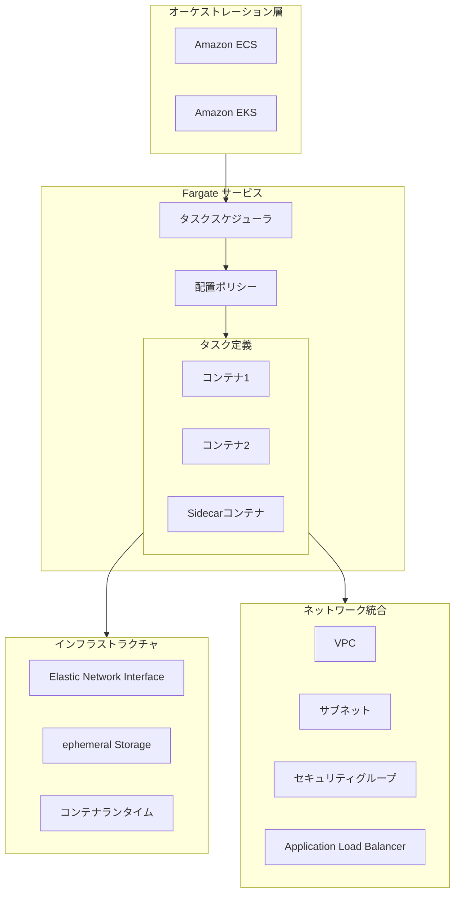
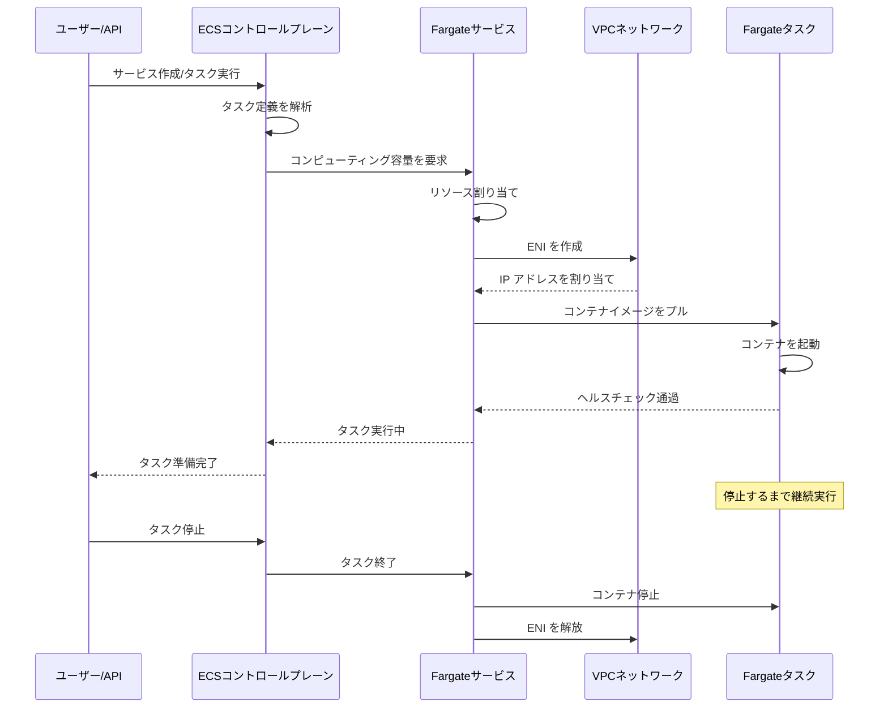
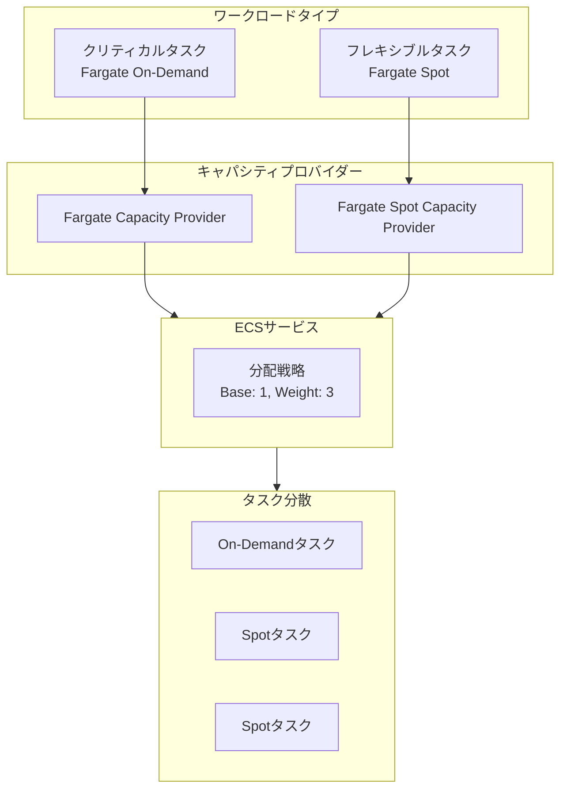
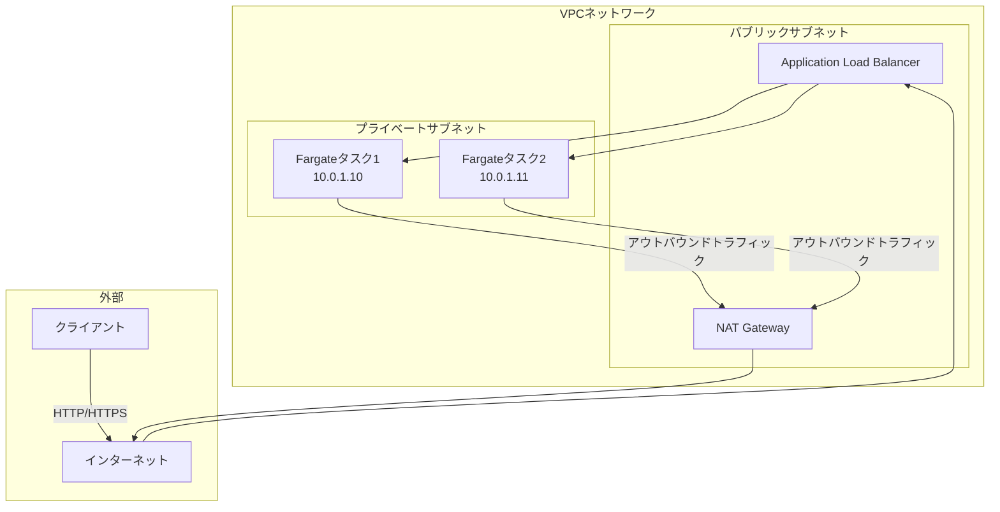
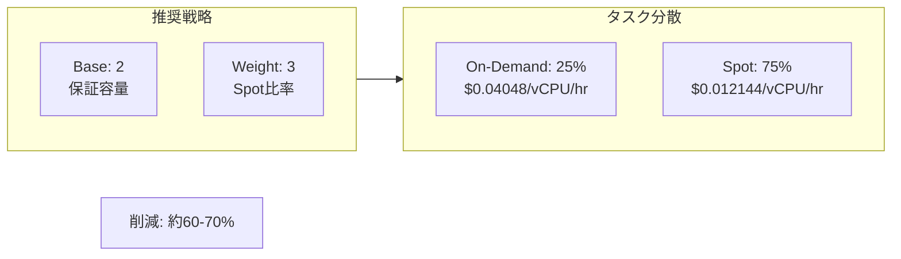

# AWS Fargate 詳細解説

> サーバーレスコンテナコンピューティングサービス完全ガイド

---

## 🎯 サービス概要

**AWS Fargate** は AWS が提供するサーバーレスコンピューティングエンジンで、Amazon ECS および EKS と連携して、サーバーやクラスターの管理なしにコンテナを実行できます。アプリケーションのリソースとネットワーク要件を定義するだけで、Fargate がすべてのインフラストラクチャのプロビジョニングと管理を行います。

**コア機能**:
- **サーバーレスコンテナ**: EC2 インスタンスの管理が不要です
- **従量課金**: 実際に使用した vCPU とメモリに対して課金されます
- **セキュアな分離**: 各タスクは独立したコンピューティング環境です
- **シームレスな統合**: ECS、EKS、VPC と深く統合されています

**Lambda と Fargate の比較**:

| 機能 | Lambda | Fargate |
|------|--------|---------|
| 実行時間 | 最大15分 | 無制限 |
| パッケージサイズ | 最大10GB（コンテナ） | 無制限 |
| 起動時間 | ミリ秒単位 | 秒単位（最適化可能） |
| 使用シナリオ | イベント駆動、短時間タスク | 長時間実行、複雑なアプリケーション |
| カスタムランタイム | 限定あり | 完全に制御可能 |
| ネットワーク設定 | シンプル | 柔軟 |

---

## 🏗️ アーキテクチャ図

### Fargate 全体アーキテクチャ



### ECS Fargate 起動フロー



### Fargate Spot コスト最適化アーキテクチャ



---

## 📦 コアコンポーネント

### 1. タスク定義 (Task Definition)

```json
{
    "family": "web-application",
    "networkMode": "awsvpc",
    "requiresCompatibilities": ["FARGATE"],
    "cpu": "512",
    "memory": "1024",
    "executionRoleArn": "arn:aws:iam::account:role/ecsTaskExecutionRole",
    "taskRoleArn": "arn:aws:iam::account:role/ecsTaskRole",
    "containerDefinitions": [
        {
            "name": "web-app",
            "image": "account.dkr.ecr.region.amazonaws.com/web-app:latest",
            "essential": true,
            "portMappings": [
                {
                    "containerPort": 8080,
                    "protocol": "tcp"
                }
            ],
            "environment": [
                {"name": "DB_HOST", "value": "db.cluster-xxx.region.rds.amazonaws.com"}
            ],
            "secrets": [
                {
                    "name": "DB_PASSWORD",
                    "valueFrom": "arn:aws:secretsmanager:region:account:secret:db-password"
                }
            ],
            "logConfiguration": {
                "logDriver": "awslogs",
                "options": {
                    "awslogs-group": "/ecs/web-application",
                    "awslogs-region": "us-east-1",
                    "awslogs-stream-prefix": "ecs"
                }
            },
            "healthCheck": {
                "command": ["CMD-SHELL", "curl -f http://localhost:8080/health || exit 1"],
                "interval": 30,
                "timeout": 5,
                "retries": 3
            }
        }
    ]
}
```

### 2. サービス設定オプション

| 設定項目 | 説明 | 推奨値 |
|--------|------|------|
| **Desired Count** | 期待するタスク数 | 負荷に応じて設定します |
| **Launch Type** | 起動タイプ | FARGATE/FARGATE_SPOT |
| **Deployment Controller** | デプロイメントコントローラー | ECS（ローリング）/CODE_DEPLOY（ブルー/グリーン） |
| **Health Check Grace Period** | ヘルスチェック猶予期間 | 起動時間に応じて設定します |
| **Auto Scaling** | 自動スケーリング | CPU/メモリ/カスタムメトリクスに基づく |

### 3. ネットワークモード (awsvpc)



---

## 💻 コードサンプル

### ECS Fargate サービス (AWS CDK)

```typescript
import * as cdk from 'aws-cdk-lib';
import * as ecs from 'aws-cdk-lib/aws-ecs';
import * as ec2 from 'aws-cdk-lib/aws-ec2';
import * as elbv2 from 'aws-cdk-lib/aws-elasticloadbalancingv2';

export class FargateServiceStack extends cdk.Stack {
  constructor(scope: cdk.App, id: string, props?: cdk.StackProps) {
    super(scope, id, props);

    // VPC 設定
    const vpc = new ec2.Vpc(this, 'FargateVPC', {
      maxAzs: 2,
      natGateways: 1
    });

    // ECS クラスター
    const cluster = new ecs.Cluster(this, 'FargateCluster', {
      vpc: vpc,
      clusterName: 'production-cluster'
    });

    // Fargate タスク定義
    const taskDefinition = new ecs.FargateTaskDefinition(this, 'TaskDef', {
      memoryLimitMiB: 1024,
      cpu: 512,
      runtimePlatform: {
        operatingSystemFamily: ecs.OperatingSystemFamily.LINUX,
        cpuArchitecture: ecs.CpuArchitecture.X86_64
      }
    });

    // コンテナを追加
    const container = taskDefinition.addContainer('web', {
      image: ecs.ContainerImage.fromRegistry('nginx:latest'),
      logging: ecs.LogDrivers.awsLogs({ streamPrefix: 'fargate' }),
      healthCheck: {
        command: ['CMD-SHELL', 'curl -f http://localhost/ || exit 1'],
        interval: cdk.Duration.seconds(30),
        timeout: cdk.Duration.seconds(5),
        retries: 3
      }
    });

    container.addPortMappings({
      containerPort: 80,
      protocol: ecs.Protocol.TCP
    });

    // Fargate サービス
    const service = new ecs.FargateService(this, 'FargateService', {
      cluster: cluster,
      taskDefinition: taskDefinition,
      serviceName: 'web-service',
      desiredCount: 2,
      assignPublicIp: false,
      vpcSubnets: {
        subnetType: ec2.SubnetType.PRIVATE_WITH_EGRESS
      },
      capacityProviderStrategies: [
        {
          capacityProvider: 'FARGATE',
          weight: 1,
          base: 1
        },
        {
          capacityProvider: 'FARGATE_SPOT',
          weight: 3
        }
      ]
    });

    // Application Load Balancer
    const alb = new elbv2.ApplicationLoadBalancer(this, 'ALB', {
      vpc: vpc,
      internetFacing: true
    });

    const listener = alb.addListener('Listener', {
      port: 80,
      open: true
    });

    listener.addTargets('ECS', {
      port: 80,
      targets: [service],
      healthCheck: {
        path: '/health',
        interval: cdk.Duration.seconds(30)
      }
    });
  }
}
```

### 自動スケーリング設定

```typescript
// CPU スケーリングポリシー
const scaling = service.autoScaleTaskCount({
  minCapacity: 2,
  maxCapacity: 20
});

scaling.scaleOnCpuUtilization('CpuScaling', {
  targetUtilizationPercent: 70,
  scaleInCooldown: cdk.Duration.seconds(60),
  scaleOutCooldown: cdk.Duration.seconds(60)
});

// カスタムメトリクススケーリング
scaling.scaleOnMetric('RequestCountScaling', {
  metric: alb.metricRequestCount(),
  targetValue: 1000,
  scaleInCooldown: cdk.Duration.seconds(60),
  scaleOutCooldown: cdk.Duration.seconds(60)
});
```

### Terraform 設定

```hcl
# Fargate タスク定義
resource "aws_ecs_task_definition" "app" {
  family                   = "web-app"
  requires_compatibilities = ["FARGATE"]
  network_mode             = "awsvpc"
  cpu                      = "512"
  memory                   = "1024"
  execution_role_arn       = aws_iam_role.ecs_execution.arn
  task_role_arn            = aws_iam_role.ecs_task.arn

  container_definitions = jsonencode([
    {
      name  = "web"
      image = "${aws_ecr_repository.app.repository_url}:latest"
      essential = true
      
      portMappings = [
        {
          containerPort = 8080
          protocol      = "tcp"
        }
      ]
      
      environment = [
        { name = "NODE_ENV", value = "production" }
      ]
      
      secrets = [
        {
          name      = "DATABASE_URL"
          valueFrom = aws_secretsmanager_secret.db_url.arn
        }
      ]
      
      logConfiguration = {
        logDriver = "awslogs"
        options = {
          awslogs-group         = aws_cloudwatch_log_group.app.name
          awslogs-region        = data.aws_region.current.name
          awslogs-stream-prefix = "ecs"
        }
      }
      
      healthCheck = {
        command     = ["CMD-SHELL", "curl -f http://localhost:8080/health || exit 1"]
        interval    = 30
        timeout     = 5
        retries     = 3
        startPeriod = 60
      }
    }
  ])
}

# Fargate サービス
resource "aws_ecs_service" "app" {
  name            = "web-service"
  cluster         = aws_ecs_cluster.main.id
  task_definition = aws_ecs_task_definition.app.arn
  desired_count   = 2
  launch_type     = "FARGATE"

  network_configuration {
    subnets          = aws_subnet.private[*].id
    security_groups  = [aws_security_group.ecs_tasks.id]
    assign_public_ip = false
  }

  load_balancer {
    target_group_arn = aws_lb_target_group.app.arn
    container_name   = "web"
    container_port   = 8080
  }

  deployment_controller {
    type = "ECS"
  }

  deployment_circuit_breaker {
    enable   = true
    rollback = true
  }

  depends_on = [aws_lb_listener.https]
}
```

---

## 🚀 パフォーマンス最適化

### 1. イメージ最適化

```dockerfile
# マルチステージビルドでイメージサイズを縮小
FROM node:18-alpine AS builder
WORKDIR /app
COPY package*.json ./
RUN npm ci --only=production

FROM node:18-alpine
WORKDIR /app
# 本番依存のみをコピー
COPY --from=builder /app/node_modules ./node_modules
COPY . .
EXPOSE 8080
CMD ["node", "server.js"]
```

### 2. 起動最適化

```python
# ヘルスチェックエンドポイント - 高速応答
from flask import Flask, jsonify

app = Flask(__name__)

@app.route('/health')
def health():
    # シンプルなチェックで高速に返却
    return jsonify({'status': 'healthy'}), 200

@app.route('/ready')
def ready():
    # 依存関係（データベースなど）をチェック
    if check_dependencies():
        return jsonify({'status': 'ready'}), 200
    return jsonify({'status': 'not ready'}), 503
```

### 3. キャパシティプロバイダー戦略



---

## 🔒 セキュリティのベストプラクティス

### タスク IAM ロール

```json
{
    "Version": "2012-10-17",
    "Statement": [
        {
            "Effect": "Allow",
            "Action": [
                "s3:GetObject",
                "s3:PutObject"
            ],
            "Resource": "arn:aws:s3:::app-bucket/*"
        },
        {
            "Effect": "Allow",
            "Action": [
                "dynamodb:GetItem",
                "dynamodb:PutItem",
                "dynamodb:Query"
            ],
            "Resource": "arn:aws:dynamodb:region:account:table/AppTable"
        },
        {
            "Effect": "Allow",
            "Action": [
                "secretsmanager:GetSecretValue"
            ],
            "Resource": "arn:aws:secretsmanager:region:account:secret:app/*"
        }
    ]
}
```

### セキュリティグループ設定

```hcl
# ALB からのインバウンドトラフィックのみ許可
resource "aws_security_group" "ecs_tasks" {
  name        = "ecs-tasks-sg"
  description = "Security group for ECS tasks"
  vpc_id      = aws_vpc.main.id

  ingress {
    from_port       = 8080
    to_port         = 8080
    protocol        = "tcp"
    security_groups = [aws_security_group.alb.id]
  }

  egress {
    from_port   = 0
    to_port     = 0
    protocol    = "-1"
    cidr_blocks = ["0.0.0.0/0"]
  }
}
```

---

## 💰 コスト最適化

### Fargate 料金計算

```
Fargate 料金 = vCPU 料金 + メモリ料金

vCPU 料金 = vCPU 数 × 実行時間(時間) × $0.04048
メモリ料金 = GB 数 × 実行時間(時間) × $0.004445

例:
- タスク設定: 1 vCPU, 2GB メモリ
- 実行時間: 24 時間/日 × 30 日 = 720 時間
- タスク数: 3 個

vCPU 料金 = 1 × 720 × 3 × $0.04048 = $87.44
メモリ料金 = 2 × 720 × 3 × $0.004445 = $19.20
月額料金 = $106.64

Fargate Spot を使用した場合（70%削減）:
月額料金 ≈ $32.00
```

### コスト最適化戦略

1. **Graviton2 (ARM64) の使用**: 価格が低く、パフォーマンスが向上します
2. **Fargate Spot**: 耐障害性のあるワークロードに適しています
3. **右サイジング**: 実際の使用状況に応じてリソースを調整します
4. **自動スケーリング**: 過剰プロビジョニングを回避します
5. **リザーブドインスタンス**: 長期にわたる安定したワークロードには Compute Savings Plans を検討します

---

## 📊 モニタリングとオブザーバビリティ

### Container Insights

```bash
# Container Insights を有効化
aws ecs put-cluster-setting \
    --cluster production \
    --setting name=containerInsights,value=enabled \
    --region us-east-1
```

### 主要指標

| 指標 | 説明 | アラーム閾値 |
|------|------|----------|
| **CPUUtilization** | CPU 使用率 | > 70% |
| **MemoryUtilization** | メモリ使用率 | > 80% |
| **RunningTaskCount** | 実行中タスク数 | < desired count |
| **PendingTaskCount** | 起動待ちタスク数 | > 0 が5分間続く |
| **DeploymentFailures** | デプロイメント失敗数 | > 0 |

---

## 🔗 関連リソース

- [AWS Fargate 公式ドキュメント](https://docs.aws.amazon.com/AmazonECS/latest/userguide/what-is-fargate.html)
- [ECS ベストプラクティス](https://docs.aws.amazon.com/AmazonECS/latest/bestpracticesguide/intro.html)
- [Fargate 料金](https://aws.amazon.com/fargate/pricing/)
- [ECS サンプルコード](https://github.com/aws-samples/aws-ecs-samples)
