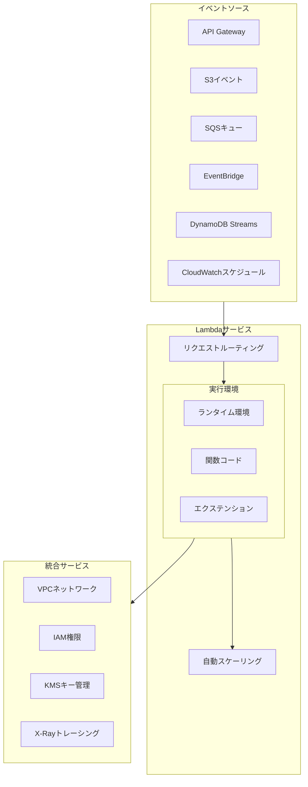
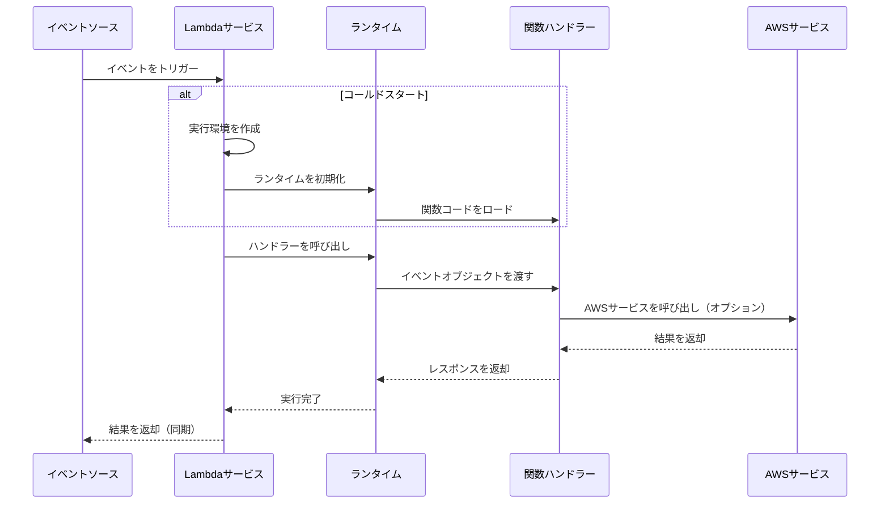
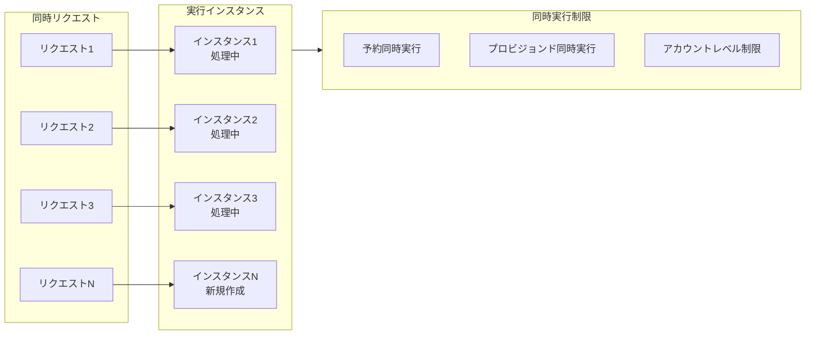

# AWS Lambda 詳細解説

> サーバーレスコンピューティングのコアサービスを完全に習得する

---

## 🎯 サービス概要

**AWS Lambda** は AWS が提供するサーバーレスコンピューティングサービスで、サーバーのプロビジョニングや管理なしにコードを実行できます。コードをアップロードするだけで、Lambda が高可用性を実現するために必要な実行とスケーリングをすべて処理します。

**コア機能**:
- **サーバーレス**: インフラストラクチャの管理が不要です
- **自動スケーリング**: 1日数リクエストから毎秒数千リクエストまで対応します
- **従量課金**: コードの実行時間とリクエスト数に対して課金されます
- **イベント駆動**: 様々な AWS サービスのイベントに応答します

---

## 🏗️ アーキテクチャ図

### Lambda 全体アーキテクチャ



### 関数実行フロー



### 同時実行とスケーリングアーキテクチャ



---

## 📦 コアコンポーネント

### 1. 関数設定

| 設定項目 | 説明 | 推奨値 |
|--------|------|--------|
| **メモリ** | 128MB - 10GB | 要件に応じて調整し、CPU に影響します |
| **タイムアウト** | 最大15分 | ハングを防ぐため適切なタイムアウトを設定します |
| **ランタイム** | Node.js/Python/Java/Go など | 慣れ親しんだ言語を選択します |
| **環境変数** | 設定パラメータ | 機密データは暗号化して保護します |
| **VPC** | ネットワーク設定 | 必要な場合のみ有効にします |

### 2. トリガータイプ

```
トリガータイプ                使用シナリオ
─────────────────────────────────────────
API Gateway           REST API/WebSocket
Application Load Balancer  HTTP/HTTPS
S3                    ファイルアップロード/処理イベント
SQS                   非同期メッセージ処理
EventBridge           スケジュールタスク/イベント応答
DynamoDB Streams      データベース変更処理
Kinesis               ストリームデータ処理
CloudWatch Logs       ログ処理
Cognito               ユーザー認証トリガー
```

### 3. デプロイ方式

| 方式 | 適用シナリオ | 特徴 |
|------|----------|------|
| **コンソールエディター** | 迅速なテスト | シンプルな関数に適しています |
| **ZIP アップロード** | 小規模プロジェクト | コード+依存関係をパッケージ化します |
| **コンテナイメージ** | 複雑な依存関係 | 最大10GB まで対応 |
| **S3 デプロイ** | 大規模プロジェクト | CI/CD と組み合わせて使用します |
| **SAM/CloudFormation** | 本番環境 | Infrastructure as Code で実現します |

---

## 💻 コードサンプル

### 基本 Lambda 関数 (Python)

```python
import json
import boto3

def lambda_handler(event, context):
    """
    Lambda ハンドラー関数のエントリーポイント
    
    event: トリガーイベントデータ
    context: ランタイムコンテキスト
    """
    # リクエストパラメータを取得
    name = event.get('name', 'World')
    
    # ビジネスロジック
    message = f"Hello, {name}!"
    
    # レスポンスを返却
    return {
        'statusCode': 200,
        'headers': {
            'Content-Type': 'application/json',
            'Access-Control-Allow-Origin': '*'
        },
        'body': json.dumps({
            'message': message,
            'requestId': context.aws_request_id
        })
    }
```

### エラーハンドリング付き Lambda

```python
import json
import logging
from botocore.exceptions import ClientError

logger = logging.getLogger()
logger.setLevel(logging.INFO)

def lambda_handler(event, context):
    try:
        # 入力検証
        if 'userId' not in event:
            raise ValueError("userId is required")
        
        # ビジネス処理
        result = process_user(event['userId'])
        
        return {
            'statusCode': 200,
            'body': json.dumps(result)
        }
        
    except ValueError as e:
        logger.warning(f"Validation error: {str(e)}")
        return {
            'statusCode': 400,
            'body': json.dumps({'error': str(e)})
        }
        
    except ClientError as e:
        logger.error(f"AWS API error: {str(e)}")
        return {
            'statusCode': 500,
            'body': json.dumps({'error': 'Service temporarily unavailable'})
        }
        
    except Exception as e:
        logger.exception("Unexpected error")
        raise

def process_user(user_id):
    # ビジネスロジック
    return {'userId': user_id, 'status': 'processed'}
```

### Lambda レイヤー (Layer) の使用

```python
# Lambda Layer を使用してコードを共有
import requests  # Layer から提供される依存関係
from shared_utils import validate_input  # カスタム Layer

def lambda_handler(event, context):
    # Layer のツール関数を使用
    if not validate_input(event):
        return {'statusCode': 400, 'body': 'Invalid input'}
    
    # Layer のライブラリを使用
    response = requests.get('https://api.example.com/data')
    
    return {
        'statusCode': 200,
        'body': response.json()
    }
```

---

## 🚀 パフォーマンス最適化

### 1. コールドスタートの削減

```python
# グローバル初期化（関数の外側）- 一度だけ実行
import boto3

dynamodb = boto3.resource('dynamodb')  # 接続を再利用
table = dynamodb.Table('Users')        # テーブルを事前ロード

def lambda_handler(event, context):
    # 関数内ロジック - 呼び出しごとに実行
    response = table.get_item(Key={'id': event['userId'])
    return response
```

### 2. プロビジョンド同時実行

```bash
# プロビジョンド同時実行を設定 - コールドスタートを回避
aws lambda put-provisioned-concurrency-config \
    --function-name my-function \
    --qualifier PROD \
    --provisioned-concurrent-executions 100
```

### 3. メモリ最適化

| メモリ(MB) | メモリ価格/1ms | 相対CPU |
|----------|-------------|---------|
| 128 | $0.0000000021 | ベースライン |
| 512 | $0.0000000083 | ~3倍 |
| 1024 | $0.0000000167 | ~6倍 |
| 3008 | $0.0000000490 | ~18倍 |

**最適化戦略**: 
- パフォーマンスとコストの最適なバランス点を見つけます
- Power Tuning ツールを使用してテストします

---

## 🔒 セキュリティのベストプラクティス

### IAM 最小権限の原則

```json
{
    "Version": "2012-10-17",
    "Statement": [
        {
            "Effect": "Allow",
            "Action": [
                "dynamodb:GetItem",
                "dynamodb:PutItem"
            ],
            "Resource": "arn:aws:dynamodb:region:account:table/SpecificTable"
        },
        {
            "Effect": "Allow",
            "Action": "logs:CreateLogGroup",
            "Resource": "arn:aws:logs:region:account:*"
        },
        {
            "Effect": "Allow",
            "Action": [
                "logs:CreateLogStream",
                "logs:PutLogEvents"
            ],
            "Resource": "arn:aws:logs:region:account:log-group:/aws/lambda/function-name:*"
        }
    ]
}
```

### 環境変数の暗号化

```bash
# KMS を使用して環境変数を暗号化
aws lambda update-function-configuration \
    --function-name my-function \
    --environment Variables={API_KEY=plaintext_value} \
    --kms-key-arn arn:aws:kms:region:account:key/key-id
```

---

## 📊 モニタリングとデバッグ

### CloudWatch メトリクス

```python
import boto3
from datetime import datetime, timedelta

cloudwatch = boto3.client('cloudwatch')

# 関数メトリクスを取得
response = cloudwatch.get_metric_statistics(
    Namespace='AWS/Lambda',
    MetricName='Duration',
    Dimensions=[
        {'Name': 'FunctionName', 'Value': 'my-function'}
    ],
    StartTime=datetime.utcnow() - timedelta(hours=1),
    EndTime=datetime.utcnow(),
    Period=300,
    Statistics=['Average', 'Maximum']
)
```

### X-Ray 分散トレーシング

```python
from aws_xray_sdk.core import xray_recorder, patch_all

patch_all()  # すべての AWS SDK 呼び出しを自動トレース

@xray_recorder.capture('process_payment')
def process_payment(order_id):
    # このコードはトレースされます
    pass

def lambda_handler(event, context):
    # カスタムアノテーションを追加
    xray_recorder.put_annotation('orderId', event['orderId'])
    
    process_payment(event['orderId'])
    
    return {'statusCode': 200}
```

---

## 💰 コスト最適化

### 料金計算

```
月額料金 = リクエスト料金 + コンピューティング料金

リクエスト料金 = リクエスト数 × $0.20/百万リクエスト

コンピューティング料金 = 実行回数 × 実行時間(ms) × メモリ(GB) × $0.0000166667/GB-秒

例:
- 毎月 1 億リクエスト
- 平均実行時間 200ms
- メモリ設定 512MB (0.5GB)

リクエスト料金 = 100 × $0.20 = $20
コンピューティング料金 = 100,000,000 × 0.2 × 0.5 × $0.0000166667 = $166.67
総料金 = $186.67/月
```

### コスト削減戦略

1. **Graviton2 プロセッサーの使用**: 20%安く、パフォーマンスが向上します
2. **メモリ設定の最適化**: 最適なコストパフォーマンス点を見つけます
3. **不要な呼び出しの削減**: SQS バッチ処理を使用します
4. **予約同時実行**: 予測可能なトラフィックのワークロードに適しています
5. **Compute Savings Plans の使用**: 長期コミットメントによる割引を受けます

---

## 🔗 関連リソース

- [AWS Lambda 公式ドキュメント](https://docs.aws.amazon.com/lambda/)
- [Lambda ベストプラクティス](https://docs.aws.amazon.com/lambda/latest/dg/best-practices.html)
- [Lambda Power Tuning](https://github.com/alexcasalboni/aws-lambda-power-tuning)
- [AWS SAM](https://docs.aws.amazon.com/serverless-application-model/)
