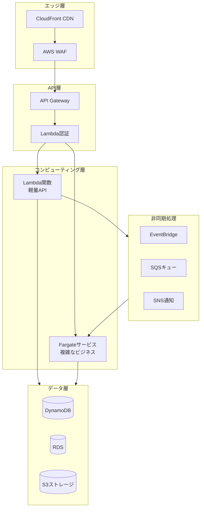
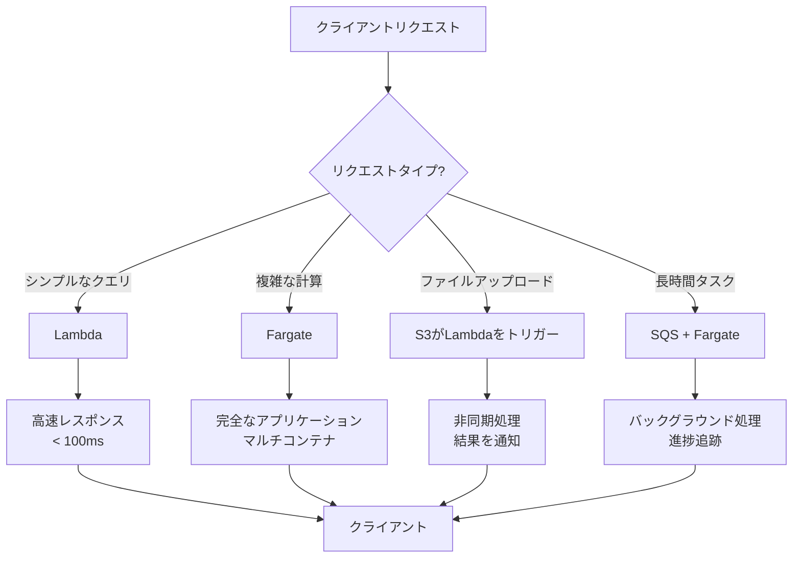
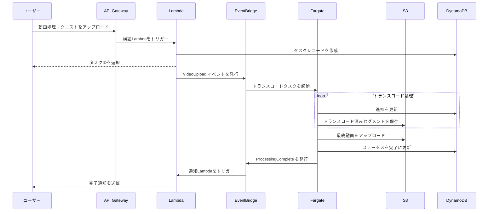
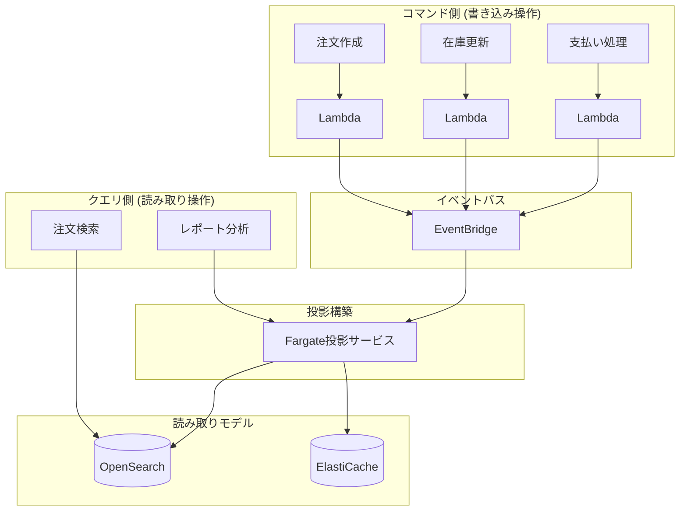

# Lambda と Fargate の統合パターン

> モダンなサーバーレスアプリケーションを構築するベストプラクティス

---

## 🎯 概要

Lambda と Fargate は互いに排他的ではなく、補完的なサーバーレスコンピューティングオプションです。どちらのサービスをいつ使用するか、またどのように組み合わせて使用するかを理解することは、効率的で経済的、かつスケーラブルなアーキテクチャを構築する鍵となります。

**意思決定マトリクス**:

| シナリオ | 推奨サービス | 理由 |
|------|----------|------|
| API リクエスト処理 (< 15分) | Lambda | 低レイテンシ、自動スケーリング |
| 長時間のデータ処理 | Fargate | タイムアウト制限なし |
| 機械学習推論 | 両方可能 | モデルサイズに応じて選択 |
| 動画トランスコード | Fargate | 計算集約型、長時間実行 |
| スケジュールタスク | Lambda | シンプル、低コスト |
| 複雑なワークフロー | Lambda + Fargate | 組み合わせのメリット |

---

## 🏗️ アーキテクチャ図

### Lambda + Fargate ハイブリッドアーキテクチャ



### リクエストルーティング意思決定フロー



### イベント駆動ワークフロー



---

## 💻 統合パターン

### パターン1: Lambda から Fargate タスクをトリガー

高速に応答し、長時間の処理タスクを開始する必要があるシナリオに適しています。

```python
import boto3
import json

ecs = boto3.client('ecs')

def lambda_handler(event, context):
    """
    API Gateway によってトリガーされ、Fargate タスクを起動して処理を行う
    """
    # 入力を検証
    job_id = event.get('jobId')
    if not job_id:
        return {'statusCode': 400, 'body': 'jobId required'}
    
    # Fargate タスクを起動
    response = ecs.run_task(
        cluster='processing-cluster',
        taskDefinition='video-processor:3',
        launchType='FARGATE',
        networkConfiguration={
            'awsvpcConfiguration': {
                'subnets': ['subnet-xxx', 'subnet-yyy'],
                'securityGroups': ['sg-xxx'],
                'assignPublicIp': 'DISABLED'
            }
        },
        overrides={
            'containerOverrides': [
                {
                    'name': 'processor',
                    'environment': [
                        {'name': 'JOB_ID', 'value': job_id},
                        {'name': 'INPUT_BUCKET', 'value': event.get('bucket')},
                        {'name': 'INPUT_KEY', 'value': event.get('key')}
                    ]
                }
            ]
        }
    )
    
    task_arn = response['tasks'][0]['taskArn']
    
    return {
        'statusCode': 202,
        'body': json.dumps({
            'message': 'Processing started',
            'jobId': job_id,
            'taskArn': task_arn
        })
    }
```

### パターン2: Fargate から Lambda を呼び出し

コンテナアプリケーション内で特定のサーバーレス機能を実行する必要があるシナリオに適しています。

```python
# Fargate コンテナ内のコード
import boto3
import json

lambda_client = boto3.client('lambda')

def process_order(order_data):
    # ビジネス処理...
    
    # Lambda を呼び出して検証を行う
    response = lambda_client.invoke(
        FunctionName='order-validation',
        InvocationType='RequestResponse',
        Payload=json.dumps({
            'orderId': order_data['id'],
            'amount': order_data['amount'],
            'customerId': order_data['customer_id']
        })
    )
    
    result = json.loads(response['Payload'].read())
    
    if result.get('valid'):
        # 処理を継続
        return complete_order(order_data)
    else:
        # 注文を拒否
        return {'status': 'rejected', 'reason': result.get('reason')}
```

### パターン3: イベントバスによる調整

EventBridge を使用して疎結合な Lambda-Fargate 連携を実現します。

```yaml
# SAM テンプレート定義
AWSTemplateFormatVersion: '2010-09-09'
Transform: AWS::Serverless-2016-10-31

Resources:
  # Lambda 関数 - イベントプロデューサー
  OrderProcessor:
    Type: AWS::Serverless::Function
    Properties:
      CodeUri: src/order_processor
      Handler: app.lambda_handler
      Runtime: python3.11
      Events:
        ApiEvent:
          Type: Api
          Properties:
            Path: /orders
            Method: post
      Environment:
        Variables:
          EVENT_BUS_NAME: !Ref OrderEventBus
      Policies:
        - EventBridgePutEventsPolicy:
            EventBusName: !Ref OrderEventBus

  # EventBridge イベントバス
  OrderEventBus:
    Type: AWS::Events::EventBus
    Properties:
      Name: order-events

  # EventBridge ルール - Lambda をトリガー
  LightProcessingRule:
    Type: AWS::Events::Rule
    Properties:
      EventBusName: !Ref OrderEventBus
      EventPattern:
        source:
          - order.service
        detail-type:
          - Order Created
        detail:
          priority:
            - low
      Targets:
        - Arn: !GetAtt LightOrderProcessor.Arn
          Id: LightOrderProcessor

  # EventBridge ルール - Fargate をトリガー
  HeavyProcessingRule:
    Type: AWS::Events::Rule
    Properties:
      EventBusName: !Ref OrderEventBus
      EventPattern:
        source:
          - order.service
        detail-type:
          - Order Created
        detail:
          priority:
            - high
      Targets:
        - Arn: !Ref OrderProcessingCluster
          Id: FargateTask
          RoleArn: !GetAtt EventBridgeRole.Arn
          EcsParameters:
            TaskDefinitionArn: !Ref HeavyProcessorTask
            TaskCount: 1
            LaunchType: FARGATE
            NetworkConfiguration:
              AwsVpcConfiguration:
                Subnets: [!Ref PrivateSubnet1, !Ref PrivateSubnet2]
                SecurityGroups: [!Ref EcsSecurityGroup]
                AssignPublicIp: DISABLED
```

---

## 📐 デザインパターン

### 1. Strangler Fig パターン (絞殺者パターン)

モノリシックアプリケーションを段階的にサーバーレスアーキテクチャに移行します。

```mermaid
flowchart LR
    subgraph Phase1["フェーズ1: エッジLambda"]
        Client1[クライアント]
        Lambda1[Lambda@Edge]
        Monolith1[モノリス]
        Client1 --> Lambda1 --> Monolith1
    end
    
    subgraph Phase2["フェーズ2: API分解"]
        Client2[クライアント]
        APIGW[API Gateway]
        Lambda2[新Lambda]
        Monolith2[残りのモノリス]
        Client2 --> APIGW
        APIGW --> Lambda2
        APIGW --> Monolith2
    end
    
    subgraph Phase3["フェーズ3: 完全サーバーレス"]
        Client3[クライアント]
        APIGW2[API Gateway]
        Lambda3[Lambda]
        Fargate[Fargateサービス]
        Client3 --> APIGW2
        APIGW2 --> Lambda3
        APIGW2 --> Fargate
    end
    
    Phase1 --> Phase2 --> Phase3
```

### 2. Saga パターン (分散トランザクション)

Lambda を使用して Fargate サービスの分散トランザクションをオーケストレーションします。

```python
import boto3
import json

ecs = boto3.client('ecs')
sns = boto3.client('sns')

def saga_orchestrator(event, context):
    """
    Saga パターンオーケストレーター - 分散トランザクションを管理
    """
    saga_id = event['sagaId']
    steps = [
        {'service': 'inventory', 'action': 'reserve'},
        {'service': 'payment', 'action': 'charge'},
        {'service': 'shipping', 'action': 'schedule'}
    ]
    
    completed_steps = []
    
    try:
        for step in steps:
            # ステップを実行
            result = execute_step(step, saga_id)
            
            if result['success']:
                completed_steps.append(step)
            else:
                # 補償を実行
                compensate(completed_steps, saga_id)
                return {'status': 'failed', 'step': step['service']}
        
        return {'status': 'success', 'sagaId': saga_id}
        
    except Exception as e:
        compensate(completed_steps, saga_id)
        raise

def execute_step(step, saga_id):
    """単一の Saga ステップを実行"""
    response = ecs.run_task(
        cluster=f"{step['service']}-cluster",
        taskDefinition=f"{step['service']}-{step['action']}",
        launchType='FARGATE',
        overrides={
            'containerOverrides': [{
                'name': step['service'],
                'environment': [
                    {'name': 'SAGA_ID', 'value': saga_id},
                    {'name': 'ACTION', 'value': step['action']}
                ]
            }]
        }
    )
    
    # タスク完了を待機（簡略化した例）
    return {'success': True, 'taskArn': response['tasks'][0]['taskArn']}

def compensate(completed_steps, saga_id):
    """補償操作を実行"""
    for step in reversed(completed_steps):
        ecs.run_task(
            cluster=f"{step['service']}-cluster",
            taskDefinition=f"{step['service']}-compensate",
            launchType='FARGATE',
            overrides={
                'containerOverrides': [{
                    'name': step['service'],
                    'environment': [
                        {'name': 'SAGA_ID', 'value': saga_id}
                    ]
                }]
            }
        )
```

### 3. CQRS パターン (コマンドクエリ責務分離)

Lambda を使用してコマンドを処理し、Fargate を使用して複雑なクエリを処理します。



---

## 🚀 デプロイ戦略

### ブルー/グリーンデプロイメント

```typescript
// CDK でブルー/グリーンデプロイメントを実装
const service = new ecs.FargateService(this, 'Service', {
  cluster,
  taskDefinition,
  deploymentController: {
    type: ecs.DeploymentControllerType.CODE_DEPLOY
  },
  circuitBreaker: { rollback: true }
});

// CodeDeploy アプリケーション
new codedeploy.EcsApplication(this, 'CodeDeployApp', {
  applicationName: 'MyApplication'
});

// デプロイメントグループ設定
const deploymentGroup = new codedeploy.EcsDeploymentGroup(this, 'DeploymentGroup', {
  application: codedeployApp,
  service,
  deploymentConfig: codedeploy.EcsDeploymentConfig.CANARY_10_PERCENT_5_MINUTES,
  blueGreenDeploymentConfig: {
    blueTargetGroup,
    greenTargetGroup,
    listener
  }
});
```

### カナリアデプロイメント

```bash
# App Mesh を使用してカナリアリリースを実現
# 1. 新バージョンのサービスを作成
aws ecs create-service \
    --cluster production \
    --service-name api-v2 \
    --task-definition api:2 \
    --launch-type FARGATE \
    --desired-count 1

# 2. App Mesh ルートの重みを設定
aws appmesh update-route \
    --mesh-name production \
    --virtual-router-name api-router \
    --route-name api-route \
    --spec file://canary-10-percent.json

# 3. トラフィックの重みを段階的に増加
# 10% -> 25% -> 50% -> 100%
```

---

## 💰 コスト最適化比較

| シナリオ | 純粋 Lambda | 純粋 Fargate | ハイブリッド | 最適選択 |
|------|-----------|------------|----------|----------|
| 低頻度API (1K/日) | $0.20 | $15 | $0.20 | Lambda |
| 高頻度API (1M/日) | $200 | $150 | $120 | ハイブリッド |
| 継続的処理 | 非対応 | $100 | $100 | Fargate |
| バーストトラフィック | $50 | $200 | $80 | ハイブリッド |

---

## 🔗 関連リソース

- [AWS サーバーレスアプリケーションモデル (SAM)](https://docs.aws.amazon.com/serverless-application-model/)
- [AWS Copilot](https://aws.github.io/copilot-cli/)
- [Serverless Framework](https://www.serverless.com/)
- [AWS アーキテクチャセンター - サーバーレス](https://aws.amazon.com/architecture/serverless/)
