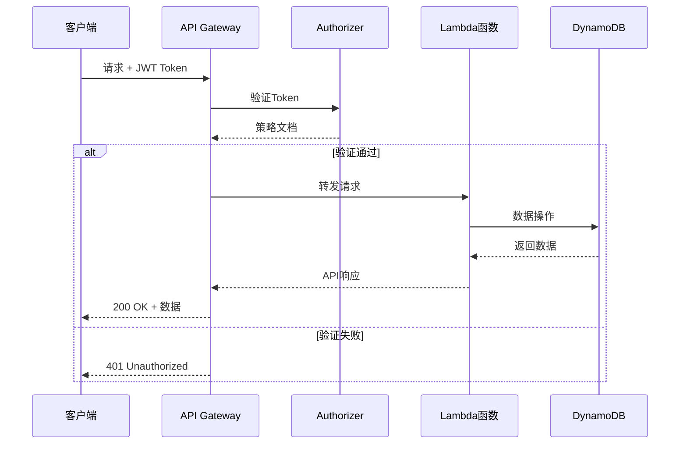

# Project 01: Serverless REST API

> 基于 Lambda 和 API Gateway 的无服务器 API

**难度**: ⭐ 入门  
**预计时间**: 3-4小时  
**成本**: 免费额度内

---

## 🎯 项目目标

- 掌握 Lambda + API Gateway 集成
- 实现 CRUD 操作
- 使用 DynamoDB 存储数据
- 实现 JWT 认证

---

## 🏗️ 架构图

### 系统架构

```mermaid
flowchart TB
    subgraph Client["客户端"]
        Web[Web应用]
        Mobile[移动端]
        CLI[CLI工具]
    end
    
    subgraph APILayer["API层"]
        APIGW[API Gateway]
        Authorizer[Lambda Authorizer]
    end
    
    subgraph Compute["计算层"]
        GetItem[GET /items]
        PostItem[POST /items]
        PutItem[PUT /items/{id}]
        DeleteItem[DELETE /items/{id}]
    end
    
    subgraph Data["数据层"]
        DynamoDB[(DynamoDB)]
    end
    
    Client --> APIGW
    APIGW --> Authorizer
    Authorizer --> GetItem
    Authorizer --> PostItem
    Authorizer --> PutItem
    Authorizer --> DeleteItem
    
    GetItem --> DynamoDB
    PostItem --> DynamoDB
    PutItem --> DynamoDB
    DeleteItem --> DynamoDB
```

### 请求流程



---

## 📁 项目结构

```
01-serverless-api/
├── src/
│   ├── handlers/
│   │   ├── get_item.py      # 获取单个项目
│   │   ├── get_items.py     # 获取项目列表
│   │   ├── create_item.py   # 创建项目
│   │   ├── update_item.py   # 更新项目
│   │   └── delete_item.py   # 删除项目
│   ├── authorizer.py        # JWT认证
│   ├── utils.py             # 工具函数
│   └── requirements.txt     # 依赖
├── infra/
│   ├── template.yaml        # SAM模板
│   └── swagger.yaml         # API定义
├── tests/
│   ├── test_handlers.py     # 单元测试
│   └── integration_tests.py # 集成测试
├── Makefile                 # 构建脚本
└── README.md               # 项目说明
```

---

## 🚀 快速开始

### 1. 环境准备

```bash
# 安装 AWS SAM CLI
# macOS
brew tap aws/tap
brew install aws-sam-cli

# 验证安装
sam --version

# 配置 AWS 凭证
aws configure
```

### 2. 本地测试

```bash
# 安装依赖
cd src
pip install -r requirements.txt -t .

# 本地启动 API
sam local start-api

# 测试端点
curl http://localhost:3000/items
```

### 3. 部署到 AWS

```bash
# 构建
sam build

# 部署
sam deploy --guided

# 后续部署
sam deploy
```

---

## 💻 核心代码

### Lambda 处理函数

```python
# src/handlers/get_items.py
import json
import boto3
import os
from decimal import Decimal

 dynamodb = boto3.resource('dynamodb')
table = dynamodb.Table(os.environ['TABLE_NAME'])

class DecimalEncoder(json.JSONEncoder):
    def default(self, obj):
        if isinstance(obj, Decimal):
            return str(obj)
        return super().default(obj)

def lambda_handler(event, context):
    try:
        # 获取查询参数
        query_params = event.get('queryStringParameters') or {}
        limit = int(query_params.get('limit', 10))
        
        # 查询 DynamoDB
        response = table.scan(Limit=limit)
        items = response.get('Items', [])
        
        return {
            'statusCode': 200,
            'headers': {
                'Content-Type': 'application/json',
                'Access-Control-Allow-Origin': '*'
            },
            'body': json.dumps({
                'items': items,
                'count': len(items)
            }, cls=DecimalEncoder)
        }
        
    except Exception as e:
        return {
            'statusCode': 500,
            'headers': {
                'Content-Type': 'application/json',
                'Access-Control-Allow-Origin': '*'
            },
            'body': json.dumps({'error': str(e)})
        }
```

### SAM 模板

```yaml
# infra/template.yaml
AWSTemplateFormatVersion: '2010-09-09'
Transform: AWS::Serverless-2016-10-31
Description: Serverless REST API

Globals:
  Function:
    Timeout: 10
    Runtime: python3.11
    MemorySize: 256
    Environment:
      Variables:
        TABLE_NAME: !Ref ItemsTable

Resources:
  # DynamoDB 表
  ItemsTable:
    Type: AWS::DynamoDB::Table
    Properties:
      TableName: ItemsTable
      BillingMode: PAY_PER_REQUEST
      AttributeDefinitions:
        - AttributeName: id
          AttributeType: S
      KeySchema:
        - AttributeName: id
          KeyType: HASH

  # Lambda 函数
  GetItemsFunction:
    Type: AWS::Serverless::Function
    Properties:
      CodeUri: src/
      Handler: handlers.get_items.lambda_handler
      Events:
        GetItems:
          Type: Api
          Properties:
            Path: /items
            Method: get
            RestApiId: !Ref ApiGatewayApi
      Policies:
        - DynamoDBReadPolicy:
            TableName: !Ref ItemsTable

  CreateItemFunction:
    Type: AWS::Serverless::Function
    Properties:
      CodeUri: src/
      Handler: handlers.create_item.lambda_handler
      Events:
        CreateItem:
          Type: Api
          Properties:
            Path: /items
            Method: post
            RestApiId: !Ref ApiGatewayApi
      Policies:
        - DynamoDBCrudPolicy:
            TableName: !Ref ItemsTable

  # API Gateway
  ApiGatewayApi:
    Type: AWS::Serverless::Api
    Properties:
      StageName: prod
      Cors:
        AllowMethods: "'GET,POST,PUT,DELETE,OPTIONS'"
        AllowHeaders: "'Content-Type,X-Amz-Date,Authorization,X-Api-Key'"
        AllowOrigin: "'*'"

Outputs:
  ApiUrl:
    Description: API Gateway endpoint URL
    Value: !Sub 'https://${ApiGatewayApi}.execute-api.${AWS::Region}.amazonaws.com/prod'
```

---

## 📚 学习要点

1. **SAM 框架**: 基础设施即代码
2. **API Gateway**: RESTful API 设计
3. **DynamoDB**: NoSQL 数据建模
4. **IAM 权限**: 最小权限原则
5. **CORS 配置**: 跨域资源共享

---

## 💰 成本估算

| 资源 | 使用量 | 月费用 |
|------|--------|--------|
| Lambda | 100K 请求 | $0.20 |
| API Gateway | 100K 请求 | $3.50 |
| DynamoDB | 按需计费 | ~$0-5 |
| **总计** | | **~$4-9** |

---

## 🧪 测试

```bash
# 运行单元测试
python -m pytest tests/ -v

# 集成测试
curl -X POST https://your-api.execute-api.region.amazonaws.com/prod/items \
  -H "Content-Type: application/json" \
  -d '{"name": "Test Item", "description": "A test item"}'
```

---

## 🔗 下一步

完成本项目后，建议学习：
- [项目2: 容器化微服务](../02-containerized-service/)
- [Lambda 深度解析](../../zh/materials/aws_lambda_deep_dive.md)
