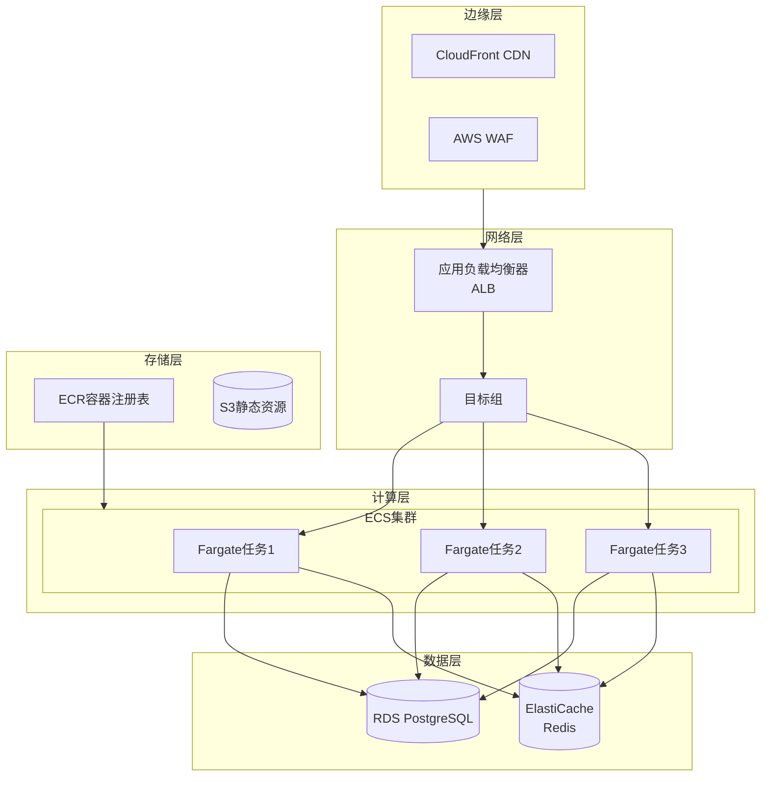
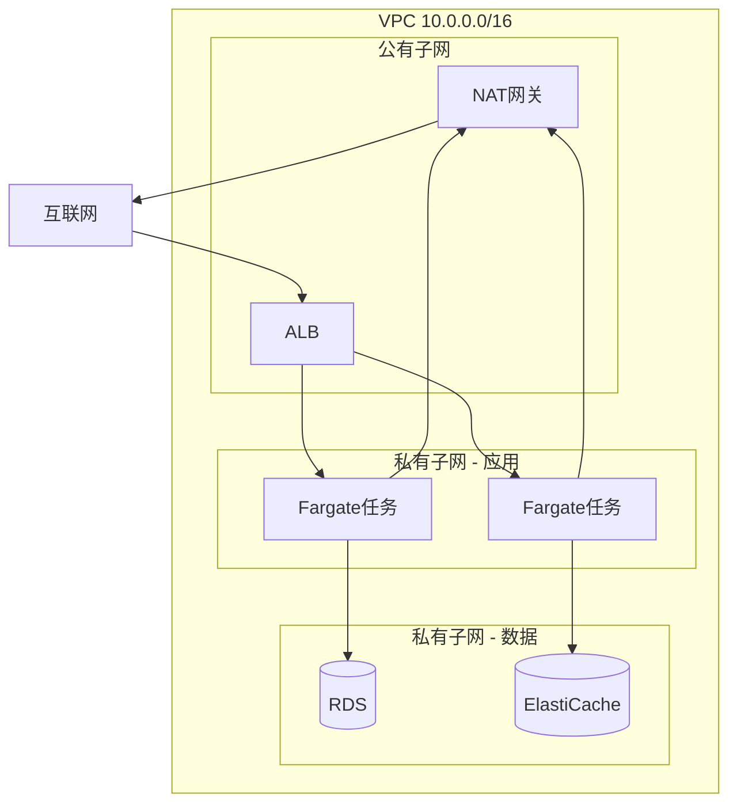

# Project 02: 容器化微服务

> 基于 Fargate 的容器化微服务应用

**难度**: ⭐⭐ 进阶  
**预计时间**: 5-6小时  
**成本**: ~$10-20/月 (测试环境)

---

## 🎯 项目目标

- 掌握 Docker 容器化
- 部署 Fargate 服务
- 配置 ALB 负载均衡
- 实现自动扩展

---

## 🏗️ 架构图

### 系统架构



### 网络架构



---

## 📁 项目结构

```
02-containerized-service/
├── src/
│   ├── app/
│   │   ├── __init__.py
│   │   ├── main.py          # FastAPI应用
│   │   ├── models.py        # 数据模型
│   │   ├── database.py      # 数据库连接
│   │   └── config.py        # 配置管理
│   ├── Dockerfile           # 容器镜像
│   ├── requirements.txt     # Python依赖
│   └── entrypoint.sh        # 启动脚本
├── infra/
│   ├── main.tf              # Terraform主配置
│   ├── vpc.tf               # 网络配置
│   ├── ecs.tf               # ECS/Fargate配置
│   ├── rds.tf               # 数据库配置
│   └── variables.tf         # 变量定义
├── k8s/
│   ├── deployment.yaml      # Kubernetes部署
│   └── service.yaml         # Kubernetes服务
├── tests/
│   └── test_api.py          # API测试
└── README.md
```

---

## 🚀 快速开始

### 1. 构建容器镜像

```bash
# 构建镜像
cd src
docker build -t my-service:latest .

# 本地测试
docker run -p 8080:8080 my-service:latest

# 测试端点
curl http://localhost:8080/health
```

### 2. 推送至 ECR

```bash
# 登录 ECR
aws ecr get-login-password --region us-east-1 | \
  docker login --username AWS --password-stdin account.dkr.ecr.us-east-1.amazonaws.com

# 创建仓库
aws ecr create-repository --repository-name my-service

# 标记镜像
docker tag my-service:latest account.dkr.ecr.us-east-1.amazonaws.com/my-service:latest

# 推送镜像
docker push account.dkr.ecr.us-east-1.amazonaws.com/my-service:latest
```

### 3. Terraform 部署

```bash
cd infra

# 初始化
terraform init

# 查看执行计划
terraform plan

# 部署
terraform apply

# 输出
terraform output alb_dns_name
```

---

## 💻 核心代码

### FastAPI 应用

```python
# src/app/main.py
from fastapi import FastAPI, HTTPException, Depends
from sqlalchemy.orm import Session
from . import models, database

app = FastAPI(title="My Microservice")

# 数据库依赖
def get_db():
    db = database.SessionLocal()
    try:
        yield db
    finally:
        db.close()

@app.get("/health")
def health_check():
    return {"status": "healthy", "version": "1.0.0"}

@app.get("/users/{user_id}")
def get_user(user_id: int, db: Session = Depends(get_db)):
    user = db.query(models.User).filter(models.User.id == user_id).first()
    if not user:
        raise HTTPException(status_code=404, detail="User not found")
    return user

@app.post("/users")
def create_user(user: models.UserCreate, db: Session = Depends(get_db)):
    db_user = models.User(**user.dict())
    db.add(db_user)
    db.commit()
    db.refresh(db_user)
    return db_user
```

### Dockerfile

```dockerfile
# 多阶段构建
FROM python:3.11-slim as builder

WORKDIR /app
COPY requirements.txt .
RUN pip install --user -r requirements.txt

# 生产镜像
FROM python:3.11-slim

WORKDIR /app

# 复制依赖
COPY --from=builder /root/.local /root/.local
COPY . .

# 环境变量
ENV PATH=/root/.local/bin:$PATH
ENV PYTHONDONTWRITEBYTECODE=1
ENV PYTHONUNBUFFERED=1

# 非root用户
RUN useradd -m -u 1000 appuser && chown -R appuser:appuser /app
USER appuser

EXPOSE 8080

CMD ["uvicorn", "app.main:app", "--host", "0.0.0.0", "--port", "8080"]
```

### Terraform 配置

```hcl
# infra/ecs.tf
# ECS 集群
resource "aws_ecs_cluster" "main" {
  name = "microservice-cluster"

  setting {
    name  = "containerInsights"
    value = "enabled"
  }
}

# 任务定义
resource "aws_ecs_task_definition" "app" {
  family                   = "my-service"
  requires_compatibilities = ["FARGATE"]
  network_mode             = "awsvpc"
  cpu                      = "512"
  memory                   = "1024"
  execution_role_arn       = aws_iam_role.ecs_execution.arn
  task_role_arn            = aws_iam_role.ecs_task.arn

  container_definitions = jsonencode([
    {
      name  = "app"
      image = "${aws_ecr_repository.app.repository_url}:latest"
      essential = true
      
      portMappings = [
        {
          containerPort = 8080
          protocol      = "tcp"
        }
      ]
      
      environment = [
        { name = "DATABASE_URL", value = "postgresql://..." },
        { name = "REDIS_URL", value = "redis://..." }
      ]
      
      logConfiguration = {
        logDriver = "awslogs"
        options = {
          awslogs-group         = aws_cloudwatch_log_group.app.name
          awslogs-region        = data.aws_region.current.name
          awslogs-stream-prefix = "ecs"
        }
      }
      
      healthCheck = {
        command     = ["CMD-SHELL", "curl -f http://localhost:8080/health || exit 1"]
        interval    = 30
        timeout     = 5
        retries     = 3
        startPeriod = 60
      }
    }
  ])
}

# ECS 服务
resource "aws_ecs_service" "app" {
  name            = "my-service"
  cluster         = aws_ecs_cluster.main.id
  task_definition = aws_ecs_task_definition.app.arn
  desired_count   = 2
  launch_type     = "FARGATE"

  network_configuration {
    subnets          = aws_subnet.private[*].id
    security_groups  = [aws_security_group.ecs.id]
    assign_public_ip = false
  }

  load_balancer {
    target_group_arn = aws_lb_target_group.app.arn
    container_name   = "app"
    container_port   = 8080
  }

  deployment_circuit_breaker {
    enable   = true
    rollback = true
  }

  depends_on = [aws_lb_listener.https]
}

# 自动扩展
resource "aws_appautoscaling_target" "app" {
  max_capacity       = 10
  min_capacity       = 2
  resource_id        = "service/${aws_ecs_cluster.main.name}/${aws_ecs_service.app.name}"
  scalable_dimension = "ecs:service:DesiredCount"
  service_namespace  = "ecs"
}

resource "aws_appautoscaling_policy" "cpu" {
  name               = "cpu-auto-scaling"
  policy_type        = "TargetTrackingScaling"
  resource_id        = aws_appautoscaling_target.app.resource_id
  scalable_dimension = aws_appautoscaling_target.app.scalable_dimension
  service_namespace  = aws_appautoscaling_target.app.service_namespace

  target_tracking_scaling_policy_configuration {
    predefined_metric_specification {
      predefined_metric_type = "ECSServiceAverageCPUUtilization"
    }
    target_value       = 70.0
    scale_in_cooldown  = 300
    scale_out_cooldown = 60
  }
}
```

---

## 📚 学习要点

1. **Docker**: 容器化最佳实践
2. **FastAPI**: 现代Python Web框架
3. **Terraform**: 基础设施即代码
4. **ECS/Fargate**: 无服务器容器编排
5. **ALB**: 负载均衡配置

---

## 💰 成本估算

| 资源 | 配置 | 月费用 |
|------|------|--------|
| Fargate | 0.5 vCPU, 1GB × 2 | ~$15 |
| ALB | 1个 | ~$16 |
| RDS | db.t3.micro | ~$13 |
| ElastiCache | cache.t3.micro | ~$12 |
| **总计** | | **~$56** |

---

## 🔗 下一步

完成本项目后，建议学习：
- [项目3: 混合架构数据处理](../03-hybrid-data-processing/)
- [Fargate 深度解析](../../zh/materials/aws_fargate_deep_dive.md)
