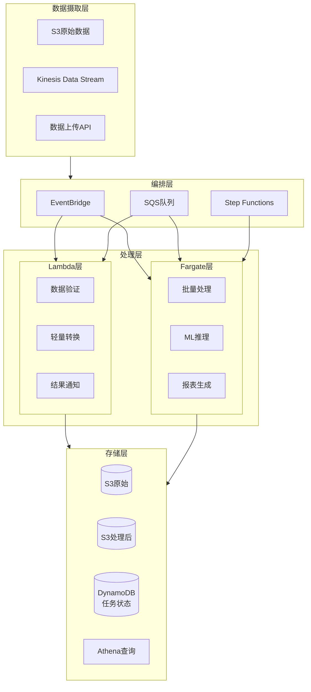
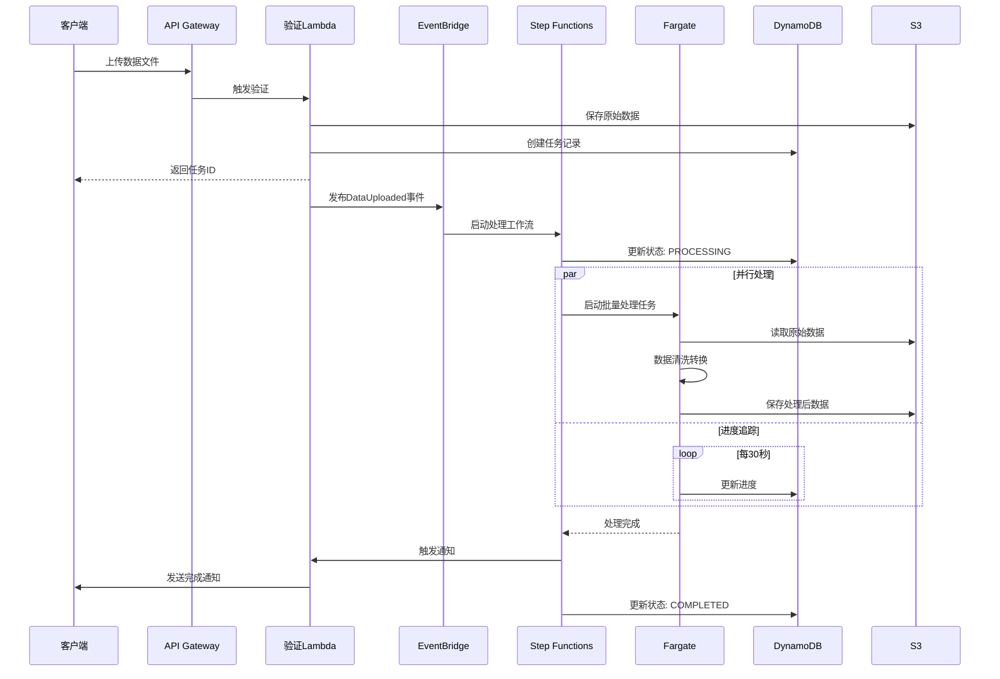
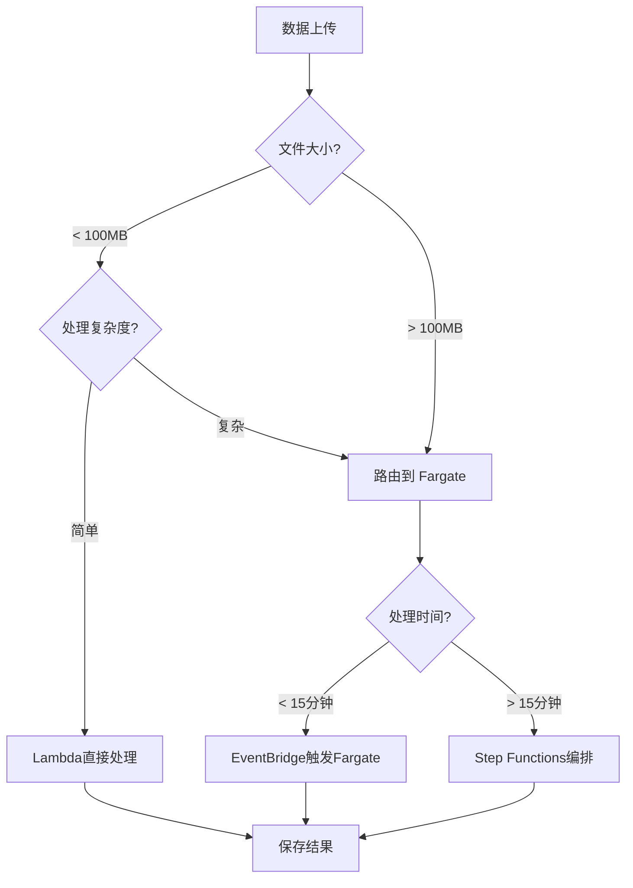

# Project 03: 混合架构数据处理平台

> Lambda + Fargate 混合架构实现大规模数据处理

**难度**: ⭐⭐⭐ 高级  
**预计时间**: 8-10小时  
**成本**: ~$20-50/月 (测试环境，取决于处理量)

---

## 🎯 项目目标

- 设计 Lambda + Fargate 混合架构
- 实现事件驱动的任务分发
- 处理大规模数据集
- 掌握异步工作流编排

---

## 🏗️ 架构图

### 整体架构



### 数据处理流程



### 任务分发决策



---

## 📁 项目结构

```
03-hybrid-data-processing/
├── lambda-src/
│   ├── data-validator/
│   │   ├── index.py
│   │   └── requirements.txt
│   ├── task-notifier/
│   │   └── index.py
│   └── progress-tracker/
│       └── index.py
├── fargate-src/
│   ├── batch-processor/
│   │   ├── Dockerfile
│   │   ├── processor.py
│   │   └── requirements.txt
│   └── ml-inference/
│       ├── Dockerfile
│       ├── model.py
│       └── requirements.txt
├── infra/
│   ├── main.yaml              # SAM主模板
│   ├── stepfunctions/
│   │   └── workflow.asl.json  # 工作流定义
│   └── terraform/
│       ├── main.tf
│       ├── fargate.tf
│       └── vpc.tf
├── docs/
│   ├── architecture.md        # 架构文档
│   └── api-spec.yaml          # API规范
└── README.md
```

---

## 🚀 快速开始

### 1. 部署基础设施

```bash
cd infra

# 部署SAM资源
sam build
sam deploy --guided --stack-name data-processing

# 部署Fargate基础设施
cd terraform
terraform init
terraform apply
```

### 2. 构建和推送容器

```bash
cd fargate-src/batch-processor

# 构建
docker build -t batch-processor .

# 推送
aws ecr get-login-password | docker login --username AWS --password-stdin $ACCOUNT.dkr.ecr.$REGION.amazonaws.com
docker tag batch-processor:latest $ACCOUNT.dkr.ecr.$REGION.amazonaws.com/batch-processor:latest
docker push $ACCOUNT.dkr.ecr.$REGION.amazonaws.com/batch-processor:latest
```

### 3. 测试数据处理

```bash
# 上传测试文件
aws s3 cp sample-data.csv s3://your-bucket/raw/

# 查询任务状态
aws dynamodb get-item \
    --table-name ProcessingTasks \
    --key '{"taskId": {"S": "your-task-id"}}'
```

---

## 💻 核心代码

### Lambda - 数据验证

```python
# lambda-src/data-validator/index.py
import json
import boto3
import uuid
from datetime import datetime

s3 = boto3.client('s3')
dynamodb = boto3.resource('dynamodb')
events = boto3.client('events')

table = dynamodb.Table('ProcessingTasks')

def lambda_handler(event, context):
    """
    验证上传的数据文件并触发处理流程
    """
    # 解析 S3 事件
    bucket = event['Records'][0]['s3']['bucket']['name']
    key = event['Records'][0]['s3']['object']['key']
    size = event['Records'][0]['s3']['object']['size']
    
    task_id = str(uuid.uuid4())
    
    try:
        # 验证文件格式
        if not key.endswith(('.csv', '.json', '.parquet')):
            raise ValueError(f"Unsupported file format: {key}")
        
        # 创建任务记录
        table.put_item(Item={
            'taskId': task_id,
            'status': 'VALIDATED',
            'inputBucket': bucket,
            'inputKey': key,
            'fileSize': size,
            'createdAt': datetime.utcnow().isoformat(),
            'updatedAt': datetime.utcnow().isoformat()
        })
        
        # 发布事件
        events.put_events(
            Entries=[{
                'Source': 'data-processing.service',
                'DetailType': 'Data File Validated',
                'Detail': json.dumps({
                    'taskId': task_id,
                    'bucket': bucket,
                    'key': key,
                    'size': size,
                    'processingType': determine_processing_type(size)
                })
            }]
        )
        
        return {
            'statusCode': 200,
            'body': json.dumps({
                'taskId': task_id,
                'status': 'VALIDATED',
                'message': 'File validated and queued for processing'
            })
        }
        
    except Exception as e:
        table.put_item(Item={
            'taskId': task_id,
            'status': 'FAILED',
            'error': str(e),
            'createdAt': datetime.utcnow().isoformat()
        })
        raise

def determine_processing_type(file_size):
    """根据文件大小决定处理类型"""
    if file_size < 100 * 1024 * 1024:  # < 100MB
        return 'LAMBDA'
    elif file_size < 1024 * 1024 * 1024:  # < 1GB
        return 'FARGATE_SMALL'
    else:
        return 'FARGATE_LARGE'
```

### Fargate - 批量处理器

```python
# fargate-src/batch-processor/processor.py
import os
import json
import boto3
import pandas as pd
from datetime import datetime

s3 = boto3.client('s3')
dynamodb = boto3.resource('dynamodb')

table = dynamodb.Table('ProcessingTasks')

def process_data(task_id, input_bucket, input_key):
    """
    处理数据文件
    """
    try:
        # 更新状态
        update_task_status(task_id, 'PROCESSING', progress=0)
        
        # 下载文件
        local_path = f"/tmp/{os.path.basename(input_key)}"
        s3.download_file(input_bucket, input_key, local_path)
        update_task_status(task_id, 'PROCESSING', progress=10)
        
        # 读取数据
        if input_key.endswith('.csv'):
            df = pd.read_csv(local_path)
        elif input_key.endswith('.json'):
            df = pd.read_json(local_path)
        else:
            raise ValueError(f"Unsupported format: {input_key}")
        
        update_task_status(task_id, 'PROCESSING', progress=30)
        
        # 数据清洗
        df = clean_data(df)
        update_task_status(task_id, 'PROCESSING', progress=50)
        
        # 数据转换
        df = transform_data(df)
        update_task_status(task_id, 'PROCESSING', progress=70)
        
        # 保存结果
        output_key = f"processed/{task_id}/{os.path.basename(input_key)}"
        output_path = f"/tmp/processed_{os.path.basename(input_key)}"
        df.to_parquet(output_path, index=False)
        
        s3.upload_file(output_path, os.environ['OUTPUT_BUCKET'], output_key)
        update_task_status(task_id, 'PROCESSING', progress=90)
        
        # 生成统计信息
        stats = {
            'totalRows': len(df),
            'totalColumns': len(df.columns),
            'processingTime': datetime.utcnow().isoformat()
        }
        
        # 完成
        update_task_status(task_id, 'COMPLETED', progress=100, stats=stats)
        
        return {'status': 'success', 'outputKey': output_key}
        
    except Exception as e:
        update_task_status(task_id, 'FAILED', error=str(e))
        raise

def clean_data(df):
    """数据清洗"""
    # 删除空值
    df = df.dropna()
    # 去重
    df = df.drop_duplicates()
    return df

def transform_data(df):
    """数据转换"""
    # 标准化列名
    df.columns = df.columns.str.lower().str.replace(' ', '_')
    return df

def update_task_status(task_id, status, progress=None, stats=None, error=None):
    """更新任务状态"""
    update_expr = 'SET #status = :status, updatedAt = :updatedAt'
    expr_names = {'#status': 'status'}
    expr_values = {
        ':status': status,
        ':updatedAt': datetime.utcnow().isoformat()
    }
    
    if progress is not None:
        update_expr += ', progress = :progress'
        expr_values[':progress'] = progress
    
    if stats:
        update_expr += ', stats = :stats'
        expr_values[':stats'] = stats
    
    if error:
        update_expr += ', error = :error'
        expr_values[':error'] = error
    
    table.update_item(
        Key={'taskId': task_id},
        UpdateExpression=update_expr,
        ExpressionAttributeNames=expr_names,
        ExpressionAttributeValues=expr_values
    )

if __name__ == '__main__':
    task_id = os.environ['TASK_ID']
    input_bucket = os.environ['INPUT_BUCKET']
    input_key = os.environ['INPUT_KEY']
    
    process_data(task_id, input_bucket, input_key)
```

### Step Functions 工作流

```json
{
  "Comment": "数据处理工作流",
  "StartAt": "DetermineProcessingType",
  "States": {
    "DetermineProcessingType": {
      "Type": "Task",
      "Resource": "arn:aws:lambda:...:function:determine-type",
      "Next": "ProcessingChoice"
    },
    "ProcessingChoice": {
      "Type": "Choice",
      "Choices": [
        {
          "Variable": "$.processingType",
          "StringEquals": "LAMBDA",
          "Next": "LambdaProcessing"
        },
        {
          "Variable": "$.processingType",
          "StringEquals": "FARGATE",
          "Next": "FargateProcessing"
        }
      ],
      "Default": "UnknownProcessingType"
    },
    "LambdaProcessing": {
      "Type": "Task",
      "Resource": "arn:aws:lambda:...:function:process-data",
      "Next": "NotifyCompletion"
    },
    "FargateProcessing": {
      "Type": "Task",
      "Resource": "arn:aws:states:::ecs:runTask.sync",
      "Parameters": {
        "LaunchType": "FARGATE",
        "Cluster": "arn:aws:ecs:...:cluster/processing-cluster",
        "TaskDefinition": "arn:aws:ecs:...:task-definition/batch-processor",
        "NetworkConfiguration": {
          "AwsvpcConfiguration": {
            "Subnets": ["subnet-xxx"],
            "SecurityGroups": ["sg-xxx"],
            "AssignPublicIp": "DISABLED"
          }
        },
        "Overrides": {
          "ContainerOverrides": [{
            "Name": "processor",
            "Environment": [
              {"Name": "TASK_ID", "Value.$": "$.taskId"},
              {"Name": "INPUT_BUCKET", "Value.$": "$.bucket"},
              {"Name": "INPUT_KEY", "Value.$": "$.key"}
            ]
          }]
        }
      },
      "Next": "NotifyCompletion"
    },
    "NotifyCompletion": {
      "Type": "Task",
      "Resource": "arn:aws:lambda:...:function:notifier",
      "End": true
    },
    "UnknownProcessingType": {
      "Type": "Fail",
      "Error": "UnknownProcessingType",
      "Cause": "无法识别的处理类型"
    }
  }
}
```

---

## 📚 学习要点

1. **混合架构设计**: 何时使用 Lambda，何时使用 Fargate
2. **事件驱动**: EventBridge 和 Step Functions 编排
3. **状态管理**: DynamoDB 追踪任务进度
4. **大规模处理**: 分片和并行处理策略
5. **错误处理**: 重试、死信队列、熔断

---

## 💰 成本估算

| 组件 | 用量估算 | 月费用 |
|------|----------|--------|
| Lambda | 100K 调用 | $0.20 |
| Fargate | 100小时 | ~$4.50 |
| Step Functions | 10K 转换 | $0.25 |
| EventBridge | 100K 事件 | $1.00 |
| S3 | 100GB | $2.30 |
| DynamoDB | 按需 | ~$1.00 |
| **总计** | | **~$9.25** |

---

## 🔗 相关资源

- [Lambda 深度解析](../../zh/materials/aws_lambda_deep_dive.md)
- [Fargate 深度解析](../../zh/materials/aws_fargate_deep_dive.md)
- [集成模式](../../zh/materials/lambda_fargate_integration.md)
