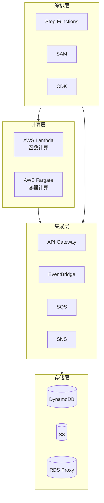

# Serverless 技术资源导航

> AWS 无服务器计算完整学习指南

---

## 📚 资源概览

本主题涵盖 AWS 无服务器计算的核心服务，帮助您构建现代化、可扩展、成本优化的云原生应用。

### 核心技术栈



---

## 📖 文档清单

### 电子书 (ebooks/)

| 文档 | 说明 | 适用场景 |
|------|------|----------|
| `Serverless_Whitepaper.md` | **技术白皮书** - 系统化Serverless指南 | 深度学习、架构设计 |
| `Serverless_Quick_Reference.md` | **速查手册** - 常用命令和配置 | 日常开发、快速查阅 |
| `Serverless_Learning_Roadmap.md` | **学习路线图** - 16周学习计划 | 循序渐进学习 |

### 技术文档 (materials/)

| 文档 | 内容 |
|------|------|
| `aws_lambda_deep_dive.md` | Lambda 深度解析 - 函数计算完全指南 |
| `aws_fargate_deep_dive.md` | Fargate 深度解析 - 容器计算完全指南 |
| `lambda_fargate_integration.md` | Lambda 与 Fargate 集成模式 |

---

## 🚀 快速开始

### 初学者路径

```
第1周: 了解 Serverless 概念
第2周: 第一个 Lambda 函数
第3周: API Gateway 集成
第4周: 事件驱动架构
```

### 进阶路径

```
第5-8周: Fargate 容器化应用
第9-12周: Lambda + Fargate 混合架构
第13-16周: 生产级无服务器应用
```

---

## 💻 实践项目

| 项目 | 难度 | 技术栈 |
|------|------|--------|
| Serverless REST API | ⭐ 入门 | Lambda + API Gateway + DynamoDB |
| 容器化微服务 | ⭐⭐ 进阶 | Fargate + ALB + RDS |
| 混合架构数据处理 | ⭐⭐⭐ 高级 | Lambda + Fargate + SQS + S3 |

---

## 🎯 学习资源

### 官方资源
- [AWS Lambda 文档](https://docs.aws.amazon.com/lambda/)
- [AWS Fargate 文档](https://docs.aws.amazon.com/AmazonECS/latest/userguide/what-is-fargate.html)
- [AWS Serverless 应用库](https://serverlessrepo.aws.amazon.com/)

### 社区资源
- [Serverless Framework](https://www.serverless.com/)
- [AWS SAM](https://docs.aws.amazon.com/serverless-application-model/)
- [AWS CDK](https://docs.aws.amazon.com/cdk/)

---

**开始您的 Serverless 之旅！** 🚀
