# Serverless 学习路线图

> 16周掌握 AWS 无服务器计算

---

## 🗺️ 学习路径总览

```mermaid
flowchart LR
    subgraph Foundation["基础阶段<br/>第1-4周"]
        F1[Serverless概念]
        F2[Lambda基础]
        F3[API Gateway]
        F4[事件驱动]
    end
    
    subgraph Intermediate["进阶阶段<br/>第5-8周"]
        I1[Fargate入门]
        I2[容器化应用]
        I3[服务编排]
        I4[CI/CD]
    end
    
    subgraph Advanced["高级阶段<br/>第9-12周"]
        A1[混合架构]
        A2[性能优化]
        A3[安全实践]
        A4[监控告警]
    end
    
    subgraph Production["生产阶段<br/>第13-16周"]
        P1[成本优化]
        P2[故障排除]
        P3[大规模设计]
        P4[项目实战]
    end
    
    Foundation --> Intermediate --> Advanced --> Production
```



---

## 📅 详细学习计划

### 第一阶段: Serverless 基础 (第1-4周)

#### 第1周: Serverless 概念与 AWS 入门

**学习目标**: 理解 Serverless 核心概念

**学习内容**:
- [ ] 什么是 Serverless 计算
- [ ] Serverless vs 传统服务器
- [ ] AWS Serverless 服务概览
- [ ] 创建 AWS 账户并配置 CLI

**实践任务**:
```bash
# 安装 AWS CLI
pip install awscli
aws configure

# 验证配置
aws sts get-caller-identity
```

**预计时间**: 5-7小时

---

#### 第2周: Lambda 基础

**学习目标**: 掌握 Lambda 核心概念和基本操作

**学习内容**:
- [ ] Lambda 执行模型 (冷启动/热启动)
- [ ] 函数配置 (内存、超时、运行时)
- [ ] 事件源和触发器
- [ ] 环境变量和权限

**实践任务**:
1. 创建第一个 Lambda 函数 (Python)
2. 配置 API Gateway 触发器
3. 测试和查看日志

**代码示例**:
```python
def lambda_handler(event, context):
    return {
        'statusCode': 200,
        'body': 'Hello, Serverless!'
    }
```

**预计时间**: 8-10小时

---

#### 第3周: API Gateway 与 REST API

**学习目标**: 构建完整的 Serverless API

**学习内容**:
- [ ] API Gateway 类型 (REST vs HTTP vs WebSocket)
- [ ] 资源和方法配置
- [ ] 请求/响应映射
- [ ] 认证和授权 (Cognito, IAM, Lambda Authorizer)

**实践任务**:
1. 设计 RESTful API (用户管理)
2. 集成 Lambda 和 DynamoDB
3. 实现 JWT 认证

**项目**: 构建用户注册/登录 API

**预计时间**: 10-12小时

---

#### 第4周: 事件驱动架构

**学习目标**: 理解异步处理和事件驱动模式

**学习内容**:
- [ ] SQS 队列和消息处理
- [ ] SNS 通知服务
- [ ] EventBridge 事件总线
- [ ] 事件模式设计

**实践任务**:
1. 实现 SQS 触发 Lambda
2. 配置 SNS 主题和订阅
3. 使用 EventBridge 编排事件

**架构练习**:
```
S3上传 → EventBridge → Lambda处理 → SNS通知
```

**预计时间**: 8-10小时

---

### 第二阶段: 容器化与 Fargate (第5-8周)

#### 第5周: Docker 基础与 ECS 入门

**学习目标**: 掌握容器化基础

**学习内容**:
- [ ] Docker 核心概念
- [ ] Dockerfile 编写
- [ ] ECS 基础概念 (集群、任务、服务)
- [ ] ECR 容器注册表

**实践任务**:
1. 编写 Dockerfile
2. 构建并推送镜像到 ECR
3. 创建 ECS 集群

**预计时间**: 10-12小时

---

#### 第6周: Fargate 深入

**学习目标**: 掌握 Fargate 无服务器容器

**学习内容**:
- [ ] Fargate vs EC2 启动类型
- [ ] 任务定义详解
- [ ] awsvpc 网络模式
- [ ] 服务发现和负载均衡

**实践任务**:
1. 创建 Fargate 任务定义
2. 部署 Web 应用到 Fargate
3. 配置 ALB 负载均衡

**预计时间**: 10-12小时

---

#### 第7周: 服务编排与扩展

**学习目标**: 实现生产级容器编排

**学习内容**:
- [ ] ECS 服务配置
- [ ] 自动扩展策略
- [ ] 滚动部署和蓝绿部署
- [ ] 容量提供程序 (Capacity Provider)

**实践任务**:
1. 配置 CPU/内存自动扩展
2. 实现滚动更新
3. 使用 Fargate Spot 节省成本

**预计时间**: 8-10小时

---

#### 第8周: CI/CD 与基础设施即代码

**学习目标**: 实现自动化部署

**学习内容**:
- [ ] AWS SAM 框架
- [ ] AWS CDK 基础
- [ ] CodePipeline 和 CodeBuild
- [ ] GitHub Actions 集成

**实践任务**:
1. 使用 SAM 部署 Lambda
2. 使用 CDK 部署 Fargate 服务
3. 配置 CI/CD 流水线

**预计时间**: 10-12小时

---

### 第三阶段: 高级主题 (第9-12周)

#### 第9周: Lambda + Fargate 混合架构

**学习目标**: 设计混合无服务器架构

**学习内容**:
- [ ] Lambda vs Fargate 选择标准
- [ ] 服务间通信模式
- [ ] 事件驱动的任务分发
- [ ] Saga 模式实现

**实践任务**:
1. Lambda 触发 Fargate 任务
2. 实现分布式事务
3. 构建复杂工作流

**架构设计**:
```
API Gateway → Lambda (验证) → EventBridge → Fargate (处理)
```

**预计时间**: 10-12小时

---

#### 第10周: 性能优化

**学习目标**: 优化 Serverless 应用性能

**学习内容**:
- [ ] Lambda 冷启动优化
- [ ] 预置并发配置
- [ ] Fargate 镜像优化
- [ ] 缓存策略

**实践任务**:
1. 使用 Lambda Power Tuning 工具
2. 配置 Provisioned Concurrency
3. 多阶段 Docker 构建

**预计时间**: 8-10小时

---

#### 第11周: 安全最佳实践

**学习目标**: 构建安全的 Serverless 应用

**学习内容**:
- [ ] IAM 最小权限原则
- [ ] VPC 和网络安全
- [ ]  secrets 管理
- [ ] 合规性和审计

**实践任务**:
1. 配置 VPC 网络隔离
2. 使用 Secrets Manager
3. 启用 CloudTrail 审计

**预计时间**: 8-10小时

---

#### 第12周: 监控与可观测性

**学习目标**: 实现全面的应用监控

**学习内容**:
- [ ] CloudWatch 指标和日志
- [ ] X-Ray 分布式追踪
- [ ] Container Insights
- [ ] 自定义指标和告警

**实践任务**:
1. 配置结构化日志
2. 集成 X-Ray 追踪
3. 创建 CloudWatch Dashboard

**预计时间**: 8-10小时

---

### 第四阶段: 生产实践 (第13-16周)

#### 第13周: 成本优化

**学习目标**: 优化 Serverless 成本

**学习内容**:
- [ ] Lambda 定价模型分析
- [ ] Fargate Spot 使用
- [ ] 预留容量和 Savings Plans
- [ ] 成本监控和预算

**实践任务**:
1. 分析 CloudWatch 账单
2. 配置 Fargate Spot
3. 设置预算告警

**预计时间**: 6-8小时

---

#### 第14周: 故障排除与调试

**学习目标**: 掌握问题诊断技能

**学习内容**:
- [ ] 常见错误和解决方案
- [ ] 日志分析技巧
- [ ] 分布式追踪分析
- [ ] 性能瓶颈定位

**实践任务**:
1. 模拟和解决冷启动问题
2. 分析超时错误
3. 调试网络连接问题

**预计时间**: 8-10小时

---

#### 第15周: 大规模设计

**学习目标**: 设计高可用、高并发的 Serverless 应用

**学习内容**:
- [ ] 多区域部署
- [ ] 流量管理和路由
- [ ] 灾难恢复策略
- [ ] 限流和降级

**实践任务**:
1. 设计多可用区架构
2. 配置 Global Accelerator
3. 实现熔断器模式

**预计时间**: 10-12小时

---

#### 第16周: 综合项目实战

**学习目标**: 整合所学知识完成项目

**项目选择**:

**选项A: Serverless 电商平台**
- 用户服务 (Lambda + API Gateway)
- 订单处理 (Lambda + SQS + DynamoDB)
- 库存服务 (Fargate + RDS)
- 报表分析 (Lambda + Athena)

**选项B: 实时数据处理平台**
- 数据摄取 (Kinesis + Lambda)
- 流处理 (Fargate + 自定义应用)
- 数据存储 (S3 + DynamoDB)
- 可视化 (Lambda + QuickSight)

**交付物**:
- [ ] 架构设计文档
- [ ] 完整代码实现
- [ ] CI/CD 流水线
- [ ] 部署文档

**预计时间**: 15-20小时

---

## 📊 进度追踪

复制以下清单追踪学习进度：

### 基础阶段
- [ ] 第1周: Serverless 概念
- [ ] 第2周: Lambda 基础
- [ ] 第3周: API Gateway
- [ ] 第4周: 事件驱动架构

### 进阶阶段
- [ ] 第5周: Docker 与 ECS
- [ ] 第6周: Fargate 深入
- [ ] 第7周: 服务编排
- [ ] 第8周: CI/CD

### 高级阶段
- [ ] 第9周: 混合架构
- [ ] 第10周: 性能优化
- [ ] 第11周: 安全实践
- [ ] 第12周: 监控告警

### 生产阶段
- [ ] 第13周: 成本优化
- [ ] 第14周: 故障排除
- [ ] 第15周: 大规模设计
- [ ] 第16周: 综合项目

---

## 📚 推荐资源

### 官方文档
- [AWS Lambda 文档](https://docs.aws.amazon.com/lambda/)
- [Amazon ECS 文档](https://docs.aws.amazon.com/AmazonECS/latest/developerguide/)
- [AWS SAM 文档](https://docs.aws.amazon.com/serverless-application-model/)

### 在线课程
- AWS Serverless Learning Plan
- A Cloud Guru Serverless Courses
- Udemy AWS Serverless Courses

### 社区资源
- Serverless Framework 文档
- AWS Compute Blog
- AWS Samples GitHub

---

## 🎯 认证准备

完成本路线图后，您可以准备以下认证：

- **AWS Certified Developer - Associate**
- **AWS Certified Solutions Architect - Associate**
- **AWS Certified DevOps Engineer - Professional**

---

*学习计划版本: v1.0*  
*预计总时长: 160-200小时*  
*建议学习节奏: 每周 10-15小时*
