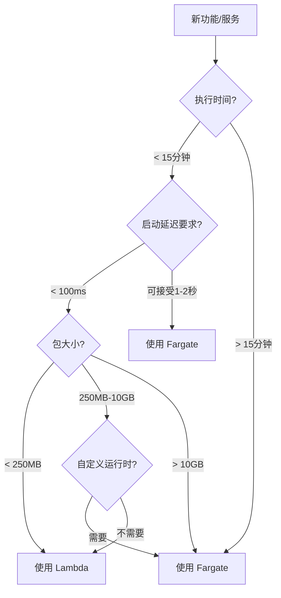

# Serverless 速查手册

> Lambda & Fargate 快速参考指南

---

## 🚀 Lambda 快速参考

### CLI 命令

```bash
# 创建函数
aws lambda create-function \
    --function-name my-function \
    --runtime python3.11 \
    --role arn:aws:iam::account:role/lambda-role \
    --handler lambda_function.lambda_handler \
    --zip-file fileb://function.zip

# 更新代码
aws lambda update-function-code \
    --function-name my-function \
    --zip-file fileb://function.zip

# 调用测试
aws lambda invoke \
    --function-name my-function \
    --payload '{"key": "value"}' \
    response.json

# 查看日志
aws logs tail /aws/lambda/my-function --follow

# 配置预置并发
aws lambda put-provisioned-concurrency-config \
    --function-name my-function \
    --qualifier PROD \
    --provisioned-concurrent-executions 100
```

### 运行时与内存

| 运行时 | 内存范围 | 超时限制 |
|--------|----------|----------|
| Node.js | 128MB - 10GB | 15分钟 |
| Python | 128MB - 10GB | 15分钟 |
| Java | 128MB - 10GB | 15分钟 |
| Go | 128MB - 10GB | 15分钟 |
| .NET | 128MB - 10GB | 15分钟 |

### 内存 vs vCPU

| 内存 | 相对CPU | 适用场景 |
|------|---------|----------|
| 128MB | 0.5x | 简单事件处理 |
| 512MB | 1x | 标准API |
| 1024MB | 2x | 数据处理 |
| 3008MB | 6x | 计算密集 |

### 触发器配置

```yaml
# SAM 模板示例
Events:
  ApiEvent:
    Type: Api
    Properties:
      Path: /users
      Method: post
      
  SQSEvent:
    Type: SQS
    Properties:
      Queue: !GetAtt MyQueue.Arn
      BatchSize: 10
      
  ScheduleEvent:
    Type: Schedule
    Properties:
      Schedule: rate(5 minutes)
      
  S3Event:
    Type: S3
    Properties:
      Bucket: !Ref MyBucket
      Events: s3:ObjectCreated:*
```

### 环境变量与加密

```bash
# 设置环境变量
aws lambda update-function-configuration \
    --function-name my-function \
    --environment Variables={KEY1=value1,KEY2=value2}

# 使用 Secrets Manager
aws lambda update-function-configuration \
    --function-name my-function \
    --environment Variables={DB_SECRET=arn:aws:secretsmanager:...}
```

### 错误处理

```python
def lambda_handler(event, context):
    try:
        result = process(event)
        return {'statusCode': 200, 'body': result}
    except ValueError as e:
        # 客户端错误
        return {'statusCode': 400, 'body': str(e)}
    except Exception as e:
        # 服务器错误 - 会触发重试
        logger.exception("Error")
        raise
```

---

## 🐳 Fargate 快速参考

### CLI 命令

```bash
# 注册任务定义
aws ecs register-task-definition \
    --cli-input-json file://task-definition.json

# 运行任务
aws ecs run-task \
    --cluster my-cluster \
    --task-definition my-task:1 \
    --launch-type FARGATE \
    --network-configuration "awsvpcConfiguration={subnets=[subnet-xxx],securityGroups=[sg-xxx]}"

# 创建服务
aws ecs create-service \
    --cluster my-cluster \
    --service-name my-service \
    --task-definition my-task:1 \
    --desired-count 2 \
    --launch-type FARGATE

# 更新服务
aws ecs update-service \
    --cluster my-cluster \
    --service-name my-service \
    --desired-count 4

# 查看任务日志
aws logs tail /ecs/my-service --follow
```

### 任务定义模板

```json
{
    "family": "web-app",
    "networkMode": "awsvpc",
    "requiresCompatibilities": ["FARGATE"],
    "cpu": "512",
    "memory": "1024",
    "executionRoleArn": "arn:aws:iam::account:role/ecsTaskExecutionRole",
    "containerDefinitions": [
        {
            "name": "app",
            "image": "nginx:latest",
            "essential": true,
            "portMappings": [
                {
                    "containerPort": 80,
                    "protocol": "tcp"
                }
            ],
            "logConfiguration": {
                "logDriver": "awslogs",
                "options": {
                    "awslogs-group": "/ecs/web-app",
                    "awslogs-region": "us-east-1",
                    "awslogs-stream-prefix": "ecs"
                }
            }
        }
    ]
}
```

### 资源配置

| CPU | 内存选项 | 适用场景 |
|-----|----------|----------|
| 256 (.25 vCPU) | 512MB, 1GB, 2GB | 轻量级Web |
| 512 (.5 vCPU) | 1GB - 4GB | 标准应用 |
| 1024 (1 vCPU) | 2GB - 8GB | 中型服务 |
| 2048 (2 vCPU) | 4GB - 16GB | 计算密集 |
| 4096 (4 vCPU) | 8GB - 30GB | 高性能 |

### 定价速查

```
Fargate 价格 (us-east-1):
├── vCPU: $0.04048 / vCPU-hour
├── 内存: $0.004445 / GB-hour
└── 存储: $0.000111 / GB-hour

Fargate Spot 折扣: 最高 70%

示例 (1 vCPU, 2GB, 24x7):
月费用 = (0.04048 + 2×0.004445) × 730 = $36.04
```

---

## 🏗️ 架构决策树



---

## 🔧 常用配置

### IAM 角色

```json
// Lambda 执行角色
{
    "Version": "2012-10-17",
    "Statement": [
        {
            "Effect": "Allow",
            "Action": [
                "logs:CreateLogGroup",
                "logs:CreateLogStream",
                "logs:PutLogEvents"
            ],
            "Resource": "arn:aws:logs:*:*:*"
        }
    ]
}

// Fargate 任务执行角色
{
    "Version": "2012-10-17",
    "Statement": [
        {
            "Effect": "Allow",
            "Action": [
                "ecr:GetAuthorizationToken",
                "ecr:BatchCheckLayerAvailability",
                "ecr:GetDownloadUrlForLayer",
                "ecr:BatchGetImage",
                "logs:CreateLogStream",
                "logs:PutLogEvents"
            ],
            "Resource": "*"
        }
    ]
}
```

### VPC 配置

```bash
# Lambda VPC 配置
aws lambda update-function-configuration \
    --function-name my-function \
    --vpc-config SubnetIds=subnet-xxx,subnet-yyy,SecurityGroupIds=sg-xxx

# Fargate 网络配置
aws ecs run-task \
    --network-configuration "awsvpcConfiguration={subnets=[subnet-xxx],securityGroups=[sg-xxx],assignPublicIp=DISABLED}"
```

---

## 📊 监控指标

### Lambda 关键指标

| 指标 | 告警条件 | 说明 |
|------|----------|------|
| Duration | p99 > 阈值 | 执行时间 |
| Errors | > 0.1% | 错误率 |
| Throttles | > 0 | 限流次数 |
| IteratorAge | > 60s | 流处理延迟 |

### Fargate 关键指标

| 指标 | 告警条件 | 说明 |
|------|----------|------|
| CPUUtilization | > 70% | CPU使用率 |
| MemoryUtilization | > 80% | 内存使用率 |
| RunningTaskCount | < desired | 运行任务数 |

---

## 💰 成本优化清单

- [ ] 使用 Graviton2 架构 (ARM64)
- [ ] Lambda 内存 Power Tuning
- [ ] Fargate Spot 容量提供程序
- [ ] Lambda 预置并发 (有预测流量)
- [ ] 预留实例/Compute Savings Plans
- [ ] 定期清理未使用资源
- [ ] 启用 Cost Explorer 预算告警

---

## 🔗 快速链接

- [Lambda 配额](https://docs.aws.amazon.com/lambda/latest/dg/gettingstarted-limits.html)
- [Fargate 定价](https://aws.amazon.com/fargate/pricing/)
- [SAM 文档](https://docs.aws.amazon.com/serverless-application-model/)
- [CDK 文档](https://docs.aws.amazon.com/cdk/)

---

*最后更新: 2026-03-01*
