# AWS Serverless 技术白皮书

> 构建现代化无服务器应用的完整指南

---

## 目录

> **学习指引**: 本白皮书遵循"概念→技术→实践→优化"的学习路径。建议按顺序阅读，前4章为基础必备，后8章为进阶主题。

1. **[Serverless 概述](#1-serverless-概述)**  
   *建立基础认知：理解 Serverless 核心理念、AWS 服务矩阵和适用场景，为后续技术学习奠定概念基础。*

2. **[Lambda 深度解析](#2-lambda-深度解析)**  
   *掌握核心计算服务：深入学习 Lambda 执行模型、并发管理和权限体系——这是 Serverless 开发的基石。*

3. **[Fargate 深度解析](#3-fargate-深度解析)**  
   *扩展计算选项：对比 Lambda 后，学习容器化的 Fargate，理解何时选择 Serverless 容器而非函数计算。*

4. **[集成与模式](#4-集成与模式)**  
   *构建完整架构：学习 Lambda/Fargate 与事件源、存储、API 的集成方式，掌握异步、流处理、编排等核心模式。*

5. **[Docker 与 Serverless](#5-docker-与-serverless)** 🐳 *新增*  
   *容器化最佳实践：学习 ECR 镜像管理、Lambda 容器运行时、Fargate 容器化部署，统一容器与 Serverless 技术栈。*

6. **[安全最佳实践](#6-安全最佳实践)**  
   *加固你的架构：在前述技术基础上，系统学习 IAM 最小权限、密钥管理、VPC 隔离、层保护等安全策略。*

7. **[性能优化](#7-性能优化)**  
   *提升响应速度：针对冷启动、并发限制、内存配置等痛点，掌握从毫秒级到架构级的性能调优技巧。*

8. **[监控与可观测性](#8-监控与可观测性)**  
   *洞察运行状态：学习 CloudWatch、X-Ray、CloudWatch Logs Insights 的使用，构建完整的 Serverless 可观测体系。*

9. **[高可用架构](#9-高可用架构)** ⭐ *新增*  
   *保障业务连续性：结合前述所有知识，设计多区域容灾、自动故障转移、健康检查等企业级高可用方案。*

10. **[费用优化](#10-费用优化)** ⭐ *新增*  
    *控制云成本：掌握 Lambda、Fargate 的成本模型，学习 Provisioned Concurrency、Graviton2、预留容量等降本策略。*

11. **[生产部署](#11-生产部署)**  
    *安全上线流程：学习 SAM/CDK 部署、CI/CD 流水线、蓝绿部署、金丝雀发布等生产环境必备实践。*

12. **[故障排除](#12-故障排除)**  
    *问题快速定位：汇总常见错误模式、调试技巧、日志分析方法，形成完整的 Serverless 故障处理手册。*

---

## 1. Serverless 概述

### 1.1 什么是 Serverless

Serverless (无服务器) 是一种云计算执行模型，云提供商动态管理计算资源的分配，开发者无需关心服务器管理。

**核心特征**:
- 无服务器管理
- 自动扩展
- 按使用付费
- 事件驱动

### 1.2 AWS Serverless 服务矩阵

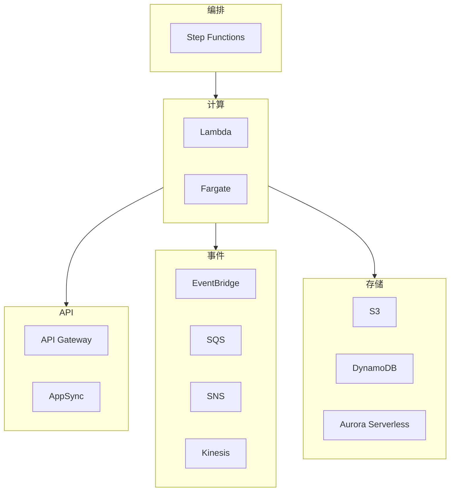

### 1.3 适用场景

| 场景 | 推荐服务 | 原因 |
|------|----------|------|
| REST API | Lambda + API Gateway | 低延迟、自动扩展 |
| 数据处理 | Lambda + SQS | 事件驱动、容错 |
| 长时间任务 | Fargate | 无超时限制 |
| 机器学习 | Fargate/SageMaker | 计算密集 |

---

## 2. Lambda 深度解析

### 2.1 执行模型

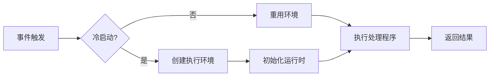

### 2.2 并发管理

```
并发类型:
├── 预留并发 (Reserved)
│   └── 保证函数可用容量
├── 预置并发 (Provisioned)
│   └── 消除冷启动
└── 账户级限制
    └── 默认: 1000 (可提升)
```

### 2.3 最佳实践

1. **初始化优化**
   ```python
   # 全局初始化 - 只执行一次
   import boto3
   dynamodb = boto3.resource('dynamodb')  # 连接复用
   
   def lambda_handler(event, context):
       # 函数逻辑
       pass
   ```

2. **错误处理**
   ```python
   import json
   import logging
   
   logger = logging.getLogger()
   
   def lambda_handler(event, context):
       try:
           result = process_event(event)
           return {'statusCode': 200, 'body': json.dumps(result)}
       except ValueError as e:
           logger.warning(f"Invalid input: {e}")
           return {'statusCode': 400, 'body': json.dumps({'error': str(e)})}
       except Exception as e:
           logger.exception("Unexpected error")
           raise
   ```

---

## 3. Fargate 深度解析

### 3.1 架构组件

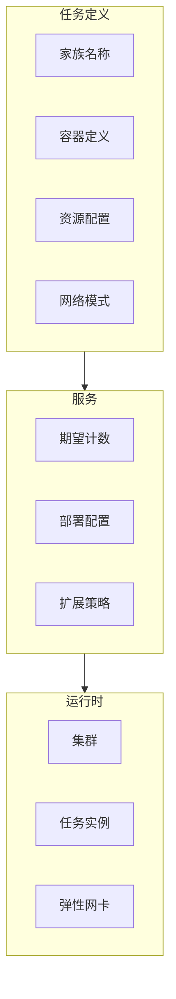

### 3.2 容量提供程序

| 类型 | 价格 | 适用场景 |
|------|------|----------|
| Fargate | $0.04048/vCPU/hr | 关键任务 |
| Fargate Spot | $0.012144/vCPU/hr | 容错工作负载 |

**推荐策略**:
```yaml
CapacityProviderStrategy:
  - Base: 2        # 最少2个On-Demand
    Weight: 1      # 权重比例
    CapacityProvider: FARGATE
  - Weight: 3      # 3倍于On-Demand
    CapacityProvider: FARGATE_SPOT
```

---

## 4. 集成与模式

### 4.1 请求路由决策

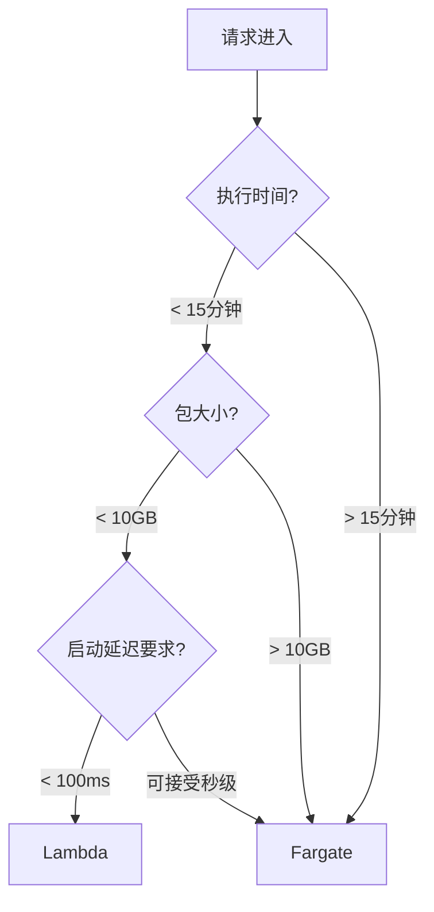

### 4.2 混合架构示例

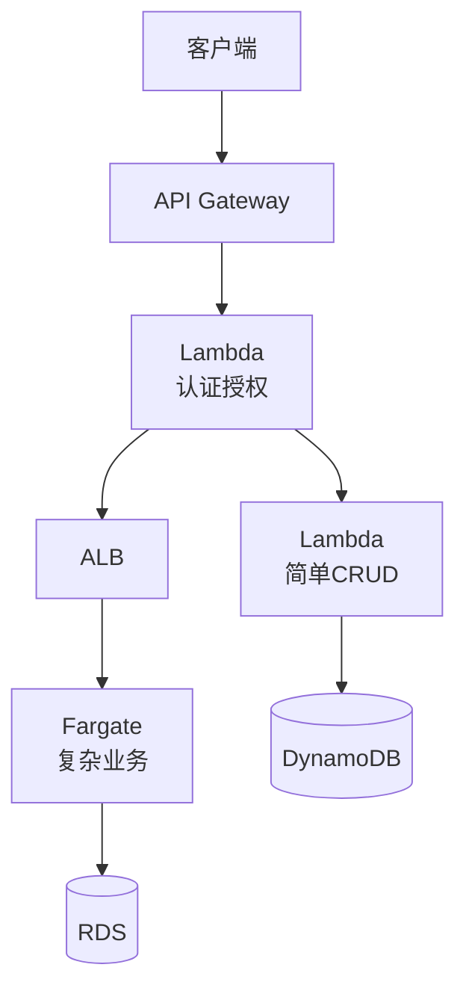

---

## 5. Docker 与 Serverless

### 5.1 Lambda 容器镜像部署

Lambda 支持使用容器镜像打包和部署函数，带来更大的部署包限制（最大 10GB）和更灵活的依赖管理。

```dockerfile
# Lambda 容器镜像 Dockerfile
FROM public.ecr.aws/lambda/python:3.11

# 安装依赖
COPY requirements.txt .
RUN pip install -r requirements.txt

# 复制函数代码
COPY app.py ${LAMBDA_TASK_ROOT}

# 设置处理程序
CMD ["app.handler"]
```

**构建和部署**:

```bash
# 登录 AWS ECR
aws ecr get-login-password --region us-east-1 | \
    docker login --username AWS --password-stdin <account-id>.dkr.ecr.us-east-1.amazonaws.com

# 创建 ECR 仓库
aws ecr create-repository --repository-name lambda-container-demo

# 构建镜像
docker build -t lambda-container-demo .

# 标记镜像
docker tag lambda-container-demo:latest \
    <account-id>.dkr.ecr.us-east-1.amazonaws.com/lambda-container-demo:latest

# 推送镜像
docker push <account-id>.dkr.ecr.us-east-1.amazonaws.com/lambda-container-demo:latest

# 部署 Lambda 函数
aws lambda create-function \
    --function-name container-function \
    --package-type Image \
    --code ImageUri=<account-id>.dkr.ecr.us-east-1.amazonaws.com/lambda-container-demo:latest \
    --role arn:aws:iam::<account-id>:role/lambda-role \
    --timeout 30 \
    --memory-size 512
```

**Lambda 容器镜像优势**:

| 特性 | ZIP 部署 | 容器镜像 |
|------|----------|----------|
| 最大大小 | 250 MB (解压后) | 10 GB |
| 依赖管理 | 复杂 | 标准 Dockerfile |
| 本地测试 | 需要模拟器 | 直接运行容器 |
| CI/CD | 特殊处理 | 标准 Docker 流程 |
| 团队协作 | 困难 | 标准化 |

### 5.2 Fargate 容器最佳实践

Fargate 是 AWS 的 Serverless 容器服务，无需管理服务器即可运行容器。

```dockerfile
# Fargate 优化的 Dockerfile
FROM node:20-alpine AS builder

WORKDIR /app
COPY package*.json ./
RUN npm ci --only=production && npm cache clean --force

FROM node:20-alpine

# 安装安全更新
RUN apk add --no-cache dumb-init ca-certificates && \
    addgroup -g 1000 appgroup && \
    adduser -u 1000 -G appgroup -s /bin/sh -D appuser

WORKDIR /app

# 从构建阶段复制
COPY --from=builder --chown=appuser:appgroup /app/node_modules ./node_modules
COPY --from=builder --chown=appuser:appgroup /app/package*.json ./
COPY --chown=appuser:appgroup . .

USER appuser

EXPOSE 8080

# 使用 dumb-init 处理信号
ENTRYPOINT ["dumb-init", "--"]
CMD ["node", "server.js"]
```

**ECS Task Definition with Docker**:

```json
{
  "family": "fargate-web-app",
  "networkMode": "awsvpc",
  "requiresCompatibilities": ["FARGATE"],
  "cpu": "512",
  "memory": "1024",
  "executionRoleArn": "arn:aws:iam::123456789:role/ecsTaskExecutionRole",
  "taskRoleArn": "arn:aws:iam::123456789:role/ecsTaskRole",
  "containerDefinitions": [
    {
      "name": "web",
      "image": "123456789.dkr.ecr.us-east-1.amazonaws.com/myapp:v1.0.0",
      "essential": true,
      "portMappings": [
        {
          "containerPort": 8080,
          "protocol": "tcp"
        }
      ],
      "environment": [
        {"name": "NODE_ENV", "value": "production"}
      ],
      "secrets": [
        {
          "name": "DATABASE_URL",
          "valueFrom": "arn:aws:secretsmanager:us-east-1:123456789:secret:db-url"
        }
      ],
      "logConfiguration": {
        "logDriver": "awslogs",
        "options": {
          "awslogs-group": "/ecs/fargate-web",
          "awslogs-region": "us-east-1",
          "awslogs-stream-prefix": "web"
        }
      },
      "healthCheck": {
        "command": ["CMD-SHELL", "curl -f http://localhost:8080/health || exit 1"],
        "interval": 30,
        "timeout": 5,
        "retries": 3,
        "startPeriod": 60
      }
    }
  ]
}
```

### 5.3 本地开发环境 (Docker Compose)

使用 Docker Compose 模拟 Serverless 环境进行本地开发。

```yaml
# docker-compose.serverless.yml
version: '3.8'

services:
  # Lambda 本地模拟
  lambda-local:
    build:
      context: ./lambda-functions
      dockerfile: Dockerfile
    ports:
      - "9000:8080"
    environment:
      - AWS_REGION=us-east-1
      - AWS_ACCESS_KEY_ID=test
      - AWS_SECRET_ACCESS_KEY=test
      - DYNAMODB_ENDPOINT=http://dynamodb-local:8000
    volumes:
      - ./lambda-functions:/var/task
    depends_on:
      - dynamodb-local

  # DynamoDB 本地
  dynamodb-local:
    image: amazon/dynamodb-local:latest
    ports:
      - "8000:8000"
    command: "-jar DynamoDBLocal.jar -sharedDb"

  # S3 本地 (MinIO)
  minio:
    image: minio/minio:latest
    ports:
      - "9001:9001"
      - "9002:9002"
    environment:
      MINIO_ROOT_USER: minioadmin
      MINIO_ROOT_USER: minioadmin
    command: server /data --console-address ":9002"
    volumes:
      - minio_data:/data

  # API Gateway 模拟
  api-gateway:
    image: nginx:alpine
    ports:
      - "8080:80"
    volumes:
      - ./nginx.conf:/etc/nginx/nginx.conf:ro
    depends_on:
      - lambda-local

volumes:
  minio_data:
```

**本地 Lambda 测试**:

```bash
# 启动本地环境
docker-compose -f docker-compose.serverless.yml up

# 调用 Lambda 函数
curl -XPOST "http://localhost:9000/2015-03-31/functions/function/invocations" \
    -d '{"key": "value"}'
```

### 5.4 AWS 服务与 Docker 集成实战

#### 5.4.1 App Runner 快速容器部署

AWS App Runner 是最简单的方式将容器化应用部署到 AWS，无需管理基础设施。

```yaml
# apprunner.yaml
version: 1.0
runtime: python3 
build:
  commands:
    build:
      - pip install -r requirements.txt
run:
  command: python app.py
  network:
    port: 8080
    env: PORT
  secrets:
    - name: DATABASE_URL
      value-from: arn:aws:secretsmanager:us-east-1:123456789:secret:db-url
```

**使用 ECR 镜像部署**:

```bash
# 创建 App Runner 服务
aws apprunner create-service \
  --service-name my-container-service \
  --source-configuration '{
    "ImageRepository": {
      "ImageIdentifier": "123456789.dkr.ecr.us-east-1.amazonaws.com/myapp:latest",
      "ImageRepositoryType": "ECR",
      "ImageConfiguration": {
        "Port": "8080",
        "RuntimeEnvironmentVariables": {
          "ENV": "production"
        }
      }
    },
    "AutoDeploymentsEnabled": true
  }' \
  --instance-configuration '{
    "Cpu": "1 vCPU",
    "Memory": "2 GB"
  }'
```

#### 5.4.2 Lambda 与 ECR 集成模式

**多函数共享基础镜像**:

```dockerfile
# 基础镜像 (Dockerfile.base)
FROM public.ecr.aws/lambda/python:3.11

# 安装共同依赖
RUN pip install aws-xray-sdk boto3 aws-lambda-powertools

# 保存为基础镜像
# docker build -f Dockerfile.base -t my-lambda-base:latest .
# docker tag my-lambda-base:latest 123456789.dkr.ecr.us-east-1.amazonaws.com/lambda-base:latest
# docker push 123456789.dkr.ecr.us-east-1.amazonaws.com/lambda-base:latest
```

```dockerfile
# 函数专用镜像 (Dockerfile.function)
FROM 123456789.dkr.ecr.us-east-1.amazonaws.com/lambda-base:latest

# 安装函数特定依赖
COPY requirements.txt .
RUN pip install -r requirements.txt

COPY app.py ${LAMBDA_TASK_ROOT}
CMD ["app.handler"]
```

**Lambda + Docker + Step Functions 工作流**:

```python
# 数据处理工作流 - 使用容器镜像 Lambda
import json
import boto3

s3 = boto3.client('s3')
dynamodb = boto3.resource('dynamodb')

def extract_handler(event, context):
    """从 S3 提取数据 - 容器镜像 Lambda"""
    bucket = event['bucket']
    key = event['key']
    
    # 大文件处理 (利用容器 10GB 限制)
    response = s3.get_object(Bucket=bucket, Key=key)
    data = response['Body'].read()
    
    return {
        'statusCode': 200,
        'data_size': len(data),
        'output_key': f'processed/{key}'
    }

def transform_handler(event, context):
    """数据转换 - 使用 pandas/numpy (容器支持大依赖)"""
    import pandas as pd
    import numpy as np
    
    # 复杂数据处理
    df = pd.read_parquet(f"/tmp/{event['output_key']}")
    df['processed'] = True
    
    return {
        'records_processed': len(df),
        'output_path': f"/tmp/transformed_{event['output_key']}"
    }

def load_handler(event, context):
    """加载到 DynamoDB"""
    table = dynamodb.Table('processed_data')
    
    # 批量写入
    with table.batch_writer() as batch:
        for item in event['data']:
            batch.put_item(Item=item)
    
    return {'loaded_count': len(event['data'])}
```

#### 5.4.3 Fargate 与 AWS 服务深度集成

**Fargate + Secrets Manager + Parameter Store**:

```json
{
  "family": "secure-fargate-app",
  "networkMode": "awsvpc",
  "requiresCompatibilities": ["FARGATE"],
  "executionRoleArn": "arn:aws:iam::123456789:role/ecsTaskExecutionRole",
  "taskRoleArn": "arn:aws:iam::123456789:role/ecsTaskRole",
  "containerDefinitions": [
    {
      "name": "app",
      "image": "123456789.dkr.ecr.us-east-1.amazonaws.com/secure-app:v1",
      "secrets": [
        {
          "name": "DB_PASSWORD",
          "valueFrom": "arn:aws:secretsmanager:us-east-1:123456789:secret:db-password"
        },
        {
          "name": "API_KEY",
          "valueFrom": "arn:aws:ssm:us-east-1:123456789:parameter/prod/api-key"
        }
      ],
      "environment": [
        {"name": "AWS_REGION", "value": "us-east-1"},
        {"name": "LOG_LEVEL", "value": "info"}
      ],
      "mountPoints": [
        {
          "sourceVolume": "efs-storage",
          "containerPath": "/app/data"
        }
      ],
      "logConfiguration": {
        "logDriver": "awslogs",
        "options": {
          "awslogs-group": "/ecs/fargate-app",
          "awslogs-region": "us-east-1",
          "awslogs-stream-prefix": "app"
        }
      }
    }
  ],
  "volumes": [
    {
      "name": "efs-storage",
      "efsVolumeConfiguration": {
        "fileSystemId": "fs-12345678",
        "transitEncryption": "ENABLED",
        "authorizationConfig": {
          "accessPointId": "fsap-12345678",
          "iam": "ENABLED"
        }
      }
    }
  ]
}
```

**Fargate + EventBridge 定时任务**:

```yaml
# 定时报告生成任务
Resources:
  ScheduledTask:
    Type: AWS::Events::Rule
    Properties:
      Name: daily-report-generator
      ScheduleExpression: cron(0 2 * * ? *)  # 每天凌晨2点
      Targets:
        - Id: FargateTask
          Arn: !Sub arn:aws:ecs:${AWS::Region}:${AWS::AccountId}:cluster/${ClusterName}
          RoleArn: !GetAtt EventBridgeRole.Arn
          EcsParameters:
            TaskDefinitionArn: !Ref ReportGeneratorTaskDef
            TaskCount: 1
            LaunchType: FARGATE
            NetworkConfiguration:
              AwsVpcConfiguration:
                Subnets: !Ref PrivateSubnets
                SecurityGroups: [!Ref TaskSecurityGroup]
                AssignPublicIp: DISABLED
```

#### 5.4.4 ECS Blue/Green 部署与 CodeDeploy

```json
{
  "applicationName": "my-container-app",
  "deploymentGroupName": "blue-green-dg",
  "deploymentConfigName": "CodeDeployDefault.ECSAllAtOnce",
  "serviceRoleArn": "arn:aws:iam::123456789:role/CodeDeployRole",
  "blueGreenDeploymentConfiguration": {
    "terminateBlueInstancesOnDeploymentSuccess": {
      "action": "TERMINATE",
      "terminationWaitTimeInMinutes": 30
    },
    "deploymentReadyOption": {
      "actionOnTimeout": "CONTINUE_DEPLOYMENT",
      "waitTimeInMinutes": 0
    }
  },
  "deploymentStyle": {
    "deploymentType": "BLUE_GREEN",
    "deploymentOption": "WITH_TRAFFIC_CONTROL"
  },
  "ecsServices": [
    {
      "serviceName": "my-service",
      "clusterName": "my-cluster"
    }
  ],
  "targetGroupPairInfoList": [
    {
      "targetGroups": [
        {"name": "blue-tg"},
        {"name": "green-tg"}
      ],
      "prodTrafficRoute": {
        "listenerArns": ["arn:aws:elasticloadbalancing:...:listener/app/alb/..."]
      }
    }
  ]
}
```

### 5.5 CI/CD 中的 Docker 集成

```yaml
# .github/workflows/serverless-docker.yml
name: Serverless Docker Pipeline

on:
  push:
    branches: [main]

env:
  AWS_REGION: us-east-1
  ECR_REPOSITORY: serverless-functions

jobs:
  build-and-deploy:
    runs-on: ubuntu-latest
    permissions:
      id-token: write
      contents: read
    
    steps:
    - uses: actions/checkout@v4

    - name: Configure AWS Credentials
      uses: aws-actions/configure-aws-credentials@v4
      with:
        role-to-assume: arn:aws:iam::123456789:role/github-actions-role
        aws-region: ${{ env.AWS_REGION }}

    - name: Login to Amazon ECR
      id: login-ecr
      uses: aws-actions/amazon-ecr-login@v2

    - name: Build, tag, and push image
      env:
        ECR_REGISTRY: ${{ steps.login-ecr.outputs.registry }}
        IMAGE_TAG: ${{ github.sha }}
      run: |
        docker build -t $ECR_REGISTRY/$ECR_REPOSITORY:$IMAGE_TAG .
        docker push $ECR_REGISTRY/$ECR_REPOSITORY:$IMAGE_TAG
        echo "image=$ECR_REGISTRY/$ECR_REPOSITORY:$IMAGE_TAG" >> $GITHUB_OUTPUT

    - name: Deploy to Lambda
      run: |
        aws lambda update-function-code \
          --function-name my-container-function \
          --image-uri ${{ steps.login-ecr.outputs.registry }}/$ECR_REPOSITORY:${{ github.sha }}

    - name: Run DB migrations (Fargate)
      run: |
        aws ecs run-task \
          --cluster production \
          --launch-type FARGATE \
          --task-definition migration-task \
          --network-configuration "awsvpcConfiguration={subnets=[subnet-xxx],securityGroups=[sg-xxx],assignPublicIp=ENABLED}"
```

### 5.5 Docker 安全最佳实践

```dockerfile
# Serverless 容器安全 Dockerfile
FROM python:3.11-slim-bookworm

# 创建非 root 用户
RUN groupadd -r appuser && useradd -r -g appuser appuser

# 安装安全更新
RUN apt-get update && apt-get install -y --no-install-recommends \
    ca-certificates \
    && rm -rf /var/lib/apt/lists/*

WORKDIR /app

# 只复制必要的文件
COPY --chown=appuser:appuser requirements.txt .
RUN pip install --no-cache-dir -r requirements.txt

COPY --chown=appuser:appuser app.py .

# 切换到非 root 用户
USER appuser

# 健康检查
HEALTHCHECK --interval=30s --timeout=5s --start-period=5s --retries=3 \
    CMD python -c "import urllib.request; urllib.request.urlopen('http://localhost:8080/health')" || exit 1

EXPOSE 8080

CMD ["python", "app.py"]
```

**容器扫描集成**:

```yaml
# 在 CI 中添加安全扫描
- name: Scan image with Trivy
  uses: aquasecurity/trivy-action@master
  with:
    image-ref: '${{ steps.login-ecr.outputs.registry }}/${{ env.ECR_REPOSITORY }}:${{ github.sha }}'
    format: 'sarif'
    output: 'trivy-results.sarif'

- name: Upload scan results
  uses: github/codeql-action/upload-sarif@v2
  with:
    sarif_file: 'trivy-results.sarif'
```

---

## 6. 安全最佳实践

### 6.1 IAM 最小权限

```json
{
    "Version": "2012-10-17",
    "Statement": [
        {
            "Effect": "Allow",
            "Action": [
                "dynamodb:GetItem",
                "dynamodb:PutItem"
            ],
            "Resource": "arn:aws:dynamodb:*:*:table/SpecificTable"
        }
    ]
}
```

### 5.2 VPC 配置

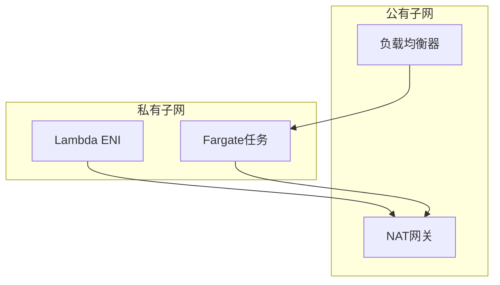

---

## 7. 性能优化

### 7.1 Lambda 优化

| 优化项 | 方法 | 效果 |
|--------|------|------|
| 冷启动 | 预置并发 | 消除冷启动 |
| 内存 | Power Tuning | 找到最佳性价比 |
| 依赖 | Lambda Layer | 减小包大小 |

### 7.2 Fargate 优化

1. **镜像优化**
   - 使用多阶段构建
   - 选择轻量基础镜像 (alpine/distrolles)
   
2. **启动优化**
   - 健康检查快速响应
   - 延迟加载非关键依赖

---

## 8. 监控与可观测性

### 8.1 关键指标

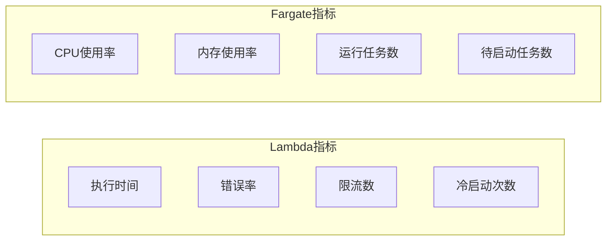

### 8.2 分布式追踪

```python
# X-Ray 集成
from aws_xray_sdk.core import xray_recorder, patch_all
patch_all()

@xray_recorder.capture('process_order')
def process_order(order_id):
    # 业务逻辑
    pass
```

---

## 9. 高可用架构

### 9.1 高可用设计原则

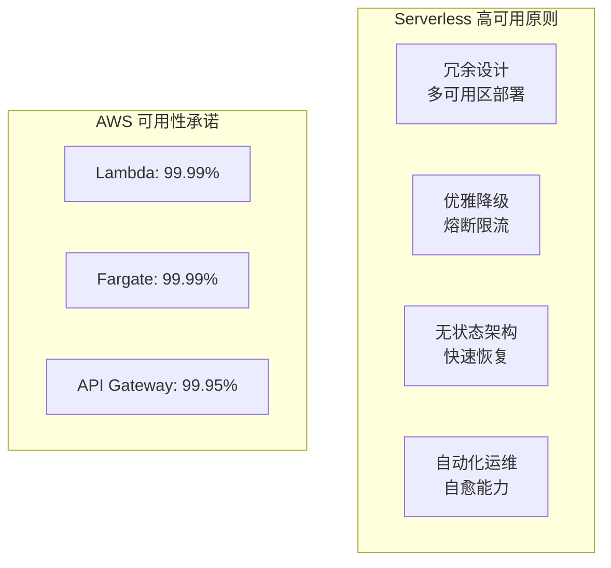

**核心原则**:

| 原则 | 说明 | 实现方式 |
|------|------|----------|
| 多可用区部署 | 跨 AZ 冗余 | 自动分布到 3+ AZ |
| 无状态设计 | 不依赖本地状态 | 外部化会话/缓存 |
| 优雅降级 | 故障时提供有限服务 | 熔断器模式 |
| 快速恢复 | 自动故障转移 | 健康检查 + 自动重启 |

### 9.2 Lambda 高可用策略

#### 8.2.1 并发管理与限流

```python
# 预留并发确保关键函数可用
import boto3

lambda_client = boto3.client('lambda')

# 配置预留并发
lambda_client.put_function_concurrency(
    FunctionName='critical-payment-processor',
    ReservedConcurrentExecutions=100  # 保证100个并发
)

# 配置函数级限流保护
lambda_client.put_provisioned_concurrency_config(
    FunctionName='high-traffic-api',
    Qualifier='prod',
    ProvisionedConcurrentExecutions=50  # 预置并发消除冷启动
)
```

#### 8.2.2 死信队列 (DLQ) 处理失败事件

```yaml
# SAM 模板配置 DLQ
Resources:
  MyFunction:
    Type: AWS::Serverless::Function
    Properties:
      CodeUri: src/
      Handler: app.handler
      Runtime: python3.11
      DeadLetterQueue:
        Type: SQS
        TargetArn: !GetAtt DLQ.Arn
      EventInvokeConfig:
        DestinationConfig:
          OnFailure:
            Destination: !GetAtt FailureTopic.Arn
        MaximumRetryAttempts: 2
        MaximumEventAgeInSeconds: 3600
```

#### 8.2.3 多区域故障转移

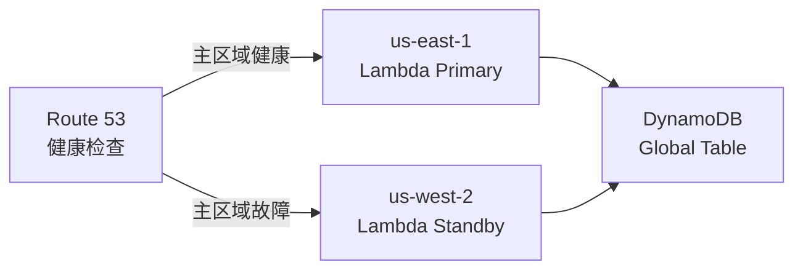

```python
# 多区域 Lambda 健康检查端点
import boto3
import os

REGION = os.environ['AWS_REGION']
PRIMARY_REGION = 'us-east-1'

def health_check(event, context):
    """健康检查处理器"""
    try:
        # 检查依赖服务状态
        dynamodb = boto3.resource('dynamodb')
        table = dynamodb.Table('config')
        table.get_item(Key={'id': 'health'}, ConsistentRead=True)
        
        return {
            'statusCode': 200,
            'body': {
                'status': 'healthy',
                'region': REGION,
                'is_primary': REGION == PRIMARY_REGION
            }
        }
    except Exception as e:
        return {
            'statusCode': 503,
            'body': {'status': 'unhealthy', 'error': str(e)}
        }
```

### 9.3 Fargate 高可用策略

#### 8.3.1 服务级别高可用配置

```json
{
  "family": "high-availability-service",
  "networkMode": "awsvpc",
  "requiresCompatibilities": ["FARGATE"],
  "cpu": "512",
  "memory": "1024",
  "containerDefinitions": [{
    "name": "app",
    "image": "myapp:latest",
    "essential": true,
    "healthCheck": {
      "command": ["CMD-SHELL", "curl -f http://localhost:8080/health || exit 1"],
      "interval": 30,
      "timeout": 5,
      "retries": 3,
      "startPeriod": 60
    },
    "ulimits": [{
      "name": "nofile",
      "softLimit": 65536,
      "hardLimit": 65536
    }]
  }]
}
```

#### 8.3.2 ECS 服务部署配置

```yaml
# Terraform: ECS 服务高可用配置
resource "aws_ecs_service" "app" {
  name            = "high-availability-app"
  cluster         = aws_ecs_cluster.main.id
  task_definition = aws_ecs_task_definition.app.arn
  desired_count   = 3  # 最少3个任务确保可用性
  launch_type     = "FARGATE"

  # 部署配置
  deployment_configuration {
    maximum_percent         = 200
    minimum_healthy_percent = 100  # 确保部署时始终有健康任务
    deployment_circuit_breaker {
      enable   = true
      rollback = true  # 部署失败自动回滚
    }
  }

  # 跨可用区分布
  network_configuration {
    subnets          = [aws_subnet.az1.id, aws_subnet.az2.id, aws_subnet.az3.id]
    security_groups  = [aws_security_group.app.id]
    assign_public_ip = false
  }

  # 负载均衡健康检查
  load_balancer {
    target_group_arn = aws_lb_target_group.app.arn
    container_name   = "app"
    container_port   = 8080
  }

  # 服务自动恢复
  deployment_controller {
    type = "ECS"
  }
}

# 自动扩缩容
resource "aws_appautoscaling_target" "ecs" {
  max_capacity       = 20
  min_capacity       = 3  # 最小3个保持高可用
  resource_id        = "service/${aws_ecs_cluster.main.name}/${aws_ecs_service.app.name}"
  scalable_dimension = "ecs:service:DesiredCount"
  service_namespace  = "ecs"
}
```

#### 8.3.3 容量提供程序高可用策略

```json
{
  "capacityProviders": ["FARGATE", "FARGATE_SPOT"],
  "defaultCapacityProviderStrategy": [
    {
      "base": 2,
      "weight": 1,
      "capacityProvider": "FARGATE"
    },
    {
      "weight": 4,
      "capacityProvider": "FARGATE_SPOT"
    }
  ]
}
```

**策略说明**:
- **FARGATE (Base=2)**: 始终保证2个On-Demand任务，确保核心容量
- **FARGATE_SPOT (Weight=4)**: 弹性使用Spot实例，成本优化同时提供额外容量
- **中断处理**: Spot任务被中断时，Fargate任务继续服务

### 9.4 数据层高可用

#### 8.4.1 DynamoDB 全局表

```yaml
# DynamoDB Global Tables 多区域复制
Resources:
  GlobalTable:
    Type: AWS::DynamoDB::GlobalTable
    Properties:
      TableName: user-sessions
      AttributeDefinitions:
        - AttributeName: userId
          AttributeType: S
      KeySchema:
        - AttributeName: userId
          KeyType: HASH
      BillingMode: PAY_PER_REQUEST
      StreamSpecification:
        StreamViewType: NEW_AND_OLD_IMAGES
      Replicas:
        - Region: us-east-1
          PointInTimeRecoverySpecification:
            PointInTimeRecoveryEnabled: true
        - Region: eu-west-1
          PointInTimeRecoverySpecification:
            PointInTimeRecoveryEnabled: true
        - Region: ap-northeast-1
```

#### 8.4.2 S3 跨区域复制

```json
{
  "Rules": [{
    "ID": "CrossRegionReplication",
    "Status": "Enabled",
    "Priority": 1,
    "DeleteMarkerReplication": { "Status": "Enabled" },
    "Filter": { "Prefix": "" },
    "Destination": {
      "Bucket": "arn:aws:s3:::backup-bucket-west",
      "StorageClass": "STANDARD_IA",
      "ReplicationTime": {
        "Status": "Enabled",
        "Time": { "Minutes": 15 }
      },
      "Metrics": {
        "Status": "Enabled",
        "Minutes": 15
      }
    },
    "SourceSelectionCriteria": {
      "SseKmsEncryptedObjects": { "Status": "Enabled" },
      "ReplicaModifications": { "Status": "Enabled" }
    }
  }]
}
```

### 9.5 故障转移与灾难恢复

#### 8.5.1 Route 53 健康检查与故障转移

```yaml
# Route 53 故障转移路由
Resources:
  PrimaryRecord:
    Type: AWS::Route53::RecordSet
    Properties:
      HostedZoneId: !Ref HostedZone
      Name: api.example.com
      Type: A
      SetIdentifier: Primary
      Failover: PRIMARY
      HealthCheckId: !Ref PrimaryHealthCheck
      AliasTarget:
        DNSName: !GetAtt PrimaryAPI.DomainName
        HostedZoneId: !GetAtt PrimaryAPI.DistributionHostedZoneId

  SecondaryRecord:
    Type: AWS::Route53::RecordSet
    Properties:
      HostedZoneId: !Ref HostedZone
      Name: api.example.com
      Type: A
      SetIdentifier: Secondary
      Failover: SECONDARY
      AliasTarget:
        DNSName: !GetAtt SecondaryAPI.DomainName
        HostedZoneId: !GetAtt SecondaryAPI.DistributionHostedZoneId

  PrimaryHealthCheck:
    Type: AWS::Route53::HealthCheck
    Properties:
      HealthCheckConfig:
        Type: HTTPS
        ResourcePath: /health
        FullyQualifiedDomainName: api-primary.example.com
        Port: 443
        RequestInterval: 30
        FailureThreshold: 3
```

#### 8.5.2 备份与恢复策略

| RTO/RPO | 策略 | 适用场景 |
|---------|------|----------|
| RTO<1h, RPO<5m | 多活架构 + Global Tables | 金融交易 |
| RTO<4h, RPO<1h | 主从复制 + 自动故障转移 | 电商应用 |
| RTO<24h, RPO<24h | 定期备份 + 手动恢复 | 内部工具 |

```python
# AWS Backup 计划
import boto3

backup_client = boto3.client('backup')

# 创建备份计划
backup_plan = backup_client.create_backup_plan(
    BackupPlan={
        'BackupPlanName': 'serverless-critical-backup',
        'Rules': [{
            'RuleName': 'daily-backup',
            'TargetBackupVaultName': 'Default',
            'ScheduleExpression': 'cron(0 5 ? * * *)',  # 每天5点
            'StartWindowMinutes': 480,
            'CompletionWindowMinutes': 10080,
            'Lifecycle': {
                'MoveToColdStorageAfterDays': 30,
                'DeleteAfterDays': 120
            },
            'RecoveryPointTags': {
                'Environment': 'Production'
            }
        }]
    }
)
```

### 9.6 高可用架构模式

#### 8.6.1 多活架构 (Active-Active)

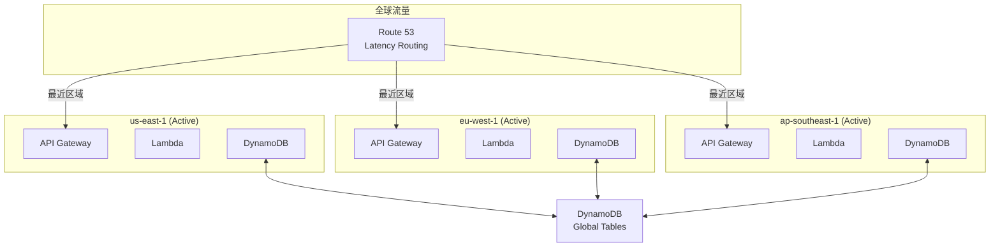

#### 8.6.2 热备架构 (Active-Standby)

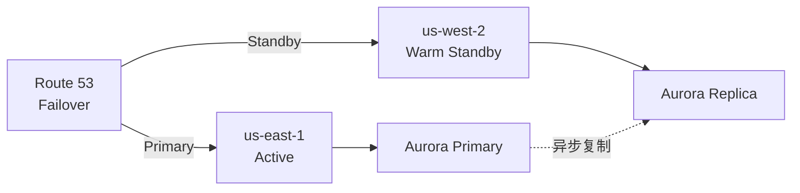

#### 8.6.3 单元化架构 (Cell-Based)

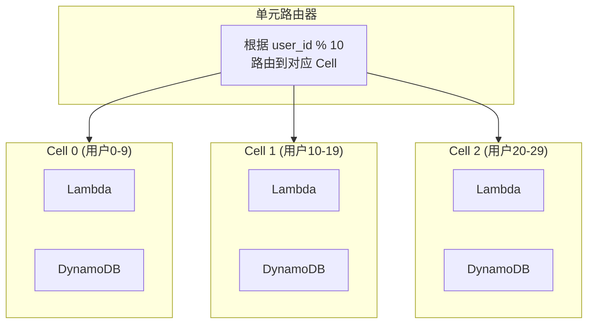

**单元化优势**:
- 故障隔离：单个 Cell 故障只影响部分用户
- 灰度发布：按 Cell 逐步发布
- 容量规划：每个 Cell 有明确容量上限

### 9.7 高可用检查清单

```markdown
## 生产环境高可用检查清单

### Lambda
- [ ] 配置预留并发确保关键路径
- [ ] 设置死信队列处理失败事件
- [ ] 实现幂等性防止重复处理
- [ ] 配置超时和重试策略
- [ ] 启用 X-Ray 分布式追踪

### Fargate
- [ ] 最少 2 个任务分布在不同 AZ
- [ ] 配置健康检查和自动重启
- [ ] 使用滚动部署配置
- [ ] 启用部署断路器自动回滚
- [ ] 配置自动扩缩容策略

### 数据层
- [ ] DynamoDB 启用 Point-in-Time Recovery
- [ ] 关键数据配置跨区域复制
- [ ] S3 启用版本控制和 MFA Delete
- [ ] 定期测试备份恢复流程

### 网络与 DNS
- [ ] Route 53 配置健康检查
- [ ] 配置故障转移路由策略
- [ ] CloudFront 启用故障转移源
- [ ] 多区域 API Gateway 部署
```

---

## 10. 费用优化

### 10.1 Serverless 成本模型深度解析

#### 9.1.1 Lambda 定价详解

```
┌─────────────────────────────────────────────────────────────┐
│                    Lambda 成本构成                          │
├─────────────────────────────────────────────────────────────┤
│  1. 请求费用: $0.20 每 100 万次请求                         │
│                                                             │
│  2. 计算费用: $0.0000166667 每 GB-秒                        │
│     - 计算 = 内存(GB) × 执行时间(秒)                        │
│                                                             │
│  3. 数据传输: 标准 AWS 数据传输费率                         │
│                                                             │
│  4. 预置并发: $0.000004646 每 GB-秒 (空闲时间)              │
└─────────────────────────────────────────────────────────────┘
```

**成本计算示例**:

```python
"""
场景: API 每月处理 1 亿次请求
- 平均执行时间: 200ms
- 内存配置: 512MB (0.5 GB)
- 平均响应大小: 10KB

计算:
1. 请求费用: 100 × $0.20 = $20

2. 计算费用: 
   - 总 GB-秒 = 100,000,000 × 0.2s × 0.5GB = 10,000,000 GB-秒
   - 费用 = 10,000,000 × $0.0000166667 = $166.67

3. 数据传输 (出): 
   - 100,000,000 × 10KB = 1TB
   - 前 10TB: 1000GB × $0.09 = $90

月度总费用: $20 + $166.67 + $90 = $276.67
"""
```

#### 9.1.2 Fargate 定价详解

| 收费项 | Fargate | Fargate Spot | Graviton2 |
|--------|---------|--------------|-----------|
| vCPU/小时 | $0.04048 | $0.012144 (-70%) | $0.03238 (-20%) |
| GB/小时 | $0.004445 | $0.0013335 (-70%) | $0.00356 (-20%) |
| Windows 附加费 | +25% | N/A | N/A |

**成本计算示例**:

```python
"""
场景: 微服务运行 10 个任务
- 每个任务: 1 vCPU, 2GB 内存
- 运行时间: 30天 (720小时)

Fargate 标准费用:
- vCPU: 10 × 720 × $0.04048 = $291.46
- 内存: 10 × 720 × 2 × $0.004445 = $64.01
- 总计: $355.47/月

Fargate Spot (70% 节省):
- vCPU: 10 × 720 × $0.012144 = $87.44
- 内存: 10 × 720 × 2 × $0.0013335 = $19.20
- 总计: $106.64/月 (节省 $248.83)
"""
```

### 10.2 费用优化策略矩阵

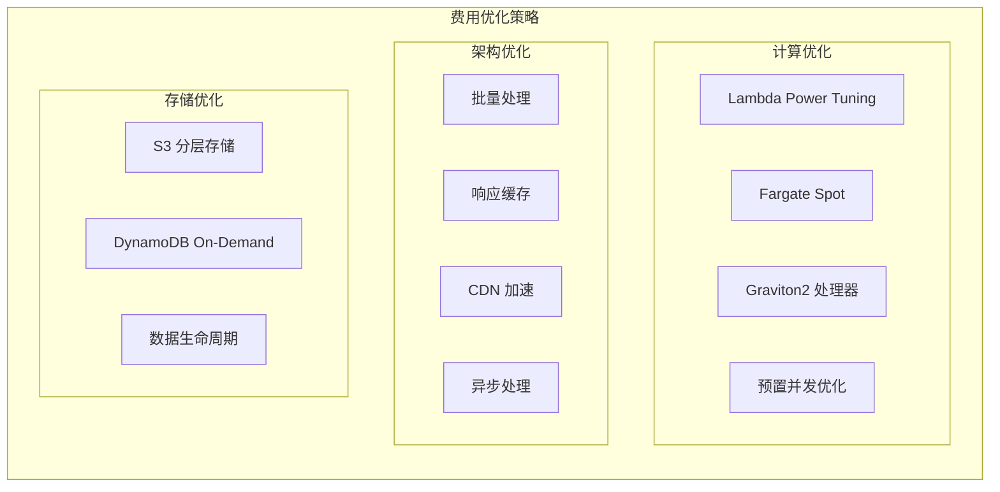

### 10.3 Lambda 费用优化实战

#### 9.3.1 内存 Power Tuning

```python
# 使用 AWS Lambda Power Tuning 工具找到最优内存配置
# https://github.com/alexcasalboni/aws-lambda-power-tuning

import json

power_tuning_config = {
    "lambdaARN": "arn:aws:lambda:us-east-1:123456789:function:my-function",
    "powerValues": [128, 256, 512, 1024, 2048, 3008],
    "num": 50,
    "payload": "{}",
    "parallelInvocation": True,
    "strategy": "cost"  # 或 "speed" / "balanced"
}

"""
典型结果示例:
┌─────────┬──────────┬──────────┬────────────┐
│ Memory  │  Duration│   Cost   │ Optimal    │
├─────────┼──────────┼──────────┼────────────┤
│  128 MB │   3000ms │  $0.0062 │            │
│  256 MB │   1500ms │  $0.0062 │            │
│  512 MB │    800ms │  $0.0067 │            │
│ 1024 MB │    450ms │  $0.0075 │ ⭐ 推荐    │
│ 2048 MB │    400ms │  $0.0133 │            │
└─────────┴──────────┴──────────┴────────────┘
结论: 1024MB 提供最佳性价比
"""
```

#### 9.3.2 批量处理减少调用次数

```python
# ❌ 低效: 每条消息调用一次 Lambda
# 10000 条消息 = 10000 次调用 = $0.002 (仅请求费)

def lambda_handler_single(event, context):
    message = event['Records'][0]  # 只处理一条
    process_message(message)

# ✅ 高效: 批量处理
# 10000 条消息 / 500 批 = 20 次调用 = $0.000004 (请求费可忽略)

def lambda_handler_batch(event, context):
    failed_message_ids = []
    
    for record in event['Records']:
        try:
            process_message(record)
        except Exception as e:
            # 部分批量响应: 只重试失败的消息
            failed_message_ids.append(record['messageId'])
    
    return {
        'batchItemFailures': [
            {'itemIdentifier': msg_id} for msg_id in failed_message_ids
        ]
    }

# SAM 模板配置最大批量大小
# Events:
#   SQSEvent:
#     Type: SQS
#     Properties:
#       Queue: !GetAtt MyQueue.Arn
#       BatchSize: 500  # 最大 10000 条或 6MB
#       MaximumBatchingWindowInSeconds: 5
#       FunctionResponseTypes:
#         - ReportBatchItemFailures
```

#### 9.3.3 响应缓存策略

```python
# Lambda 函数响应缓存
import json
import boto3
import os
from functools import lru_cache

# 本地内存缓存 (同一执行环境内有效)
@lru_cache(maxsize=1000)
def get_user_profile_cached(user_id):
    """缓存用户资料，减少 DynamoDB 调用"""
    dynamodb = boto3.resource('dynamodb')
    table = dynamodb.Table('users')
    return table.get_item(Key={'id': user_id}).get('Item')

# API Gateway 缓存
"""
Resources:
  ApiGatewayApi:
    Type: AWS::Serverless::Api
    Properties:
      StageName: prod
      MethodSettings:
        - ResourcePath: /users/{userId}
          HttpMethod: GET
          CachingEnabled: true
          CacheTtlInSeconds: 300
          CacheDataEncrypted: true
"""

# CloudFront 边缘缓存
"""
CloudFrontDistribution:
  Type: AWS::CloudFront::Distribution
  Properties:
    DistributionConfig:
      DefaultCacheBehavior:
        TTL: 86400  # 1天
        MaxTTL: 31536000  # 1年
        MinTTL: 1
        ViewerProtocolPolicy: redirect-to-https
        CachePolicyId: !Ref CachePolicy
      CachePolicies:
        - CachePolicy:
            DefaultTTL: 86400
            MaxTTL: 31536000
            MinTTL: 1
            Name: API-Cache-Policy
            ParametersInCacheKeyAndForwardedToOrigin:
              EnableAcceptEncodingGzip: true
              HeadersConfig:
                HeaderBehavior: none
              CookiesConfig:
                CookieBehavior: none
              QueryStringsConfig:
                QueryStringBehavior: whitelist
                QueryStrings:
                  - userId
"""
```

### 10.4 Fargate 费用优化实战

#### 9.4.1 Spot 实例混合策略

```yaml
# 智能使用 Spot 实例节省成本
Resources:
  ECSCapacityProvider:
    Type: AWS::ECS::ClusterCapacityProviderAssociations
    Properties:
      Cluster: !Ref ECSCluster
      CapacityProviders:
        - FARGATE
        - FARGATE_SPOT
      DefaultCapacityProviderStrategy:
        # 核心工作负载使用 On-Demand
        - Base: 2
          Weight: 1
          CapacityProvider: FARGATE
        # 弹性工作负载使用 Spot (70% 折扣)
        - Weight: 4
          CapacityProvider: FARGATE_SPOT

  # 任务级别指定容量提供程序
  CriticalService:
    Type: AWS::ECS::Service
    Properties:
      Cluster: !Ref ECSCluster
      TaskDefinition: !Ref CriticalTask
      CapacityProviderStrategy:
        - Base: 1
          Weight: 1
          CapacityProvider: FARGATE  # 关键服务只用 On-Demand

  BatchJobService:
    Type: AWS::ECS::Service
    Properties:
      Cluster: !Ref ECSCluster
      TaskDefinition: !Ref BatchTask
      CapacityProviderStrategy:
        - Weight: 1
          CapacityProvider: FARGATE_SPOT  # 批处理使用 Spot
```

#### 9.4.2 Graviton2 迁移

```dockerfile
# 构建多架构镜像支持 Graviton2
# Dockerfile
FROM --platform=$BUILDPLATFORM python:3.11-slim as builder
WORKDIR /app
COPY requirements.txt .
RUN pip install --user -r requirements.txt

# 生产镜像
FROM python:3.11-slim
WORKDIR /app
COPY --from=builder /root/.local /root/.local
COPY . .
ENV PATH=/root/.local/bin:$PATH
CMD ["python", "app.py"]
```

```bash
# 构建多架构镜像
# 安装 buildx
docker buildx create --use

# 构建并推送多架构镜像
docker buildx build \
  --platform linux/amd64,linux/arm64 \
  -t myapp:latest \
  --push .
```

```json
// 任务定义中使用 Graviton2
{
  "runtimePlatform": {
    "cpuArchitecture": "ARM64",
    "operatingSystemFamily": "LINUX"
  },
  "cpu": "512",
  "memory": "1024"
}
```

#### 9.4.3 任务右缩放 (Right Sizing)

```python
# 使用 CloudWatch 指标自动推荐资源配置
import boto3

def analyze_resource_usage(cluster_name, service_name, days=7):
    """分析历史资源使用，推荐最优配置"""
    cloudwatch = boto3.client('cloudwatch')
    
    # 获取 CPU 使用率
    cpu_response = cloudwatch.get_metric_statistics(
        Namespace='AWS/ECS',
        MetricName='CPUUtilization',
        Dimensions=[
            {'Name': 'ClusterName', 'Value': cluster_name},
            {'Name': 'ServiceName', 'Value': service_name}
        ],
        StartTime=datetime.utcnow() - timedelta(days=days),
        EndTime=datetime.utcnow(),
        Period=3600,
        Statistics=['Average', 'Maximum', 'p99']
    )
    
    # 获取内存使用率
    memory_response = cloudwatch.get_metric_statistics(
        Namespace='AWS/ECS',
        MetricName='MemoryUtilization',
        Dimensions=[
            {'Name': 'ClusterName', 'Value': cluster_name},
            {'Name': 'ServiceName', 'Value': service_name}
        ],
        StartTime=datetime.utcnow() - timedelta(days=days),
        EndTime=datetime.utcnow(),
        Period=3600,
        Statistics=['Average', 'Maximum', 'p99']
    )
    
    # 分析并生成推荐
    cpu_avg = calculate_average(cpu_response['Datapoints'])
    memory_avg = calculate_average(memory_response['Datapoints'])
    
    recommendations = []
    
    if cpu_avg < 20:
        recommendations.append(f"CPU 使用率仅 {cpu_avg:.1f}%，建议减少 vCPU 配置")
    elif cpu_avg > 80:
        recommendations.append(f"CPU 使用率高达 {cpu_avg:.1f}%，建议增加 vCPU 配置")
    
    if memory_avg < 30:
        recommendations.append(f"内存使用率仅 {memory_avg:.1f}%，建议减少内存配置")
    elif memory_avg > 85:
        recommendations.append(f"内存使用率高达 {memory_avg:.1f}%，建议增加内存配置")
    
    return recommendations
```

### 10.5 存储费用优化

#### 9.5.1 S3 智能分层

```python
import boto3

s3 = boto3.client('s3')

# 配置 S3 生命周期策略
def configure_s3_lifecycle(bucket_name):
    lifecycle_policy = {
        'Rules': [
            {
                'ID': 'IntelligentTiering',
                'Status': 'Enabled',
                'Filter': {'Prefix': ''},
                'Transitions': [
                    {
                        'Days': 0,
                        'StorageClass': 'INTELLIGENT_TIERING'
                    }
                ],
                'NoncurrentVersionTransitions': [
                    {
                        'NoncurrentDays': 30,
                        'StorageClass': 'STANDARD_IA'
                    },
                    {
                        'NoncurrentDays': 90,
                        'StorageClass': 'GLACIER'
                    }
                ],
                'NoncurrentVersionExpiration': {
                    'NoncurrentDays': 365
                }
            },
            {
                'ID': 'DeleteIncompleteMultipart',
                'Status': 'Enabled',
                'Filter': {'Prefix': ''},
                'AbortIncompleteMultipartUpload': {
                    'DaysAfterInitiation': 7
                }
            }
        ]
    }
    
    s3.put_bucket_lifecycle_configuration(
        Bucket=bucket_name,
        LifecycleConfiguration=lifecycle_policy
    )

# 启用 S3 智能分层自动归档
s3.put_bucket_intelligent_tiering_configuration(
    Bucket=bucket_name,
    Id='DeepArchiveTiering',
    IntelligentTieringConfiguration={
        'Status': 'Enabled',
        'Tierings': [
            {
                'Days': 90,
                'AccessTier': 'ARCHIVE_ACCESS'
            },
            {
                'Days': 180,
                'AccessTier': 'DEEP_ARCHIVE_ACCESS'
            }
        ]
    }
)
```

#### 9.5.2 DynamoDB 成本优化

```yaml
# 按需 vs 预置容量决策
Resources:
  # 开发/测试环境: 按需计费
  DevTable:
    Type: AWS::DynamoDB::Table
    Properties:
      BillingMode: PAY_PER_REQUEST  # 适合低流量或不确定流量
      
  # 生产环境: 预置容量 + 自动扩展
  ProdTable:
    Type: AWS::DynamoDB::Table
    Properties:
      BillingMode: PROVISIONED
      ProvisionedThroughput:
        ReadCapacityUnits: 100
        WriteCapacityUnits: 50
      
  # 自动扩展配置
  ProdTableReadScaling:
    Type: AWS::ApplicationAutoScaling::ScalableTarget
    Properties:
      MaxCapacity: 4000
      MinCapacity: 100
      ResourceId: !Sub table/${ProdTable}
      ScalableDimension: dynamodb:table:ReadCapacityUnits
      ServiceNamespace: dynamodb
      
  ProdTableReadScalingPolicy:
    Type: AWS::ApplicationAutoScaling::ScalingPolicy
    Properties:
      PolicyName: ReadAutoScaling
      PolicyType: TargetTrackingScaling
      ScalingTargetId: !Ref ProdTableReadScaling
      TargetTrackingScalingPolicyConfiguration:
        TargetValue: 70.0  # CPU 目标利用率
        ScaleInCooldown: 60
        ScaleOutCooldown: 60
        PredefinedMetricSpecification:
          PredefinedMetricType: DynamoDBReadCapacityUtilization
```

#### 9.5.3 数据生命周期管理

```python
# DynamoDB TTL 自动清理过期数据
import boto3
from datetime import datetime, timedelta

def enable_ttl(table_name, ttl_attribute='ttl'):
    """启用 DynamoDB TTL"""
    dynamodb = boto3.client('dynamodb')
    
    dynamodb.update_time_to_live(
        TableName=table_name,
        TimeToLiveSpecification={
            'Enabled': True,
            'AttributeName': ttl_attribute
        }
    )

# 写入数据时设置 TTL
def put_item_with_ttl(table_name, item, days_to_live=30):
    dynamodb = boto3.resource('dynamodb')
    table = dynamodb.Table(table_name)
    
    # 计算过期时间
    ttl = int((datetime.now() + timedelta(days=days_to_live)).timestamp())
    
    item['ttl'] = ttl
    table.put_item(Item=item)
```

### 10.6 网络费用优化

#### 9.6.1 减少数据传输成本

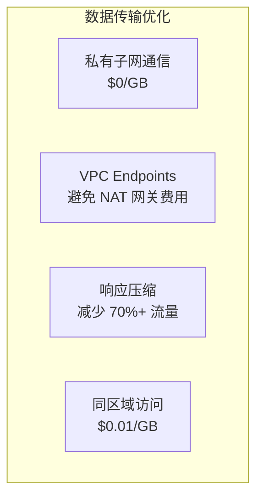

```python
# API Gateway 启用压缩
"""
Resources:
  ApiGateway:
    Type: AWS::Serverless::Api
    Properties:
      Name: compressed-api
      StageName: prod
      Variables:
        MinimumCompressionSize: 1024  # 1KB 以上响应启用压缩
"""

# Lambda 响应压缩
import gzip
import base64

def lambda_handler(event, context):
    body = generate_large_response()
    
    # 检查客户端支持
    accept_encoding = event.get('headers', {}).get('Accept-Encoding', '')
    
    if 'gzip' in accept_encoding:
        compressed = gzip.compress(body.encode('utf-8'))
        return {
            'statusCode': 200,
            'headers': {
                'Content-Type': 'application/json',
                'Content-Encoding': 'gzip'
            },
            'body': base64.b64encode(compressed).decode('utf-8'),
            'isBase64Encoded': True
        }
    
    return {
        'statusCode': 200,
        'body': body
    }
```

#### 9.6.2 VPC Endpoints 节省 NAT 费用

```yaml
# 使用 VPC Endpoints 避免 NAT 网关费用 ($0.045/GB)
Resources:
  # S3 Gateway Endpoint (免费)
  S3Endpoint:
    Type: AWS::EC2::VPCEndpoint
    Properties:
      VpcId: !Ref VPC
      ServiceName: !Sub com.amazonaws.${AWS::Region}.s3
      VpcEndpointType: Gateway
      RouteTableIds:
        - !Ref PrivateRouteTable

  # DynamoDB Gateway Endpoint (免费)
  DynamoDBEndpoint:
    Type: AWS::EC2::VPCEndpoint
    Properties:
      VpcId: !Ref VPC
      ServiceName: !Sub com.amazonaws.${AWS::Region}.dynamodb
      VpcEndpointType: Gateway
      RouteTableIds:
        - !Ref PrivateRouteTable

  # 其他服务使用 Interface Endpoints (按小时计费)
  LambdaEndpoint:
    Type: AWS::EC2::VPCEndpoint
    Properties:
      VpcId: !Ref VPC
      ServiceName: !Sub com.amazonaws.${AWS::Region}.lambda
      VpcEndpointType: Interface
      SubnetIds:
        - !Ref PrivateSubnet1
        - !Ref PrivateSubnet2
      SecurityGroupIds:
        - !Ref EndpointSecurityGroup
      PrivateDnsEnabled: true
```

### 10.7 成本监控与预算

#### 9.7.1 成本分配标签策略

```yaml
# 为所有资源启用成本分配标签
Resources:
  LambdaFunction:
    Type: AWS::Serverless::Function
    Properties:
      FunctionName: my-function
      Tags:
        Environment: production
        Project: user-service
        Team: platform
        CostCenter: engineering
        AutoShutdown: false
        
  ECSCluster:
    Type: AWS::ECS::Cluster
    Properties:
      ClusterName: production-cluster
      Tags:
        - Key: Environment
          Value: production
        - Key: Project
          Value: order-service
        - Key: Team
          Value: backend
```

#### 9.7.2 预算告警

```yaml
# 预算告警配置
Resources:
  MonthlyBudget:
    Type: AWS::Budgets::Budget
    Properties:
      Budget:
        BudgetName: Serverless-Monthly-Budget
        BudgetLimit:
          Amount: 1000
          Unit: USD
        TimeUnit: MONTHLY
        BudgetType: COST
        CostFilters:
          TagKeyValue:
            - user:Environment$production
        CostTypes:
          IncludeTax: true
          IncludeSubscription: true
          UseBlended: false
          
      NotificationsWithSubscribers:
        # 50% 阈值告警
        - Notification:
            NotificationType: ACTUAL
            ComparisonOperator: GREATER_THAN
            Threshold: 50
          Subscribers:
            - SubscriptionType: SNS
              Address: !Ref BudgetAlertTopic
              
        # 80% 阈值告警
        - Notification:
            NotificationType: ACTUAL
            ComparisonOperator: GREATER_THAN
            Threshold: 80
          Subscribers:
            - SubscriptionType: EMAIL
              Address: finance@company.com
            - SubscriptionType: SNS
              Address: !Ref BudgetAlertTopic
              
        # 预测超限告警
        - Notification:
            NotificationType: FORECASTED
            ComparisonOperator: GREATER_THAN
            Threshold: 100
          Subscribers:
            - SubscriptionType: SNS
              Address: !Ref BudgetAlertTopic
```

#### 9.7.3 Cost Explorer 分析

```python
# 使用 Cost Explorer API 分析 Serverless 成本
import boto3
from datetime import datetime, timedelta

def analyze_serverless_costs():
    ce = boto3.client('ce')
    
    # 按服务分组的月度成本
    response = ce.get_cost_and_usage(
        TimePeriod={
            'Start': (datetime.now() - timedelta(days=30)).strftime('%Y-%m-%d'),
            'End': datetime.now().strftime('%Y-%m-%d')
        },
        Granularity='DAILY',
        Metrics=['UnblendedCost', 'UsageQuantity'],
        GroupBy=[
            {'Type': 'DIMENSION', 'Key': 'SERVICE'},
            {'Type': 'TAG', 'Key': 'Environment'}
        ],
        Filter={
            'Dimensions': {
                'Key': 'SERVICE',
                'Values': [
                    'AWS Lambda',
                    'Amazon ECS',
                    'AWS Fargate',
                    'Amazon API Gateway',
                    'Amazon DynamoDB'
                ]
            }
        }
    )
    
    # 生成成本报告
    print("=" * 60)
    print("Serverless 成本分析 (最近 30 天)")
    print("=" * 60)
    
    for group in response['ResultsByTime']:
        date = group['TimePeriod']['Start']
        for result in group['Groups']:
            service = result['Keys'][0]
            cost = float(result['Metrics']['UnblendedCost']['Amount'])
            print(f"{date}: {service}: ${cost:.2f}")
    
    return response
```

### 10.8 成本优化案例研究

#### 案例 1: API 服务成本优化 (节省 85%)

```markdown
## 背景
- 电商 API，月调用量: 5 亿次
- 原始架构: Lambda + API Gateway + DynamoDB
- 原始月成本: ~$4,500

## 优化措施
1. Lambda Power Tuning: 128MB → 512MB (实际成本降低 30%)
2. API Gateway 缓存: 命中率 60%，减少 Lambda 调用
3. DynamoDB DAX 缓存: 读操作减少 80%
4. CloudFront 边缘缓存: 静态响应缓存 24h
5. 批量处理 SQS 消息: BatchSize 10 → 100

## 结果
- 优化后月成本: ~$680
- 节省: 85%
- 响应延迟: 降低 40%
```

#### 案例 2: 数据处理管道优化 (节省 92%)

```markdown
## 背景
- 日志处理管道，日均 10TB 数据
- 原始架构: Fargate 常驻任务处理
- 原始月成本: ~$12,000

## 优化措施
1. Fargate → Lambda 转换: 短时任务使用 Lambda
2. Fargate Spot: 容错任务使用 Spot (70% 节省)
3. Graviton2 迁移: ARM 架构 (20% 节省)
4. S3 Intelligent-Tiering: 自动分层存储
5. 数据压缩: Gzip 压缩减少 80% 存储

## 结果
- 优化后月成本: ~$960
- 节省: 92%
- 处理速度: 提升 2x
```

### 10.9 成本优化检查清单

```markdown
## Serverless 成本优化检查清单

### Lambda 优化
- [ ] 使用 Power Tuning 找到最佳内存配置
- [ ] 批量处理事件减少调用次数
- [ ] 实现响应缓存 (API Gateway + CloudFront)
- [ ] 优化依赖包大小减少冷启动
- [ ] 使用 Provisioned Concurrency 仅对关键路径

### Fargate 优化
- [ ] 非关键工作负载使用 Fargate Spot
- [ ] 评估 Graviton2 ARM 架构
- [ ] 定期右缩放调整资源配置
- [ ] 使用自动扩展避免过度配置

### 存储优化
- [ ] S3 启用 Intelligent-Tiering
- [ ] DynamoDB 低流量表使用 On-Demand
- [ ] 配置 TTL 自动清理过期数据
- [ ] 启用 S3 压缩和删除标记

### 网络优化
- [ ] 使用 VPC Endpoints 避免 NAT 费用
- [ ] 启用 API Gateway 压缩
- [ ] 尽可能保持流量在私有子网
- [ ] 使用 CloudFront 减少回源

### 监控与治理
- [ ] 为所有资源打成本分配标签
- [ ] 设置预算告警
- [ ] 每周审查 Cost Explorer 报告
- [ ] 建立成本优化 KPI
```

---

## 11. 生产部署

### 11.1 CI/CD 流程


### 11.2 部署策略

| 策略 | 适用场景 | 风险 |
|------|----------|------|
| 滚动部署 | 标准更新 | 低 |
| 蓝绿部署 | 关键业务 | 极低 |
| 金丝雀 | 大版本更新 | 可控 |

---

## 12. 故障排除

### 12.1 常见问题

| 问题 | 可能原因 | 解决方案 |
|------|----------|----------|
| 冷启动慢 | 依赖大/初始化慢 | 预置并发/优化初始化 |
| 内存不足 | 配置不足 | 增加内存配置 |
| 超时 | 处理时间长 | 增加超时/使用Fargate |
| 限流 | 并发不足 | 增加预留并发 |

### 12.2 调试工具

```bash
# Lambda 日志
aws logs tail /aws/lambda/my-function --follow

# Fargate 任务日志
aws logs tail /ecs/my-service --follow

# X-Ray 追踪
aws xray get-service-graph --start-time $(date -d '1 hour ago' +%s)
```

---

## 总结

AWS Serverless 提供了构建现代化应用的强大能力：

- **Lambda** 适合事件驱动、短时任务
- **Fargate** 适合长时间运行、复杂应用
- **混合使用** 获得最佳效果

### 关键要点回顾

| 维度 | 核心策略 |
|------|----------|
| **高可用** | 多可用区部署、无状态设计、优雅降级、自动化故障恢复 |
| **费用优化** | Power Tuning、批量处理、Spot 实例、分层存储、VPC Endpoints |
| **性能** | 预置并发、内存优化、缓存策略、连接复用 |
| **安全** | 最小权限、加密传输、密钥管理、VPC 隔离 |

### 决策速查

```
选择 Lambda 当:
✓ 执行时间 < 15 分钟
✓ 事件驱动架构
✓ 需要快速自动扩展
✓ 成本敏感的低流量场景

选择 Fargate 当:
✓ 执行时间 > 15 分钟
✓ 需要长时间运行的服务
✓ 复杂依赖/大内存需求
✓ 已有容器化工作负载

混合使用最佳实践:
✓ API Gateway → Lambda (认证/路由)
✓ Lambda → Fargate (复杂处理)
✓ Step Functions 编排两者
```

持续优化性能、成本、高可用和安全性，构建生产级的无服务器应用。

---

*版本: v1.1*  
*更新日期: 2026-03-02*
