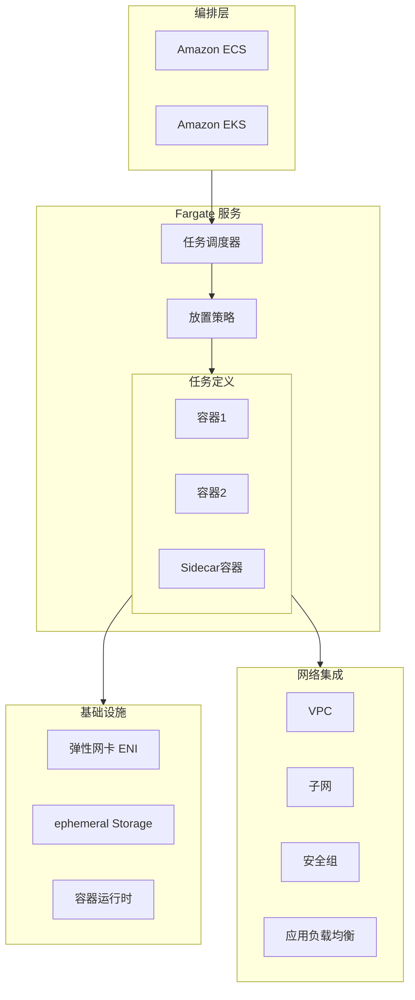
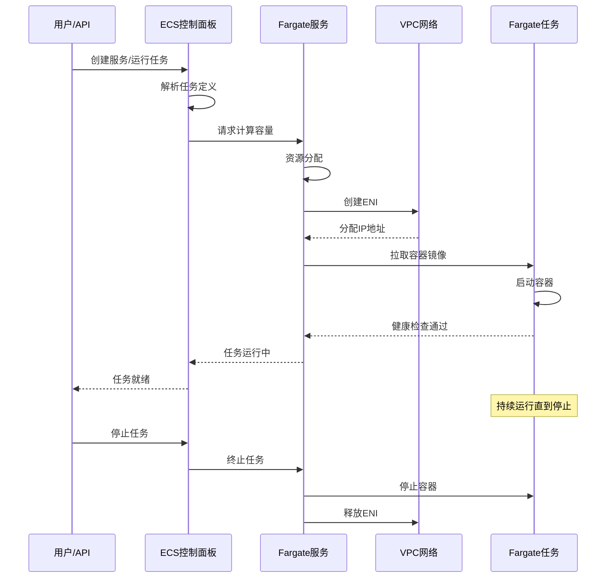
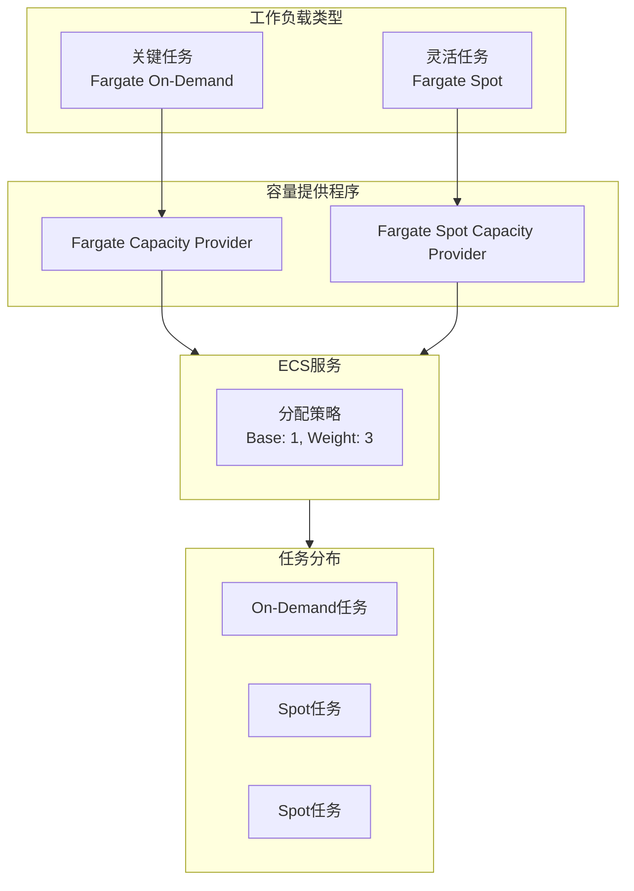
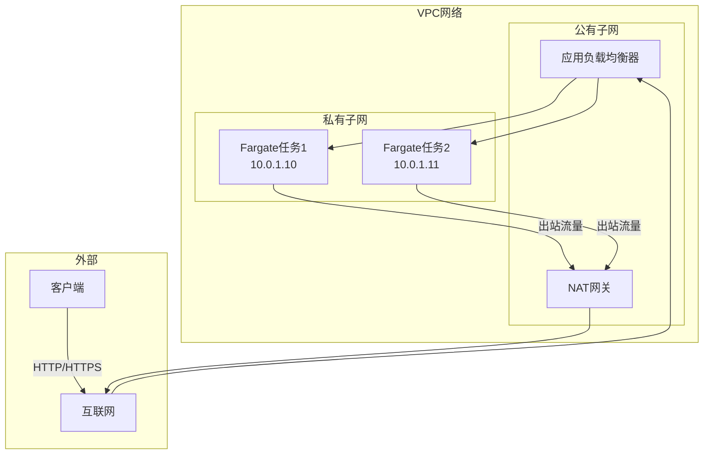
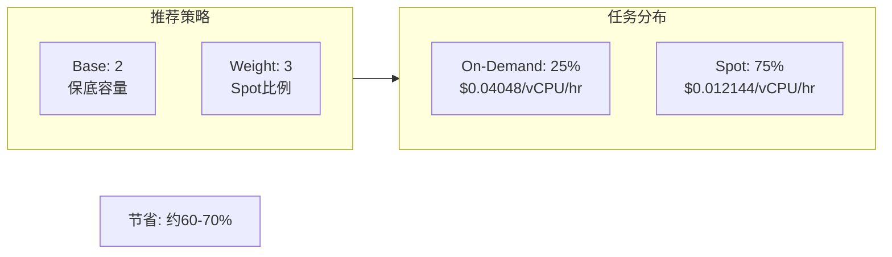

# AWS Fargate 深度解析

> 无服务器容器计算服务完全指南

---

## 🎯 服务概述

**AWS Fargate** 是 AWS 提供的无服务器计算引擎，与 Amazon ECS 和 EKS 配合使用，让您无需管理服务器或集群即可运行容器。只需定义应用程序的资源和网络要求，Fargate 会处理所有基础设施的预置和管理。

**核心特点**:
- **无服务器容器**: 无需管理 EC2 实例
- **按需付费**: 按实际使用的 vCPU 和内存计费
- **安全隔离**: 每个任务独立的计算环境
- **无缝集成**: 与 ECS、EKS、VPC 深度集成

**Lambda vs Fargate 对比**:

| 特性 | Lambda | Fargate |
|------|--------|---------|
| 运行时长 | 最大15分钟 | 无限制 |
| 包大小 | 最大10GB(容器) | 无限制 |
| 启动时间 | 毫秒级 | 秒级(可优化) |
| 使用场景 | 事件驱动、短时任务 | 长时间运行、复杂应用 |
| 自定义运行时 | 有限 | 完全控制 |
| 网络配置 | 简单 | 灵活 |

---

## 🏗️ 架构图

### Fargate 整体架构



### ECS Fargate 启动流程



### Fargate Spot 成本优化架构



---

## 📦 核心组件

### 1. 任务定义 (Task Definition)

```json
{
    "family": "web-application",
    "networkMode": "awsvpc",
    "requiresCompatibilities": ["FARGATE"],
    "cpu": "512",
    "memory": "1024",
    "executionRoleArn": "arn:aws:iam::account:role/ecsTaskExecutionRole",
    "taskRoleArn": "arn:aws:iam::account:role/ecsTaskRole",
    "containerDefinitions": [
        {
            "name": "web-app",
            "image": "account.dkr.ecr.region.amazonaws.com/web-app:latest",
            "essential": true,
            "portMappings": [
                {
                    "containerPort": 8080,
                    "protocol": "tcp"
                }
            ],
            "environment": [
                {"name": "DB_HOST", "value": "db.cluster-xxx.region.rds.amazonaws.com"}
            ],
            "secrets": [
                {
                    "name": "DB_PASSWORD",
                    "valueFrom": "arn:aws:secretsmanager:region:account:secret:db-password"
                }
            ],
            "logConfiguration": {
                "logDriver": "awslogs",
                "options": {
                    "awslogs-group": "/ecs/web-application",
                    "awslogs-region": "us-east-1",
                    "awslogs-stream-prefix": "ecs"
                }
            },
            "healthCheck": {
                "command": ["CMD-SHELL", "curl -f http://localhost:8080/health || exit 1"],
                "interval": 30,
                "timeout": 5,
                "retries": 3
            }
        }
    ]
}
```

### 2. 服务配置选项

| 配置项 | 说明 | 建议 |
|--------|------|------|
| **Desired Count** | 期望任务数 | 根据负载设置 |
| **Launch Type** | 启动类型 | FARGATE/FARGATE_SPOT |
| **Deployment Controller** | 部署控制器 | ECS(滚动)/CODE_DEPLOY(蓝绿) |
| **Health Check Grace Period** | 健康检查宽限期 | 根据启动时间设置 |
| **Auto Scaling** | 自动扩展 | 基于CPU/内存/自定义指标 |

### 3. 网络模式 (awsvpc)



---

## 💻 代码示例

### ECS Fargate 服务 (AWS CDK)

```typescript
import * as cdk from 'aws-cdk-lib';
import * as ecs from 'aws-cdk-lib/aws-ecs';
import * as ec2 from 'aws-cdk-lib/aws-ec2';
import * as elbv2 from 'aws-cdk-lib/aws-elasticloadbalancingv2';

export class FargateServiceStack extends cdk.Stack {
  constructor(scope: cdk.App, id: string, props?: cdk.StackProps) {
    super(scope, id, props);

    // VPC 配置
    const vpc = new ec2.Vpc(this, 'FargateVPC', {
      maxAzs: 2,
      natGateways: 1
    });

    // ECS 集群
    const cluster = new ecs.Cluster(this, 'FargateCluster', {
      vpc: vpc,
      clusterName: 'production-cluster'
    });

    // Fargate 任务定义
    const taskDefinition = new ecs.FargateTaskDefinition(this, 'TaskDef', {
      memoryLimitMiB: 1024,
      cpu: 512,
      runtimePlatform: {
        operatingSystemFamily: ecs.OperatingSystemFamily.LINUX,
        cpuArchitecture: ecs.CpuArchitecture.X86_64
      }
    });

    // 添加容器
    const container = taskDefinition.addContainer('web', {
      image: ecs.ContainerImage.fromRegistry('nginx:latest'),
      logging: ecs.LogDrivers.awsLogs({ streamPrefix: 'fargate' }),
      healthCheck: {
        command: ['CMD-SHELL', 'curl -f http://localhost/ || exit 1'],
        interval: cdk.Duration.seconds(30),
        timeout: cdk.Duration.seconds(5),
        retries: 3
      }
    });

    container.addPortMappings({
      containerPort: 80,
      protocol: ecs.Protocol.TCP
    });

    // Fargate 服务
    const service = new ecs.FargateService(this, 'FargateService', {
      cluster: cluster,
      taskDefinition: taskDefinition,
      serviceName: 'web-service',
      desiredCount: 2,
      assignPublicIp: false,
      vpcSubnets: {
        subnetType: ec2.SubnetType.PRIVATE_WITH_EGRESS
      },
      capacityProviderStrategies: [
        {
          capacityProvider: 'FARGATE',
          weight: 1,
          base: 1
        },
        {
          capacityProvider: 'FARGATE_SPOT',
          weight: 3
        }
      ]
    });

    // 应用负载均衡器
    const alb = new elbv2.ApplicationLoadBalancer(this, 'ALB', {
      vpc: vpc,
      internetFacing: true
    });

    const listener = alb.addListener('Listener', {
      port: 80,
      open: true
    });

    listener.addTargets('ECS', {
      port: 80,
      targets: [service],
      healthCheck: {
        path: '/health',
        interval: cdk.Duration.seconds(30)
      }
    });
  }
}
```

### 自动扩展配置

```typescript
// CPU 扩展策略
const scaling = service.autoScaleTaskCount({
  minCapacity: 2,
  maxCapacity: 20
});

scaling.scaleOnCpuUtilization('CpuScaling', {
  targetUtilizationPercent: 70,
  scaleInCooldown: cdk.Duration.seconds(60),
  scaleOutCooldown: cdk.Duration.seconds(60)
});

// 自定义指标扩展
scaling.scaleOnMetric('RequestCountScaling', {
  metric: alb.metricRequestCount(),
  targetValue: 1000,
  scaleInCooldown: cdk.Duration.seconds(60),
  scaleOutCooldown: cdk.Duration.seconds(60)
});
```

### Terraform 配置

```hcl
# Fargate 任务定义
resource "aws_ecs_task_definition" "app" {
  family                   = "web-app"
  requires_compatibilities = ["FARGATE"]
  network_mode             = "awsvpc"
  cpu                      = "512"
  memory                   = "1024"
  execution_role_arn       = aws_iam_role.ecs_execution.arn
  task_role_arn            = aws_iam_role.ecs_task.arn

  container_definitions = jsonencode([
    {
      name  = "web"
      image = "${aws_ecr_repository.app.repository_url}:latest"
      essential = true
      
      portMappings = [
        {
          containerPort = 8080
          protocol      = "tcp"
        }
      ]
      
      environment = [
        { name = "NODE_ENV", value = "production" }
      ]
      
      secrets = [
        {
          name      = "DATABASE_URL"
          valueFrom = aws_secretsmanager_secret.db_url.arn
        }
      ]
      
      logConfiguration = {
        logDriver = "awslogs"
        options = {
          awslogs-group         = aws_cloudwatch_log_group.app.name
          awslogs-region        = data.aws_region.current.name
          awslogs-stream-prefix = "ecs"
        }
      }
      
      healthCheck = {
        command     = ["CMD-SHELL", "curl -f http://localhost:8080/health || exit 1"]
        interval    = 30
        timeout     = 5
        retries     = 3
        startPeriod = 60
      }
    }
  ])
}

# Fargate 服务
resource "aws_ecs_service" "app" {
  name            = "web-service"
  cluster         = aws_ecs_cluster.main.id
  task_definition = aws_ecs_task_definition.app.arn
  desired_count   = 2
  launch_type     = "FARGATE"

  network_configuration {
    subnets          = aws_subnet.private[*].id
    security_groups  = [aws_security_group.ecs_tasks.id]
    assign_public_ip = false
  }

  load_balancer {
    target_group_arn = aws_lb_target_group.app.arn
    container_name   = "web"
    container_port   = 8080
  }

  deployment_controller {
    type = "ECS"
  }

  deployment_circuit_breaker {
    enable   = true
    rollback = true
  }

  depends_on = [aws_lb_listener.https]
}
```

---

## 🚀 性能优化

### 1. 镜像优化

```dockerfile
# 多阶段构建减小镜像大小
FROM node:18-alpine AS builder
WORKDIR /app
COPY package*.json ./
RUN npm ci --only=production

FROM node:18-alpine
WORKDIR /app
# 只复制生产依赖
COPY --from=builder /app/node_modules ./node_modules
COPY . .
EXPOSE 8080
CMD ["node", "server.js"]
```

### 2. 启动优化

```python
# 健康检查端点 - 快速响应
from flask import Flask, jsonify

app = Flask(__name__)

@app.route('/health')
def health():
    # 简单检查，快速返回
    return jsonify({'status': 'healthy'}), 200

@app.route('/ready')
def ready():
    # 检查依赖（数据库等）
    if check_dependencies():
        return jsonify({'status': 'ready'}), 200
    return jsonify({'status': 'not ready'}), 503
```

### 3. 容量提供程序策略



---

## 🔒 安全最佳实践

### 任务 IAM 角色

```json
{
    "Version": "2012-10-17",
    "Statement": [
        {
            "Effect": "Allow",
            "Action": [
                "s3:GetObject",
                "s3:PutObject"
            ],
            "Resource": "arn:aws:s3:::app-bucket/*"
        },
        {
            "Effect": "Allow",
            "Action": [
                "dynamodb:GetItem",
                "dynamodb:PutItem",
                "dynamodb:Query"
            ],
            "Resource": "arn:aws:dynamodb:region:account:table/AppTable"
        },
        {
            "Effect": "Allow",
            "Action": [
                "secretsmanager:GetSecretValue"
            ],
            "Resource": "arn:aws:secretsmanager:region:account:secret:app/*"
        }
    ]
}
```

### 安全组配置

```hcl
# 仅允许来自 ALB 的入站流量
resource "aws_security_group" "ecs_tasks" {
  name        = "ecs-tasks-sg"
  description = "Security group for ECS tasks"
  vpc_id      = aws_vpc.main.id

  ingress {
    from_port       = 8080
    to_port         = 8080
    protocol        = "tcp"
    security_groups = [aws_security_group.alb.id]
  }

  egress {
    from_port   = 0
    to_port     = 0
    protocol    = "-1"
    cidr_blocks = ["0.0.0.0/0"]
  }
}
```

---

## 💰 成本优化

### Fargate 定价计算

```
Fargate 定价 = vCPU 费用 + 内存费用

vCPU 费用 = vCPU 数量 × 运行时间(小时) × $0.04048
内存费用 = GB 数量 × 运行时间(小时) × $0.004445

示例:
- 任务配置: 1 vCPU, 2GB 内存
- 运行时间: 24 小时/天 × 30 天 = 720 小时
- 任务数量: 3 个

vCPU 费用 = 1 × 720 × 3 × $0.04048 = $87.44
内存费用 = 2 × 720 × 3 × $0.004445 = $19.20
月费用 = $106.64

使用 Fargate Spot (节省 70%):
月费用 ≈ $32.00
```

### 成本优化策略

1. **使用 Graviton2 (ARM64)**: 价格更低，性能更好
2. **Fargate Spot**: 适用于容错工作负载
3. **右-sizing**: 根据实际使用调整资源配置
4. **自动扩展**: 避免过度预置
5. **保留实例**: 长期稳定工作负载考虑 Compute Savings Plans

---

## 📊 监控与可观测性

### Container Insights

```bash
# 启用 Container Insights
aws ecs put-cluster-setting \
    --cluster production \
    --setting name=containerInsights,value=enabled \
    --region us-east-1
```

### 关键指标

| 指标 | 说明 | 告警阈值 |
|------|------|----------|
| **CPUUtilization** | CPU 使用率 | > 70% |
| **MemoryUtilization** | 内存使用率 | > 80% |
| **RunningTaskCount** | 运行任务数 | < desired count |
| **PendingTaskCount** | 待启动任务数 | > 0 持续5分钟 |
| **DeploymentFailures** | 部署失败数 | > 0 |

---

## 🔗 相关资源

- [AWS Fargate 官方文档](https://docs.aws.amazon.com/AmazonECS/latest/userguide/what-is-fargate.html)
- [ECS 最佳实践](https://docs.aws.amazon.com/AmazonECS/latest/bestpracticesguide/intro.html)
- [Fargate 定价](https://aws.amazon.com/fargate/pricing/)
- [ECS 示例代码](https://github.com/aws-samples/aws-ecs-samples)
