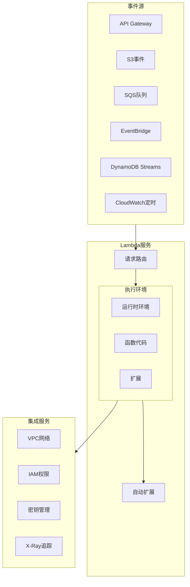
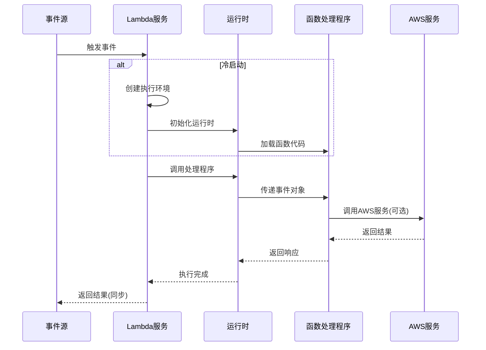
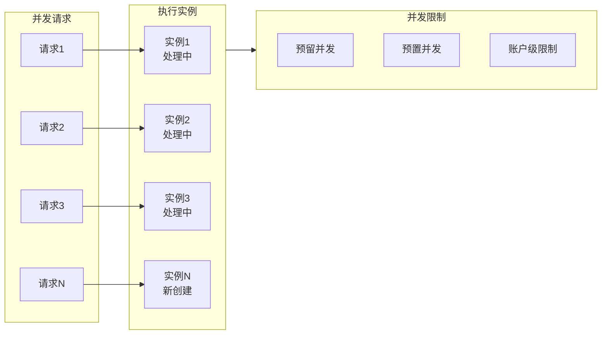

# AWS Lambda 深度解析

> 全面掌握无服务器计算的核心服务

---

## 🎯 服务概述

**AWS Lambda** 是 AWS 提供的无服务器计算服务，让您无需预置或管理服务器即可运行代码。只需上传代码，Lambda 会处理运行和扩展所需的一切，实现高可用性。

**核心特点**:
- **无服务器**: 无需管理基础设施
- **自动扩展**: 从每天几个请求到每秒数千个请求
- **按需付费**: 按代码执行时间和请求数计费
- **事件驱动**: 响应各种 AWS 服务事件

---

## 🏗️ 架构图

### Lambda 整体架构



### 函数执行流程



### 并发与扩展架构



---

## 📦 核心组件

### 1. 函数配置

| 配置项 | 说明 | 建议值 |
|--------|------|--------|
| **内存** | 128MB - 10GB | 根据需求调整，影响CPU |
| **超时** | 最大15分钟 | 设置合理的超时防止挂起 |
| **运行时** | Node.js/Python/Java/Go等 | 选择熟悉的语言 |
| **环境变量** | 配置参数 | 使用加密保护敏感数据 |
| **VPC** | 网络配置 | 仅在需要时启用 |

### 2. 触发器类型

```
触发器类型                使用场景
─────────────────────────────────────────
API Gateway           REST API/WebSocket
Application Load Balancer  HTTP/HTTPS
S3                    文件上传/处理事件
SQS                   异步消息处理
EventBridge           定时任务/事件响应
DynamoDB Streams      数据库变更处理
Kinesis               流数据处理
CloudWatch Logs       日志处理
Cognito               用户认证触发
```

### 3. 部署方式

| 方式 | 适用场景 | 特点 |
|------|----------|------|
| **控制台编辑器** | 快速测试 | 适合简单函数 |
| **ZIP上传** | 小型项目 | 代码+依赖打包 |
| **容器镜像** | 复杂依赖 | 最大10GB |
| **S3部署** | 大型项目 | 配合CI/CD |
| **SAM/CloudFormation** | 生产环境 | 基础设施即代码 |

---

## 💻 代码示例

### 基础 Lambda 函数 (Python)

```python
import json
import boto3

def lambda_handler(event, context):
    """
    Lambda 处理函数入口
    
    event: 触发事件数据
    context: 运行时上下文
    """
    # 获取请求参数
    name = event.get('name', 'World')
    
    # 业务逻辑
    message = f"Hello, {name}!"
    
    # 返回响应
    return {
        'statusCode': 200,
        'headers': {
            'Content-Type': 'application/json',
            'Access-Control-Allow-Origin': '*'
        },
        'body': json.dumps({
            'message': message,
            'requestId': context.aws_request_id
        })
    }
```

### 带错误处理的 Lambda

```python
import json
import logging
from botocore.exceptions import ClientError

logger = logging.getLogger()
logger.setLevel(logging.INFO)

def lambda_handler(event, context):
    try:
        # 输入验证
        if 'userId' not in event:
            raise ValueError("userId is required")
        
        # 业务处理
        result = process_user(event['userId'])
        
        return {
            'statusCode': 200,
            'body': json.dumps(result)
        }
        
    except ValueError as e:
        logger.warning(f"Validation error: {str(e)}")
        return {
            'statusCode': 400,
            'body': json.dumps({'error': str(e)})
        }
        
    except ClientError as e:
        logger.error(f"AWS API error: {str(e)}")
        return {
            'statusCode': 500,
            'body': json.dumps({'error': 'Service temporarily unavailable'})
        }
        
    except Exception as e:
        logger.exception("Unexpected error")
        raise

def process_user(user_id):
    # 业务逻辑
    return {'userId': user_id, 'status': 'processed'}
```

### Lambda 层 (Layer) 使用

```python
# 使用 Lambda Layer 共享代码
import requests  # 通过Layer提供的依赖
from shared_utils import validate_input  # 自定义Layer

def lambda_handler(event, context):
    # 使用 Layer 中的工具函数
    if not validate_input(event):
        return {'statusCode': 400, 'body': 'Invalid input'}
    
    # 使用 Layer 中的库
    response = requests.get('https://api.example.com/data')
    
    return {
        'statusCode': 200,
        'body': response.json()
    }
```

---

## 🚀 性能优化

### 1. 减少冷启动

```python
# 全局初始化（在函数外） - 只执行一次
import boto3

dynamodb = boto3.resource('dynamodb')  # 复用连接
table = dynamodb.Table('Users')        # 预加载表

def lambda_handler(event, context):
    # 函数内逻辑 - 每次调用执行
    response = table.get_item(Key={'id': event['userId']})
    return response
```

### 2. 预置并发

```bash
# 配置预置并发 - 避免冷启动
aws lambda put-provisioned-concurrency-config \
    --function-name my-function \
    --qualifier PROD \
    --provisioned-concurrent-executions 100
```

### 3. 内存优化

| 内存(MB) | 内存价格/1ms | 相对CPU |
|----------|-------------|---------|
| 128 | $0.0000000021 | 基准 |
| 512 | $0.0000000083 | ~3x |
| 1024 | $0.0000000167 | ~6x |
| 3008 | $0.0000000490 | ~18x |

**优化策略**: 
- 找到性能和成本的最佳平衡点
- 使用 Power Tuning 工具测试

---

## 🔒 安全最佳实践

### IAM 最小权限原则

```json
{
    "Version": "2012-10-17",
    "Statement": [
        {
            "Effect": "Allow",
            "Action": [
                "dynamodb:GetItem",
                "dynamodb:PutItem"
            ],
            "Resource": "arn:aws:dynamodb:region:account:table/SpecificTable"
        },
        {
            "Effect": "Allow",
            "Action": "logs:CreateLogGroup",
            "Resource": "arn:aws:logs:region:account:*"
        },
        {
            "Effect": "Allow",
            "Action": [
                "logs:CreateLogStream",
                "logs:PutLogEvents"
            ],
            "Resource": "arn:aws:logs:region:account:log-group:/aws/lambda/function-name:*"
        }
    ]
}
```

### 环境变量加密

```bash
# 使用 KMS 加密环境变量
aws lambda update-function-configuration \
    --function-name my-function \
    --environment Variables={API_KEY=plaintext_value} \
    --kms-key-arn arn:aws:kms:region:account:key/key-id
```

---

## 📊 监控与调试

### CloudWatch 指标

```python
import boto3
from datetime import datetime, timedelta

cloudwatch = boto3.client('cloudwatch')

# 获取函数指标
response = cloudwatch.get_metric_statistics(
    Namespace='AWS/Lambda',
    MetricName='Duration',
    Dimensions=[
        {'Name': 'FunctionName', 'Value': 'my-function'}
    ],
    StartTime=datetime.utcnow() - timedelta(hours=1),
    EndTime=datetime.utcnow(),
    Period=300,
    Statistics=['Average', 'Maximum']
)
```

### X-Ray 分布式追踪

```python
from aws_xray_sdk.core import xray_recorder, patch_all

patch_all()  # 自动追踪所有AWS SDK调用

@xray_recorder.capture('process_payment')
def process_payment(order_id):
    # 这段代码会被追踪
    pass

def lambda_handler(event, context):
    # 添加自定义注解
    xray_recorder.put_annotation('orderId', event['orderId'])
    
    process_payment(event['orderId'])
    
    return {'statusCode': 200}
```

---

## 💰 成本优化

### 定价计算

```
月度费用 = 请求费用 + 计算费用

请求费用 = 请求数 × $0.20/百万请求

计算费用 = 执行次数 × 执行时间(ms) × 内存(GB) × $0.0000166667/GB-秒

示例:
- 每月 1 亿次请求
- 平均执行时间 200ms
- 内存配置 512MB (0.5GB)

请求费用 = 100 × $0.20 = $20
计算费用 = 100,000,000 × 0.2 × 0.5 × $0.0000166667 = $166.67
总费用 = $186.67/月
```

### 节省成本策略

1. **使用 Graviton2 处理器**: 便宜 20%，性能更好
2. **优化内存配置**: 找到最佳性价比点
3. **减少不必要的调用**: 使用 SQS 批处理
4. **预留并发**: 对于有预测流量的工作负载
5. **使用 Compute Savings Plans**: 长期承诺折扣

---

## 🔗 相关资源

- [AWS Lambda 官方文档](https://docs.aws.amazon.com/lambda/)
- [Lambda 最佳实践](https://docs.aws.amazon.com/lambda/latest/dg/best-practices.html)
- [Lambda Power Tuning](https://github.com/alexcasalboni/aws-lambda-power-tuning)
- [AWS SAM](https://docs.aws.amazon.com/serverless-application-model/)
