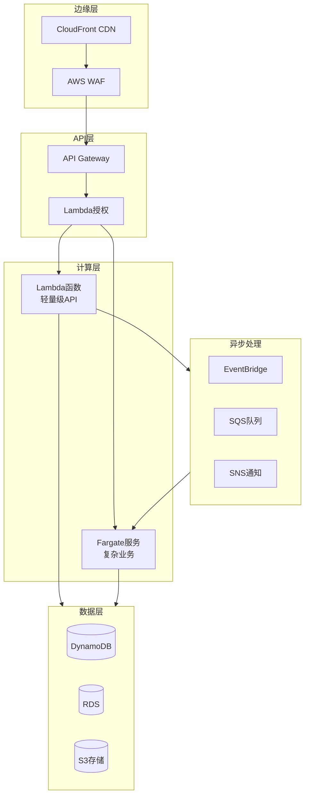
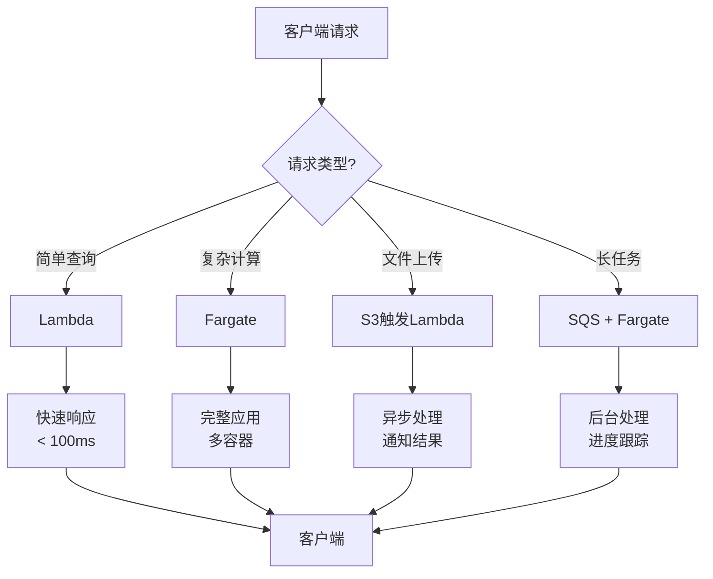
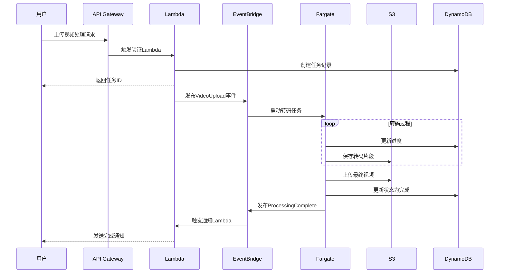
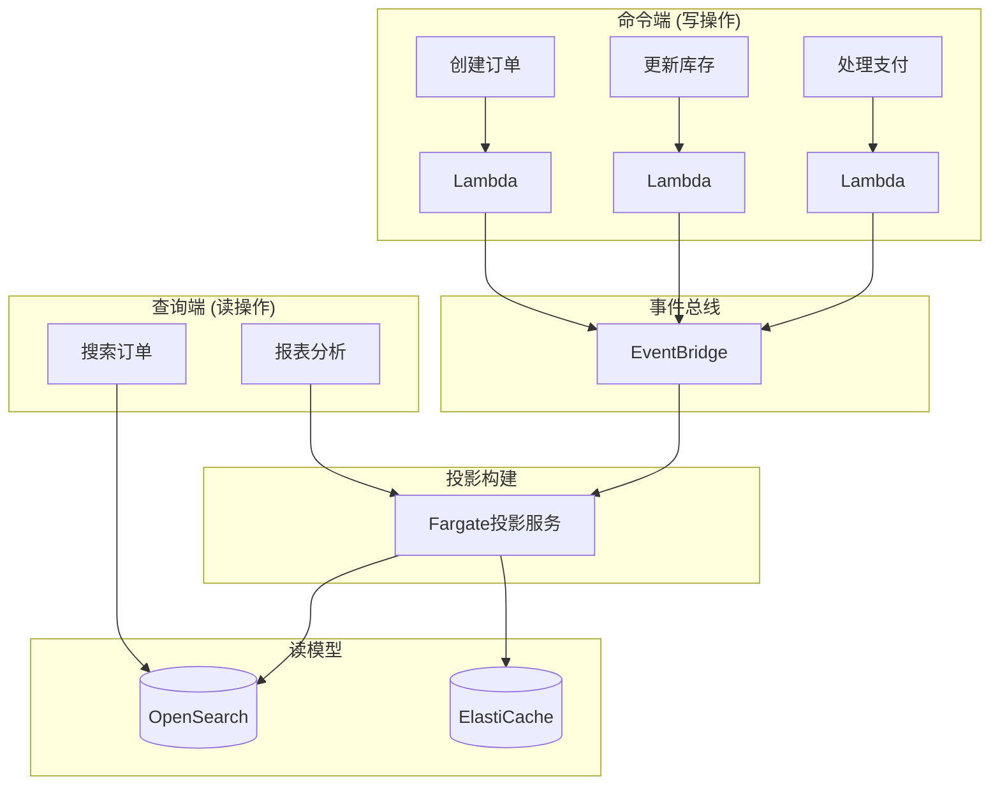

# Lambda 与 Fargate 集成模式

> 构建现代化无服务器应用的最佳实践

---

## 🎯 概述

Lambda 和 Fargate 并非互斥，而是互补的无服务器计算选项。理解何时使用哪种服务，以及如何组合使用，是构建高效、经济、可扩展架构的关键。

**决策矩阵**:

| 场景 | 推荐服务 | 理由 |
|------|----------|------|
| API 请求处理 (< 15分钟) | Lambda | 低延迟、自动扩展 |
| 长时间数据处理 | Fargate | 无超时限制 |
| 机器学习推理 | 两者皆可 | 根据模型大小选择 |
| 视频转码 | Fargate | 计算密集、耗时长 |
| 定时任务 | Lambda | 简单、成本低 |
| 复杂工作流 | Lambda + Fargate | 组合优势 |

---

## 🏗️ 架构图

### Lambda + Fargate 混合架构



### 请求路由决策流程



### 事件驱动工作流



---

## 💻 集成模式

### 模式1: Lambda 触发 Fargate 任务

适用于需要快速响应并启动长时间处理任务的场景。

```python
import boto3
import json

ecs = boto3.client('ecs')

def lambda_handler(event, context):
    """
    API Gateway 触发，启动 Fargate 任务处理
    """
    # 验证输入
    job_id = event.get('jobId')
    if not job_id:
        return {'statusCode': 400, 'body': 'jobId required'}
    
    # 启动 Fargate 任务
    response = ecs.run_task(
        cluster='processing-cluster',
        taskDefinition='video-processor:3',
        launchType='FARGATE',
        networkConfiguration={
            'awsvpcConfiguration': {
                'subnets': ['subnet-xxx', 'subnet-yyy'],
                'securityGroups': ['sg-xxx'],
                'assignPublicIp': 'DISABLED'
            }
        },
        overrides={
            'containerOverrides': [
                {
                    'name': 'processor',
                    'environment': [
                        {'name': 'JOB_ID', 'value': job_id},
                        {'name': 'INPUT_BUCKET', 'value': event.get('bucket')},
                        {'name': 'INPUT_KEY', 'value': event.get('key')}
                    ]
                }
            ]
        }
    )
    
    task_arn = response['tasks'][0]['taskArn']
    
    return {
        'statusCode': 202,
        'body': json.dumps({
            'message': 'Processing started',
            'jobId': job_id,
            'taskArn': task_arn
        })
    }
```

### 模式2: Fargate 调用 Lambda

适用于需要在容器应用中执行特定无服务器功能的场景。

```python
# Fargate 容器中的代码
import boto3
import json

lambda_client = boto3.client('lambda')

def process_order(order_data):
    # 业务处理...
    
    # 调用 Lambda 进行验证
    response = lambda_client.invoke(
        FunctionName='order-validation',
        InvocationType='RequestResponse',
        Payload=json.dumps({
            'orderId': order_data['id'],
            'amount': order_data['amount'],
            'customerId': order_data['customer_id']
        })
    )
    
    result = json.loads(response['Payload'].read())
    
    if result.get('valid'):
        # 继续处理
        return complete_order(order_data)
    else:
        # 拒绝订单
        return {'status': 'rejected', 'reason': result.get('reason')}
```

### 模式3: 通过事件总线协调

使用 EventBridge 实现松耦合的 Lambda-Fargate 协作。

```yaml
# SAM 模板定义
AWSTemplateFormatVersion: '2010-09-09'
Transform: AWS::Serverless-2016-10-31

Resources:
  # Lambda 函数 - 事件生产者
  OrderProcessor:
    Type: AWS::Serverless::Function
    Properties:
      CodeUri: src/order_processor
      Handler: app.lambda_handler
      Runtime: python3.11
      Events:
        ApiEvent:
          Type: Api
          Properties:
            Path: /orders
            Method: post
      Environment:
        Variables:
          EVENT_BUS_NAME: !Ref OrderEventBus
      Policies:
        - EventBridgePutEventsPolicy:
            EventBusName: !Ref OrderEventBus

  # EventBridge 事件总线
  OrderEventBus:
    Type: AWS::Events::EventBus
    Properties:
      Name: order-events

  # EventBridge 规则 - 触发 Lambda
  LightProcessingRule:
    Type: AWS::Events::Rule
    Properties:
      EventBusName: !Ref OrderEventBus
      EventPattern:
        source:
          - order.service
        detail-type:
          - Order Created
        detail:
          priority:
            - low
      Targets:
        - Arn: !GetAtt LightOrderProcessor.Arn
          Id: LightOrderProcessor

  # EventBridge 规则 - 触发 Fargate
  HeavyProcessingRule:
    Type: AWS::Events::Rule
    Properties:
      EventBusName: !Ref OrderEventBus
      EventPattern:
        source:
          - order.service
        detail-type:
          - Order Created
        detail:
          priority:
            - high
      Targets:
        - Arn: !Ref OrderProcessingCluster
          Id: FargateTask
          RoleArn: !GetAtt EventBridgeRole.Arn
          EcsParameters:
            TaskDefinitionArn: !Ref HeavyProcessorTask
            TaskCount: 1
            LaunchType: FARGATE
            NetworkConfiguration:
              AwsVpcConfiguration:
                Subnets: [!Ref PrivateSubnet1, !Ref PrivateSubnet2]
                SecurityGroups: [!Ref EcsSecurityGroup]
                AssignPublicIp: DISABLED
```

---

## 📐 设计模式

### 1. Strangler Fig 模式 (绞杀者模式)

逐步将单体应用迁移到无服务器架构。

```mermaid
flowchart LR
    subgraph Phase1["阶段1: 边缘Lambda"]
        Client1[客户端]
        Lambda1[Lambda@Edge]
        Monolith1[单体应用]
        Client1 --> Lambda1 --> Monolith1
    end
    
    subgraph Phase2["阶段2: API分解"]
        Client2[客户端]
        APIGW[API Gateway]
        Lambda2[新Lambda]
        Monolith2[剩余单体]
        Client2 --> APIGW
        APIGW --> Lambda2
        APIGW --> Monolith2
    end
    
    subgraph Phase3["阶段3: 完全无服务器"]
        Client3[客户端]
        APIGW2[API Gateway]
        Lambda3[Lambda]
        Fargate[Fargate服务]
        Client3 --> APIGW2
        APIGW2 --> Lambda3
        APIGW2 --> Fargate
    end
    
    Phase1 --> Phase2 --> Phase3
```

### 2. Saga 模式 (分布式事务)

使用 Lambda 编排 Fargate 服务的分布式事务。

```python
import boto3
import json

ecs = boto3.client('ecs')
sns = boto3.client('sns')

def saga_orchestrator(event, context):
    """
    Saga 模式编排器 - 管理分布式事务
    """
    saga_id = event['sagaId']
    steps = [
        {'service': 'inventory', 'action': 'reserve'},
        {'service': 'payment', 'action': 'charge'},
        {'service': 'shipping', 'action': 'schedule'}
    ]
    
    completed_steps = []
    
    try:
        for step in steps:
            # 执行步骤
            result = execute_step(step, saga_id)
            
            if result['success']:
                completed_steps.append(step)
            else:
                # 执行补偿
                compensate(completed_steps, saga_id)
                return {'status': 'failed', 'step': step['service']}
        
        return {'status': 'success', 'sagaId': saga_id}
        
    except Exception as e:
        compensate(completed_steps, saga_id)
        raise

def execute_step(step, saga_id):
    """执行单个 Saga 步骤"""
    response = ecs.run_task(
        cluster=f"{step['service']}-cluster",
        taskDefinition=f"{step['service']}-{step['action']}",
        launchType='FARGATE',
        overrides={
            'containerOverrides': [{
                'name': step['service'],
                'environment': [
                    {'name': 'SAGA_ID', 'value': saga_id},
                    {'name': 'ACTION', 'value': step['action']}
                ]
            }]
        }
    )
    
    # 等待任务完成 (简化示例)
    return {'success': True, 'taskArn': response['tasks'][0]['taskArn']}

def compensate(completed_steps, saga_id):
    """执行补偿操作"""
    for step in reversed(completed_steps):
        ecs.run_task(
            cluster=f"{step['service']}-cluster",
            taskDefinition=f"{step['service']}-compensate",
            launchType='FARGATE',
            overrides={
                'containerOverrides': [{
                    'name': step['service'],
                    'environment': [
                        {'name': 'SAGA_ID', 'value': saga_id}
                    ]
                }]
            }
        )
```

### 3. CQRS 模式 (命令查询职责分离)

使用 Lambda 处理命令，Fargate 处理复杂查询。



---

## 🚀 部署策略

### 蓝绿部署

```typescript
// CDK 实现蓝绿部署
const service = new ecs.FargateService(this, 'Service', {
  cluster,
  taskDefinition,
  deploymentController: {
    type: ecs.DeploymentControllerType.CODE_DEPLOY
  },
  circuitBreaker: { rollback: true }
});

// CodeDeploy 应用
new codedeploy.EcsApplication(this, 'CodeDeployApp', {
  applicationName: 'MyApplication'
});

// 部署组配置
const deploymentGroup = new codedeploy.EcsDeploymentGroup(this, 'DeploymentGroup', {
  application: codedeployApp,
  service,
  deploymentConfig: codedeploy.EcsDeploymentConfig.CANARY_10_PERCENT_5_MINUTES,
  blueGreenDeploymentConfig: {
    blueTargetGroup,
    greenTargetGroup,
    listener
  }
});
```

### 金丝雀部署

```bash
# 使用 App Mesh 实现金丝雀发布
# 1. 创建新版本服务
aws ecs create-service \
    --cluster production \
    --service-name api-v2 \
    --task-definition api:2 \
    --launch-type FARGATE \
    --desired-count 1

# 2. 配置 App Mesh 路由权重
aws appmesh update-route \
    --mesh-name production \
    --virtual-router-name api-router \
    --route-name api-route \
    --spec file://canary-10-percent.json

# 3. 逐步增加流量权重
# 10% -> 25% -> 50% -> 100%
```

---

## 💰 成本优化对比

| 场景 | 纯 Lambda | 纯 Fargate | 混合方案 | 最优选择 |
|------|-----------|------------|----------|----------|
| 低频API (1K/天) | $0.20 | $15 | $0.20 | Lambda |
| 高频API (1M/天) | $200 | $150 | $120 | 混合 |
| 持续处理 | 不适用 | $100 | $100 | Fargate |
| 突发流量 | $50 | $200 | $80 | 混合 |

---

## 🔗 相关资源

- [AWS 无服务器应用程序模型 (SAM)](https://docs.aws.amazon.com/serverless-application-model/)
- [AWS Copilot](https://aws.github.io/copilot-cli/)
- [Serverless Framework](https://www.serverless.com/)
- [AWS 架构中心 - 无服务器](https://aws.amazon.com/architecture/serverless/)
