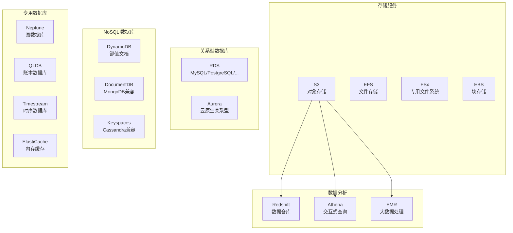
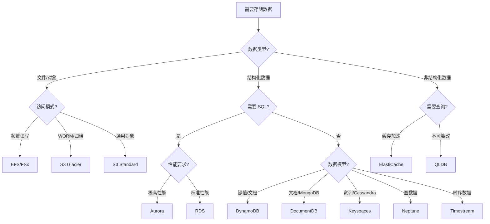

# 文件存储与数据库技术资源

> AWS 数据存储与数据库服务全面指南  
> 从对象存储到关系型/NoSQL/图数据库的完整技术栈

---

## 🎯 主题介绍

本主题全面讲解 AWS 数据存储与数据库服务，帮助您根据业务需求选择合适的数据存储方案：

- **对象存储** - Amazon S3：无限扩展的云端对象存储
- **文件存储** - Amazon EFS/FSx：托管式文件系统服务
- **块存储** - Amazon EBS：高性能块级存储
- **关系型数据库** - Amazon RDS/Aurora：托管式 SQL 数据库
- **NoSQL 数据库** - DynamoDB：键值与文档数据库
- **内存数据库** - ElastiCache：Redis/Memcached 托管服务
- **专用数据库** - DocumentDB、Neptune、Keyspaces、QLDB、Timestream
- **数据库容器化** - Docker 部署数据库、本地开发环境

---

## 🏗️ 架构概览

### AWS 存储与数据库服务矩阵



### 存储选择决策树



---

## 📚 多语言资源

| 语言 | 目录 | 状态 | 规模 |
|------|------|------|------|
| 🇨🇳 中文 | [./zh/](./zh/) | ✅ 可用 | 完整文档 |
| 🇺🇸 English | [./en/](./en/) | 📝 计划中 | 核心文档 |
| 🇯🇵 日本語 | [./ja/](./ja/) | 📝 计划中 | 核心文档 |

---

## 📖 内容清单

### 电子书 (ebooks/)

| 文档 | 说明 |
|------|------|
| `README.md` | 导航索引 |
| `Storage_Database_Whitepaper.md` | 技术白皮书 (12章) |
| `Storage_Database_Quick_Reference.md` | 速查手册 |
| `Storage_Database_Learning_Roadmap.md` | 16周学习路线图 |

### 技术文档 (materials/)

| 文档 | 内容 |
|------|------|
| `s3_complete_guide.md` | S3 完全指南 |
| `rds_aurora_deep_dive.md` | RDS 与 Aurora 深度解析 |
| `dynamodb_best_practices.md` | DynamoDB 最佳实践 |
| `database_selection_guide.md` | 数据库选型指南 |
| `data_migration_strategies.md` | 数据迁移策略 |

---

## 💻 实践项目

| 项目 | 难度 | 技术栈 | 目录 |
|------|------|--------|------|
| 数据湖构建 | ⭐ 入门 | S3 + Glue + Athena | [./projects/01-s3-data-lake/](./projects/01-s3-data-lake/) |
| 数据库迁移 | ⭐⭐ 进阶 | DMS + RDS + DynamoDB | [./projects/02-database-migration/](./projects/02-database-migration/) |
| 跨区域备份 | ⭐⭐⭐ 高级 | S3 + RDS + DynamoDB Global Tables | [./projects/03-multi-region-backup/](./projects/03-multi-region-backup/) |

---

## 🚀 快速开始

### 中文用户

```bash
cd zh/ebooks/
cat README.md
```

### 学习路径

1. **新手**: 白皮书第1-4章 → 项目1
2. **进阶**: 白皮书第5-8章 → 项目2
3. **专家**: 全部白皮书 → 项目3

---

## 📊 资源统计

| 指标 | 数量 |
|------|------|
| **电子书** | 4本 |
| **技术文档** | 3篇 (含 Docker 容器化指南) |
| **实践项目** | 3个 |
| **架构图** | 20+ |
| **代码示例** | 40+ |

---

## 🔗 相关主题

- [Serverless](../serverless/) - 无服务器计算
- [AWS AI/ML](../aws-ai/) - 人工智能与机器学习

---

**开始您的数据存储之旅！** 🚀
