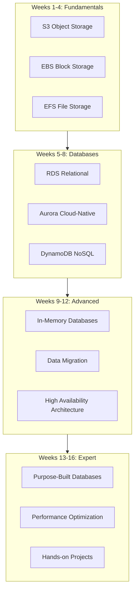
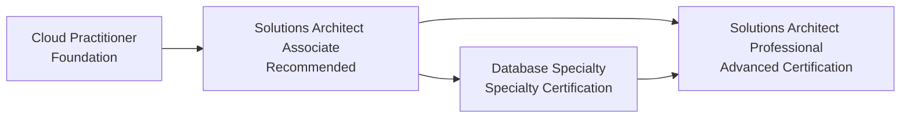

# AWS Storage and Database 16-Week Learning Roadmap

> Complete Learning Path from Beginner to Expert

---

## 🗺️ Learning Roadmap Overview



---

## 📅 Detailed Learning Plan

### Week 1: S3 Fundamentals

**Learning Objectives**: Master object storage core concepts

| Day | Topic | Hands-on Tasks |
|-----|-------|----------------|
| Day 1 | S3 Overview and Core Concepts | Create your first Bucket |
| Day 2 | Bucket and Object Operations | Use CLI to upload/download files |
| Day 3 | Storage Classes | Configure lifecycle rules |
| Day 4 | Security Basics | Configure Bucket Policy |
| Day 5 | Versioning | Enable versioning and test |
| Day 6 | Event Notifications | Configure S3 → Lambda trigger |
| Day 7 | Weekly Review | Complete mini quiz |

**Recommended Resources**:
- Whitepaper Chapter 2
- AWS Official Documentation: S3 Getting Started
- Practice: Build static website hosting

---

### Week 2: S3 Advanced Features

**Learning Objectives**: Master enterprise-grade S3 configuration

| Day | Topic | Hands-on Tasks |
|-----|-------|----------------|
| Day 1 | Cross-Region Replication (CRR) | Configure CRR |
| Day 2 | S3 Select & Glacier | Use S3 Select for queries |
| Day 3 | Data Transfer Acceleration | Configure Transfer Acceleration |
| Day 4 | S3 with CloudFront | Configure CDN acceleration |
| Day 5 | S3 Object Lambda | Data processing chain |
| Day 6 | Cost Optimization | Analyze storage costs |
| Day 7 | Weekly Review | Complete Project 1 preparation |

**Hands-on Project**: Build data lake foundation components

---

### Week 3: EBS and Block Storage

**Learning Objectives**: Understand block storage and EC2 integration

| Day | Topic | Hands-on Tasks |
|-----|-------|----------------|
| Day 1 | EBS Overview and Volume Types | Create different volume types |
| Day 2 | Volume Lifecycle | Attach/detach/delete volumes |
| Day 3 | EBS Snapshots | Create and manage snapshots |
| Day 4 | Performance Optimization | Compare gp3 vs io2 |
| Day 5 | RAID Configuration | Configure RAID 0/1 |
| Day 6 | EBS Encryption | Encrypted volume operations |
| Day 7 | Weekly Review | Performance testing |

---

### Week 4: EFS and File Storage

**Learning Objectives**: Master managed file systems

| Day | Topic | Hands-on Tasks |
|-----|-------|----------------|
| Day 1 | EFS Architecture | Create EFS file system |
| Day 2 | Mount and Access | Multi-EC2 mount testing |
| Day 3 | Storage Classes | IA and Archive |
| Day 4 | FSx Introduction | FSx for Windows |
| Day 5 | FSx Lustre | HPC scenarios |
| Day 6 | Hybrid Cloud Storage | Storage Gateway |
| Day 7 | Weekly Review | Complete Phase 1 assessment |

**Phase 1 Milestone**: Ability to design enterprise-grade storage architecture

---

### Week 5: RDS Fundamentals

**Learning Objectives**: Master managed relational databases

| Day | Topic | Hands-on Tasks |
|-----|-------|----------------|
| Day 1 | RDS Overview | Create MySQL instance |
| Day 2 | Database Engine Comparison | PostgreSQL vs MySQL |
| Day 3 | Connection and Authentication | Configure security groups |
| Day 4 | Parameter Groups | Customize database parameters |
| Day 5 | Backup and Recovery | Automated backup configuration |
| Day 6 | Monitoring Basics | CloudWatch metrics |
| Day 7 | Weekly Review | Database benchmark testing |

---

### Week 6: RDS High Availability

**Learning Objectives**: Build high-availability database architecture

| Day | Topic | Hands-on Tasks |
|-----|-------|----------------|
| Day 1 | Multi-AZ | Configure Multi-AZ |
| Day 2 | Read Replicas | Create cross-region replicas |
| Day 3 | Failover | Simulate failover |
| Day 4 | RDS Proxy | Connection pool configuration |
| Day 5 | Performance Insights | Performance Insights |
| Day 6 | Log Management | Slow query analysis |
| Day 7 | Weekly Review | High availability testing |

---

### Week 7: Aurora Deep Dive

**Learning Objectives**: Master cloud-native databases

| Day | Topic | Hands-on Tasks |
|-----|-------|----------------|
| Day 1 | Aurora Architecture | Aurora MySQL cluster |
| Day 2 | Read/Write Splitting | Reader endpoint |
| Day 3 | Aurora Serverless v2 | Auto scaling |
| Day 4 | Global Database | Cross-region replication |
| Day 5 | Cloning and Backtracking | Quick database cloning |
| Day 6 | Babelfish | SQL Server compatibility |
| Day 7 | Weekly Review | Aurora vs RDS comparison |

---

### Week 8: DynamoDB Fundamentals

**Learning Objectives**: Master NoSQL databases

| Day | Topic | Hands-on Tasks |
|-----|-------|----------------|
| Day 1 | DynamoDB Overview | Create your first table |
| Day 2 | Data Modeling | Primary key design |
| Day 3 | CRUD Operations | API/SDK usage |
| Day 4 | Query vs Scan | Query optimization |
| Day 5 | Index Design | GSI and LSI |
| Day 6 | Single-Table Design | Relationship modeling |
| Day 7 | Weekly Review | Complete Project 2 preparation |

**Phase 2 Milestone**: Ability to choose appropriate database services

---

### Week 9: DynamoDB Advanced

**Learning Objectives**: Master large-scale DynamoDB applications

| Day | Topic | Hands-on Tasks |
|-----|-------|----------------|
| Day 1 | Capacity Modes | On-Demand vs Provisioned |
| Day 2 | Auto Scaling | Configure scaling policies |
| Day 3 | DAX | Caching acceleration |
| Day 4 | Streams | Stream processing |
| Day 5 | Global Tables | Multi-region replication |
| Day 6 | Transactions | Transact API |
| Day 7 | Weekly Review | Performance testing |

---

### Week 10: ElastiCache

**Learning Objectives**: Master in-memory databases

| Day | Topic | Hands-on Tasks |
|-----|-------|----------------|
| Day 1 | Redis vs Memcached | Selection guide |
| Day 2 | Redis Cluster | Create cluster |
| Day 3 | Caching Patterns | Cache-Aside/Write-Through |
| Day 4 | Data Types | String/Hash/List/Set |
| Day 5 | Persistence | RDB vs AOF |
| Day 6 | Session Storage | Web session caching |
| Day 7 | Weekly Review | Caching strategy testing |

---

### Week 11: Data Migration

**Learning Objectives**: Master data migration tools

| Day | Topic | Hands-on Tasks |
|-----|-------|----------------|
| Day 1 | DMS Overview | Create replication instance |
| Day 2 | Homogeneous Migration | MySQL → RDS |
| Day 3 | Heterogeneous Migration | Oracle → PostgreSQL |
| Day 4 | Continuous Replication | CDC configuration |
| Day 5 | SCT Tool | Schema conversion |
| Day 6 | Data Validation | Consistency checks |
| Day 7 | Weekly Review | Complete migration drill |

---

### Week 12: High Availability Architecture

**Learning Objectives**: Design disaster recovery architecture

| Day | Topic | Hands-on Tasks |
|-----|-------|----------------|
| Day 1 | Backup Strategy | 3-2-1 principle |
| Day 2 | AWS Backup | Centralized backup |
| Day 3 | Cross-Region Architecture | Pilot Light |
| Day 4 | Disaster Recovery | RTO/RPO design |
| Day 5 | Failure Drills | Chaos engineering |
| Day 6 | Monitoring Alerts | Health checks |
| Day 7 | Weekly Review | Complete Phase 3 assessment |

**Phase 3 Milestone**: Ability to design disaster recovery architecture

---

### Week 13: Purpose-Built Databases

**Learning Objectives**: Understand purpose-built database scenarios

| Day | Topic | Hands-on Tasks |
|-----|-------|----------------|
| Day 1 | DocumentDB | MongoDB migration |
| Day 2 | Neptune | Graph database introduction |
| Day 3 | Keyspaces | Cassandra compatibility |
| Day 4 | Timestream | Time-series data |
| Day 5 | QLDB | Ledger database |
| Day 6 | Database Selection | Decision framework |
| Day 7 | Weekly Review | Technology comparison |

---

### Week 14: Performance Optimization

**Learning Objectives**: Master performance tuning techniques

| Day | Topic | Hands-on Tasks |
|-----|-------|----------------|
| Day 1 | RDS Optimization | Query optimization |
| Day 2 | DynamoDB Optimization | Hot partition resolution |
| Day 3 | S3 Optimization | Multipart upload |
| Day 4 | Cache Optimization | Hit rate analysis |
| Day 5 | Index Optimization | Execution plan analysis |
| Day 6 | Cost Optimization | Resource right-sizing |
| Day 7 | Weekly Review | Performance benchmark testing |

---

### Week 15: Security and Compliance

**Learning Objectives**: Master data security

| Day | Topic | Hands-on Tasks |
|-----|-------|----------------|
| Day 1 | Encryption Strategy | KMS configuration |
| Day 2 | Access Control | IAM + VPC |
| Day 3 | Audit Logs | CloudTrail |
| Day 4 | Compliance Certifications | PCI DSS/HIPAA |
| Day 5 | Data Masking | Macie |
| Day 6 | Vulnerability Scanning | Security configuration checks |
| Day 7 | Weekly Review | Security assessment |

---

### Week 16: Comprehensive Practice

**Learning Objectives**: Complete end-to-end project

| Day | Topic | Hands-on Tasks |
|-----|-------|----------------|
| Day 1 | Project Planning | Architecture design |
| Day 2 | Storage Layer | S3 + EFS |
| Day 3 | Database Layer | Aurora + DynamoDB |
| Day 4 | Cache Layer | ElastiCache |
| Day 5 | Migration Implementation | DMS data migration |
| Day 6 | Monitoring Operations | Complete monitoring system |
| Day 7 | Project Summary | Results presentation |

**Phase 4 Milestone**: Obtain complete data architecture design capability

---

## 🎯 Skills Certification Path



**Recommended Certifications**:

| Certification | Difficulty | Preparation Time | Prerequisites |
|---------------|------------|------------------|---------------|
| AWS Cloud Practitioner | ⭐ | 2-4 weeks | None |
| AWS Solutions Architect Associate | ⭐⭐ | 6-8 weeks | Hands-on experience recommended |
| AWS Database Specialty | ⭐⭐⭐ | 8-12 weeks | SAA + Database experience |
| AWS Solutions Architect Professional | ⭐⭐⭐⭐ | 12-16 weeks | SAA + 2 years experience |

---

## 📚 Learning Resources

### Official Resources

- [AWS Official Documentation](https://docs.aws.amazon.com/)
- [AWS Whitepapers](https://aws.amazon.com/whitepapers/)
- [AWS Training Center](https://www.aws.training/)
- [AWS Free Tier](https://aws.amazon.com/free/)

### Recommended Books

- "Amazon Web Services in Action"
- "AWS Certified Solutions Architect Official Study Guide"
- "Designing Data-Intensive Applications" (Martin Kleppmann)

### Online Courses

- AWS Official Training (Free)
- A Cloud Guru
- Linux Academy
- Coursera AWS Specialization

---

## ✅ Weekly Checklist

### Daily Tasks
- [ ] Read daily topic documentation
- [ ] Complete hands-on exercises
- [ ] Record learning notes
- [ ] Resolve encountered issues

### Weekly Tasks
- [ ] Complete weekly review
- [ ] Pass knowledge quiz
- [ ] Update learning progress
- [ ] Plan next week's learning

### Phase Tasks
- [ ] Complete milestone project
- [ ] Participate in community discussions
- [ ] Share learning insights
- [ ] Update skills inventory

---

## 📊 Progress Tracking Template

```markdown
## My Learning Progress

### Week _: ___

**Completion**: _ / 7 days

**Mastered Topics**:
- [ ] Topic 1
- [ ] Topic 2
- [ ] Topic 3

**Hands-on Project**:
- Project Name: ___
- Completion: _%
- Issues Encountered: ___

**Next Week Plan**:
- ___

**Notes**:
___
```

---

Best wishes for your learning! 🎉
