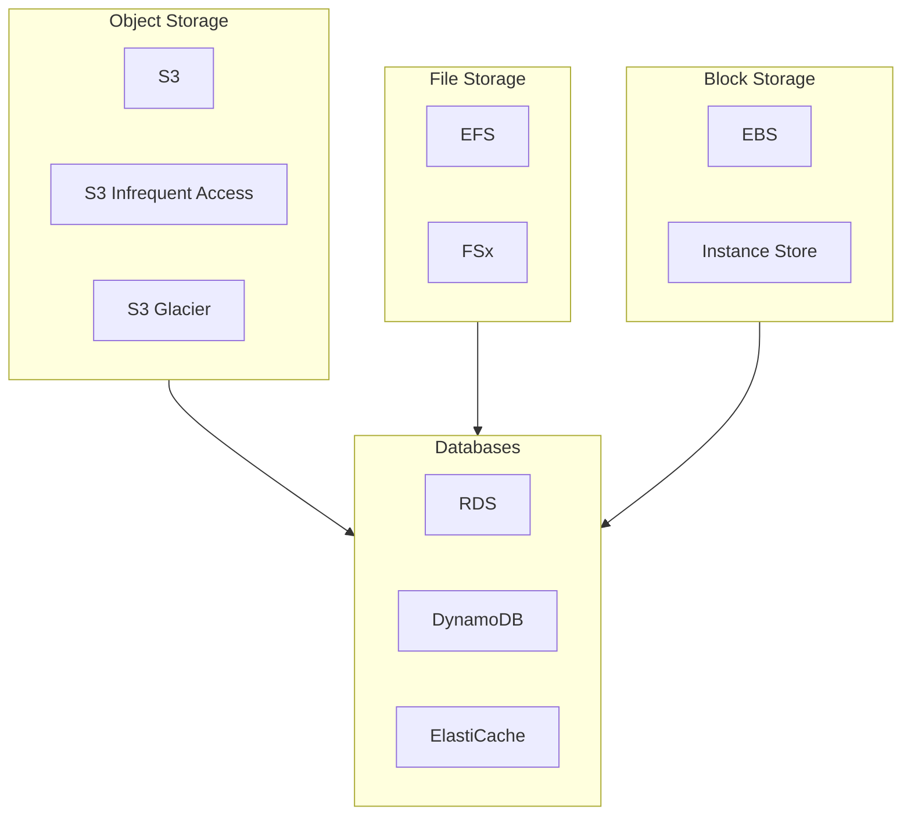

# AWS Storage and Database Technical Whitepaper

> Comprehensive Guide to AWS Data Storage: From Object Storage to Purpose-Built Databases

---

## Table of Contents

> **Learning Guide**: This whitepaper follows a "Storage Types → Database Services → Operations" progression. Master chapters 1-4 (storage foundations) before diving into database selection and operations.

1. **[Storage and Database Overview](#1-storage-and-database-overview)**  
   *Establish global perspective: Understand AWS storage service taxonomy, data access patterns, and decision trees to build a framework for specialized learning.*

2. **[Amazon S3 Object Storage](#2-amazon-s3-object-storage)**  
   *Master cloud storage cornerstone: Deep dive into S3 core concepts, storage classes, and lifecycle management—the most widely used AWS storage service.*

3. **[File Storage Services](#3-file-storage-services)**  
   *Extend file-level storage: Compare EFS and FSx family services; understand when to choose managed filesystems over object storage.*

4. **[Amazon EBS Block Storage](#4-amazon-ebs-block-storage)**  
   *EC2 storage foundation: Learn volume type selection, snapshot strategies, and I/O optimization to design optimal storage for EC2 workloads.*

5. **[Relational Databases](#5-relational-databases)**  
   *Managed database services: Deep dive into RDS and Aurora architecture; master Multi-AZ, read replicas, and Performance Insights.*

6. **[Amazon DynamoDB](#6-amazon-dynamodb)**  
   *NoSQL data modeling: Learn key-value/document database design, partition key strategies, DAX caching, and global tables.*

7. **[In-Memory Databases and Caching](#7-in-memory-databases-and-caching)**  
   *Accelerate data access: Master ElastiCache (Redis/Memcached) and MemoryDB use cases and performance tuning.*

8. **[Purpose-Built Databases](#8-purpose-built-databases)**  
   *Choose for specific workloads: Explore DocumentDB, Keyspaces, Neptune, Timestream, and QLDB for specialized use cases.*

9. **[Data Migration and Integration](#9-data-migration-and-integration)**  
   *Data movement solutions: Learn DMS, SCT, DataSync, and Glue for heterogeneous database migration strategies.*

10. **[Backup and Disaster Recovery](#10-backup-and-disaster-recovery)**  
    *Protect data assets: Compare AWS Backup, snapshots, and cross-region replication; design for RPO/RTO requirements.*

11. **[Performance Optimization and Monitoring](#11-performance-optimization-and-monitoring)**  
    *Improve storage efficiency: Learn CloudWatch storage metrics, Performance Insights, and DynamoDB capacity optimization.*

12. **[Database Containerization and Docker](#12-database-containerization-and-docker)** 🐳  
    *Modern operations: Learn local Docker database development, RDS Proxy, ECS/EKS database deployment, and LocalStack testing.*

13. **[Security and Compliance](#13-security-and-compliance)**  
    *Data security framework: Integrate previous knowledge; learn encryption (KMS), IAM authorization, VPC isolation, and compliance auditing.*

---

## 1. Storage and Database Overview

### 1.1 AWS Storage Service Taxonomy



### 1.2 Storage Decision Matrix

| Requirement | Recommended Service | Why |
|-------------|-------------------|-----|
| Static content hosting | S3 | Cost-effective, durable, CDN integration |
| Shared filesystem | EFS | POSIX-compliant, auto-scaling |
| Database storage | EBS gp3 | Consistent low-latency performance |
| Archive data | S3 Glacier | Lowest cost for infrequent access |

---

## 2. Amazon S3 Object Storage

### 2.1 Core Concepts

- **Buckets**: Global unique namespace containers
- **Objects**: Files with metadata and unique keys
- **Storage Classes**: Standard, IA, Glacier tiers
- **Versioning**: Maintain multiple versions of objects

### 2.2 S3 CLI Commands

```bash
# Create bucket
aws s3 mb s3://my-unique-bucket-name

# Upload file
aws s3 cp localfile.txt s3://my-bucket/

# Sync directory
aws s3 sync ./local-dir s3://my-bucket/remote-dir

# Enable versioning
aws s3api put-bucket-versioning \
    --bucket my-bucket \
    --versioning-configuration Status=Enabled

# Set lifecycle policy
aws s3api put-bucket-lifecycle-configuration \
    --bucket my-bucket \
    --lifecycle-configuration file://lifecycle.json
```

---

(Continue with remaining chapters...)

---

*Version: v1.0*  
*Last Updated: 2026-03-02*
