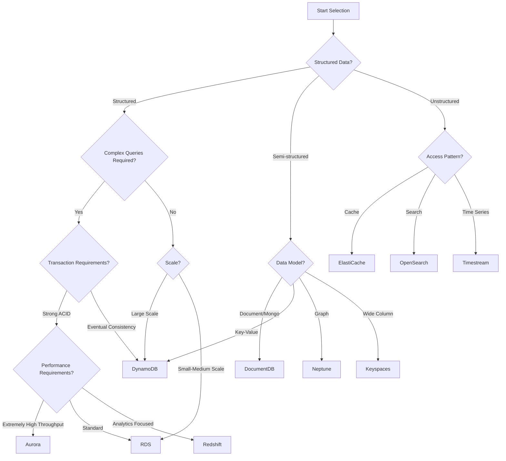

# AWS Database Selection Guide

> Choose the most suitable database service based on business requirements

---

## Selection Decision Tree



---

## Database Service Comparison

### Relational Databases

| Feature | RDS MySQL | RDS PostgreSQL | Aurora MySQL | Aurora PostgreSQL |
|---------|-----------|----------------|--------------|-------------------|
| **Performance** | ⭐⭐⭐ | ⭐⭐⭐ | ⭐⭐⭐⭐⭐ | ⭐⭐⭐⭐⭐ |
| **Scalability** | ⭐⭐ | ⭐⭐ | ⭐⭐⭐⭐ | ⭐⭐⭐⭐ |
| **Cost** | Low | Low | Medium | Medium |
| **Feature Richness** | Medium | High | Medium | High |
| **Serverless** | ❌ | ❌ | ✅ v2 | ✅ v2 |

**Selection Recommendations**:
- **Standard Web Applications**: RDS MySQL/PostgreSQL
- **High Throughput SaaS**: Aurora
- **Need PostgreSQL Advanced Features**: RDS/Aurora PostgreSQL
- **Cost Sensitive + Predictable Workload**: RDS Reserved Instances
- **Uncertain Workload**: Aurora Serverless v2

### NoSQL Databases

| Feature | DynamoDB | DocumentDB | Keyspaces | Neptune |
|---------|----------|------------|-----------|---------|
| **Data Model** | Key-Value/Document | Document | Wide Column | Graph |
| **Consistency** | Configurable | Strong Consistency | Eventual Consistency | Strong Consistency |
| **Scalability** | Unlimited | High | High | High |
| **Query Flexibility** | Medium | High | Medium | Specialized |
| **Latency** | Single-digit ms | Milliseconds | Milliseconds | Milliseconds |

**Selection Recommendations**:
- **Internet-scale Key-Value Storage**: DynamoDB
- **MongoDB Migration**: DocumentDB
- **Cassandra Workloads**: Keyspaces
- **Recommendation Systems/Knowledge Graphs**: Neptune

---

## Scenario-Based Selection

### Scenario 1: E-commerce Platform

```
Requirement Analysis:
├─ Product Catalog: Read-heavy, flexible queries needed
├─ User Data: High concurrency read/write
├─ Order System: Strong consistency transactions
├─ Shopping Cart: Low latency, high availability
├─ Search: Full-text search
└─ Reports: Complex analytical queries

Recommended Architecture:
├─ Product Catalog: DynamoDB (GSI supports multi-dimensional queries)
├─ User Data: DynamoDB (High concurrency)
├─ Order System: Aurora PostgreSQL (ACID transactions)
├─ Shopping Cart: ElastiCache Redis (Session storage)
├─ Search: OpenSearch
└─ Reports: Redshift (Data warehouse)
```

### Scenario 2: IoT Platform

```
Requirement Analysis:
├─ Device Data: Massive writes, time-series characteristics
├─ Device Metadata: Flexible schema
├─ Alert Data: Low latency queries
├─ Historical Analysis: Large data volume scanning
└─ Real-time Dashboard: Aggregation queries

Recommended Architecture:
├─ Time-series Data: Timestream (Dedicated time-series database)
├─ Device Metadata: DynamoDB
├─ Real-time Cache: ElastiCache Redis
├─ Data Lake: S3 + Athena
└─ Real-time Streaming: Kinesis + Lambda
```

### Scenario 3: Financial System

```
Requirement Analysis:
├─ Transaction Data: Strong consistency, immutable
├─ Account Data: ACID transactions
├─ Audit Logs: Non-deletable
├─ Risk Analysis: Complex graph queries
└─ Compliance Requirements: Data encryption, auditing

Recommended Architecture:
├─ Core Transactions: Aurora PostgreSQL
├─ Immutable Records: QLDB
├─ Risk Graph: Neptune
├─ Session/Cache: ElastiCache
└─ Audit: S3 + Glacier
```

### Scenario 4: Content Management System

```
Requirement Analysis:
├─ Content Documents: Flexible schema, JSON
├─ User Generated Content: High concurrency
├─ Media Files: Large object storage
├─ Full-text Search: Content retrieval
└─ Version History: Version control

Recommended Architecture:
├─ Content Documents: DocumentDB (MongoDB compatible)
├─ User Data: DynamoDB
├─ Media Storage: S3 + CloudFront
├─ Full-text Search: OpenSearch
└─ Version Control: S3 Versioning
```

---

## Migration Assessment Matrix

| Source Database | Target AWS Service | Migration Difficulty | Recommended Tools |
|-----------------|-------------------|---------------------|-------------------|
| MySQL | RDS MySQL | ⭐ Low | DMS Native |
| MySQL | Aurora MySQL | ⭐ Low | DMS Native |
| PostgreSQL | RDS PostgreSQL | ⭐ Low | DMS Native |
| PostgreSQL | Aurora PostgreSQL | ⭐ Low | DMS Native |
| Oracle | RDS Oracle | ⭐⭐ Medium | DMS + SCT |
| Oracle | Aurora PostgreSQL | ⭐⭐⭐ High | DMS + SCT |
| SQL Server | RDS SQL Server | ⭐⭐ Medium | DMS Native |
| SQL Server | Aurora PostgreSQL | ⭐⭐⭐ High | Babelfish + DMS |
| MongoDB | DocumentDB | ⭐⭐ Medium | Online Import |
| Cassandra | Keyspaces | ⭐⭐ Medium | cqlsh |
| Redis | ElastiCache | ⭐ Low | Redis Replication |
| Neo4j | Neptune | ⭐⭐⭐ High | Custom Scripts |

---

## Cost Estimation Example

### Scenario: Social App with 1 Million DAU

```python
"""
User Profile:
- DAU: 1,000,000
- Daily operations per user: 100 reads, 10 writes
- Data retention: User data permanent, activity logs 1 year

Database Selection:
"""

# DynamoDB (User Data + Activity Stream)
dynamodb_cost = {
    'write_capacity_units': 10000000 / 86400 * 1.5,  # Account for peak
    'read_capacity_units': 100000000 / 86400 * 1.5,
    'storage_gb': 500,  # User data
    
    'on_demand_monthly': {
        'writes': 10_000_000 * 30 / 1_000_000 * 1.25,  # $1.25 per million
        'reads': 100_000_000 * 30 / 1_000_000 * 0.25,  # $0.25 per million
        'storage': 500 * 0.25,
        'total': 375 + 750 + 125  # ~$1,250/month
    }
}

# Aurora Serverless v2 (Relational Data: Friendships, Private Messages)
aurora_cost = {
    'min_acu': 4,
    'max_acu': 64,
    'avg_acu': 16,
    
    'monthly': {
        'compute': 16 * 730 * 0.12,  # $0.12 per ACU-hour
        'storage': 200 * 0.10,        # $0.10 per GB-month
        'io': 1000000 * 0.20 / 1000000,  # $0.20 per million IOs
        'total': 1401.6 + 20 + 0.2  # ~$1,422/month
    }
}

# ElastiCache Redis (Sessions + Hot Data)
redis_cost = {
    'node_type': 'cache.r6g.xlarge',
    'node_count': 3,  # Primary + Replica
    
    'monthly': {
        'nodes': 3 * 730 * 0.219,  # $0.219 per hour
        'total': 479.61  # ~$480/month
    }
}

# S3 (Media Storage)
s3_cost = {
    'storage_tb': 10,
    'requests_million': 50,
    
    'monthly': {
        'storage': 10000 * 0.023,
        'requests': 50 * 0.005,
        'bandwidth': 5000 * 0.09,  # 5TB egress traffic
        'total': 230 + 0.25 + 450  # ~$680/month
    }
}

print(f"""
Estimated Monthly Cost (1M DAU Social App):
├── DynamoDB:     ~$1,250
├── Aurora:       ~$1,422
├── ElastiCache:  ~$480
├── S3:           ~$680
└── Total:        ~$3,832/month

Alternative Comparison:
├── Fully Self-hosted (EC2): ~$2,500 (requires ops staff)
├── Hybrid Solution:  ~$3,000
└── Fully Managed:    ~$3,832 (Recommended, zero ops)
""")
```

---

## Common Pitfalls

### ❌ Pitfall 1: One Database for Everything

**Problem**: Trying to solve all problems with a single database

**Consequences**: 
- Performance bottlenecks
- Cost waste
- Technical debt

**Correct Approach**: Adopt Polyglot Persistence

```
Microservices Architecture Example:
├── User Service: DynamoDB (High concurrency)
├── Order Service: Aurora (ACID)
├── Product Service: DocumentDB (Flexible schema)
├── Recommendation Service: Neptune (Graph queries)
└── Cache Layer: ElastiCache
```

### ❌ Pitfall 2: Ignoring Data Access Patterns

**Problem**: Selecting based on data structure only, without considering query patterns

**Examples**:
```
❌ Wrong: Frequent scan operations in DynamoDB
✅ Correct: Use composite keys + GSI to support query patterns

❌ Wrong: Storing unstructured JSON in RDS
✅ Correct: Use DocumentDB or DynamoDB
```

### ❌ Pitfall 3: Over-engineering

**Problem**: Designing for scale you don't need

**Recommendations**:
- MVP Phase: RDS Single AZ
- Growth Phase: RDS Multi-AZ + Read Replicas
- Large Scale: Consider Aurora or DynamoDB

---

## Selection Checklist

```markdown
## Database Selection Checklist

### Functional Requirements
- [ ] Does data model match (Relational/Document/Key-Value/Graph)?
- [ ] Transaction requirements (ACID vs Eventual Consistency)?
- [ ] Query complexity (Simple key lookup vs Complex JOIN)?
- [ ] Full-text search requirements?
- [ ] Geospatial query requirements?

### Non-functional Requirements
- [ ] Expected latency (< 10ms / < 100ms / < 1s)?
- [ ] Throughput requirements (TPS)?
- [ ] Data volume (GB / TB / PB)?
- [ ] Growth rate prediction?
- [ ] Multi-region deployment needs?

### Operational Requirements
- [ ] Team technology stack?
- [ ] Operations staff investment?
- [ ] Compliance requirements (encryption, auditing)?
- [ ] Backup/Recovery requirements (RTO/RPO)?

### Cost Assessment
- [ ] Current cost estimate?
- [ ] Cost prediction after growth?
- [ ] Reserved Instances/Savings Plans feasibility?
```

---

## Summary

Database selection is a critical system architecture decision. Remember:

1. **No Silver Bullet**: Different scenarios require different databases
2. **Access Patterns First**: Query patterns determine data models
3. **Start Small**: Avoid over-engineering, evolve as needed
4. **Cost Awareness**: Managed services save operational costs that may exceed price differences
5. **Team Capability**: Choose technologies your team can master

Use this guide as a starting point and make informed decisions based on actual business requirements!
